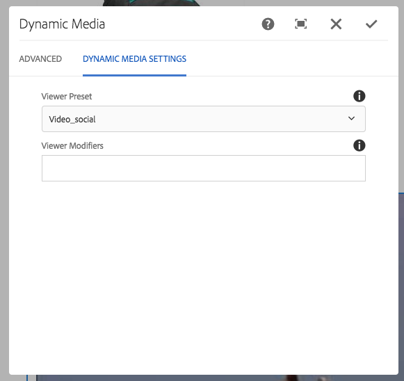

# Dynamic Media-assets aan pagina&#39;s toevoegen {#adding-dynamic-media-assets-to-pages}

To add the dynamic media functionality to assets you use on your websites, you can add the **Dynamic Media** or **Interactive Media** component directly on the page. U doet dit door de modus Lay-out in te voeren en de dynamische mediacomponenten in te schakelen. Vervolgens kunt u deze componenten aan de pagina toevoegen en assets aan de component toevoegen. De dynamische media en interactieve mediacomponenten zijn slim: ze weten of u een afbeelding of video toevoegt en de beschikbare opties veranderen dienovereenkomstig.

U voegt dynamische media-elementen rechtstreeks aan de pagina toe als u AEM gebruikt als uw WCM. Als u een oplossing van derden gebruikt voor uw WCM, moet u uw assets [koppelen](linking-urls-to-yourwebapplication.md) of [insluiten](embed-code.md). Voor een responsieve website van derden raadpleegt u het [leveren van geoptimaliseerde afbeeldingen op een responsieve site](responsive-site.md).

>[!NOTE]
>
>U moet elementen publiceren voordat u deze aan pagina&#39;s in AEM toevoegt. See [Publishing Dynamic Media Assets](publishing-dynamicmedia-assets.md).

## Een component Dynamische media aan een pagina toevoegen {#adding-a-dynamic-media-component-to-a-page}

Het toevoegen van een component Dynamische media aan een pagina is hetzelfde als het toevoegen van een component aan een pagina. De componenten Dynamische media worden in de volgende secties uitgebreid beschreven.

>[!NOTE]
>
>Als er een component Dynamic Media op een webpagina staat die wordt benaderd door een gebruiker met de machtiging Alleen-lezen, worden de pagina-einden en de componenten niet correct weergegeven. De reden hiervoor is dat de pagina opnieuw wordt samengesteld om ervoor te zorgen dat de eigenschappen van de componenten goed zijn en dat de bestanden en configuraties waarnaar wordt verwezen toegankelijk zijn. De pagina wordt vervolgens opnieuw gerenderd, waardoor de componenten worden verbroken. de respectievelijke componentcode op de pagina kan niet opnieuw worden weergegeven vanwege de alleen-lezen toegang van de gebruiker.
>  
>Om dit probleem te voorkomen, moet u ervoor zorgen dat AEM Sites-gebruikers de benodigde machtigingen hebben om toegang te krijgen tot de middelen.

1. Open in AEM de pagina waaraan u de component Dynamische media wilt toevoegen.
1. Klik op het **[!UICONTROL Components]** pictogram in het deelvenster aan de linkerkant van de pagina (mogelijk moet u de weergave van het zijpaneel in- of uitschakelen).
1. Selecteer onder de **[!UICONTROL Components]** kop in de vervolgkeuzelijst de optie **[!UICONTROL Dynamic Media]**. Als geen lijst van Dynamische componenten van Media beschikbaar is, moet u waarschijnlijk de Dynamische componenten van Media toelaten die u wilt gebruiken. Zie [Dynamische mediacomponenten](#enabling-dynamic-media-components)inschakelen.

   

1. Sleep een component Dynamische media die u wilt gebruiken naar de pagina op de gewenste locatie.
1. Houd de muisaanwijzer rechtstreeks boven de component. Tik eenmaal om de werkbalk van de component weer te geven wanneer de component is omringd door een blauw vak. Tik op het pictogram **[!UICONTROL Configuration]** (moersleutel).
1. [Bewerk indien nodig de componenten](#dynamic-media-components) en klik op het vinkje om de wijzigingen op te slaan.

### Dynamische mediacomponenten inschakelen {#enabling-dynamic-media-components}

Als er geen dynamische mediacomponenten beschikbaar zijn om aan een pagina toe te voegen, betekent dit waarschijnlijk dat u eerst de componenten moet inschakelen die u wilt gebruiken.

1. Open in AEM de pagina waaraan u de component Dynamische media wilt toevoegen.
1. Tik links op de werkbalk naast de pagina op het pictogram Pagina-informatie en tik vervolgens **[!UICONTROL Edit Template]** in de vervolgkeuzelijst.

   

1. Tik in de vervolgkeuzelijst rechts van de werkbalk naast de pagina op **[!UICONTROL Structure]**.

   

1. Tik onder aan de pagina **[!UICONTROL Layout Container]** op de werkbalk om deze te openen en tik vervolgens op het pictogram Beleid.
1. Controleer of op de **[!UICONTROL Layout Container]** pagina onder de **[!UICONTROL Properties]** kop de **[!UICONTROL Allowed Components]** tab is geselecteerd.

   

1. Schuif totdat u het ziet **[!UICONTROL Dynamic Media]**.
1. Tik op het pictogram > links van **[!UICONTROL Dynamic Media]** om de lijst uit te vouwen, selecteer de dynamische mediacomponenten die u wilt inschakelen.

   

1. Tik in de rechterbovenhoek van de **[!UICONTROL Layout Container]** pagina op het pictogram Gereed (vinkje).

1. Tik in de vervolgkeuzelijst rechts op de werkbalk boven aan de pagina op **[!UICONTROL Initial Content]** en [voeg op de gebruikelijke manier een component Dynamische media aan een pagina](#adding-a-dynamic-media-component-to-a-page) toe.

## Dynamische mediacomponenten lokaliseren {#localizing-dynamic-media-components}

U kunt dynamische mediacomponenten op twee manieren lokaliseren:

* Open **[!UICONTROL Properties]** en selecteer het tabblad **[!UICONTROL Advanced]** op een webpagina in Sites. Selecteer de gewenste taal voor lokalisatie.

   

* Selecteer de gewenste pagina of paginagroep in de sitekiezer. Tik **[!UICONTROL Properties]** en selecteer de **[!UICONTROL Advanced]** tab. Selecteer de gewenste taal voor lokalisatie.

   >[!NOTE]
   >
   >Niet alle talen in het **[!UICONTROL Language]** menu hebben tokens toegewezen.

## Dynamische mediacomponenten {#dynamic-media-components}

Dynamische media en Interactieve media zijn beschikbaar onder het [!UICONTROL Dynamic Media] tabblad in [!UICONTROL Components]. U gebruikt de [!UICONTROL Interactive Media] component voor alle interactieve elementen, zoals interactieve video, interactieve afbeeldingen of carrouselsets. Gebruik voor alle andere dynamische mediacomponenten de component Dynamic Media.

>[!NOTE]
>
>Deze componenten zijn niet standaard beschikbaar en moeten via de sjablooneditor beschikbaar worden gemaakt voordat ze kunnen worden gebruikt. [Nadat ze in de sjablooneditor beschikbaar](/help/sites-authoring/templates.md#editing-templates-template-authors) zijn gemaakt, kunt u de componenten aan de pagina toevoegen, net als elke andere AEM.

### Dynamische media-component {#dynamic-media-component}

De component Dynamische media is slim. Afhankelijk van het feit of u een afbeelding of video toevoegt, hebt u verschillende opties. De component ondersteunt voorinstellingen voor afbeeldingen, op afbeeldingen gebaseerde viewers, zoals afbeeldingssets, centrifuges, gemengde mediasets en video. Bovendien reageert de viewer snel. De grootte van het scherm verandert dus automatisch op basis van de schermgrootte. Alle viewers zijn HTML5-viewers.

>[!NOTE]
>
>Als er een component van de Media van de Dynamische, Interactieve component van Media, of allebei op een Web-pagina is die door een gebruiker met read-only toestemmingen wordt betreden, de pagina einden en de componenten worden niet correct teruggegeven. De reden hiervoor is dat de pagina opnieuw wordt samengesteld om ervoor te zorgen dat de eigenschappen van de componenten goed zijn en dat de bestanden en configuraties waarnaar wordt verwezen toegankelijk zijn. De pagina wordt vervolgens opnieuw gerenderd, waardoor de componenten worden verbroken. de respectievelijke componentcode op de pagina kan niet opnieuw worden weergegeven vanwege de alleen-lezen toegang van de gebruiker.
>  
>Om dit probleem te voorkomen, moet u ervoor zorgen dat AEM Sites-gebruikers de benodigde machtigingen hebben om toegang te krijgen tot de middelen.

>[!NOTE]
>
>Wanneer u de component Dynamische media toevoegt en leeg **[!UICONTROL Dynamic Media Settings]** is of wanneer u een element niet correct kunt toevoegen, controleert u het volgende:
>
>* Dynamische media is [ingeschakeld](config-dynamic.md). Dynamische media is standaard uitgeschakeld.
>* De afbeelding heeft een piramideTIFF-bestand. Afbeeldingen die zijn geïmporteerd voordat dynamische media is ingeschakeld, hebben geen TIFF-bestand met piramide.

>

#### Wanneer u met afbeeldingen werkt {#when-working-with-images}

Met de component Dynamische media kunt u dynamische afbeeldingen toevoegen, zoals afbeeldingssets, centrifuges en gemengde mediasets. U kunt inzoomen, uitzoomen en, indien van toepassing, een afbeelding binnen een centrifugeset draaien of een afbeelding van een ander type set selecteren.

U kunt de viewervoorinstelling, afbeeldingsvoorinstelling of afbeeldingsindeling ook rechtstreeks in de component configureren. Als u een afbeelding responsief wilt maken, kunt u de onderbrekingspunten instellen of een responsieve voorinstelling voor de afbeelding toepassen.

U moet de volgende instellingen voor dynamische media bewerken door op het **[!UICONTROL Edit]** pictogram in de component te klikken en vervolgens **[!UICONTROL Dynamic Media Settings]**.

>[!NOTE]
>
>Standaard is de afbeeldingscomponent voor dynamische media adaptief. If you want to make it a fixed size, set it in the component in the **[!UICONTROL Advanced]** tab with the **[!UICONTROL Width]** and **[!UICONTROL Height]** settings.

* **[!UICONTROL Viewer preset]**
Selecteer een bestaande viewervoorinstelling in het keuzemenu. Als de viewervoorinstelling die u zoekt niet zichtbaar is, moet u deze mogelijk zichtbaar maken. Zie Viewer-voorinstellingen beheren. U kunt geen viewervoorinstelling selecteren als u een voorinstelling voor afbeeldingen gebruikt en andersom.
Dit is de enige beschikbare optie als u beeldreeksen, spin reeksen, of gemengde media reeksen bekijkt. De weergegeven viewervoorinstellingen zijn ook slim. Alleen relevante viewervoorinstellingen worden weergegeven.

* **[!UICONTROL Viewer modifiers]**
Viewer-modifiers hebben de vorm van name=value pair met een &amp;-scheidingsteken en laten u viewers wijzigen zoals wordt beschreven in de Viewer Reference Guide. Een voorbeeld van een viewermodifier is posterimage=img.jpg&amp;caption=text.vtt,1, die een andere afbeelding instelt voor de videominiatuur en een bestand met een gesloten bijschrift/subtitel koppelt aan de video.

* **[!UICONTROL Image preset]**
Selecteer een bestaande voorinstelling voor afbeeldingen in het keuzemenu. Als de voorinstelling die u zoekt niet zichtbaar is, moet u deze mogelijk zichtbaar maken. Zie Voorinstellingen afbeelding beheren. U kunt geen viewervoorinstelling selecteren als u een voorinstelling voor afbeeldingen gebruikt en andersom.
Deze optie is niet beschikbaar als u afbeeldingssets, centrifuges of gemengde mediasets bekijkt.

* **[!UICONTROL Image Modifiers]**
U kunt afbeeldingseffecten toepassen door extra opdrachten voor afbeeldingen te geven. Deze worden beschreven in Voorinstellingen afbeelding en de verwijzing Opdracht Beeldserver.
Deze optie is niet beschikbaar als u afbeeldingssets, centrifuges of gemengde mediasets bekijkt.

* **[!UICONTROL Breakpoints]**
Als u dit middel op een ontvankelijke plaats gebruikt, moet u de beeldbreekpunten toevoegen. Afbeeldingsonderbrekingspunten moeten door komma&#39;s (,) worden gescheiden. Deze optie werkt wanneer er geen hoogte of breedte is gedefinieerd in een voorinstelling voor afbeeldingen.
Deze optie is niet beschikbaar als u afbeeldingssets, centrifuges of gemengde mediasets bekijkt.
You can edit the following Advanced Settings by clicking **[!UICONTROL Edit]** in the component.

* **[!UICONTROL Title]**
Wijzig de titel van de afbeelding.

* **[!UICONTROL Alt Text]**
Voeg een titel toe aan de afbeelding voor gebruikers die afbeeldingen hebben uitgeschakeld.
Deze optie is niet beschikbaar als u afbeeldingssets, centrifuges of gemengde mediasets bekijkt.

* **[!UICONTROL URL, Open in]**
U kunt een element zo instellen dat een koppeling wordt geopend. Stel de URL in en kies Openen in om aan te geven of deze in hetzelfde venster of in een nieuw venster moet worden geopend.
Deze optie is niet beschikbaar als u afbeeldingssets, centrifuges of gemengde mediasets bekijkt.

* **[!UICONTROL Width]** en **[!UICONTROL Height]** Voer een waarde in pixels in als u wilt dat de afbeelding een vaste grootte heeft. Als u deze waarden niet invult, wordt het element adaptief.

#### Wanneer u werkt met video {#when-working-with-video}

Met de component Dynamische media kunt u dynamische video toevoegen aan uw webpagina&#39;s. Wanneer u de component bewerkt, kunt u een vooraf gedefinieerde videoviewer gebruiken om de video op de pagina af te spelen.

U moet de volgende instellingen voor dynamische media bewerken door in **[!UICONTROL Edit]** de component te klikken.

>[!NOTE]
>
>Standaard is de videocomponent Dynamic Media adaptief. If you want to make it a fixed size, set it in the component with the **[!UICONTROL Width]** and **[!UICONTROL Height]** in the [!UICONTROL Advanced] tab.

* **[!UICONTROL Viewer preset]**
Selecteer een bestaande voorinstelling voor een videoviewer in het keuzemenu. Als de viewervoorinstelling die u zoekt niet zichtbaar is, moet u deze mogelijk zichtbaar maken. Zie Viewer-voorinstellingen beheren.

* **[!UICONTROL Viewer modifiers]**
Viewer-modifiers hebben de vorm van name=value pair met een &amp;-scheidingsteken en laten u viewers wijzigen zoals beschreven in de Adobe Viewers Reference Guide. Een voorbeeld van een viewermodifier is posterimage=img.jpg&amp;caption=text.vtt,1

   Met viewermodifiers kunt u bijvoorbeeld het volgende doen:

   * Koppel een bijschriftbestand aan een [videobijschrift.](https://docs.adobe.com/content/help/en/dynamic-media-developer-resources/library/viewers-aem-assets-dmc/video/command-reference-url-video/r-html5-video-viewer-url-caption.html)
   * Koppel een navigatiebestand aan een [videonavigatie.](https://docs.adobe.com/content/help/en/dynamic-media-developer-resources/library/viewers-aem-assets-dmc/video/command-reference-url-video/r-html5-video-viewer-url-navigation.html)

U kunt het volgende bewerken [!UICONTROL Advanced Settings] door in de component te klikken **[!UICONTROL Edit]** .

* **[!UICONTROL Title]**
Wijzig de titel van de video.

* **[!UICONTROL Width]** en **[!UICONTROL Height]** Voer een waarde in pixels in als u wilt dat de video een vaste grootte heeft. Als u deze waarden niet invult, wordt het adaptief.

#### Wanneer u werkt met Slim uitsnijden {#when-working-with-smart-crop}

Met de component Dynamische media kunt u SmartCrop-afbeeldingselementen toevoegen aan uw webpagina&#39;s. Wanneer u de component bewerkt, kunt u een vooraf gedefinieerde videoviewer gebruiken om de video op de pagina af te spelen.

Zie ook [Afbeeldingsprofielen](image-profiles.md).

U kunt het volgende bewerken [!UICONTROL Dynamic Media Settings] door in de component te klikken **[!UICONTROL Edit]** .

>[!NOTE]
>
>Standaard is de afbeeldingscomponent voor dynamische media adaptief. Als u een vaste grootte wilt instellen, stelt u dit in de component op het tabblad [!UICONTROL Advanced] met **[!UICONTROL Width]** en **[!UICONTROL Height]** in.

* **[!UICONTROL Image Modifiers]**
U kunt afbeeldingseffecten toepassen door extra opdrachten voor afbeeldingen te geven. Deze worden beschreven in Voorinstellingen afbeelding en de verwijzing Opdracht Beeldserver.
Deze optie is niet beschikbaar als u afbeeldingssets, centrifuges of gemengde mediasets bekijkt.

You can edit the following **[!UICONTROL Advanced]** settings by clicking **[!UICONTROL Edit]** in the component.

* **[!UICONTROL Title]**
Wijzig de titel van de afbeelding voor slim uitsnijden.

* **[!UICONTROL Alt Text]**
Voeg een titel toe aan de slimme-uitsnijdafbeelding voor gebruikers die afbeeldingen hebben uitgeschakeld.
Deze optie is niet beschikbaar als u afbeeldingssets, centrifuges of gemengde mediasets bekijkt.

* **[!UICONTROL URL, Open in]**
U kunt een element zo instellen dat een koppeling wordt geopend. Stel de URL in en kies Openen in om aan te geven of deze in hetzelfde venster of in een nieuw venster moet worden geopend.
Deze optie is niet beschikbaar als u afbeeldingssets, centrifuges of gemengde mediasets bekijkt.

* **[!UICONTROL Height]** en **[!UICONTROL Width]** Voer een waarde in pixels in als u wilt dat de slimme uitsnijdafbeelding een vaste grootte heeft. Als u deze waarden niet invult, wordt het adaptief.

### Interactieve mediacomponent {#interactive-media-component}

De interactieve component van Media is voor die activa die interactiviteit op hen zoals hotspots of beeldkaarten hebben. Als u een interactieve afbeelding, interactieve video of carrouselbanner hebt, gebruikt u de component Interactieve media.

De component Interactieve media is slim. Afhankelijk van het feit of u een afbeelding of video toevoegt, hebt u verschillende opties. Bovendien reageert de viewer snel - de grootte van het scherm verandert automatisch op basis van de schermgrootte. Alle viewers zijn HTML5-viewers.

>[!NOTE]
>
>Als er een component van de Media van de Dynamische, Interactieve component van Media, of allebei op een Web-pagina is die door een gebruiker met read-only toestemmingen wordt betreden, de pagina einden en de componenten worden niet correct teruggegeven. De reden hiervoor is dat de pagina opnieuw wordt samengesteld om ervoor te zorgen dat de eigenschappen van de componenten goed zijn en dat de bestanden en configuraties waarnaar wordt verwezen toegankelijk zijn. De pagina wordt vervolgens opnieuw gerenderd, waardoor de componenten worden verbroken. de respectievelijke componentcode op de pagina kan niet opnieuw worden weergegeven vanwege de alleen-lezen toegang van de gebruiker.
> 
>Om dit probleem te voorkomen, moet u ervoor zorgen dat AEM Sites-gebruikers de benodigde machtigingen hebben om toegang te krijgen tot de middelen.

You can edit the following **[!UICONTROL General]** settings by clicking **[!UICONTROL Edit]** in the component.

* **[!UICONTROL Viewer preset]**
Selecteer een bestaande viewervoorinstelling in het keuzemenu. Als de viewervoorinstelling die u zoekt niet zichtbaar is, moet u deze mogelijk zichtbaar maken. Voorinstellingen voor viewers moeten worden gepubliceerd voordat ze kunnen worden gebruikt. Zie Viewer-voorinstellingen beheren.

* **[!UICONTROL Title]**
Wijzig de titel van de video.

* **[!UICONTROL Width]** en **[!UICONTROL Height]** Voer een waarde in pixels in als u wilt dat de video een vaste grootte heeft. Als u deze waarden niet invult, wordt het adaptief.

You can edit the following **[!UICONTROL Add To Cart]** settings by clicking **[!UICONTROL Edit]** in the component.

* **[!UICONTROL Show Product Asset]**
Deze waarde is standaard geselecteerd. Het productelement toont een afbeelding van het product zoals gedefinieerd in de module Handel. Schakel het vinkje uit om het productelement niet weer te geven.

* **[!UICONTROL Show Product Price]**
Deze waarde is standaard geselecteerd. De prijs van het product is de prijs van het object zoals gedefinieerd in de module Handel. Schakel het vinkje uit om de productprijs niet weer te geven.

* **[!UICONTROL Show Product Form]**
Deze waarde is standaard niet geselecteerd. Het productformulier bevat alle productvarianten zoals grootte en kleur. Schakel het vinkje uit om de productvarianten niet weer te geven.

### Panoramische mediacomponent {#panoramic-media-component}

Panoramische media-component is bedoeld voor die elementen die bolvormige panoramische afbeeldingen zijn. Dergelijke afbeeldingen bieden een kijkervaring van 360° voor een ruimte, eigenschap, locatie of landschap. Een afbeelding kan alleen als bolvormig panorama worden beschouwd als de afbeelding een van de volgende opties of beide heeft:

* Een hoogte-breedteverhouding van 2:1.
* Gelabeld met de trefwoorden &quot;equirechthoekig&quot; of (&quot;bolvormig&quot; + &quot;panorama&quot;) of (&quot;bolvormig&quot; + &quot;panoramisch&quot;). Zie [Tags](/help/sites-authoring/tags.md)gebruiken.

Zowel zijn de aspectverhouding als de sleutelwoordcriteria van toepassing op panoramische activa voor de de detailpagina van activa en de component van &quot;Panoramische Media&quot; WCM.

U kunt de volgende instelling bewerken door in de component te tikken. **[!UICONTROL Configure]**

* **[!UICONTROL Viewer Preset]**
Selecteer een bestaande viewer in het vervolgkeuzemenu met voorinstellingen voor viewer.

Als de viewervoorinstelling die u zoekt niet zichtbaar is, controleert u of deze is gepubliceerd. U moet viewervoorinstellingen publiceren voordat u deze kunt gebruiken. Zie Voorinstellingen [van viewers](managing-viewer-presets.md)beheren.

### HTTP/2 gebruiken om dynamische media-elementen te leveren {#using-http-to-delivery-dynamic-media-assets}

HTTP/2 is het nieuwe, bijgewerkte webprotocol dat de manier verbetert waarop browsers en servers communiceren. Het zorgt voor een snellere overdracht van informatie en vermindert de hoeveelheid verwerkingskracht die nodig is. De levering van dynamische media-elementen kan nu plaatsvinden via HTTP/2, wat betere responstijd en laadtijden biedt.

Zie [HTTP2 Levering van Inhoud](http2.md) voor volledige details over begonnen worden het gebruiken van HTTP/2 met uw Dynamische rekening van Media.

>[!MORELIKETHIS]
>
>* [Werken met kleurbeheer met AEM dynamische media](https://helpx.adobe.com/experience-manager/kt/assets/using/dynamic-media-color-management-technical-video-setup.html)
>* [Aangepaste videominiatuur gebruiken met AEM dynamische media](https://helpx.adobe.com/experience-manager/kt/assets/using/dynamic-media-video-thumbnails-feature-video-use.html)
>* [De Asset Viewer begrijpen met AEM Dynamic Media](https://helpx.adobe.com/experience-manager/kt/assets/using/dynamic-media-viewer-feature-video-understand.html)
>* [Interactieve video gebruiken met AEM dynamische media](https://helpx.adobe.com/experience-manager/kt/assets/using/dynamic-media-interactive-video-feature-video-use.html)
>* [De videospeler gebruiken in AEM Dynamic Media](https://helpx.adobe.com/experience-manager/kt/assets/using/dynamic-media-video-player-feature-video-use.html)
>* [Afbeelding verscherpen gebruiken met AEM dynamische media](https://helpx.adobe.com/experience-manager/6-4/assets/using/best-practices-for-optimizing-the-quality-of-your-images.html)

