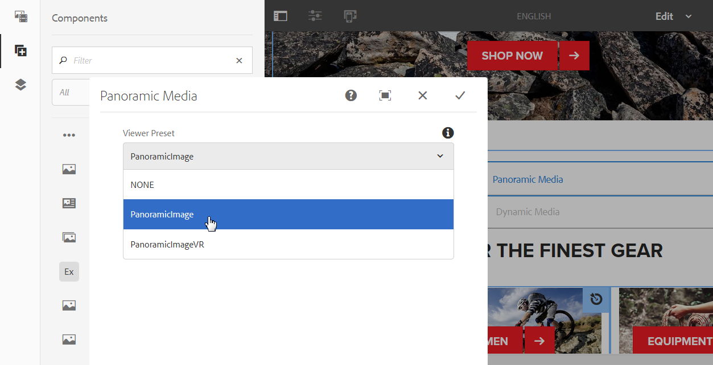

# Dynamic Media-assets aan pagina&#39;s toevoegen {#adding-dynamic-media-assets-to-pages}

Als u de functionaliteit voor dynamische media wilt toevoegen aan elementen die u op uw websites gebruikt, kunt u de component **Dynamische media** of **Interactieve media** rechtstreeks op de pagina toevoegen. U doet dit door de modus Lay-out in te voeren en de dynamische mediacomponenten in te schakelen. Vervolgens kunt u deze componenten aan de pagina toevoegen en elementen aan de component toevoegen. De dynamische media en interactieve mediacomponenten zijn slim: ze weten of u een afbeelding of video toevoegt en de beschikbare opties veranderen dienovereenkomstig.

U voegt dynamische media-elementen rechtstreeks aan de pagina toe als u AEM als uw WCM gebruikt. Als u een derde voor uw WCM gebruikt, of [verbinding](linking-urls-to-yourwebapplication.md) of [bedt](embed-code.md) uw activa in. Voor een responsieve website van derden raadpleegt u het [leveren van geoptimaliseerde afbeeldingen op een responsieve site](responsive-site.md).

>[!NOTE]
>
>U moet elementen publiceren voordat u deze aan pagina&#39;s in AEM toevoegt. See [Publishing Dynamic Media Assets](publishing-dynamicmedia-assets.md).

## Een component Dynamische media aan een pagina toevoegen {#adding-a-dynamic-media-component-to-a-page}

Het toevoegen van de component Dynamische media of Interactieve media aan een pagina is hetzelfde als het toevoegen van een component aan een pagina. De componenten Dynamische media en Interactieve media worden in de volgende secties gedetailleerd beschreven.

>[!NOTE]
>
>Als er een component van de Media van de Dynamische, Interactieve component van Media, of allebei op een Web-pagina is die door een gebruiker met read-only toestemmingen wordt betreden, de pagina einden en de componenten worden niet correct teruggegeven. De reden hiervoor is dat de pagina opnieuw wordt samengesteld om ervoor te zorgen dat de eigenschappen van de componenten goed zijn en dat de bestanden en configuraties waarnaar wordt verwezen toegankelijk zijn. De pagina wordt vervolgens opnieuw gerenderd, waardoor de componenten worden verbroken. de respectievelijke componentcode op de pagina kan niet opnieuw worden weergegeven vanwege de alleen-lezen toegang van de gebruiker.
>  
>Zorg ervoor dat gebruikers van AEM-sites over de benodigde machtigingen beschikken om toegang te krijgen tot de elementen om dit probleem te voorkomen.

1. Open in AEM de pagina waaraan u de component Dynamische media of Interactieve media wilt toevoegen.
1. Klik in het linkerdeelvenster op het pictogram **[!UICONTROL Componenten]** en filter voor **[!UICONTROL Dynamische media]**. Als er geen Dynamic Media-component beschikbaar is, moet u de Dynamic Media-componenten inschakelen. Zie [Paginasjablonen](/help/sites-authoring/templates.md#editing-templates-template-authors) bewerken voor meer informatie.

   

1. Sleep de component **[!UICONTROL Dynamische media]** of **[!UICONTROL Interactieve media]** naar de pagina op de gewenste locatie.
1. Klik op het blauwe vak rondom de component en tik vervolgens op het pictogram **[!UICONTROL Configuratie]** (moersleutel).
1. [Bewerk indien nodig de componenten](#dynamic-media-components) en klik op het vinkje om de wijzigingen op te slaan.

## Dynamische mediacomponenten lokaliseren {#localizing-dynamic-media-components}

U kunt dynamische mediacomponenten op twee manieren lokaliseren:

* Open **[!UICONTROL Eigenschappen]** op een webpagina in Sites en selecteer het tabblad **[!UICONTROL Geavanceerd]** . Selecteer de gewenste taal voor lokalisatie.

   

* Selecteer de gewenste pagina of paginagroep in de sitekiezer. Tik op **[!UICONTROL Eigenschappen]** en selecteer het tabblad **[!UICONTROL Geavanceerd]** . Selecteer de gewenste taal voor lokalisatie.

   >[!NOTE]
   >
   >Niet alle talen die in het menu **[!UICONTROL Taal]** beschikbaar zijn, hebben tokens toegewezen.

## Dynamische mediacomponenten {#dynamic-media-components}

Dynamische media en Interactieve media zijn beschikbaar onder het tabblad [!UICONTROL Dynamische media] in [!UICONTROL Componenten]. U gebruikt de component Interactive Media] voor alle interactieve elementen, zoals interactieve video, interactieve afbeeldingen of carrouselsets. Gebruik voor alle andere dynamische mediacomponenten de component Dynamic Media.

>[!NOTE]
>
>Deze componenten zijn niet standaard beschikbaar en moeten via de sjablooneditor beschikbaar worden gemaakt voordat ze kunnen worden gebruikt. [Nadat ze beschikbaar zijn gesteld](/help/sites-authoring/templates.md#editing-templates-template-authors)in de sjablooneditor, kunt u de componenten aan de pagina toevoegen, net als alle andere AEM-componenten.

### Dynamische media-component {#dynamic-media-component}

De component Dynamische media is slim. Afhankelijk van het feit of u een afbeelding of video toevoegt, hebt u verschillende opties. De component ondersteunt voorinstellingen voor afbeeldingen, op afbeeldingen gebaseerde viewers, zoals afbeeldingssets, centrifuges, gemengde mediasets en video. Bovendien reageert de viewer snel. De grootte van het scherm verandert dus automatisch op basis van de schermgrootte. Alle viewers zijn HTML5-viewers.

>[!NOTE]
>
>Als er een component van de Media van de Dynamische, Interactieve component van Media, of allebei op een Web-pagina is die door een gebruiker met read-only toestemmingen wordt betreden, de pagina einden en de componenten worden niet correct teruggegeven. De reden hiervoor is dat de pagina opnieuw wordt samengesteld om ervoor te zorgen dat de eigenschappen van de componenten goed zijn en dat de bestanden en configuraties waarnaar wordt verwezen toegankelijk zijn. De pagina wordt vervolgens opnieuw gerenderd, waardoor de componenten worden verbroken. de respectievelijke componentcode op de pagina kan niet opnieuw worden weergegeven vanwege de alleen-lezen toegang van de gebruiker.
>  
>Zorg ervoor dat gebruikers van AEM-sites over de benodigde machtigingen beschikken om toegang te krijgen tot de elementen om dit probleem te voorkomen.

>[!NOTE]
>
>Wanneer u de component Dynamische media toevoegt en **[!UICONTROL Dynamische media-instellingen]** leeg zijn of een element niet correct kunt toevoegen, controleert u het volgende:
>
>* Dynamische media is [ingeschakeld](config-dynamic.md). Dynamische media is standaard uitgeschakeld.
>* De afbeelding heeft een piramideTIFF-bestand. Afbeeldingen die zijn geïmporteerd voordat dynamische media is ingeschakeld, hebben geen TIFF-bestand met piramide.
>

#### Wanneer u met afbeeldingen werkt {#when-working-with-images}

Met de component Dynamische media kunt u dynamische afbeeldingen toevoegen, zoals afbeeldingssets, centrifuges en gemengde mediasets. U kunt inzoomen, uitzoomen en, indien van toepassing, een afbeelding binnen een centrifugeset draaien of een afbeelding van een ander type set selecteren.

U kunt de viewervoorinstelling, afbeeldingsvoorinstelling of afbeeldingsindeling ook rechtstreeks in de component configureren. Als u een afbeelding responsief wilt maken, kunt u de onderbrekingspunten instellen of een responsieve voorinstelling voor de afbeelding toepassen.

U kunt de volgende instellingen voor dynamische media bewerken door te klikken op het pictogram **[!UICONTROL Bewerken]** in de component en vervolgens op Instellingen **[!UICONTROL voor]** dynamische media.

>[!NOTE]
>
>Standaard is de afbeeldingscomponent Dynamische media adaptief. Als u van het een vaste grootte wilt maken, plaats het in de component op het **[!UICONTROL Geavanceerde]** lusje met de montages van de **[!UICONTROL Breedte]** en van de **[!UICONTROL Hoogte]** .

* **[!UICONTROL Viewer-voorinstelling]**Selecteer een bestaande viewervoorinstelling in het keuzemenu. Als de viewervoorinstelling die u zoekt niet zichtbaar is, moet u deze mogelijk zichtbaar maken. Zie Viewer-voorinstellingen beheren. U kunt geen viewervoorinstelling selecteren als u een voorinstelling voor afbeeldingen gebruikt en andersom.
Dit is de enige beschikbare optie als u beeldreeksen, spin reeksen, of gemengde media reeksen bekijkt. De weergegeven viewervoorinstellingen zijn ook slim. Alleen relevante viewervoorinstellingen worden weergegeven.

* **[!UICONTROL Viewer-modifiers]** Viewer-modifiers hebben de vorm van name=value pair met een &amp;-scheidingsteken en laten u viewers wijzigen zoals wordt beschreven in de Viewer Reference Guide. Een voorbeeld van een viewermodifier is posterimage=img.jpg&amp;caption=text.vtt,1, die een andere afbeelding instelt voor de videominiatuur en een bestand met een gesloten bijschrift/subtitel koppelt aan de video.

* **[!UICONTROL Afbeeldingsvoorinstelling]**Selecteer een bestaande voorinstelling voor de afbeelding in het keuzemenu. Als de voorinstelling die u zoekt niet zichtbaar is, moet u deze mogelijk zichtbaar maken. Zie Voorinstellingen afbeelding beheren. U kunt geen viewervoorinstelling selecteren als u een voorinstelling voor afbeeldingen gebruikt en andersom.
Deze optie is niet beschikbaar als u afbeeldingssets, centrifuges of gemengde mediasets bekijkt.

* **[!UICONTROL Afbeeldingswijzigingstoetsen]**U kunt afbeeldingseffecten toepassen door extra opdrachten voor afbeeldingen te leveren. Deze worden beschreven in Voorinstellingen afbeelding en de verwijzing Opdracht Beeldserver.
Deze optie is niet beschikbaar als u afbeeldingssets, centrifuges of gemengde mediasets bekijkt.

* **[!UICONTROL Onderbrekingspunten]**Als u dit element gebruikt op een responsieve site, moet u de onderbrekingspunten van de afbeelding toevoegen. Afbeeldingsonderbrekingspunten moeten door komma&#39;s (,) worden gescheiden. Deze optie werkt wanneer er geen hoogte of breedte is gedefinieerd in een voorinstelling voor afbeeldingen.
Deze optie is niet beschikbaar als u afbeeldingssets, centrifuges of gemengde mediasets bekijkt.
U kunt de volgende geavanceerde instellingen bewerken door in de component op **[!UICONTROL Bewerken]** te klikken.

* **[!UICONTROL Titel]**- De titel van de afbeelding wijzigen.

* **[!UICONTROL Alt-tekst]**Voeg een titel aan de afbeelding toe voor gebruikers die afbeeldingen hebben uitgeschakeld.
Deze optie is niet beschikbaar als u afbeeldingssets, centrifuges of gemengde mediasets bekijkt.

* **[!UICONTROL URL, Openen in]**U kunt een middel plaatsen om een verbinding te openen. Stel de URL in en kies Openen in om aan te geven of deze in hetzelfde venster of in een nieuw venster moet worden geopend.
Deze optie is niet beschikbaar als u afbeeldingssets, centrifuges of gemengde mediasets bekijkt.

* **[!UICONTROL Breedte]** en **[!UICONTROL Hoogte]** Voer een waarde in pixels in als u wilt dat de afbeelding een vaste grootte heeft. Als u deze waarden niet invult, wordt het element adaptief.

#### Wanneer u werkt met video {#when-working-with-video}

Met de component Dynamische media kunt u dynamische video toevoegen aan uw webpagina&#39;s. Wanneer u de component bewerkt, kunt u een vooraf gedefinieerde videoviewer gebruiken om de video op de pagina af te spelen.

U kunt de volgende instellingen voor dynamische media bewerken door in de component op **[!UICONTROL Bewerken]** te klikken.

>[!NOTE]
>
>Standaard is de videocomponent Dynamic Media adaptief. Als u van het een vaste grootte wilt maken, plaats het in de component met de **[!UICONTROL Breedte]** en de **[!UICONTROL Hoogte]** op het [!UICONTROL Geavanceerde] lusje.

* **[!UICONTROL Viewer-voorinstelling]** Selecteer een bestaande voorinstelling voor een videoviewer in het keuzemenu. Als de viewervoorinstelling die u zoekt niet zichtbaar is, moet u deze mogelijk zichtbaar maken. Zie Viewer-voorinstellingen beheren.

* **[!UICONTROL Viewer-modifiers]** Viewer-modifiers hebben de vorm van name=value pair met een &amp;-scheidingsteken en laten u viewers wijzigen zoals wordt beschreven in de Adobe Viewers Reference Guide. Een voorbeeld van een viewermodifier is posterimage=img.jpg&amp;caption=text.vtt,1

   Met viewermodifiers kunt u bijvoorbeeld het volgende doen:

   * Een bijschriftbestand koppelen aan een video [https://marketing.adobe.com/resources/help/en_US/s7/viewers_ref/r_html5_video_viewer_url_caption.html](https://marketing.adobe.com/resources/help/en_US/s7/viewers_ref/r_html5_video_viewer_url_caption.html)
   * Een navigatiebestand koppelen aan een video [https://marketing.adobe.com/resources/help/en_US/s7/viewers_ref/r_html5_video_viewer_url_navigation.html](https://marketing.adobe.com/resources/help/en_US/s7/viewers_ref/r_html5_video_viewer_url_navigation.html)

U kunt de volgende [!UICONTROL Geavanceerde instellingen] bewerken door in de component op **[!UICONTROL Bewerken]** te klikken.

* **[!UICONTROL Titel]** De titel van de video wijzigen.

* **[!UICONTROL Breedte]** en **[!UICONTROL Hoogte]** Voer waarde in pixels in als u wilt dat de video een vaste grootte heeft. Als u deze waarden niet invult, wordt het adaptief.

#### Wanneer u werkt met Slim uitsnijden {#when-working-with-smart-crop}

Met de component Dynamische media kunt u SmartCrop-afbeeldingselementen toevoegen aan uw webpagina&#39;s. Wanneer u de component bewerkt, kunt u een vooraf gedefinieerde videoviewer gebruiken om de video op de pagina af te spelen.

Zie ook [Afbeeldingsprofielen](image-profiles.md).

U kunt de volgende [!UICONTROL dynamische Media-instellingen] bewerken door in de component op **[!UICONTROL Bewerken]** te klikken.

>[!NOTE]
>
>Standaard is de afbeeldingscomponent Dynamische media adaptief. Als u van het een vaste grootte wilt maken, plaats het in de component op het [!UICONTROL Geavanceerde] lusje met de **[!UICONTROL Breedte]** en de **[!UICONTROL Hoogte]**.

* **[!UICONTROL Afbeeldingswijzigingstoetsen]**U kunt afbeeldingseffecten toepassen door extra opdrachten voor afbeeldingen te leveren. Deze worden beschreven in Voorinstellingen afbeelding en de verwijzing Opdracht Beeldserver.
Deze optie is niet beschikbaar als u afbeeldingssets, centrifuges of gemengde mediasets bekijkt.

U kunt de volgende **[!UICONTROL geavanceerde]** instellingen bewerken door in de component op **[!UICONTROL Bewerken]** te klikken.

* **[!UICONTROL Titel]** De titel van de afbeelding Slim uitsnijden wijzigen.

* **[!UICONTROL Alt-tekst]**Voeg een titel toe aan de slimme-bijsnijdafbeelding voor gebruikers die afbeeldingen hebben uitgeschakeld.
Deze optie is niet beschikbaar als u afbeeldingssets, centrifuges of gemengde mediasets bekijkt.

* **[!UICONTROL URL, Openen in]**U kunt een middel plaatsen om een verbinding te openen. Stel de URL in en kies Openen in om aan te geven of deze in hetzelfde venster of in een nieuw venster moet worden geopend.
Deze optie is niet beschikbaar als u afbeeldingssets, centrifuges of gemengde mediasets bekijkt.

* **[!UICONTROL Height** and **[!UICONTROL Width]** Enter waarde in pixel als u het slimme gewassenbeeld een vaste grootte wilt hebben. Als u deze waarden niet invult, wordt het adaptief.

### Interactieve mediacomponent {#interactive-media-component}

De interactieve component van Media is voor die activa die interactiviteit op hen zoals hotspots of beeldkaarten hebben. Als u een interactieve afbeelding, interactieve video of carrouselbanner hebt, gebruikt u de component Interactieve media.

De component Interactieve media is slim. Afhankelijk van het feit of u een afbeelding of video toevoegt, hebt u verschillende opties. Bovendien reageert de viewer snel - de grootte van het scherm verandert automatisch op basis van de schermgrootte. Alle viewers zijn HTML5-viewers.

>[!NOTE]
>
>Als er een component van de Media van de Dynamische, Interactieve component van Media, of allebei op een Web-pagina is die door een gebruiker met read-only toestemmingen wordt betreden, de pagina einden en de componenten worden niet correct teruggegeven. De reden hiervoor is dat de pagina opnieuw wordt samengesteld om ervoor te zorgen dat de eigenschappen van de componenten goed zijn en dat de bestanden en configuraties waarnaar wordt verwezen toegankelijk zijn. De pagina wordt vervolgens opnieuw gerenderd, waardoor de componenten worden verbroken. de respectievelijke componentcode op de pagina kan niet opnieuw worden weergegeven vanwege de alleen-lezen toegang van de gebruiker.
> 
>Zorg ervoor dat gebruikers van AEM-sites over de benodigde machtigingen beschikken om toegang te krijgen tot de elementen om dit probleem te voorkomen.

U kunt de volgende **[!UICONTROL algemene]** instellingen bewerken door in de component op **[!UICONTROL Bewerken]** te klikken.

* **[!UICONTROL Viewer-voorinstelling]** Selecteer een bestaande viewervoorinstelling in het keuzemenu. Als de viewervoorinstelling die u zoekt niet zichtbaar is, moet u deze mogelijk zichtbaar maken. Voorinstellingen voor viewers moeten worden gepubliceerd voordat ze kunnen worden gebruikt. Zie Viewer-voorinstellingen beheren.

* **[!UICONTROL Titel]** De titel van de video wijzigen.

* **[!UICONTROL Breedte]** en **[!UICONTROL Hoogte]** Voer waarde in pixels in als u wilt dat de video een vaste grootte heeft. Als u deze waarden niet invult, wordt het adaptief.

U kunt de volgende instellingen voor **[!UICONTROL Toevoegen aan winkelwagentje]** bewerken door in de component op **[!UICONTROL Bewerken]** te klikken.

* **[!UICONTROL Productelement]** standaard tonen. Deze waarde is geselecteerd. Het productelement toont een afbeelding van het product zoals gedefinieerd in de module Handel. Schakel het vinkje uit om het productelement niet weer te geven.

* **[!UICONTROL Deze waarde is standaard ingesteld op Prijs]** product tonen. De prijs van het product is de prijs van het object zoals gedefinieerd in de module Handel. Schakel het vinkje uit om de productprijs niet weer te geven.

* **[!UICONTROL Productformulier]** standaard tonen. Deze waarde is niet geselecteerd. Het productformulier bevat alle productvarianten zoals grootte en kleur. Schakel het vinkje uit om de productvarianten niet weer te geven.

### Panoramische mediacomponent {#panoramic-media-component}

Panoramische media-component is bedoeld voor die elementen die bolvormige panoramische afbeeldingen zijn. Dergelijke afbeeldingen bieden een kijkervaring van 360° voor een ruimte, eigenschap, locatie of landschap. Een afbeelding kan alleen als bolvormig panorama worden beschouwd als de afbeelding een van de volgende opties of beide heeft:

* Een hoogte-breedteverhouding van 2:1.
* Gelabeld met de trefwoorden &quot;equirechthoekig&quot; of (&quot;bolvormig&quot; + &quot;panorama&quot;) of (&quot;bolvormig&quot; + &quot;panoramisch&quot;). Zie [Tags](/help/sites-authoring/tags.md)gebruiken.

Zowel de hoogte-breedteverhouding als de trefwoordcriteria zijn van toepassing op panoramische elementen voor de pagina met elementdetails en de WCM-component &quot;Panoramische media&quot;.

U kunt het volgende plaatsen uitgeven door te tikken **[!UICONTROL vormt]** in de component.

* **[!UICONTROL Voorinstelling viewer]** Selecteer een bestaande viewer in het vervolgkeuzemenu met voorinstellingen voor viewer.

Als de viewervoorinstelling die u zoekt niet zichtbaar is, controleert u of deze is gepubliceerd. U moet viewervoorinstellingen publiceren voordat u deze kunt gebruiken. Zie Voorinstellingen [van viewers](managing-viewer-presets.md)beheren.

### HTTP/2 gebruiken om dynamische media-elementen te leveren {#using-http-to-delivery-dynamic-media-assets}

HTTP/2 is het nieuwe, bijgewerkte webprotocol dat de manier verbetert waarop browsers en servers communiceren. Het zorgt voor een snellere overdracht van informatie en vermindert de hoeveelheid verwerkingskracht die nodig is. De levering van dynamische media-elementen kan nu plaatsvinden via HTTP/2, wat betere responstijd en laadtijden biedt.

Zie [HTTP2 Levering van Inhoud](http2.md) voor volledige details over begonnen worden het gebruiken van HTTP/2 met uw Dynamische rekening van Media.

>[!MORELIKETHIS]
>
>* [Werken met kleurbeheer met dynamische AEM-media](https://helpx.adobe.com/experience-manager/kt/assets/using/dynamic-media-color-management-technical-video-setup.html)
>* [Aangepaste videominiatuur gebruiken met dynamische AEM-media](https://helpx.adobe.com/experience-manager/kt/assets/using/dynamic-media-video-thumbnails-feature-video-use.html)
>* [Understanding the Asset Viewer with AEM Dynamic Media](https://helpx.adobe.com/experience-manager/kt/assets/using/dynamic-media-viewer-feature-video-understand.html)
>* [Interactieve video gebruiken met AEM Dynamic Media](https://helpx.adobe.com/experience-manager/kt/assets/using/dynamic-media-interactive-video-feature-video-use.html)
>* [De videospeler gebruiken in dynamische AEM-media](https://helpx.adobe.com/experience-manager/kt/assets/using/dynamic-media-video-player-feature-video-use.html)
>* [Afbeelding verscherpen gebruiken met dynamische AEM-media](https://helpx.adobe.com/experience-manager/6-4/assets/using/best-practices-for-optimizing-the-quality-of-your-images.html)

