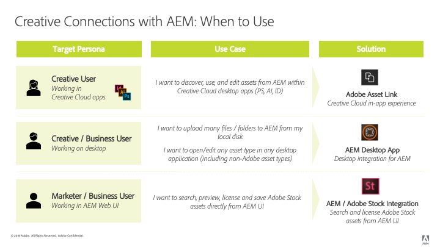

# Aanbevolen werkwijzen voor AEM- en Creative Cloud-integratie {#aem-and-creative-cloud-integration-best-practices}

<!-- TBD: Reconcile with 6.5 article that's ahead of this article now in terms of content streamlining and structuring.
-->

Adobe Experience Manager Assets is een DAM-oplossing (Digital Asset Management) die met Adobe Creative Cloud kan worden geïntegreerd om DAM-gebruikers te helpen samen te werken met creatieve teams en de samenwerking bij het maken van inhoud te stroomlijnen.

Adobe Creative Cloud biedt creatieve teams een ecosysteem van oplossingen en services om ze te helpen digitale middelen te maken. Het omvat desktop- en mobiele toepassingen, cloudservices zoals opslag met desktopsynchronisatie of webervaring, en markten zoals Adobe Stock.

Lees verder om te weten welke integraties u kunt kiezen tussen desktop en DAM op bedrijfsniveau op basis van uw gebruiksscenario en wat de bijbehorende beste werkwijzen zijn voor de verbindingsworkflows.

>[!NOTE]
>
>Het delen van AEM naar Creative Cloud-mappen is afgekeurd en wordt niet langer behandeld in deze handleiding. Adobe raadt aan nieuwere mogelijkheden te gebruiken, zoals [Adobe Asset Link](https://helpx.adobe.com/enterprise/using/adobe-asset-link.html) of [AEM desktop app](https://experienceleague.adobe.com/docs/experience-manager-desktop-app/using/introduction.html), om creatieve gebruikers toegang te bieden tot middelen die in AEM worden beheerd.

## Samenwerkingsbehoeften van ontwerpers, marketers en DAM-gebruikers {#collaboration-needs-of-creatives-marketers-and-dam-users}

| Vereisten | Hoofdletters gebruiken | Betrokken oppervlakken |
|---|---|---|
| Ervaring voor creatieve producten op desktop vereenvoudigen | Toegang tot bedrijfsmiddelen van een DAM (AEM Assets) stroomlijnen voor creatieve professionals, of meer in het algemeen gebruikers op desktopcomputers die werken in toepassingen voor het maken van native bedrijfsmiddelen. Ze hebben een eenvoudige en eenvoudige manier nodig om wijzigingen in AEM te detecteren, te gebruiken (openen), te bewerken en op te slaan, en om nieuwe bestanden te uploaden. | Win- of Mac-bureaublad; Creative Cloud-apps |
| Middelen van Adobe Stock van hoge kwaliteit en gebruiksklaar maken | Marketers helpen het proces voor het maken van inhoud te versnellen door hulp te bieden bij het aanschaffen en detecteren van bedrijfsmiddelen. Creatieve professionals gebruiken de goedgekeurde middelen direct vanuit hun creatieve gereedschappen. | AEM Assets; Adobe Stock Marketplace metagegevensvelden |
| Elementen distribueren en delen door organisaties | De interne afdelingen/de lokale takken en de externe partners, de distributeurs, en de agentschappen gebruiken de goedgekeurde activa die door de ouderorganisatie worden gedeeld. De organisatie wil de gemaakte middelen veilig en naadloos delen voor breder hergebruik. | Merkportal, Commentaar voor delen van bedrijfsmiddelen |

## Adobe-aanbod ter ondersteuning van de samenwerkingsbehoefte {#adobe-offerings-to-support-the-collaboration-need}

| Waardevoorstel voor de betreffende personen | Adobe-aanbieding | Betrokken oppervlakken |
|---|---|---|
| Creatieve gebruikers ontdekken elementen van AEM, openen en gebruiken deze, bewerken en uploaden wijzigingen in AEM en uploaden nieuwe bestanden naar AEM zonder Creative Cloud-apps te verlaten. | [Adobe-itemkoppeling](https://helpx.adobe.com/enterprise/using/adobe-asset-link.html) | Photoshop, Illustrator en InDesign |
| Zakelijke gebruikers vereenvoudigen het openen en gebruiken van middelen, het bewerken en uploaden van wijzigingen in AEM en het uploaden van nieuwe bestanden naar AEM vanuit de desktopomgeving. Ze gebruiken een algemene integratie om elk elementtype in de native bureaubladtoepassing te openen, inclusief niet-Adobe toepassingen. | [Bureaubladapp AEM](https://experienceleague.adobe.com/docs/experience-manager-desktop-app/using/using.html) | Desktop-app AEM op Windows- en Mac-bureaublad |
| Marketers en zakelijke gebruikers detecteren, voorvertonen, licentiëren en opslaan, en beheren de Adobe Stock-middelen vanuit AEM. Gelicentieerde en opgeslagen middelen bieden geselecteerde Adobe Stock-metagegevens voor beter beheer. | [Integratie van Experience Manager en Adobe Stock](aem-assets-adobe-stock.md) | AEM webinterface |

Dit artikel richt zich hoofdzakelijk op de eerste twee aspecten van de samenwerkingsbehoeften. Distributie en sourcing van assets op schaal wordt kort als gebruiksscenario genoemd. Overweeg Adobe Brand Portal of Asset Share Commons voor dergelijke oplossingen. Alternatieve oplossingen zoals [Merk Portal](https://helpx.adobe.com/nl/experience-manager/brand-portal/user-guide.html), oplossingen die kunnen worden gebouwd op [Asset Share Commons](https://adobe-marketing-cloud.github.io/asset-share-commons/) componenten, [Link Share](/help/assets/link-sharing.md), die [Experience Manager Assets](/help/assets/managing-assets-touch-ui.md) gebruiken, dienen te worden beoordeeld op basis van specifieke vereisten.

<!-- 
## Terms and definitions {#terms-and-definitions}

The terms used in this document may have a different meaning in other contexts. In particular, the following terms pertaining to the digital asset lifecycle are used when referring to workflows between a creative professional's desktop and DAM:

* **Work-in-progress or creative work-in-progress (WIP):** A phase in asset lifecycle where an asset undergoes multiple changes and is typically not yet ready to be shared with broader teams.
* **Creative-ready assets:** Assets that are ready to be shared with a broader team, or have been  selected / approved  by the creative team for sharing with marketing or LOB teams.
* **Asset approvals:** The approval process that runs for assets already uploaded to DAM, which typically includes brand approvals, legal approvals, and so on.
* **Final asset:** An asset that has gone through all  approvals/metadata  tagging and is ready to be used by the broader team. Such an asset is stored in DAM and made available to all (or all interested) users. It can be used in marketing channels or by creative teams to create designs.
* **Minor asset  update/change:** A quick and small change to a digital asset. It is often made in response to a retouching or minor editing request, asset review, or approval (for example, reposition, change text size, adjust saturation/brightness, color, and so on).
* **Major asset  update/change:** A change to a digital asset that requires considerable work, and sometimes must be done over a longer period of time. It typically includes multiple changes. The asset must be saved multiple times while being updated. Major asset updates typically cause the asset to enter a WIP stage.
* **DAM:** Digital asset management. In this document, it is synonymous with AEM Experience Manager Assets, unless specifically mentioned otherwise.
* **Creative user:** A creative professional, who creates digital assets using Creative Cloud apps and services. In some cases, a creative user may be a member of a creative team who may use Creative Cloud, but does not create digital assets (like a creative director or creative team manager).
* **DAM user:** A typical user of a DAM system. Depending on the organization, a DAM user can be a marketing or a non-marketing user, for example a Line-of-Business (LOB) user, librarian, sales person, and so on.
-->

### Toewijzing van gebruiksgevallen

| Hoofdletters gebruiken | Bureaubladapp AEM | Map delen | Andere oplossingen |
|---|---|---|---|
| Deel een kleiner aantal (1) DAM-middelen met Creative User | ✔ ✔ | ✔ |  |
| Groter aantal (2) DAM-middelen delen met Creative-gebruiker | ✔ ✔ | ✘ | [Brand Portal](https://experienceleague.adobe.com/docs/experience-manager-brand-portal/using/home.html)   [Delen van middelen](assets-finder-editor.md) |
| DAM-middelen delen met gebruikers die toegang hebben tot DAM | ✔ ✔ | ✔ | [Delen van koppeling](link-sharing.md) |
| DAM-middelen delen met gebruikers die geen toegang hebben tot DAM | ✘ | ✔ ✔ | [Brand Portal](https://experienceleague.adobe.com/docs/experience-manager-brand-portal/using/home.html)   [Delen van middelen](assets-finder-editor.md) |
| Kleiner aantal/volume middelen opslaan naar DAM | ✔ ✔ | ✔ | [Web UI Uploaden](managing-assets-touch-ui.md) |
| Groter aantal elementen opslaan naar DAM (3) | ✔ ✔ | ✘ | [Web UI ](managing-assets-touch-ui.md)   UploadCustom-script/tool |
| Grote aantallen activa migreren naar DAM | ✘ | ✘ | [Migratiehandleiding](assets-migration-guide.md) |
| Snel middelen openen op het bureaublad | ✔ ✔ | ✘ |  |
| Snel middelen openen en wijzigen op desktop | ✔ ✔ | ✘ |  |

De legenda voor de symbolen:

* ✔ ✔: voorkeursoplossing
* ✔: aanvaardbare oplossing
* ✘: moet niet worden gebruikt voor de gebruikszaak

Aanvullende opmerkingen:

* (1) Kleiner aantal activa: bijvoorbeeld een kleine set elementen die verband houden met een project of campagne
* (2) Groter aantal activa: bijvoorbeeld alle goedgekeurde elementen in de organisatie
* (3) Gebruik AEM functie voor het uploaden van een bureaubladtoepassing

Om het gebruik van middelen te steunen, zouden andere oplossingen moeten worden overwogen:

* [Merk ](https://helpx.adobe.com/experience-manager/brand-portal/user-guide.html) Portalfor een configureerbare, SaaS-invoegtoepassing op AEM Assets voor het publiceren van middelen.
* De oplossingen van de douane worden gecreeerd gebaseerd op [Commons van het Aandeel van activa](https://adobe-marketing-cloud.github.io/asset-share-commons/) codebasis.
* AEM [link share](/help/assets/link-sharing.md) om elementen ad hoc te delen met behulp van koppelingen.
* [AEM Assets-](/help/assets/managing-assets-touch-ui.md) webinterface met gebieden voor externe partijen die zijn beveiligd door AEM Access Control-instelling en met noodzakelijke aanpassingen in de IT-/netwerkconfiguratie, zodat deze externe gebruikers toegang hebben tot AEM.

## Belangrijke concepten en gebruiksgevallen {#key-concepts-and-use-cases}

### Verklarende woordenlijst met algemene termen {#glossary-of-common-terms}

* **Werk in uitvoering of creatief werk in uitvoering (WIP):** Een fase in de levenscyclus van assets waarbij een asset meerdere wijzigingen ondergaat en doorgaans nog niet klaar is om te worden gedeeld met grotere teams.
* **Creatieve assets:** Assets die klaar zijn om te worden gedeeld met een groter team, of die zijn geselecteerd/goedgekeurd door het creatieve team om te delen met marketing- of LOB-teams.
* **Goedkeuring van assets:** Het goedkeuringsproces dat wordt uitgevoerd voor assets die reeds naar DAM zijn geüpload, en dat typisch merkgoedkeuringen, wettelijke goedkeuringen, enz. omvat.
* **Definitieve asset:** Een asset die alle goedkeuringen/metadatatagging heeft doorlopen en klaar is om door het grotere team te worden gebruikt. Een dergelijke asset wordt opgeslagen in DAM en beschikbaar gesteld aan alle (geïnteresseerde) gebruikers. Deze kan in marketingkanalen of door creatieve teams worden gebruikt om ontwerpen te maken.
* **Kleine update/wijziging van assets:** Een snelle en kleine wijziging in een digitale asset. Deze wordt vaak uitgevoerd als reactie op een retoucheerverzoek of een verzoek om kleine bewerkingen, een assetrevisie of goedkeuring (bijvoorbeeld om de positie te wijzigen, de tekstgrootte te wijzigen, de verzadiging/helderheid en kleur aan te passen, enz.).
* **Belangrijke update/wijziging van assets:** Een verandering in een digitale asset die aanzienlijk werk vereist, en soms over een langere periode moet worden uitgevoerd. Dit omvat doorgaans meerdere wijzigingen. De asset moet tijdens het bijwerken meerdere keren worden opgeslagen. De belangrijkste assetupdates leiden er doorgaans toe dat de asset een WIP-status krijgt.
* **DAM:** Beheer van digitale assets. In dit document is dit gelijk aan AEM Experience Manager-assets, tenzij anders vermeld.
* **Creatieve gebruiker:** Een creatieve professional die digitale assets maakt met Creative Cloud-apps en -services. In sommige gevallen is een creatieve gebruiker lid van een creatief team dat mogelijk Creative Cloud gebruikt, maar geen digitale assets maakt (zoals een creatieve directeur of een creatieve teammanager).
* **DAM-gebruiker:** Een typische gebruiker van een DAM-systeem. Afhankelijk van de organisatie kan een DAM-gebruiker een marketing- of niet-marketinggebruiker zijn, bijvoorbeeld een LOB-gebruiker (Line-of-Business), bibliothecaris, verkoopmedewerker, enz. zijn.

### Overwegingen bij het gebruik van AEM- en Creative Cloud-integratie {#considerations-when-using-aem-and-creative-cloud-integration}

* Zie [Aanbevolen werkwijzen voor bureaubladtoepassing](https://experienceleague.adobe.com/docs/experience-manager-desktop-app/using/troubleshoot.html?lang=en#best-practices-to-prevent-troubles)
* Zie [Adobe Stock-integratie](aem-assets-adobe-stock.md)
* Zie [Adobe Asset Link](https://helpx.adobe.com/enterprise/using/adobe-asset-link.html)

Dit is een korte samenvatting van beste praktijken voor Experience Manager en Creative Cloud integratie. Lees de rest van dit document voor een gedetailleerd begrip hiervan.

* **Voor creatieve gebruikers die in Photoshop, InDesign of Illustrator werken:** Adobe Asset Link biedt de beste gebruikerservaring, zoals een schone verwerking van het werk in uitvoering op assets die zijn uitgecheckt bij AEM
* **Voor het vereenvoudigen van de toegang tot assets van de desktop voor een generieke bestandsindeling of applicatie:** Gebruik een AEM-desktopapp
* **Begrijpen waarom en wanneer assets in DAM moeten worden opgeslagen:** Updates die ter beschikking moeten worden gesteld aan een groter team in uw organisatie
* **Houd rekening met het volume van de gedeelde assets:** Als u gebruikmaakt van assetdistributie, kunnen governance en beveiliging de belangrijkste aspecten zijn. Overweeg om tools te gebruiken die bedoeld zijn om governance en beveiliging op grote schaal toe te passen, zoals de Brand Portal.
* **De levenscyclus van assets begrijpen:** Begrijp hoe assets in uw organisatie worden verwerkt door verschillende teams
* **Correct en regelmatig opslaan van assets:** Adobe Asset Link doet dit voor u met PS, AI, ID. Voer voor andere applicaties geen taken in uitvoering uit in een toegewezen/gedeelde map, tenzij u alle wijzigingen in DAM nodig hebt

### Toegang tot Adobe Stock-middelen van AEM Assets {#access-to-adobe-stock-assets-from-aem-assets}

[AEM en Adobe Stock-](/help/assets/aem-assets-adobe-stock.md) integratie bieden AEM gebruikers de mogelijkheid om middelen van Adobe Stock naar AEM te zoeken, voor te vertonen, te licentiëren en op te slaan. Bij gelicentieerde en opgeslagen Adobe Stock-elementen zijn de metagegevens van de Stock geselecteerd. Deze kunnen worden gebruikt om met extra filters naar deze elementen te zoeken.

Een paar belangrijke punten over deze integratie:

* Wanneer de activa van de voorraad van Adobe aan AEM worden bewaard, worden zij een regelmatige AEM Assets, met binair opgeslagen aan AEM bewaarplaats. Sommige metagegevens die betrekking hebben op Adobe Stock, worden voor het element in AEM opgeslagen, anders ziet het innameproces er hetzelfde uit als voor elk ander bestand. Als slimme tags bijvoorbeeld actief zijn, worden de tags bij het opslaan aan deze elementen toegevoegd.
* Het middel dat naar AEM wordt opgeslagen, is een kopie en geen koppeling naar Adobe Stock.

**Werken met elementen die van Adobe Stock zijn opgeslagen in AEM in Creative Cloud**. Deze integratie is onafhankelijk van Adobe Asset Link, maar Adobe Asset Link herkent deze elementen die op die manier uit Stock zijn opgeslagen en geeft aanvullende metagegevens en voorraadpictogrammen voor deze elementen weer in de UI voor de uitbreiding van de Adobe Asset Link in Photoshop, Illustrator of InDesign. De bestanden zijn beschikbaar voor bladeren, openen, enzovoort, omdat het normale AEM zijn wanneer ze worden opgeslagen naar AEM.
Creatieve gebruikers die werken in Creative Cloud-apps met de extensie Adobe Asset Link kunnen niet alleen toegang krijgen tot middelen met een licentie van Adobe Stock naar AEM, maar kunnen ook het deelvenster Creative Cloud-bibliotheken gebruiken om Adobe Stock-middelen te zoeken, voor te vertonen en in licentie te geven.
Activa van Adobe Stock die in licentie zijn gegeven en in AEM zijn opgeslagen, worden beschikbaar voor de bredere teams die toegang hebben tot de implementatie van AEM Assets, terwijl creatieve licenties voor activa van Adobe Stock via het deelvenster Bibliotheken van Creative Cloud ze standaard alleen beschikbaar maken op hun Creative Cloud-account.

<!-- 
TBD: A condensed version of the below content is better placed in the Adobe DAM article.
-->

## Informatie over het opslaan van elementen in een DAM {#about-storing-assets-in-a-dam}

Om een efficiënte werkstroom tussen creatieve en marketing/lijn-van-zaken (LOB) teams te ontwerpen en de beste steunmogelijkheden te kiezen, is het belangrijk om te begrijpen wanneer en waarom de activa in DAM worden opgeslagen.

### Waarom elementen zijn opgeslagen in DAM {#why-assets-are-stored-in-dam}

Door middelen in DAM op te slaan, zijn ze gemakkelijk toegankelijk en te vinden. Het zorgt ervoor dat de activa door talrijke gebruikers over de organisatie of het ecosysteem kunnen worden gebruikt, dat partners, klanten, etc. omvat.

De meeste organisaties kiezen ervoor om activa slechts op te slaan die voor de stroomafwaartse marketing/LOB processen relevant zijn (het publiceren aan kanalen zoals Webkanaal via AEM Sites of andere kanalen die door Adobe Experience Cloud - Marketing Cloud, Advertising Cloud, en gemeten door Analytics Cloud worden gediend, die aan gebruikers/partners, etc. verstrekken). Bovendien slaan organisaties activa op die aan een overzicht/goedkeuringsprocedure in DAM kunnen worden onderworpen. Op deze manier slaat DAM vooral activa op die een hoge kans hebben om te worden gebruikt, en vermijdt het opslaan van niet-actieve activa.

De opslag van activa is ook onderworpen aan technische overwegingen en middelgebruik. DAM verleent de extra diensten rond opgeslagen activa, met inbegrip van het halen van meta-gegevens, het versioning, het produceren van voorproeven/het transcoderen, het beheren van verwijzingen, en het toevoegen van toegangsbeheerinformatie. Deze diensten verbruiken extra tijd en infrastructuurmiddelen.

Vaak is het niet wenselijk om alle elementen en updates op te slaan. Bijvoorbeeld, als de updates aan specifieke activa van slechte kwaliteit zijn en bovenmatige middelen verbruiken, kunnen de activa niet in DAM worden opgeslagen.

### Wanneer elementen worden opgeslagen in DAM {#when-assets-are-stored-in-dam}

Creatieve teams (en organisaties) zijn gewoonlijk niet geïnteresseerd in het opslaan van middelen in elke fase van de levenscyclus van de middelen. In de volgende gevallen worden bijvoorbeeld geen elementen opgeslagen:

* Activa die nog moeten worden afgerond of die moeten worden getest
* Middelen die niet de cyclus van het creatieve/interne teamoverzicht doorstaan
* Vergeleken met de middelen in kwestie, heeft het team betere kandidaten om hun werk aan externe teams te vertegenwoordigen

Gewoonlijk worden de volgende klassenelementen opgeslagen in DAM:

* Activa die een bepaalde looptijd hebben bereikt en die klaar worden geacht om te worden gedeeld
* Elementen die vooraf zijn geselecteerd door het creatieve team
* Specifieke asset-indelingen die kunnen worden gebruikt of aangevraagd door marketing, afhankelijk van een specifiek contract of een specifieke overeenkomst (bijvoorbeeld JPG-bestanden die zijn geconverteerd van RAW-bestanden, TIFF-bestanden/afbeeldingen van PSD-originelen)

### Wanneer updates van elementen worden opgeslagen in DAM {#when-updates-to-assets-are-stored-in-dam}

Normaliter moeten alleen updates van middelen die relevant zijn voor de bredere reeks DAM-gebruikers in DAM worden opgeslagen. Hiermee zorgt u ervoor dat gebruikers (marketing en soortgelijke functies) alleen relevante versies in de tijdlijn van de DAM-middelen zien.

Doorgaans zijn er wijzigingen die betrekking hebben op belangrijke mijlpalen in de levenscyclus van de middelen. Het eerste creatieve bedrijfsmiddel of een officiële update op basis van een verzoek/revisie van het creatieve team moet bijvoorbeeld in DAM worden opgeslagen en gecontroleerd.

De update van het creatieve team voor revisie door het marketingteam na een verzoek om wijziging van het bestaande middel in DAM is een voorbeeld van een relevante update. Het zou in DAM voor verdere verwijzing of voor het terugkeren naar de vorige versie moeten worden opgeslagen en worden versioned.

Hieronder volgen voorbeelden van updates die doorgaans niet relevant zijn:

* Vroege versies van elementen die zijn geüpload voordat ze klaar zijn voor marketingcontrole
* Veelvoorkomende creatieve wijzigingen in het bedrijfsmiddel in de aan de gang zijnde fase voordat het creatieve team besluit dat het bedrijfsmiddel klaar is

### Toegang van gebruikers tot DAM {#user-access-to-dam}

AEM Assets ondersteunt twee soorten gebruikers op basis van hun toegang tot de AEM Assets-implementatie. Doorgaans hebben gebruikers binnen het bedrijfsnetwerk (firewall) rechtstreeks toegang tot DAM. Andere gebruikers buiten het ondernemingsnetwerk zouden geen directe toegang hebben. Het gebruikerstype bepaalt welke integraties vanuit technisch oogpunt kunnen worden gebruikt.

#### Creatieve gebruikers met directe toegang tot DAM {#creative-users-with-direct-access-to-dam}

Doorgaans hebben interne creatieve teams of agentschappen/creatieve professionals die aan het interne netwerk zijn toegewezen, toegang tot het DAM-exemplaar, inclusief AEM aanmelding.

In dergelijke gevallen biedt AEM bureaubladtoepassing eenvoudige toegang tot definitieve/goedgekeurde middelen en kunt u creatieve middelen opslaan in DAM.

#### Creatieve gebruikers zonder toegang tot DAM {#creative-users-without-access-to-dam}

Externe agentschappen en freelancers zonder directe toegang tot het DAM-exemplaar hebben mogelijk toegang tot goedgekeurde activa nodig of willen hun nieuwe ontwerpen toevoegen aan het DAM.

In dergelijke gevallen kunt u de AEM/Creative Cloud-integratie gebruiken om de workflow te verbeteren. De voorwaarde is dat creatieve gebruikers een Adobe ID hebben en een Creative Cloud-account met opslagservice.

Gebruik de volgende strategieën om toegang te verlenen tot definitieve/goedgekeurde middelen:

* U kunt als volgt toegang verlenen tot een groot aantal elementen: Gebruik [AEM Assets Brand Portal](https://experienceleague.adobe.com/docs/experience-manager-brand-portal/using/home.html?lang=en), of implementatie door de klant van [Asset Share](assets-finder-editor.md) op AEM publicatie-infrastructuur

* U kunt als volgt toegang tot enkele elementen bieden: U kunt AEM delen van mappen met Adobe Creative Cloud gebruiken in aanvulling op AEM Assets Brand Portal of Asset Share. Er zijn bepaalde beperkingen met betrekking tot deze integratie, die in dit artikel nader worden beschreven.

### Gevallen {#use-cases} gebruiken

De volgende gebruiksgevallen beschrijven verschillende typen workflows tussen DAM en het bureaublad van de ontwerper.

#### Nieuwe ontwerpen maken met middelen van DAM {#creating-new-designs-using-assets-from-dam}

Het volgende diagram illustreert de levenscyclus van digitale elementen. Hierin wordt beschreven hoe creatieve gebruikers en DAM-gebruikers (marketers, LOB-gebruikers) bestaande middelen benutten en gebruiken om meer middelen te maken en deze ter goedkeuring verzenden.

De levenscyclus van de middelen omvat de volgende stadia:

1. Goedgekeurde middelen delen op creatieve desktop: De definitieve activa van DAM worden ter beschikking gesteld aan de creatieve gebruiker (op Desktop)
1. Een nieuw ontwerp maken (creatief digitaal materiaal): Een nieuw dossier wordt opgeslagen in het werk-lopende gebied (WIP).
1. Gebruik (plaats) goedgekeurde elementen in een nieuw ontwerp: De creatieve gebruiker maakt een nieuw middel met behulp van bestaande goedgekeurde middelen in Creative Cloud-apps
1. WIP-updates vaak opslaan: De creatieve gebruiker herhaalt snel en slaat het dossier regelmatig op. In dit stadium kan de creatieve gebruiker samenwerken met anderen, maar de vaak opgeslagen updates zijn gewoonlijk niet van belang voor DAM-gebruikers.
1. Het element bereikt de creatieve kant-en-klare status en wordt opgeslagen in de map Creative Ready
1. Asset-update: Middelen bijwerken of een nieuw bestand is beschikbaar voor de gebruikers in DAM
1. Activa worden geproduceerd: Dit is een proces DAM, dat afhankelijk van de organisatie, het etiketteren, goedkeuring, en het veranderen van toegangsbeheer zou kunnen omvatten. In dit stadium wordt het middel als definitief beschouwd en kan het worden gebruikt door bredere teams die DAM gebruiken. Het kan ook door creatieve gebruikers worden gebruikt om andere activa tot stand te brengen.

Hier volgen enkele algemene aanbevelingen voor het beheer van middelen via dit proces:

* Gebruik een speciaal opslaggebied/systeem, zoals de gesynchroniseerde map met Adobe Creative Cloud Assets, voor de WIP-bestanden: Frequente updates die niet relevant zijn voor DAM-gebruikers kunnen het best worden uitgevoerd door een toegewijd systeem, en niet vanuit AEM Assets. WIP-elementen kunnen met Adobe Creative Cloud-bureaubladtoepassing worden gesynchroniseerd op een lokale schijf, opgeslagen op een lokale opslaglocatie, enzovoort.
* Gebruik afzonderlijke mappen/shares voor definitieve elementen en elementen die naar DAM zijn geüpload: voor de duidelijkheid moeten de uiteindelijke middelen een eigen toegewezen/gedeelde map hebben (&quot;Definitief&quot; voorbeeld hierboven) en de middelen die naar DAM moeten worden geüpload, moeten een eigen map hebben (&quot;Creative Ready&quot;)

#### Bestaande elementen die worden beheerd in DAM {#changing-existing-assets-managed-in-dam} wijzigen

In sommige gevallen moeten de middelen in DAM mogelijk worden gewijzigd. Voorbeelden zijn:

* Verzoek om wijziging van activa van de in AEM Assets uitgevoerde evaluatie en goedkeuring
* Belangrijke updates van bestaande definitieve elementen
* Snelle bewerkingen voor een bestaand bestand (vooral voordat het definitief wordt goedgekeurd)

In dergelijke gevallen biedt AEM bureaubladtoepassing de eenvoudigste manier om deze bewerkingen uit te voeren.

Hier is de stroom van gebeurtenissen die in het diagram worden getoond:

<!-- TBD for formatting. 
This article will get fixed automatically when 6.5 content is ported to it.
And 6.5 content will be ported after updating it for AEM desktop app 2.0 best practices.
And it will be updated for DA2.0 best practices after 6.5 repo is available for writers to edit content in.
-->

* **1:** Deel de middelen van DAM aan Desktop, of open het direct op Desktop in de toepassing van keus (bijvoorbeeld, Adobe Photoshop, etc.). Uitchecken wordt aanbevolen als u het bestand wilt vergrendelen.
* **2:** Kleine update: Bewerk het bestand en sla de wijzigingen op.
* Alternatieve stroom naar stap 2

   * **A:** Grote update: Als voor het bestand een uitgebreide set wijzigingen nodig is, moet het bestand periodiek worden opgeslagen en worden gekopieerd naar een WIP-map of -gebied.
   * **B:Het** werk gaat op het dossier in de omslagen van WIP verder. De opgeslagen wijzigingen worden niet gesynchroniseerd met de versie in DAM
   * **C:** Nadat de updates zijn voltooid, wordt het bestand weer gekopieerd of opgeslagen naar de toegewezen map

* **3:Updates van** bedrijfsmiddelen worden weergegeven in DAM. Schakel het element in om het te ontgrendelen.
* **4:** Activa worden in productie genomen.

Hier volgen enkele algemene aanbevelingen voor het beheer van middelen gedurende dit proces:

* Sla een bestand dat u hebt geopend niet rechtstreeks op vanuit een netwerkshare die is toegewezen door AEM bureaubladtoepassing, tenzij de wijzigingen die u in het bestand hebt aangebracht klein zijn.
* Kopieer het bestand naar een aparte WIP-map als u er aanvullende wijzigingen in wilt aanbrengen, het bestand tijdelijk wilt opslaan of wilt samenwerken met het Creative-team.

#### Bulkupload naar DAM {#bulk-upload-to-dam}

In sommige gevallen moet u wellicht een groter aantal bestanden tegelijkertijd uploaden naar DAM, bijvoorbeeld:

* Resultaten van foto&#39;s of grotere projecten uploaden
* Door creatieve bureaus geleverde activa uploaden
* Geselecteerde elementen uploaden vanaf een grotere set als de selectie buiten DAM is uitgevoerd

Deze beschrijving verwijst naar het operationeel uploaden van bestanden (bijvoorbeeld elke week of met elke foto, enz.) als een normaal onderdeel van de workflow van de desktopgebruiker. De migratie van grote activa wordt hier niet behandeld.

U kunt de volgende mogelijkheden benutten als u elementen bulksgewijs wilt uploaden:

* Als u grote/hiërarchische mappen wilt uploaden, gebruikt u AEM bureaubladtoepassing die de functie [Map uploaden](https://helpx.adobe.com/experience-manager/desktop-app/aem-desktop-app.html#bulkupload) biedt. U kunt ook hiërarchische mapstructuren uploaden. Elementen worden op de achtergrond geüpload en zijn daarom niet gekoppeld aan een webbrowsersessie
* Als u enkele bestanden uit één map wilt uploaden, sleept u deze rechtstreeks van het bureaublad naar de webinterface of gebruikt u de optie Maken in de AEM Assets-webinterface.

>[!NOTE]
>
>Afhankelijk van uw bedrijfsvereisten kunt u ook aangepaste uploader gebruiken.

#### Digitale middelen rechtstreeks vanaf desktop beheren {#managing-digital-assets-directly-from-desktop}

Als u Delen van netwerkbestanden gebruikt om digitale elementen te beheren, kan het gebruik van de netwerkshare die is toegewezen door AEM bureaubladtoepassing, worden beschouwd als een handige vervanging. Houd er bij de overgang van netwerkbestanden rekening mee dat AEM webinterface een uitgebreide reeks mogelijkheden voor beheer van digitale middelen biedt die veel verder gaan dan wat mogelijk is op een gedeeld netwerk (zoeken, verzamelingen, metagegevens, samenwerking, voorvertoningen, enz.) en AEM desktop-app een handige koppeling biedt om de server-side DAM-opslagplaats te verbinden met het werk op een desktopcomputer.

Vermijd het gebruik van AEM bureaubladtoepassing voor het rechtstreeks beheren van middelen in het netwerkaandeel van AEM Assets. Vermijd bijvoorbeeld het gebruik van AEM bureaubladtoepassing voor het verplaatsen/kopiëren van meerdere bestanden. Gebruik in plaats daarvan de AEM Assets-webinterface om mappen van Finder/Explorer naar het gedeelde netwerk te slepen of gebruik de AEM Assets-functie voor het uploaden van mappen.

#### Migratie van bedrijfsmiddelen {#asset-migration}

Raadpleeg de [Migratiegids](/help/assets/assets-migration-guide.md) voor informatie over het plannen en uitvoeren van migratie van bedrijfsmiddelen van een bestaand systeem naar een nieuw systeem of voor de migratie van grote hoeveelheden bedrijfsmiddelen die op servers zijn opgeslagen. AEM bureaubladtoepassing en AEM naar Creative Cloud-integratie ondersteunen dergelijke migraties niet. Vanwege de grote hoeveelheden in te nemen elementen en de extra vereisten met betrekking tot het in kaart brengen van metagegevens, transformatie en opname, moeten migraties met verschillende gereedschappen en benaderingen worden afgehandeld.

>[!MORELIKETHIS]
>
>* [Adobe-itemkoppeling](https://helpx.adobe.com/in/enterprise/admin-guide.html/in/enterprise/using/adobe-asset-link.ug.html)
>* [Aanbevolen werkwijzen voor bureaubladtoepassingen AEM](https://experienceleague.adobe.com/docs/experience-manager-desktop-app/using/archive/best-practices-for-v1.html)
>* [AEM Brand Portal](https://experienceleague.adobe.com/docs/experience-manager-brand-portal/using/introduction/brand-portal.html)
>* [Integratie AEM en Adobe Stock](aem-assets-adobe-stock.md)

