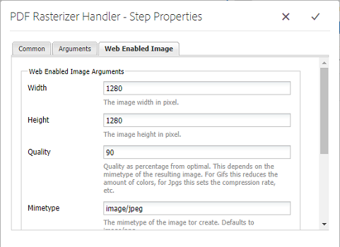

# PDF Rasterizer gebruiken {#using-pdf-rasterizer}

Wanneer u grote, inhoudintensieve PDF- of AI-bestanden uploadt naar Adobe Experience Manager (AEM) Assets, genereert de standaardbibliotheek mogelijk geen nauwkeurige uitvoer. In dergelijke gevallen kan de Adobe PDF Rasterizer-bibliotheek betrouwbaardere en nauwkeurigere uitvoer genereren dan de uitvoer uit een standaardbibliotheek.

Adobe raadt u aan de PDF Rasterizer-bibliotheek te gebruiken voor het volgende:

* AI- of PDF-bestanden met veel inhoud.
* AI- of PDF-bestanden met miniaturen die niet uit het vak zijn gegenereerd.
* AI-bestanden met Pantone Matching System (PMS)-kleuren.

Miniaturen en voorvertoningen die worden gegenereerd met PDF Rasterizer, zijn beter in kwaliteit dan uitvoer in de buitenverpakking en bieden daarom een consistente kijkervaring op verschillende apparaten. De Adobe PDF Rasterizer-bibliotheek ondersteunt geen kleurruimteconversie. De uitvoer wordt altijd naar RGB uitgevoerd, ongeacht de kleurruimte van het bronbestand.

1. Installeer het PDF-rasterpakket op uw AEM via [Software Distribution](https://experience.adobe.com/#/downloads/content/software-distribution/en/aem.html?package=/content/software-distribution/en/details.html/content/dam/aem/public/adobe/packages/cq640/product/assets/aem-assets-pdf-rasterizer-pkg).

   >[!NOTE]
   >
   >De PDF Rasterizer-bibliotheek is alleen beschikbaar voor Windows en Linux.

1. Open de AEM Assets-workflowconsole vanaf `https://[AEM_server]:[port]/workflow`.
1. Open de **[!UICONTROL DAM Update Asset]** workflowpagina.
1. Configureer de volgende opties om de standaardminiatuur en het genereren van webvertoningen voor PDF- en AI-bestanden over te slaan:

   * Open de **[!UICONTROL Thumbnail Process]** stap en voeg deze toe `application/pdf` of `application/postscript` in het **[!UICONTROL Skip Mime Types]** veld.

   

   * Voeg op het **[!UICONTROL Web Enabled Image]** tabblad naar wens toe `application/pdf` of `application/postscript` onder **[!UICONTROL Skip List]** .

   

1. Open de **[!UICONTROL Rasterize PDF/AI Image Preview Rendition]** stap en verwijder het MIME-type waarvoor u de standaardgeneratie voorvertoningsafbeeldingsuitvoeringen wilt overslaan. Verwijder bijvoorbeeld het MIME-type *application/pdf*, ** application/postscript of *application/illustrator* uit de **[!UICONTROL MIME Types]** lijst.

   

1. Sleep de **[!UICONTROL PDF Rasterizer Handler]** stap van het zijpaneel naar onder de **[!UICONTROL Process Thumbnails]** stap.
1. Configureer de volgende argumenten voor de **[!UICONTROL PDF Rasterizer Handler]** stap:

   * MIME-typen: *application/pdf* of *application/postscript*
   * Opdrachten: `PDFRasterizer -d -p 1 -s 1280 -t PNG -i ${file}`
   * Miniatuurgrootten toevoegen: 319:319, 140:100, 48:48. Voeg indien nodig aangepaste miniatuurconfiguratie toe.

   De opdrachtregelargumenten voor de `PDFRasterizer` opdracht kunnen het volgende bevatten:

   **-d**: Vlag om het vloeiend weergeven van tekst, vectorillustraties en afbeeldingen mogelijk te maken. Hiermee maakt u afbeeldingen van betere kwaliteit. Het opnemen van deze parameter zorgt er echter voor dat de opdracht langzaam wordt uitgevoerd en dat de afbeeldingen groter worden.

   `-p`: Paginanummer. De standaardwaarde is alle pagina&#39;s. &#39;*&#39; geeft alle pagina&#39;s aan.

   **-s**: Maximale afmetingen afbeelding (hoogte of breedte). Deze wordt voor elke pagina geconverteerd naar DPI. Als de pagina&#39;s van verschillende grootte zijn, kan elke pagina potentieel met verschillende hoeveelheid schalen. De standaardinstelling is het daadwerkelijke paginaformaat.

   **-t**: Type uitvoerafbeelding. Geldige typen zijn JPEG, PNG, GIF en BMP. De standaardwaarde is JPEG.

   **-i**: Pad voor invoer-PDF. Het is een verplichte parameter.

   `-h`: Help

1. Als u tussenliggende vertoningen wilt verwijderen, selecteert u **[!UICONTROL Delete Generated Rendition]**.
1. Als u wilt dat PDF omzetten in pixels, selecteert u **[!UICONTROL Generate Web Rendition]**.

   

1. Geef de instellingen op het **[!UICONTROL Web Enabled Image]** tabblad op.

   

1. Sla de workflow op.
1. Als u PDF-rasterfunctie wilt inschakelen voor het verwerken van PDF-pagina&#39;s met PDF-bibliotheken, opent u het **[!UICONTROL DAM Process Subasset]** model via de Workflowconsole.
1. Sleep vanuit het zijpaneel de stap PDF Rasterizer Handler onder de **[!UICONTROL Create Web-Enabled Image Rendition]** stap.
1. Configureer de volgende argumenten voor de **[!UICONTROL PDF Rasterizer Handler]** stap:

   * MIME-typen: `application/pdf` of `application/postscript`
   * Opdrachten: `PDFRasterizer -d -p 1 -s 1280 -t PNG -i ${file}`
   * Miniatuurgrootten toevoegen: 319:319, 140:100, 48:48. Voeg indien nodig aangepaste miniatuurconfiguratie toe.

   De opdrachtregelargumenten voor de opdracht PDFRasterizer kunnen het volgende bevatten:

   **-d**: Vlag om het vloeiend weergeven van tekst, vectorillustraties en afbeeldingen mogelijk te maken. Hiermee maakt u afbeeldingen van betere kwaliteit. Het opnemen van deze parameter zorgt er echter voor dat de opdracht langzaam wordt uitgevoerd en dat de afbeeldingen groter worden.

   **-p**: Paginanummer. De standaardwaarde is alle pagina&#39;s. Met een sterretje worden alle pagina&#39;s `*` aangegeven.

   **-s**: Maximale afmetingen afbeelding (hoogte of breedte). Deze wordt voor elke pagina geconverteerd naar DPI. Als de pagina&#39;s van verschillende grootte zijn, kan elke pagina potentieel met verschillende hoeveelheid schalen. De standaardinstelling is het daadwerkelijke paginaformaat.

   **-t**: Type uitvoerafbeelding. Geldige typen zijn JPEG, PNG, GIF en BMP. De standaardwaarde is JPEG.

   **-i**: Pad voor invoer-PDF. Het is een verplichte parameter.

   **-h**: Help

1. Als u tussenliggende vertoningen wilt verwijderen, selecteert u **[!UICONTROL Delete Generated Rendition]**.
1. Als u wilt dat PDF omzetten in pixels, selecteert u **[!UICONTROL Generate Web Rendition]**.

   

1. Geef de instellingen op in het **[!UICONTROL Web Enabled Image tab]** dialoogvenster.

   

1. Sla de workflow op.
1. Upload een PDF- of AI-bestand naar AEM Assets. PDF-rasterfunctie genereert de miniaturen en webuitvoeringen voor het bestand.
