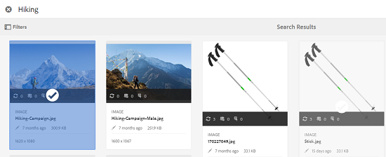

# Asset Selector {#asset-selector}

>[!NOTE]
>
>Asset Selector werd in eerdere versies van AEM [Asset Picker](https://helpx.adobe.com/experience-manager/6-2/assets/using/asset-picker.html) genoemd.

Met de functie voor het selecteren van elementen kunt u zoeken naar elementen in Adobe Experience Manager-elementen (AEM), deze filteren en door deze elementen bladeren. U kunt ook de metagegevens ophalen van elementen die u selecteert met de elementenkiezer. Als u de interface van de elementenkiezer wilt aanpassen, kunt u deze starten met ondersteunde aanvraagparameters. Met deze parameters wordt de context van de elementenkiezer voor een bepaald scenario ingesteld.

Momenteel kunt u de aanvraagparameters `Asset Type` (*Afbeelding/Video/Tekst*) en `Selection mode` (*Enkel/Meervoudig*) doorgeven als contextuele informatie voor de elementenkiezer, die tijdens de selectie intact blijft.

De elementenkiezer gebruikt het HTML5 **Window.postMessage** -bericht om gegevens voor het geselecteerde element naar de ontvanger te verzenden.

De assetkiezer is gebaseerd op de woordenlijst van de grondkiezer van Granite. De elementenkiezer werkt standaard in de modus Bladeren. U kunt echter filters toepassen met behulp van de ervaring van Omngonderzoek om uw zoekopdracht naar bepaalde elementen te verfijnen.

U kunt elke webpagina (ongeacht of deze deel uitmaakt van de CQ-container) integreren met de elementenkiezer (`https://[AEM_server]:[port]/aem/assetpicker.html`).

## Contextafhankelijke parameters {#contextual-parameters}

U kunt de volgende aanvraagparameters in een URL doorgeven om de elementenkiezer in een bepaalde context te starten:

| Naam | Waarden | Voorbeeld | Doel |
|---|---|---|---|
| bronachtervoegsel (B) | Mappad als resix van de bron in de URL:`http://localhost:4502/aem/` `assetpicker.html/<folder_path>` | Als u de elementenkiezer wilt starten terwijl een bepaalde map is geselecteerd, bijvoorbeeld met de `/content/dam/we-retail/en/activities` geselecteerde map, moet de URL de volgende vorm hebben: `http://localhost:4502/aem/assetpicker.html` `/content/dam/we-retail/en/activities?assettype=images` | Als u wilt dat een bepaalde map wordt geselecteerd wanneer de elementenkiezer wordt gestart, geeft u deze door als een bronachtervoegsel. |
| mode | enkelvoudig, meerdere | `http://localhost:4502/aem/assetpicker.html` `?mode=multiple`   `http://localhost:4502/aem/assetpicker.html` `?mode=single` | In meerdere modi kunt u meerdere elementen tegelijk selecteren met de elementkiezer. |
| mimetype | Mimetype(s) (`/jcr:content/metadata/dc:format`) van een element (jokerteken wordt ook ondersteund) | <ul><li>`http://localhost:4502/aem/assetpicker.html` `?mimetype=image/png`</li>  <li>`http://localhost:4502/aem/assetpicker.html` `?mimetype=*png`</li>  <li>`http://localhost:4502/aem/assetpicker.html` `?mimetype=*presentation`</li>  <li>`http://localhost:4502/aem/assetpicker.html` `?mimetype=*presentation&mimetype=*png`</li></ul> | Hiermee kunt u elementen filteren op basis van MIME-typen |
| dialoogvenster | true, false | `http://localhost:4502/aem/assetpicker.html` `?dialog=true` | Gebruik deze parameters om de elementenkiezer te openen als granietdialoogvenster. Deze optie is alleen van toepassing wanneer u de elementenkiezer start via Granite Path Field en deze configureert als pickerSrc URL. |
| assettype (S) | afbeeldingen, documenten, multimedia, archieven | <ul><li>`http://localhost:4502/aem/assetpicker.html` `?assettype=images`</li> <li>`http://localhost:4502/aem/assetpicker.html?assettype=documents`</li> <li>`http://localhost:4502/aem/assetpicker.html?assettype=multimedia`</li> <li>`http://localhost:4502/aem/assetpicker.html?assettype=archives`</li> | Gebruik deze optie om elementtypen te filteren op basis van de doorgegeven waarde. |
| basis | `<folder_path>` | `http://localhost:4502/aem/` `assetpicker.html?assettype=images` `&root=/content/dam/we-retail/en/activities` | Gebruik deze optie om de hoofdmap voor de elementenkiezer op te geven. In dit geval kunt u met de elementenkiezer alleen onderliggende elementen (direct/indirect) in de hoofdmap selecteren. |

## De elementkiezer gebruiken {#using-the-asset-selector}

1. Ga naar `https://[AEM_server]:[port]/aem/assetpicker`om de interface van de elementenkiezer te openen.
1. Navigeer naar de gewenste map en selecteer een of meer elementen.

   

   U kunt ook naar het gewenste element zoeken in het vak Universeel zoeken en het vervolgens selecteren.

   

   Als u in het vak OmniSearch naar elementen zoekt, kunt u verschillende filters in het **[!UICONTROL Filters]** deelvenster selecteren om de zoekopdracht te verfijnen.

   

1. Tap/click **[!UICONTROL Select]** from the toolbar.
