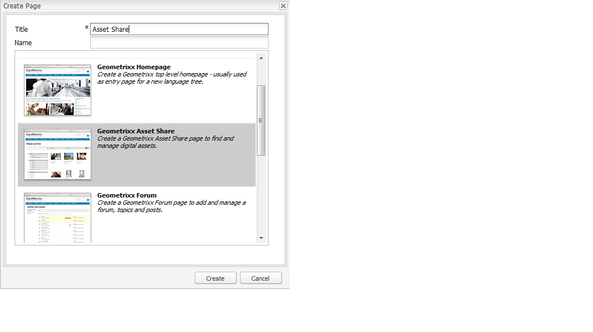
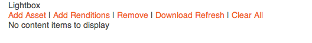
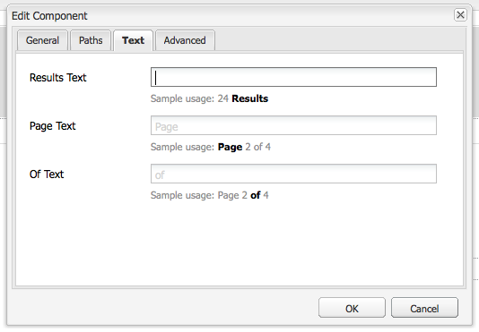
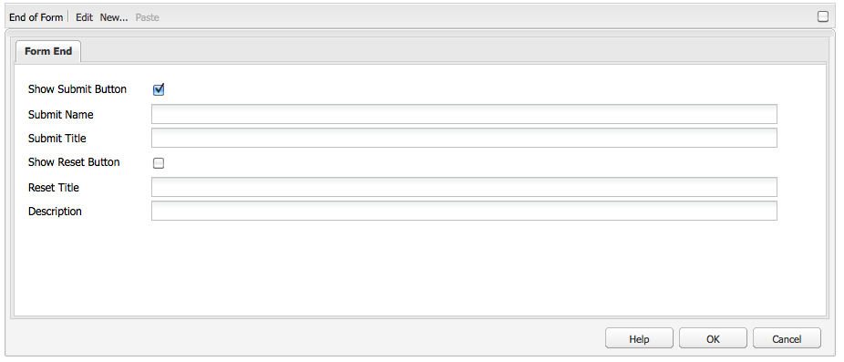
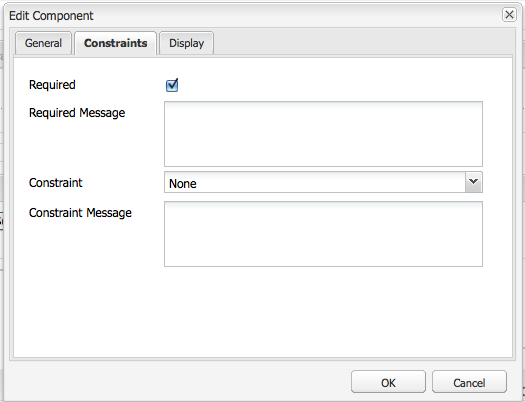
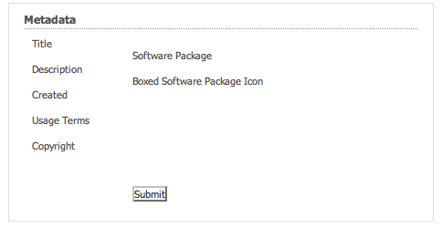

# Elementeditorpagina&#39;s maken en configureren {#creating-and-configuring-asset-editor-pages}

>[!CAUTION]
>
>AEM 6.4 heeft het einde van de uitgebreide ondersteuning bereikt en deze documentatie wordt niet meer bijgewerkt. Raadpleeg voor meer informatie onze [technische ondersteuningsperioden](https://helpx.adobe.com/support/programs/eol-matrix.html). Ondersteunde versies zoeken [hier](https://experienceleague.adobe.com/docs/).

In dit document wordt het volgende beschreven:

* Waarom zou u aangepaste pagina&#39;s in de Asset Editor maken.
* Hoe te om de pagina&#39;s van de Redacteur van Activa tot stand te brengen en aan te passen, die WCM pagina&#39;s zijn die u meta-gegevens bekijken en laten uitgeven evenals acties op de activa uitvoeren.
* Meerdere elementen tegelijk bewerken.

>[!NOTE]
>
>Asset Share is beschikbaar als een open-source referentie-implementatie. Zie [Commentaar voor het delen van bedrijfsmiddelen](https://adobe-marketing-cloud.github.io/asset-share-commons/) . Het wordt niet officieel gesteund.

## Waarom de Pagina&#39;s van de Redacteur van Activa creëren en vormen? {#why-create-and-configure-asset-editor-pages}

Digital Asset Management wordt in steeds meer scenario&#39;s gebruikt. Wanneer u overschakelt van een kleinschalige oplossing voor een kleine gebruikersgroep van professioneel opgeleide gebruikers - bijvoorbeeld fotografen of taxonomisten - naar grotere en meer uiteenlopende gebruikersgroepen - bijvoorbeeld zakelijke gebruikers, WCM-auteurs, journalisten, enzovoort - de krachtige gebruikersinterface van [!DNL Adobe Experience Manager Assets] professionele gebruikers kunnen te veel informatie verstrekken en belanghebbenden beginnen specifieke gebruikersinterfaces of toepassingen te vragen om toegang te krijgen tot de digitale middelen die voor hen van belang zijn.

Deze asset-centric toepassingen kunnen eenvoudige fotogalerieën in een Intranet zijn waar de werknemers foto&#39;s van handelsshowbezoeken of een perscentrum in een openbaar-onder ogen ziet website kunnen uploaden, zoals het voorbeeld dat van Geometrixx wordt voorzien. Asset-centric toepassingen kunnen ook worden uitgebreid tot complete oplossingen, zoals winkelwagentjes, kassa&#39;s en verificatieprocessen.

Het creëren van een middel-centric toepassing wordt grotendeels een configuratieproces dat geen codering vereist, slechts kennis van gebruikersgroepen en hun behoeften evenals kennis van de meta-gegevens die worden gebruikt. Asset-centric toepassingen die zijn gemaakt met [!DNL Assets] uitbreidbaar zijn: met een matige codeerinspanning kunnen herbruikbare componenten voor het zoeken, bekijken, en het wijzigen van activa worden gecreeerd.

Een toepassing die op elementen is gericht in [!DNL Experience Manager] bestaat uit een pagina Asset Editor, die kan worden gebruikt voor een gedetailleerde weergave van een specifiek element. Een pagina van de Redacteur van Activa staat ook voor het uitgeven van meta-gegevens toe, op voorwaarde dat de gebruiker die tot de activa toegang heeft de noodzakelijke toestemmingen heeft.

## Een pagina voor het delen van elementen maken en configureren {#creating-and-configuring-an-asset-share-page}

U past de DAM Finder-functionaliteit aan en maakt pagina&#39;s met alle functionaliteit die u nodig hebt. Deze worden pagina&#39;s voor het delen van middelen genoemd. Om een nieuwe pagina van het Aandeel van Activa tot stand te brengen, voegt u de pagina toe gebruikend het malplaatje van het Aandeel van Activa en dan past u de acties aan die gebruikers op die pagina kunnen uitvoeren, bepalen hoe de kijkers de activa zien, en beslissen hoe de gebruikers hun vragen kunnen bouwen.

Hier volgen enkele handige voorbeelden voor het maken van een aangepaste pagina voor het delen van bedrijfsmiddelen:

* Pers Center for Journalists
* Zoekmachine voor afbeeldingen voor interne zakelijke gebruikers
* Afbeeldingsdatabase voor websitegebruikers
* Media Taging Interface voor metagegevenseditors

### Een pagina voor het delen van elementen maken {#creating-an-asset-share-page}

Als u een nieuwe pagina voor het delen van elementen wilt maken, kunt u deze maken wanneer u aan websites werkt of via het beheer van digitale elementen.

>[!NOTE]
>
>Wanneer u een pagina voor het delen van bedrijfsmiddelen maakt van **Nieuw** in het beheer van digitale middelen worden automatisch een Asset Viewer en Asset Editor gemaakt.

Als u een nieuwe pagina voor het delen van elementen wilt maken in het dialoogvenster **Websites** console:

1. In de **[!UICONTROL Websites]** , navigeert u naar de plaats waar u een pagina voor het delen van elementen wilt maken en klikt u op **[!UICONTROL New]**.

1. Selecteer **[!UICONTROL Asset Share]** pagina en klik op **[!UICONTROL Create]**. De nieuwe pagina wordt gemaakt en de pagina voor het delen van elementen wordt weergegeven in de **[!UICONTROL Websites]** tab.

De basispagina die is gemaakt met de sjabloon Geometrixx DAM Asset Share ziet er als volgt uit:

Als u de pagina voor het delen van elementen wilt aanpassen, gebruikt u elementen van het hulpprogramma en bewerkt u ook de eigenschappen van de querybuilder. De pagina **[!UICONTROL Geometrixx Press Center]** is een aangepaste versie van een pagina die op deze sjabloon is gebaseerd:

Een nieuwe pagina voor het delen van elementen maken via Digital Asset Manager:

1. In de beheerder van digitale middelen, in **[!UICONTROL New]**, selecteert u **[!UICONTROL New Asset Share]**.
1. In de **[!UICONTROL Title]**, voert u de naam in van de pagina voor het delen van elementen. Voer desgewenst een naam voor de URL in.

   

1. Dubbelklik op de pagina voor het delen van elementen om deze te openen en de pagina te configureren.

   

   Wanneer u een pagina voor het delen van bedrijfsmiddelen maakt van **[!UICONTROL New]** Er wordt automatisch een viewer voor middelen en een Asset Editor gemaakt.

#### Handelingen aanpassen {#customizing-actions}

U kunt bepalen welke handelingen gebruikers kunnen uitvoeren op geselecteerde digitale elementen op basis van een selectie vooraf gedefinieerde handelingen.

Handelingen toevoegen aan de pagina Asset Share:

1. Klik op de pagina Asset Share die u wilt aanpassen op **[!UICONTROL Actions]** in het hulpje.

   De volgende acties zijn beschikbaar:
   

| Handeling | Beschrijving |
|---|---|
| [!UICONTROL Delete Action] | Gebruikers kunnen de geselecteerde elementen verwijderen. |
| [!UICONTROL Download Action] | Hiermee kunnen gebruikers geselecteerde elementen downloaden naar hun computers. |
| [!UICONTROL Lightbox Action] | Hiermee slaat u elementen op in een &#39;lichtbak&#39; waar u andere handelingen op kunt uitvoeren. Dit is handig wanneer u met elementen op meerdere pagina&#39;s werkt. De lichtbak kan ook worden gebruikt als winkelwagentje voor bedrijfsmiddelen. |
| [!UICONTROL Move Action] | Gebruikers kunnen het element naar een andere locatie verplaatsen |
| [!UICONTROL Tags Action] | Gebruikers kunnen tags toevoegen aan geselecteerde elementen |
| [!UICONTROL View Asset Action] | Hiermee opent u het element in de Asset Editor, zodat de gebruiker het kan bewerken. |

1. Sleep de gewenste actie naar de **Handelingen** op de pagina. Als u dit doet, wordt een knop gemaakt waarmee die handeling wordt uitgevoerd.

   

#### Bepalen hoe zoekresultaten worden weergegeven {#determining-how-search-results-are-presented}

U bepaalt hoe de resultaten worden weergegeven in een vooraf gedefinieerde lijst met lenzen.

Zo wijzigt u de weergave van zoekresultaten:

1. Klik op de pagina Asset Share die u wilt aanpassen op **[!UICONTROL Search]**.

   

1. Sleep de desbetreffende lens naar het bovenste midden van de pagina. In het Centrum van de Pers, zijn de lenzen reeds beschikbaar. Gebruikers drukken op het juiste lenspictogram om de zoekresultaten naar wens weer te geven.

De volgende lenzen zijn beschikbaar:

| Lens | Beschrijving |
|---|---|
| **[!UICONTROL List Lens]** | De elementen worden in een lijst met details weergegeven. |
| **[!UICONTROL Mosaic Lens]** | Hiermee worden elementen op mozaïekwijze weergegeven. |

#### Mozaïeklens {#mosaic-lens}

#### Lijstlens {#list-lens}

#### De Query Builder aanpassen {#customizing-the-query-builder}

Met de querybuilder kunt u zoektermen invoeren en inhoud maken voor de pagina Asset Share. Wanneer u de vraagbouwer uitgeeft, moet u ook bepalen hoeveel onderzoeksresultaten per pagina worden getoond, welke activaredacteur opent wanneer u activa tweemaal klikt, de weg de vraagonderzoeken, en nodetypes aanpast.

U kunt als volgt de builder van query aanpassen:

1. Klik op de pagina Asset Share die u wilt aanpassen op **[!UICONTROL Edit]** in de Bouwer van de Vraag. Standaard worden de **[!UICONTROL General]** wordt geopend.

1. Selecteer het aantal resultaten per pagina, het pad van de middeleneditor (als u een aangepaste editor voor elementen hebt) en de titel Handelingen.

   

1. Klik op de knop **[!UICONTROL Paths]** tab. Voer een of meerdere paden in die de zoekopdracht moet uitvoeren. Deze paden worden overschreven als de gebruiker de voorspelling van paden gebruikt.

   

1. Voer desgewenst een ander knooppunttype in.

1. In de **[!UICONTROL Query Builder URL]** in het veld kunt u de querybuilder overschrijven of omsluiten en de nieuwe servlet-URL&#39;s invoeren met de bestaande query-builder-component. In de **[!UICONTROL Feed URL]** kunt u ook de URL van de feed overschrijven.

   

1. In de **[!UICONTROL Text]** Voer de tekst in die u wilt weergeven voor de resultaten en paginanummers. Klikken **[!UICONTROL OK]** wanneer u klaar bent met het aanbrengen van wijzigingen.

   

#### Voorspellen toevoegen {#adding-predicates}

[!DNL Experience Manager Assets] bevat een aantal voorspellingen die u kunt toevoegen aan de pagina Asset Share. Hierdoor kunnen uw gebruikers verder beperkte zoekopdrachten uitvoeren. In sommige gevallen, kunnen zij een parameter van de vraagbouwer met voeten treden (bijvoorbeeld, de parameter van de Weg).

Voorspelden toevoegen:

1. Klik op de pagina Asset Share die u wilt aanpassen op **[!UICONTROL Search]**.

   

1. Sleep de aangewezen predikaten aan de pagina van het Aandeel van Activa onder de vraagbouwer. Hiermee maakt u de juiste velden.

   

   De volgende voorspellingen zijn beschikbaar:

| Voorspelend | Beschrijving |
|---|---|
| **[!UICONTROL Date Predicate]** | Hiermee kunnen gebruikers zoeken naar elementen die voor en na bepaalde datums zijn gewijzigd. |
| **[!UICONTROL Options Predicate]** | De eigenaar van de site kan een eigenschap opgeven waarnaar moet worden gezocht (zoals in de eigenschap predikaat, bijvoorbeeld cq:tags) en een inhoudsstructuur om de opties te vullen (bijvoorbeeld de codestructuur). Hiermee wordt een lijst met opties gegenereerd waarin gebruikers de waarden (tags) kunnen selecteren die de geselecteerde eigenschap (eigenschap tag) moet hebben. Op deze manier kunt u lijstbesturingselementen maken, zoals de lijst met tags, bestandstypen, afbeeldingsrichtingen, enzovoort. Het is ideaal voor een vaste set opties. |
| **[!UICONTROL Path Predicate]** | Gebruikers kunnen het pad en de submappen desgewenst definiëren. |
| **[!UICONTROL Property Predicate]** | De eigenaar van de site geeft een eigenschap op waarnaar moet worden gezocht, bijvoorbeeld tiff:ImageLength en de gebruiker kan vervolgens een waarde invoeren, bijvoorbeeld 800. Hiermee worden alle afbeeldingen geretourneerd die 800 pixels hoog zijn. Nuttige voorspelling als uw bezit willekeurige waarden kan hebben. |

Zie voor meer informatie de [javadocs voorspellen](https://helpx.adobe.com/experience-manager/6-4/sites/developing/using/reference-materials/javadoc/com/day/cq/search/eval/package-summary.html).

1. Als u de voorspelling verder wilt configureren, dubbelklikt u erop. Als u bijvoorbeeld het pad wilt openen, moet u het hoofdpad toewijzen.

   

## Een pagina voor de Editor van middelen maken en configureren {#creating-and-configuring-an-asset-editor-page}

U kunt de middeleneditor aanpassen om te bepalen hoe gebruikers de digitale elementen kunnen weergeven en bewerken. Hiertoe maakt u een nieuwe pagina in de Editor van middelen en past u de weergaven aan en de acties die gebruikers op die pagina kunnen uitvoeren.

>[!NOTE]
>
>Als u aangepaste velden wilt toevoegen aan de DAM-middeleneditor, voegt u nieuwe cq:Widget-knooppunten toe aan `/apps/dam/content/asseteditors.`

### De pagina Asset Editor maken {#creating-the-asset-editor-page}

Als u de pagina Asset Editor maakt, is het verstandig de pagina direct onder de pagina Asset Share te maken.

Een pagina voor de Editor van middelen maken:

1. In de **[!UICONTROL Websites]** , navigeert u naar de plaats waar u een pagina voor de middeleneditor wilt maken en klikt u **[!UICONTROL New]**.

1. Selecteren **[!UICONTROL Geometrixx Asset Editor]** en klik op **[!UICONTROL Create]**. De nieuwe pagina wordt gemaakt en de pagina wordt weergegeven in het dialoogvenster **[!UICONTROL Websites]** tab.

De basispagina die is gemaakt met de sjabloon Geometrixx Asset Editor ziet er als volgt uit:

Als u de pagina Asset Editor wilt aanpassen, gebruikt u elementen van de assistent. De pagina Asset Editor die wordt geopend via de **[!UICONTROL Geometrixx Press Center]** is een aangepaste versie van een pagina die op deze sjabloon is gebaseerd:

#### Instellen welke Asset Editor wordt geopend vanuit een pagina voor het delen van elementen {#setting-which-asset-editor-opens-from-an-asset-share-page}

Nadat u de aangepaste pagina Asset Editor hebt gemaakt, moet u ervoor zorgen dat de elementen op de aangepaste pagina Editor worden geopend wanneer u dubbelklikt op elementen die u hebt gemaakt met het aangepaste Delen van middelen.

De pagina Asset Editor instellen:

1. Klik op de pagina Asset Share op **[!UICONTROL Edit]** naast de Query Builder.

   

1. Klik op de knop **[!UICONTROL General]** als deze nog niet is geselecteerd.

1. In de **[!UICONTROL Path of Asset Editor]** Voer het pad in naar de middeleneditor waarin u de pagina Asset Share wilt openen en klik op **[!UICONTROL OK]**.

   

#### Elementbewerkingscomponenten toevoegen {#adding-asset-editor-components}

U bepaalt welke functionaliteit een middeleneditor heeft door componenten aan de pagina toe te voegen.

Elementeditorcomponenten toevoegen:

1. Selecteer op de pagina Asset Editor die u wilt aanpassen **[!UICONTROL Asset Editor]** in het hulpje. Alle beschikbare componenten van de middeleneditor worden weergegeven.

   >[!NOTE]
   >
   >Wat u kunt aanpassen, hangt af van welke componenten beschikbaar zijn. Als u componenten wilt inschakelen, gaat u naar de ontwerpmodus en selecteert u de onderdelen die u wilt inschakelen.

1. Sleep de componenten van de hulpwerkplaats aan de activaredacteur en maak om het even welke wijzigingen in de componentendialogen. De componenten worden beschreven in de volgende lijst en in de gedetailleerde instructies beschreven die volgen.

   >[!NOTE]
   >
   >Bij het ontwerpen van de pagina voor de middeleneditor maakt u componenten die alleen-lezen of bewerkbaar zijn. Gebruikers weten dat een veld kan worden bewerkt als een afbeelding van een potlood in die component wordt weergegeven. Standaard worden de meeste componenten ingesteld als alleen-lezen.

   | Component | Beschrijving |
   |---|---|
   | **[!UICONTROL Metadata Form]en[!UICONTROL Metadata Text Field]** | Hiermee kunt u aanvullende metagegevens aan een element toevoegen en een handeling op dat element uitvoeren, zoals verzenden. |
   | **[!UICONTROL Sub Assets]** | Hiermee kunt u subelementen aanpassen. |
   | **Tags** | Gebruikers kunnen tags selecteren en aan een element toevoegen. |
   | **[!UICONTROL Thumbnail]** | Toont een duimnagel van het element, zijn filename, en laat u een afwisselende tekst toevoegen. U kunt hier ook acties voor middeleneditors toevoegen. |
   | **[!UICONTROL Title]** | Hiermee geeft u de titel van het element weer, die kan worden aangepast. |

   

#### Metagegevensformulier en tekstveld - De component Metagegevens weergeven configureren {#metadata-form-and-text-field-configuring-the-view-metadata-component}

Het metagegevensformulier is een formulier met een begin- en eindactie. Tussen haakjes voert u in **[!UICONTROL Text]** velden. Zie [Forms](../sites-authoring/default-components.md) voor meer informatie over het werken met formulieren.

1. Een startactie maken door op **[!UICONTROL Edit]** in het gebied Start van het formulier. U kunt desgewenst een titel voor een vak invoeren. Standaard is de titel van het vak **[!UICONTROL Metadata]**. Schakel het selectievakje Clientvalidatie in als u de Java-Script-clientcode voor validatie wilt genereren.

   

1. Een actie Einde maken door op **[!UICONTROL Edit]** in het gebied Einde van het formulier. U kunt bijvoorbeeld een **[!UICONTROL Submit]** om gebruikers toe te staan hun meta-gegevensveranderingen voor te leggen. U kunt desgewenst een **[!UICONTROL Reset]** knop waarmee de metagegevens worden teruggezet naar de oorspronkelijke staat.

   

1. In tussen de **[!UICONTROL Form Start]** en de **Einde formulier** Sleep Metagegevenstekstvelden naar het formulier. Gebruikers vullen metagegevens in deze tekstvelden in. Deze kunnen worden verzonden of een andere actie uitvoeren.

1. Dubbelklik bijvoorbeeld op de veldnaam. **Titel** om het metagegevensveld te openen en wijzigingen aan te brengen. In de **[!UICONTROL General]** tabblad van het dialoogvenster [!UICONTROL Edit Component] kunt u bijvoorbeeld de naamruimte en het veldlabel definiëren, evenals het type. `dc:title`.

   

   Zie [Aanpassen en uitbreiden [!DNL Assets]](extending-assets.md) voor informatie over het wijzigen van de naamruimten die beschikbaar zijn in het metagegevensformulier.

1. Klik op de knop **[!UICONTROL Constraints]** tab. Hier kunt u selecteren of een veld vereist is en zo nodig beperkingen toevoegen.

   

1. Klik op de knop **[!UICONTROL Display]** tab. Hier kunt u een nieuwe breedte en een nieuw aantal rijen voor het meta-gegevensgebied ingaan. Selecteer **Veld is alleen-lezen** Schakel het selectievakje in om gebruikers toe te staan de metagegevens te bewerken.

   

   Hieronder ziet u een voorbeeld van een metagegevensformulier met verschillende velden:

   

Op de pagina Asset Editor kunnen gebruikers vervolgens waarden invoeren in de metagegevensvelden (als deze bewerkbaar zijn) en de eindactie uitvoeren (bijvoorbeeld door de wijzigingen te verzenden).

#### Subactiva {#sub-assets}

In de component Subelementen kunt u subelementen weergeven en selecteren. U kunt bepalen welke namen onder de [hoofdmiddel](assets.md#what-are-digital-assets) en subactiva.

Dubbelklik op de component Subelementen om het dialoogvenster Subelementen te openen, waarin u de titels voor het hoofdelement en eventuele subelementen kunt wijzigen. De standaardwaarden worden onder het desbetreffende veld weergegeven.

Hieronder ziet u een voorbeeld van een onderdeel van een subelement dat is gevuld:

Als u bijvoorbeeld een subelement selecteert, ziet u hoe de component de juiste pagina weergeeft en hoe de titel van het vak verandert van Subelementen in Siblings.

#### Tags {#tags}

De component Tags is een component waarin gebruikers bestaande tags aan een element kunnen toewijzen. Hierdoor kunnen gebruikers de elementen later ordenen en ophalen. U kunt van deze component alleen-lezen maken, zodat gebruikers geen codes kunnen toevoegen, maar alleen deze weergeven.

Dubbelklik op de component Tags om het dialoogvenster Codes te openen waarin u desgewenst de titel van Codes kunt wijzigen en waarin u de toegewezen naamruimten kunt selecteren. Als u dit veld bewerkbaar wilt maken, wist u het **Bewerken verbergen** selectievakje. Standaard zijn codes bewerkbaar.

Als gebruikers tags kunnen bewerken, kunnen ze op het potlood klikken om tags toe te voegen door deze te selecteren in het vervolgkeuzemenu Codes.

Hier volgt een gevulde component Tags:

#### Miniatuur {#thumbnail}

In het element Miniatuur wordt de geselecteerde miniatuur weergegeven (bij veel van de indelingen wordt de miniatuur automatisch geëxtraheerd). Bovendien geeft de component de bestandsnaam weer, en [acties die u kunt wijzigen](assets-finder-editor.md#adding-asset-editor-actions).

Dubbelklik op de miniatuurcomponent om het dialoogvenster met miniaturen te openen waarin u de alt-tekst kunt wijzigen. Standaard wordt de alt-tekst van de miniatuur ingesteld op **[!UICONTROL Click to download]** activa.

Hieronder ziet u een voorbeeld van een gevulde miniatuurcomponent:

#### Titel {#title}

In de component Title worden de titel van het element en een beschrijving weergegeven.

Standaard bevindt het bestand zich in de modus Alleen-lezen, zodat gebruikers het bestand niet kunnen bewerken. Als u de component bewerkbaar wilt maken, dubbelklikt u op de component en wist u de **Knop Bewerken verbergen** selectievakje. Voer bovendien een titel in voor meerdere elementen.

Als de titel kan worden bewerkt, kunt u een titel en beschrijving toevoegen door op het potlood te klikken om het dialoogvenster **Eigenschappen van element** venster. Bovendien kunt u het element in- en uitschakelen door de datum en tijd te selecteren.

Wanneer gebruikers de titel bewerken door op het pictogram Potlood te klikken, kunnen ze de knop **Titel**, **Beschrijving** en voert u **Aan** en **Off Times** om het actief in- en uit te schakelen.

Hier volgt een voorbeeld van een gevulde component Title:

#### Acties in de Asset Editor toevoegen {#adding-asset-editor-actions}

U kunt bepalen welke handelingen gebruikers kunnen uitvoeren op geselecteerde digitale elementen op basis van een selectie vooraf gedefinieerde handelingen.

Handelingen toevoegen aan de pagina Asset Editor:

1. Klik op de pagina Asset Editor die u wilt aanpassen **[!UICONTROL Asset Editor]** in het hulpje. 

   

   De volgende acties zijn beschikbaar:

   | Handeling | Beschrijving |
   |---|---|
   | [!UICONTROL Download] | Hiermee kunnen gebruikers geselecteerde elementen downloaden naar hun computers. |
   | [!UICONTROL Editors] | Gebruikers kunnen een afbeelding bewerken (interactief bewerken) |
   | [!UICONTROL Lightbox] | Hiermee slaat u elementen op in een &#39;lichtbak&#39; waar u andere handelingen op kunt uitvoeren. Dit is handig wanneer u met elementen op meerdere pagina&#39;s werkt. |
   | [!UICONTROL Locking] | Hiermee kunnen gebruikers een element vergrendelen. Deze functionaliteit is niet standaard ingeschakeld en moet worden ingeschakeld in de lijst met componenten. |
   | [!UICONTROL References] | Klik hierop om te tonen op welke pagina&#39;s het element wordt gebruikt. |
   | [!UICONTROL Versioning] | Hiermee kunt u versies van een element maken en herstellen. |

1. Sleep de gewenste actie naar de **Handelingen** op de pagina. Als u dit doet, wordt een knop gemaakt waarmee die handeling wordt uitgevoerd.

## Meerdere elementen bewerken met de pagina Asset Editor {#multi-editing-assets-with-the-asset-editor-page}

Met [!DNL Assets] u kunt meerdere elementen tegelijk wijzigen. Nadat u elementen hebt geselecteerd, kunt u tegelijkertijd de volgende wijzigingen aanbrengen:

* Tags
* Metagegevens

Elementen bewerken via de pagina Asset Editor:

1. De Geometrixx openen **[!UICONTROL Press Center]** pagina bij `http://localhost:4502/content/geometrixx/en/company/press.html`.
1. Selecteer de elementen:

   * in Windows: `Ctrl + click` elk element.
   * op Mac: `Cmd + click` elk element.

   Een reeks elementen selecteren: Klik vervolgens op het eerste element `Shift + click` het laatste activum.

1. Klikken **[!UICONTROL Edit Metadata]** in de **Handelingen** veld (linkergedeelte van de pagina).

1. De Geometrixx **[!UICONTROL Press Center Asset Editor]** wordt geopend in een nieuw tabblad. De metagegevens van de elementen worden als volgt weergegeven:

   * Een tag, die niet van toepassing is op alle elementen, maar alleen op een paar elementen, wordt cursief weergegeven.
   * Een label dat op alle elementen van toepassing is, wordt met een normaal lettertype weergegeven.
   * Andere metagegevens dan codes: de waarde van het veld wordt alleen weergegeven als deze voor alle geselecteerde elementen gelijk is.

1. Klikken **[!UICONTROL Download]** om een ZIP-bestand te downloaden dat de elementen van de oorspronkelijke uitvoeringen bevat.
1. Klik op het potloodpictogram naast het pictogram **[!UICONTROL Tags]** veld voor het bewerken van de codes:

   * Een tag die niet van toepassing is op alle elementen, maar alleen op een paar elementen, heeft een grijze achtergrond.
   * Een tag die van toepassing is op alle elementen heeft een witte achtergrond.

   U kunt:

   * Klik op de knop `x` pictogram om de tag voor alle elementen te verwijderen.
   * Klik op de knop `+` pictogram om de tag aan alle elementen toe te voegen.
   * Klik op de knop `arrow` en selecteer een tag om een nieuwe tag aan alle elementen toe te voegen.

   Klikken **[!UICONTROL OK]** om de wijzigingen in het formulier te schrijven. De doos naast **Tags** wordt automatisch gecontroleerd.

1. Bewerk het veld Beschrijving. Stel bijvoorbeeld in op: `This is a common description`. Wanneer een veld wordt bewerkt, overschrijft de waarde de bestaande waarden van de geselecteerde elementen wanneer het formulier wordt verzonden. Het vak naast het veld wordt automatisch ingeschakeld wanneer het veld wordt bewerkt.

   `This is a common description`

   Wanneer een veld wordt bewerkt, overschrijft de waarde de bestaande waarden van de geselecteerde elementen wanneer het formulier wordt verzonden.

   Opmerking: Het vak naast het veld wordt automatisch ingeschakeld wanneer het veld wordt bewerkt.

1. Klikken **[!UICONTROL Update Metadata]** om het formulier te verzenden en de wijzigingen voor alle elementen op te slaan. Alleen de geselecteerde metagegevens worden gewijzigd.
