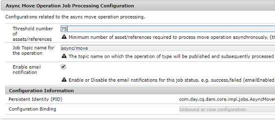

# Asynchronous operations {#asynchronous-operations}

Om negatieve gevolgen voor prestaties te verminderen, [!DNL Adobe Experience Manger Assets] verwerkt bepaalde langlopende en middel-intensieve activa verrichtingen asynchroon. Asynchrone verwerking omvat het navragen van veelvoudige taken en uiteindelijk het uitvoeren van hen op een periodieke manier afhankelijk van de beschikbaarheid van systeemmiddelen. Deze bewerkingen omvatten:

* Veel assets verwijderen.
* Veel assets verplaatsen, of assets met veel verwijzingen verplaatsen.
* Metagegevens van elementen bulksgewijs exporteren en importeren.

U kunt de status van asynchrone taken vanaf de **[!UICONTROL Async Job Status]** pagina weergeven.

>[!NOTE]
>
>Standaard worden de [!DNL Assets] taken parallel uitgevoerd. If `N` is the number of CPU cores, `N/2` tasks can execute in parallel, by default. Om douanemontages voor de taakrij te gebruiken, wijzig de **[!UICONTROL Async Operation Default Queue]** configuratie van [!UICONTROL Web Console]. Voor meer informatie raadpleegt u [wachtrijconfiguraties](https://sling.apache.org/documentation/bundles/apache-sling-eventing-and-job-handling.html#queue-configurations).

## Monitor the status of asynchronous operations {#monitoring-the-status-of-asynchronous-operations}

Whenever [!DNL Assets] processes an operation asynchronously, you receive a notification in your [!DNL Experience Manager] [Inbox](/help/sites-authoring/inbox.md) and via an email. Navigeer naar de pagina **[!UICONTROL Async Job Status]** om de status van de asynchrone bewerkingen in detail weer te geven.

1. Klik in de [!DNL Experience Manager] interface op **[!UICONTROL Operations]** > **[!UICONTROL Jobs]**.

1. Controleer op de pagina **[!UICONTROL Async Job Status]** de details van de bewerkingen.

   

   Zie de **[!UICONTROL Status]** kolom voor meer informatie over de voortgang van een bewerking. Afhankelijk van de voortgang wordt een van de volgende statussen weergegeven:

   * **[!UICONTROL Active]**: De bewerking wordt verwerkt.
   * **[!UICONTROL Success]**: De bewerking is voltooid.
   * **[!UICONTROL Fail]** of **[!UICONTROL Error]**: De bewerking kan niet worden verwerkt.
   * **[!UICONTROL Scheduled]**: De bewerking is gepland voor verwerking op een later tijdstip.

1. To stop an active operation, select it from the list and click **[!UICONTROL Stop]**  from the toolbar.

1. To view extra details, for example description and logs, select the operation and click **[!UICONTROL Open]**  from the toolbar. De pagina met taakdetails wordt weergegeven.

   

1. Als u de bewerking uit de lijst wilt verwijderen, selecteert u **[!UICONTROL Delete]** op de werkbalk. Klik op **[!UICONTROL Download]** om de details naar een csv-bestand te downloaden.

   >[!NOTE]
   >
   >U kunt een taak niet verwijderen als de status actief is of in de wachtrij staat.

## Voltooide taken wissen {#purge-completed-tasks}

[!DNL Experience Manager Assets] Voert een zuiveringstaak elke dag bij 100 uren uit om voltooide asynchrone taken te schrappen die meer dan een dag oud zijn.

<!-- TBD: Find out from the engineering team and mention the time zone of this 1:00 am task.
-->

U kunt het programma voor de zuiveringstaak en de duur wijzigen waarvoor de details van voltooide taken worden behouden alvorens zij worden geschrapt. U kunt ook het maximale aantal voltooide taken configureren waarvoor de details op elk gewenst moment behouden blijven.

1. Klik in de [!DNL Experience Manager] interface **[!UICONTROL Tools]** > **[!UICONTROL Operations]** > **[!UICONTROL Web Console]**.
1. Open de **[!UICONTROL Adobe CQ DAM Async Jobs Purge Scheduled]** taak.
1. Geef het drempelaantal dagen op waarna voltooide taken worden verwijderd en het maximumaantal taken waarvoor details in de geschiedenis worden bewaard. Sla de wijzigingen op.

   

## Drempel configureren voor asynchrone verwijderingsbewerkingen {#configure-thresholds-for-asynchronous-delete-operations}

Als het aantal elementen of mappen dat moet worden verwijderd, de ingestelde drempelwaarde overschrijdt, wordt de verwijderbewerking asynchroon uitgevoerd.

1. Klik in de [!DNL Experience Manager] interface **[!UICONTROL Tools]** > **[!UICONTROL Operations]** > **[!UICONTROL Web Console]**.
1. Open de [!UICONTROL Web Console]configuratie vanuit de **[!UICONTROL Async Delete Operation Job Processing]** toepassing.
1. Geef in het **[!UICONTROL Threshold number of assets]** vak de drempelnummers op voor het asynchroon verwijderen van elementen, mappen of verwijzingen. Sla de wijzigingen op.

   

## Drempel voor asynchrone verplaatsingsbewerkingen configureren {#configure-thresholds-for-asynchronous-move-operations}

Als het aantal te verplaatsen elementen, mappen of verwijzingen het ingestelde drempelnummer overschrijdt, wordt de verplaatsingsbewerking asynchroon uitgevoerd.

1. Klik in de [!DNL Experience Manager] interface op **[!UICONTROL Tools]** > **[!UICONTROL Operations]** > **[!UICONTROL Web Console]**.
1. Open de [!UICONTROL Web Console]configuratie vanuit de **[!UICONTROL Async Move Operation Job Processing]** toepassing.
1. Geef in het **[!UICONTROL Threshold number of assets/references]** vak de drempelnummers op voor het asynchroon verplaatsen van elementen, mappen of verwijzingen. Sla de wijzigingen op.

   

>[!MORELIKETHIS]
>
>* [E-mail configureren in Experience Manager](/help/sites-administering/notification.md).
>* [Importeer/exporteer metadata van assets bulksgewijs](/help/assets/metadata-import-export.md).

