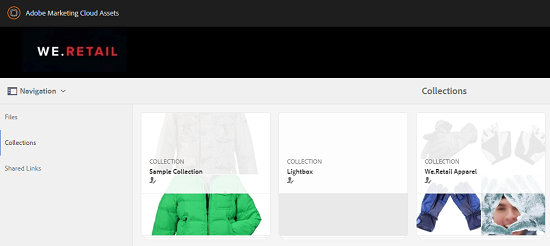

# Verzamelingen publiceren op Brand Portal {#publish-collections-to-brand-portal}

Als beheerder van de Activa van de Manager van de Ervaring van Adobe (AEM), kunt u inzamelingen aan de AEM de instantie van het Portaal van het Merk van Activa voor uw organisatie publiceren. Nochtans, moet u activa AEM met het Portaal van het Merk eerst integreren. Voor details, zie de Activa van AEM met het Portaal [van het Merk](configure-aem-assets-with-brand-portal.md)vormen.

Als u verdere wijzigingen in de originele inzameling in Activa AEM aanbrengt, worden de veranderingen niet weerspiegeld in het Portaal van het Merk tot u opnieuw de inzameling publiceert. Dit kenmerk zorgt ervoor dat de werk-in-vooruitgang veranderingen niet beschikbaar in het Portaal van het Merk zijn. Slechts zijn de goedgekeurde veranderingen die door een beheerder worden gepubliceerd beschikbaar in het Portaal van het Merk.

>[!NOTE]
>
>De fragmenten van de inhoud kunnen niet aan het Portaal van het Merk worden gepubliceerd. Daarom als u inhoudsfragment(en) op AEM Auteur selecteert, dan **[publiceer aan de Portaal]** van het Merk actie niet beschikbaar is.
>
>Als de inzamelingen die inhoudsfragmenten bevatten van AEM Auteur aan het Portaal van het Merk worden gepubliceerd, dan worden alle inhoud van de omslag behalve inhoudsfragmenten herhaald aan de Portaalinterface van het Merk.

## Publiceer een inzameling aan het Portaal van het Merk {#publish-a-collection-to-brand-portal}

1. Tik op/klik op het AEM-logo in de UI Assets-gebruikersinterface. Dan, ga naar **[!UICONTROL Activa > Inzamelingen]** van de pagina van de **[!UICONTROL Navigatie]** .
2. Van de console van Inzamelingen, selecteer de inzameling u aan het Portaal van het Merk wilt publiceren.

   

3. Van de toolbar, **[!UICONTROL publiceer de Tik/de klik aan het Portaal]** van het Merk.

   

4. In de bevestigingsdialoog, **[!UICONTROL publiceer de kraan/de klik]**.
5. Sluit het bevestigingsbericht.
6. Login aan het Portaal van het Merk als beheerder. De gepubliceerde inzameling is beschikbaar in de console van Inzamelingen.

   

## Verzamelingen niet publiceren {#unpublish-collections}

U kunt inzamelingen unpublished die u van activa AEM aan het Portaal van het Merk publiceert. Nadat u de originele inzameling unpublished, is zijn exemplaar niet meer beschikbaar aan de Poortgebruikers van het Merk.

1. Van de console van Inzamelingen van uw instantie van Activa AEM, en selecteer de inzameling u wilt unpublished.

   

2. Tik op/klik op het pictogram **[!UICONTROL Verwijderen uit Brand Portal]** op de werkbalk.

   

3. In de dialoog, tik/klik **[!UICONTROL Unpublished]**.
4. Sluit het bevestigingsbericht. De inzameling wordt verwijderd uit de interface van het Portaal van het Merk.
