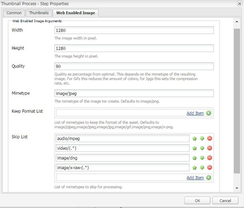

# Camera Raw gebruiken om afbeeldingen te verwerken {#camera-raw-support}

U kunt de Camera Raw ondersteuning inschakelen voor het verwerken van Raw-bestandsindelingen, zoals CR2, NEF en RAF, en het renderen van afbeeldingen in JPEG-indeling. De functionaliteit wordt ondersteund in Adobe Experience Manager Assets met behulp van het [Camera Raw pakket](https://experience.adobe.com/#/downloads/content/software-distribution/en/aem.html?package=/content/software-distribution/en/details.html/content/dam/aem/public/adobe/packages/aem630/product/assets/aem-assets-cameraraw-pkg) dat beschikbaar is bij Software Distribution.

>[!NOTE]
>
>De functionaliteit ondersteunt alleen JPEG-uitvoeringen. Deze functie wordt ondersteund in Windows 64-bits, Mac OS en RHEL 7.x.

Ga als volgt te werk om Camera Raw ondersteuning in Adobe Experience Manager Assets in te schakelen:

1. Download het [Camera Raw pakket](https://experience.adobe.com/#/downloads/content/software-distribution/en/aem.html?package=/content/software-distribution/en/details.html/content/dam/aem/public/adobe/packages/aem630/product/assets/aem-assets-cameraraw-pkg) van de Distributie van de Software.

1. Ga naar `https://[aem_server]:[port]/workflow`. Open de **[!UICONTROL DAM Update Asset]** workflow.

1. Open de **[!UICONTROL Process Thumbnails]** stap.

1. Geef de volgende configuratie op het **[!UICONTROL Thumbnails]** tabblad op:

   * **[!UICONTROL Thumbnails]**: `140:100:false, 48:48:false, 319:319:false`
   * **[!UICONTROL Skip Mime Types]**: `skip:image/dng, skip:image/x-raw-(.*)`

   

1. Geef op het **[!UICONTROL Web Enabled Image]** tabblad in het **[!UICONTROL Skip List]** veld op `audio/mpeg, video/(.*), image/dng, image/x-raw-(.*)`.

   

1. Voeg vanuit het zijpaneel de **[!UICONTROL Camera Raw/DNG Handler]** stap onder de **[!UICONTROL Thumbnail creation]** stap toe.

1. Voeg in de **[!UICONTROL Camera Raw/DNG Handler]** stap de volgende configuratie toe op het **[!UICONTROL Arguments]** tabblad:

   * **[!UICONTROL Mime Types]**: `image/dng` en `image/x-raw-(.*)`
   * **[!UICONTROL Command]**:

      * `DAM_Raw_Converter ${directory}/${filename} ${directory} cq5dam.web.1280.1280.jpeg 1280 1280`
      * `DAM_Raw_Converter ${directory}/${filename} ${directory} cq5dam.thumbnail.319.319.jpeg 319 319`
      * `DAM_Raw_Converter ${directory}/${filename} ${directory} cq5dam.thumbnail.140.100.jpeg 140 100`
      * `DAM_Raw_Converter ${directory}/${filename} ${directory} cq5dam.thumbnail.48.48.jpeg 48 48`

   

1. Klik op **[!UICONTROL Save]**.

>[!NOTE]
>
>Zorg ervoor dat de bovenstaande configuratie hetzelfde is als de **[!UICONTROL Sample DAM Update Asset With Camera RAW and DNG Handling Step]** configuratie.

U kunt nu Camera Raw-bestanden importeren in AEM Assets. Nadat u het Camera Raw pakket hebt geïnstalleerd en de vereiste workflow hebt geconfigureerd, wordt de **[!UICONTROL Image Adjust]** optie weergegeven in de lijst met zijvensters.

*Afbeelding: Opties in het zijvenster*

*Afbeelding: Met deze optie kunt u lichte bewerkingen uitvoeren op uw afbeeldingen*

Nadat u de bewerkingen hebt opgeslagen in een Camera Raw afbeelding, `AdjustedPreview.jpg` wordt een nieuwe uitvoering gegenereerd voor de afbeelding. Voor andere afbeeldingstypen, behalve Camera Raw, worden de wijzigingen in alle uitvoeringen doorgevoerd.

## Beste werkwijzen, bekende problemen en beperkingen {#best-practices}

De functionaliteit heeft de volgende beperkingen:

* De functionaliteit ondersteunt alleen JPEG-uitvoeringen. Deze functie wordt ondersteund in Windows 64-bits, Mac OS en RHEL 7.x.
* Metagegevensterugname wordt niet ondersteund voor RAW- en DNG-indelingen.
* De Camera Raw bibliotheek heeft beperkingen rond de totale pixel het in een tijd kan verwerken. Op dit moment kan het maximaal 65000 pixels aan de lange zijde van een bestand of 512 MP verwerken, ongeacht de criteria die het eerst worden aangetroffen.
