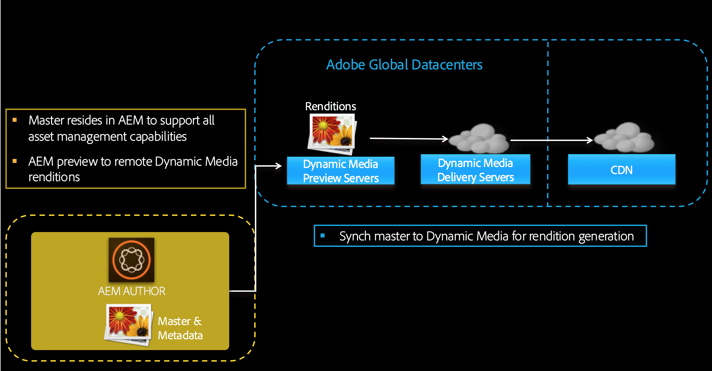
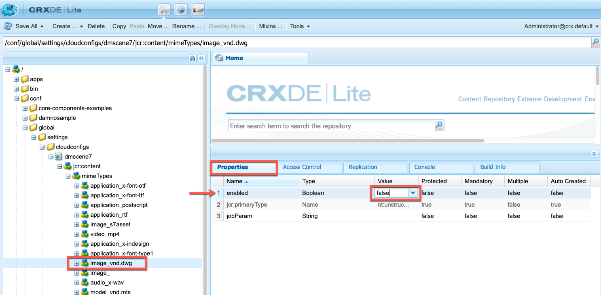

# Dynamic Media configureren - Scene7-modus {#configuring-dynamic-media-scene-mode}

Als u Adobe Experience Manager-configuratie gebruikt voor verschillende omgevingen, zoals een omgeving voor ontwikkeling, een omgeving voor staging en een omgeving voor live productie, moet u Dynamic Media-Cloud Services configureren voor elk van deze omgevingen.

## Architectuurdiagram van Dynamic Media - Scene7-modus {#architecture-diagram-of-dynamic-media-scene-mode}

In het volgende architectuurdiagram wordt beschreven hoe de modus Dynamic Media - Scene7 werkt.

Met de nieuwe architectuur is AEM verantwoordelijk voor master activa en synchronisaties met Dynamic Media voor activa verwerking en het publiceren:

1. Wanneer het master element naar AEM wordt geüpload, wordt het naar Dynamic Media gerepliceerd. Op dat moment verwerkt Dynamic Media alle processen voor het genereren van elementen, zoals videocodering en dynamische varianten van een afbeelding.
1. Nadat de uitvoeringen zijn gegenereerd, kunnen AEM veilig de externe Dynamic Media-uitvoeringen openen en bekijken (er worden geen binaire bestanden teruggestuurd naar de AEM-instantie).
1. Nadat de inhoud klaar is om te worden gepubliceerd en goedgekeurd, brengt het de dienst van Dynamic Media teweeg om inhoud uit te duwen naar leveringsservers en geheim voorgeheugeninhoud bij CDN.



## Dynamic Media inschakelen in Scene7-modus {#enabling-dynamic-media-in-scene-mode}

[Dynamische ](https://www.adobe.com/solutions/web-experience-management/dynamic-media.html) media is standaard uitgeschakeld. Als u gebruik wilt maken van dynamische mediafuncties, moet u deze inschakelen.

>[!NOTE]
>
>De modus Dynamic Media - Scene7 is alleen bedoeld voor de instantie AEM Author. Als dusdanig, moet u `runmode=dynamicmedia_scene7`op de instantie van de Auteur van AEM vormen, niet de instantie van de Publicatie AEM.

Om Dynamic Media toe te laten, moet u AEM beginnen gebruikend `dynamicmedia_scene7` runmode van de bevellijn door het volgende in te gaan in een eindvenster (de gebruikte voorbeeldhaven is 4502):

```shell
java -Xms4096m -Xmx4096m -Doak.queryLimitInMemory=500000 -Doak.queryLimitReads=500000 -jar cq-quickstart-6.4.0.jar -gui -r author,dynamicmedia_scene7 -p 4502
```

## (Optioneel) Dynamic Media-voorinstellingen en -configuraties migreren van 6.3 naar 6.4 Zero Downtime {#optional-migrating-dynamic-media-presets-and-configurations-from-to-zero-downtime}

Als u AEM Dynamic Media van 6.3 aan 6.4 bevordert (die nu de capaciteit voor nul onderbreking plaatsingen) omvat, moet u het volgende krullbevel in werking stellen om al uw voorinstellingen en configuraties van `/etc` aan `/conf` in CRXDE Lite te migreren.

>[!NOTE]
>
>Als u de AEM op compatibiliteitswijze in werking stelt - dat wil zeggen, hebt u de verenigbaarheid geïnstalleerd-u niet te hoeven om deze bevelen in werking te stellen.

Als u uw aangepaste voorinstellingen en configuraties wilt migreren van `/etc` naar `/conf`, voert u de volgende Linux-curl-opdracht uit:

`curl -u admin:admin http://localhost:4502/libs/settings/dam/dm/presets.migratedmcontent.json`

Voor alle upgrades, met of zonder het compatibiliteitspakket, kunt u de voorinstellingen van de verouderde viewer kopiëren door de volgende opdracht uit te voeren:

`curl -u admin:admin http://localhost:4502/libs/settings/dam/dm/presets/viewer.pushviewerpresets`

## (Optioneel) Functiepak 18912 installeren voor het migreren van grote hoeveelheden bedrijfsmiddelen {#installing-feature-pack}

Met de Feature Pack 18912 kunt u middelen bulksgewijs invoeren via FTP, of middelen migreren van Dynamic Media - Hybride modus of Dynamic Media Classic naar Dynamic Media - Scene7 modus op AEM. Het is verkrijgbaar bij Adobe Professional Services.

Zie [Actiepakket 18912 installeren voor migratie van grote hoeveelheden elementen](bulk-ingest-migrate.md) voor meer informatie.

## Dynamic Media-Cloud Services {#configuring-dynamic-media-cloud-services} configureren

Wijzig het wachtwoord voordat u Dynamic Media-Cloud Services configureert. Nadat u uw provisioning-e-mail met Dynamic Media-referenties hebt ontvangen, moet u zich [aanmelden](https://experienceleague.adobe.com/docs/dynamic-media-classic/using/intro/dynamic-media-classic-desktop-app.html?lang=en#system-requirements-dmc-app) bij de Klassieke Dynamic Media-bureaubladtoepassing om uw wachtwoord te wijzigen. Het wachtwoord dat in de e-mailprovisioning wordt ingevoerd, wordt door het systeem gegenereerd en is alleen bedoeld als tijdelijk wachtwoord. Het is belangrijk dat u het wachtwoord bijwerkt, zodat Dynamic Media Cloud Service de juiste referenties krijgt.

>[!NOTE]
>
>Standaard is het configuratiepad voor Cloud Services `/content/dam`. Een ander configuratiepad wordt niet ondersteund door de Dynamic Media-Scene7-modus.

Dynamic Media-Cloud Services configureren:

1. Tik in AEM op het AEM logo om toegang te krijgen tot de algemene navigatieconsole en tik op het pictogram Extra en tik vervolgens op **[!UICONTROL Cloud Services > Dynamic Media Configuration]**.
1. Tik op de pagina Dynamic Media Configuration Browser in het linkerdeelvenster op **[!UICONTROL global]** en tik **[!UICONTROL Create]**. Tik niet op het mappictogram of selecteer dit links van [!UICONTROL global].
1. Voer op de pagina [!UICONTROL Create Dynamic Media Configuration] een titel in, het e-mailadres van de Dynamic Media-account, het wachtwoord en selecteer vervolgens uw regio. Deze worden door Adobe in de provisioning-e-mail aan u verstrekt. Neem contact op met de ondersteuningsafdeling als u dit niet hebt ontvangen.

   Tik op **[!UICONTROL Connect to Dynamic Media]**.

   >[!NOTE]
   >
   >Nadat u uw provisioning-e-mail met Dynamic Media-referenties hebt ontvangen, [meld u aan bij ](https://www.adobe.com/marketing-cloud/experience-manager/scene7-login.html) Dynamic Media Classic om uw wachtwoord te wijzigen. Het wachtwoord dat in de e-mailprovisioning wordt ingevoerd, wordt door het systeem gegenereerd en is alleen bedoeld als tijdelijk wachtwoord. Het is belangrijk dat u het wachtwoord bijwerkt zodat de Dynamic Media-cloudservice wordt ingesteld met de juiste referenties.

1. Als de verbinding tot stand is gebracht, kunt u ook het volgende instellen:

   * **[!UICONTROL Company]** - de naam van de Dynamic Media-account. Het is mogelijk dat u meerdere Dynamic Media-accounts hebt voor verschillende submerken, divisies of verschillende testomgevingen/productieomgevingen.
   * **[!UICONTROL Company Root Folder Path]**
   * **[!UICONTROL Publishing Assets]** - de optie  **[!UICONTROL Immediately]** houdt in dat wanneer elementen worden geüpload, het systeem de elementen opgeeft en de URL/Embed onmiddellijk levert. Er is geen tussenkomst van de gebruiker nodig om elementen te publiceren. De optie **[!UICONTROL Upon Activation]** betekent dat u het element eerst expliciet moet publiceren voordat een URL/Embed-koppeling wordt opgegeven.
   * **[!UICONTROL Secure Preview Server]** - Hiermee kunt u het URL-pad naar de voorvertoningsserver voor veilige vertoningen opgeven. Dat wil zeggen dat AEM na het genereren van uitvoeringen veilig toegang hebben tot de externe Dynamic Media-uitvoeringen en deze kunnen voorvertonen (er worden geen binaire bestanden teruggestuurd naar de AEM-instantie).

      Tenzij u een speciale regeling hebt om de server van uw eigen bedrijf of een speciale server te gebruiken, adviseert Adobe dat u het gebrek het plaatsen gebruikt.
   >[!NOTE]
   >
   >Er is geen steun voor versioning in DMS7. Uitgestelde activering wordt ook alleen toegepast als **[!UICONTROL Publish Assets]** op de pagina [!UICONTROL Edit Dynamic Media Configuration] is ingesteld op **[!UICONTROL Upon Activation]** en vervolgens alleen tot de eerste keer dat het element wordt geactiveerd.
   >
   >Nadat een middel wordt geactiveerd, worden om het even welke updates onmiddellijk gepubliceerd live aan S7 Levering.

   

1. Tik op **[!UICONTROL Save]**.
1. Als u Dynamic Media-inhoud veilig wilt voorvertonen voordat deze wordt gepubliceerd, moet u de AEM auteur-instantie &#39;lijsten van gewenste personen&#39; om verbinding te maken met Dynamic Media:

   * Meld u aan bij uw Dynamic Media Classic-account: [https://www.adobe.com/marketing-cloud/experience-manager/scene7-login.html](https://www.adobe.com/marketing-cloud/experience-manager/scene7-login.html). Uw geloofsbrieven en opening van een sessie werden verstrekt door Adobe op het tijdstip van levering. Neem contact op met Technische ondersteuning als u deze informatie niet hebt.
   * Tik op **[!UICONTROL Setup > Application Setup > Publish Setup > Image Server]** op de navigatiebalk rechts boven aan de pagina.
   * Selecteer **[!UICONTROL Test Image Serving]** in de vervolgkeuzelijst Publicatie-context op de pagina Publiceren afbeeldingsserver.
   * Tik **[!UICONTROL Add]** voor het clientadresfilter.
   * Schakel het selectievakje in om het adres in te schakelen (inschakelen) en voer vervolgens het IP-adres in van de instantie AEM-auteur (niet Dispatcher IP).
   * Tik op **[!UICONTROL Save]**.

U wordt nu gebeëindigd met de basisconfiguratie; U kunt de Dynamic Media - Scene7-modus gebruiken.

Als u uw configuratie verder wilt aanpassen, kunt u naar keuze om het even welke taken voltooien onder [ (Facultatief) het Vormen Geavanceerde Montages in Dynamic Media - Scene7 wijze](#optional-configuring-advanced-settings-in-dynamic-media-scene-mode).

## (Optioneel) Geavanceerde instellingen configureren in de modus Dynamic Media - Scene7 {#optional-configuring-advanced-settings-in-dynamic-media-scene-mode}

Als u de configuratie en instelling van de Dynamic Media - Scene7-modus verder wilt aanpassen of de prestaties ervan wilt optimaliseren, kunt u een of meer van de volgende optionele taken uitvoeren:

* [(Optioneel) Instellingen voor Dynamic Media - Scene7-modus instellen en configureren](#optional-setup-and-configuration-of-dynamic-media-scene-mode-settings-p)

* [(Optioneel) De prestaties van de Dynamic Media-Scene7-modus afstemmen](#optional-tuning-the-performance-of-dynamic-media-scene-mode)
* [(Optioneel) Elementen filteren voor replicatie](#optional-filtering-assets-for-replication)

### (Optioneel) Instellingen voor Dynamic Media - Scene7-modus instellen en configureren</p> {#optional-setup-and-configuration-of-dynamic-media-scene-mode-settings-p}

In de uitvoermodus **dynamicmedia_scene7** gebruikt u de Dynamic Media Classic (Scene7)-gebruikersinterface om de Dynamic Media-instellingen te wijzigen.

Voor sommige van de bovenstaande taken moet u zich hier aanmelden bij Dynamic Media Classic: [https://www.adobe.com/marketing-cloud/experience-manager/scene7-login.html](https://www.adobe.com/marketing-cloud/experience-manager/scene7-login.html)

Setup- en configuratietaken zijn:

* [Publicatie-instelling voor afbeeldingsserver](#publishing-setup-for-image-server)
* [Algemene instellingen van toepassing configureren](#configuring-application-general-settings)
* [Kleurbeheer configureren](#configuring-color-management)
* [MIME-typen bewerken voor ondersteunde indelingen](#editing-mime-types-for-supported-formats)
* [MIME-typen toevoegen voor niet-ondersteunde indelingen](#adding-mime-types-for-unsupported-formats)
* [Voorinstellingen voor batchsets maken om automatisch afbeeldingssets en centrifuges te genereren](#creating-batch-set-presets-to-auto-generate-image-sets-and-spin-sets)

#### Publicatie-instelling voor afbeeldingsserver {#publishing-setup-for-image-server}

De instellingen voor Publicatie-instellingen bepalen hoe elementen standaard worden geleverd door Dynamic Media. Als er geen instelling is opgegeven, levert Dynamic Media een element op basis van de standaardinstellingen die zijn gedefinieerd in Publicatie-instelling. Als u bijvoorbeeld een aanvraag indient om een afbeelding te leveren die geen resolutiekenmerk bevat, levert dit een afbeelding op met de standaardinstelling Objectresolutie.

Publicatie-instelling configureren: Tik in Dynamic Media Classic op **[!UICONTROL Setup > Application Setup > Publish Setup > Image Server]**.

Het scherm van de Server van het Beeld vestigt standaardmontages voor het leveren van beelden. Zie de gebruikersinterface voor een beschrijving van elke instelling.

* **[!UICONTROL Request Attributes]** - Met deze instellingen worden limieten ingesteld voor afbeeldingen die van de server kunnen worden geleverd.
* **[!UICONTROL Default Request Attributes]** - Deze instellingen hebben betrekking op de standaardweergave van afbeeldingen.
* **[!UICONTROL Common Thumbnail Attributes]** - Deze instellingen hebben betrekking op de standaardweergave van miniatuurafbeeldingen.
* **[!UICONTROL Defaults for Catalog Fields]** - Deze instellingen hebben betrekking op de resolutie en het standaardtype miniatuur van afbeeldingen.
* **[!UICONTROL Color Management Attributes]** - Deze instellingen bepalen welke ICC-kleurprofielen worden gebruikt.
* **[!UICONTROL Compatibility Attributes]** - Met deze instelling kunnen alinea&#39;s met regelafstand en navolgende in tekstlagen op dezelfde manier worden behandeld als in versie 3.6, voor achterwaartse compatibiliteit.
* **[!UICONTROL Localization Support]** - Met deze instellingen kunt u meerdere kenmerken voor de landinstelling beheren. U kunt hiermee ook een landinstellingenkaarttekenreeks opgeven, zodat u kunt definiëren welke talen u wilt ondersteunen voor de verschillende knopinfo in Viewers. Raadpleeg [Overwegingen bij het instellen van lokalisatie van middelen](https://help.adobe.com/en_US/scene7/using/WS997f1dc4cb0179f034e07dc31412799d19a-8000.html) voor meer informatie over het instellen van Localization Support.

#### Algemene instellingen van toepassing configureren {#configuring-application-general-settings}

Tik op **[!UICONTROL Setup > Application Setup > General Settings]** om de pagina [!UICONTROL Application General Settings] in de klassieke algemene navigatiebalk van Dynamic Media te openen.

**[!UICONTROL Servers]** - Dynamic Media levert automatisch de toegewezen servers voor uw bedrijf. Deze servers worden gebruikt om URL-tekenreeksen voor uw website en toepassingen samen te stellen. Deze URL-aanroepen gelden specifiek voor uw account. Wijzig geen van de servernamen, tenzij uitdrukkelijk om dit te doen door AEM ondersteuning.

**[!UICONTROL Overwrite Images]** - Dynamic Media staat niet toe dat twee bestanden dezelfde naam hebben. De URL-id van elk item (de bestandsnaam minus de extensie) moet uniek zijn. Met deze opties geeft u op hoe vervangende elementen worden geüpload: of zij het origineel vervangen of dupliceren. Dubbele elementen krijgen de naam &quot;-1&quot;. (De naam van bijvoorbeeld stoel.tif wordt gewijzigd in stoel-1.tif). Deze opties zijn van invloed op elementen die naar een andere map zijn geüpload dan het origineel of op elementen met een andere bestandsnaamextensie dan het origineel (zoals JPG, TIF of PNG).

* **[!UICONTROL Overwrite in current folder, same base image name/extension]** - Deze optie is de strengste regel voor vervanging. Hiervoor moet u de vervangende afbeelding uploaden naar dezelfde map als het origineel en moet de vervangende afbeelding dezelfde bestandsnaamextensie hebben als het origineel. Als niet aan deze vereisten wordt voldaan, wordt een dubbel gecreeerd.

>[!NOTE]
>
>Selecteer **[!UICONTROL Overwrite in current folder, same base image name/extension]** om consistentie met AEM te behouden.

* **[!UICONTROL Overwrite in any folder, same base asset name/extension]** - Vereist dat de vervangende afbeelding dezelfde bestandsnaamextensie heeft als de oorspronkelijke afbeelding ( `chair.jpg` vervangt  `chair.jpg` en niet  `chair.tif`). U kunt de vervangende afbeelding echter naar een andere map uploaden dan het origineel. De bijgewerkte afbeelding staat in de nieuwe map; het bestand kan niet meer op de oorspronkelijke locatie worden gevonden.
* **[!UICONTROL Overwrite in any folder, same base asset name regardless of extension]** - Deze optie is de meest inclusieve vervangingsregel. U kunt een vervangende afbeelding uploaden naar een andere map dan het origineel, een bestand met een andere bestandsnaamextensie uploaden en het oorspronkelijke bestand vervangen. Als het oorspronkelijke bestand zich in een andere map bevindt, bevindt de vervangende afbeelding zich in de nieuwe map waarnaar het is geüpload.

**[!UICONTROL Default Color Profiles]** - Zie Kleurbeheer  [configureren ](#configuring-color-management) voor meer informatie.

>[!NOTE]
>
>Standaard geeft het systeem 15 uitvoeringen weer wanneer u **[!UICONTROL Renditions]** en 15 viewervoorinstellingen selecteert wanneer u **[!UICONTROL Viewers]** in de gedetailleerde weergave van de asset selecteert. U kunt deze limiet verhogen. Zie [Het aantal voorinstellingen voor afbeeldingen dat wordt weergegeven, vergroten](managing-image-presets.md#increasing-or-decreasing-the-number-of-image-presets-that-display) of [Het aantal voorinstellingen voor viewers dat wordt weergegeven, vergroten](managing-viewer-presets.md#increasing-the-number-of-viewer-presets-that-display).

#### Kleurbeheer configureren {#configuring-color-management}

Met dynamisch kleurbeheer voor media kunt u correcte elementen kleuren. Met kleurcorrectie behouden ingesloten elementen hun kleurruimte (RGB, CMYK, Grijs) en ingesloten kleurprofiel. Wanneer u een dynamische uitvoering aanvraagt, wordt de afbeeldingskleur met CMYK-, RGB- of grijsuitvoer gecorrigeerd naar de doelkleurruimte. Zie [Voorinstellingen voor afbeeldingen configureren](managing-image-presets.md).

De standaardeigenschappen voor kleuren configureren om kleurcorrectie in te schakelen bij het aanvragen van afbeeldingen:

1. [Meld u aan bij Dynamic Media ](https://www.adobe.com/marketing-cloud/experience-manager/scene7-login.html) Classicusing met gebruikersgegevens die tijdens de provisioning worden verstrekt. Ga naar **[!UICONTROL Setup > Application Setup]**.
1. Vouw het gebied **[!UICONTROL Publish Setup]** uit en selecteer **[!UICONTROL Image Server]**. Stel **[!UICONTROL Publish Context]** in op **[!UICONTROL Image Serving]** wanneer u standaardinstellingen voor publicatie-exemplaren instelt.
1. Blader naar de eigenschap die u wilt wijzigen, bijvoorbeeld een eigenschap in het gebied **[!UICONTROL Color Management Attributes]**.

   U kunt de volgende eigenschappen voor kleurcorrectie instellen:

   * [!UICONTROL CMYK Default Color Space] - Naam van het standaard CMYK-kleurprofiel
   * [!UICONTROL Gray-Scale Default Color Space] - Naam van het standaardgrijskleurprofiel
   * [!UICONTROL RGB Default Color Space] - Naam van het standaard RGB-kleurprofiel
   * [!UICONTROL Color Conversion Rendering Intent] - Geeft de render-intentie op. De acceptabele waarden zijn `perceptual`, `relative` `colometric`, `saturation` en `absolute colometric`. Adobe raadt `relative` als standaardwaarde aan.

1. Tik op **[!UICONTROL Save]**.

U kunt bijvoorbeeld **[!UICONTROL RGB Default Color Space]** instellen op `sRGB` en **[!UICONTROL CMYK Default Color Space]** op `WebCoated`.

Dit doet het volgende:

* Hiermee schakelt u kleurcorrectie in voor RGB- en CMYK-afbeeldingen.
* RGB-afbeeldingen zonder kleurprofiel worden verondersteld in de kleurruimte `sRGB` te staan.
* CMYK-afbeeldingen zonder kleurprofiel worden geacht zich in de kleurruimte `WebCoated` te bevinden.
* Dynamische uitvoeringen die RGB-uitvoer retourneren, retourneren deze in de kleurruimte `sRGB`.
* Dynamische uitvoeringen die CMYK-uitvoer retourneren, retourneren deze in de kleurruimte `WebCoated`.

#### MIME-typen bewerken voor ondersteunde indelingen {#editing-mime-types-for-supported-formats}

U kunt opgeven welke elementtypen door Dynamic Media moeten worden verwerkt en geavanceerde parameters voor elementverwerking aanpassen. U kunt bijvoorbeeld parameters voor elementverwerking opgeven om het volgende te doen:

* Een Adobe PDF converteren naar een eCatalog-element.
* Converteer een Adobe Photoshop-document (.PSD) naar een bannersjabloonelement voor personalisatie.
* Rasteren een Adobe Illustrator-bestand (.AI) of een Adobe Photoshop Encapsulated Postscript-bestand (.EPS).
* [U kunt videoprofielen ](/help/assets/video-profiles.md) en  [beeldbewerkingsprofielen ](/help/assets/image-profiles.md) gebruiken om respectievelijk de verwerking van video&#39;s en afbeeldingen te definiëren.

Zie [Elementen uploaden](managing-assets-touch-ui.md#uploading-assets).

**MIME-typen bewerken voor ondersteunde indelingen**

1. Tik in AEM op het AEM logo om toegang te krijgen tot de algemene navigatieconsole, tik op het pictogram **[!UICONTROL Tools]** (hamer) en navigeer naar **[!UICONTROL General > CRXDE Lite]**.
1. Navigeer in de linkerspoorstaaf naar het volgende:

   `/conf/global/settings/cloudconfigs/dmscene7/jcr:content/mimeTypes`

   

1. Selecteer een mime-type onder de map `mimeTypes`.
1. Aan de rechterkant van de pagina CRXDE Lite, in het onderste gedeelte:

   * Dubbelklik op het veld **[!UICONTROL enabled]**. Standaard zijn alle elementtypen ingeschakeld (ingesteld op **[!UICONTROL true]**), wat betekent dat de elementen worden gesynchroniseerd met Dynamic Media voor verwerking. Als u wilt uitsluiten dat dit elementtype mime wordt verwerkt, wijzigt u deze instelling in **[!UICONTROL false]**.
   * Dubbelklik **[!UICONTROL jobParam]** om het bijbehorende tekstveld te openen. Zie [Ondersteunde MIME-typen](assets-formats.md#supported-mime-types) voor een lijst met toegestane waarden voor de verwerkingsparameters die u voor een bepaald mime-type kunt gebruiken.

1. Voer een van de volgende handelingen uit:

   * Herhaal stap 3-4 om extra mime-typen te bewerken.
   * Tik op **[!UICONTROL Save All]** op de menubalk van de pagina CRXDE Lite.

1. Tik in de linkerbovenhoek van de pagina op **[!UICONTROL CRXDE Lite]** om terug te keren naar AEM.

#### Aangepaste MIME-typen toevoegen voor niet-ondersteunde indelingen {#adding-custom-mime-types-for-unsupported-formats}

U kunt aangepaste MIME-typen voor niet-ondersteunde indelingen toevoegen in AEM Assets. Om ervoor te zorgen dat een nieuw knooppunt dat u in CRXDE Lite toevoegt, niet door AEM wordt verwijderd, moet u ervoor zorgen dat u het MIME-type verplaatst vóór **[!UICONTROL image_]** en de ingeschakelde waarde ervan is ingesteld op **[!UICONTROL false]**.

**Aangepaste MIME-typen toevoegen voor niet-ondersteunde indelingen**

1. Klik in AEM op **[!UICONTROL Tools > Operations > Web Console]**.

   

1. Er wordt een nieuw browsertabblad geopend voor de pagina **[!UICONTROL Adobe Experience Manager Web Console Configuration]**.

   

1. Schuif omlaag naar de naam **[!UICONTROL Adobe CQ Scene7 Asset MIME type Service]** op de pagina. Tik rechts van de naam op **[!UICONTROL Edit the configuration values]** (potloodpictogram).

   

1. Klik op een plusteken `+` op de pagina **[!UICONTROL Adobe CQ Scene7 Asset MIME type Service]**. De locatie in de tabel waar u op het plusteken klikt om het nieuwe mime-type toe te voegen, is triviaal.

   

1. Typ `DWG=image/vnd.dwg` in het lege tekstveld dat u zojuist hebt toegevoegd.

   Het voorbeeld `DWG=image/vnd.dwg` is alleen ter illustratie. Het MIME-type dat u hier toevoegt, kan elke andere niet-ondersteunde indeling hebben.

   

1. Klik in de rechterbenedenhoek van de pagina op **[!UICONTROL Save]**.

   Op dit punt kunt u het browsertabblad sluiten waarop de pagina Configuratie Adobe Experience Manager-webconsole is geopend.

1. Keer terug naar het browser lusje dat uw open AEM console heeft.

1. Klik in AEM op **[!UICONTROL Tools > General > CRXDE Lite]**.

   

1. Navigeer in de linkerspoorstaaf naar het volgende:

   `conf/global/settings/cloudconfigs/dmscene7/jcr:content/mimeTypes`

1. Sleep het mime-type `image_vnd.dwg` en zet het direct boven `image_` in de structuur neer.

   

1. Terwijl het mime-type `image_vnd.dwg` nog steeds in de structuur is geselecteerd, dubbelklikt u op het tabblad **[!UICONTROL Properties]** in de rij **[!UICONTROL enabled]** onder de kolomkop **[!UICONTROL Value]** op de waarde om de vervolgkeuzelijst **[!UICONTROL Value]** te openen.

1. Typ `false` in het veld (of selecteer `false` in de vervolgkeuzelijst).

   

1. Klik in de linkerbovenhoek van de pagina CRXDE Lite op **[!UICONTROL Save All]**.

#### Voorinstellingen voor batchsets maken om automatisch afbeeldingssets en centrifuges {#creating-batch-set-presets-to-auto-generate-image-sets-and-spin-sets} te genereren

Met voorinstellingen voor batchsets kunt u het maken van afbeeldingssets of centrifuges automatiseren terwijl elementen naar Dynamic Media worden geüpload.

Bepaal eerst de naamgevingsconventie voor hoe elementen in een set moeten worden gegroepeerd. Vervolgens kunt u een voorinstelling voor een batch-set maken. Dit is een unieke, op zichzelf staande set instructies die definiëren hoe de set moet worden samengesteld met afbeeldingen die overeenkomen met de gedefinieerde naamgevingsconventies in het vooraf ingestelde recept.

Wanneer u bestanden uploadt, maakt Dynamic Media automatisch een set met alle bestanden die overeenkomen met de gedefinieerde naamgevingsconventie in de actieve voorinstellingen.

**Standaardnaamgeving configureren**

Een standaardnaamgevingsconventie maken die wordt gebruikt in een willekeurig recept voor een voorinstelling voor batchverwerking. De standaardnaamgevingsconventie die is geselecteerd in de definitie van de voorinstelling voor batch-sets, is mogelijk alles wat uw bedrijf nodig heeft om sets te genereren in batch. Er wordt een voorinstelling voor een batchset gemaakt waarin de standaardnaamgevingsconventie wordt gebruikt die u definieert. U kunt zo veel voorinstellingen Batch-set maken met alternatieve, aangepaste naamconventies die nodig zijn voor een bepaalde set inhoud als er een uitzondering is op de standaardnaamgeving die door het bedrijf is gedefinieerd.

Hoewel het instellen van een standaardnaamgevingsconventie niet is vereist voor het gebruik van de functie voor voorinstellingen voor batchsets, wordt u aangeraden de standaardnaamgevingsconventie te gebruiken om zoveel elementen van de naamgevingsconventie te definiëren als u wilt groeperen in een set, zodat u het maken van batchsets kunt stroomlijnen.

Als alternatief kunt u **[!UICONTROL View Code]** gebruiken als er geen formuliervelden beschikbaar zijn. In deze weergave maakt u uw definities van de naamgevingsconventie volledig met behulp van reguliere expressies.

Twee elementen zijn beschikbaar voor definitie, **[!UICONTROL Match]** en **[!UICONTROL Base Name]**. Met deze velden kunt u alle elementen van een naamgevingsconventie definiëren en het gedeelte van de conventie identificeren dat wordt gebruikt voor de naamgeving van de set waarin deze elementen zich bevinden. De individuele naamgevingsconventie van een onderneming kan voor elk van deze elementen gebruik maken van een of meer definitielijnen. U kunt zo vele lijnen voor uw unieke definitie gebruiken en hen groeperen in verschillende elementen, zoals voor HoofdBeeld, het element van de Kleur, het element van de Afwisselende Mening, en het element van het Monster.

**Standaardnaamgeving configureren:**

1. Meld u aan bij uw Dynamic Media Classic (Scene7)-account: [www.adobe.com/marketing-cloud/experience-manager/scene7-login.html](https://www.adobe.com/marketing-cloud/experience-manager/scene7-login.html)

   Uw geloofsbrieven en opening van een sessie werden verstrekt door Adobe op het tijdstip van levering. Neem contact op met Technische ondersteuning als u deze informatie niet hebt.

1. Tik op de navigatiebalk boven aan de pagina op **[!UICONTROL Setup > Application Setup > Batch Set Presets > Default Naming].**
1. Selecteer **[!UICONTROL View Form]** of **[!UICONTROL View Code]** om op te geven hoe u informatie over elke asset wilt weergeven en invoeren.

   U kunt het selectievakje **[!UICONTROL View Code]** inschakelen om de waarde van de reguliere expressie naast de formulierselecties weer te geven. U kunt deze waarden invoeren of wijzigen om de elementen van de naamgevingsconventie te definiëren, als de formulierweergave u beperkt om welke reden dan ook. Als uw waarden niet kunnen worden geparseerd in de formulierweergave, worden de formuliervelden inactief.

   >[!NOTE]
   >
   >Door-geactiveerde formuliervelden wordt niet gevalideerd dat de reguliere expressies juist zijn. U ziet de resultaten van de reguliere expressie die u bouwt voor elk element na de resultaatregel. De volledige reguliere expressie wordt onder aan de pagina weergegeven.

1. Vouw indien nodig elk element uit en voer de naamgevingsconventies in die u wilt gebruiken.
1. Voer zo nodig een van de volgende handelingen uit:

   * Tik **[!UICONTROL Add]** om een andere naamgevingsconventie voor een element toe te voegen.
   * Tik **[!UICONTROL Remove]** om een naamgevingsconventie voor een element te verwijderen.

1. Voer een van de volgende handelingen uit:

   * Tik op **[!UICONTROL Save As]** en typ een naam voor de voorinstelling.
   * Tik **[!UICONTROL Save]** als u een bestaande voorinstelling bewerkt.

**Een voorinstelling voor een batchset maken**

Dynamic Media gebruikt voorinstellingen voor batchsets om elementen te ordenen in sets afbeeldingen (alternatieve afbeeldingen, kleuropties, 360 centrifugeren) die kunnen worden weergegeven in viewers. De voorinstellingen voor batchsets worden automatisch naast de processen voor het uploaden van elementen in Dynamic Media uitgevoerd.

U kunt uw voorinstellingen voor batchsets maken, bewerken en beheren. Er zijn twee vormen van vooraf ingestelde batch-definities: een voor een standaardnaamgevingsconventie die u hebt ingesteld en een conventie voor aangepaste naamgevingsconventies die u direct maakt.

U kunt de methode voor formuliervelden gebruiken om een voorinstelling voor een batchset te definiëren of de methode voor code, waarmee u reguliere expressies kunt gebruiken. Net als bij Standaardnaam kunt u [!UICONTROL View Code] kiezen terwijl u in [!UICONTROL Form View] definieert en reguliere expressies gebruiken om uw definities samen te stellen. U kunt ook de optie voor het uitsluitend gebruiken van de ene weergave of de andere uitschakelen.

**Een voorinstelling voor een batchset maken:**

1. Meld u aan bij uw Dynamic Media Classic (Scene7)-account: [www.adobe.com/marketing-cloud/experience-manager/scene7-login.html](https://www.adobe.com/marketing-cloud/experience-manager/scene7-login.html)

   Uw geloofsbrieven en opening van een sessie werden verstrekt door Adobe op het tijdstip van levering. Neem contact op met Technische ondersteuning als u deze informatie niet hebt.

1. Tik op de navigatiebalk boven aan de pagina op **[!UICONTROL Setup > Application Setup > Batch Set Presets > Batch Set Preset].**

   [!UICONTROL View Form], zoals ingesteld in de rechterbovenhoek van de pagina [!UICONTROL Details], is de standaardweergave.

1. Tik in het deelvenster Lijst met voorinstellingen op **[!UICONTROL Add]** om de definitievelden te activeren in het deelvenster **[!UICONTROL Details]** aan de rechterkant van het scherm.
1. Typ in het **[!UICONTROL Details]**-deelvenster een naam voor de voorinstelling in het veld **[!UICONTROL Preset Name]**.
1. Selecteer een type voorinstelling in het vervolgkeuzemenu **[!UICONTROL Batch Set Type]**.
1. Voer een van de volgende handelingen uit:

   * Als u een standaardnaamgevingsconventie gebruikt die u eerder hebt ingesteld onder **[!UICONTROL Application Setup > Batch Set Presets > Default Naming]**, vouwt u **[!UICONTROL Asset Naming Conventions]** uit en tikt u vervolgens in de vervolgkeuzelijst **[!UICONTROL File Naming]** op **[!UICONTROL Default]**.
   * Tik op **[!UICONTROL Custom]** om een nieuwe naamgevingsconventie te definiëren terwijl u de voorinstelling instelt.**[!UICONTROL Asset Naming Conventions]****[!UICONTROL File Naming]**

1. Definieer voor [!UICONTROL Sequence order] de volgorde waarin afbeeldingen worden weergegeven nadat de set in Dynamic Media is gegroepeerd.

   Uw elementen worden standaard alfanumeriek geordend. U kunt echter een door komma&#39;s gescheiden lijst met reguliere expressies gebruiken om de volgorde te definiëren.

1. Voor **[!UICONTROL Set Naming]** en **[!UICONTROL Creation Convention]**, specificeer het achtervoegsel of het voorvoegsel aan de basisnaam u in **[!UICONTROL Asset Naming Convention]** bepaalde. Definieer ook waar de set wordt gemaakt in de Dynamic Media-mapstructuur.

   Als u grote aantallen sets definieert, kunt u deze beter apart houden van de mappen die de elementen zelf bevatten. U kunt bijvoorbeeld een map met afbeeldingssets maken en hier gegenereerde sets plaatsen.

1. Tik in het **[!UICONTROL Details]**-deelvenster op **[!UICONTROL Save]**.
1. Tik **[!UICONTROL Active]** naast de naam van de nieuwe voorinstelling.

   Als u de voorinstelling activeert, weet u zeker dat wanneer u elementen uploadt naar Dynamic Media, de voorinstelling van de batch-set wordt toegepast om de set te genereren.

**Een voorinstelling voor een batch-set maken voor het automatisch genereren van een 2D-centrifugeset**

U kunt het Type van Reeks van de Partij **[!UICONTROL Multi-Axis Spin Set]** gebruiken om een recept tot stand te brengen dat de generatie van 2D Reeksen van de Rotatie automatiseert. Bij het groeperen van afbeeldingen worden de reguliere expressies Rij en Kolom gebruikt, zodat de afbeeldingselementen op de juiste wijze worden uitgelijnd op de corresponderende locatie in de multidimensionale array. Er is geen minimum- of maximumaantal rijen of kolommen dat u in een centrifugeerset moet hebben.

Stel dat u bijvoorbeeld een centrifugeset met meerdere assen wilt maken met de naam `spin-2dspin`. U hebt een set afbeeldingen met een set centrifuges die drie rijen bevatten, met 12 afbeeldingen per rij. De afbeeldingen krijgen de volgende naam:

```
spin-01-01 
 spin-01-02 
 … 
 spin-01-12 
 spin-02-01 
 … 
 spin-03-12
```

Met deze informatie kan uw [!UICONTROL Batch Set Type] recept als volgt worden gecreeerd:


De groepering voor het gedeelde element naamdeel van spinset wordt toegevoegd aan het **[!UICONTROL Match]** gebied (zoals benadrukt). Het variabele gedeelte van de elementnaam die de rij en kolom bevat, wordt toegevoegd aan respectievelijk de velden **[!UICONTROL Row]** en **[!UICONTROL Column]**.

Wanneer de Spin-set wordt geüpload en gepubliceerd, activeert u de naam van het recept voor de 2D-centrifugeset dat wordt vermeld onder **[!UICONTROL Batch Set Presets]** in het dialoogvenster **[!UICONTROL Upload Job Options]**.

**Een voorinstelling voor een batch-set maken voor het automatisch genereren van een 2D-set met draaien:**

1. Meld u aan bij uw Dynamic Media Classic (Scene7)-account: [https://www.adobe.com/marketing-cloud/experience-manager/scene7-login.html](https://www.adobe.com/marketing-cloud/experience-manager/scene7-login.html)

   Uw geloofsbrieven en opening van een sessie werden verstrekt door Adobe op het tijdstip van levering. Neem contact op met Technische ondersteuning als u deze informatie niet hebt.

1. Tik op **[!UICONTROL Setup > Application Setup > Batch Set Presets > Batch Set Preset]** op de navigatiebalk boven aan de pagina.

   [!UICONTROL View Form], zoals ingesteld in de rechterbovenhoek van de pagina [!UICONTROL Details], is de standaardweergave.

1. Tik in het **[!UICONTROL Preset List]**-deelvenster op **[!UICONTROL Add]** om de definitievelden te activeren in het **[!UICONTROL Details]**-deelvenster aan de rechterkant van het scherm.
1. Typ in het **[!UICONTROL Details]**-deelvenster een naam voor de voorinstelling in het veld [!UICONTROL Preset Name].
1. Selecteer **[!UICONTROL Asset Set]** in het vervolgkeuzemenu **[!UICONTROL Batch Set Type]**.
1. Selecteer in de vervolgkeuzelijst **[!UICONTROL Sub Type]** de optie **[!UICONTROL Multi-Axis Spin Set]**.
1. Vouw **[!UICONTROL Asset Naming Conventions]** uit en tik vervolgens in de vervolgkeuzelijst **[!UICONTROL File Naming]** op **[!UICONTROL Custom]**.
1. Gebruik de kenmerken **[!UICONTROL Match]** en (optioneel) **[!UICONTROL Base Name]** om een reguliere expressie te definiëren voor de naamgeving van afbeeldingsassets waaruit de groepering bestaat.

   De reguliere expressie Letterlijke overeenkomst ziet er bijvoorbeeld als volgt uit:

   `(w+)-w+-w+`

1. Vouw **[!UICONTROL Row Column Position]** uit en definieer vervolgens de naamnotatie voor de positie van het afbeeldingselement binnen de 2D-array met spellingsets.

   Gebruik het haakje om de rij- of kolompositie in de bestandsnaam in te sluiten.

   Voor uw reguliere rijexpressie ziet deze er bijvoorbeeld als volgt uit:

   `\w+-R([0-9]+)-\w+`

   or

   `\w+-(\d+)-\w+`

   Voor uw kolom regelmatige uitdrukking, zou het als het volgende kunnen kijken:

   `\w+-\w+-C([0-9]+)`

   of

   `\w+-\w+-C(\d+)`

   Dit zijn slechts voorbeelden. U kunt uw reguliere expressie maken op een manier die aan uw wensen voldoet.

   >[!NOTE]
   >
   >Als de combinatie van reguliere rij- en kolomexpressies de positie van het element binnen de multidimensionale spinsetarray niet kan bepalen, wordt dat element niet toegevoegd aan de set en wordt een fout geregistreerd.

1. Voor **[!UICONTROL Set Naming]** en **[!UICONTROL Creation Convention]**, specificeer het achtervoegsel of het voorvoegsel aan de basisnaam u in **[!UICONTROL Asset Naming Convention]** bepaalde.

   Bepaal ook waar de centrifugeset wordt gemaakt in de Classic-mapstructuur van Dynamic Media.

   Als u grote aantallen sets definieert, kunt u deze beter apart houden van de mappen die de elementen zelf bevatten. Maak bijvoorbeeld een map met centrifuges waarin de gegenereerde sets hier worden geplaatst.

1. Tik in het **[!UICONTROL Details]**-deelvenster op **[!UICONTROL Save]**.
1. Tik **[!UICONTROL Active]** naast de naam van de nieuwe voorinstelling.

   Als u de voorinstelling activeert, weet u zeker dat wanneer u elementen uploadt naar Dynamic Media, de voorinstelling van de batch-set wordt toegepast om de set te genereren.

### (Optioneel) De prestaties van de Dynamic Media - Scene7-modus afstemmen {#optional-tuning-the-performance-of-dynamic-media-scene-mode}

Om de Dynamic Media - Scene7-modus vlot te laten werken, raadt Adobe de volgende tips voor synchronisatieprestaties/schaalbaarheid aan:

* De vooraf gedefinieerde taakparameters bijwerken voor het verwerken van verschillende bestandsindelingen.
* Het bijwerken van de vooraf gedefinieerde Granite-workflow (video-elementen) vormt een wachtrij voor arbeidersthreads.
* Bij het bijwerken van de vooraf gedefinieerde Granite transient-workflow (afbeeldingen en niet-video-elementen) kunt u de workflowthreads voor workers in de wachtrij gebruiken.
* De maximale uploadverbindingen naar de Dynamic Media Classic-server bijwerken.

#### De vooraf gedefinieerde taakparameters bijwerken voor de verwerking van verschillende bestandsindelingen

U kunt taakparameters instellen voor snellere verwerking wanneer u bestanden uploadt. Als u bijvoorbeeld PSD-bestanden uploadt, maar deze niet als sjablonen wilt verwerken, kunt u de uitname van lagen instellen op false (uitgeschakeld). In dat geval wordt de aangepaste taakparameter weergegeven als `process=None&createTemplate=false`.

Adobe raadt u aan de volgende taakparameters voor PDF-, Postscript- en PSD-bestanden te gebruiken:

<!-- OLD PDF JOB PARAMETERS `pdfprocess=Rasterize&resolution=150&colorspace=Auto&pdfbrochure=false&keywords=false&links=false` -->

<!-- OLD POSTSCRIPT JOB PARAMETERS `psprocess=Rasterize&psresolution=150&pscolorspace=Auto&psalpha=false&psextractsearchwords=false&aiprocess=Rasterize&airesolution=150&aicolorspace=Auto&aialpha=false` -->

| Bestandstype | Aanbevolen taakparameters |
| ---| ---|
| PDF | `pdfprocess=Thumbnail&resolution=150&colorspace=Auto&pdfbrochure=false&keywords=false&links=false` |
| PostScript | `psprocess=Rasterize&psresolution=150&pscolorspace=Auto&psalpha=false&psextractsearchwords=false&aiprocess=Thumbnail&airesolution=150&aicolorspace=Auto&aialpha=false` |
| PSD | `process=None&layerNaming=Layername&anchor=Center&createTemplate=false&extractText=false&extendLayers=false` |

Als u een van deze parameters wilt bijwerken, volgt u de stappen in [Ondersteuning voor Classic uploadtaakparameter voor MIME-elementen/Dynamic Media Classic-uploads](#enabling-mime-type-based-assets-scene-upload-job-parameter-support).

#### De Granite Transient Workflow Queue {#updating-the-granite-transient-workflow-queue} bijwerken

De Granite Transit Workflow-wachtrij wordt gebruikt voor de **[!UICONTROL DAM Update Asset]**-workflow. In Dynamic Media wordt het gebruikt voor het opnemen en verwerken van afbeeldingen.

**De Granite Transient Workflow-wachtrij bijwerken**

1. Navigeer naar [https://&lt;server>/system/console/configMgr](http://localhost:4502/system/console/configMgr) en zoek **[!UICONTROL Queue: Granite Transient Workflow Queue]**.

   >[!NOTE]
   >
   >Een tekstonderzoek is noodzakelijk in plaats van een directe URL omdat OSGi PID dynamisch wordt geproduceerd.

1. Wijzig in het veld **[!UICONTROL Maximum Parallel Jobs]** het getal in de gewenste waarde.

   U kunt **[!UICONTROL Maximum Parallel Jobs]** verhogen om voldoende ondersteuning te bieden voor het zwaar uploaden van bestanden naar Dynamic Media. De exacte waarde is afhankelijk van de hardwarecapaciteit. In bepaalde scenario&#39;s, dat wil zeggen: een eerste migratie of een eenmalige bulkupload, kunt u een grote waarde gebruiken. Houd er echter rekening mee dat het gebruik van een grote waarde (zoals twee keer het aantal cores) negatieve gevolgen kan hebben voor andere gelijktijdige activiteiten. Als dusdanig, zou u de waarde moeten testen en aanpassen die op uw bepaald gebruiksgeval wordt gebaseerd.

<!--    By default, the maximum number of parallel jobs depends on the number of available CPU cores. For example, on a 4-core server, it assigns 2 worker threads. (A value between 0.0 and 1.0 is ratio based, or any numbers greater than 1 will assign the number of worker threads.)

   Adobe recommends that 32 **[!UICONTROL Maximum Parallel Jobs]** be configured to adequately support heavy upload of files to Dynamic Media Classic. -->


1. Tik op **[!UICONTROL Save]**.

#### De Granite Workflow-wachtrij bijwerken {#updating-the-granite-workflow-queue}

De Granite Workflow-wachtrij wordt gebruikt voor niet-tijdelijke workflows. In Dynamic Media werd video verwerkt met de **[!UICONTROL Dynamic Media Encode Video]**-workflow.

**De Granite Workflow-wachtrij bijwerken:**

1. Navigeer naar `https://<server>/system/console/configMgr` en zoek **[!UICONTROL Queue: Granite Workflow Queue]**.

   >[!NOTE]
   >
   >Een tekstonderzoek is noodzakelijk in plaats van een directe URL omdat OSGi PID dynamisch wordt geproduceerd.

1. Wijzig in het veld **[!UICONTROL Maximum Parallel Jobs]** het getal in de gewenste waarde.

   Standaard is het maximale aantal parallelle taken afhankelijk van het aantal beschikbare CPU-cores. Op een 4-core server worden bijvoorbeeld twee threads toegewezen. (Een waarde tussen 0,0 en 1,0 is gebaseerd op verhouding, of om het even welke aantallen groter dan 1 zullen het aantal arbeidersdraden toewijzen.)

   In de meeste gevallen is de standaardinstelling 0,5 voldoende.

   

1. Tik op **[!UICONTROL Save]**.

#### De Scene7-uploadverbinding {#updating-the-scene-upload-connection} bijwerken

Met de instelling Scene7 Upload Connection worden AEM middelen gesynchroniseerd met Dynamic Media Classic-servers.

**De Scene7-uploadverbinding bijwerken:**

1. Ga naar `https://<server>/system/console/configMgr/com.day.cq.dam.scene7.impl.Scene7UploadServiceImpl`
1. Wijzig desgewenst het getal in het veld [!UICONTROL Number of connections] en/of het veld [!UICONTROL Active job timeout].

   Met de instelling **[!UICONTROL Number of connections]** bepaalt u het maximum aantal HTTP-verbindingen dat is toegestaan voor het uploaden van AEM naar Dynamic Media. doorgaans is de vooraf gedefinieerde waarde van 10 verbindingen voldoende.

   Met de instelling **[!UICONTROL Active job timeout]** bepaalt u de wachttijd voordat geüploade Dynamic Media-elementen worden gepubliceerd op de leveringsserver. Deze waarde is standaard 2100 seconden of 35 minuten.

   In de meeste gevallen is de instelling 2100 voldoende.

   

1. Tik op **[!UICONTROL Save]**.

### (Optioneel) Elementen filteren voor replicatie {#optional-filtering-assets-for-replication}

Bij niet-Dynamic Media-implementaties repliceert u *all *assets (zowel afbeeldingen als video) van uw AEM auteursomgeving naar het AEM publicatieknooppunt. Deze workflow is nodig omdat de AEM ook de middelen levert.

Bij Dynamic Media-implementaties is het echter niet nodig om dezelfde middelen te repliceren naar publicatieknooppunten, omdat assets via de cloudservice worden geleverd. Zo voorkomt u extra opslagkosten en langere verwerkingstijden om elementen te repliceren. Andere inhoud, zoals sitepagina&#39;s, wordt nog steeds aangeboden vanaf de AEM publicatieknooppunten.

Met de filters kunt u *assets* uitsluiten van replicatie naar het AEM publicatieknooppunt.

#### Standaardelementfilters gebruiken voor replicatie {#using-default-asset-filters-for-replication}

Als u Dynamic Media gebruikt voor beeldbewerking en/of video, kunt u de standaardfilters gebruiken die wij &#39;as-is&#39; bieden. De volgende filters zijn standaard actief:

<table> 
 <tbody> 
  <tr> 
   <td> </td> 
   <td><strong>Filter</strong></td> 
   <td><strong>Mimetype</strong></td> 
   <td><strong>Uitvoeringen</strong></td> 
  </tr> 
  <tr> 
   <td>Afbeeldingslevering Dynamic Media</td> 
   <td><p>filterafbeeldingen</p> <p>filtersets</p> <p> </p> </td> 
   <td><p>Begint met <strong>image/</strong></p> <p>Bevat <strong>application/</strong> en eindigt met <strong>set</strong>.</p> </td> 
   <td>De 'filter-images' die buiten het vak (voor afzonderlijke afbeeldingselementen, waaronder interactieve afbeeldingen) en 'filtersets' (voor centrifuges, afbeeldingssets, gemengde mediasets en Carousel-sets) worden gebruikt, zijn: 
    <ul> 
     <li>Sluit de oorspronkelijke afbeelding en statische afbeeldingsuitvoeringen uit van replicatie.</li> 
    </ul> </td> 
  </tr> 
  <tr> 
   <td>Dynamic Media Video Delivery</td> 
   <td>filter-video</td> 
   <td>Begint met <strong>video/</strong></td> 
   <td>De uit-van-de-doos "filter-video"zal: 
    <ul> 
     <li>Sluit de originele video en statische miniatuuruitvoeringen uit van replicatie.<br /> <br /> </li> 
    </ul> </td> 
  </tr> 
 </tbody> 
</table>

>[!NOTE]
>
>Filters zijn van toepassing op MIME-typen en kunnen geen padspecifieke notatie hebben.

#### Elementfilters aanpassen voor replicatie {#customizing-asset-filters-for-replication}

1. Tik in AEM op het AEM logo om toegang te krijgen tot de algemene navigatieconsole en tik op het pictogram **[!UICONTROL Tools]** en navigeer naar **[!UICONTROL General > CRXDE Lite]**.
1. Navigeer in de linkermapstructuur naar `/etc/replication/agents.author/publish/jcr:content/damRenditionFilters` om de filters te bekijken.

   

1. Als u het Mime-type voor het filter wilt definiëren, gaat u als volgt naar het Mime-type:

   Vouw **[!UICONTROL content > dam > <`locate_your_asset`> > jcr:content > metadata]** in de linkertrack uit en zoek **[!UICONTROL dc:format]** in de tabel.

   De volgende afbeelding is een voorbeeld van het pad van een element naar dc:format.

   

   De `dc:format` voor het element `Fiji Red.jpg` is `image/jpeg`.

   Als u dit filter wilt toepassen op alle afbeeldingen, ongeacht de indeling, stelt u de waarde in op `image/*`, waarbij `*` een reguliere expressie is die wordt toegepast op alle afbeeldingen in een willekeurige indeling.

   Als u het filter alleen wilt toepassen op afbeeldingen van het type JPEG, voert u de waarde `image/jpeg` in.

1. Bepaal welke uitvoeringen u van replicatie wilt omvatten of uitsluiten.

   U kunt onder andere de volgende tekens gebruiken om te filteren voor replicatie:

   <table> 
    <tbody> 
    <tr> 
    <td><strong>Te gebruiken teken</strong></td> 
    <td><strong>Hoe het activa voor replicatie filtreert</strong></td> 
    </tr> 
    <tr> 
    <td>*</td> 
    <td>Jokerteken<br /> </td> 
    </tr> 
    <tr> 
    <td>+</td> 
    <td>Omvat activa voor replicatie.</td> 
    </tr> 
    <tr> 
    <td>-</td> 
    <td>Sluit elementen van replicatie uit.</td> 
    </tr> 
    </tbody> 
   </table>

   Navigeer naar **content/dam/&lt;`locate your asset`>/jcr:content/renditions**.

   De volgende afbeelding is een voorbeeld van de uitvoeringen van een element.

   

   Als u slechts origineel wilde herhalen, dan zou u `+original` ingaan.

