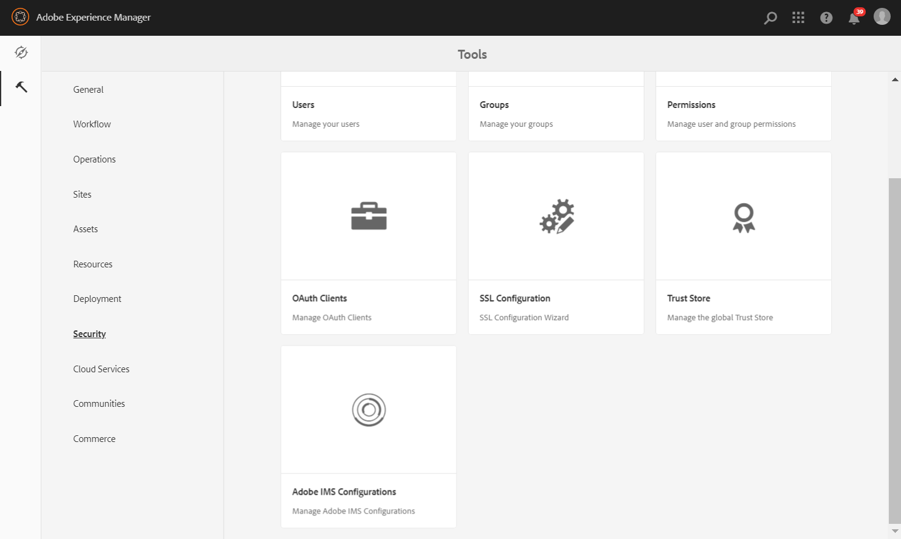
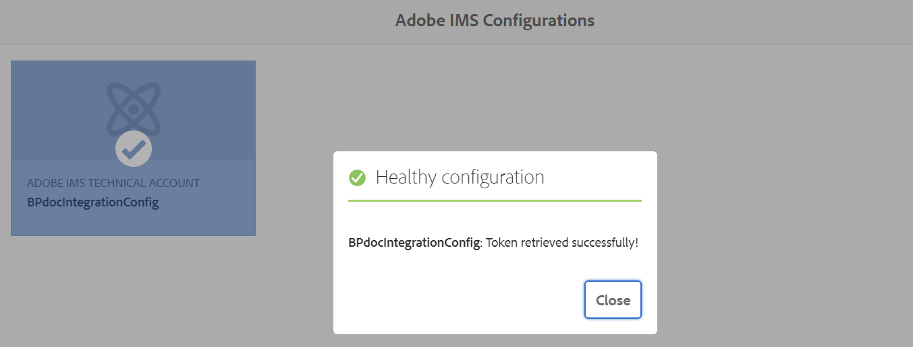

# AEM Assets configureren met Brand Portal {#configure-integration-64}

De activa van Adobe Experience Manager (AEM) worden gevormd met het Portaal van het Merk door [!DNL Adobe I/O], die een symbolisch IMS voor vergunning van uw huurder van het Merk Portaal koopt.

>[!NOTE]
>
>Het configureren van AEM Assets met Brand Portal via [!DNL Adobe I/O] wordt ondersteund op AEM 6.4.8.0 en hoger.
>
>Eerder, werd het Portaal van het Merk gevormd in Klassieke UI via Verouderde Gateway OAuth, die de het symbolenuitwisseling van JWT gebruikt om een token van de Toegang te verkrijgen IMS voor vergunning.

>[!TIP]
>
>***Alleen voor bestaande klanten***
>
>Het wordt geadviseerd om bestaande oudere configuratie van de Gateway te blijven gebruiken OAuth. In geval, ontmoet u problemen met erfenisOAuth configuratie van de Gateway, schrapt de bestaande configuratie en creeert nieuwe configuratie via [!DNL Adobe I/O].

In deze Help worden de volgende twee gebruiksgevallen beschreven:

* [Nieuwe configuratie](#configure-new-integration-64): Als u een nieuwe gebruiker van het Portaal van het Merk bent en uw auteur van AEM Assets met het Portaal van het Merk wilt vormen, kunt u nieuwe configuratie tot stand brengen op  [!DNL Adobe I/O].
* [Configuratie](#upgrade-integration-64) upgrade: Als u een bestaande gebruiker van het Portaal van het Merk met uw de auteursinstantie van AEM Assets bent die met het Portaal van het Merk op erfenisGateway wordt gevormd OAuth, wordt het geadviseerd om de bestaande configuraties te schrappen en nieuwe configuratie te creëren op  [!DNL Adobe I/O].

De verstrekte informatie is gebaseerd op de veronderstelling dat iedereen die deze Hulp leest met de volgende technologieën vertrouwd is:

* Adobe Experience Manager- en AEM-pakketten installeren, configureren en beheren

* Linux- en Microsoft Windows-besturingssystemen gebruiken

## Vereisten {#prerequisites}

U hebt het volgende nodig om AEM Assets te configureren met Brand Portal:

* Een AEM Assets-auteur-exemplaar met het nieuwste Service Pack.
* URL van Brand Portal-tenant.
* Een gebruiker met systeembeheerdersbevoegdheden op de IMS-organisatie van de Brand Portal-tenant.

[Download en installeer AEM 6.4](#aemquickstart)

[Download en installeer de nieuwste AEM Service Pack](#servicepack)

### Download en installeer AEM 6.4 {#aemquickstart}

Het wordt aanbevolen AEM 6.4 te hebben om een AEM instantie van de auteur in te stellen. Als u niet AEM, download het van de volgende plaatsen:

* Als u een bestaande AEM klant bent, downloadt u AEM 6.4 van [Adobe-licentiewebsite](http://licensing.adobe.com).

* Als u een partner van de Adobe bent, gebruik [Adobe Partner Training Programma](https://adobe.allegiancetech.com/cgi-bin/qwebcorporate.dll?idx=82357Q) om AEM 6.4 te verzoeken.

Nadat u AEM downloadt, voor instructies aan opstelling een AEM auteursinstantie, zie [opstellen en handhaven](https://helpx.adobe.com/experience-manager/6-4/sites/deploying/using/deploy.html#defaultlocalinstall).

### Download en installeer AEM nieuwste Service Pack {#servicepack}

Zie voor gedetailleerde instructies

* [AEM 6.4 Opmerkingen bij de release Service Pack](https://helpx.adobe.com/experience-manager/6-4/release-notes/sp-release-notes.html)

**Neem contact op met Customer** Caref als u het nieuwste AEM of Service Pack niet kunt vinden.

## Configuratie maken {#configure-new-integration-64}

Voer de volgende stappen in de vermelde reeks uit als u AEM Assets met Brand Portal voor het eerst configureert:

1. [Openbaar certificaat verkrijgen](#public-certificate)
1. [ [!DNL Adobe I/O] Creatieve integratie](#createnewintegration)
1. [IMS-accountconfiguratie maken](#create-ims-account-configuration)
1. [Cloudservice configureren](#configure-the-cloud-service)
1. [Configuratie testen](#test-integration)

>[!NOTE]
>
>Een AEM Assets-auteur-instantie mag slechts met één Brand Portal-huurder worden geconfigureerd.

### IMS-configuratie maken {#create-ims-configuration}

IMS-configuratie verifieert uw Brand Portal-tenant met de AEM Assets-auteurinstantie.

De IMS-configuratie omvat twee stappen:

* [Openbaar certificaat verkrijgen](#public-certificate)
* [IMS-accountconfiguratie maken](#create-ims-account-configuration)

### Openbaar certificaat verkrijgen {#public-certificate}

Met een openbaar certificaat kunt u uw profiel verifiëren op [!DNL Adobe I/O].

1. Aanmelden bij de instantie van AEM Assets-auteur
Standaard-URL: http:// localhost:4502/aem/start.html
1. Ga vanuit het deelvenster **Tools**  naar **[!UICONTROL Security]** >> **[!UICONTROL Adobe IMS Configurations]**.

   

1. De pagina Adobe IMS Configurations wordt geopend.

   Klik op **[!UICONTROL Create]**.

   Hiermee gaat u naar de pagina **[!UICONTROL Adobe IMS Technical Account Configuration]**.

1. Standaard wordt het tabblad **Certificate** geopend.

   Selecteer in **Cloud Solution** de optie **[!UICONTROL Adobe Brand Portal]**.

1. Schakel het selectievakje **[!UICONTROL Create new certificate]** in en geef een **alias** op voor het certificaat. De alias fungeert als naam voor het dialoogvenster.

1. Klik op **[!UICONTROL Create certificate]**. Er wordt een dialoogvenster weergegeven. Klik op **[!UICONTROL OK]** om het openbare certificaat te genereren.

   

1. Klik op **[!UICONTROL Download Public Key]** en sla het certificaatbestand *AEM-Adobe-IMS.crt* op uw computer op. Het certificaatbestand wordt gebruikt om [create [!DNL Adobe I/O] integration](#createnewintegration) te maken.

   

1. Klik op **[!UICONTROL Next]**.

   Maak op het tabblad **Account** het Adobe IMS-account. Hiervoor hebt u echter de integratiedetails nodig. Laat deze pagina voorlopig open.

   Open een nieuw tabblad en [Maak [!DNL Adobe I/O] integratie](#createnewintegration) om de integratiegegevens voor IMS-accountconfiguraties op te halen.

### Integratie [!DNL Adobe I/O] maken {#createnewintegration}

[!DNL Adobe I/O] Dankzij integratie worden API-sleutel, clientgeheim en Payload (JWT) gegenereerd die vereist zijn voor het instellen van de IMS-accountconfiguraties.

1. Meld u aan bij [!DNL Adobe I/O] Console met systeembeheerdersrechten voor de IMS-organisatie van de Poorthuurder van het Merk.

   Standaard-URL: [https://console.adobe.io/](https://console.adobe.io/)

1. Klik op **[!UICONTROL Create Integration]**.

1. Selecteer **[!UICONTROL Access an API]** en klik op **[!UICONTROL Continue]**.

   

1. Een pagina voor het maken van een nieuwe integratie wordt geopend.

   Selecteer uw organisatie in de vervolgkeuzelijst.

   Selecteer in **[!UICONTROL Experience Cloud]** de optie **[!UICONTROL AEM Brand Portal]** en klik op **[!UICONTROL Continue]**.

   Als de optie Brand Portal voor u is uitgeschakeld, controleert u of u de juiste organisatie hebt geselecteerd in het keuzemenu boven de optie **[!UICONTROL Adobe Services]**. Neem contact op met de beheerder als u uw organisatie niet kent.

   

1. Geef een naam en een beschrijving voor de integratie op. Klik op **[!UICONTROL Select a File from your computer]** en upload het bestand `AEM-Adobe-IMS.crt` dat u hebt gedownload in de sectie voor het [verkrijgen van openbare certificaten](#public-certificate).

1. Selecteer het profiel van uw organisatie.

   Of selecteer het standaardprofiel **[!UICONTROL Assets Brand Portal]** en klik op **[!UICONTROL Create Integration]**. De integratie wordt gemaakt.

1. Klik op **[!UICONTROL Continue to integration details]** om de integratiegegevens weer te geven.

   Kopieer de **[!UICONTROL API Key]**

   Klik op **[!UICONTROL Retrieve Client Secret]** en kopieer de sleutel van het clientgeheim.

   

1. Ga naar het tabblad **[!UICONTROL JWT]** en kopieer de **[!UICONTROL JWT payload]**.

   De informatie over de API-sleutel, de sleutel van het clientgeheim en de JWT-payload worden gebruikt om een IMS-accountconfiguratie te maken.

### IMS-accountconfiguratie maken {#create-ims-account-configuration}

Controleer of u de volgende stappen hebt uitgevoerd:

* [Openbaar certificaat verkrijgen](#public-certificate)
* [ [!DNL Adobe I/O] Creatieve integratie](#createnewintegration)

**Stappen om IMS-accountconfiguratie te maken:**

1. Open op de pagina IMS Configuration het tabblad **[!UICONTROL Accounts]**. U hebt de pagina open gelaten aan het einde van de sectie voor [Openbaar certificaat verkrijgen](#public-certificate).

1. Geef een **[!UICONTROL Title]** op voor het IMS-account.

   Voer in **[!UICONTROL Authorization Server]** de volgende URL in: [https://ims-na1.adobelogin.com/](https://ims-na1.adobelogin.com/)

   Plak de API-sleutel, de clientgeheim en de JWT-payload die u aan het einde van [Create [!DNL Adobe I/O] integration](#createnewintegration) hebt gekopieerd.

   Klik op **[!UICONTROL Create]**.

   De integratie wordt gemaakt.

   

1. Selecteer de IMS-configuratie en klik op **[!UICONTROL Check Health]**. Er wordt een dialoogvenster weergegeven.

   Klik op **[!UICONTROL Check]**. Bij een geslaagde verbinding wordt het bericht *Token retrieved successfully* weergegeven.

   

>[!CAUTION]
>
>U kunt slechts één IMS-configuratie hebben. Maak geen meerdere IMS-configuraties.
>
>Zorg ervoor dat de IMS-configuratie slaagt voor de statuscontrole. Als de configuratie niet slaagt voor de statuscontrole, is deze ongeldig. U moet deze dan verwijderen en een nieuwe, geldige configuratie maken.

### Cloudservice configureren {#configure-the-cloud-service}

Voer de volgende stappen uit om de configuratie van de Brand Portal-cloudservice te maken:

1. Aanmelden bij de instantie van AEM Assets-auteur

   Standaard-URL: http:// localhost:4502/aem/start.html
1. Ga vanuit het deelvenster **Tools**  naar **[!UICONTROL Cloud Services >> AEM Brand Portal]**.

   De pagina Brand Portal Configurations wordt geopend.

1. Klik op **[!UICONTROL Create]**.

1. Geef een **[!UICONTROL Title]** op voor de configuratie.

   Selecteer de IMS-configuratie die u in de stap [IMS-accountconfiguratie maken](#create-ims-account-configuration) hebt gemaakt.

   Voer in **[!UICONTROL Service URL]** de URL van uw Brand Portal-tenant in.

   

1. Klik op **[!UICONTROL Save and Close]**. De cloudconfiguratie wordt gemaakt. Uw AEM Assets-auteur-exemplaar is nu geïntegreerd met de Brand Portal-gebruiker.

### Configuratie testen {#test-integration}

1. Aanmelden bij de instantie van AEM Assets-auteur

   Standaard-URL: http:// localhost:4502/aem/start.html

1. Ga vanuit het deelvenster **Tools**  naar **[!UICONTROL Deployment >> Replication]**.

   

1. Replicatiepagina wordt geopend.

   Klik op **[!UICONTROL Agents on author]**.

   

1. Vier replicatieagenten worden gecreeerd voor elke huurder.

   Bepaal de plaats van de replicatieagenten van uw huurder van het Portaal van het Merk.

   Klik op de URL van de replicatieagent.

   

   >[!NOTE]
   >
   >De replicatieagenten werken parallel en delen de baandistributie gelijk, daardoor verhogend de het publiceren snelheid met vier keer de originele snelheid. Nadat de wolkendienst wordt gevormd, wordt de extra configuratie niet vereist om de replicatieagenten toe te laten die door gebrek worden geactiveerd om parallelle publicatie van veelvoudige activa toe te laten.

1. Klik op **[!UICONTROL Test Connection]** om de verbinding tussen AEM Assets-auteur en Brand Portal te controleren.

   

1. Bekijk de bodem van de testresultaten om te verifiëren dat de replicatie succesvol was.

   

1. Verifieer de testresultaten op alle vier replicatieagenten één voor één.

   >[!NOTE]
   >
   >Vermijd onbruikbaar makend om het even welke replicatieagenten, aangezien het de replicatie van sommige activa kan veroorzaken om te ontbreken.
   >
   >Zorg ervoor dat alle vier replicatieagenten worden gevormd om onderbrekingsfout te vermijden. Zie [Problemen oplossen in parallelle publicatie naar Brand Portal](https://docs.adobe.com/content/help/en/experience-manager-brand-portal/using/publish/troubleshoot-parallel-publishing.html#connection-timeout).

Brand Portal is geconfigureerd met uw AEM Assets-auteur-exemplaar. U kunt nu het volgende doen:

* [Assets publiceren van AEM Assets naar Brand Portal](../assets/brand-portal-publish-assets.md)
* [Mappen publiceren van AEM Assets naar Brand Portal](../assets/brand-portal-publish-folder.md)
* [Verzamelingen publiceren van AEM Assets naar Brand Portal](../assets/brand-portal-publish-collection.md)
* [Middelen configureren ](https://docs.adobe.com/content/help/en/experience-manager-brand-portal/using/asset-sourcing-in-brand-portal/brand-portal-asset-sourcing.html) voor de gebruikers van het Brand Portal om middelen bij te dragen aan en te publiceren naar AEM Assets.

## Upgrade van configuratie {#upgrade-integration-64}

Voer de volgende stappen in de vermelde opeenvolging uit om bestaande configuraties te bevorderen:
1. [Werken met taken controleren](#verify-jobs)
1. [Bestaande configuraties verwijderen](#delete-existing-configuration)
1. [Configuratie maken](#configure-new-integration-64)

### Taak {#verify-jobs} controleren

Zorg ervoor dat er geen publicatietaak wordt uitgevoerd op de AEM Assets-ontwerpinstantie voordat u wijzigingen aanbrengt. Voor dat, kunt u alle vier replicatieagenten verifiëren en ervoor zorgen dat de rij ideaal/leeg is.

1. Aanmelden bij de instantie van AEM Assets-auteur

   Standaard-URL: http:// localhost:4502/aem/start.html

1. Ga vanuit het deelvenster **Tools**  naar **[!UICONTROL Deployment >> Replication]**.

1. Replicatiepagina wordt geopend.

   Klik op **[!UICONTROL Agents on author]**.

   

1. Bepaal de plaats van de replicatieagenten van uw huurder van het Portaal van het Merk.

   Zorg ervoor dat **Wachtrij Idle** voor alle replicatieagenten is, is geen het publiceren baan actief.

   

### Bestaande configuraties {#delete-existing-configuration} verwijderen

U moet de volgende controle-lijst in werking stellen terwijl het schrappen van de bestaande configuratie.
* Alle vier replicatieagents verwijderen
* Cloudservice verwijderen
* MAC-gebruiker verwijderen

Voer de volgende stappen uit om de bestaande configuratie te verwijderen:

1. Meld u aan bij de AEM Assets-auteur en open CRX Lite als beheerder.

   Standaard-URL: http:// localhost:4502/crx/de/index.jsp

1. Navigeer aan `/etc/replications/agents.author` en schrap alle vier replicatieagenten van uw Poorthuurder van het Merk.

   

1. Navigeer naar `/etc/cloudservices/mediaportal` en verwijder de **configuratie van de Cloud Service**.

   

1. Navigeer aan `/home/users/mac` en schrap **de gebruiker van MAC** van uw Poorthuurder van het Merk.

   

U kunt nu [configuratie](#configure-new-integration-64) op uw AEM 6.4 auteursinstantie op [!DNL Adobe I/O] tot stand brengen.

<!--
   Comment Type: draft

   <li> </li>
   -->

<!--
   Comment Type: draft

   <li>Step text</li>
   -->

Nadat de replicatie slaagt, kunt u activa, omslagen, en Inzamelingen aan het Portaal van het Merk publiceren. Zie voor meer informatie:

* [Assets publiceren naar Brand Portal](brand-portal-publish-assets.md)
* [Middelen en mappen publiceren naar Brand Portal](brand-portal-publish-folder.md)
* [Verzamelingen publiceren naar Brand Portal](brand-portal-publish-collection.md)
