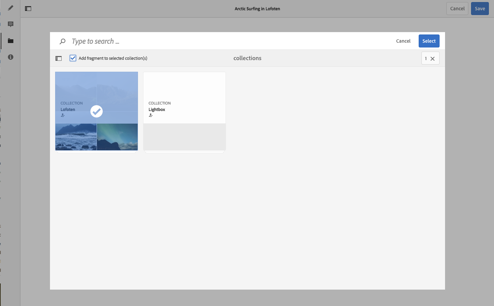
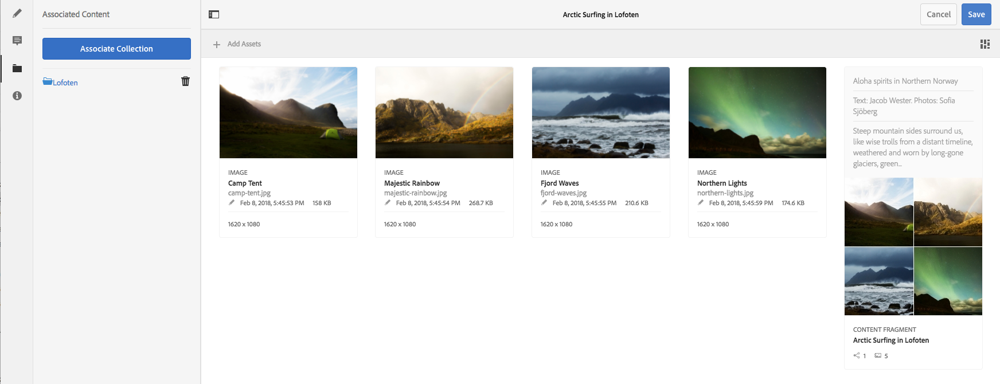

# Gekoppelde inhoud {#associated-content}

>[!CAUTION]
>
>Voor sommige functies van Content Fragment is de toepassing van [AEM 6.4 Service Pack 2 (6.4.2.0) of hoger](/help/release-notes/sp-release-notes.md)vereist.

Gekoppelde inhoud biedt de verbinding, zodat elementen (d.w.z.) (optioneel) met het fragment kunnen worden gebruikt wanneer het aan een inhoudspagina wordt toegevoegd. Dit biedt flexibiliteit door een reeks elementen [beschikbaar te stellen die u kunt gebruiken wanneer u het inhoudsfragment op een pagina](/help/sites-authoring/content-fragments.md#using-associated-content)gebruikt, en tegelijk de tijd te verkorten die nodig is om naar het juiste element te zoeken.

## Gekoppelde inhoud toevoegen {#adding-associated-content}

>[!NOTE]
>
>Er zijn verschillende methoden om [visuele elementen (bijvoorbeeld afbeeldingen)](content-fragments.md#fragments-with-visual-assets) aan het fragment en/of de pagina toe te voegen.

Als u de koppeling wilt maken, moet u eerst uw media-elementen [toevoegen aan een verzameling](managing-collections-touch-ui.md#adding-assets-to-a-collection). Zodra dat gedaan is kunt u:

1. Open your fragment and select **[!UICONTROL Associated Content]** from the side panel.

   

1. Select **[!UICONTROL Associate Content]** or **[!UICONTROL Associate Collection]** (as appropriate, depending on whether any collections have already been associated or not).
1. Selecteer de gewenste verzameling.

   U kunt optioneel het fragment zelf toevoegen aan de geselecteerde verzameling. dit is het volgen van hulpmiddelen .

   

1. Bevestig (met het vinkje). De verzameling wordt weergegeven als gekoppeld.

   

## Gekoppelde inhoud bewerken {#editing-associated-content}

Nadat u een verzameling hebt gekoppeld, kunt u:

* **Verwijder** de koppeling.
* **Voeg elementen** toe aan de verzameling.
* Selecteer een element voor verdere actie.
* Bewerk het element.

