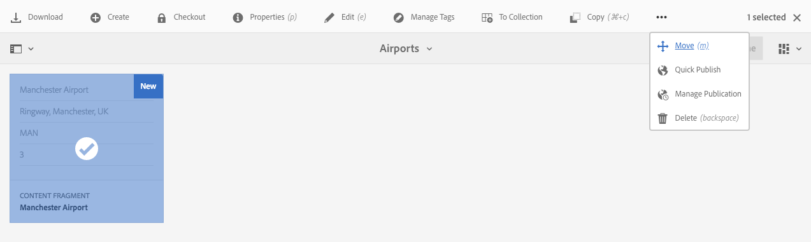
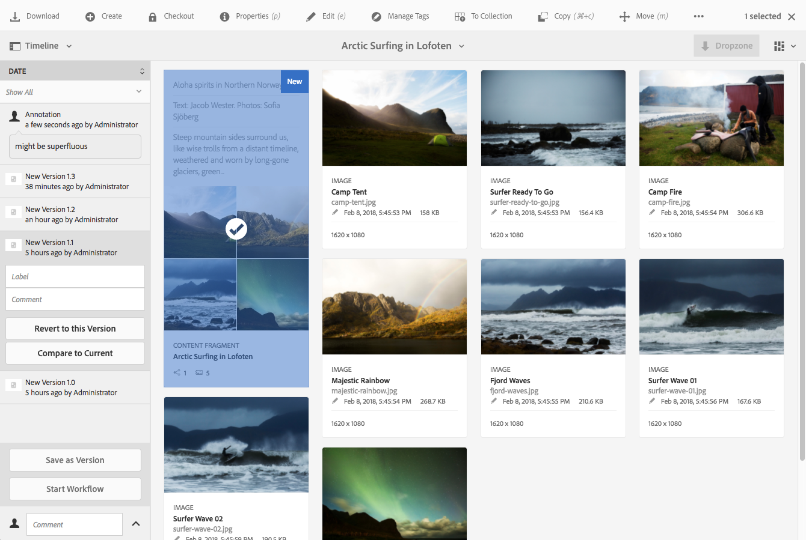

# Contentfragmenten beheren {#managing-content-fragments}

>[!CAUTION]
>
>Voor sommige functies van Content Fragment is de toepassing van [AEM 6.4 Service Pack 2 (6.4.2.0) of hoger](/help/release-notes/sp-release-notes.md)vereist.

De Fragmenten van de inhoud worden opgeslagen als **[!UICONTROL Assets]**, zodat worden hoofdzakelijk beheerd van de **[!UICONTROL Assets]** console.

>[!NOTE]
>
>Inhoudsfragmenten worden vervolgens gebruikt bij het ontwerpen van pagina&#39;s. Zie [Pagina&#39;s ontwerpen met inhoudsfragmenten](/help/sites-authoring/content-fragments.md).

## Inhoudsfragmenten maken {#creating-content-fragments}

### Een inhoudsmodel maken {#creating-a-content-model}

[U kunt contentfragmentmodellen](content-fragments-models.md) inschakelen en maken voordat u inhoudsfragmenten met gestructureerde inhoud maakt.

>[!NOTE]
>
>Zie [Inhoudsfragmenten](/help/sites-developing/customizing-content-fragments.md) ontwikkelen voor meer informatie over sjablonen; worden gebruikt voor eenvoudige inhoudsfragmenten.

### Een inhoudsfragment maken {#creating-a-content-fragment}

De methode voor het maken van een inhoudsfragment is (in principe) hetzelfde voor eenvoudige en gestructureerde fragmenten:

1. Ga naar de map **[!UICONTROL Assets]** waar u het fragment wilt maken.
1. Selecteer **[!UICONTROL Create]**, dan **[!UICONTROL Content Fragment]** om de tovenaar te openen.
1. In de eerste stap van de wizard moet u de basis van het nieuwe fragment opgeven.

   * Dit kan een:

      * [Sjabloon](/help/sites-developing/content-fragment-templates.md) - bijvoorbeeld **[!UICONTROL Simple Fragment]**
      * [Model](content-fragments-models.md) - wordt gebruikt om een fragment tot stand te brengen dat gestructureerde inhoud vereist; bijvoorbeeld het **luchthavenmodel**
   * Alle beschikbare sjablonen en modellen worden weergegeven.

   Na selectie kunt u doorgaan **[!UICONTROL Next]** .

   

1. In the **[!UICONTROL Properties]** step specify:

   * **[!UICONTROL Basic]**

      * **[!UICONTROL Title]**

         De fragmenttitel.

         Verplicht.

      * **[!UICONTROL Description]**
      * **[!UICONTROL Tags]**
   * **[!UICONTROL Advanced]**

      * **[!UICONTROL Name]**

         de naam; wordt gebruikt om de URL te vormen.

         Verplicht; wordt automatisch afgeleid van de titel, maar kan worden bijgewerkt.

1. Select **[!UICONTROL Create]** to complete the action, then either **[!UICONTROL Open]** the fragment for editing or return to the console with **[!UICONTROL Done]**.

## Handelingen voor een inhoudsfragment {#actions-for-a-content-fragment}

In de **[!UICONTROL Assets]** console is een reeks acties beschikbaar voor uw inhoudsfragmenten:

* van de werkbalk; nadat u het fragment hebt geselecteerd, zijn alle relevante handelingen beschikbaar.
* als [snelle acties](/help/sites-authoring/basic-handling.md#quick-actions); een subset van acties beschikbaar voor de afzonderlijke fragmentkaarten.

Selecteer het fragment om de werkbalk weer te geven met de toepasselijke acties:

* **[!UICONTROL Download]**

   * Sla het fragment op als een ZIP-bestand. U kunt definiëren of u Elements, Variaties, Metagegevens wilt opnemen.

* **[!UICONTROL Create]**
* **[!UICONTROL Checkout]**
* **[!UICONTROL Properties]**

   * Hiermee kunt u de metagegevens van het fragment weergeven en/of bewerken.

* **[!UICONTROL Edit]**

   * Hiermee kunt u het fragment [openen voor het bewerken van inhoud](content-fragments-variations.md) , samen met de elementen, variaties, bijbehorende inhoud en metagegevens.

* **[!UICONTROL Manage Tags]**
* **[!UICONTROL To Collection]**

   * Voeg het fragment toe aan een verzameling.
   * Dit kan ook worden gedaan wanneer u een verzameling [aan het fragment](content-fragments-assoc-content.md#adding-associated-content)koppelt.

* **[!UICONTROL Copy/Paste]**
* **[!UICONTROL Move]**
* **[!UICONTROL Quick Publish]**
* **[!UICONTROL Manage Publication]**
* **[!UICONTROL Delete]**

>[!NOTE]
>
>Veel van deze acties zijn [standaardhandelingen voor middelen](managing-assets-touch-ui.md) en/of de [bureaubladtoepassing](https://helpx.adobe.com/experience-manager/desktop-app/aem-desktop-app.html).

## De fragmenteditor openen {#opening-the-fragment-editor}

Uw fragment openen voor bewerken:

>[!CAUTION]
>
>Voor het bewerken van een inhoudsfragment hebt u [de juiste machtigingen](/help/sites-developing/customizing-content-fragments.md#asset-permissions)nodig. Neem contact op met de systeembeheerder als er problemen optreden.

1. Gebruik de **[!UICONTROL Assets]** console om naar de locatie van het inhoudsfragment te navigeren.
1. Open het fragment voor bewerking door:

   * Klikken of tikken op de fragment- of fragmentkoppeling (dit is afhankelijk van de consoleweergave).
   * Het fragment selecteren en vervolgens **[!UICONTROL Edit]** vanaf de werkbalk.

   De fragmenteditor wordt geopend:

   

   >[!NOTE]
   >
   >1. Er wordt een bericht weergegeven wanneer al naar het fragment wordt verwezen op een inhoudspagina.
      >
      >
   2. Het zijpaneel kan worden verborgen/getoond gebruikend het **[!UICONTROL Toggle Side Panel]** pictogram.

1. Navigeer door de drie modi met de pictogrammen in het zijpaneel:

   * Variaties: [De inhoud](#editing-the-content-of-your-fragment) bewerken en de variaties [beheren](#creating-and-managing-variations-within-your-fragment)
   * [Annotaties](content-fragments-variations.md#annotating-a-content-fragment)
   * [Gekoppelde inhoud](#associating-content-with-your-fragment)
   * [Metagegevens](#viewing-and-editing-the-metadata-properties-of-your-fragment)

   

1. Na het aanbrengen van veranderingen, gebruik **[!UICONTROL Save]** of **[!UICONTROL Cancel]** zoals vereist.

   >[!NOTE]
   >
   >Both **[!UICONTROL Save]** and **[!UICONTROL Cancel]** will exit the editor - see [Save, Cancel and Versions](#save-cancel-and-versions) for full information on how both options operate for content fragments.

## Opslaan, Annuleren en versies {#save-cancel-and-versions}

>[!NOTE]
>
>Versies kunnen ook worden [gemaakt, vergeleken en teruggezet vanaf de tijdlijn](https://helpx.adobe.com/experience-manager/6-3/assets/using/content-fragments-managing.html#timeline-for-content-fragments).

De editor heeft twee opties:

* **[!UICONTROL Save]**

   Hiermee slaat u de laatste wijzigingen op en sluit u de editor af.

   >[!CAUTION]
   >
   >Voor het bewerken van een inhoudsfragment hebt u [de juiste machtigingen](/help/sites-developing/customizing-content-fragments.md#asset-permissions)nodig. Neem contact op met de systeembeheerder als er problemen optreden.

   >[!NOTE]
   >
   >Het is mogelijk om in de redacteur te blijven, makend een reeks veranderingen, alvorens te selecteren **[!UICONTROL Save]**.

   >[!CAUTION]
   >
   >Naast het eenvoudig opslaan van uw veranderingen, werkt **[!UICONTROL Save]** ook om het even welke verwijzingen bij en zorgt ervoor dat de verzender zoals vereist wordt gespoeld. Deze wijzigingen kunnen enige tijd in beslag nemen. Hierdoor kan de prestaties van een groot/complex/zwaar geladen systeem worden beïnvloed.
   >
   >
   >Houd hier rekening mee wanneer u de fragmenteditor gebruikt **[!UICONTROL Save]** en voer deze snel opnieuw in om verdere wijzigingen aan te brengen en op te slaan.

* **[!UICONTROL Cancel]**

   Sluit de editor af zonder de laatste wijzigingen op te slaan.

Tijdens het bewerken van het inhoudsfragment AEM automatisch versies worden gemaakt om ervoor te zorgen dat eerdere inhoud kan worden hersteld als u **[!UICONTROL Cancel]** uw wijzigingen aanbrengt:

1. Wanneer een inhoudsfragment wordt geopend voor het bewerken AEM wordt gecontroleerd op het bestaan van een token op basis van cookies dat aangeeft of een *bewerkingssessie* bestaat:

   1. Als het token wordt gevonden, wordt het fragment beschouwd als onderdeel van de bestaande bewerkingssessie.
   1. Als het token *niet* beschikbaar is en de gebruiker begint met het bewerken van inhoud, wordt een versie gemaakt en wordt een token voor deze nieuwe bewerkingssessie verzonden naar de client, waar deze wordt opgeslagen in een cookie.

1. Terwijl er een *actieve* bewerkingssessie is, wordt de inhoud die wordt bewerkt automatisch om de 600 seconden opgeslagen (standaard).

   >[!NOTE]
   >
   >Het auto sparen interval is configureerbaar gebruikend het `/conf` mechanisme.
   >
   >Standaardwaarde, zie:
   >
   >`/libs/settings/dam/cfm/jcr:content/autoSaveInterval`

1. Als de gebruiker op **[!UICONTROL Cancel]** de bewerking klikt, wordt de versie die aan het begin van de bewerkingssessie is gemaakt, hersteld en wordt de token verwijderd om de bewerkingssessie te beëindigen.
1. Als de gebruiker de bewerkingen selecteert, blijven **[!UICONTROL Save]** de bijgewerkte elementen/variaties behouden en wordt het token verwijderd om de bewerkingssessie te beëindigen.

## De inhoud van het fragment bewerken {#editing-the-content-of-your-fragment}

Nadat u het fragment hebt geopend, kunt u het tabblad [Variaties](content-fragments-variations.md) gebruiken om de inhoud te ontwerpen.

## Variaties maken en beheren in uw fragment {#creating-and-managing-variations-within-your-fragment}

Nadat u de Master inhoud hebt gemaakt, kunt u [Variaties](content-fragments-variations.md) van die inhoud maken en beheren.

## Inhoud koppelen aan uw fragment {#associating-content-with-your-fragment}

U kunt inhoud [ook](content-fragments-assoc-content.md) aan een fragment koppelen. Dit biedt een verbinding zodat elementen (d.w.z. afbeeldingen) (optioneel) met het fragment kunnen worden gebruikt wanneer het aan een inhoudspagina wordt toegevoegd.

## De metagegevens (eigenschappen) van het fragment weergeven en bewerken {#viewing-and-editing-the-metadata-properties-of-your-fragment}

U kunt de eigenschappen van een fragment weergeven en bewerken met het [[!UICONTROL Metadata]](content-fragments-metadata.md) tabblad.

## Tijdlijn voor inhoudsfragmenten {#timeline-for-content-fragments}

Naast de standaardopties biedt de [tijdlijn](managing-assets-touch-ui.md#timeline) zowel informatie als handelingen die specifiek zijn voor inhoudsfragmenten:

* Informatie weergeven over versies, opmerkingen en annotaties
* Handelingen voor versies

   * **[[!UICONTROL Revert to this Version]](#reverting-to-a-version)** (selecteer een bestaand fragment en selecteer vervolgens een specifieke versie)
   * **[[!UICONTROL Compare to Current]](#comparing-fragment-versions)** (selecteer een bestaand fragment en selecteer vervolgens een specifieke versie)
   * Een **[!UICONTROL Label]** en/of **[!UICONTROL Comment]** (selecteer een bestaand fragment en selecteer vervolgens een specifieke versie) toevoegen
   * **[!UICONTROL Save as Version]** (selecteer een bestaand fragment en klik vervolgens op de pijl omhoog onder aan de tijdlijn)

* Handelingen voor annotaties

   * **[!UICONTROL Delete]**

>[!NOTE]
>
>Opmerkingen zijn:
>
>* Standaardfunctionaliteit voor alle elementen
>* Gemaakt in tijdlijn
>* Verwant aan het fragmentelement

>
>
Annotaties (voor inhoudsfragmenten) zijn:
>
>* Opgegeven in de fragmenteditor
>* Specifiek voor een geselecteerd tekstsegment binnen het fragment

Bijvoorbeeld:

## Fragmentversies vergelijken {#comparing-fragment-versions}

De **[!UICONTROL Compare to Current]** actie is beschikbaar bij [[!UICONTROL Timeline]](https://helpx.adobe.com/experience-manager/6-3/assets/using/content-fragments-managing.html#timeline-for-content-fragments) nadat u een specifieke versie hebt geselecteerd.

Hiermee wordt het volgende geopend:

* de **[!UICONTROL Current]** (meest recente) versie (links)

* de geselecteerde versie **v&lt;*x.y*>** (rechts)

Zij worden naast elkaar weergegeven, waarbij:

* Eventuele verschillen worden gemarkeerd

   * Verwijderde tekst - rood
   * Ingevoegde tekst - groen
   * Vervangen tekst - blauw

* Met het pictogram voor volledig scherm kunt u elke versie afzonderlijk openen. dan terug naar de parallelle weergave
* U kunt **[!UICONTROL Revert]** naar de specifieke versie gaan
* **[!UICONTROL Done]** zult u aan de console terugkeren

>[!NOTE]
>
>U kunt de fragmentinhoud niet bewerken wanneer u fragmenten vergelijkt.

## Een versie herstellen  {#reverting-to-a-version}

U kunt terugkeren naar een specifieke versie van het fragment:

* Rechtstreeks van de [[!UICONTROL Timeline]](content-fragments-managing.md#timeline-for-content-fragments).

   Selecteer eerst de gewenste versie en daarna de **[!UICONTROL Revert to this Version]** handeling.

* Bij het [vergelijken van een versie met de huidige versie](content-fragments-managing.md#comparing-fragment-versions) kunt u **[!UICONTROL Revert]** de geselecteerde versie gebruiken.

## Een fragment publiceren en ernaar verwijzen {#publishing-and-referencing-a-fragment}

>[!CAUTION]
>
>Als het fragment op een model is gebaseerd, moet u ervoor zorgen dat het [model is gepubliceerd](content-fragments-models.md#publishing-a-content-fragment-model).
>
>Als u een inhoudsfragment publiceert waarvoor het model nog niet is gepubliceerd, wordt dit in een selectielijst aangegeven en wordt het model met het fragment gepubliceerd.

Inhoudsfragmenten moeten worden gepubliceerd voor gebruik in de publicatieomgeving. Zij kunnen worden gepubliceerd:

* Na de aanmaak; vanuit de **[!UICONTROL Assets]** console.
* Wanneer u een pagina [publiceert die het fragment](/help/sites-authoring/content-fragments.md#publishing)gebruikt; het fragment wordt weergegeven in de paginaverwijzingen.

>[!CAUTION]
>
>Nadat een fragment is gepubliceerd en/of waarnaar wordt verwezen, geeft AEM een waarschuwing weer wanneer een auteur het fragment opent om opnieuw te bewerken. Hiermee wordt u gewaarschuwd dat wijzigingen in het fragment ook van invloed zijn op de pagina&#39;s waarnaar wordt verwezen.

## Een fragment verwijderen {#deleting-a-fragment}

Een fragment verwijderen:

1. Navigeer in de **[!UICONTROL Assets]** console naar de locatie van het inhoudsfragment.
1. Selecteer het fragment.

   >[!NOTE]
   >
   >De **[!UICONTROL Delete]** handeling is niet beschikbaar als een snelle handeling.

1. Select **[!UICONTROL Delete]** from the toolbar.
1. Bevestig de **[!UICONTROL Delete]** handeling.

   >[!CAUTION]
   >
   >If the fragment is already referenced in a page you will then see a warning message and be required to confirm that you want to proceed with a **[!UICONTROL Force Delete]**. Het fragment wordt samen met de bijbehorende component voor contentfragmenten uit alle contentpagina&#39;s verwijderd.

