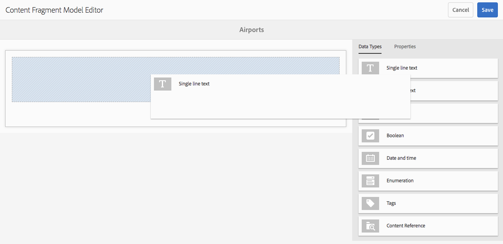

# Modellen van contentfragmenten {#content-fragment-models}

>[!CAUTION]
>
>Voor sommige functies van Content Fragment is de toepassing van [AEM 6.4 Service Pack 2 (6.4.2.0) of hoger](../release-notes/sp-release-notes.md)vereist.

Met Content Fragment Models wordt de structuur van de inhoud voor [inhoudsfragmenten](content-fragments.md)gedefinieerd.

## Enable Content Fragment Models {#enable-content-fragment-models}

>[!CAUTION]
>
>Als u deze optie niet inschakelt **[!UICONTROL Content Fragment Models]**, is de **[!UICONTROL Create]** optie niet beschikbaar voor het maken van nieuwe modellen.

Als u modellen van inhoudsfragmenten wilt inschakelen, moet u:

* Het gebruik van modellen van inhoudsfragmenten inschakelen in configuratiebeheer
* De configuratie toepassen op de map Middelen

### Modellen van inhoudsfragmenten inschakelen in Configuratiebeheer {#enable-content-fragment-models-in-configuration-manager}

Om een nieuw Model [van het Fragment van de Inhoud te](#creating-a-content-fragment-model) creëren **moet** u hen eerst toelaten gebruikend de Manager van de Configuratie:

1. Navigeer naar **[!UICONTROL Tools]**, **[!UICONTROL General]** en open het **[!UICONTROL Configuration Browser]**.
1. Selecteer de locatie die geschikt is voor uw website.
1. Hiermee opent u **[!UICONTROL Create]** het dialoogvenster waarin u:

   1. Specify a **[!UICONTROL Title]**.
   1. Selecteer deze optie **[!UICONTROL Content Fragment Models]** om het gebruik ervan in te schakelen.

   

1. Selecteer deze optie **[!UICONTROL Create]** om de definitie op te slaan.

### De configuratie toepassen op de middelenmap {#apply-the-configuration-to-your-assets-folder}

Wanneer de configuratie **[!UICONTROL global]** is ingeschakeld voor modellen van inhoudsfragmenten, kunnen alle modellen die gebruikers maken, worden gebruikt in elke map Middelen.

Als u andere configuraties (dat wil zeggen exclusief globaal) wilt gebruiken met een vergelijkbare map met assets, moet u de verbinding definiëren. This is done using **[!UICONTROL Configuration]** in the **[!UICONTROL Cloud Services]** tab of the **[!UICONTROL Folder Properties]** of the appropriate folder.

## Een inhoudsfragmentmodel maken {#creating-a-content-fragment-model}

1. Navigeer naar **[!UICONTROL Tools]**, **[!UICONTROL Assets]** open dan **[!UICONTROL Content Fragment Models]**.
1. Navigeer naar de map die geschikt is voor uw [configuratie](#enable-content-fragment-models).
1. Gebruik deze optie **[!UICONTROL Create]** om de wizard te openen.

   >[!CAUTION]
   >
   >Als het [gebruik van inhoudsfragmentmodellen niet is ingeschakeld](#enable-content-fragment-models), is de optie **Maken** niet beschikbaar.

1. Specify the **[!UICONTROL Model Title]**. You can also add a **[!UICONTROL Description]** if required.

   

1. Gebruik deze optie **[!UICONTROL Create]** om het lege model op te slaan. Een bericht zal op het succes van de actie wijzen, kunt u selecteren **[!UICONTROL Open]** om het model onmiddellijk uit te geven, of aan de console terug **[!UICONTROL Done]** te keren.

## Het model van het inhoudsfragment definiëren {#defining-your-content-fragment-model}

Het inhoudsfragmentmodel definieert in feite de structuur van de resulterende inhoudsfragmenten. Gebruikend de modelredacteur kunt u, de vereiste gebieden toevoegen en vormen:

>[!CAUTION]
>
>Het bewerken van een bestaand inhoudsfragmentmodel kan invloed hebben op afhankelijke fragmenten.

1. Navigeer naar **[!UICONTROL Tools]**, **[!UICONTROL Assets]** open dan **[!UICONTROL Content Fragment Models]**.

1. Navigeer naar de map met het fragmentmodel van de inhoud.
1. Open het vereiste model voor **[!UICONTROL Edit]**; gebruik de snelle actie of selecteer het model en de actie op de werkbalk.

   Zodra open de modelredacteur toont:

   * links: velden al gedefinieerd
   * right: **[!UICONTROL Data Types]** available for creating fields (and **[!UICONTROL Properties]** for use once fields have been created)

   >[!NOTE]
   >
   >When a field is **Required**, the **Label** indicated in the left pane will be marked with an asterix (**&amp;ast;**).

   

1. **Een veld toevoegen**

   * Sleep een vereist gegevenstype naar de vereiste locatie voor een veld:

   

   * Nadat een veld aan het model is toegevoegd, worden in het rechterdeelvenster de **eigenschappen** weergegeven die voor dat specifieke gegevenstype kunnen worden gedefinieerd. Hier kunt u definiëren wat voor dat veld is vereist. Bijvoorbeeld:

   

1. **Een veld verwijderen**

   Selecteer het vereiste veld en klik op het pictogram met de prullenbak of tik erop. U wordt gevraagd de actie te bevestigen.

   

1. Nadat u alle vereiste velden hebt toegevoegd en de eigenschappen hebt gedefinieerd, kunt u de definitie **[!UICONTROL Save]** behouden. Bijvoorbeeld:

   

## Een inhoudsfragmentmodel verwijderen {#deleting-a-content-fragment-model}

>[!CAUTION]
>
>Het verwijderen van een inhoudsfragmentmodel kan invloed hebben op afhankelijke fragmenten.

Een inhoudsfragmentmodel verwijderen:

1. Navigeer naar **[!UICONTROL Tools]**, **[!UICONTROL Assets]** open dan **[!UICONTROL Content Fragment Models]**.

1. Navigeer naar de map met het fragmentmodel van de inhoud.
1. Selecteer het model, gevolgd door **[!UICONTROL Delete]** het model op de werkbalk.

   >[!NOTE]
   >
   >Als naar het model wordt verwezen, wordt een waarschuwing gegeven. Voer de juiste actie uit.

## Een inhoudsfragmentmodel publiceren {#publishing-a-content-fragment-model}

Inhoudsfragmentmodellen moeten worden gepubliceerd wanneer/voordat afhankelijke inhoudsfragmenten worden gepubliceerd.

Een fragmentmodel voor inhoud publiceren:

1. Navigeer naar **[!UICONTROL Tools]**, **[!UICONTROL Assets]** open dan **[!UICONTROL Content Fragment Models]**.

1. Navigeer naar de map met het fragmentmodel van de inhoud.
1. Selecteer het model, gevolgd door **[!UICONTROL Publish]** het model op de werkbalk.

   >[!NOTE]
   >
   >Als u een inhoudsfragment publiceert waarvoor het model nog niet is gepubliceerd, wordt dit in een selectielijst aangegeven en wordt het model met het fragment gepubliceerd.

