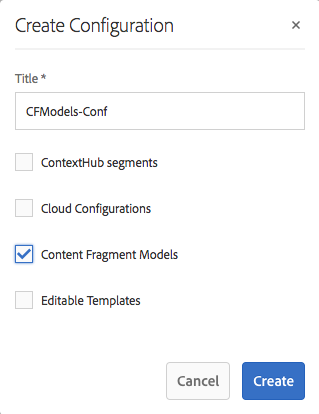

# Modellen van contentfragmenten {#content-fragment-models}

>[!CAUTION]
>
>AEM 6.4 heeft het einde van de uitgebreide ondersteuning bereikt en deze documentatie wordt niet meer bijgewerkt. Raadpleeg voor meer informatie onze [technische ondersteuningsperioden](https://helpx.adobe.com/support/programs/eol-matrix.html). Ondersteunde versies zoeken [hier](https://experienceleague.adobe.com/docs/).

>[!CAUTION]
>
>Voor bepaalde functies voor inhoudsfragmenten moet de toepassing van [AEM 6.4 Service Pack 2 (6.4.2.0) of later](../release-notes/sp-release-notes.md).

Met Content Fragment Models wordt de structuur van de inhoud voor uw [inhoudsfragmenten](content-fragments.md).

## Modellen van inhoudsfragmenten inschakelen {#enable-content-fragment-models}

>[!CAUTION]
>
>Als u deze optie niet inschakelt **[!UICONTROL Content Fragment Models]** de **[!UICONTROL Create]** Deze optie is niet beschikbaar voor het maken van nieuwe modellen.

Als u modellen van inhoudsfragmenten wilt inschakelen, moet u:

* Het gebruik van modellen van inhoudsfragmenten inschakelen in configuratiebeheer
* De configuratie toepassen op de map Middelen

### Modellen van inhoudsfragmenten inschakelen in Configuratiebeheer {#enable-content-fragment-models-in-configuration-manager}

Naar [een nieuw inhoudsfragmentmodel maken](#creating-a-content-fragment-model) u **moet** laat eerst hen toe gebruikend de Manager van de Configuratie:

1. Navigeren naar **[!UICONTROL Tools]**, **[!UICONTROL General]** en open vervolgens de **[!UICONTROL Configuration Browser]**.
   * Zie de [Documentatie van de configuratievenster](/help/sites-administering/configurations.md) voor meer informatie .
1. Selecteer de locatie die geschikt is voor uw website.
1. Gebruiken **[!UICONTROL Create]** om het dialoogvenster te openen, waarin u:

   1. Geef een **[!UICONTROL Title]**.
   1. Selecteren **[!UICONTROL Content Fragment Models]** om het gebruik ervan mogelijk te maken.

   

1. Selecteren **[!UICONTROL Create]** om de definitie op te slaan.

### De configuratie toepassen op de middelenmap {#apply-the-configuration-to-your-assets-folder}

Wanneer de configuratie **[!UICONTROL global]** is ingeschakeld voor modellen van inhoudsfragmenten, kunnen de modellen die gebruikers maken, worden gebruikt in elke map Middelen.

Als u andere configuraties (dat wil zeggen exclusief globaal) wilt gebruiken met een vergelijkbare map met assets, moet u de verbinding definiëren. Dit gebeurt met **[!UICONTROL Configuration]** in de **[!UICONTROL Cloud Services]** tabblad van het dialoogvenster **[!UICONTROL Folder Properties]** van de desbetreffende map.

## Een inhoudsfragmentmodel maken {#creating-a-content-fragment-model}

1. Navigeren naar **[!UICONTROL Tools]**, **[!UICONTROL Assets]** en vervolgens openen **[!UICONTROL Content Fragment Models]**.
1. Navigeer naar de map die geschikt is voor uw [configuratie](#enable-content-fragment-models).
1. Gebruiken **[!UICONTROL Create]** om de wizard te openen.

   >[!CAUTION]
   >
   >Als de [gebruik van inhoudsfragmentmodellen is niet ingeschakeld](#enable-content-fragment-models)de **Maken** is niet beschikbaar.

1. Geef de **[!UICONTROL Model Title]**. U kunt ook een **[!UICONTROL Description]** indien nodig.

   

1. Gebruiken **[!UICONTROL Create]** om het lege model op te slaan. Een bericht geeft het succes van de actie aan. U kunt **[!UICONTROL Open]** het model onmiddellijk te bewerken, of **[!UICONTROL Done]** om naar de console terug te keren.

## Het model van het inhoudsfragment definiëren {#defining-your-content-fragment-model}

Het inhoudsfragmentmodel definieert in feite de structuur van de resulterende inhoudsfragmenten. Gebruikend de modelredacteur kunt u, de vereiste gebieden toevoegen en vormen:

>[!CAUTION]
>
>Het bewerken van een bestaand inhoudsfragmentmodel kan invloed hebben op afhankelijke fragmenten.

1. Navigeren naar **[!UICONTROL Tools]**, **[!UICONTROL Assets]** en vervolgens openen **[!UICONTROL Content Fragment Models]**.

1. Navigeer naar de map met het fragmentmodel van de inhoud.
1. Open het vereiste model voor **[!UICONTROL Edit]**; gebruik de snelle actie of selecteer het model en de actie op de werkbalk.

   Zodra open de modelredacteur toont:

   * links: velden al gedefinieerd
   * rechts: **[!UICONTROL Data Types]** beschikbaar voor het maken van velden (en **[!UICONTROL Properties]** voor gebruik als er velden zijn gemaakt)

   >[!NOTE]
   >
   >Wanneer een veld **Vereist** de **Label** aangegeven in het linkerdeelvenster wordt gemarkeerd met een asterix (**&amp;asteren;**).

   

1. **Een veld toevoegen**

   * Sleep een vereist gegevenstype naar de vereiste locatie voor een veld:

   

   * Nadat een veld aan het model is toegevoegd, wordt in het rechterdeelvenster het volgende weergegeven: **Eigenschappen** die voor dat bepaalde gegevenstype kunnen worden gedefinieerd. Hier kunt u definiëren wat voor dat veld is vereist. Bijvoorbeeld:

   

1. **Een veld verwijderen**

   Selecteer het gewenste veld en klik op het pictogram van de prullenbak of tik erop. U wordt gevraagd de actie te bevestigen.

   

1. Nadat u alle vereiste velden hebt toegevoegd en de eigenschappen hebt gedefinieerd, gebruikt u **[!UICONTROL Save]** om de definitie te handhaven. Bijvoorbeeld:

   

## Een inhoudsfragmentmodel verwijderen {#deleting-a-content-fragment-model}

>[!CAUTION]
>
>Het verwijderen van een inhoudsfragmentmodel kan invloed hebben op afhankelijke fragmenten.

Een inhoudsfragmentmodel verwijderen:

1. Navigeren naar **[!UICONTROL Tools]**, **[!UICONTROL Assets]** en vervolgens openen **[!UICONTROL Content Fragment Models]**.

1. Navigeer naar de map met het fragmentmodel van de inhoud.
1. Selecteer uw model, gevolgd door **[!UICONTROL Delete]** op de werkbalk.

   >[!NOTE]
   >
   >Als naar het model wordt verwezen, wordt een waarschuwing gegeven. Voer de juiste actie uit.

## Een inhoudsfragmentmodel publiceren {#publishing-a-content-fragment-model}

Inhoudsfragmentmodellen moeten worden gepubliceerd wanneer/voordat afhankelijke inhoudsfragmenten worden gepubliceerd.

Een fragmentmodel voor inhoud publiceren:

1. Navigeren naar **[!UICONTROL Tools]**, **[!UICONTROL Assets]** en vervolgens openen **[!UICONTROL Content Fragment Models]**.

1. Navigeer naar de map met het fragmentmodel van de inhoud.
1. Selecteer uw model, gevolgd door **[!UICONTROL Publish]** op de werkbalk.

   >[!NOTE]
   >
   >Als u een inhoudsfragment publiceert waarvoor het model nog niet is gepubliceerd, wordt dit in een selectielijst aangegeven en wordt het model met het fragment gepubliceerd.
