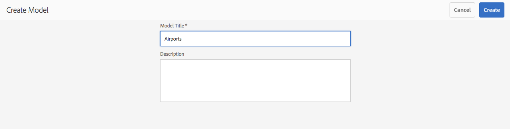

# Modellen van contentfragmenten {#content-fragment-models}

>[!CAUTION]
>
>Voor bepaalde functionaliteit voor inhoudsfragmenten is de toepassing van [AEM 6.4 Service Pack 2 (6.4.2.0) of hoger](../release-notes/sp-release-notes.md) vereist.

Met Inhoudsfragmentmodellen wordt de inhoudsstructuur gedefinieerd voor uw [inhoudsfragmenten](content-fragments.md).

## Modellen van inhoudsfragmenten {#enable-content-fragment-models} inschakelen

>[!CAUTION]
>
>Als u **[!UICONTROL Content Fragment Models]** niet inschakelt, is de optie **[!UICONTROL Create]** niet beschikbaar voor het maken van nieuwe modellen.

Als u modellen van inhoudsfragmenten wilt inschakelen, moet u:

* Het gebruik van modellen van inhoudsfragmenten inschakelen in configuratiebeheer
* De configuratie toepassen op de map Middelen

### Modellen van inhoudsfragmenten inschakelen in Configuratiebeheer {#enable-content-fragment-models-in-configuration-manager}

Om [een nieuw Model van het Fragment van de Inhoud te creëren ](#creating-a-content-fragment-model) u **moet** eerst hen toelaten gebruikend de Manager van de Configuratie:

1. Navigeer naar **[!UICONTROL Tools]**, **[!UICONTROL General]** en open vervolgens **[!UICONTROL Configuration Browser]**.
   * Zie de [documentatie van de Browser van de Configuratie](/help/sites-administering/configurations.md) voor meer informatie.
1. Selecteer de locatie die geschikt is voor uw website.
1. Gebruik **[!UICONTROL Create]** om het dialoogvenster te openen, waarin u:

   1. Geef een **[!UICONTROL Title]** op.
   1. Selecteer **[!UICONTROL Content Fragment Models]** om het gebruik ervan in te schakelen.

   

1. Selecteer **[!UICONTROL Create]** om de definitie op te slaan.

### Pas de Configuratie op uw Omslag van Activa {#apply-the-configuration-to-your-assets-folder} toe

Wanneer de configuratie **[!UICONTROL global]** is ingeschakeld voor modellen van inhoudsfragmenten, kunnen modellen die gebruikers maken, worden gebruikt in elke map Middelen.

Als u andere configuraties (dat wil zeggen exclusief globaal) wilt gebruiken met een vergelijkbare map met assets, moet u de verbinding definiëren. Dit wordt gedaan gebruikend **[!UICONTROL Configuration]** op **[!UICONTROL Cloud Services]** lusje van **[!UICONTROL Folder Properties]** van de aangewezen omslag.

## Een inhoudsfragmentmodel maken {#creating-a-content-fragment-model}

1. Navigeer naar **[!UICONTROL Tools]**, **[!UICONTROL Assets]** en open **[!UICONTROL Content Fragment Models]**.
1. Navigeer naar de map die geschikt is voor uw [configuratie](#enable-content-fragment-models).
1. Gebruik **[!UICONTROL Create]** om de wizard te openen.

   >[!CAUTION]
   >
   >Als het [gebruik van inhoudsfragmentmodellen niet is ingeschakeld](#enable-content-fragment-models), is de optie **Maken** niet beschikbaar.

1. Geef **[!UICONTROL Model Title]** op. U kunt desgewenst ook een **[!UICONTROL Description]** toevoegen.

   

1. Gebruik **[!UICONTROL Create]** om het lege model op te slaan. Een bericht zal op het succes van de actie wijzen, kunt u **[!UICONTROL Open]** selecteren om het model onmiddellijk uit te geven, of **[!UICONTROL Done]** om aan de console terug te keren.

## Het inhoudsfragmentmodel {#defining-your-content-fragment-model} definiëren

Het inhoudsfragmentmodel definieert in feite de structuur van de resulterende inhoudsfragmenten. Gebruikend de modelredacteur kunt u, de vereiste gebieden toevoegen en vormen:

>[!CAUTION]
>
>Het bewerken van een bestaand inhoudsfragmentmodel kan invloed hebben op afhankelijke fragmenten.

1. Navigeer naar **[!UICONTROL Tools]**, **[!UICONTROL Assets]** en open **[!UICONTROL Content Fragment Models]**.

1. Navigeer naar de map met het fragmentmodel van de inhoud.
1. Open het vereiste model voor **[!UICONTROL Edit]**; gebruik de snelle actie of selecteer het model en de actie op de werkbalk.

   Zodra open de modelredacteur toont:

   * links: velden al gedefinieerd
   * rechts: **[!UICONTROL Data Types]** beschikbaar voor het maken van velden (en **[!UICONTROL Properties]** voor gebruik zodra velden zijn gemaakt)

   >[!NOTE]
   >
   >Als een veld **Required** is, wordt **Label** in het linkerdeelvenster gemarkeerd met een asterisk (**&amp;ast;**).

   

1. **Een veld toevoegen**

   * Sleep een vereist gegevenstype naar de vereiste locatie voor een veld:

   

   * Nadat een veld aan het model is toegevoegd, wordt in het rechterdeelvenster **Eigenschappen** weergegeven die voor dat specifieke gegevenstype kunnen worden gedefinieerd. Hier kunt u definiëren wat voor dat veld is vereist. Bijvoorbeeld:

   

1. **Een veld verwijderen**

   Selecteer het gewenste veld en klik op het pictogram van de prullenbak of tik erop. U wordt gevraagd de actie te bevestigen.

   

1. Nadat u alle vereiste velden hebt toegevoegd en de eigenschappen hebt gedefinieerd, gebruikt u **[!UICONTROL Save]** om de definitie te behouden. Bijvoorbeeld:

   

## Een inhoudsfragmentmodel {#deleting-a-content-fragment-model} verwijderen

>[!CAUTION]
>
>Het verwijderen van een inhoudsfragmentmodel kan invloed hebben op afhankelijke fragmenten.

Een inhoudsfragmentmodel verwijderen:

1. Navigeer naar **[!UICONTROL Tools]**, **[!UICONTROL Assets]** en open **[!UICONTROL Content Fragment Models]**.

1. Navigeer naar de map met het fragmentmodel van de inhoud.
1. Selecteer het model, gevolgd door **[!UICONTROL Delete]** op de werkbalk.

   >[!NOTE]
   >
   >Als naar het model wordt verwezen, wordt een waarschuwing gegeven. Voer de juiste actie uit.

## Een inhoudsfragmentmodel {#publishing-a-content-fragment-model} publiceren

Inhoudsfragmentmodellen moeten worden gepubliceerd wanneer/voordat afhankelijke inhoudsfragmenten worden gepubliceerd.

Een fragmentmodel voor inhoud publiceren:

1. Navigeer naar **[!UICONTROL Tools]**, **[!UICONTROL Assets]** en open **[!UICONTROL Content Fragment Models]**.

1. Navigeer naar de map met het fragmentmodel van de inhoud.
1. Selecteer het model, gevolgd door **[!UICONTROL Publish]** op de werkbalk.

   >[!NOTE]
   >
   >Als u een inhoudsfragment publiceert waarvoor het model nog niet is gepubliceerd, wordt dit in een selectielijst aangegeven en wordt het model met het fragment gepubliceerd.

