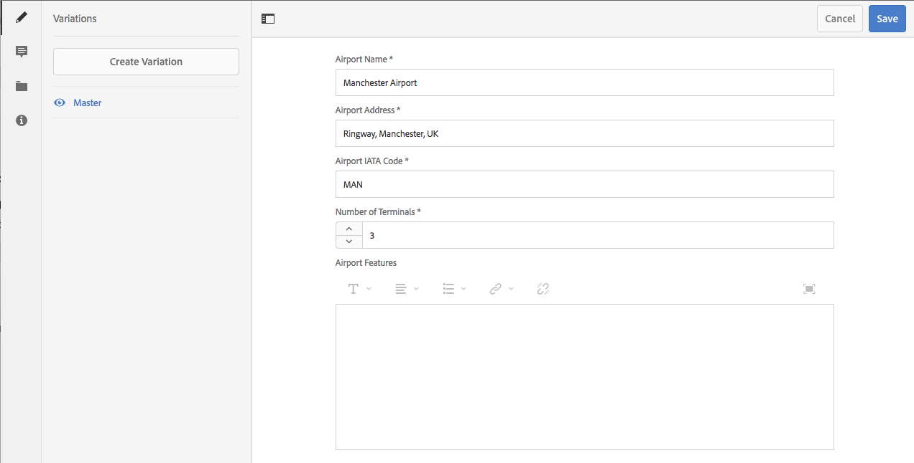

# Variaties - Authoring van content voor fragmenten {#variations-authoring-fragment-content}

>[!CAUTION]
>
>Voor bepaalde functionaliteit voor inhoudsfragmenten is de toepassing van [AEM 6.4 Service Pack 2 (6.4.2.0) of hoger](../release-notes/sp-release-notes.md) vereist.

 Variaties zijn een belangrijk kenmerk van inhoudsfragmenten, omdat u hiermee kopieën van de master inhoud kunt maken en bewerken voor gebruik op specifieke kanalen en/of scenario&#39;s.

Op het tabblad **Variaties** kunt u:

* [De ](#authoring-your-content) inhoud van het fragment invoeren
* [Variaties ](#managing-variations) in de  **** stramieninhoud maken en beheren

Voer een reeks andere acties uit afhankelijk van het gegevenstype dat wordt uitgegeven; bijvoorbeeld:

* [Visuele elementen in het fragment](#inserting-assets-into-your-fragment)  invoegen (afbeeldingen)
* Selecteer tussen [RTF](#rich-text), [Onbewerkte tekst](#plain-text) en [Markdown](#markdown) voor bewerking

* [Inhoud uploaden](#uploading-content)

* [Belangrijke statistieken](#viewing-key-statistics)  weergeven (over tekst met meerdere regels)
* [Tekst samenvatten](#summarizing-text)

* [Variaties synchroniseren met Master inhoud](#synchronizing-with-master)

>[!CAUTION]
>
>Nadat een fragment is gepubliceerd en/of waarnaar wordt verwezen, geeft AEM een waarschuwing weer wanneer een auteur het fragment opent om opnieuw te bewerken. Hiermee wordt u gewaarschuwd dat wijzigingen in het fragment ook van invloed zijn op de pagina&#39;s waarnaar wordt verwezen.

## Uw inhoud ontwerpen {#authoring-your-content}

Wanneer u het inhoudsfragment opent voor bewerking, wordt het tabblad **Variaties** standaard geopend. Hier kunt u de inhoud ontwerpen, voor Master of andere variaties. U kunt:

* direct wijzigingen aanbrengen op het tabblad **Variaties**
* Open de [volledige-schermredacteur](#full-screen-editor) aan:

   * Selecteer [Format](#formats)
   * zie meer het uitgeven opties (voor [Rich Text](#rich-text) formaat)
   * toegang tot een waaier van [acties](#actions)

Bijvoorbeeld:

* Een eenvoudig fragment bewerken

   Een eenvoudig fragment bestaat uit één tekstveld met meerdere regels (visuele elementen kunnen worden toegevoegd vanuit de volledige-schermeditor).

   

* Een fragment met gestructureerde inhoud bewerken

   Een gestructureerd fragment bevat diverse velden, van verschillende gegevenstypen, die zijn gedefinieerd in het inhoudsmodel. Voor alle velden met meerdere regels is de [volledige-schermeditor](#full-screen-editor) beschikbaar.

   

### Editor op volledig scherm {#full-screen-editor}

Als u een tekstveld met meerdere regels bewerkt, kunt u de volledige-schermeditor openen:

De volledige-schermredacteur verstrekt:

* Toegang tot verschillende [acties](#actions)
* Afhankelijk van de [indeling](#formats), aanvullende opmaakopties ([RTF](#rich-text))

### Acties {#actions}

De volgende acties zijn ook beschikbaar (voor alle [formaten](#formats)) wanneer de volledige het schermredacteur (d.w.z. multi-line tekst) open is:

* Selecteer de [indeling](#formats) ([RTF-tekst](#rich-text), [Onbewerkte tekst](#plain-text), [Markering](#markdown))
* [Tekststatistieken tonen](#viewing-key-statistics)
* [Inhoud uploaden](#uploading-content)
* [Synchroniseren met Master](#synchronizing-with-master)  (bij het bewerken van een variatie)
* [Tekst samenvatten](#summarizing-text)
* [Uw tekst ](content-fragments-variations.md#annotating-a-content-fragment) notities aanbrengen

* [Visuele elementen in het fragment](#inserting-assets-into-your-fragment)  invoegen (afbeeldingen)

### Opmaak {#formats}

De opties voor het bewerken van tekst met meerdere regels zijn afhankelijk van de geselecteerde indeling:

* [RTF](#rich-text)
* [Onbewerkte tekst](#plain-text)
* [Markering](#markdown)

De indeling kan worden geselecteerd in de schermvullende editor.

### RTF {#rich-text}

Met RTF-bewerkingen kunt u de volgende opmaken:

* Vet
* Cursief
* Onderstrepen
* Uitlijning: links, midden, rechts
* Lijst met opsommingstekens
* Genummerde lijst
* Inspringing: toename, afname
* Hyperlinks maken/verbreken
* Open de volledige-schermredacteur, waar de volgende het formatteren opties beschikbaar zijn:

   * Tekst/tekst uit Word plakken
   * Een tabel invoegen
   * Alineastijl: Alinea, kopje 1/2/3
   * [Visuele elementen invoegen](#inserting-assets-into-your-fragment)
   * Zoeken
   * Zoeken/vervangen
   * Spellingcontrole
   * [Annotaties](content-fragments-variations.md#annotating-a-content-fragment)

De [acties](#actions) zijn ook toegankelijk van de volledig-schermredacteur.

### Onbewerkte tekst {#plain-text}

Met platte tekst kunt u snel inhoud invoeren zonder opmaak- of markeringsgegevens. U kunt de volledige het schermredacteur voor verdere [acties](#actions) ook openen.

>[!CAUTION]
>
>Als u **Tekst zonder opmaak** selecteert, gaan opmaak, markdown en/of assets die u hebt ingevoegd in **Tekst met opmaak** of **Markdown** verloren.

### Markering {#markdown}

>[!NOTE]
>
>Zie de documentatie [Markdown](content-fragments-markdown.md) voor volledige informatie.

Hierdoor kunt u de tekst opmaken met behulp van een markering. U kunt het volgende definiëren:

* Koppen
* Alinea&#39;s en regeleinden
* Koppelingen
* Afbeeldingen
* Aanhalingstekens blokkeren
* Lijsten
* Nadruk
* Codeblokken
* backslash-eces

U kunt de volledige het schermredacteur voor verdere [acties](#actions) ook openen.

>[!CAUTION]
>
>Als u tussen **Tekst met opmaak** en **Markdown** schakelt, kunt u onverwachte effecten met Blokcitaten en Codeblokken ervaren, aangezien deze twee opmaakindelingen verschillen in hoe zij worden behandeld.

### Belangrijkste statistieken {#viewing-key-statistics} weergeven

Wanneer de volledige-schermeditor open is, zal de actie **Tekststatistieken** allerlei informatie over de tekst tonen. Bijvoorbeeld:

### Inhoud {#uploading-content} uploaden

Als u het maken van inhoudsfragmenten wilt vereenvoudigen, kunt u tekst uploaden die is voorbereid in een externe editor en deze rechtstreeks aan het fragment toevoegen.

### Tekst {#summarizing-text} samenvatten

Samenvattende tekst is ontworpen om gebruikers te helpen de lengte van hun tekst te beperken tot een vooraf gedefinieerd aantal woorden, terwijl de hoofdpunten en de algemene betekenis behouden blijven.

>[!NOTE]
>
>Op technisch niveau houdt het systeem de zinnen bij die het als het verstrekken van *beste verhouding van informatiedichtheid en uniciteit* volgens specifieke algoritmen beschouwt.

>[!CAUTION]
>
>Het inhoudsfragment moet een geldige taalmap hebben als voorouder. dit wordt gebruikt om het te gebruiken taalmodel te bepalen.
>
>Bijvoorbeeld `en/` zoals in het volgende pad:
>
>`/content/dam/my-brand/en/path-down/my-content-fragment`

>[!CAUTION]
>
>Engels is beschikbaar buiten de box.
>
>Andere talen zijn beschikbaar als Pakketten van het Model van de Taal van de Distributie van de Software:
>
>* [Frans (fr) van Software Distribution](https://experience.adobe.com/#/downloads/content/software-distribution/en/aem.html?package=/content/software-distribution/en/details.html/content/dam/aem/public/adobe/packages/cq630/product/smartcontent-model-fr)
>* [Duits (de) van Software Distribution](https://experience.adobe.com/#/downloads/content/software-distribution/en/aem.html?package=/content/software-distribution/en/details.html/content/dam/aem/public/adobe/packages/cq630/product/smartcontent-model-de)
>* [Italiaans (it) van softwaredistributie](https://experience.adobe.com/#/downloads/content/software-distribution/en/aem.html?package=/content/software-distribution/en/details.html/content/dam/aem/public/adobe/packages/cq630/product/smartcontent-model-it)
>* [Spaans (es) van Software Distribution](https://experience.adobe.com/#/downloads/content/software-distribution/en/aem.html?package=/content/software-distribution/en/details.html/content/dam/aem/public/adobe/packages/cq630/product/smartcontent-model-es)

>

1. Selecteer **[!UICONTROL Master]** of de vereiste variatie.
1. Open de editor voor het volledige scherm.

1. Selecteer **[!UICONTROL Summarize text]** van de toolbar.

   

1. Geef het doelaantal woorden op en selecteer **[!UICONTROL Start]**:
1. De oorspronkelijke tekst wordt naast de voorgestelde samenvatting weergegeven:

   * Alle zinnen die moeten worden verwijderd, worden rood gemarkeerd met doorhaling.
   * Klik op een gemarkeerde zin om deze in de samengevatte inhoud te houden.
   * Klik op een niet-gemarkeerde zin om deze te verwijderen.

   

1. Selecteer **[!UICONTROL Summarize]** om de wijzigingen te bevestigen.

### Een inhoudsfragment {#annotating-a-content-fragment} annoteren

Een fragment annoteren:

1. Selecteer **[!UICONTROL Master]** of de vereiste variatie.
1. Open de editor voor het volledige scherm.
1. Selecteer tekst. Het pictogram **[!UICONTROL Annotate]** wordt beschikbaar.

   

1. Er wordt een dialoogvenster geopend. Hier kunt u uw annotatie invoeren.

1. Sluit de volledige-schermredacteur en **[!UICONTROL Save]** het fragment.

### Annotaties {#viewing-editing-deleting-annotations} weergeven, bewerken en verwijderen

Annotaties:

* Deze worden aangegeven door de markering in de tekst, zowel in de modus Volledig scherm als in de normale modus van de editor. Alle details van een annotatie kunnen vervolgens worden weergegeven, bewerkt en/of verwijderd door op de gemarkeerde tekst te klikken, waarna het dialoogvenster opnieuw wordt geopend.

   >[!NOTE]
   >
   >Er is een keuzekiezer beschikbaar als er meerdere annotaties zijn toegepast op één stuk tekst.

* Wanneer u de volledige tekst verwijdert waarop de annotatie is toegepast, wordt de annotatie ook verwijderd.

* Kan worden weergegeven en verwijderd door het tabblad **[!UICONTROL Annotations]** in de fragmenteditor te selecteren.

   

* Kan worden weergegeven en verwijderd in [Tijdlijn](https://helpx.adobe.com/experience-manager/6-3/assets/using/content-fragments-managing.html#timeline-for-content-fragments) voor het geselecteerde fragment.

### Elementen invoegen in het fragment {#inserting-assets-into-your-fragment}

Als u het ontwerpen van inhoudsfragmenten wilt vereenvoudigen, kunt u [Middelen](managing-assets-touch-ui.md) (afbeeldingen) rechtstreeks aan het fragment toevoegen.

Ze worden zonder opmaak toegevoegd aan de alineasequentie van het fragment. opmaak kan worden toegepast wanneer het [fragment wordt gebruikt/ernaar wordt verwezen op een pagina](/help/sites-authoring/content-fragments.md).

>[!CAUTION]
>
>Deze elementen kunnen niet worden verplaatst of verwijderd op een pagina waarnaar wordt verwezen. Dit moet gebeuren in de fragmenteditor.
>
>Opmaak van het element (bijvoorbeeld grootte) moet echter worden uitgevoerd in de [pagina-editor](/help/sites-authoring/content-fragments.md). De representatie van het element in de fragmenteditor is uitsluitend bedoeld voor het ontwerpen van de inhoudsstroom.

>[!NOTE]
>
>Er zijn verschillende methoden om [afbeeldingen](content-fragments.md#fragments-with-visual-assets) aan het fragment en/of de pagina toe te voegen.

1. Plaats de cursor op de positie waar u de afbeelding wilt toevoegen.
1. Gebruik het pictogram **[!UICONTROL Insert Asset]** om het zoekdialoogvenster te openen.

   

1. In het dialoogvenster kunt u:

   * navigeren naar het vereiste element in DAM
   * zoeken naar de middelen in DAM

   Selecteer het gewenste element door op de miniatuur te klikken.

1. Gebruik **[!UICONTROL Select]** om het element op de huidige locatie toe te voegen aan het alineasysteem van het inhoudsfragment.

   >[!CAUTION]
   >
   >Als u na het toevoegen van een asset de indeling wijzigt in:
   >
   >* **Tekst zonder opmaak**: wordt de asset volledig uit het fragment verwijderd.
   >* **Markdown**: is de asset niet zichtbaar, maar blijft deze aanwezig wanneer u terugkeert naar **Tekst met opmaak**.

## Variaties {#managing-variations} beheren

### Een variatie {#creating-a-variation} maken

Met behulp van variaties kunt u de **Master**-inhoud innemen en deze afhankelijk van het doel variëren (indien nodig).

Een nieuwe variatie maken:

1. Open het fragment en controleer of het zijpaneel zichtbaar is.
1. Selecteer **[!UICONTROL Variations]** van de pictogrambar in het zijpaneel.
1. Selecteer **[!UICONTROL Create Variation]**.
1. Er wordt een dialoogvenster geopend waarin u de **[!UICONTROL Title]** en **[!UICONTROL Description]** voor de nieuwe variatie kunt opgeven.
1. Selecteer **[!UICONTROL Add]**; het fragment **[!UICONTROL Master]** wordt gekopieerd naar de nieuwe variant, die nu is geopend voor [bewerken](#editing-a-variation).

   >[!NOTE]
   >
   >Wanneer u een nieuwe variant maakt, wordt deze altijd **Master** gekopieerd en niet de variant die momenteel is geopend.

### Een variatie {#editing-a-variation} bewerken

U kunt wijzigingen aanbrengen in de inhoud van de variatie nadat:

* [Uw variatie](#creating-a-variation) maken.
* Een bestaand fragment openen en vervolgens de gewenste variant in het zijpaneel selecteren.

### Naam wijzigen van een variatie {#renaming-a-variation}

Een bestaande variatie een andere naam geven:

1. Open het fragment en selecteer **[!UICONTROL Variations]** in het zijpaneel.
1. Selecteer de gewenste variatie.
1. Selecteer **[!UICONTROL Rename]** van **[!UICONTROL Actions]** drop down.

1. Typ de nieuwe **[!UICONTROL Title]** en/of **[!UICONTROL Description]** in het resulterende dialoogvenster.

1. Bevestig de handeling **[!UICONTROL Rename]**.

>[!NOTE]
>
>Dit beïnvloedt slechts de variatie **Titel**.

### Een variatie {#deleting-a-variation} verwijderen

Een bestaande wijziging verwijderen:

1. Open het fragment en selecteer **[!UICONTROL Variations]** in het zijpaneel.
1. Selecteer de gewenste variatie.
1. Selecteer **[!UICONTROL Delete]** van **[!UICONTROL Actions]** drop down.

1. Bevestig de handeling **[!UICONTROL Delete]** in het dialoogvenster.

>[!NOTE]
>
>U kunt **Master** niet schrappen.

### Synchroniseren met Master {#synchronizing-with-master}

**** Masteris is een integraal onderdeel van een inhoudsfragment en bevat per definitie de master kopie van de inhoud, terwijl de variaties de afzonderlijke bijgewerkte en op maat gemaakte versies van die inhoud bevatten. Wanneer Master wordt bijgewerkt, is het mogelijk dat deze wijzigingen ook relevant zijn voor de variaties en daarom aan hen moeten worden doorgegeven.

Wanneer u een variatie bewerkt, hebt u toegang tot de handeling voor het synchroniseren van het huidige element van de variatie met Master. Op deze manier kunt u automatisch wijzigingen kopiëren die u hebt aangebracht in de Master variatie.

>[!CAUTION]
>
>De synchronisatie is alleen beschikbaar om wijzigingen *van **Master**naar de variatie* te kopiëren.
>
>Alleen het huidige element van de variatie wordt gesynchroniseerd.
>
>Synchronisatie werkt alleen op het datatype **Tekst met meerdere regels**.
>
>Het overbrengen van wijzigingen *van een variatie naar **master*** is niet beschikbaar als optie.

1. Open het inhoudsfragment in de fragmenteditor. Zorg ervoor dat **Master** is uitgegeven.
2. Selecteer een specifieke variant en kies vervolgens de gewenste synchronisatiehandeling uit:

   * de **Handelingen** keuzelijst - **Huidig element synchroniseren met master**
   * de werkbalk van de schermvullende editor - **Synchroniseren met master**

3. Master en de variatie wordt naast elkaar weergegeven:

   * groen geeft de inhoud aan die is toegevoegd (aan de variatie)
   * rood geeft aan dat inhoud is verwijderd (uit de variatie)

   

4. Selecteer **[!UICONTROL Synchronize]**, de variatie zal worden bijgewerkt en getoond.
