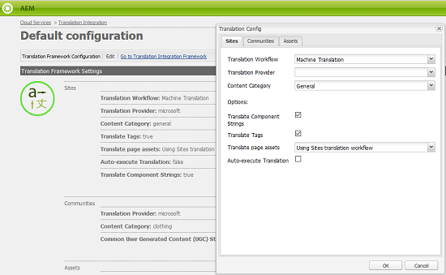
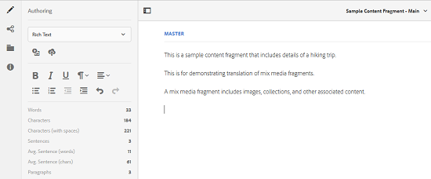
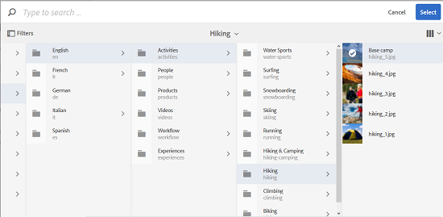
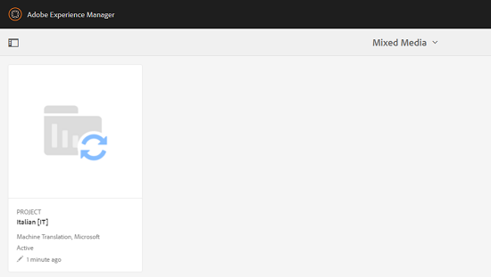

# Vertaalprojecten maken voor inhoudsfragmenten {#creating-translation-projects-for-content-fragments}

>[!CAUTION]
>
>AEM 6.4 heeft het einde van de uitgebreide ondersteuning bereikt en deze documentatie wordt niet meer bijgewerkt. Raadpleeg voor meer informatie onze [technische ondersteuningsperioden](https://helpx.adobe.com/support/programs/eol-matrix.html). Ondersteunde versies zoeken [hier](https://experienceleague.adobe.com/docs/).

Naast elementen ondersteunt Adobe Experience Manager (AEM) Assets workflows voor het kopiëren van talen voor [inhoudsfragmenten](content-fragments.md) (inclusief variaties). Er is geen extra optimalisatie vereist voor het uitvoeren van workflows voor het kopiëren van talen op inhoudsfragmenten. In elke werkstroom wordt het volledige inhoudsfragment verzonden voor vertaling.

De typen workflows die u op inhoudsfragmenten kunt uitvoeren, lijken precies op de typen werkstromen die u voor elementen uitvoert. Bovendien komen de opties die beschikbaar zijn binnen elk workflowtype overeen met de opties die beschikbaar zijn onder de corresponderende workflowtypen voor elementen.

U kunt de volgende typen werkstromen voor het kopiëren van talen uitvoeren op inhoudsfragmenten:

**Maken en vertalen**

In deze workflow worden inhoudsfragmenten die moeten worden vertaald, gekopieerd naar de hoofdmap van de taal waarnaar u wilt vertalen. Bovendien wordt, afhankelijk van de opties u kiest, een vertaalproject gecreeerd voor de inhoudsfragmenten in de console van Projecten. Afhankelijk van de instellingen kan het vertaalproject handmatig worden gestart of automatisch worden uitgevoerd zodra het vertaalproject is gemaakt.

**Taalkopieën bijwerken**

Wanneer het broninhoudsfragment wordt bijgewerkt of gewijzigd, moet het bijbehorende taalspecifieke inhoudsfragment opnieuw worden vertaald. De workflow voor het kopiëren van de updatetaal zet een extra groep inhoudsfragmenten om en neemt deze op in een taalkopie voor een bepaalde landinstelling. In dit geval worden de vertaalde inhoudsfragmenten toegevoegd aan de doelmap die al eerder vertaalde inhoudsfragmenten bevat.

## Workflow maken en vertalen {#create-and-translate-workflow}

De workflow Maken en vertalen bevat de volgende opties. De procedurele stappen die aan elke optie zijn gekoppeld, zijn vergelijkbaar met die welke aan de overeenkomstige optie voor activa zijn gekoppeld.

* Alleen structuur maken: Voor procedurestappen raadpleegt u [Structuur alleen maken voor elementen](translation-projects.md#create-structure-only).
* Een nieuw vertaalproject maken: Voor procedurestappen raadpleegt u [Een nieuw vertaalproject voor elementen maken](translation-projects.md#create-a-new-translation-project).
* Toevoegen aan bestaand vertaalproject: Voor procedurestappen raadpleegt u [Toevoegen aan bestaand vertaalproject voor elementen](translation-projects.md#add-to-existing-translation-project).

## Workflow voor het kopiëren van talen bijwerken {#update-language-copies-workflow}

De workflow voor het kopiëren van de taal Bijwerken bevat de volgende opties. De procedurele stappen die aan elke optie zijn gekoppeld, zijn vergelijkbaar met die welke aan de overeenkomstige optie voor activa zijn gekoppeld.

* Een nieuw vertaalproject maken: Voor procedurestappen raadpleegt u [Een nieuw vertaalproject voor elementen maken](translation-projects.md#create-a-new-translation-project) (updateworkflow).
* Toevoegen aan bestaand vertaalproject: Voor procedurestappen raadpleegt u [Toevoegen aan bestaand vertaalproject voor elementen](translation-projects.md#add-to-existing-translation-project) (updateworkflow).

U kunt ook tijdelijke-taalkopieën maken voor fragmenten, vergelijkbaar met de manier waarop u tijdelijke kopieën maakt voor elementen. Zie voor meer informatie [Tijdelijke taalkopieën maken voor elementen](translation-projects.md#creating-temporary-language-copies).

## Gemengde-mediafragmenten omzetten {#translating-mixed-media-fragments}

[!DNL Experience Manager] Hiermee kunt u inhoudsfragmenten vertalen die verschillende typen media-elementen en -verzamelingen bevatten. Als u een inhoudsfragment vertaalt dat inline-elementen bevat, worden de vertaalde kopieën van deze elementen opgeslagen onder de hoofdmap van de doeltaal.

Als het inhoudsfragment een verzameling bevat, worden de elementen in de verzameling samen met het inhoudsfragment vertaald. De vertaalde exemplaren van de activa worden opgeslagen binnen de aangewezen wortel van de doeltaal bij een plaats die de fysieke plaats van de bronactiva onder de wortel van de brontaal aanpast.

Als u inhoudsfragmenten met gemengde media wilt kunnen vertalen, bewerkt u eerst het standaardvertaalframework om de vertaling van inline-elementen en -verzamelingen met betrekking tot inhoudsfragmenten mogelijk te maken.

1. Klik/tik op de knop [!DNL Experience Manager] logo en navigeer naar **[!UICONTROL Tools > Deployment > Cloud Services]**.
1. Zoeken **[!UICONTROL Translation Integration]** krachtens **[!UICONTROL Adobe Marketing Cloud]** en klik/tik **[!UICONTROL Show Configurations]**.

   

1. Klik/tik in de lijst met beschikbare configuraties **[!UICONTROL Default configuration (Translation Integration configuration)]** om de **[!UICONTROL Default configuration]** pagina.

   

1. Klikken **[!UICONTROL Edit]** van de werkbalk om de **[!UICONTROL Translation Config]** .

   

1. Ga naar de **[!UICONTROL Assets]** en kiest u **[!UICONTROL Inline Media Assets and Associated Collections]** van de **[!UICONTROL Translate Content Fragment Assets]** lijst. Klik of tik op **[!UICONTROL OK]** om de wijzigingen op te slaan.

   

1. Open vanuit de hoofdmap in het Engels een inhoudsfragment.

   

1. Klik/tik op de knop **[!UICONTROL Insert Asset]** pictogram.

   

1. Voeg een element in het inhoudsfragment in.

   

1. Klik/tik op de knop **[!UICONTROL Associate Content]** pictogram.

   

1. Klik of tik op **[!UICONTROL Associate Content]**.

   

1. Selecteer een verzameling en neem deze op in het inhoudsfragment. Klik of tik op **[!UICONTROL Save]**.

   

1. Selecteer het inhoudsfragment en klik/tik op het **[!UICONTROL GlobalNav]** pictogram.
1. Selecteren **[!UICONTROL References]** in het menu om de **[!UICONTROL References]** venster.

   

1. Klikken/tikken **[!UICONTROL Language Copies]** krachtens **[!UICONTROL Copies]** om de taalkopieën weer te geven.

   

1. Klikken/tikken **[!UICONTROL Create & Translate]** van onderaan in het deelvenster om de **[!UICONTROL Create & Translate]** .

   

1. Selecteer de doeltaal in het menu **[!UICONTROL Target Languages]** lijst.

   

1. Selecteer het type vertaalproject in het menu **[!UICONTROL Project]** lijst.

   

1. Geef de titel van het project op in het dialoogvenster **[!UICONTROL Project Title]** en klik vervolgens op **Maken**.

   

1. Ga naar de **[!UICONTROL Projects]** en open de projectmap voor het vertaalproject dat u hebt gemaakt.

   

1. Klik of tik op de projecttegel om de pagina met projectdetails te openen.

   

1. Verifieer vanuit de tegel Vertaaltaak het aantal te vertalen middelen.
1. Van de **[!UICONTROL Translation Job]** tiel, start de vertaaltaak.

   

1. Klik op de ovalen onder aan de tegel Vertaal-taak om de status van de vertaaltaak weer te geven.

   

1. Klik of tik op het inhoudsfragment om het pad van de vertaalde gekoppelde elementen te controleren.

   

1. Herzie de taalexemplaar voor de inzameling in de console van Inzamelingen.

   

   U ziet dat alleen de inhoud van de verzameling wordt vertaald. De verzameling zelf is niet vertaald.

1. Navigeer naar het pad van het vertaalde gekoppelde element. Merk op dat het vertaalde element wordt opgeslagen onder de wortel van de doeltaal.

   

1. Navigeer naar de elementen in de verzameling die samen met het inhoudsfragment zijn vertaald. Merk op dat de vertaalde exemplaren van de activa bij de aangewezen doeltaalwortel worden opgeslagen.

   

   >[!NOTE]
   >
   >De procedures voor het toevoegen van een inhoudsfragment aan een bestaand project of voor het uitvoeren van updatewerkstromen zijn gelijkaardig aan de overeenkomstige procedures voor activa. Zie voor leidraden voor deze procedures de voor activa beschreven procedures.
