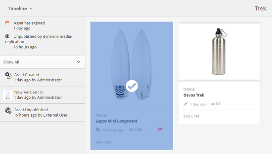
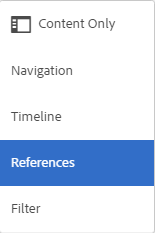

# Digital Rights Management voor elementen {#digital-rights-management-in-assets}

>[!CAUTION]
>
>AEM 6.4 heeft het einde van de uitgebreide ondersteuning bereikt en deze documentatie wordt niet meer bijgewerkt. Raadpleeg voor meer informatie onze [technische ondersteuningsperioden](https://helpx.adobe.com/support/programs/eol-matrix.html). Ondersteunde versies zoeken [hier](https://experienceleague.adobe.com/docs/).

Digitale middelen zijn vaak gekoppeld aan een licentie die de gebruiksvoorwaarden en -duur bepaalt. Omdat [!DNL Adobe Experience Manager Assets] is volledig geïntegreerd met de [!DNL Experience Manager] -platform, kunt u informatie over het verlopen van bedrijfsmiddelen en de status van bedrijfsmiddelen efficiënt beheren. U kunt ook licentiegegevens aan elementen koppelen.

## Vervaldatum van element {#asset-expiration}

Vervaldatum van activa is een effectieve manier om licentievereisten voor activa af te dwingen. Het zorgt ervoor dat het gepubliceerde element niet gepubliceerd wordt wanneer het vervalt, wat de mogelijkheid van schending van de licentie afsluit. Een gebruiker zonder beheerdersmachtigingen kan een verlopen middel niet bewerken, kopiëren, verplaatsen, publiceren en downloaden.

U kunt de vervalstatus van een element weergeven in het dialoogvenster [!DNL Assets] in zowel de kaart- als lijstweergaven.

*Afbeelding: In de kaartweergave geeft een markering op de kaart aan dat het element is verlopen.*

*Afbeelding: In de lijstweergave [!UICONTROL Status] de kolom toont [!UICONTROL Expired] banner.*

U kunt de vervalstatus van een element weergeven in het dialoogvenster [!UICONTROL Timeline] in linkerspoor.

>[!NOTE]
>
>De vervaldatum van een element wordt anders weergegeven voor gebruikers in verschillende tijdzones.

U kunt ook de vervalstatus van elementen weergeven in het dialoogvenster **[!UICONTROL References]** spoorwegen. Het beheert activa vervalstatussen en verhoudingen tussen samengestelde activa en referenced subassets, inzamelingen, en projecten.

1. Navigeer naar het element waarvan u de verwijzing naar webpagina&#39;s en samengestelde elementen wilt weergeven.
1. Selecteer het element en klik op de knop [!DNL Experience Manager] logo.

   

1. Kies **[!UICONTROL References]** in het menu.

   

   Voor verlopen activa toont de spoorstaaf References de vervalstatus **[!UICONTROL Asset is Expired]** bovenaan.

   

   Als het element verlopen is, wordt de status weergegeven in de verwijzingstag **[!UICONTROL Asset has Expired Sub-Assets]**.

   

### Zoeken in verlopen elementen {#search-expired-assets}

In het deelvenster Zoeken kunt u zoeken naar verlopen elementen, waaronder verlopen subelementen.

1. In de [!DNL Assets] console, klik **[!UICONTROL Search]** in de werkbalk om het vak Onderzoek weer te geven.

   

1. Met de curseur in het vakje van het Onderzoek, druk de Enter sleutel om de pagina van onderzoeksresultaten te tonen.

   

1. Klikken [!DNL Experience Manager] logo om het zoekvenster weer te geven.

   

1. Klik op de knop **[!UICONTROL Expiry Status]** om het uit te breiden.

   

1. Kies **[!UICONTROL Expired]**. De verlopen elementen worden weergegeven in zoekresultaten.

   

Wanneer u **[!UICONTROL Expired]** de [!DNL Assets] De console toont slechts de verlopen activa en de subassets die door samengestelde activa van verwijzingen worden voorzien. De samengestelde elementen die verwijzen naar verlopen subelementen worden niet direct weergegeven nadat de subelementen verlopen zijn. In plaats daarvan worden ze na [!DNL Experience Manager] ontdekt dat zij verlopen subassets van verwijzingen voorzien de volgende tijd de planner loopt.

Als u de vervaldatum van een gepubliceerd element aan een datum vroeger dan de huidige plannercyclus wijzigt, ontdekt het programma nog dit element als verlopen activa in de volgende tijd het loopt en wijst dienovereenkomstig op status.

Bovendien als een glitch of een fout de planner verhindert verlopen activa in de huidige cyclus te ontdekken, onderzoekt de planner deze activa in de volgende cyclus opnieuw en ontdekt hun verlopen status.

Om het [!DNL Assets] console om de verwijzende samengestelde activa samen met de verlopen subassets te tonen, vorm en **[!UICONTROL Adobe CQ DAM Expiry Notification]** workflow in [!DNL Experience Manager] Configuratiebeheer.

1. Openen [!DNL Experience Manager] Configuratiebeheer.
1. Kies **[!UICONTROL Adobe CQ DAM Expiry Notification]**. Standaard, **[!UICONTROL Time based Scheduler]** is geselecteerd, die een taak plant om op een bepaald tijdstip te controleren of een element verlopen subassets heeft. Nadat de taak is voltooid, worden elementen waarvan de subelementen zijn verlopen en waarnaar wordt verwezen, weergegeven als verlopen in de zoekresultaten.

   

1. Als u de taak periodiek wilt uitvoeren, wist u het veld **[!UICONTROL Time Based Scheduler Rule]** en wijzigt u de tijd in seconden in het veld **[!UICONTROL Periodic Scheduler]**. Bijvoorbeeld bij de voorbeeldexpressie &#39;0 0 0 &amp;ast; &amp;ast; ?&#39; wordt de taak om 00 uur gestart.
1. Selecteren **[!UICONTROL send email]** om e-mails te ontvangen wanneer een middel verloopt.

   >[!NOTE]
   >
   >Alleen de maker van het actief (de persoon die een bepaald actief uploadt naar [!DNL Assets]) ontvangt een e-mail wanneer het middel vervalt. Zie [hoe te om e-mailbericht te vormen](/help/sites-administering/notification.md) voor meer informatie over het configureren van e-mailmeldingen in het algemeen [!DNL Experience Manager] niveau.

1. In de **[!UICONTROL Prior notification in seconds]** geeft u de tijd in seconden op voordat een element vervalt wanneer u een melding over de vervaldatum wilt ontvangen. Als u een beheerder of de maker van het element bent, ontvangt u een bericht vóór het verlopen van het element om u te laten weten dat het element op het punt staat na de opgegeven tijd te verlopen.

   Nadat het element is verlopen, ontvangt u een ander bericht waarin de vervaldatum wordt bevestigd. Bovendien worden de verlopen activa gedeactiveerd.

1. Klik op **[!UICONTROL Save]**.

## Elementstatussen {#asset-states}

De [!DNL Assets] De console kan diverse staten voor activa tonen. Afhankelijk van de huidige status van een bepaald element wordt in de kaartweergave een label weergegeven dat de status beschrijft, bijvoorbeeld Verlopen, Gepubliceerd, Goedgekeurd, Afgewezen enzovoort.

1. In de [!DNL Assets] een element selecteren.

   

1. Klik op **[!UICONTROL Publish]** op de werkbalk. Als u het niet ziet **Publiceren** klikt u op de werkbalk op **[!UICONTROL More]** op de werkbalk en zoek **[!UICONTROL Publish]** optie.

   

1. Kies **[!UICONTROL Publish]** in het menu en sluit vervolgens het bevestigingsvenster.
1. Sluit de selectiemodus. De publicatiestatus voor het element wordt onder aan de elementminiatuur weergegeven in de kaartweergave. In de lijstmening, toont de Gepubliceerde kolom de tijd toen de activa werd gepubliceerd.

   

1. Als u de pagina met elementdetails wilt weergeven, gaat u naar [!DNL Assets] interface, selecteert u een element en klikt u op **[!UICONTROL Properties]**.

   

1. Stel op het tabblad Geavanceerd een vervaldatum voor het element in vanaf de **[!UICONTROL Expires]** veld.

   

   *Afbeelding: [!UICONTROL Advanced] tab in element [!UICONTROL Properties] pagina om de vervaldatum van elementen in te stellen.*

1. Klikken **[!UICONTROL Save]** en klik vervolgens op **[!UICONTROL Close]** om de Asset-console weer te geven.
1. De publicatiestatus voor het element geeft aan dat de status is verlopen onder aan de elementminiatuur in de kaartweergave. In de lijstweergave wordt de status van het element weergegeven als **[!UICONTROL Expired]**.

   

1. In de [!DNL Assets] Selecteer een map en maak een revisietaak in de map.
1. Reviseer en keur de elementen in de revisietaak goed/verwerp deze en klik op **[!UICONTROL Complete]**.
1. Navigeer naar de map waarvoor u de revisietaak hebt gemaakt. De status voor de middelen die u hebt goedgekeurd/geweigerd, wordt onderaan weergegeven in de kaartweergave. In de lijstweergave worden de goedkeuringsstatus en de vervalstatus weergegeven in de desbetreffende kolommen.

   

1. Als u wilt zoeken naar elementen op basis van hun status, klikt u op **[!UICONTROL Search]** om de balk Zoeken weer te geven.

   

1. Druk op Enter en klik op [!DNL Experience Manager] om het zoekvenster weer te geven.
1. Klik in het deelvenster Zoeken op **[!UICONTROL Publish Status]** en selecteert u **[!UICONTROL Published]** om te zoeken naar gepubliceerde elementen in [!DNL Assets].

   

1. Klikken **[!UICONTROL Approval Status]** en klik op de gewenste optie om te zoeken naar goedgekeurde of geweigerde elementen.

   

1. Als u naar assets wilt zoeken op basis van hun vervalstatus, selecteert u **[!UICONTROL Expiry Status]** in het deelvenster Zoeken en kiest u de juiste optie.

   

1. U kunt ook naar elementen zoeken op basis van een combinatie van statussen onder verschillende zoekfacetten. U kunt bijvoorbeeld zoeken naar gepubliceerde elementen die zijn goedgekeurd in een overzichtstaak en die nog niet zijn verlopen door de juiste opties te selecteren in de zoekfacetten.

   

## Digital Rights Management in [!DNL Assets] {#digital-rights-management-in-assets-1}

Deze functie dwingt de acceptatie van de licentieovereenkomst af voordat u een licentie-asset kunt downloaden van [!DNL Adobe Experience Manager Assets].

Als u een beveiligd element selecteert en klikt op **[!UICONTROL Download]**, wordt u omgeleid naar een licentiepagina om de licentieovereenkomst te accepteren. Als u de licentieovereenkomst niet accepteert, **[!UICONTROL Download]** is niet beschikbaar.

Als de selectie meerdere beveiligde elementen bevat, selecteert u één element tegelijk, accepteert u de licentieovereenkomst en gaat u verder met het downloaden van het element.

Een actief wordt als beschermd beschouwd indien aan een van deze voorwaarden is voldaan:

* De eigenschap voor metagegevens van het element `xmpRights:WebStatement` verwijst naar het pad van de pagina die de licentieovereenkomst voor het element bevat.
* De waarde van de eigenschap voor metagegevens van het element `adobe_dam:restrictions` is een ruwe HTML die de licentieovereenkomst specificeert.

>[!NOTE]
>
>De locatie `/etc/dam/drm/licenses` gebruikt voor de opslag van licenties in eerdere versies van [!DNL Experience Manager] is afgekeurd.
>
>Als u licentiepagina&#39;s maakt of wijzigt, of deze van vorige [!DNL Experience Manager] releases, raadt Adobe u aan deze gegevens op te slaan onder `/apps/settings/dam/drm/licenses` of `/conf/&ast;/settings/dam/drm/licenses`.

### DRM-beveiligde bestanden downloaden {#downloading-drm-assets}

1. Selecteer in de kaartweergave de elementen die u wilt downloaden en klik op **[!UICONTROL Download]**.
1. Selecteer op de pagina **[!UICONTROL Copyright Management]** de asset die u uit de lijst wilt downloaden.
1. In de [!UICONTROL License] deelvenster, kiest u **[!UICONTROL Agree]**. Naast het element wordt een vinkje weergegeven. Klik op de knop **[!UICONTROL Download]** optie.

   >[!NOTE]
   >
   >De **[!UICONTROL Download]** is alleen ingeschakeld als u akkoord gaat met de licentieovereenkomst voor een beveiligd element. Als uw selectie echter zowel beveiligde als niet-beveiligde elementen bevat, worden alleen de beveiligde elementen weergegeven in het deelvenster en in het dialoogvenster **[!UICONTROL Download]** is ingeschakeld om de niet-beveiligde elementen te downloaden. Als u tegelijkertijd licentieovereenkomsten voor meerdere beveiligde assets wilt accepteren, selecteert u de assets in de lijst en vervolgens kiest u **[!UICONTROL Agree]**.

   

1. Klik in het dialoogvenster op **[!UICONTROL Download]** om het element of de uitvoeringen te downloaden.
