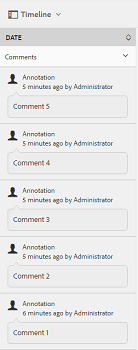

# Verbeterde sortering van elementen in AEM {#enhanced-sorting-of-assets-in-aem}

Leer hoe AEM Assets sortering aan de serverzijde implementeert om mapelementen of een zoekquery tegelijk te sorteren in plaats van ze in batches op de client te sorteren.

De zoekfunctie van Adobe Experience Manager-middelen (AEM) is verbeterd en daarmee kunt u op efficiënte wijze een groot aantal elementen sorteren in de weergave met de mappenlijst en op pagina&#39;s met zoekresultaten. U kunt ook tijdlijnitems sorteren.

AEM Assets sorteert via de server de gehele set elementen (hoe groot ook) binnen een map of zoekopdracht tegelijk in plaats van deze op de client te sorteren. Op deze manier kunnen vooraf ingestelde resultaten snel worden weergegeven in de gebruikersinterface, waardoor de sorteerbewerking responsiever en kwetsbaarder wordt.

## Elementen sorteren in lijstweergave {#sorting-assets-in-list-view}

Met AEM Assets kunt u mapelementen sorteren op basis van de volgende velden:

* Landinstelling
* Status
* Type
* Grootte
* Classificatie
* Datum gewijzigd
* Datum gepubliceerd
* Gebruik
* Klikken
* Impressies
* Uitgecheckt

1. Navigeer naar een map met een groot aantal elementen.
1. Klik op het pictogram Lay-out of tik erop en schakel over naar de lijstweergave.

   

1. Klik of tik op het pictogram Sorteren naast een kolomkop in de lijst met elementen.

   

   De lijst met elementen wordt gesorteerd op basis van de veldwaarden.

   

>[!NOTE]
>
>Als u de waarden in de `Name` of `Title`kolommen wilt sorteren, bedekt `/libs/dam/gui/content/commons/availablecolumns` en wijzigt u de waarde van `sortable` in `True`.

## Elementen sorteren in zoekresultaten {#sorting-assets-in-search-results}

U kunt zoekresultaten sorteren op basis van de volgende velden:

* Titel
* Status
* Type
* Grootte
* Datum gewijzigd
* Datum gepubliceerd

1. Zoek in het vak Universeel zoeken naar elementen op basis van de gewenste criteria.

   

1. Klik op het pictogram Lay-out of tik erop en schakel over naar de lijstweergave. Als de zoekresultaten al in de lijstweergave worden weergegeven, slaat u deze stap over.
1. Klik of tik op het pictogram Sorteren naast een kolomkop in de lijst met elementen. De lijst met elementen wordt gesorteerd op basis van de veldwaarden.

   

## Elementen sorteren in tijdlijn {#sorting-assets-in-timeline}

Met AEM Assets kunt u tijdlijnvermeldingen chronologisch sorteren, zoals annotaties, versies, workflows en activiteiten.

1. Selecteer in de interface Elementen een element waarvoor u de tijdlijn wilt weergeven.
1. Klik/tik het pictogram GolbalNav en selecteer **[!UICONTROL Timeline]**.

   

1. Selecteer een item in de lijst in de tijdlijn. Selecteer bijvoorbeeld **[!UICONTROL Comments]** om de lijst met annotaties weer te geven die aan het element zijn gekoppeld.

   

1. Klik/tik het **[!UICONTROL Sort]** pictogram naast het **[!UICONTROL Date]** etiket. Op basis van uw selectie worden de annotaties weergegeven in de chronologische volgorde/omgekeerde chronologische volgorde waarin ze aan het element zijn toegevoegd.

   

