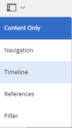

# Verbeterde sortering van elementen in AEM {#enhanced-sorting-of-assets-in-aem}

Leer hoe AEM Middelen server-zijsortering aan de activa van de soortomslag of een onderzoeksvraag bij één keer opstelt in plaats van hen in partijen op de cliëntkant te sorteren.

De zoekmogelijkheden van Adobe Experience Manager (AEM)-middelen zijn verbeterd en kunnen op efficiënte wijze een groot aantal middelen sorteren in de weergave met de mappenlijst en op pagina&#39;s met zoekresultaten. U kunt ook tijdlijnitems sorteren.

AEM Assets stelt server-zijsortering in om de volledige reeks activa (hoe groot ook) binnen een omslag of een onderzoeksvraag bij één keer te sorteren in plaats van hen in partijen op de cliëntkant te sorteren. Op deze manier kunnen vooraf ingestelde resultaten snel worden weergegeven in de gebruikersinterface, waardoor de sorteerbewerking responsiever en kwetsbaarder wordt.

## Elementen sorteren in de lijstweergave {#sorting-assets-in-list-view}

Met AEM-middelen kunt u mapelementen sorteren op basis van de volgende velden:

* Landinstelling
* Status
* Type
* Grootte
* Classificatie
* Datum gewijzigd
* Datum gepubliceerd
* Gebruik
* Klikken
* Impressies
* Uitgecheckt

1. Navigeer naar een map met een groot aantal elementen.
1. Klik op het pictogram Lay-out of tik erop en schakel over naar de lijstweergave.

   

1. Klik of tik op het pictogram Sorteren naast een kolomkop in de lijst met elementen.

   

   De lijst met elementen wordt gesorteerd op basis van de veldwaarden.

   

>[!NOTE]
>
>Als u de waarden in de `Name` kolommen of de `Title`kolommen wilt sorteren, bedekt u de waarden `/libs/dam/gui/content/commons/availablecolumns` en wijzigt u de waarde van `sortable` in `True`.

## Elementen sorteren in zoekresultaten {#sorting-assets-in-search-results}

U kunt zoekresultaten sorteren op basis van de volgende velden:

* Titel
* Status
* Type
* Grootte
* Datum gewijzigd
* Datum gepubliceerd

1. Zoek in het vak Universeel zoeken naar elementen op basis van de gewenste criteria.

   

1. Klik op het pictogram Lay-out of tik erop en schakel over naar de lijstweergave. Als de zoekresultaten al in de lijstweergave worden weergegeven, slaat u deze stap over.
1. Klik of tik op het pictogram Sorteren naast een kolomkop in de lijst met elementen. De lijst met elementen wordt gesorteerd op basis van de veldwaarden.

   

## Elementen in tijdlijn sorteren {#sorting-assets-in-timeline}

Met AEM-elementen kunt u tijdlijnitems chronologisch sorteren, zoals annotaties, versies, workflows en activiteiten.

1. Selecteer in de interface Elementen een element waarvoor u de tijdlijn wilt weergeven.
1. Klik/tik het pictogram GolbalNav en selecteer **[!UICONTROL Chronologie]**.

   

1. Selecteer een item in de lijst in de tijdlijn. Selecteer bijvoorbeeld **[!UICONTROL Opmerkingen]** om de lijst met annotaties weer te geven die aan het element zijn gekoppeld.

   

1. Klik op het pictogram **[!UICONTROL Sorteren]** of tik op het pictogram naast het label **[!UICONTROL Datum]** . Op basis van uw selectie worden de annotaties weergegeven in de chronologische volgorde/omgekeerde chronologische volgorde waarin ze aan het element zijn toegevoegd.

   

