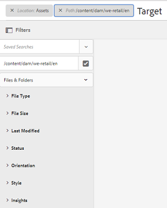

# GQL full-text zoeken {#gql-full-text-search}

Ontdek de GQL-functie voor full-text zoeken in AEM Assets. Gebruik dit besturingselement om te zoeken naar elementen op basis van specifieke metagegevens, zoals titel, beschrijving en naam van de auteur.

Met de zoekfunctie voor volledige tekst van GQL kunt u zoeken naar elementen op basis van specifieke metagegevens, zoals titel, beschrijving, auteur, enzovoort.

Als u naar een element wilt zoeken op basis van de metagegevens, bijvoorbeeld de titel, geeft u in het zoekvenster het trefwoord voor metagegevens op, gevolgd door de waarde ervan. Met de zoekfunctie voor volledige tekst van GQL worden alleen die elementen opgehaald waarvan de metagegevens exact overeenkomen met de corresponderende waarde die u invoert.

Als u bijvoorbeeld wilt zoeken naar elementen met de titel &quot;Doel&quot;, voert u de volgende stappen uit:

## Elementen zoeken {#searching-assets}

1. Klik of tik op het pictogram **[!UICONTROL Search]** op de werkbalk van de gebruikersinterface Elementen om het vak Onderzoek weer te geven.

   

1. Met de curseur in het vakje van het Onderzoek, druk binnengaan.
1. Klik of tik op het GlobalNav-pictogram om het **[!UICONTROL Filters]**-deelvenster weer te geven.
1. Geef in het vak Universeel zoeken de waarde &quot;Doel&quot; op. Als u de zoekopdracht wilt beperken tot een specifieke map, klikt of tikt u op het pictogram Bladeren in het deelvenster Filters en selecteert u de map. In dit geval wordt alleen gezocht naar de map en de submappen eronder.

   >[!NOTE]
   >
   >U kunt ook zoeken in volledige tekst op een map. In dit geval moet u een niet-lege zoekterm voor volledige tekst opgeven.

   

1. Druk op **[!UICONTROL Enter]**. In de AEM Assets-gebruikersinterface worden alleen die elementen weergegeven waarvan de titel precies overeenkomt met &quot;Doel&quot;.

Met de zoekfunctie voor volledige tekst van GQL kunt u op het volgende gebaseerde elementen zoeken:

* Complexe query die is gemaakt door een And-bewerking te combineren, de waarden die u opgeeft voor meerdere metagegevensvelden (eigenschappen)
* Meerdere waarden voor één metagegevensveld
* Overeenkomende subtekenreeks

Met de zoekfunctie voor volledige tekst van GQL kunt u zoeken naar elementen op basis van de volgende eigenschappen van metagegevens. De namen van de eigenschappen (bijvoorbeeld auteur, titel, enzovoort) en waarden zijn hoofdlettergevoelig.

>[!NOTE]
>
>GQL full-text onderzoek werkt alleen voor full-text predikaten.

| Eigenschap | Zoekindeling (facetwaarde) |
|---|---|
| [!UICONTROL Title] | titel:John |
| [!UICONTROL Creator] | maker:John |
| [!UICONTROL Contributor] | contribuant:John |
| [!UICONTROL Location] | locatie:India |
| [!UICONTROL Description] | beschrijving:&quot;Voorbeeldafbeelding&quot; |
| [!UICONTROL Creator tool] | creatortool:&quot;Adobe Photoshop 7.0&quot; |
| [!UICONTROL Copyright Owner] | copyrightowner:&quot;Adobe Systems&quot; |
| [!UICONTROL Contributor] | contribuant:John |
| [!UICONTROL Usage Terms] | usageterms:&quot;CopyRights Reserved&quot; |
| [!UICONTROL Created] | gemaakt:YYYY-MM-DDTHH:MM:SS.000+05:30.YYYY-MM-DDTHH:MM:SS.000+05:30 |
| [!UICONTROL Expires Date] | verloopt:YYYY-MM-DDTHH:MM:SS.000+05:30..YYYY-MM-DDTHH:MM:SS.000+05:30 |
| [!UICONTROL On time] | ontime:YYYY-MM-DDTHH:MM:SS.000+05:30..YYYY-MM-DDTHH:MM:SS.000+05:30 |
| [!UICONTROL Off time] | offtime:YYYY-MM-DDTHH:MM:SS.000+05:30..YYYY-MM-DDTHH:MM:SS.000+05:30 |
| [!UICONTROL Range of time] (verloopt dateontime, offtime) | Veld facet: lager gebonden..bovenaan |
| [!UICONTROL Path] | /content/dam/&lt;naam map> |
| [!UICONTROL PDF Title] | pdftitle:&quot;Adobe-document&quot; |
| [!UICONTROL Subject] | onderwerp: &quot;Opleiding&quot; |
| [!UICONTROL Tags] | tags:&quot;Locatie en reizen&quot; |
| [!UICONTROL Type] | type:&quot;image\png&quot; |
| [!UICONTROL Width of image] | breedte:ondergrens..bovenaan |
| [!UICONTROL Height of image] | hoogte:ondergrens..bovenaan |
| [!UICONTROL Person] | persoon:John |

Hier volgen enkele voorbeelden van zoekindelingen voor complexe query&#39;s:

* Alle elementen weergeven met meerdere facetvelden (bijvoorbeeld: title=Jan Smit en creator tool = Adobe Photoshop):

tiltle: &#39;Jan Doe&#39; creatortool: Adobe&amp;ast;

* Om alle activa te tonen wanneer de facetwaarde niet één enkel woord maar één zin is (bijvoorbeeld: title=Scott Reynolds)

titel:&quot;Scott Reynolds&quot;

* Elementen weergeven met meerdere waarden van één eigenschap (bijvoorbeeld: title=Scott Reynolds of John Doe)

titel:&quot;Scott Reynolds&quot; OF &quot;Jan Smit&quot;

* Elementen weergeven met eigenschapswaarden die beginnen met een specifieke tekenreeks (bijvoorbeeld: de titel is Scott Reynolds)

titel:&quot;Scott&quot;

* Elementen weergeven met eigenschapswaarden die eindigen met een specifieke tekenreeks (bijvoorbeeld: de titel is Scott Reynolds)

titel:&quot;Reynolds&quot;

* Elementen weergeven met een eigenschapswaarde die een specifieke tekenreeks bevat (bijvoorbeeld: titel = Bazel-vergaderruimte)

titel:&quot;Vergadering&quot;;

* Elementen weergeven die een bepaalde tekenreeks bevatten en een specifieke eigenschapswaarde hebben (bijvoorbeeld: zoeken naar Adobe van tekenreeksen in elementen met title=Jan Doe)

&amp;ast;Adobe&amp;ast; titel:&quot;Jan Smit &quot;OR title:&quot;Jan Smit&quot; &amp;ast;Adobe&amp;ast;

>[!NOTE]
>
>De eigenschappen weg, grens, grootte, en orde kunnen niet ORed met een ander bezit zijn.
>
>Het sleutelwoord voor een user-generated bezit is zijn gebiedsetiket in de bezitsredacteur in kleine letters, met verwijderde ruimten.

>[!NOTE]
>
>Als u een JCR-query schrijft om alleen naar subelementen te zoeken, worden de overeenkomende elementen waarnaar wordt verwezen ook samen met de overeenkomende subelementen weergegeven.

Het zoeken naar volledige tekst ondersteunt ook operatoren zoals -, ^, enzovoort. Als u deze letters wilt doorzoeken als letterlijke tekenreeksen, plaatst u de zoekexpressie tussen dubbele aanhalingstekens. Gebruik bijvoorbeeld &quot;Notebook - Beauty&quot; in plaats van &quot;Notebook - Beauty&quot;.

## Zoekopdracht opvoeren {#boosting-search}

U kunt de relevantie van trefwoorden voor bepaalde elementen verbeteren om zoekopdrachten op basis van trefwoorden te stimuleren. Met andere woorden, de afbeeldingen waarvoor u specifieke trefwoorden promoot, worden boven aan de zoekresultaten weergegeven wanneer u op basis van deze trefwoorden zoekt.

1. Open vanuit de interface Elementen de pagina met eigenschappen voor het element waarvoor u een trefwoord wilt opwaarderen.
1. Schakel over naar het tabblad **[!UICONTROL Advanced]** en klik/tik **[!UICONTROL Add]** onder **[!UICONTROL Elevate for search keywords]**.

   

1. Geef in het tekstvak **[!UICONTROL Search Promote]** een trefwoord op waarvoor u de zoekopdracht naar de afbeelding wilt opvoeren en klik/tik **[!UICONTROL Add]**. Geef indien nodig meerdere trefwoorden op dezelfde manier op.

   

1. Klik of tik op **[!UICONTROL Save & Close]**.
1. Zoek naar het sleutelwoord gebruikend het vakje van Onderzoek. De middelen waarvoor u dit trefwoord hebt gepromoot, worden weergegeven in de beste zoekresultaten.