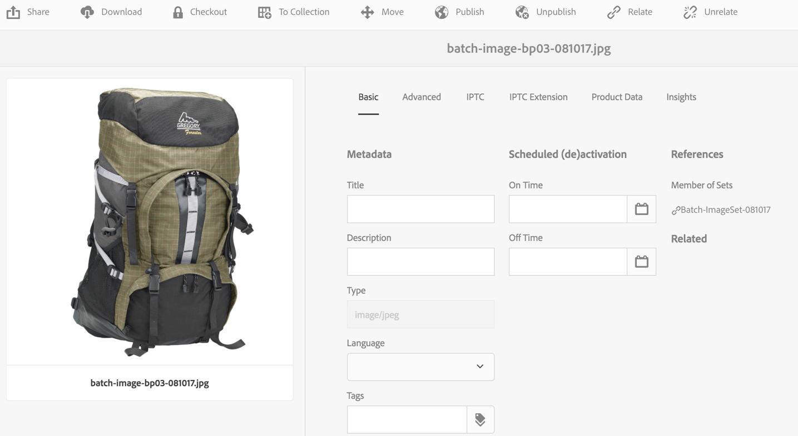

# Image Sets {#image-sets}

Afbeeldingssets bieden gebruikers een geïntegreerde weergave, waarbij gebruikers verschillende weergaven van een item kunnen zien door op een miniatuurafbeelding te klikken. Met Afbeeldingssets kunt u alternatieve weergaven van een item presenteren en de viewer beschikt over zoomgereedschappen waarmee u afbeeldingen op de juiste wijze kunt bekijken.

Afbeeldingsets worden aangegeven door een banner met het woord **[!UICONTROL IMAGESET]**. Als de afbeeldingset wordt gepubliceerd, wordt bovendien de publicatiedatum, die door het pictogram **[!UICONTROL World]** wordt aangegeven, samen met de laatste wijzigingsdatum op de banner weergegeven. Dit wordt aangegeven door het pictogram **[!UICONTROL Pencil]**.

In de afbeeldingsset kunt u ook stalen maken door een afbeeldingsset te maken en miniaturen toe te voegen.

Deze toepassing is vooral handig wanneer u een item in een andere kleur, in een ander patroon of in een ander patroon wilt weergeven. Als u een afbeeldingsset met kleurstalen wilt maken, hebt u één afbeelding nodig voor elke andere kleur, elk patroon of elke afwerking die u aan de gebruikers wilt presenteren. Voor elke kleur, elk patroon of elke afwerking hebt u ook één kleur-, patroon- of eindstaal nodig.

Stel dat u afbeeldingen van uiteinden met verschillende kleurrekeningen wilt weergeven. de rekeningen zijn rood , groen en blauw . In dit geval hebt u drie opnamen van hetzelfde kapje nodig. Je hebt een opname nodig met een rood, een met een groen en een met een blauwe rekening. U hebt ook een rood, groen en blauw kleurenstaal nodig. De kleurstalen fungeren als de miniaturen die gebruikers in de Staalset-viewer klikken om het rode, groene of blauwe kader met vulling weer te geven.

>[!NOTE]
>
>Zie [Elementen beheren met de aanraakinterface](managing-assets-touch-ui.md) voor informatie over de gebruikersinterface van Elementen.

## Snel starten: Afbeeldingssets {#quick-start-image-sets}

Zo kunt u snel aan de slag:

1. [Upload uw primaire afbeeldingen voor meerdere weergaven.](#uploading-assets-in-image-sets)

   Begin door de beelden voor uw Reeksen van het Beeld te uploaden. Omdat gebruikers kunnen inzoomen op afbeeldingen in de Vastgestelde Kijker van het Beeld, houd rekening met het zoemen wanneer u beelden kiest. Zorg ervoor dat de afbeeldingen ten minste 2000 pixels groot zijn voor optimale zoomdetails. Dynamic Media kan afbeeldingen renderen tot 25 megapixels per pixel. U kunt bijvoorbeeld een afbeelding van 5000 x 5000 megapixel of een andere formaatcombinatie van maximaal 25 megapixels gebruiken.

   AEM Assets biedt ondersteuning voor veel bestandsindelingen voor afbeeldingen, maar TIFF-, PNG- en EPS-afbeeldingen zonder gegevensverlies worden aanbevolen.

1. [Afbeeldingssets maken.](#creating-image-sets)

   In de Reeksen van het Beeld, klikken de gebruikers duimnagelbeelden in de Vastgestelde Kijker van het Beeld.

   Tik op **[!UICONTROL Create > Image Sets]** om een Afbeeldingsset in elementen te maken. Voeg vervolgens afbeeldingen toe en tik op **[!UICONTROL Save]**.

   U kunt ook automatisch afbeeldingssets maken via [voorinstellingen voor batchsets](/help/assets/config-dms7.md#creating-batch-set-presets-to-auto-generate-image-sets-and-spin-sets).

   **Belangrijk**  - Batchsets worden gemaakt door het IPS (Image Production System) als onderdeel van het opnemen van bedrijfsmiddelen en zijn alleen beschikbaar in de Dynamic Media - Scene7-modus.

   Zie [Afbeeldingsset-elementen voorbereiden voor het uploaden en uploaden van uw bestanden](#uploading-assets-in-image-sets).

   Zie [Werken met kiezers.](working-with-selectors.md)

1. Voeg [Voorinstellingen voor de afbeeldingsset Viewer toe](managing-viewer-presets.md), indien nodig.

   Beheerders kunnen afbeeldingen **[!UICONTROL Set Viewer Presets]** maken of wijzigen. Als u de afbeeldingsset wilt weergeven met een viewer-voorinstelling, selecteert u de afbeeldingsset en selecteert u **[!UICONTROL Viewers]** in het keuzemenu voor de linkertrack.

   Zie **[!UICONTROL Tools > Assets > Viewer Presets]** om voorinstellingen voor viewers te maken of te bewerken.

1. (Optioneel) [Afbeeldingssets weergeven](image-sets.md#viewing-image-sets) die zijn gemaakt met behulp van voorinstellingen voor batchsets.
1. [Voorvertoning van afbeeldingssets.](previewing-assets.md)

   Selecteer de Afbeeldingsset en u kunt er een voorvertoning van weergeven. Tik op de miniatuurpictogrammen om de Afbeeldingsset in de geselecteerde viewer te bekijken. U kunt verschillende kijkers van **[!UICONTROL Viewers]** menu kiezen, beschikbaar van het linkerspoordrop-down menu.

1. [Afbeeldingssets publiceren.](publishing-dynamicmedia-assets.md)

   Als u een Afbeeldingsset publiceert, wordt de URL- en insluitreeks geactiveerd. Daarnaast moet u [een aangepaste viewer-voorinstelling](managing-viewer-presets.md) publiceren die u hebt gemaakt. Voorinstellingen voor viewers buiten de box zijn al gepubliceerd.

1. [Koppel URL&#39;s aan uw webtoepassing ](linking-urls-to-yourwebapplication.md) of  [sluit de video- of afbeeldingsviewer](embed-code.md) in.

   AEM Assets maakt URL-aanroepen voor afbeeldingssets en activeert deze nadat u de afbeeldingssets hebt gepubliceerd. U kunt deze URL&#39;s kopiëren wanneer u elementen voorvertoont. U kunt ze ook insluiten op uw website.

   Selecteer de Afbeeldingset en selecteer vervolgens in de vervolgkeuzelijst voor het linkerspoor **[!UICONTROL Viewers]**.

   Zie [Een afbeeldingset koppelen aan een webpagina](linking-urls-to-yourwebapplication.md) en [De video- of afbeeldingsviewer insluiten](embed-code.md).

Zie [Afbeeldingssets bewerken als u Afbeeldingssets wilt bewerken.](#editing-image-sets) Bovendien kunt u de eigenschappen [ van de ](managing-assets-touch-ui.md#editing-properties)Afbeeldingsset weergeven en bewerken.

Als u problemen ondervindt bij het maken van sets, raadpleegt u Afbeeldingen en sets in [Problemen met Dynamic Media oplossen - Scene7-modus](troubleshoot-dms7.md#images-and-sets).

## Elementen uploaden in afbeeldingssets {#uploading-assets-in-image-sets}

Begin door de beelden voor uw Reeksen van het Beeld te uploaden. Omdat gebruikers kunnen inzoomen op afbeeldingen in de Vastgestelde Kijker van het Beeld, houd rekening met het zoemen wanneer u beelden kiest. Zorg ervoor dat de afbeeldingen ten minste 2000 pixels groot zijn in de grootste dimensie. Afbeeldingssets ondersteunen veel bestandsindelingen voor afbeeldingen, maar afbeeldingen zonder verlies van de indeling TIFF, PNG en EPS worden aanbevolen.

U kunt afbeeldingen voor Afbeeldingssets uploaden zoals u [andere elementen in Elementen uploadt](managing-assets-touch-ui.md#uploading-assets).

### Afbeeldingsset-elementen voorbereiden voor uploaden {#preparing-image-set-assets-for-upload}

Voordat u Afbeeldingssets maakt, moet u ervoor zorgen dat de afbeeldingen de juiste grootte en indeling hebben.

Als u een Afbeeldingsset met meerdere weergaven wilt maken, hebt u afbeeldingen nodig die een item vanuit verschillende gezichtspunten weergeven of verschillende aspecten van hetzelfde item weergeven. Het doel is om de belangrijke kenmerken van een item te benadrukken, zodat gebruikers een volledig beeld hebben van hoe het eruit ziet of werkt.

Omdat gebruikers kunnen inzoomen op afbeeldingen in Afbeeldingssets, moet u ervoor zorgen dat de afbeeldingen ten minste 2000 pixels groot zijn. Elementen ondersteunen veel bestandsindelingen voor afbeeldingen, maar TIFF-, PNG- en EPS-afbeeldingen zonder gegevensverlies worden aanbevolen.

>[!NOTE]
>
>Als u miniaturen gebruikt om productstalen aan te geven, moet u het volgende doen:
>
>U hebt vignetten of verschillende opnamen van dezelfde afbeelding nodig die deze in verschillende kleuren, patronen of afwerkingen weergeven. U hebt ook miniatuurbestanden nodig die overeenkomen met de verschillende kleuren, patronen of afwerkingen. Als u bijvoorbeeld miniaturen wilt weergeven met een Afbeeldingsset die hetzelfde jasje in zwart, bruin en groen toont, hebt u het volgende nodig:
>
>* Een zwarte, bruine en groene opname van hetzelfde jasje.
>* Een zwarte, bruine en groene kleurminiatuur.

>

## Afbeeldingssets {#creating-image-sets} maken

U kunt Afbeeldingssets maken via de gebruikersinterface of via de API. In deze sectie wordt beschreven hoe u Afbeeldingssets maakt in de gebruikersinterface.

>[!NOTE]
>
>U kunt ook automatisch afbeeldingssets maken via [voorinstellingen voor batchsets](/help/assets/config-dms7.md#creating-batch-set-presets-to-auto-generate-image-sets-and-spin-sets).

**Belangrijk:** Batchsets worden gemaakt door het IPS (Image Production System) als onderdeel van het opnemen van elementen en zijn alleen beschikbaar in de modus Dynamic Media - Scene7.

Wanneer u elementen aan de set toevoegt, worden deze automatisch in alfanumerieke volgorde toegevoegd. U kunt elementen handmatig opnieuw ordenen of sorteren nadat u ze hebt toegevoegd.

>[!NOTE]
>
>Afbeeldingssets worden niet ondersteund voor elementen met `,` (komma) in de bestandsnaam.

**Een afbeeldingsset** maken:

1. Navigeer in **Middelen** naar de plaats waar u een afbeeldingsset wilt maken, tik **[!UICONTROL Create]** en selecteer **[!UICONTROL Image Set]**. U kunt de set ook maken vanuit een map die uw assets bevat.

   

1. Op de pagina van de Redacteur van de Reeks van het Beeld, op **[!UICONTROL Title]** gebied, ga een naam voor de Reeks van het Beeld in. De naam wordt weergegeven in de banner in de Afbeeldingsset. Voer eventueel een beschrijving in.

   

   >[!NOTE]
   >
   >Wanneer u de afbeeldingset maakt, kunt u de miniatuur van de afbeeldingset wijzigen of AEM toestaan de miniatuur automatisch te selecteren op basis van de assets in de afbeeldingset. Als u een miniatuur wilt selecteren, tikt u op **[!UICONTROL Change thumbnail]** en selecteert u een willekeurige afbeelding (u kunt ook naar andere mappen navigeren om afbeeldingen te zoeken). Als u een miniatuur hebt geselecteerd en vervolgens besluit dat AEM een miniatuur moet genereren op basis van de afbeeldingset, selecteert u **[!UICONTROL Switch to Automatic thumbnail]**.

1. Voer een van de volgende handelingen uit:

   * Tik in de linkerbovenhoek van de pagina **[!UICONTROL Image Set Editor]** op **[!UICONTROL Add Asset]**.
   * Tik in het midden van de pagina **[!UICONTROL Image Set Editor]** op **[!UICONTROL Tap to open Asset Selector]**.

   Tik om elementen te selecteren die u in de afbeeldingsset wilt opnemen. Geselecteerde assets hebben een vinkje. Tik op **[!UICONTROL Select]** in de rechterbovenhoek van de pagina als u klaar bent.

   Met de assetkiezer kunt u naar assets zoeken door een trefwoord te typen en op **[!UICONTROL Return]** te tikken. U kunt ook filters toepassen om de zoekresultaten te verfijnen. U kunt filteren op pad, verzameling, bestandstype en tag. Selecteer het filter en tik op het pictogram **[!UICONTROL Filter]** op de werkbalk. Wijzig de weergave door op het pictogram **[!UICONTROL View]** te tikken en **[!UICONTROL Column View]**, **[!UICONTROL Card View]** of **[!UICONTROL List View]** te selecteren.

   Zie [Werken met kiezers.](working-with-selectors.md)

   

1. Wanneer u elementen aan de set toevoegt, worden deze automatisch in alfanumerieke volgorde toegevoegd. Nadat u elementen hebt toegevoegd, kunt u deze handmatig opnieuw ordenen of sorteren.

   Sleep indien nodig het pictogram **[!UICONTROL Reorder]** van een element naar rechts naast de bestandsnaam van het element om de volgorde van de afbeeldingen in de lijst met sets te wijzigen.

   

   Als u een miniatuur of staal wilt wijzigen, tikt u op het pictogram **[!UICONTROL Thumbnail]** naast de afbeelding en navigeert u naar de gewenste miniatuur of het gewenste staal. Tik **[!UICONTROL Save]** wanneer u klaar bent met het selecteren van alle afbeeldingen.

1. (Optioneel) Voer een van de volgende handelingen uit:

   * Als u een afbeelding wilt verwijderen, selecteert u de afbeelding en tikt u op **[!UICONTROL Delete Asset]**.
   * Tik op **[!UICONTROL Preset]** en selecteer vervolgens een voorinstelling die u op alle elementen tegelijk wilt toepassen om een voorinstelling toe te passen in de rechterbovenhoek van de pagina.

1. Tik op **[!UICONTROL Save]**. De nieuwe afbeeldingsset wordt weergegeven in de map waarin u deze hebt gemaakt.

## Afbeeldingssets {#viewing-image-sets} weergeven

U kunt afbeeldingssets maken in de gebruikersinterface of automatisch met [voorinstellingen voor batchsets](/help/assets/config-dms7.md#creating-batch-set-presets-to-auto-generate-image-sets-and-spin-sets).

**Belangrijk**  — Batchsets worden door het IPS  [Image Production ] System gemaakt als onderdeel van het opnemen van activa en zijn alleen beschikbaar in de Dynamic Media - Scene7 modus.)

Sets die zijn gemaakt met voorinstellingen voor batchsets, worden echter *niet* weergegeven in de gebruikersinterface. U kunt deze sets op drie verschillende manieren weergeven. (Deze methoden zijn ook beschikbaar als u de afbeeldingssets in de gebruikersinterface hebt gemaakt.)

* Bij het openen van de eigenschappen van een afzonderlijk element. Eigenschappen geven aan welke sets het geselecteerde element lid zijn van (onder **[!UICONTROL Member of Sets]**). Tik op de naam van de set om de volledige set weer te geven.

   

* Van een lidafbeelding van om het even welke set. Selecteer het menu **[!UICONTROL Sets]** om de sets weer te geven waarvan het element lid is.

   

* Bij het zoeken kunt u **[!UICONTROL Filters]** selecteren, vervolgens **[!UICONTROL Dynamic Media]** uitvouwen en **[!UICONTROL Sets]** selecteren.

   De zoekopdracht retourneert overeenkomende sets die handmatig in de gebruikersinterface zijn gemaakt of die automatisch zijn gemaakt met voorinstellingen voor batchsets. Voor geautomatiseerde reeksen, wordt de onderzoeksvraag geleid gebruikend &quot;Begint met&quot;onderzoekscriteria die van AEM onderzoek verschillend zijn dat op het gebruiken van &quot;bevat&quot;onderzoekscriteria gebaseerd is. Het instellen van het filter op **[!UICONTROL Sets]** is de enige manier om geautomatiseerde sets te doorzoeken.

   

>[!NOTE]
>
>U kunt sets weergeven in de gebruikersinterface zoals wordt beschreven in [Afbeeldingssets bewerken](#editing-image-sets).

## Afbeeldingssets {#editing-image-sets} bewerken

U kunt diverse bewerkingstaken uitvoeren op Afbeeldingssets, zoals:

* Voeg afbeeldingen toe aan de Afbeeldingsset.
* Wijzig de volgorde van de afbeeldingen in de set Afbeeldingen.
* Elementen in de afbeeldingsset verwijderen.
* Voorinstellingen voor viewers toepassen.
* Verwijder de afbeeldingsset.

**Afbeeldingssets** bewerken:

1. Voer een van de volgende handelingen uit:

   * Houd de muisaanwijzer boven een afbeeldingsset en tik op **[!UICONTROL Edit]** (potloodpictogram).
   * Tik met de muis over een afbeeldingsset op **[!UICONTROL Select]** (vinkpictogram) en tik **[!UICONTROL Edit]** op de werkbalk.
   * Tik op een afbeeldingsset en tik op **[!UICONTROL Edit]** (potloodpictogram) op de werkbalk.

1. Voer een van de volgende handelingen uit om de afbeeldingen in de Afbeeldingsset te bewerken:

   * Als u elementen opnieuw wilt rangschikken, sleept u een afbeelding naar een nieuwe locatie (selecteer het pictogram voor opnieuw ordenen om items te verplaatsen).
   * Tik op de kolomkop om items in oplopende of aflopende volgorde te sorteren.
   * Tik op **[!UICONTROL Add Asset]** om een element toe te voegen of een bestaand element bij te werken. Navigeer naar een element, selecteer het en tik op **[!UICONTROL Select]** in de rechterbovenhoek van de pagina.

   >[!NOTE]
   >Als u de afbeelding verwijdert die AEM gebruikt voor de miniatuur door deze te vervangen door een andere afbeelding, wordt het oorspronkelijke element nog steeds weergegeven.

   * Als u een element wilt verwijderen, selecteert u het en tikt u op **[!UICONTROL Delete Asset]**.
   * Tik op **[!UICONTROL Preset]** en selecteer een viewervoorinstelling om een voorinstelling toe te passen in de rechterbovenhoek van de pagina.
   * Als u een miniatuur wilt toevoegen of wijzigen, selecteert u het miniatuurpictogram rechts van het element. Navigeer naar de nieuwe miniatuur of het nieuwe staalelement, selecteer het en tik op **[!UICONTROL Select]**.
   * Als u een volledige afbeeldingsset wilt verwijderen, navigeert u naar de Afbeeldingsset, selecteert u deze en tikt u op **[!UICONTROL Delete]**.

   >[!NOTE]
   >
   >U kunt de afbeeldingen in een Afbeeldingsset bewerken door naar de set te navigeren, op **[!UICONTROL Set Members]** in de linkertrack te tikken en vervolgens op het pictogram **[!UICONTROL Pencil]** op een afzonderlijk element te tikken om het bewerkingsvenster te openen.

1. Tik **[!UICONTROL Save]** wanneer u klaar bent met bewerken.

## Voorvertoning van afbeeldingssets {#previewing-image-sets}

Zie [Elementen voorvertonen](previewing-assets.md).

## Afbeeldingssets {#publishing-image-sets} publiceren

Zie [Elementen publiceren](publishing-dynamicmedia-assets.md).
