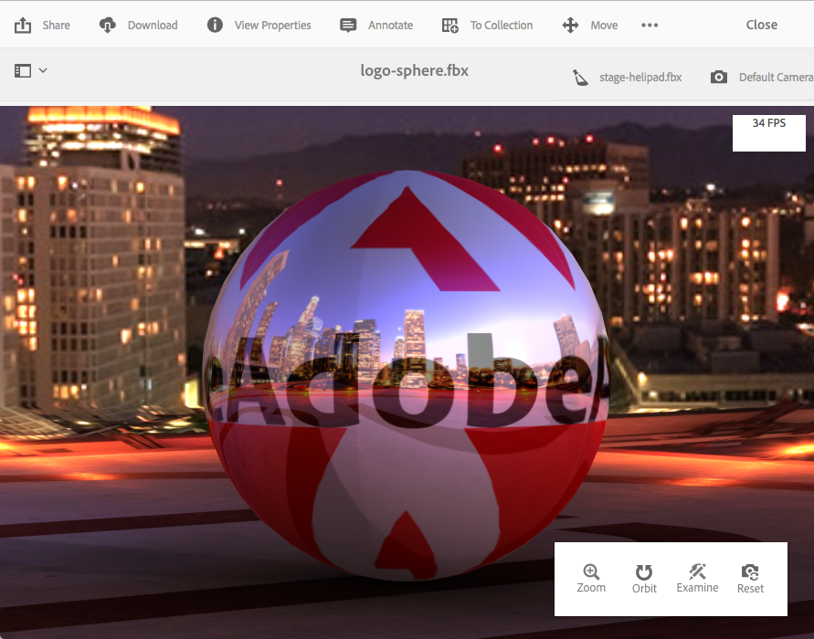

# AEM 3D installeren en configureren {#installing-and-configuring-aem-d}

>[!IMPORTANT]
>
>AEM 3D in AEM 6.4 wordt niet meer ondersteund. Adobe raadt u aan de functie 3D-elementen in [AEM te gebruiken als een Cloud Service](https://experienceleague.adobe.com/docs/experience-manager-cloud-service/assets/dynamicmedia/assets-3d.html#dynamicmedia) of [AEM 6.5.3 of hoger.](https://experienceleague.adobe.com/docs/experience-manager-65/assets/dynamic/assets-3d.html#dynamic)

De installatie en configuratie van AEM 3D (versie 3.0) omvat het volgende:

1. De Autodesk® FBX® SDK-bibliotheek installeren.
1. Het native 3D-codepakket downloaden en installeren.
1. De 3D-workflow voor het opnemen van elementen configureren en AEM opnieuw starten.
1. De instellingen van AEM 3D valideren.

Zie ook [Werken met 3D-elementen](assets-3d.md).

Zie ook [AEM opmerkingen bij de release 3D Assets](/help/release-notes/aem3d-release-notes.md) voor voorwaarden, ondersteunde browsers en andere belangrijke releasegegevens.

Zie ook [Werken met de component 3D-sites](using-the-3d-sites-component.md).

>[!NOTE]
>
>Voordat u het 3D-pakket downloadt en installeert, moet u controleren of u alle vereiste AEM hebt geïnstalleerd. Zie de [AEM 3D-releaseopmerkingen.](install-config-3d.md)

## De Autodesk FBX SDK-bibliotheek installeren {#installing-the-autodesk-fbx-sdk-library}

De native AEM 3D-code vereist de Autodesk FBX-bibliotheek om de FBX-bestandsindeling te ondersteunen. (Adobe kan deze bibliotheek momenteel niet opnieuw distribueren.)

Zie ook [Geavanceerde configuratie-instellingen](advanced-config-3d.md).

1. Meld u aan bij de host waarop AEM is geïnstalleerd.

   * Als dit een plaatsing van de Server van Vensters is, registreer op de server als Beheerder.
   * Als dit een Desktop van MAC of van Vensters is, zorg ervoor u beheerdervoorrechten hebt.

1. Gebruik de koppeling die geschikt is voor uw besturingssysteem om **FBX SDK versie 2016.1.2** te downloaden

   * **Windows**

      [https://download.autodesk.com/us/fbx_release_older/2016.1.2/fbx20161_2_fbxsdk_vs2010_win.exe](https://download.autodesk.com/us/fbx_release_older/2016.1.2/fbx20161_2_fbxsdk_vs2010_win.exe)

   * **OS X**

      [https://download.autodesk.com/us/fbx_release_older/2016.1.2/fbx20161_2_fbxsdk_clang_mac.pkg.tgz](https://download.autodesk.com/us/fbx_release_older/2016.1.2/fbx20161_2_fbxsdk_clang_mac.pkg.tgz)

   * **Linux**

      [https://download.autodesk.com/us/fbx_release_older/2016.1.2/fbx20161_2_fbxsdk_linux.tar.gz](https://download.autodesk.com/us/fbx_release_older/2016.1.2/fbx20161_2_fbxsdk_linux.tar.gz)

1. De FBX SDK installeren:

   * Windows. Installeer op hetzelfde station als AEM.
   * Mac. Installeren naar dezelfde partitie waar AEM zich bevindt.
   * Linux. Extraheer het gedownloade pakket en volg de instructies in `<yourFBXSDKpath>/Install_FbxFileSdk.txt`. Installeer de SDK op `/usr`.

## Het native 3D-codepakket {#downloading-and-installing-the-native-d-code-package} downloaden en installeren

>[!NOTE]
>
>Alvorens u met de installatie en de configuratie van AEM 3D te werk gaat, adviseert Adobe dat u om het even welke toepasselijke de dienstpakken en andere verwante eigenschapspakken opstelt. Zie [Opmerkingen bij de 3D-release AEM](/help/release-notes/aem3d-release-notes.md).

Zie ook [Geavanceerde configuratie-instellingen](advanced-config-3d.md).

**U installeert als volgt het native 3D-codepakket**:

1. Voer een van de volgende handelingen uit:

   * Als dit een plaatsing van de Server van Vensters is, login aan de server als Beheerder.
   * Als dit een Mac- of Windows-bureaublad is, controleert u of u beheerdersrechten hebt.

1. Zorg ervoor dat er een ondersteunde browser beschikbaar is voor toegang tot AEM.

   Zie [Systeemvereisten](/help/release-notes/aem3d-release-notes.md#system-requirements).

1. Toegang [Software Distribution Portal](https://experience.adobe.com/#/downloads/content/software-distribution/en/aem.html). Zoek versie 3.0.1 van `AEM-6.4-DynamicMedia-3D` functiepakket en download dit.

1. Klik in AEM op **[!UICONTROL Tools > Administration > Deployment > Package Manager]**.

1. Upload het gedownloade functiepakket naar AEM. Zoek het bestand en klik op **[!UICONTROL Install]**.

1. Vouw in het dialoogvenster **[!UICONTROL Install Package]** **Geavanceerde instellingen** uit en stel **[!UICONTROL Access Control Handling]** in op **Samenvoegen**.
1. Klik **[!UICONTROL Install]** om met de installatie van het pakket te beginnen.

   Het bestand `sample-3D-content.zip` wordt in de hoofdmap **[!UICONTROL Assets]** geplaatst. Zie [Validatie van de opstelling van AEM 3D](#validating-the-setup-of-aem-d) voor extra informatie.

## De workflow voor het opnemen van 3D-elementen configureren en AEM {#configuring-the-d-asset-ingestion-workflow-and-restarting-aem} opnieuw starten

**De workflow** voor het opnemen van 3D-elementen configureren:

1. Klik AEM op het AEM logo om de globale navigatieconsole te openen, klik vervolgens op het pictogram **[!UICONTROL Tools]** en navigeer naar **[!UICONTROL Workflow > Models]**.
1. Houd de muisaanwijzer boven de **[!UICONTROL Workflow Models]**-workflow op de pagina **[!UICONTROL DAM Update Asset]** en selecteer het vinkje wanneer het vinkje wordt weergegeven.

1. Klik op **[!UICONTROL Edit]** op de werkbalk.
1. Klik op het **[!UICONTROL DAM Update Asset]**-scherm in het zwevende AEM op het pictogram **[!UICONTROL Plus]** rechts van Workflow om de lijst uit te vouwen. Selecteer **[!UICONTROL Process Step]** in de lijst.
1. Sleep **[!UICONTROL Process Step]** en zet het in het werkschema net voor **[!UICONTROL DAM Update Asset Workflow Completed]** component dichtbij het eind van het werkschema neer.

   

1. Dubbelklik op de zojuist toegevoegde processtap.
1. Voer in het dialoogvenster **[!UICONTROL Step Properties]** onder het tabblad **[!UICONTROL Common]** in het veld **[!UICONTROL Title]** een geschikte beschrijving in voor het proces, zoals `Process 3D content`.
1. Klik op het tabblad **[!UICONTROL Process]**.

1. Selecteer **[!UICONTROL Process]** in het vervolgkeuzemenu **[!UICONTROL Geometric 3D Object Service]** en schakel vervolgens het selectievakje **[!UICONTROL Handler Advance]** in.

   

1. Klik in de rechterbovenhoek van het dialoogvenster op het pictogram van het vinkje om terug te keren naar de pagina Element voor DAM-update.
1. Klik in de rechterbovenhoek van de pagina **[!UICONTROL DAM Update Asset]** op **[!UICONTROL Sync]** om het bewerkte workflowmodel op te slaan.
1. Start AEM opnieuw.

   Na het opnieuw opstarten kunt u 3D-inhoud uploaden en deze AEM verwerken.

   Ga verder met [Validatie van de opstelling van AEM 3D](#validating-the-setup-of-aem-d).

## De instellingen van AEM 3D {#validating-the-setup-of-aem-d} valideren

1. Klik in AEM op **[!UICONTROL Tools > Assets]**, download `sample-3D-content.zip` en vouw het gedownloade bestand uit. (U kunt `sample-3D-content.zip` nu in AEM schrappen.)

   Zorg ervoor dat u in **[!UICONTROL Card View]** bent om uploads en verwerking te bekijken terugkoppelt in de resterende stappen.

1. Maak een map met de naam `test3d` om testinhoud te ontvangen.
1. Upload alle bestanden van `sample-3D-content/images` naar de map `test3d`.
1. Wacht tot het uploaden en verwerken is voltooid. Mogelijk moet u de browser vernieuwen.

   Upload de drie `.fbx` bestanden van `sample-3D-content/` naar de map `test3d`.

   Upload nog niet de .ma modeldossiers.

1. In de Mening van de Kaart, zie de berichtbanners die op 3d activakaarten worden getoond.

   Elk element gaat door verschillende verwerkingsstappen. Wanneer de verwerkingsstap **[!UICONTROL Creating Preview...]** is voltooid, wordt de kaart bijgewerkt met een miniatuurafbeelding. Wanneer de uiteindelijke verwerking is voltooid, wordt de banner vervangen door de indicator **[!UICONTROL NEW]**.

   >[!NOTE]
   >
   >Verwacht een zeer hoog CPU-gebruik terwijl de 3D-verwerking bezig is. Afhankelijk van de beschikbare CPU-capaciteit kan het een aanzienlijke hoeveelheid tijd duren om alle verwerking te voltooien.

   

1. Nu leert u hoe u bestandsafhankelijkheden kunt oplossen.

   Klik in de **[!UICONTROL Unresolved Dependencies]**-banner voor de `stage-helipad.fbx`-kaart op het pictogram **[!UICONTROL Exclamation Point]** om naar de eigenschappen van het element te navigeren en open het tabblad **Afhankelijkheden**.

   

1. Klik op het pictogram **[!UICONTROL Folder/Magnifying Glass]** rechts van de bestandsnaam om de elementenbrowser te openen en de afhankelijkheden als volgt op te lossen:

   

1. Klik op **[!UICONTROL Save]** en **[!UICONTROL Close]** om de verwerking van het element te voltooien en terug te keren naar respectievelijk **[!UICONTROL Card View]**.
1. Wanneer de verwerking volledig is, ziet u het volgende in **[!UICONTROL Card View]**:

   

1. Klik op de pagina test3d op de `logo-sphere.fbx`-kaart om het model te openen in **[!UICONTROL Detail View]**.

   Klik in de rechterbovenhoek van de pagina logo-sphere.fbx op het pictogram Werkgebiedspotlight om het vervolgkeuzemenu uit te vouwen en selecteer `stage-spotlights.fbx`.

   

1. Selecteer in de vervolgkeuzelijst **[!UICONTROL Stage Spotlight]** de optie `stage-helipad.fbx`.

   De weergave aanpassen met de linkermuisknop. De achtergrond- en modelbelichting worden aangepast aan de nieuwe selectie in het werkgebied.

   

## Ondersteuning voor Adobe Dimension-elementen configureren {#configuring-support-for-adobe-dimension-assets}

>[!NOTE]
>
>Deze configuratietaak is optioneel.

U kunt desgewenst ondersteuning configureren in AEM 3D voor Adobe Dimension-elementen.

U moet een externe conversieservice configureren om het invoegen, voorvertonen en publiceren van Adobe Dimension 3D-elementen in AEM toe te staan. De service converteert van de eigen Adobe Dimension-indeling (`.dn`) naar een variant van glTF (opgemaakt als een `.glb`-bestand) die als uitvoering met het Dn-element wordt opgeslagen. De uitvoering `.glb` wordt gebruikt voor webweergave van het 3D-element in AEM Assets, Sites en Schermen en is ook beschikbaar voor downloaden voor gebruik met toepassingen van derden.

>[!NOTE]
>
>De conversieservice wordt gehost door Adobe in Amazon AWS. Nadat de service op de juiste wijze is geconfigureerd, worden `.dn` naar AEM geüploade bestanden vervolgens veilig naar de conversieservice gekopieerd door middel van tijdelijke opslag in Amazon S3. Het omzettingsresultaat wordt naar AEM overgedragen door middel van tijdelijke S3-opslag. Alle overdrachten en opslag worden beveiligd. Bovendien blijft de inhoud in S3 en de conversieservice slechts kort bestaan (doorgaans niet meer dan een paar minuten).

**Ondersteuning voor Adobe Dimension-elementen** configureren:

1. Neem contact op met uw Adobe AEM accountmanager, inrichtingsdeskundige of ondersteuningsmedewerker om referenties aan te vragen voor **AEM3D Services**.

   >[!NOTE]
   >
   >Er is slechts één set referenties vereist voor elke organisatie, ongeacht het aantal AEM instanties waarop de referenties zijn geïnstalleerd.

1. Controleer of u de volgende gegevens hebt ontvangen:

   * accountId
   * customerId
   * password
   * identityPoolId
   * userPoolId
   * clientId

1. Als Beheerder, registreer in uw AEM auteursinstantie waar u de geloofsbrieven geïnstalleerd wilt, dan open **[!UICONTROL CRXDE Lite]**.
1. Vorm de nieuwe geloofsbrieven door het volgende in CRXDE Lite te doen:

   1. Navigeer naar `/libs/settings/dam/v3D/services/dncr` en stel de eigenschap `clientId` in op de nieuwe waarde.
   1. Navigeer naar `/libs/settings/dam/v3D/services/aws` en stel de eigenschappen `accountId`, `customerId`, `identityPoolId` en `userPoolId` in op de nieuwe waarden.
   1. Laad de nieuwe wachtwoordwaarde in het `encryptedPassword` bezit. Deze waarde wordt automatisch gecodeerd wanneer u **[!UICONTROL Save All]** tikt.
   1. Tik **[!UICONTROL Save All]** opnieuw om de pagina te laden en controleer vervolgens of de eigenschap `encryptedPassword` een andere tekenreeks weergeeft die door accolades is ingesloten. Deze weergave geeft aan dat het wachtwoord correct is gecodeerd en beveiligd is.

1. Geef de indeling van de conversie-uitvoering `.glb` op door het volgende te doen in **[!UICONTROL CRXDE Lite]**:

   1. Navigeer naar `/libs/settings/dam/v3D/services/dncr` in **[!UICONTROL CRXDE Lite]**.
   1. Stel de eigenschap `outputFormat` in op `Dn` of `generic`.

      Als de conversie `Dn` is ingesteld, bevat de conversie `.glb` Adobe-specifieke extensies, zoals IBL-belichting, voor de beste kwaliteit bij het bekijken van Dn-elementen in AEM. De omgezette .glb-uitvoering kan echter niet goed worden gerenderd in toepassingen van derden.

      Wanneer ingesteld op `generic`, is de `.glb` vertoning generiek zonder Adobe-specifieke uitbreidingen. Met deze instelling kan het bestand worden gebruikt in toepassingen van derden, terwijl weergave met de AEM 3D-viewer visueel suboptimaal is.

1. Schakel de Dn-bestandsindeling in door het volgende te doen in **[!UICONTROL CRXDE Lite]**:

   1. Ga naar `/libs/settings/dam/v3D/assetTypes/Dn`.
   1. Stel de eigenschap `Enabled` in op true.

1. Valideer de configuratie door het volgende te doen:

   1. Open AEM Assets.
   1. `logo_sphere.dn` uploaden naar de map `test3d`. Het bestand bevindt zich in `sample-3D-content/models`.

      `sample-3D-content.zip` is eerder gedownload voor validatie van de standaard 3D-functionaliteit.
   1. Ga terug naar **[!UICONTROL Card View]** en bekijk de berichtbanner die op het geüploade element wordt getoond. De banner **[!UICONTROL Converting Format...]** wordt weergegeven terwijl het conversieproces bezig is.
   1. Nadat alle verwerking is voltooid, opent u het element in **[!UICONTROL Detail View]** om te controleren of het omgezette element correct wordt weergegeven en of de navigatiebesturingselementen van de viewer bruikbaar zijn.

   

   Als er na 10-15 minuten een &quot;Verwerkingsfout&quot; wordt weergegeven op het Dn-element in **[!UICONTROL Card View]**, is de conversie mislukt.

   Als dat het geval is, kunt u de omzetting problemen oplossen door het volgende te doen:

   * Verwijder het element en upload het vervolgens opnieuw.
   * Zorg ervoor dat u correct alle configuratieparameters in **[!UICONTROL CRXDE Lite]** hebt geplaatst.
   * Verifieer dat geen firewall toegang tot de omzettingsdienst en eindpunten van AWS blokkeert.
