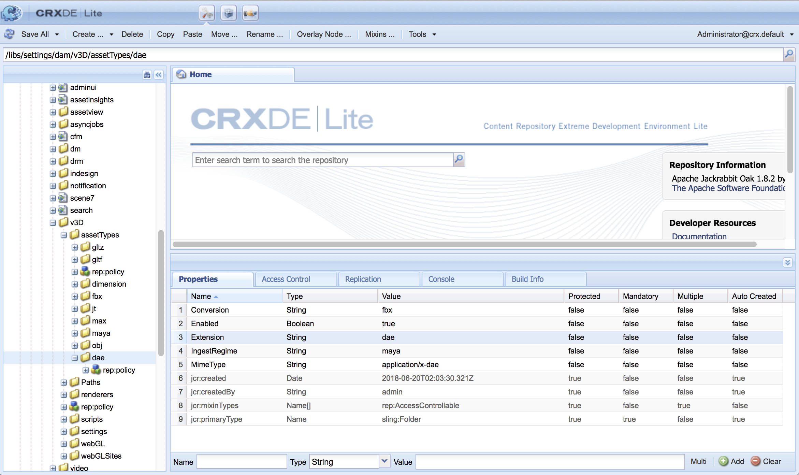

# AEM 3D integreren met Autodesk Maya {#integrating-aem-d-with-autodesk-maya}

>[!NOTE]
>
>Deze taak is optioneel en heeft alleen betrekking op Windows.

U kunt desgewenst AEM 3D integreren met Autodesk® Maya®-software om ondersteuning voor systeemeigen Maya-bestanden (`.MA` en `.MB`) mogelijk te maken en om 3D-middelen te kunnen renderen in AEM met elke beschikbare Maya-renderer.

*Deze integratie geldt alleen* voor Windows.

Wanneer u integreert met Autodesk Maya, moet u Autodesk Maya installeren en configureren, het pad naar de uitvoerbare map van Maya toevoegen, Maya inschakelen voor inname en renderen en de integratie testen.

Zie [Geavanceerde configuratie-instellingen](advanced-config-3d.md).

Zie ook AEM 3D [integreren met AutoDesk 3ds Max](integrating-aem-3d-with-autodesk-3ds-max.md).

**AEM 3D integreren met Autodesk Maya**:

1. Installeer Autodesk Maya 2016-software op dezelfde servers als AEM.

   Controleer na de installatie of u Maya kunt openen en gebruiken en of er geen licentieproblemen zijn.

   >[!NOTE]
   >
   >AEM gebruikt alleen het gereedschap Maya-opdrachtregel (`render.exe`). Met één Maya-netwerklicentie kunnen maximaal vijf servers tegelijk Maya-inhoud verwerken of renderen.

1. Schakel in Maya de Autodesk FBX®-plug-in in.
1. Installeer de insteekmodule voor het renderen van MentalRay of een andere gewenste renderer.

   Controleer na de installatie of MentalRay beschikbaar is in Maya.

1. Voeg het pad naar de uitvoerbare map Maya toe aan de omgevingsvariabele PATH van Windows.

   Tik bijvoorbeeld op Windows Server 2012 op **[!UICONTROL Start > Configuratiescherm > Systeem en beveiliging > Systeem > Geavanceerde systeeminstellingen > Omgevingsvariabelen**. Voeg het volledige pad naar de `Maya2016\bin` map toe aan de `Path`systeemvariabele.

   

1. Als u Maya wilt inschakelen voor opnemen en renderen, opent u de eigenschap **[!UICONTROL CRXDE Lite]** en navigeert u ernaar `/libs/settings/dam/v3D/assetTypes/maya` en stelt u deze in op **[!UICONTROL Enabled]** eigenschap `true`.

   

1. Als u de bestandsindeling JT (Siemens PLM Open CAD) wilt inschakelen, navigeert u naar de eigenschap `/libs/settings/dam/v3D/assetTypes/jt` en stelt u deze in op **[!UICONTROL Enabled]** `true`.
1. Schakel in AEM Maya in als renderer. Begin door naar **[!UICONTROL Tools > General > CRXDE Lite]** te navigeren.
1. Navigeer op de **[!UICONTROL CRXDE Lite]** pagina in het linkerdeelvenster naar het volgende:

   `/libs/settings/dam/v3D/renderers/maya`

   

1. Stel de **[!UICONTROL Enabled]** eigenschap in op `true`.

1. Near the upper-left corner of the **[!UICONTROL CRXDE Lite]** page, tap **[!UICONTROL Save All]**.

   Maya is nu ingeschakeld als een renderer.

## De integratie van AEM 3D testen met Autodesk Maya {#testing-the-integration-of-aem-d-with-autodesk-maya}

1. Open AEM Assets en upload de `.MA` bestanden in `sample-3D-content/models` de `test3d` map.

   Let op: `sample-3D-content.zip` is eerder gedownload voor validatie van de standaard 3D-functionaliteit.

1. Keer terug naar **[!UICONTROL Kaart** mening en bekijk de berichtbanners die op de geupload activa worden getoond.

   De banner Converting Format wordt weergegeven terwijl Maya de native `.MA` indeling converteert naar `.FBX`.

1. Nadat alle verwerking is voltooid, opent u het `logo-sphere.ma` element en selecteert u het `stage-helipad.ma` werkgebied.

   De ervaring van de Voorproef is het zelfde als met `logo_sphere.fbx` en `stage-helipad.fbx`.

1. Tik in de linkerbovenhoek van de pagina of klik op de vervolgkeuzelijst en selecteer **[!UICONTROL CRender]**.

   

1. Selecteer in de **[!UICONTROL Renderer]** vervolgkeuzelijst de optie **[!UICONTROL Autodesk Maya]** en tik op **[!UICONTROL Start Render]**.
1. Tik of klik in de rechterbovenhoek van de pagina **[!UICONTROL Close]** om terug te keren naar de **[!UICONTROL Card]** weergave.

   Bekijk de berichtenbanner op het afbeeldingselement dat wordt gerenderd (`logo-sphere`, tenzij een andere afbeeldingsnaam is opgegeven). Een voortgangsbalk op de banner geeft de voortgang van het renderen weer.

   >[!NOTE]
   >
   >Renderen is erg CPU-intensief en kan enkele minuten duren.

1. Nadat de rendering is voltooid, opent u het gerenderde afbeeldingselement.

   Controleer of de gerenderde afbeelding redelijk overeenkomt met de afbeelding die u bekeek op het moment dat u klikte **[!UICONTROL Render Now]**.

## Extra door Maya ondersteunde indelingen inschakelen {#enabling-additional-formats-supported-by-maya}

(Optioneel) Maya ondersteunt een aantal 3D-invoerindelingen, waarvan alle kunnen worden ingeschakeld zodat AEM het bestandstype herkent. Als deze optie is ingeschakeld, stuurt AEM het bestand naar Maya om het om te zetten in een indeling die direct door AEM kan worden ingeslikt.

Afhankelijk van de indeling kan de ondersteuning van functies beperkt zijn (materialen kunnen bijvoorbeeld niet worden doorgegeven) en kan de kwaliteit/betrouwbaarheid beperkt zijn (bijvoorbeeld omgekeerde vlakken). Adobe ondersteunt alleen het algemene mechanisme, maar geen specifieke indelingsconversie.

Zie [Ondersteunde indelingen voor het importeren van gegevens | Maya](https://knowledge.autodesk.com/support/maya/learn-explore/caas/CloudHelp/cloudhelp/2016/ENU/Maya/files/GUID-69BC066D-D4D8-4B12-900C-CF42E798A5D6-htm.html) voor informatie over de door Maya ondersteunde formaten.

**Extra indelingen inschakelen die worden ondersteund door AEM**:

1. Navigeer **[!UICONTROL CRXDE Lite]** naar `/libs/settings/dam/v3D/assetTypes`.
1. Maak een kopie van het **[!UICONTROL jt]** knooppunt. Klik met de rechtermuisknop op het **[!UICONTROL jt]** knooppunt en selecteer **[!UICONTROL Copy]**, klik met de rechtermuisknop op de **[!UICONTROL assetTypes]** map en selecteer **[!UICONTROL Paste]**. Dit zou een nieuw knooppunt moeten veroorzaken `/apps/cq-scene7-v3D/config/assetTypes/Copy of jt`.
1. Wijzig de naam van het nieuwe knooppunt om het een unieke naam te geven die het bestandstype vertegenwoordigt dat moet worden toegevoegd. Het achtervoegsel van het bestand kan worden gebruikt of een andere unieke id.

1. Stel de **[!UICONTROL Enabled]** eigenschap van het nieuwe knooppunt in op `true`.

1. Stel de **[!UICONTROL Extension]** eigenschap van de nieuwe notitie in op het achtervoegsel/de extensie van het bestand dat wordt toegevoegd.
1. Stel de juiste waarde in voor de **[!UICONTROL MimeType]** eigenschap. `application/x-` gevolgd door de waarde van de **[!UICONTROL Extension]** eigenschap moet werken voor de meeste bestandstypen.
1. Controleer of de **[!UICONTROL Conversion]** eigenschap is ingesteld op `fbx` en **[!UICONTROL IngestRegime]** op `Maya`.
1. Klik **[!UICONTROL Save All]** linksboven op de pagina.

De volgende schermafbeelding illustreert een toegevoegde bestandsindeling, waarbij COLLADA DAE als voorbeeld wordt gebruikt:

