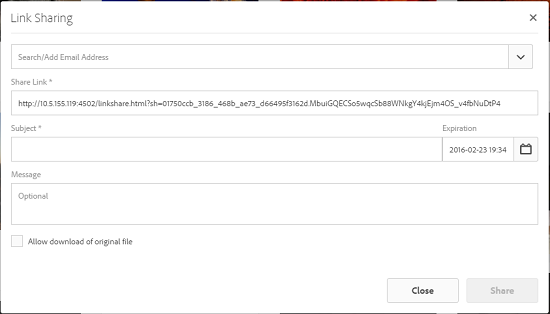
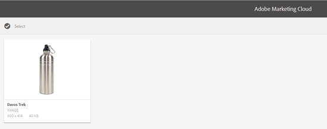

# Delen van koppelingen van middelen {#asset-link-sharing}

Met AEM (Adobe Experience Manager) kunt u elementen, mappen en verzamelingen als een URL delen met leden van uw organisatie en externe entiteiten, waaronder partners en leveranciers. Het delen van elementen via een koppeling is een handige manier om bronnen beschikbaar te maken voor externe partijen zonder dat deze zich eerst hoeven aan te melden bij AEM Assets.

>[!NOTE]
>
>U vereist geeft ACL toestemming op de omslagen en de activa uit die u als verbinding wilt delen.

## Assets delen {#share-assets}

Gebruik het dialoogvenster Koppelen om de URL te genereren voor elementen die u met gebruikers wilt delen. Gebruikers met beheerdersrechten of met leesmachtigingen op de `/var/dam/share` locatie kunnen de koppelingen weergeven die met hen worden gedeeld.

>[!NOTE]
>
>Voordat u een koppeling met gebruikers deelt, moet u controleren of deze [!UICONTROL Day CQ Mail Service] is geconfigureerd. Er treedt een fout op als u een koppeling probeert te delen zonder eerst de Day CQ Mail Service [te](link-sharing.md#configure-day-cq-mail-service)configureren.

1. Selecteer in de gebruikersinterface Elementen het element dat u wilt delen als een koppeling.
1. Klik/tik op het pictogram voor delen van **[!UICONTROL Share Link]** elementen op de werkbalk .

   In het **[!UICONTROL Share Link]** veld wordt automatisch een elementkoppeling gemaakt. Kopieer deze koppeling en deel deze met de gebruikers. De standaardvervaltijd voor de verbinding is één dag.

   

   Alternatief, ga te werk om stappen 3-7 van deze procedure uit te voeren om e-mailontvangers toe te voegen, de vervaltijd voor de verbinding te vormen, en het van de dialoog te verzenden.

   >[!NOTE]
   >
   >Als u koppelingen van uw AEM-auteur naar externe entiteiten wilt delen, stelt u alleen de volgende URL&#39;s beschikbaar die worden gebruikt voor het delen van koppelingen, voor GET-aanvragen. Blok andere URLs om ervoor te zorgen dat uw AEM plaatsing veilig is.
   >
   >* &lt;AEM Server>/linkshare.html
   * &lt;AEM Server>/linksharepreview.html
   * &lt;AEM Server>/linkexpired.html

   >[!NOTE]
   Als een gedeeld element naar een andere locatie wordt verplaatst, werkt de koppeling niet meer. Maak de koppeling opnieuw en deel deze opnieuw met de gebruikers.

1. Open vanuit de webconsole de **[!UICONTROL Day CQ Link Externalizer]**-configuratie en wijzig de volgende eigenschappen in het veld **[!UICONTROL Domains]** met de waarden die bij elk worden vermeld:

   * lokaal
   * author
   * publish

   Geef voor de eigenschappen `local` en `author` de URL op voor respectievelijk de lokale instantie en de auteur. Zowel `local` als `author` eigenschappen hebben dezelfde waarde als u één AEM auteurinstantie uitvoert. Geef `publish`bijvoorbeeld de URL op voor de publicatie-instantie.

1. Typ in het vak E-mailadres van het dialoogvenster **[!UICONTROL Link Sharing]** de e-mail-id van de gebruiker met wie u de koppeling wilt delen. U kunt de koppeling ook delen met meerdere gebruikers.

   Als de gebruiker lid is van uw organisatie, selecteert u de e-mailid van de gebruiker in de voorgestelde e-mailadressen die worden weergegeven in de lijst onder het invoergebied. Voor een externe gebruiker typt u de volledige e-mailid en selecteert u deze in de lijst.

   Als u wilt dat e-mailberichten naar gebruikers kunnen worden verzonden, configureert u de SMTP-servergegevens in [Day CQ Mail Service](link-sharing.md#configure-day-cq-mail-service).

   

   Koppelingen naar elementen rechtstreeks delen via het dialoogvenster Koppelen

   >[!NOTE]
   Als u een e-mailadres invoert van een gebruiker die geen lid is van uw organisatie, wordt het woord &quot;Externe gebruiker&quot; voorafgegaan door de e-mailid van de gebruiker.

1. Voer in het **[!UICONTROL Subject]** vak een onderwerp in voor het element dat u wilt delen.
1. Voer in het **[!UICONTROL Message]** vak een optioneel bericht in.
1. Geef in het **[!UICONTROL Expiration]** veld met de datumkiezer een vervaldatum en -tijd voor de koppeling op. De vervaldatum wordt standaard ingesteld voor een week vanaf de datum waarop u de koppeling deelt.

   

1. Selecteer **[!UICONTROL Allow download of original file]**.

   >[!NOTE]
   Standaard kunnen gebruikers alleen de uitvoeringen downloaden van het element dat u als koppeling deelt.

1. Klik op **[!UICONTROL Share]**. Een bericht bevestigt dat de koppeling via e-mail met de gebruiker(s) wordt gedeeld.
1. Als u het gedeelde element wilt weergeven, klikt of tikt u op de koppeling in het e-mailbericht dat naar de gebruiker is verzonden. Het gedeelde element wordt op de [!UICONTROL Adobe Marketing Cloud] pagina weergegeven.

   

   Als u wilt schakelen naar de lijstweergave, klikt of tikt u op het layoutpictogram op de werkbalk.

1. Als u een voorvertoning van de asset wilt genereren, klikt of tikt u op de gedeelde asset. Klik/tik **[!UICONTROL Back]** op de werkbalk om de voorvertoning te sluiten en terug te keren naar de [!UICONTROL Marketing Cloud] pagina. Als u een map hebt gedeeld, klikt of tikt u op **[!UICONTROL Parent Folder]** om terug te keren naar de bovenliggende map.

   

   >[!NOTE]
   AEM ondersteunt het genereren van een voorvertoning van elementen van deze MIME-typen: JPG, PNG, GIF, BMP, INDD, PDF en PPT. U kunt alleen de elementen van de andere MIME-typen downloaden.

1. Als u het gedeelde element wilt downloaden, klikt of tikt u op het **[!UICONTROL Select]** pictogram op de werkbalk, klikt of tikt u op het element en klikt of tikt u vervolgens op **[!UICONTROL Download]** de werkbalk.

   

1. Als u de elementen die u als koppelingen hebt gedeeld, wilt weergeven, gaat u naar de interface Middelen en klikt of tikt u op het **[!UICONTROL GlobalNav]** pictogram. Kies een optie **[!UICONTROL Navigation]** in de lijst om het navigatievenster weer te geven.
1. Kies in het navigatievenster **[!UICONTROL Shared Links]** als u een lijst met gedeelde assets wilt weergeven.
1. Als u een element niet meer wilt delen, selecteert u het en tikt u op de werkbalk of klikt u erop. **[!UICONTROL Unshare]** Een bericht bevestigt dat u het element niet hebt gedeeld. Bovendien wordt de vermelding voor het element uit de lijst verwijderd.

## CQ-mailservice op dag configureren {#configure-day-cq-mail-service}

1. Klik of tik op het AEM-logo en ga naar **[!UICONTROL Tools > Operations > Web Console]**.
1. Van de lijst van de diensten, bepaal de plaats **[!UICONTROL Day CQ Mail Service]**.
1. Click the **[!UICONTROL Edit]** icon beside the service, and configure the following parameters for **[!UICONTROL Day CQ Mail Service]** with the details mentioned against their names:

   * hostnaam SMTP-server: hostnaam e-mailserver
   * SMTP-serverpoort: e-mailserverpoort
   * SMTP-gebruiker: gebruikersnaam e-mailserver
   * SMTP-wachtwoord: wachtwoord e-mailserver

   

1. Klik of tik op **[!UICONTROL Save]**.

## Maximale gegevensgrootte configureren {#configure-maximum-data-size}

Wanneer u elementen downloadt van de koppeling die wordt gedeeld met de functie voor het delen van koppelingen, comprimeert AEM de gehele elementenhiërarchie vanuit de opslagplaats en retourneert het element in een ZIP-bestand. Bij gebrek aan beperkingen van de hoeveelheid gegevens die in een ZIP-bestand kan worden gecomprimeerd, worden enorme hoeveelheden gegevens gecomprimeerd, waardoor fouten in het geheugen in JVM worden veroorzaakt. Om het systeem van een potentiële ontkenning van de dienstaanval toe te schrijven aan deze situatie te beveiligen, vorm de maximumgrootte gebruikend de **[!UICONTROL Max Content Size (uncompressed)]** parameter voor **[!UICONTROL Day CQ DAM Adhoc Asset Share Proxy Servlet]** in de Manager van de Configuratie. Als de niet-gecomprimeerde grootte van het element de geconfigureerde waarde overschrijdt, worden de verzoeken om het downloaden van het element afgewezen. De standaardwaarde is 100 MB.

1. Click/Tap the AEM logo and then go to **[!UICONTROL Tools > Operations > Web Console]**.
1. Zoek vanuit de webconsole de **[!UICONTROL Day CQ DAM Adhoc Asset Share Proxy Servlet]** configuratie.
1. Open de **[!UICONTROL Day CQ DAM Adhoc Asset Share Proxy Servlet]** configuratie in geef wijze uit, en wijzig de waarde van de **[!UICONTROL Max Content Size (uncompressed)]** parameter.

   

1. Sla de wijzigingen op.

## Beste werkwijzen en probleemoplossing {#best-practices-and-troubleshooting}

* Elementmappen of verzamelingen die een witruimte in hun naam bevatten, worden mogelijk niet gedeeld.
* Als gebruikers de gedeelde elementen niet kunnen downloaden, moet u bij de AEM controleren wat de [downloadlimieten](#configure-maximum-data-size) zijn.
* Als u geen e-mail met koppelingen naar gedeelde elementen kunt verzenden of als de andere gebruikers uw e-mail niet kunnen ontvangen, raadpleegt u uw AEM als de [e-mailservice](#configure-day-cq-mail-service) is geconfigureerd of niet.
* Als u geen elementen kunt delen via de functie voor het delen van koppelingen, controleert u of u de juiste machtigingen hebt. Zie [Elementen](#share-assets)delen.
