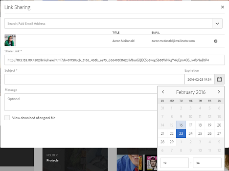

# Middelen delen via een koppeling {#asset-link-sharing}

>[!CAUTION]
>
>AEM 6.4 heeft het einde van de uitgebreide ondersteuning bereikt en deze documentatie wordt niet meer bijgewerkt. Raadpleeg voor meer informatie onze [technische ondersteuningsperioden](https://helpx.adobe.com/support/programs/eol-matrix.html). Ondersteunde versies zoeken [hier](https://experienceleague.adobe.com/docs/).

[!DNL Adobe Experience Manager Assets] kunt u elementen, mappen en verzamelingen als een URL delen met leden van uw organisatie en externe entiteiten, waaronder partners en leveranciers. Het delen van elementen via een koppeling is een handige manier om bronnen beschikbaar te maken voor externe partijen zonder dat ze zich eerst hoeven aan te melden bij [!DNL Assets].

>[!PREREQUISITES]
>
>* U vereist geeft ACL toestemming op de omslag of de activa uit die u als verbinding wilt delen.
>* Om e-mails naar de gebruikers te verzenden, configureert u de SMTP-servergegevens in [CQ-mailservice op dag](#configmailservice).

## Assets delen {#share-assets}

Gebruik het dialoogvenster Koppelen om de URL te genereren voor elementen die u met gebruikers wilt delen. Gebruikers met beheerdersrechten of met leesmachtigingen op `/var/dam/share` de locatie kan de koppelingen weergeven die met hen worden gedeeld.

1. In de [!DNL Assets] -gebruikersinterface, selecteert u het element dat u wilt delen als koppeling.
1. Klik in de werkbalk op de knop **[!UICONTROL Share Link]** . De koppeling die wordt gemaakt nadat u op **[!UICONTROL Share]** wordt vooraf weergegeven in het dialoogvenster [!UICONTROL Share Link] veld. De koppeling wordt pas gemaakt wanneer u op **[!UICONTROL Submit]**.

   

   *Afbeelding: Het dialoogvenster voor het delen van elementen als een koppeling.*

1. Typ in het vak E-mailadres van het dialoogvenster **[!UICONTROL Link Sharing]** de e-mail-id van de gebruiker met wie u de koppeling wilt delen. U kunt een of meer gebruikers toevoegen.

   

   *Afbeelding: Koppelingen naar elementen rechtstreeks vanuit de [!UICONTROL Link Sharing] .*

   >[!NOTE]
   >
   >Als u een e-mailadres invoert van een gebruiker die geen lid is van uw organisatie, worden de woorden [!UICONTROL External User] worden voorafgegaan door de e-mailadres van de gebruiker.

1. In de **[!UICONTROL Subject]** voert u een onderwerp in voor het element dat u wilt delen.
1. In de **[!UICONTROL Message]** Voer een optioneel bericht in.

1. In de **[!UICONTROL Expiration]** geeft u een vervaldatum en -tijd op waarop de koppeling moet stoppen. De standaardvervaltijd voor de verbinding is één dag.

   

1. Selecteer **[!UICONTROL Allow download of original file]**. Standaard kunnen gebruikers alleen de uitvoeringen downloaden van het element dat u als koppeling deelt.

1. Klik op **[!UICONTROL Share]**. Een bericht bevestigt dat de koppeling via e-mail met de gebruikers wordt gedeeld.

1. Klik op de koppeling in de e-mail die naar de gebruiker is verzonden om het gedeelde element weer te geven. Klik op het gedeelde element om een voorvertoning van het element te genereren. Als u de voorvertoning wilt sluiten, klikt u op **[!UICONTROL Back]**. Als u een map hebt gedeeld, klikt u op **[!UICONTROL Parent Folder]** om terug te keren naar de bovenliggende map.

   

   >[!NOTE]
   >
   >[!DNL Experience Manager] biedt alleen ondersteuning voor het genereren van voorvertoningen van elementen van de ondersteunde bestandstypen. Als andere MIME-typen worden gedeeld, kunt u alleen de elementen downloaden en kunt u geen voorvertoning weergeven.

1. Als u het gedeelde element wilt downloaden, klikt u op **[!UICONTROL Select]** klikt u in de werkbalk op het element en vervolgens op **[!UICONTROL Download]** op de werkbalk.

   

1. Ga naar de [!DNL Assets] gebruikersinterface en klik op [!DNL Experience Manager] logo. Kies **[!UICONTROL Navigation]**. Kies in het navigatievenster de optie **[!UICONTROL Shared Links]** om een lijst met gedeelde elementen weer te geven.

1. Als u een element niet wilt delen, selecteert u het en klikt u op **[!UICONTROL Unshare]** op de werkbalk. Hierna volgt een bevestigingsbericht. De vermelding voor het element wordt uit de lijst verwijderd.

## CQ-mailservice op dag configureren {#configure-day-cq-mail-service}

1. Op de [!DNL Experience Manager] homepage, navigeren naar **[!UICONTROL Tools]** > **[!UICONTROL Operations]** > **[!UICONTROL Web Console]**.
1. Van de lijst van de diensten, bepaal de plaats van **[!UICONTROL Day CQ Mail Service]**.
1. Klikken **[!UICONTROL Edit]** naast de dienst, en vorm de volgende parameters voor **[!UICONTROL Day CQ Mail Service]** met vermelding van de naam:

   * hostnaam SMTP-server: hostnaam e-mailserver
   * SMTP-serverpoort: e-mailserverpoort
   * SMTP-gebruiker: gebruikersnaam e-mailserver
   * SMTP-wachtwoord: wachtwoord e-mailserver

   

1. Klik op **[!UICONTROL Save]**.

## Maximale gegevensgrootte configureren {#configure-maximum-data-size}

Wanneer u elementen downloadt van de koppeling die wordt gedeeld met de functie voor het delen van koppelingen, [!DNL Experience Manager] comprimeert de elementhiërarchie vanuit de gegevensopslagruimte en retourneert het element in een ZIP-bestand. Bij gebrek aan beperkingen van de hoeveelheid gegevens die in een ZIP-bestand kan worden gecomprimeerd, worden enorme hoeveelheden gegevens gecomprimeerd, waardoor fouten in het geheugen in JVM worden veroorzaakt. Om het systeem van een potentiële ontkenning van de dienstaanval wegens deze situatie te beveiligen, vorm de maximumgrootte gebruikend **[!UICONTROL Max Content Size (uncompressed)]** parameter for **[!UICONTROL Day CQ DAM Adhoc Asset Share Proxy Servlet]** in Configuration Manager. Als de niet-gecomprimeerde grootte van het element de geconfigureerde waarde overschrijdt, worden de verzoeken om het downloaden van het element afgewezen. De standaardwaarde is 100 MB.

1. Klik op de knop [!DNL Experience Manager] logo en ga vervolgens naar **[!UICONTROL Tools]** > **[!UICONTROL Operations]** > **[!UICONTROL Web Console]**.
1. Zoek in de webconsole de **[!UICONTROL Day CQ DAM Adhoc Asset Share Proxy Servlet]** configuratie.
1. Open de **[!UICONTROL Day CQ DAM Adhoc Asset Share Proxy Servlet]** configuratie in geeft wijze uit, en wijzigt de waarde van uit **[!UICONTROL Max Content Size (uncompressed)]** parameter.

   

1. Sla de wijzigingen op.

## Beste werkwijzen en probleemoplossing {#best-practices-and-troubleshooting}

* Elementmappen of verzamelingen die een witruimte in hun naam bevatten, worden mogelijk niet gedeeld.
* Als gebruikers de gedeelde elementen niet kunnen downloaden, raadpleegt u uw [!DNL Experience Manager] beheerder wat de [downloadlimieten](#configure-maximum-data-size) zijn.
* Als u geen e-mail met koppelingen naar gedeelde elementen kunt verzenden of als de andere gebruikers uw e-mail niet kunnen ontvangen, raadpleegt u [!DNL Experience Manager] beheerder als de [e-mailservice](#configure-day-cq-mail-service) is geconfigureerd of niet.
* Als u geen elementen kunt delen via de functie voor het delen van koppelingen, controleert u of u de juiste machtigingen hebt. Zie [aandelenactiva](#share-assets).
* Als een gedeeld element naar een andere locatie wordt verplaatst, werkt de koppeling niet meer. Maak de koppeling opnieuw en deel deze opnieuw met de gebruikers.

* Als u koppelingen wilt delen vanuit uw [!DNL Experience Manager] Implementatie van auteurs naar externe entiteiten, zorg ervoor dat u alleen de volgende URL&#39;s beschikbaar maakt die worden gebruikt voor het delen van koppelingen, voor `GET` alleen aanvragen. Andere URL&#39;s blokkeren vanwege beveiligingsredenen.

   * `http://[aem_server]:[port]/linkshare.html`
   * `http://[aem_server]:[port]/linksharepreview.html`
   * `http://[aem_server]:[port]/linkexpired.html`
   In [!DNL Experience Manager] interface, toegang **[!UICONTROL Tools]** > **[!UICONTROL Operations]** > **[!UICONTROL Web Console]**. Open de **[!UICONTROL Day CQ Link Externalizer]** en wijzigt u de volgende eigenschappen in het dialoogvenster **[!UICONTROL Domains]** veld met de vermelde waarden `local`, `author`, en `publish`. Voor de `local` en `author` -eigenschappen geeft u de URL op voor respectievelijk de lokale instanties en de instanties van Auteurs. Als u één [!DNL Experience Manager] Auteur-instantie: gebruik dezelfde waarde voor `local` en `author` eigenschappen. Geef bij Publicatie-instanties de URL op van het dialoogvenster [!DNL Experience Manager] Publiceer instantie.
