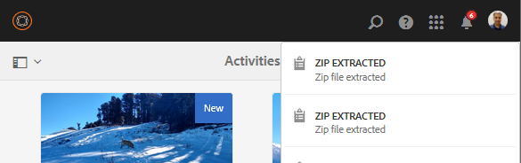
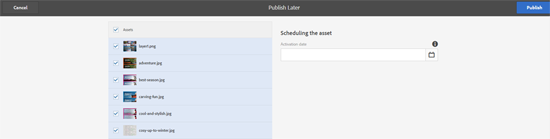

# Uw digitale middelen beheren {#managing-assets-with-the-touch-optimized-ui}

Leer meer over verschillende functies voor middelenbeheer en -bewerking die u kunt uitvoeren met de geoptimaliseerde interface van AEM Assets.

In dit artikel wordt beschreven hoe u elementen beheert en bewerkt met de door Adobe Experience Manager (AEM) Assets Touch geoptimaliseerde gebruikersinterface. Voor elementaire kennis van de gebruikersinterface, zie [Basisbehandeling van Aanraakinterface](/help/sites-authoring/basic-handling.md). Zie [Inhoudsfragmenten beheren](content-fragments-managing.md) elementen voor het beheren van Inhoudsfragmenten.

## Mappen {#create-folders} maken

Wanneer u een verzameling elementen ordent, bijvoorbeeld alle `Nature`-afbeeldingen, kunt u mappen maken om deze bij elkaar te houden. U kunt mappen gebruiken om uw elementen te categoriseren en in te delen. Voor AEM Assets hoeft u elementen niet in mappen te ordenen om beter te werken.

>[!NOTE]
>
>* Het delen van een map Middelen van het type `sling:OrderedFolder` wordt niet ondersteund bij het delen naar Marketing Cloud. Als u een map wilt delen, selecteert u Niet geordend bij het maken van een map.
>* Experience Manager staat het gebruik van `subassets` woord als naam van een omslag niet toe. Het is een gereserveerd sleutelwoord voor knoop die subassets voor samengestelde activa bevatten.

1. Navigeer naar de plaats in de map met digitale elementen waar u een nieuwe map wilt maken.
1. Klik in het menu op **[!UICONTROL Create]**. Selecteer **[!UICONTROL New Folder]**.
1. Geef in het veld **[!UICONTROL Title]** een mapnaam op. Standaard gebruikt DAM de titel die u als mapnaam hebt opgegeven. Nadat de map is gemaakt, kunt u de standaardinstelling overschrijven en een andere mapnaam opgeven.
1. Klik op **[!UICONTROL Create]**. De map wordt weergegeven in de map met digitale middelen.

De volgende tekens (lijst met door spaties gescheiden tekens) worden niet ondersteund:

* elementbestandsnaam mag geen `* / : [ \ \ ] | # % { } ? &` bevatten
* elementmapnaam mag geen `* / : [ \ \ ] | # % { } ? \" . ^ ; + & \t` bevatten

## Elementen uploaden {#uploading-assets}

U kunt verschillende typen elementen (zoals afbeeldingen, PDF-bestanden, RAW-bestanden, enzovoort) uploaden van uw lokale map of een netwerkstation naar AEM Assets.

>[!NOTE]
>
>In de modus Dynamic Media - Scene7 kunt u alleen elementen uploaden waarvan de bestandsgrootte 2 GB of minder is.

U kunt ervoor kiezen elementen te uploaden naar mappen waaraan al dan niet een verwerkingsprofiel is toegewezen.

Voor mappen waaraan een verwerkingsprofiel is toegewezen, wordt de profielnaam weergegeven op de miniatuur in de kaartweergave. In de lijstmening, verschijnt de profielnaam in **[!UICONTROL Processing Profile]** kolom. Zie [Profielen verwerken](processing-profiles.md).

Voordat u een element uploadt, moet u ervoor zorgen dat het een [ondersteunde indeling](assets-formats.md) heeft.

**Elementen** uploaden:

1. Navigeer in de middelenwebinterface naar de locatie waar u digitale elementen wilt toevoegen.
1. Voer een van de volgende handelingen uit om de elementen te uploaden:

   * Tik op het pictogram **[!UICONTROL Create]** op de werkbalk. Tik vervolgens op **[!UICONTROL Files]** in het menu. U kunt de naam van het bestand desgewenst wijzigen in het dialoogvenster dat verschijnt.
   * In browser die HTML5 steunt, sleep de activa direct op de interface. Het dialoogvenster voor het wijzigen van de naam van het bestand wordt niet weergegeven.

   

   Als u meerdere bestanden wilt selecteren, drukt u op Ctrl/Command en selecteert u de elementen in het dialoogvenster Bestandenkiezer. Op een iPad kunt u slechts één bestand tegelijk selecteren.

   U kunt het uploaden van grote elementen (groter dan 500 MB) pauzeren en later vanaf dezelfde pagina hervatten. Tik op het pictogram **[!UICONTROL Pause]** naast de voortgangsbalk die wordt weergegeven wanneer het uploaden start.

   

   De omvang waarboven een actief als een groot actief wordt beschouwd, kan worden geconfigureerd. U kunt het systeem bijvoorbeeld zodanig configureren dat elementen boven 1000 MB (in plaats van 500 MB) als grote elementen worden beschouwd. In dit geval wordt de knop **[!UICONTROL Pause]** in de voortgangsbalk weergegeven wanneer bestanden van meer dan 1000 MB worden geüpload.

   De knop **[!UICONTROL Pause]** wordt niet weergegeven als een bestand van meer dan 1000 MB wordt geüpload met een bestand van minder dan 1000 MB. Als u echter de bestandsupload van minder dan 1000 MB annuleert, wordt de knop **[!UICONTROL Pause]** weergegeven.

   Als u de formaatlimiet wilt wijzigen, configureert u de eigenschap `chunkUploadMinFileSize` van het `fileupload`knooppunt in de CRX-opslagruimte.

   Wanneer u op het pictogram **[!UICONTROL Pause]** klikt, wordt geschakeld naar een **[!UICONTROL Play]**-pictogram. Klik op het pictogram **[!UICONTROL Play]** om het uploaden te hervatten.

   

   Als u een actieve upload wilt annuleren, klikt u op de knop `X` naast de voortgangsbalk. Wanneer u het uploaden annuleert, verwijdert AEM Assets het gedeeltelijk geüploade gedeelte van het element.

   De mogelijkheid om het uploaden te hervatten is vooral handig in scenario&#39;s met lage bandbreedte en netwerkstoringen, waarbij het uploaden van een groot element veel tijd in beslag neemt. U kunt het uploaden pauzeren en verdergaan wanneer de situatie verbetert. Wanneer u het document hervat, begint het uploaden vanaf het punt waarop u het hebt gepauzeerd.

   Tijdens het uploaden slaat AEM de delen van het element dat wordt geüpload op als stukjes gegevens in de CRX-opslagplaats. Wanneer het uploaden is voltooid, consolideert AEM deze fragmenten in één gegevensblok in de gegevensopslagruimte.

   Ga naar `https://[aem_server]:[port]/system/console/configMgr/org.apache.sling.servlets.post.impl.helper.ChunkCleanUpTask` om de opschoningstaak voor de onvoltooide taken voor het uploaden van taken te configureren.

   Als u een element uploadt met dezelfde naam als een element dat al beschikbaar is op de locatie waar u het element uploadt, wordt een waarschuwingsvenster weergegeven.

   U kunt een bestaand element vervangen, een andere versie maken of beide behouden door de naam van het nieuwe element dat wordt geüpload te wijzigen. Als u een bestaand element vervangt, worden de metagegevens voor het element en eerdere wijzigingen en de geschiedenis (bijvoorbeeld annotaties, uitsnijdingen, enzovoort) verwijderd. Als u ervoor kiest beide elementen te behouden, wordt de naam van het nieuwe element gewijzigd.

   

   >[!NOTE]
   >
   >Wanneer u **[!UICONTROL Replace]** in het **[!UICONTROL Name Conflict]** dialoogvakje selecteert, wordt de activa-identiteitskaart opnieuw geproduceerd voor het nieuwe element. Deze id verschilt van de id van het vorige element.
   >
   >Als **[!UICONTROL Asset Insights]** is ingeschakeld om afbeeldingen bij te houden/op Adobe Analytics te klikken, maakt deze opnieuw gegenereerde element-id de gegevensopname voor het element op Adobe Analytics ongeldig.

   Als het element dat u uploadt bestaat in AEM Assets, wordt in het dialoogvenster **[!UICONTROL Duplicates Detected]** gewaarschuwd dat u probeert een gedupliceerd element te uploaden. Het dialoogvenster wordt alleen weergegeven als de waarde van de controlesom SHA 1 van de binaire waarde van het bestaande element overeenkomt met de waarde van de controlesom van het element dat u uploadt. In dit geval zijn de namen van activa niet van belang. Met andere woorden, het dialoogvenster kan zelfs worden weergegeven voor elementen met verschillende namen als de SHA 1-waarden voor hun binaire getallen gelijk zijn.

   >[!NOTE]
   >
   >Het dialoogvenster **[!UICONTROL Duplicates Detected]** wordt alleen weergegeven wanneer de functie **[!UICONTROL Duplicate Detection]** is ingeschakeld. Zie [Dubbele detectie inschakelen](duplicate-detection.md) om de functie **[!UICONTROL Duplicate Detection]** in te schakelen.

   

   Tik **[!UICONTROL Keep]** om het gedupliceerde element in AEM Assets te behouden. Tik **[!UICONTROL Delete]** om het geüploade dubbele element te verwijderen.

   AEM Assets voorkomt dat u elementen uploadt met verboden tekens in de bestandsnaam. Als u een element probeert te uploaden dat de niet-toegestane tekens bevat, geeft AEM Assets een waarschuwingsbericht weer over de aanwezigheid van verboden tekens in de bestandsnaam en wordt het uploaden gestopt totdat u deze tekens verwijdert of uploadt met een toegestane naam.

   Als u specifieke conventies voor het benoemen van bestanden voor uw organisatie wilt gebruiken, kunt u in het dialoogvenster **[!UICONTROL Upload Assets]** lange namen opgeven voor de bestanden die u uploadt.

   

   De volgende tekens (lijst met door spaties gescheiden tekens) worden echter niet ondersteund:
   * elementbestandsnaam mag geen `* / : [ \ \ ] | # % { } ? &` bevatten
   * elementmapnaam mag geen `* / : [ \ \ ] | # % { } ? \" . ^ ; + & \t` bevatten

   Daarnaast wordt in de interface Middelen het meest recente element weergegeven dat u uploadt of de map die u eerst maakt in alle weergaven (**[!UICONTROL Card view]**, **[!UICONTROL List view]** en **[!UICONTROL Column view]**).

   Vaak, terwijl het uploaden van grote activa of veelvoudige activa gelijktijdig, laten de visuele indicatoren u toe om de vooruitgang te beoordelen. In het dialoogvenster **[!UICONTROL Upload Progress]** ziet u het aantal bestanden dat is geüpload en de bestanden die niet zijn geüpload.

   

   Als u het uploaden annuleert voordat de bestanden zijn geüpload, stopt AEM Assets met het uploaden van het huidige bestand en wordt de inhoud vernieuwd. Bestanden die al zijn geüpload, worden echter niet verwijderd.

### Seriële uploads {#serial-uploads}

Het uploaden van talrijke activa in bulk verbruikt significante systeemmiddelen, die de prestaties van uw AEM plaatsing kunnen negatief beïnvloeden. Potentiële knelpunten kunnen zijn: uw internetverbinding, lees-schrijfbewerkingen op schijf, beperkingen van de webbrowser voor het aantal aanvragen van POSTEN voor het uploaden van gelijktijdig geplaatste elementen. Het uploaden van een lamp kan mislukken of voortijdig beëindigen. Met andere woorden, AEM elementen kunnen bepaalde bestanden missen terwijl ze een aantal bestanden innemen of kunnen helemaal geen bestanden inslikken.

Om deze situatie te verhelpen, neemt AEM Assets één middel tegelijkertijd (periodieke upload) tijdens een bulkupload verrichting op, in plaats van het tegelijkertijd opnemen van alle activa.

Seriële uploaden van elementen is standaard ingeschakeld. Als u de functie wilt uitschakelen en tegelijkertijd uploaden wilt toestaan, bedekt u de `fileupload`-node in CRXDe en stelt u de waarde van de eigenschap `parallelUploads` in op `true`.

### Elementen uploaden met FTP {#uploading-assets-using-ftp}

Dynamic Media maakt het uploaden van bestanden in batches via FTP-server mogelijk. Als u grote bestanden (>1 GB) wilt uploaden of volledige mappen en submappen wilt uploaden, moet u FTP gebruiken. U kunt zelfs instellen dat FTP-upload wordt uitgevoerd op een terugkerende geplande basis.

>[!NOTE]
>
>In de modus Dynamic Media - Scene7 kunt u alleen elementen uploaden waarvan de bestandsgrootte 2 GB of minder is.

>[!NOTE]
>
>Om elementen via FTP te uploaden in Dynamic Media - Scene7 mode installeert feature pack (FP) 18912 op AEM auteur. Neem contact op met de klantenservice van Adobe om toegang te krijgen tot FP-18912 en de installatie van uw FTP-account te voltooien. Zie [Actiepakket 18912 installeren voor de migratie van grote hoeveelheden elementen](/help/assets/bulk-ingest-migrate.md).
>
>Als u FTP gebruikt om elementen te uploaden, worden de uploadinstellingen die in AEM zijn opgegeven genegeerd. In plaats daarvan worden de regels voor bestandsverwerking gebruikt, zoals gedefinieerd in Dynamic Media Classic.

**Elementen uploaden met FTP**

1. Meld u met uw keuze voor een FTP-client aan bij de FTP-server met de FTP-gebruikersnaam en -wachtwoord die u van de e-mail met de provisioning hebt ontvangen. Upload in de FTP-client bestanden of mappen naar de FTP-server.
1. Open [Dynamic Media Classic desktop application](https://experienceleague.adobe.com/docs/dynamic-media-classic/using/getting-started/signing-out.html#getting-started) en meld u vervolgens aan bij uw account met de gegevens die u hebt ontvangen van de e-mail met provisioning.
1. Tik op **[!UICONTROL Upload]** op de algemene navigatiebalk.
1. Tik op de **[!UICONTROL Upload]**-pagina in de linkerbovenhoek op het tabblad **[!UICONTROL Via FTP]**.
1. Kies links op de pagina een FTP-map waaruit u bestanden wilt uploaden. aan de rechterkant van de pagina kiest u een doelmap.
1. Tik in de rechterbenedenhoek van de pagina op **[!UICONTROL Job Options]** en stel vervolgens de gewenste opties in op basis van de elementen in de map die u hebt geselecteerd.

   Zie [Taakopties uploaden](#upload-job-options).

   >[!NOTE]
   >
   >Wanneer u elementen uploadt via FTP, hebben de opties voor uploadtaken die u instelt in Dynamic Media Classic voorrang op de parameters voor elementverwerking die zijn ingesteld in AEM.

1. Tik in de rechterbenedenhoek van het dialoogvenster **[!UICONTROL Upload Job Options]** op **[!UICONTROL Save]**.
1. Tik in de rechterbenedenhoek van de pagina **[!UICONTROL Upload]** op **[!UICONTROL Submit Upload]**.

   Tik op **[!UICONTROL Jobs]** om de voortgang van het uploaden te bekijken. Op de pagina **[!UICONTROL Jobs]** wordt de voortgang van het uploaden weergegeven. U kunt op elk gewenst moment blijven werken in AEM en terugkeren naar de pagina Taken in Dynamic Media Classic om een actieve taak te controleren.

   Als u een actieve uploadtaak wilt annuleren, tikt u op **[!UICONTROL Cancel]** naast de **[!UICONTROL Duration]**-tijd.

#### Opties voor uploaden {#upload-job-options}

| Uploaden, optie | Suboptie | Beschrijving |
|---|---|---|
| Taaknaam |  | De standaardnaam die vooraf in het tekstveld is ingevuld, bevat het door de gebruiker ingevoerde gedeelte van de naam en de datum- en tijdstempel. U kunt de standaardnaam gebruiken of een naam invoeren van uw eigen ontwerp voor deze uploadtaak.  De baan en andere upload en het publiceren banen worden geregistreerd op de pagina van Banen, waar u de status van banen kunt controleren. |
| Publiceren na uploaden |  | Hiermee publiceert u automatisch de elementen die u uploadt. |
| Overschrijven in een willekeurige map, dezelfde naam van basiselement, ongeacht de extensie |  | Selecteer deze optie als u wilt dat de bestanden die u uploadt, bestaande bestanden met dezelfde naam vervangen. De naam van deze optie kan verschillen, afhankelijk van de instellingen in **[!UICONTROL Application Setup]** > **[!UICONTROL General Settings]** > **[!UICONTROL Upload to Application]** > **[!UICONTROL Overwrite Images]**. |
| ZIP- of TAR-bestanden decomprimeren tijdens het uploaden |  |  |
| Taakopties |  | Tik/ klik op **[!UICONTROL Job Options]** om het dialoogvenster [!UICONTROL Upload Job Options] te openen en opties te kiezen die van invloed zijn op de volledige uploadtaak. Deze opties zijn hetzelfde voor alle bestandstypen. U kunt standaardopties kiezen voor het uploaden van bestanden die beginnen op de pagina Algemene instellingen van toepassing. Kies **[!UICONTROL Setup]** > **[!UICONTROL Application Setup]** om deze pagina te openen. Tik op de knop **[!UICONTROL Default Upload Options]** om het dialoogvenster [!UICONTROL Upload Job Options] te openen. |
|  | Wanneer | Selecteer Eenmalig of Herhalend. Als u een terugkerende taak wilt instellen, kiest u de optie Herhalen (Dagelijks, Wekelijks, Maandelijks of Aangepast) om op te geven wanneer de FTP-uploadtaak moet worden herhaald. Geef vervolgens de gewenste planningsopties op. |
|  | Inclusief submappen | Upload alle submappen in de map die u wilt uploaden. De namen van de map en de submappen die u uploadt, worden automatisch ingevoerd in AEM Assets. |
|  | Opties voor uitsnijden | Als u handmatig wilt uitsnijden aan weerszijden van een afbeelding, selecteert u het menu Uitsnijden en kiest u Handmatig. Voer vervolgens het aantal pixels in dat u aan elke zijde van de afbeelding wilt uitsnijden. Hoeveel van de afbeelding wordt uitgesneden, is afhankelijk van de ppi-instelling (pixels per inch) in het afbeeldingsbestand. Als de afbeelding bijvoorbeeld 150 ppi weergeeft en u 75 invoert in de tekstvakken Boven, Rechts, Onder en Links, wordt aan beide zijden een halve inch bijgesneden.  Als u pixels in witruimte automatisch wilt uitsnijden in een afbeelding, opent u het menu Uitsnijden, kiest u Handmatig en voert u pixelmetingen in in de velden Boven, Rechts, Onder en Links om van de zijkanten bij te snijden. U kunt ook Bijsnijden kiezen in het menu Uitsnijden en de volgende opties kiezen:  **Wegsnijden op basis van** <ul><li>**Kleur**  - Kies de optie Kleur. Selecteer vervolgens het menu Hoek en kies de hoek van de afbeelding met de kleur die het beste overeenkomt met de kleur voor de witruimte die u wilt uitsnijden.</li><li>**Transparantie**  - Kies de optie Transparantie.  **Tolerantie**  - Sleep de schuifregelaar om een tolerantie tussen 0 en 1 op te geven. Geef voor bijsnijden op basis van kleur 0 op om alleen pixels bij te snijden als deze exact overeenkomen met de kleur die u in de hoek van de afbeelding hebt geselecteerd. De aantallen dichter aan 1 staan voor meer kleurenverschil toe. Voor het bijsnijden op basis van transparantie geeft u 0 op om alleen pixels bij te snijden als deze transparant zijn. De aantallen dichter aan 1 staan voor meer transparantie toe.</li></ul> Deze opties voor uitsnijden zijn niet-destructief. |
|  | Opties voor kleurprofiel | Kies een kleurconversie wanneer u geoptimaliseerde bestanden maakt die worden gebruikt voor levering:<ul><li>Standaardkleurbehoud: De kleuren van de bronafbeelding blijven behouden wanneer de afbeeldingen kleurruimte-informatie bevatten. er is geen kleurconversie. In bijna alle afbeeldingen van vandaag is het juiste kleurprofiel al ingesloten. Als een CMYK-bronafbeelding echter geen ingesloten kleurprofiel bevat, worden de kleuren omgezet in de kleurruimte sRGB (standaard rood-groen-blauw). sRGB is de aanbevolen kleurruimte voor het weergeven van afbeeldingen op webpagina&#39;s.</li><li>Oorspronkelijke kleurruimte behouden: Behoudt de oorspronkelijke kleuren zonder kleurconversie op het punt. Voor afbeeldingen zonder ingesloten kleurprofiel wordt elke kleurconversie uitgevoerd met de standaardkleurprofielen die zijn geconfigureerd in de Publicatie-instellingen. De kleurprofielen worden mogelijk niet uitgelijnd met de kleur in de bestanden die met deze optie zijn gemaakt. Daarom wordt u aangeraden de optie Standaardkleurbehoud te gebruiken.</li><li>Met Aangepast van > Naar  opent u menu&#39;s, zodat u een optie kunt kiezen voor Omzetten van en Omzetten in kleurruimte. Deze geavanceerde optie negeert alle kleurinformatie die in het bronbestand is ingesloten. Selecteer deze optie als alle afbeeldingen die u verzendt, onjuiste of ontbrekende kleurprofielgegevens bevatten.</li></ul> |
|  | Beeldbewerkingsopties | U kunt de knipmaskers in afbeeldingen behouden en een kleurprofiel kiezen.  Zie Opties voor  [het bewerken van afbeeldingen tijdens het uploaden](#setting-image-editing-options-at-upload) instellen. |
|  | PostScript-opties | U kunt PostScript® rasteren, bestanden uitsnijden, transparante achtergronden behouden, een resolutie kiezen en een kleurruimte kiezen.  Zie  [Uploadopties](#setting-postscript-and-illustrator-upload-options) voor PostScript en Illustrator instellen. |
|  | Photoshop-opties | U kunt sjablonen maken van Adobe® Photoshop®-bestanden, lagen behouden, opgeven hoe lagen worden benoemd, tekst extraheren en opgeven hoe afbeeldingen in sjablonen worden verankerd.  Sjablonen worden niet ondersteund in AEM.  Zie  [Photoshop-uploadopties](#setting-photoshop-upload-options) instellen. |
|  | PDF-opties | U kunt de bestanden rasteren, zoekwoorden en koppelingen extraheren, automatisch een eCatalog genereren, de resolutie instellen en een kleurruimte kiezen.  E-catalogi worden niet ondersteund in AEM.   Zie  [Opties voor](#setting-pdf-upload-options) PDF-upload instellen. |
|  | Illustrator-opties | U kunt Adobe Illustrator®-bestanden rasteren, transparante achtergronden behouden, een resolutie kiezen en een kleurruimte kiezen.  Zie  [Uploadopties](#setting-postscript-and-illustrator-upload-options) voor PostScript en Illustrator instellen. |
|  | EVideo-opties | U kunt een videobestand transcoderen door een videovoorinstelling te kiezen.  Zie  [Opties voor](#setting-evideo-upload-options) eVideo-upload instellen. |
|  | Voorinstellingen batchset | Als u een Afbeeldingsset of Spin-set wilt maken van de geüploade bestanden, klikt u op de kolom Actief voor de voorinstelling die u wilt gebruiken. U kunt meerdere voorinstellingen selecteren. U maakt de voorinstellingen op de pagina Voorinstellingen voor toepassingsinstellingen/batchsets van Dynamic Media Classic.  Zie Voorinstellingen voor batchsets   configureren voor het automatisch genereren van afbeeldingssets en de instellingen voor centrifugeren voor meer informatie over het maken van voorinstellingen voor batchsets.  Zie Voorinstellingen  [voor batchset instellen bij uploaden](#setting-batch-set-presets-at-upload). |

#### Opties voor het bewerken van afbeeldingen tijdens het uploaden instellen {#setting-image-editing-options-at-upload}

Wanneer u afbeeldingsbestanden uploadt, inclusief AI-, EPS- en PSD-bestanden, kunt u de volgende bewerkingen uitvoeren in het dialoogvenster **[!UICONTROL Upload Job Options]**:

* Witruimte uitsnijden vanaf de rand van afbeeldingen (zie beschrijving in bovenstaande tabel).
* Handmatig uitsnijden vanaf de zijkanten van afbeeldingen (zie beschrijving in bovenstaande tabel).
* Kies een kleurprofiel (zie de beschrijving van de optie in de bovenstaande tabel).
* Maak een masker op basis van een uitknippad.
* Afbeeldingen verscherpen met onscherpe maskeropties
* Achtergrond uitnemen

| Optie | Suboptie | Beschrijving |
|---|---|---|
| Masker maken van uitknippad |  | Maak een masker voor de afbeelding op basis van de gegevens over het uitknippad. Deze optie is van toepassing op afbeeldingen die zijn gemaakt met beeldbewerkingstoepassingen waarin een uitknippad is gemaakt. |
| Onscherp maskeren |  | Hiermee kunt u een verscherpingsfiltereffect perfectioneren op de uiteindelijke gedownsampelde afbeelding, waarbij u de intensiteit van het effect, de straal van het effect (gemeten in pixels) en een drempel voor contrast instelt die wordt genegeerd.  Voor dit effect worden dezelfde opties gebruikt als voor het filter Onscherp masker van Photoshop. In tegenstelling tot wat de naam suggereert, is Onscherp masker een verscherpingsfilter. Stel onder Onscherp masker de gewenste opties in. De instellingsopties worden in het volgende beschreven: |
|  | Hoeveelheid | Hiermee bepaalt u de hoeveelheid contrast die wordt toegepast op de randpixels.  Beschouw het als de intensiteit van het effect. Het belangrijkste verschil tussen de waarden voor de hoeveelheid Onscherp masker in Dynamic Media en de waarden voor de hoeveelheid in Adobe Photoshop is dat Photoshop een bereik heeft van 1% tot 500%. In Dynamic Media is het waardebereik 0,0 tot 5,0. Een waarde van 5,0 is het ruwe equivalent van 500% in Photoshop; een waarde van 0,9 komt overeen met 90% enzovoort. |
|  | Radius | Hiermee bepaalt u de straal van het effect. Het waardebereik is 0-250.  Het effect wordt op alle pixels in een afbeelding uitgevoerd en wordt vanuit alle pixels in alle richtingen uitgestraald. De straal wordt gemeten in pixels. Als u bijvoorbeeld een vergelijkbaar verscherpingseffect wilt toepassen op een afbeelding van 2000 x 2000 pixels en een afbeelding van 500 x 500 pixels, stelt u een straal in van twee pixels op de afbeelding van 2000 x 2000 pixels en een straalwaarde van één pixel op de afbeelding van 500 x 500 pixels. Een hogere waarde wordt gebruikt voor een afbeelding met meer pixels. |
|  | Drempel | Drempel is een contrastbereik dat wordt genegeerd wanneer het filter Onscherp masker wordt toegepast. Het is belangrijk dat er geen &#39;ruis&#39; wordt toegevoegd aan een afbeelding wanneer dit filter wordt gebruikt. Het waardebereik is 0-255. Dit is het aantal helderheidsstappen in een grijswaardenafbeelding. 0=zwart, 128=50% grijs en 255=wit.  Een drempelwaarde van 12 negeert bijvoorbeeld kleine variaties door de helderheid van de huidskleur om ruis te voorkomen, maar voegt toch randcontrast toe aan contrasterende gebieden, zoals waar de wimpers de huid raken.  Als u bijvoorbeeld een foto van iemands gezicht hebt, heeft het filter Onscherp masker invloed op de contrasterende delen van de afbeelding, zoals waar de wimpers en de huid elkaar raken om een duidelijk contrastgebied te maken en op de zachte huid zelf. Zelfs de meest vloeiende skin vertoont subtiele wijzigingen in helderheidswaarden. Als u geen drempelwaarde gebruikt, accentueert het filter deze subtiele veranderingen in huidpixel. Er wordt op zijn beurt een lawaai en een ongewenst effect gecreëerd terwijl het contrast op de wimpers wordt verhoogd, waardoor de scherpte wordt vergroot.  Om dit probleem te voorkomen, wordt een drempelwaarde geïntroduceerd die het filter vertelt om pixels te negeren die het contrast niet drastisch wijzigen, zoals een vloeiende skin.  Let op de structuur naast de ritssluiters in de afbeelding die u eerder hebt weergegeven. Ruis in de afbeelding wordt weergegeven omdat de drempelwaarden te laag waren om de ruis te onderdrukken. |
|  | Monochroom | Selecteer deze optie om de helderheid (intensiteit) van een afbeelding zonder scherp masker te wijzigen.  Schakel deze optie uit als u elke kleurcomponent afzonderlijk wilt ontscherpen. |
| Achtergrond uitnemen |  | Hiermee verwijdert u automatisch de achtergrond van een afbeelding wanneer u deze uploadt. Deze techniek is nuttig om de aandacht op een bepaald voorwerp te vestigen en het van een drukke achtergrond te maken. Selecteer deze optie om de functie Achtergrond uitnemen en de volgende subopties in te schakelen of in te schakelen: |
|  | Hoek | Vereist.  De hoek van de afbeelding die wordt gebruikt om de achtergrondkleur voor uitnemen te definiëren.  U kunt kiezen uit  **Linksboven**,  **Linksonder**,  **Rechtsboven** of  **Rechtsonder**. |
|  | Vulmethode | Vereist.  Hiermee regelt u de pixeltransparantie vanaf de locatie Hoek die u instelt.  U kunt kiezen uit de volgende vulmethoden: <ul><li>**Flood Fill**  - hiermee worden alle pixels transparant gemaakt die overeenkomen met de hoek die u hebt opgegeven en waarop de toepassing is aangesloten.</li><li>**Pixel**  afstemmen: hiermee worden alle overeenkomende pixels transparant gemaakt, ongeacht de locatie van de pixels op de afbeelding.</li></ul> |
|  | Tolerantie | Optioneel.  Hiermee bepaalt u de toegestane hoeveelheid variatie in de overeenkomende pixelkleur op basis van de locatie van de hoek die u instelt.  Gebruik een waarde van 0,0 om de pixelkleuren exact overeen te laten komen of gebruik een waarde van 1,0 voor de grootste variatie. |

#### Uploadopties voor PostScript en Illustrator instellen {#setting-postscript-and-illustrator-upload-options}

Wanneer u PostScript- (EPS) of Illustrator-afbeeldingsbestanden (AI) uploadt, kunt u deze op verschillende manieren opmaken. U kunt de bestanden rasteren, de transparante achtergrond behouden, een resolutie kiezen en een kleurruimte kiezen. Opties voor de opmaak van PostScript- en Illustrator-bestanden vindt u in het dialoogvenster Taakopties uploaden onder PostScript-opties en Illustrator-opties.

| Optie | Suboptie | Beschrijving |
|---|---|---|
| Verwerking |  | Kies **[!UICONTROL Rasterize]** om vectorafbeeldingen in het bestand om te zetten in de bitmapindeling. |
| Transparante achtergrond behouden in gerenderde afbeelding |  | De achtergrondtransparantie van het bestand behouden. |
| Resolutie |  | Hiermee bepaalt u de resolutie-instelling. Deze instelling bepaalt hoeveel pixels per inch in het bestand worden weergegeven. |
| Kleurruimte |  | Selecteer het menu Kleurruimte en kies een van de volgende opties voor kleurruimte: |
|  | Automatisch detecteren | Hiermee behoudt u de kleurruimte van het bestand. |
|  | Als RGB forceren | Zet om in de RGB-kleurruimte. |
|  | Inschakelen als CMYK | Zet om in de CMYK-kleurruimte. |
|  | Forceren als grijswaarden | Hiermee wordt de grijswaardenkleurruimte omgezet. |

#### Opties voor Photoshop-upload instellen {#setting-photoshop-upload-options}

PSD-bestanden (Photoshop Document) worden meestal gebruikt om afbeeldingssjablonen te maken. Wanneer u een PSD-bestand uploadt, kunt u automatisch een afbeeldingssjabloon maken vanuit het bestand (selecteer de optie Sjabloon maken in het scherm Uploaden).

Dynamic Media maakt meerdere afbeeldingen van een PSD-bestand met lagen als u het bestand gebruikt om een sjabloon te maken. er wordt één afbeelding voor elke laag gemaakt.

Gebruik de **[!UICONTROL Crop Options]** en **[!UICONTROL Color Profile Options]**, zoals hierboven beschreven, met de uploadopties van Photoshop.

>[!NOTE]
>
>Sjablonen worden niet ondersteund in AEM.

| Optie | Suboptie | Beschrijving |
|---|---|---|
| Lagen behouden |  | Hiermee worden de lagen in de PSD (indien aanwezig) naar afzonderlijke elementen verplaatst. De elementlagen blijven gekoppeld aan de PSD. U kunt deze weergeven door het PSD-bestand te openen in de gedetailleerde weergave en het deelvenster Lagen te selecteren. |
| Sjabloon maken |  | Hiermee maakt u een sjabloon op basis van de lagen in het PSD-bestand. |
| Tekst extraheren |  | Extraheert de tekst zodat gebruikers naar tekst in een viewer kunnen zoeken. |
| Lagen uitbreiden naar achtergrondgrootte |  | Hiermee vergroot u de grootte van de uitgesneden afbeeldingslagen tot de grootte van de achtergrondlaag. |
| Laagnaamgeving |  | Lagen in het PSD-bestand worden geüpload als afzonderlijke afbeeldingen. |
|  | Laagnaam | De afbeeldingen krijgen een naam na de namen van de lagen in het PSD-bestand. Een laag met de naam Prijscode in het oorspronkelijke PSD-bestand wordt bijvoorbeeld een afbeelding met de naam Prijscode. Als de laagnamen in het PSD-bestand echter standaard Photoshop-laagnamen zijn (Achtergrond, Laag 1, Laag 2, enzovoort), krijgen de afbeeldingen een naam na hun laagnummers in het PSD-bestand, niet na hun standaardlaagnamen. |
|  | Photoshop en Layer Number | De afbeeldingen krijgen een naam na hun laagnummer in het PSD-bestand, waarbij de namen van de oorspronkelijke lagen worden genegeerd. Afbeeldingen krijgen de naam Photoshop en een toegevoegd laagnummer. De tweede laag van een bestand met de naam Voorjaar-Ad.psd krijgt bijvoorbeeld de naam Voorjaar-Ad_2, zelfs als deze in Photoshop een andere naam heeft dan de standaardnaam. |
|  | Photoshop- en laagnaam | De afbeeldingen krijgen een naam na het PSD-bestand, gevolgd door de laagnaam of het laagnummer. Het laagnummer wordt gebruikt als de laagnamen in het PSD-bestand standaard Photoshop-laagnamen zijn. Een laag met de naam Prijstag in een PSD-bestand met de naam SpringAd krijgt bijvoorbeeld de naam Spring Ad_Price Tag. Een laag met de standaardnaam Laag 2 wordt genoemd Lente Ad_2. |
| Anker |  | Geef op hoe afbeeldingen worden verankerd in sjablonen die worden gegenereerd op basis van de laagcompositie die uit het PSD-bestand is samengesteld. Standaard is het anker het middelpunt. Met een middelste anker kunnen vervangende afbeeldingen dezelfde ruimte het beste vullen, ongeacht de hoogte-breedteverhouding van de vervangende afbeelding. Afbeeldingen met een ander aspect dat deze afbeelding vervangt, nemen bij het verwijzen naar de sjabloon en het gebruik van parametervervanging in feite dezelfde ruimte in. Schakel over naar een andere instelling als de vervangende afbeeldingen de toegewezen ruimte in de sjabloon moeten vullen. |

#### Opties voor PDF-upload instellen {#setting-pdf-upload-options}

Wanneer u een PDF-bestand uploadt, kunt u het op verschillende manieren opmaken. U snijdt zijn pagina&#39;s bij, haalt zoekwoorden op, voert een pixel-per-dun resolutie in, en kiest een kleurenruimte. PDF-bestanden bevatten vaak een snijmarge, snijtekens, registratietekens en andere drukkersmarkeringen. U kunt deze markeringen vanaf de zijkanten van pagina&#39;s bijsnijden terwijl u een PDF-bestand uploadt.

>[!NOTE]
>
>eCatalogs worden niet ondersteund in AEM.

Kies een van de volgende opties:

| Optie | Suboptie | Beschrijving |
|---|---|---|
| Verwerking | Rasteren | (Standaard) Hiermee worden de pagina&#39;s in het PDF-bestand weggesneden en worden vectorafbeeldingen naar bitmapafbeeldingen geconverteerd. Kies deze optie om een eCatalog te maken. |
| Extraheren | Woorden zoeken | Extraheert woorden uit het PDF-bestand, zodat het bestand kan worden doorzocht op trefwoord in een eCatalog-viewer. |
|  | Koppelingen | Extraheert koppelingen uit de PDF-bestanden en converteert deze naar Afbeeldingen met hyperlinks die in een eCatalog-viewer worden gebruikt. |
| E-catalogus automatisch genereren op basis van PDF van meerdere pagina&#39;s |  | Er wordt automatisch een eCatalog gemaakt van het PDF-bestand. De eCatalog wordt genoemd naar het Pdf- dossier u uploadde. (Deze optie is alleen beschikbaar als u het PDF-bestand rastert terwijl u het uploadt.) |
| Resolutie |  | Hiermee bepaalt u de resolutie-instelling. Deze instelling bepaalt hoeveel pixels per inch in het PDF-bestand worden weergegeven. De standaardwaarde is 150. |
| Kleurruimte |  | Selecteer het menu Kleurruimte en kies een kleurruimte voor het PDF-bestand. De meeste PDF-bestanden hebben zowel RGB- als CMYK-kleurenafbeeldingen. De RGB-kleurruimte heeft de voorkeur voor onlineweergave. |
|  | Automatisch detecteren | Hiermee behoudt u de kleurruimte van het PDF-bestand. |
|  | Als RGB forceren | Zet om in de RGB-kleurruimte. |
|  | Krachten als CMYK | Zet om in de CMYK-kleurruimte. |
|  | Krachtig maken als grijswaarden | Hiermee wordt de grijswaardenkleurruimte omgezet. |

#### Opties voor het uploaden van eVideo instellen {#setting-evideo-upload-options}

U kunt een videobestand transcoderen door een keuze te maken uit verschillende videovoorinstellingen.

| Optie | Suboptie | Beschrijving |
|---|---|---|
| Adaptieve video |  | Eén coderingsvoorinstelling die met een willekeurige hoogte-breedteverhouding werkt voor het maken van video&#39;s voor levering op mobiele apparaten, tablets en desktops. Geüploade bronvideo&#39;s die met deze voorinstelling zijn gecodeerd, worden ingesteld met een vaste hoogte. De breedte wordt echter automatisch geschaald om de hoogte-breedteverhouding van de video te behouden.  Aangepaste videocodering wordt aanbevolen. |
| Enkele coderingsvoorinstellingen | Voorinstellingen voor codering sorteren | Selecteer Naam of Grootte om de coderingsvoorinstellingen onder Desktop, Mobiel en Tablet op naam of op resolutiegrootte te sorteren. |
|  | Desktop | Maak een MP4-bestand voor een streaming of progressieve videobeleving op bureaubladcomputers. Selecteer een of meer hoogte-breedteverhoudingen met de gewenste resolutiegrootte en gegevenssnelheid. |
|  | Mobiel | Maak een MP4-bestand voor levering op mobiele iPhone- of Android-apparaten. Selecteer een of meer hoogte-breedteverhoudingen met de gewenste resolutie- en doelgegevenssnelheid. |
|  | Tablet | Maak een MP4-bestand voor levering op iPad- of Android-tablets. Selecteer een of meer hoogte-breedteverhoudingen met de gewenste resolutie- en doelgegevenssnelheid. |

#### Voorinstellingen batchset instellen bij uploaden {#setting-batch-set-presets-at-upload}

Als u automatisch een set afbeeldingen of een set rotaties wilt maken van geüploade afbeeldingen, klikt u op de kolom **[!UICONTROL Active]** voor de voorinstelling die u wilt gebruiken. U kunt meerdere voorinstellingen selecteren.

Zie [Voorinstellingen voor batchsets configureren voor het automatisch genereren van afbeeldingssets en centrifuges](config-dms7.md#creating-batch-set-presets-to-auto-generate-image-sets-and-spin-sets) voor meer informatie over het maken van voorinstellingen voor batchsets.

### Gestroomde uploads {#streamed-uploads}

Als u een groot aantal middelen uploadt, neemt de I/O-aanroepen naar de AEM server drastisch toe, waardoor de uploadefficiëntie afneemt en zelfs de time-out kan toenemen. AEM Assets ondersteunt gestreamd uploaden van middelen. Gestroomd uploaden reduceert de schijf-I/O tijdens het uploaden door opslag van middelen in een tijdelijke map op de server te voorkomen voordat deze naar de opslagplaats wordt gekopieerd. In plaats daarvan worden de gegevens rechtstreeks naar de gegevensopslagruimte overgedragen. Op deze manier wordt de uploadtijd voor grote middelen en de mogelijkheid van time-outs verminderd. Uploaden via streaming is standaard ingeschakeld in AEM Assets.

Uploaden naar streaming is uitgeschakeld voor AEM die op de JEE-server wordt uitgevoerd met servlet-api versie lager dan 3.1.

### ZIP-archief met elementen uitpakken {#extract-zip-archive-containing-assets}

U kunt ZIP-archieven net als alle andere ondersteunde elementen uploaden. Dezelfde regels voor bestandsnaam gelden voor ZIP-bestanden. AEM kunt u een ZIP-archief extraheren naar een DAM-locatie.

Selecteer één archief van het PIT tegelijkertijd, klik **[!UICONTROL Extract Archive]**, en selecteer een bestemmingsomslag. Selecteer een optie om eventuele conflicten af te handelen. Als de elementen in het ZIP-bestand al in de doelmap staan, kunt u een van de volgende opties selecteren: extractie overslaan, bestaande bestanden vervangen, beide elementen behouden door een andere naam te geven of een nieuwe versie te maken.

Nadat de extractie is voltooid, AEM u op de hoogte brengt in het systeemvak. Terwijl AEM het ZIP extraheert, kunt u teruggaan naar uw werk zonder de extractie te onderbreken.

Enkele beperkingen van de functie zijn:

* Als er op de bestemming een map met dezelfde naam staat, worden de elementen uit het ZIP-bestand geëxtraheerd naar de bestaande map.

* Als u de extractie annuleert, worden de reeds geëxtraheerde elementen niet verwijderd.

* U kunt niet twee ZIP-bestanden tegelijk selecteren en extraheren. U kunt slechts één ZIP-archief tegelijk extraheren.

## Elementen voorvertonen {#previewing-assets}

**Een voorvertoning van elementen** weergeven:

1. Navigeer in de interface Elementen naar de locatie van het element waarvan u een voorvertoning wilt weergeven.
1. Tik op het gewenste element om het te openen.

1. In de voorvertoningsmodus zijn zoomopties beschikbaar voor [ondersteunde afbeeldingstypen](assets-formats.md#supported-raster-image-formats) (met interactieve bewerking).

   Tik op **[!UICONTROL +]** (of tik op het vergrootglas op het element) om in te zoomen op een element. Tik **[!UICONTROL -]** om uit te zoomen. Wanneer u inzoomt, kunt u elk gebied van de afbeelding nauwkeurig bekijken door te pannen. Met de pijl **[!UICONTROL Reset Zoom]** keert u terug naar de oorspronkelijke weergave.

   

   Tik op de knop **[!UICONTROL Reset]** om de weergave in te stellen op de oorspronkelijke grootte.

   

>[!MORELIKETHIS]
>
>* [Voorbeeld van Dynamic Media-middelen](/help/assets/previewing-assets.md) bekijken.
>* [Subelementen](managing-linked-subassets.md#viewing-subassets) weergeven.

## Eigenschappen bewerken {#editing-properties}

1. Navigeer naar de locatie van het element waarvan u de metagegevens wilt bewerken.

1. Selecteer het element en tik **[!UICONTROL Properties]** op de werkbalk om de eigenschappen van het element weer te geven. U kunt ook de snelle handeling **[!UICONTROL Properties]** op de elementenkaart kiezen.

   

1. Bewerk op de pagina **[!UICONTROL Properties]** de eigenschappen van de metagegevens onder verschillende tabbladen. Bewerk bijvoorbeeld onder het tabblad **[!UICONTROL Basic]** de titel, beschrijving, enzovoort.

   De indeling van de pagina **[!UICONTROL Properties]** en de beschikbare metagegevenseigenschappen zijn afhankelijk van het onderliggende metagegevensschema. Zie [Metagegevensschema&#39;s](metadata-schemas.md) voor meer informatie over het wijzigen van de indeling van de pagina **[!UICONTROL Properties]**.

1. Gebruik de datumkiezer naast het veld **[!UICONTROL On Time]** om een bepaalde datum/tijd voor de activering van de asset te plannen.

   

1. Als u het element na een bepaalde duur wilt deactiveren, kiest u de datum en tijd van deactivering in de datumkiezer naast het veld **[!UICONTROL Off Time]**.

   De deactiveringsdatum moet later zijn dan de activeringsdatum voor een element. Na [!UICONTROL Off Time] zijn een middel en zijn vertoningen niet beschikbaar of via de het Webinterface van Middelen of door HTTP API.

   

1. Selecteer een of meer tags in het veld **[!UICONTROL Tags]**. Als u een aangepaste tag wilt toevoegen, typt u de naam van de tag in het vak en drukt u op **[!UICONTROL Enter]**. De nieuwe tag wordt opgeslagen in AEM.

   YouTube vereist dat er tags worden gepubliceerd en dat er een koppeling naar YouTube staat (als er een geschikte koppeling is gevonden).
Als u tags wilt maken, hebt u schrijfmachtigingen nodig voor `/content/cq:tags/default` in de CRX-opslagruimte.

1. Tik op het tabblad **[!UICONTROL Advanced]** en tik vervolgens op de juiste positie op de ster om de gewenste waardering toe te wijzen.

   

   De beoordelingsscore die u toewijst aan het element, wordt weergegeven onder **[!UICONTROL Your Ratings]**. De gemiddelde ratingscore die het element ontvangt van gebruikers die het element hebben beoordeeld, wordt weergegeven onder **[!UICONTROL Rating]**. Bovendien wordt de opsplitsing van de ratingscores die bijdragen aan de gemiddelde ratingscore weergegeven onder **[!UICONTROL Rating Breakdown]**. U kunt middelen zoeken op basis van gemiddelde score.

1. Tik op het tabblad **[!UICONTROL Insights]** om gebruiksstatistieken voor het element weer te geven.

   De statistieken van het gebruik omvatten het volgende:

   * Aantal keer dat het element is weergegeven of gedownload.
   * Kanalen/apparaten waardoor het middel werd gebruikt.
   * Creatieve oplossingen waarbij het middel onlangs is gebruikt.

   Zie [Asset Insights](touch-ui-asset-insights.md) voor meer informatie.

1. Tik op **[!UICONTROL Save & Close]**.
1. Navigeer naar de interface Elementen. De bewerkte eigenschappen van metagegevens, zoals titel, beschrijving, classificaties, enzovoort, worden weergegeven op de elementenkaart in de kaartweergave en onder de desbetreffende kolommen in de lijstweergave.

## Elementen {#copying-assets} kopiëren

Wanneer u een middel of een omslag kopieert, wordt het volledige middel of de omslag gekopieerd, samen met zijn inhoudsstructuur. Een gekopieerd middel of een omslag wordt gedupliceerd bij de doelplaats. Het element op de bronlocatie wordt niet gewijzigd.

Enkele kenmerken die uniek zijn voor een bepaalde kopie van een element, worden niet overgedragen. Enkele voorbeelden zijn:

* Element-id, aanmaakdatum en -tijd en versies en versiegeschiedenis. Sommige van deze eigenschappen worden aangegeven door de eigenschappen `jcr:uuid`, `jcr:created` en `cq:name`.

* De aanmaaktijd en de paden waarnaar wordt verwezen, zijn uniek voor elk element en elke uitvoering ervan.

De andere eigenschappen en metagegevens blijven behouden. Er wordt geen gedeeltelijke kopie gemaakt wanneer een element wordt gekopieerd.

1. Selecteer een of meer elementen in de interface Middelen en tik op het pictogram **[!UICONTROL Copy]** op de werkbalk. U kunt ook de snelle handeling **[!UICONTROL Copy]** kiezen op de elementenkaart.

   

   >[!NOTE]
   >
   >Als u de snelle handeling **[!UICONTROL Copy]** gebruikt, kunt u slechts één element tegelijk kopiëren.

1. Navigeer naar de locatie waar u de elementen wilt kopiëren.

   >[!NOTE]
   >
   >Als u een element op dezelfde locatie kopieert, AEM automatisch een variatie van de naam. Als u bijvoorbeeld een element met de naam Vierkant kopieert, genereert AEM automatisch de titel voor de kopie als Vierkant1.

1. Tik op het middelenpictogram **[!UICONTROL Paste]** van de werkbalk:

   

   De elementen worden naar deze locatie gekopieerd.

   >[!NOTE]
   >
   >Het pictogram **[!UICONTROL Paste]** is beschikbaar op de werkbalk totdat de plakbewerking is voltooid.

## Elementen verplaatsen en hernoemen {#moving-or-renaming-assets}

Wanneer u elementen (of mappen) naar een andere locatie verplaatst, worden de elementen (of mappen) tijdens het kopiëren van het element niet gedupliceerd. De elementen (of mappen) worden op de doellocatie geplaatst en worden van de bronlocatie verwijderd. U kunt de naam van het element ook wijzigen wanneer u het naar de nieuwe locatie verplaatst. Als u een gepubliceerd element naar een andere locatie verplaatst, kunt u het element opnieuw publiceren. Door gebrek beweeg verrichting op gepubliceerde activa maakt automatisch het ongedaan. Verplaatst element wordt opnieuw gepubliceerd als de auteur de optie [!UICONTROL Republish] selecteert wanneer het element wordt verplaatst.

Elementen of mappen verplaatsen:

1. Navigeer naar de locatie van het element dat u wilt verplaatsen.

Elementen of mappen verplaatsen:

1. Navigeer naar de locatie van het element dat u wilt verplaatsen.

1. Selecteer het element en klik op de optie **[!UICONTROL Move]** op de werkbalk.
   

1. Voer in de wizard [!UICONTROL Move Assets] een van de volgende handelingen uit:

   * Geef de naam voor het element op nadat het is verplaatst. Klik vervolgens op **[!UICONTROL Next]** om door te gaan.

   * Klik op **[!UICONTROL Cancel]** om het proces te stoppen.
   >[!NOTE]
   >
   >* U kunt dezelfde naam opgeven voor het element als er geen element met die naam is op de nieuwe locatie. U moet echter een andere naam gebruiken als u het element verplaatst naar een locatie waar zich een element met dezelfde naam bevindt. Als u dezelfde naam gebruikt, genereert het systeem automatisch een variatie in de naam. Als uw element bijvoorbeeld de naam Vierkant heeft, genereert het systeem de naam Vierkant1 voor de kopie.
   >* Bij het wijzigen van de naam is witruimte niet toegestaan in de bestandsnaam.

1. Voer in het dialoogvenster **[!UICONTROL Select Destination]** een van de volgende handelingen uit:

   * Navigeer naar de nieuwe locatie voor de elementen en klik vervolgens op **[!UICONTROL Next]** om door te gaan.

   * Klik **[!UICONTROL Back]** om aan het **[!UICONTROL Rename]** scherm terug te keren.

1. Als de elementen die worden verplaatst, verwijzen naar pagina&#39;s, elementen of verzamelingen, wordt het tabblad **[!UICONTROL Adjust References]** naast het tabblad **[!UICONTROL Select Destination]** weergegeven.

   Voer een van de volgende handelingen uit in het scherm **[!UICONTROL Adjust References]**:

   * Geef op welke verwijzingen op basis van de nieuwe details moeten worden aangepast en klik vervolgens op **[!UICONTROL Move]** om door te gaan.

   * Selecteer/maak in de kolom **[!UICONTROL Adjust]** verwijzingen naar de elementen ongedaan.
   * Klik **[!UICONTROL Back]** om aan het **[!UICONTROL Select Destination]** scherm terug te keren.

   * Klik **[!UICONTROL Cancel]** om de verplaatsingsbewerking te stoppen.

   Als u verwijzingen niet bijwerkt, blijven ze naar het vorige pad van het element wijzen. Als u de referenties aanpast, worden deze bijgewerkt naar het nieuwe middelenpad.

### Elementen verplaatsen met behulp van sleepbewerking {#move-using-drag}

U kunt elementen (of mappen) naar een map op hetzelfde niveau verplaatsen door deze naar de doellocatie te slepen in plaats van de optie [!UICONTROL Move] in de gebruikersinterface te gebruiken. Deze bewerking is echter alleen mogelijk in de lijstweergave.

Als u elementen verplaatst door ze te slepen, wordt de wizard [!UICONTROL Move Asset] niet geopend. U krijgt dan ook niet de optie om de naam van de elementen te wijzigen tijdens het verplaatsen. Bovendien worden de reeds gepubliceerde elementen opnieuw gepubliceerd wanneer ze door slepen worden verplaatst, zonder dat de gebruiker toestemming moet vragen om ze opnieuw te publiceren.

## Uitvoeringen beheren {#managing-renditions}

1. U kunt uitvoeringen voor een element toevoegen of verwijderen, behalve voor het origineel. Navigeer naar de locatie van het element waaraan u uitvoeringen wilt toevoegen of verwijderen.

1. Tik op het element om de elementpagina te openen.

   

1. Tik op het pictogram **[!UICONTROL Global Navigation]** en selecteer **[!UICONTROL Renditions]** in de lijst.

   

1. In het **[!UICONTROL Renditions]** paneel, bekijk de lijst van vertoningen die voor het element worden geproduceerd.

   

   >[!NOTE]
   >
   >Standaard geeft AEM Assets de oorspronkelijke uitvoering van het element niet weer in de voorvertoningsmodus. Beheerders kunnen met overlays AEM Assets configureren voor het weergeven van originele uitvoeringen in de voorvertoningsmodus.

1. Selecteer een vertoning om de vertoning weer te geven of te verwijderen.

   **Een vertoning verwijderen**

   Selecteer een vertoning in het **[!UICONTROL Renditions]**-deelvenster en tik op het **[!UICONTROL Delete Rendition]**-pictogram op de [werkbalk](/help/sites-authoring/basic-handling.md). Uitvoeringen kunnen niet bulksgewijs worden verwijderd nadat de verwerking van het element is voltooid. Voor afzonderlijke elementen kunt u uitvoeringen handmatig uit de gebruikersinterface verwijderen. Voor meerdere elementen kunt u de Experience Manager aanpassen om bepaalde uitvoeringen te verwijderen of om de elementen te verwijderen en de verwijderde elementen opnieuw te uploaden.

   

   **Een nieuwe uitvoering uploaden**

   Navigeer naar de pagina met elementdetails voor het element en tik op het pictogram **[!UICONTROL Add Rendition]** op de werkbalk om een nieuwe uitvoering voor het element te uploaden.

   

   >[!NOTE]
   >
   >Als u een uitvoering selecteert in het deelvenster **[!UICONTROL Renditions]**, verandert de context van de werkbalk en worden alleen die acties weergegeven die relevant zijn voor de uitvoering. Opties, zoals het pictogram **[!UICONTROL Upload Rendition]**, worden niet weergegeven. Ga naar de pagina met details voor de asset om deze opties in de werkbalk weer te geven.

   U kunt de afmetingen configureren voor de vertoning die u wilt weergeven op de detailpagina van een afbeelding of video-element. Op basis van de afmetingen die u opgeeft, geeft AEM Assets de vertoning weer met de exacte of dichtstbijzijnde afmetingen.

   Als u de vertoningsafmetingen van een afbeelding op het detailniveau van de elementen wilt configureren, bedekt u de **[!UICONTROL renditionpicker]**-node `libs/dam/gui/content/assets/assetpage/jcr:content/body/content/content/items/assetdetail/items/col1/items/assetview/renditionpicker` en configureert u de waarde van de eigenschap width. Configureer de eigenschap **[!UICONTROL size (Long) in KB]** in plaats van de breedte om de weergave op de pagina met assetdetails aan te passen op basis van de afbeeldingsgrootte. Voor aanpassing op basis van grootte wijst de eigenschap **[!UICONTROL preferOriginal]** de voorkeur toe aan het origineel als de grootte van de overeenkomstige weergave groter is dan het origineel.

   Op dezelfde manier kunt u de pagina **[!UICONTROL Annotation]**-afbeelding aanpassen door `libs/dam/gui/content/assets/annotate/jcr:content/body/content/content/items/content/renditionpicker` te bedekken.

   

   Als u renditiedimensies voor een video-element wilt configureren, navigeert u naar het **[!UICONTROL videopicker]**-knooppunt in de CRX-opslagruimte op de locatie `/libs/dam/gui/content/assets/assetpage/jcr:content/body/content/content/items/assetdetail/items/col1/items/assetview/videopicker`, bedekt u het knooppunt en bewerkt u de juiste eigenschap.

   >[!NOTE]
   >
   >Videoannotaties worden alleen ondersteund in browsers met HTML5-compatibele video-indelingen. Afhankelijk van de browser worden bovendien verschillende video-indelingen ondersteund.

Zie [Subassets beheren](managing-linked-subassets.md) voor informatie over subassets.

## Elementen {#deleting-assets} verwijderen

Als u de inkomende verwijzingen van andere pagina&#39;s wilt oplossen of verwijderen, werkt u de relevante verwijzingen bij voordat u een element verwijdert.

Schakel ook de knop forceren verwijderen uit met behulp van een overlay, zodat gebruikers geen bestanden waarnaar wordt verwezen kunnen verwijderen en verbroken koppelingen behouden blijven.

U hebt verwijdermachtigingen voor dam/asset nodig om een element te kunnen verwijderen. Als u alleen over wijzigingsmachtigingen beschikt, kunt u alleen de metagegevens van de elementen bewerken en annotaties toevoegen aan het element. U kunt het element of de metagegevens echter niet verwijderen.

**Elementen** verwijderen:

1. Navigeer naar de locatie van de elementen die u wilt verwijderen.

1. Selecteer het element en tik op het pictogram **[!UICONTROL Delete]** op de werkbalk.

   

1. Tik in het bevestigingsdialoogvenster op:

   * **[!UICONTROL Cancel]** om de handeling te stoppen
   * **[!UICONTROL Delete]** de actie bevestigen op basis van het volgende:

      * Als het element geen verwijzingen bevat, wordt het element verwijderd.
      * Als het element verwijzingen bevat, wordt u via een foutbericht meegedeeld dat **[!UICONTROL One or more assets are referenced]**. U kunt **[!UICONTROL Force Delete]** of **[!UICONTROL Cancel]** selecteren.

   >[!NOTE]
   >
   >Als u de inkomende verwijzingen van andere pagina&#39;s wilt oplossen of verwijderen, werkt u de relevante verwijzingen bij voordat u een element verwijdert.
   >
   >Schakel ook de knop **[!UICONTROL Force Delete]** uit met behulp van een overlay, zodat gebruikers geen bestanden waarnaar wordt verwezen kunnen verwijderen en verbroken koppelingen behouden blijven.

## Elementen {#downloading-assets} downloaden

Zie [Elementen downloaden van AEM](download-assets-from-aem.md)

## Elementen {#publishing-assets} publiceren

Als u elementen publiceert die worden verwerkt, wordt alleen de oorspronkelijke inhoud gepubliceerd. De uitvoeringen ontbreken. Wacht tot de verwerking is voltooid en publiceer het element of publiceer het opnieuw nadat de verwerking is voltooid.

Als de map die u wilt publiceren een lege map bevat, wordt de lege map niet gepubliceerd.

Zie [Dynamic Media Assets publiceren](publishing-dynamicmedia-assets.md) voor meer informatie over Dynamic Media.

**Elementen** publiceren:

1. Navigeer naar de locatie van de elementen/map die u wilt publiceren

1. Selecteer de handeling **[!UICONTROL Publish]** in de elementenkaart of selecteer het element en tik op het pictogram **[!UICONTROL Quick Publish]** op de werkbalk.
1. Als het element verwijst naar andere elementen, worden de verwijzingen ervan weergegeven in de wizard. Alleen verwijzingen die niet zijn gepubliceerd of gewijzigd sinds ze voor het laatst zijn gepubliceerd of niet zijn gepubliceerd, worden weergegeven. Kies de referenties die u wilt publiceren.

   

1. Tik op **[!UICONTROL Publish]** om de activering voor de elementen te bevestigen.

## Elementen {#unpublishing-assets} verwijderen

Verwijder tijdens het verwijderen van de publicatie van een complex element alleen de publicatie van het element. Verwijder de publicatie van de verwijzingen niet omdat mogelijk naar deze verwijzingen wordt verwezen door andere gepubliceerde elementen.

**De publicatie van elementen** ongedaan maken:

1. Navigeer naar de locatie van het element dat of de elementenmap die u uit de publicatieomgeving wilt verwijderen (publicatie ongedaan maken).

1. Selecteer het middel of de omslag om unpublish, en tik **[!UICONTROL Manage Publication]** pictogram van de toolbar te schrappen.

   

1. Selecteer de handeling **[!UICONTROL Unpublish]** in de lijst.

   

1. Als u de publicatie van het element later ongedaan wilt maken, selecteert u **[!UICONTROL Unpublish Later]** en selecteert u vervolgens een datum voor het ongedaan maken van de publicatie van het element.
1. Plan een datum waarop het element niet beschikbaar is in de publicatieomgeving.
1. Als het element verwijst naar andere elementen, kiest u de verwijzingen die u ongedaan wilt maken. Tik op **[!UICONTROL Unpublish]**.
1. Voer een van de volgende handelingen uit in het bevestigingsvenster:

   * Tik **[!UICONTROL Cancel]** om de handeling te stoppen
   * Tik op **[!UICONTROL Unpublish]** om te bevestigen dat de elementen op de opgegeven datum niet gepubliceerd zijn (niet meer beschikbaar in de publicatieomgeving).

## Een gesloten gebruikersgroep maken {#closed-user-group}

Een CUG (Closed User Group) wordt gebruikt om de toegang te beperken tot specifieke mappen met elementen die vanuit AEM worden gepubliceerd. Als u een CUG maakt voor een map, is de toegang tot de map (inclusief mapelementen en submappen) beperkt tot alleen toegewezen leden of groepen. Om tot de omslag toegang te hebben, moeten zij login gebruikend hun veiligheidsgeloofsbrieven.

CUG is een extra manier om de toegang tot uw elementen te beperken. U kunt ook een aanmeldingspagina voor de map configureren.

**Een gesloten gebruikersgroep** maken:

1. Selecteer een map in de interface Middelen en tik op het pictogram **[!UICONTROL Properties]** op de werkbalk om de pagina met eigenschappen weer te geven.
1. Voeg leden of groepen toe onder **[!UICONTROL Closed User Group]** op het tabblad **[!UICONTROL Permissions]**.

   

1. Als u een aanmeldingsscherm wilt weergeven wanneer gebruikers de map openen, selecteert u de optie **[!UICONTROL Enable]**. Selecteer vervolgens het pad naar een aanmeldingspagina in AEM en sla de wijzigingen op.

   

   Als u het pad naar een aanmeldingspagina niet opgeeft, wordt AEM de standaardaanmeldingspagina weergegeven in de publicatie-instantie.

1. Publiceer de map en probeer deze vervolgens te openen vanuit de publicatie-instantie. Er wordt een aanmeldingsscherm weergegeven.
1. Als u lid van de GECG bent, ga uw veiligheidsgeloofsbrieven in. De map wordt weergegeven nadat AEM u heeft geverifieerd.

## Assets doorzoeken {#searching-assets}

Het basisonderzoek wordt gedetailleerd in [Onderzoek en filter](/help/sites-authoring/search.md#search-and-filter) sectie. Gebruik het deelvenster **[!UICONTROL Search]** om te zoeken naar elementen, tags en metagegevens. U kunt delen van een tekenreeks zoeken met de jokertekenasterisk. Bovendien kunt u het **[!UICONTROL Search]** paneel aanpassen gebruikend [Facetten van het Onderzoek](search-facets.md).

Voor recent geüploade elementen zijn de metagegevens (waaronder titels, tags, enzovoort) niet direct beschikbaar in de lijst met suggesties die worden weergegeven wanneer u in het vak Zoeken typt.

AEM Assets wacht namelijk tot een time-outperiode (standaard één uur) is verstreken voordat een achtergrondtaak wordt uitgevoerd. Deze taak is bedoeld om de metagegevens voor alle nieuw geüploade/bijgewerkte elementen te indexeren en deze aan de lijst met suggesties toe te voegen.

## Snelle handelingen gebruiken {#quick-actions}

De snelle actiepictogrammen zijn beschikbaar voor één middel tegelijkertijd. Voer afhankelijk van het apparaat de volgende handelingen uit om de snelactiepictogrammen weer te geven:

* Aanraakapparaten: Raak aan en houd de muisknop ingedrukt. Op een iPad kunt u bijvoorbeeld tikken en een element ingedrukt houden, zodat de snelle acties worden weergegeven.
* Niet-aanraakapparaten: Aanwijzer aanwijzen. Op een bureaubladapparaat wordt bijvoorbeeld de snelle actiebalk weergegeven als u de aanwijzer boven de elementminiatuur houdt.

### {#navigating-and-selecting-assets} navigeren naar elementen en deze selecteren

U kunt elementen met een van de beschikbare weergaven (kaart, kolom, lijst) weergeven, doorbladeren en selecteren met het pictogram **[!UICONTROL Select]**. **[!UICONTROL Select]** verschijnt als een snelle actie in de kaartmening.

In lijstmening, **[!UICONTROL Select]** verschijnt wanneer u het muispictogram over de duimnagel vóór de namen van de activa/omslag in de lijst houdt.

Net als in de lijstweergave wordt **[!UICONTROL Select]** weergegeven wanneer u het muispictogram boven de miniatuur plaatst vóór de namen van de middelen of map in de kolomweergave.

Voor meer informatie, zie [Het bekijken van en het Selecteren van uw Middelen](/help/sites-authoring/basic-handling.md#viewing-and-selecting-resources).

## Afbeeldingen bewerken {#editing-images}

Met de bewerkingsgereedschappen in de AEM Assets-interface kunt u kleine bewerktaken uitvoeren op afbeeldingselementen. U kunt afbeeldingen uitsnijden, roteren, spiegelen en andere bewerkingstaken uitvoeren. U kunt ook afbeeldingen met hyperlinks toevoegen aan elementen.

Beeldbewerking wordt ondersteund voor bestanden met de volgende indelingen:

* BMP
* GIF
* PNG
* JPEG

Voor sommige componenten zijn in de modus **[!UICONTROL Full Screen]** extra opties beschikbaar.

Om een TXT- dossier uit te geven, plaats **[!UICONTROL Day CQ Link Externalizer]** van binnen de Manager van de Configuratie.

U kunt ook afbeeldingen met hyperlinks toevoegen met de afbeeldingseditor. Zie [Afbeeldingskaarten toevoegen](image-maps.md) voor meer informatie.

**Afbeeldingen** bewerken:

1. Voer een van de volgende handelingen uit om een element te openen in de bewerkingsmodus:

   * Selecteer het element en klik op het pictogram **[!UICONTROL Edit]** op de werkbalk.
   * Tik op de optie **[!UICONTROL Edit]** die wordt weergegeven op een element in de kaartweergave.
   * Tik op het pictogram **[!UICONTROL Edit]** op de werkbalk op de elementpagina.

   

1. Tik op **[!UICONTROL Crop]** om de afbeelding uit te snijden.

   

1. Selecteer de gewenste optie in de lijst. Het bijsnijdgebied wordt op basis van de gekozen optie weergegeven in de afbeelding. Met de optie **[!UICONTROL Free Hand]** kunt u de afbeelding uitsnijden zonder beperkingen voor de hoogte-breedteverhouding.

   

1. Selecteer het gebied dat u wilt uitsnijden en wijzig de grootte of de positie van het gebied in de afbeelding.
1. Gebruik de optie **[!UICONTROL Finish]** in de rechterbovenhoek om de afbeelding uit te snijden. Door op **[!UICONTROL Finish]** te tikken, wordt de rendering ook opnieuw gegenereerd.

   

1. Gebruik de pictogrammen **[!UICONTROL Undo]** en **[!UICONTROL Redo]** rechtsboven om terug te keren naar de niet-uitgesneden afbeelding of de uitgesneden afbeelding te behouden.

   

1. Tik op het desbetreffende **[!UICONTROL Rotate]**-pictogram om de afbeelding rechtsom of linksom te roteren.

   

1. Tik op het juiste pictogram **[!UICONTROL Flip]** om de afbeelding horizontaal of verticaal om te draaien.

   

1. Tik op het pictogram **[!UICONTROL Finish]** om de wijzigingen op te slaan.

   

## De tijdlijn {#timeline} gebruiken

Met **[!UICONTROL Timeline]** kunt u verschillende gebeurtenissen voor een geselecteerd item weergeven, zoals actieve workflows voor een element, opmerkingen, annotaties, activiteitenlogbestanden en versies.

In de [Collections console](managing-collections-touch-ui.md#navigating-the-collections-console) biedt de lijst **[!UICONTROL Show All]** opties om alleen opmerkingen en workflows weer te geven. Bovendien wordt de chronologie getoond slechts voor top-level inzamelingen die in de console vermeld zijn. Deze wordt niet weergegeven als u in een van de verzamelingen navigeert.

**[!UICONTROL Timeline]** bevat diverse  [opties die specifiek zijn voor inhoudsfragmenten](content-fragments-managing.md#timeline-for-content-fragments); deze functionaliteit vereist  [AEM 6.4 Service Pack 2 (6.4.2.0)](/help/release-notes/sp-release-notes.md) of later.

**Tijdlijn** gebruiken:

1. Open de elementpagina voor een element of selecteer het in de Elementeninterface.
1. Tik op het pictogram **[!UICONTROL Global Navigation]** en kies **[Tijdlijn]** in de lijst.

   

1. In de lijst die wordt weergegeven, gebruikt u de lijst **[!UICONTROL Show All]** om de resultaten te filteren op basis van opmerkingen, versies, workflows en activiteiten.

   

## Annotaties {#annotating} toevoegen

Annotaties zijn opmerkingen of toelichtingen die aan afbeeldingen of video&#39;s worden toegevoegd. Annotaties bieden marketers de mogelijkheid samen te werken en feedback over middelen te geven.

Videoannotaties worden alleen ondersteund in browsers met HTML5-compatibele video-indelingen. De video-indelingen die door AEM Assets worden ondersteund, zijn afhankelijk van de browser.

Voor Inhoudsfragmenten worden [annotaties gemaakt in de editor](content-fragments-variations.md#annotating-a-content-fragment); voor deze functionaliteit is [AEM 6.4 Service Pack 2 (6.4.2.0)](/help/release-notes/sp-release-notes.md) of hoger vereist.

U kunt meerdere annotaties toevoegen voordat u ze opslaat.

U kunt notities toevoegen aan video-elementen. Tijdens het annoteren van video&#39;s pauzeert de speler zodat u notities kunt aanbrengen in een frame. Zie [Video-elementen beheren](managing-video-assets.md) voor meer informatie.

U kunt ook annotaties toevoegen aan een verzameling. Als een verzameling onderliggende verzamelingen bevat, kunt u echter alleen annotaties of opmerkingen aan de bovenliggende verzameling toevoegen. De optie **[!UICONTROL Annotate]** is niet beschikbaar voor onderliggende verzamelingen.

**Annotaties** toevoegen:

1. Navigeer naar de locatie van het element waaraan u annotaties wilt toevoegen.
1. Tik op het pictogram **[!UICONTROL Annotate]** van een van de volgende opties:

   * [Snelle acties](managing-assets-touch-ui.md#quick-actions)
   * Vanuit de werkbalk nadat u het element hebt geselecteerd of naar de elementpagina bent genavigeerd

   

1. Voeg een opmerking toe in het vak **[!UICONTROL Comment]** onder aan de tijdlijn. U kunt ook een gebied in de afbeelding markeren en een annotatie toevoegen in het dialoogvenster **[!UICONTROL Add Annotation]**.

   

1. Als u een gebruiker op de hoogte wilt stellen van een aantekening, geeft u het e-mailadres van de gebruiker op en voegt u de opmerking toe. Als u bijvoorbeeld Aaron McDonald op de hoogte wilt stellen van een annotatie, voert u @aa in. Tips voor alle overeenkomende gebruikers worden weergegeven in een lijst. Selecteer het e-mailadres van Aaron in de lijst om hem de opmerking te geven. Op dezelfde manier kunt u meer gebruikers overal in de annotatie of ervoor of erna een tag toewijzen.

   >[!NOTE]
   >
   >Voor een niet-beheerdersgebruiker, verschijnen de suggesties slechts als de gebruiker Gelezen toestemmingen bij `/home` in CRXDE heeft.

   

1. Tik op **[!UICONTROL Add]** om de annotatie op te slaan nadat u de annotatie hebt toegevoegd. Een kennisgeving voor de aantekening wordt verzonden naar Aaron.

   

1. Tik **[!UICONTROL Close]** om de modus **[!UICONTROL Annotation]** af te sluiten.
1. Als u de melding wilt weergeven, meldt u zich aan bij AEM Assets met de gegevens van Aaron MacDonald en tikt u op het pictogram **[!UICONTROL Notifications]** om de melding weer te geven.

1. Tik op het pictogram **[!UICONTROL Profile]** en tik **[!UICONTROL My Preferences]** om een andere kleur te kiezen zodat u onderscheid kunt maken tussen gebruikers.

   

1. Geef de gewenste kleur op in het vak **[!UICONTROL Annotation Color]** en tik vervolgens op **[!UICONTROL Accept]**.

   

### Opgeslagen annotaties weergeven {#viewing-saved-annotations}

1. Als u opgeslagen annotaties voor een element wilt weergeven, navigeert u naar de locatie van het element en opent u de elementpagina voor het element.

1. Tik op het pictogram **[!UICONTROL Global Navigation]** en tik **[!UICONTROL Timeline]** in de lijst.

   

1. Selecteer in de lijst **[!UICONTROL Show All]** in de tijdlijn de optie **[!UICONTROL Comments]** om de resultaten te filteren op basis van annotaties.

   

1. Tik op een opmerking in het deelvenster **[!UICONTROL Timeline]** om de bijbehorende annotatie in de afbeelding weer te geven.

   

1. Tik **[!UICONTROL Delete]** om een bepaalde opmerking te verwijderen.

### Annotaties {#printing-annotations} afdrukken

Als een element annotaties heeft of aan een revisiewerkstroom is onderworpen, kunt u het element samen met annotaties en revisiestatus als PDF-bestand afdrukken voor offline revisie.

U kunt ook alleen de annotaties of de revisiestatus afdrukken.

Lengte annotaties worden mogelijk niet correct weergegeven in het PDF-bestand. Voor een optimale rendering raadt Adobe aan om annotaties te beperken tot 50 woorden.

Als u de annotaties en de revisiestatus wilt afdrukken, tikt u op het pictogram **[!UICONTROL Print]** en volgt u de instructies in de wizard. Het pictogram **[!UICONTROL Print]** wordt alleen op de werkbalk weergegeven wanneer aan het element ten minste één aantekening of revisiestatus is toegewezen.

1. Open vanuit de interface Middelen de voorvertoningspagina voor een element.
1. Voer een van de volgende handelingen uit:

   * Ga naar stap 4 als u alle annotaties en de revisiestatus wilt afdrukken.
   * Als u specifieke annotaties en revisiestatus wilt afdrukken, opent u de [tijdlijn](managing-assets-touch-ui.md#timeline) en gaat u verder met stap 3.

1. Als u specifieke annotaties wilt afdrukken, selecteert u de annotaties in de map **[!UICONTROL Timeline]**.

   

   Als u alleen de revisiestatus wilt afdrukken, selecteert u deze in het menu **[!UICONTROL Timeline]**.

   

1. Tik op het pictogram **[!UICONTROL Print]** op de werkbalk.

   

1. Kies in het dialoogvenster **[!UICONTROL Print]** de positie die u wilt dat de annotaties of revisiestatus op de PDF worden weergegeven. Als u bijvoorbeeld wilt dat de annotaties of status rechtsboven op de pagina met de afgedrukte afbeelding worden afgedrukt, gebruikt u de instelling **[!UICONTROL Top-Left]** (standaard).

   

   U kunt andere instellingen kiezen, afhankelijk van de positie waar u de annotaties of status in de afgedrukte PDF wilt weergeven. Als u de annotaties of status wilt weergeven op een pagina die gescheiden is van het afgedrukte element, kiest u **[!UICONTROL Next Page]**.

1. Tik op **[!UICONTROL Print]**. Afhankelijk van de optie die u kiest in stap 2, geeft de gegenereerde PDF de annotaties of status op de opgegeven positie weer. Als u bijvoorbeeld zowel annotaties als de revisiestatus wilt afdrukken met de instelling **[!UICONTROL Top-Left]**, lijkt de gegenereerde uitvoer op het PDF-bestand dat hier wordt weergegeven.

   

1. Download of druk de PDF af met de opties rechtsboven.

   

   >[!NOTE]
   >
   >Als het element subelementen bevat, kunt u alle subelementen samen met de specifieke paginagewijze annotaties afdrukken.

   Als u de weergave van het gerenderde PDF-bestand wilt wijzigen, bijvoorbeeld de lettertypekleur, -grootte en -stijl, de achtergrondkleur van de opmerkingen en status, opent u **[!UICONTROL Annotation PDF configuration]** vanuit **[!UICONTROL Configuration Manager]** en wijzigt u de gewenste opties. Als u bijvoorbeeld de weergavekleur van de goedgekeurde status wilt wijzigen, wijzigt u de kleurcode in het desbetreffende veld. Zie [Annoteren](managing-assets-touch-ui.md#annotating) voor informatie over het wijzigen van de fontkleur van annotaties.

   

   Ga terug naar het gerenderde PDF-bestand en vernieuw het. De vernieuwde PDF weerspiegelt de wijzigingen die u hebt aangebracht.

**Annotaties afdrukken in vreemde talen**: Als een element annotaties in vreemde talen bevat (vooral niet-Latijnse talen), moet u eerst de service CQ-DAM-Handler-Gibson Font Manager op de AEM server configureren om deze annotaties af te drukken. Geef bij het configureren van de service CQ-DAM-Handler-Gibson Font Manager het pad op waar de lettertypen voor de gewenste talen zich bevinden.

1. Open de **[!UICONTROL CQ-DAM-Handler-Gibson Font Manager Service]** configuratiepagina via de URL [https://&lt;server>:&lt;port>/system/console/configMgr/com.day.cq.dam.handler.gibson.fontmanager.impl.FontManagerServiceImpl](http://localhost:4502/system/console/configMgr/com.day.cq.dam.handler.gibson.fontmanager.impl.FontManagerServiceImpl).
1. Voer een van de volgende handelingen uit om **[!UICONTROL CQ-DAM-Handler-Gibson Font Manager Service]** te configureren:

   * Geef in de directory **[!UICONTROL System Fonts]** het volledige pad naar de map Fonts op uw systeem op. Bijvoorbeeld, als u een gebruiker van MAC bent, kunt u de weg als `/Library/Fonts` in de **[!UICONTROL System Fonts]** folderoptie specificeren. AEM haalt de lettertypen uit deze map op.
   * Maak een map met de naam **fonts** in de map **[!UICONTROL crx-quickstart]**. **[!UICONTROL CQ-DAM-Handler-Gibson Font Manager Service]** haalt automatisch de lettertypen op de locatie op  `crx-quickstart/fonts`. U kunt dit standaardpad overschrijven vanuit de mapoptie **[!UICONTROL Adobe Server Fonts]**.
   * Maak een nieuwe map voor lettertypen op uw systeem en sla de gewenste lettertypen op in de map. Geef vervolgens het volledige pad naar die map op in de directory **[!UICONTROL Customer Fonts]**.

1. Open de **[!UICONTROL Annotation PDF]**-configuratie via de URL [https://&lt;server>:&lt;port>/system/console/configMgr/com.day.cq.dam.core.impl.annotation.pdf.AnnotationPdfConfig](http://localhost:4502/system/console/configMgr/com.day.cq.dam.core.impl.annotation.pdf.AnnotationPdfConfig).
1. Configureer **[!UICONTROL Annotation PDF]** met de juiste set lettertype-familie als volgt:

   * Neem de tekenreeks `<font_family_name_of_custom_font, sans-serif>` op in de optie font-family. Als u bijvoorbeeld annotaties wilt afdrukken in CJK (Chinees, Japans en Koreaans), neemt u de tekenreeks `Arial Unicode MS, Noto Sans, Noto Sans CJK JP, sans-serif` op in de optie font-family. Als u annotaties wilt afdrukken in het Hindi, downloadt u het juiste lettertype en configureert u de lettertypefamilie als Arial Unicode MS, Noto Sans, Noto Sans CJK JP, Noto Sans Devanagari, sans-serif.

1. Start de AEM opnieuw.

Hieronder ziet u hoe u AEM configureert voor het afdrukken van annotaties in CJK (Chinees, Japans en Koreaans):

1. Download Google Noto CJK-lettertypen van de volgende koppelingen en sla deze op in de lettertypemap die is geconfigureerd in Font Manager Service.

   * All in One Super CJK font: [https://www.google.com/get/noto/help/cjk/](https://www.google.com/get/noto/help/cjk/)
   * Noto Sans (voor Europese talen): [https://www.google.com/get/noto/](https://www.google.com/get/noto/)
   * Geen lettertypen voor een taal van uw keuze: [https://www.google.com/get/noto/](https://www.google.com/get/noto/)

1. Configureer het PDF-bestand met annotaties door de parameter font-family in te stellen op `Arial Unicode MS, Noto Sans, Noto Sans CJK JP, sans-serif`. Deze configuratie is standaard beschikbaar en werkt voor alle Europese en CJK-talen.
1. Als de taal van uw keuze afwijkt van de talen die in stap 2 worden genoemd, voegt u een geschikt item (gescheiden door komma&#39;s) toe aan de standaardlettertypefamilie.

## Elementversie maken {#asset-versioning}

Met Versioning maakt u een momentopname van digitale elementen op een bepaald tijdstip. Versioning helpt bij het terugzetten van elementen naar een vorige status op een later tijdstip. Als u bijvoorbeeld een wijziging in een element ongedaan wilt maken, herstelt u de onbewerkte versie van het element.

Hieronder vindt u scenario&#39;s waarin u versies maakt:

* U wijzigt een afbeelding in een andere toepassing en uploadt deze naar AEM Assets. Er wordt een versie van de afbeelding gemaakt, zodat de oorspronkelijke afbeelding niet wordt overschreven.
* U bewerkt de metagegevens van een element.
* U gebruikt AEM bureaubladtoepassing om een bestaand middel uit te checken en uw wijzigingen op te slaan. Telkens wanneer het element wordt opgeslagen, wordt een nieuwe versie gemaakt.

U kunt automatische versioning ook inschakelen via een workflow. Wanneer u een versie voor een element maakt, worden de metagegevens en uitvoeringen samen met de versie opgeslagen. Uitvoeringen zijn alternatieven voor dezelfde afbeeldingen, bijvoorbeeld een PNG-uitvoering van een geüpload JPEG-bestand.

Met de versiefunctionaliteit kunt u het volgende doen:

* Maak een versie van een element.
* De huidige revisie voor een element weergeven.
* Herstel het element naar een vorige versie.

**Elementversioning** maken:

1. Navigeer naar de locatie van het element waarvoor u een versie wilt maken en klik erop om de elementpagina te openen.

1. Klik op het pictogram **[!UICONTROL Global Navigation]** en kies **[!UICONTROL Timeline]** in het menu.

   

1. Klik **[!UICONTROL Actions]** bij de bodem om de beschikbare acties te bekijken u op de activa kunt uitvoeren.

1. Klik op **[!UICONTROL Save as Version]** om een versie voor het element te maken.

   

1. Voeg een label en opmerking toe en klik op **[!UICONTROL Create]** om een versie te maken. U kunt ook op **[!UICONTROL Cancel]** tikken om de bewerking af te sluiten.

   

1. Als u de nieuwe versie wilt weergeven, opent u de lijst **[!UICONTROL Show All]** in de tijdlijn van de pagina met elementdetails of de interface [!DNL Assets] en kiest u **[!UICONTROL Versions]**.

   

1. Selecteer een specifieke versie voor het element om er een voorvertoning van weer te geven of schakel de optie in voor weergave in de interface Middelen.

   

   >[!NOTE]
   >
   >U kunt het element ook selecteren in de [Lijstweergave](/help/sites-authoring/basic-handling.md#viewing-and-selecting-resources) of de [Kolomweergave](/help/sites-authoring/basic-handling.md#viewing-and-selecting-resources).

1. Voeg een label en een opmerking voor de versie toe om terug te keren naar de specifieke versie in de interface Middelen.

   

1. Als u een voorvertoning voor de versie wilt genereren, klikt u op **[!UICONTROL Preview Version]**.
1. Selecteer **[!UICONTROL Revert to this Version]** om deze versie weer te geven in de interface Elementen.
1. Als u twee versies wilt vergelijken, gaat u naar de elementpagina van het element en klikt u op de versie die u wilt vergelijken met de huidige versie.

   

1. Selecteer in de tijdlijn de versie die u wilt vergelijken en sleep de schuifregelaar naar links om deze versie over de huidige versie heen te plaatsen en te vergelijken.

   

### Een workflow starten op een element {#starting-a-workflow-on-an-asset}

Zie [een workflow toepassen op een AEM element](/help/assets/assets-workflow.md#apply-a-workflow-to-an-aem-asset).

## Informatie over verzamelingen {#collections}

Een verzameling is een geordende set elementen. Gebruik verzamelingen om elementen tussen gebruikers te delen.

* Een verzameling kan elementen van verschillende locaties bevatten, omdat deze alleen verwijzingen naar deze elementen bevatten. Bij elke verzameling blijft de referentiële integriteit van de elementen behouden.
* U kunt verzamelingen delen met meerdere gebruikers met verschillende machtigingsniveaus, zoals bewerken, weergeven, enzovoort.

Een gebruiker kan toegang hebben tot meerdere verzamelingen. De inzamelingen zijn van de volgende types, die op de manier worden gebaseerd zij activa sorteren:

* Een verzameling met een **statische referentielijst** van elementen, mappen en andere verzamelingen.

* Een verzameling die een **zoekcriterium** gebruikt en op basis van de criteria dynamisch elementen vult. Dit wordt genoemd een **Slimme Inzameling**.

Zie [Verzamelingen beheren](managing-collections-touch-ui.md) voor meer informatie over verzamelingsbeheer.

>[!NOTE]
>
>U hebt de juiste toegangsrechten voor uw account nodig om elementen te maken of te bewerken.
