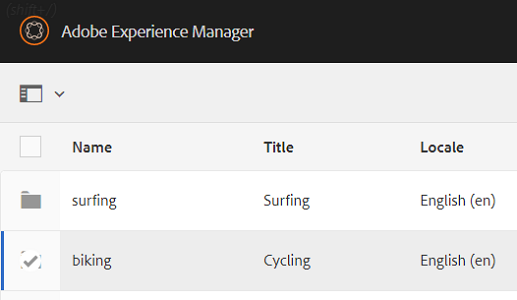
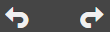
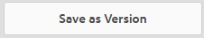

# Uw digitale middelen beheren {#managing-assets-with-the-touch-optimized-ui}

Lees meer over verschillende taken voor het beheer en bewerken van bedrijfsmiddelen die u kunt uitvoeren met de aanraakgeoptimaliseerde gebruikersinterface van AEM Assets.

Dit artikel beschrijft om activa te beheren en uit te geven gebruikend de Activa van de Manager van de Ervaring van Adobe (AEM) het Aanraakvlak-geoptimaliseerde gebruikersinterface. Voor een elementaire kennis over het gebruikersinterface, zie [Basis behandeling van Aanraking UI](/help/sites-authoring/basic-handling.md). Om de Fragmenten van de Inhoud te beheren, zie het [Leiden de activa van de Fragmenten](content-fragments-managing.md) van de Inhoud.

## Mappen maken {#create-folders}

Wanneer het organiseren van een inzameling van activa, bijvoorbeeld, kunnen alle `Nature` beelden, u omslagen tot stand brengen om hen samen te houden. U kunt omslagen gebruiken om uw activa te categoriseren en te organiseren. Voor AEM-bedrijfsmiddelen hoeft u geen bedrijfsmiddelen in mappen te organiseren om beter te kunnen werken.

>[!NOTE]
>
>* Het delen van een omslag van Activa van het type `sling:OrderedFolder` wordt niet gesteund wanneer het delen aan de Wolk van de Marketing. Als u een omslag wilt delen, selecteer niet Besteld wanneer het creëren van een omslag.
>* De Manager van de ervaring staat niet het gebruiken van `subassets` woord als naam van een omslag toe. Het is een sleutelwoord dat voor knoop wordt gereserveerd die subassets voor samengestelde activa bevatten.

1. Navigeer aan de plaats in uw digitale activaomslag waar u een nieuwe omslag wilt tot stand brengen.
1. Klik in het menu op **[!UICONTROL Maken]**. Selecteer **[!UICONTROL Nieuwe Omslag]**.
1. Op het gebied van de **[!UICONTROL Titel]** , verstrek een omslagnaam. Door gebrek, gebruikt DAM de titel die u als omslagnaam verstrekte. Zodra de omslag wordt gecreeerd, kunt u het gebrek met voeten treden en een andere omslagnaam specificeren.
1. Klik **[!UICONTROL creëren]**. Uw omslag wordt getoond in de digitale activaomslag.

De volgende (ruimte-gescheiden lijst van) karakters worden niet gesteund:

* de naam van het activadossier moet niet bevatten `* / : [ \ \ ] | # % { } ? &`
* de naam van de activaomslag mag niet bevatten `* / : [ \ \ ] | # % { } ? \" . ^ ; + & \t`

## Activa uploaden {#uploading-assets}

U kunt diverse types van activa (met inbegrip van beelden, Pdf- dossiers, RAW dossiers, etc.) van uw lokale omslag of een netwerkaandrijving aan Activa uploaden AEM.

>[!NOTE]
>
>Op Dynamische Media - de wijze Scene7, kunt u activa slechts uploaden de waarvan dossiergrootte 2 GB of minder is.

U kunt verkiezen om activa aan omslagen met of zonder een verwerkingsprofiel te uploaden dat aan hen wordt toegewezen.

Voor omslagen die een toegewezen verwerkingsprofiel hebben, verschijnt de profielnaam op de duimnagel in de kaartmening. In de lijstmening, verschijnt de profielnaam in de kolom van het Profiel van de **[!UICONTROL Verwerking]** . Zie Profielen [verwerken](processing-profiles.md).

Alvorens activa te uploaden, zorg ervoor dat het in een [gesteund formaat](assets-formats.md)is.

**Om activa** te uploaden:

1. In de het Webinterface van Activa, navigeer aan de plaats waar u digitale activa wilt toevoegen.
1. Om de activa te uploaden, doe één van het volgende:

   * Tik op de werkbalk op het pictogram **[!UICONTROL Aanmaken]** . Dan, op het menu, dan tik **[!UICONTROL Dossiers]**. U kunt het dossier in de voorgestelde dialoog anders noemen indien nodig.
   * In browser die HTML5 steunt, sleep direct de activa op de interface. De dialoog om dossier anders te noemen wordt niet getoond.
   

   Om veelvoudige dossiers te selecteren, druk de sleutel van CTRL/van het Bevel en selecteer de activa in de dialoog van de dossierplukker. Van een iPad, kunt u slechts één dossier tegelijkertijd selecteren.

   U kunt pauzeren het uploaden van grote activa (groter dan 500 MB) en het hervatten later van de zelfde pagina. Tik op het pictogram **[!UICONTROL Pauze]** naast de voortgangsbalk die wordt weergegeven wanneer het uploaden begint.

   

   De omvang waarboven een actief als een groot actief wordt beschouwd, is configureerbaar. Bijvoorbeeld, kunt u het systeem vormen om activa boven 1000 MB (in plaats van 500 MB) als grote activa te overwegen. In dit geval, verschijnt de knoop van de **[!UICONTROL Pauze]** in de vooruitgangsbar wanneer de activa van grootte groter dan 1000 MB worden geupload.

   De knop **[!UICONTROL Pauze]]**geeft niet aan of een bestand van meer dan 1000 MB is geüpload met een bestand van minder dan 1000 MB. Nochtans, als u het minder dan 1000 MB dossier annuleert uploadt, verschijnt de knoop van de**[!UICONTROL Pauze ]**.

   Om de groottegrens te wijzigen, vorm het `chunkUploadMinFileSize` bezit van de `fileupload`knoop in de bewaarplaats CRX.

   Wanneer u het pictogram van de **[!UICONTROL Pauze]** klikt, knevels het aan een pictogram van het **[!UICONTROL Spel]** . Om het uploaden te hervatten, klik het pictogram van het **[!UICONTROL Spel]** .

   

   Om aan de gang zijnde te annuleren upload, klik de `X` knoop naast de vooruitgangsbar. Wanneer u annuleert uploadt verrichting, schrapt de Activa AEM het gedeeltelijk geuploade gedeelte van de activa.

   De capaciteit om het uploaden te hervatten is vooral nuttig in laag-bandbreedtescenario&#39;s en netwerkglitches, waar het een lange tijd vergt om grote activa te uploaden. U kunt pauzeren uploadt verrichting en verdergaat later wanneer de situatie verbetert. Wanneer u hervat, begint het uploaden vanaf het punt waar u het pauzeerde.

   Tijdens het uploaden slaat AEM de delen van het bedrijfsmiddel op die worden geüpload als stukjes gegevens in de CRX-opslagplaats. Wanneer het uploaden is voltooid, consolideert AEM deze bestanden in één gegevensblok in de repository.

   Ga naar om de opschoningstaak te configureren voor de onvoltooide brok die taken uploadt. `https://[aem_server]:[port]/system/console/configMgr/org.apache.sling.servlets.post.impl.helper.ChunkCleanUpTask`Ga naar.

   Als u activa met de zelfde naam zoals die van activa uploadt reeds beschikbaar bij de plaats waar u de activa uploadt, wordt een waarschuwingsdialoog getoond.

   U kunt verkiezen om bestaande activa te vervangen, een andere versie tot stand te brengen, of allebei te houden door de nieuwe activa anders te noemen die worden geupload. Als u bestaande activa vervangt, worden de meta-gegevens voor de activa en om het even welke vroegere wijzigingen en geschiedenis (bijvoorbeeld annotaties, gewassen, etc.) geschrapt. Als u verkiest om beide activa te houden, wordt de nieuwe activa anders genoemd.

   

   >[!NOTE]
   >
   >Wanneer uitgezocht u **[!UICONTROL vervangt]** in de de dialoogdoos van het Conflict **[!UICONTROL van de]** Naam, wordt activaidentiteitskaart geregenereerd voor de nieuwe activa. Deze identiteitskaart is verschillend van identiteitskaart van het vorige actief.
   >
   >Als de Inzichten **[!UICONTROL van]** Activa wordt toegelaten om indrukken/kliks met de Analyse van Adobe te volgen, maakt deze geregenereerde activaidentiteitskaart de gegeven-gevangen voor de activa op de Analyse van Adobe ongeldig.

   Als de activa u uploadt in activa AEM bestaat, waarschuwt de **[!UICONTROL Duplicaten Ontdekte]** dialoogdoos dat u probeert om dubbele activa te uploaden. De dialoog verschijnt slechts als SHA 1 controlesomwaarde van het binaire getal van de bestaande activa de controlesomwaarde van de activa aanpast u uploadt. In dit geval zijn de namen van de activa niet relevant. Met andere woorden, kan de dialoog zelfs voor activa verschijnen die verschillende namen hebben als SHA 1 de waarden voor hun binaire getallen het zelfde zijn.

   >[!NOTE]
   >
   >De **[!UICONTROL Duplicaten ontdekte]** dialoog verschijnt slechts wanneer de **[!UICONTROL Dubbele eigenschap van de Opsporing]** wordt toegelaten. Om de **[!UICONTROL Dubbele eigenschap van de Opsporing]** toe te laten, zie het [Toelaten van Dubbele Opsporing](duplicate-detection.md).

   

   Tik op **[!UICONTROL Houd]** de dubbele waarde in AEM-bedrijfsmiddelen te behouden. Tik op **[!UICONTROL Verwijderen]** om het dubbele element te verwijderen dat u hebt geüpload.

   Met AEM-elementen kunt u geen elementen met verboden tekens in de bestandsnamen uploaden. Als u probeert om activa te uploaden die de verboden karakters omvatten, toont de Activa van AEM een waarschuwingsbericht betreffende de aanwezigheid van verboden karakters in filename en houdt tegen uploadt tot u deze karakters verwijdert of met een toegestane naam uploadt.

   Om specifieke dossier het noemen overeenkomsten voor uw organisatie aan te passen, laat de **[!UICONTROL Upload de dialoogdoos van Activa]** u lange namen voor de dossiers specificeren die u uploadt.

   

   De volgende (spatie-gescheiden lijst van) karakters worden echter niet gesteund:
   * de naam van het activadossier moet niet bevatten `* / : [ \ \ ] | # % { } ? &`
   * de naam van de activaomslag mag niet bevatten `* / : [ \ \ ] | # % { } ? \" . ^ ; + & \t`
   Bovendien toont de interface van Activa de meest recente activa die u uploadt of de omslag u eerst in alle meningen (de mening **[!UICONTROL van de]** Kaart, de mening **[!UICONTROL van de]** Lijst, en de mening **[!UICONTROL van de]** Kolom) creeert.

   Vaak, terwijl het uploaden van grote activa of veelvoudige activa gelijktijdig, laten de visuele indicatoren u toe om de vooruitgang te beoordelen. In het dialoogvenster Voortgang **[!UICONTROL uploaden]** wordt de telling van de bestanden weergegeven die met succes zijn geüploade en de bestanden die niet zijn geüpload.

   

   Als u het uploaden annuleert alvorens de dossiers worden geupload, houdt de Activa van AEM op uploadend het huidige dossier en verfrist de inhoud. Nochtans, worden de dossiers die reeds worden geupload niet geschrapt.

### Seriële uploads {#serial-uploads}

Het uploaden van talrijke activa in bulk verbruikt significante systeemmiddelen, die de prestaties van uw plaatsing van AEM negatief kunnen beïnvloeden. Potentiële knelpunten kunnen uw verbinding van Internet zijn, lees-schrijf verrichtingen op schijf, Webbrowser beperkingen op het aantal POST- verzoeken op gezamenlijke activa uploaden. Bulk uploadt verrichting kan ontbreken of voortijdig eindigen. Met andere woorden, kunnen de activa van AEM sommige dossiers missen terwijl het opnemen van een bos van dossiers of helemaal er niet in slagen om het even welk dossier in te nemen.

Om deze situatie te overwinnen, neemt de Activa van AEM tegelijkertijd één activa (serie upload) tijdens een bulkupload verrichting op, in plaats van het tegelijkertijd innemen van alle activa.

Het periodieke uploaden van activa wordt toegelaten door gebrek. Om de eigenschap onbruikbaar te maken en het gezamenlijke uploaden toe te staan, bedek de `fileupload` knoop in CRXDe en plaats de waarde van het `parallelUploads` bezit aan `true`.

### Upload activa gebruikend FTP {#uploading-assets-using-ftp}

De dynamische Media laat partij toe uploadend van activa als server van FTP. Als u van plan bent grote activa (>1 GB) te uploaden of volledige omslagen en subfolders te uploaden, zou u FTP moeten gebruiken. U kunt zelfs opstellingsFTP uploaden om op een terugkomende geplande basis voor te komen.

>[!NOTE]
>
>Op Dynamische Media - de wijze Scene7, kunt u activa slechts uploaden de waarvan dossiergrootte 2 GB of minder is.

>[!NOTE]
>
>Om activa als FTP in Dynamische Media te uploaden - de wijze Scene7 installeert eigenschappak (FP) 18912 op auteur AEM. De Steun van Adobe van het contact om toegang tot FP-18912 te krijgen en de opstelling van uw rekening van FTP te voltooien. Zie [Functiepakket 18912 installeren voor migratie](/help/assets/bulk-ingest-migrate.md)van bulkmiddelen.
Als u FTP voor het uploaden van activa gebruikt, upload worden de montages die in AEM worden gespecificeerd genegeerd. In plaats daarvan, worden de regels van de dossierverwerking, zoals die in Dynamische Klassieke Media worden bepaald, gebruikt.

**Om activa te uploaden gebruikend FTP**

1. Gebruikend uw keus van de cliënt van FTP, login aan de server van FTP gebruikend de de gebruikersnaam en wachtwoord van FTP die u van de leveringse-mail ontving. In de cliënt van FTP, upload dossiers of omslagen aan de server van FTP.
1. [Meld u aan bij Dynamic Media Classic](https://www.adobe.com/marketing-cloud/experience-manager/scene7-login.html) met behulp van referenties die u hebt ontvangen van de e-mail met provisioning. Voor de Globale Bar van de Navigatie, **[!UICONTROL uploadt de kraan]**.

1. Voor de **[!UICONTROL Upload]** pagina, dichtbij de upper-left hoek, tik de **[!UICONTROL Via FTP]** tabel.
1. Voor de linkerkant van de pagina, kies een omslag van FTP om dossiers van te uploaden; op de rechterkant van de pagina, kies een bestemmingsomslag.
1. In de buurt van de rechterbenedenhoek van de pagina tikt u op **[!UICONTROL Taakopties]** en stelt u vervolgens de gewenste opties in op basis van de elementen in de geselecteerde map.

   Zie Taakopties [uploaden](#upload-job-options).

   >[!NOTE]
   >
   >Wanneer u activa als FTP uploadt, upload de baanopties u in Dynamische Klassieke Media (Scene7) plaatst belangrijkheid over de parameters van de activaverwerking die in AEM worden geplaatst.

1. Klik in de rechterbenedenhoek van het dialoogvenster **[!UICONTROL Taakopties]** uploaden op **[!UICONTROL Opslaan]**.
1. In de laag-juiste hoek van de **[!UICONTROL Upload]** pagina, **[!UICONTROL legt de kraan Upload]** voor.

   Om de vooruitgang van te bekijken uploadt, op de Globale Bar van de Navigatie, de **[!UICONTROL Banen]** van de kraan. De **[!UICONTROL pagina van Banen]** toont de vooruitgang van upload. U kunt blijven werkend in AEM en aan de pagina van Banen in Dynamische Klassieke Media terugkeren om een lopende baan te herzien.

   Als u wilt annuleren dat een uploadtaak wordt uitgevoerd, tikt u op **[!UICONTROL Annuleren]** naast de **[!UICONTROL duur]** van de taak.

#### Taakopties uploaden {#upload-job-options}

| Optie voor uploaden | Suboptie | Beschrijving |
|---|---|---|
| Taaknaam |  | De standaardnaam die in het tekstgebied vooraf wordt ingevuld omvat het gebruiker-binnengegaane gedeelte van de naam en de datum-en-tijdzegel. U kunt de standaardnaam gebruiken of een naam van uw eigen verwezenlijking ingaan voor dit uploadt baan.  De baan en andere upload en het publiceren banen worden geregistreerd op de pagina van Banen, waar u de status van banen kunt controleren. |
| Publiceren na uploaden |  | publiceert automatisch de activa die u uploadt. |
| Beschrijf in om het even welke omslag, de zelfde naam van basisactiva ongeacht uitbreiding |  | Selecteer deze optie als u de dossiers wilt uploaden u bestaande dossiers met de zelfde namen vervangen. De naam van deze optie zou kunnen verschillend zijn, afhankelijk van de montages in de Opstelling **[!UICONTROL van de]** Toepassing > **[!UICONTROL Algemene Montages]** > **[!UICONTROL Upload aan Toepassing]** > **[!UICONTROL beschrijft Beelden]**. |
| De dossiers van het PIT of van de TAR van de decompressie op upload |  |  |
| Taakopties |  | Taaktekst/ klik op **[!UICONTROL Taakopties]** om het dialoogvenster [!UICONTROL Taakopties] uploaden te openen en opties te kiezen die van invloed zijn op de volledige upload taak. Deze opties zijn het zelfde voor alle dossiertypes. U kunt standaardopties kiezen om dossiers te uploaden die op de pagina van de Montages van de Toepassing beginnen Algemene. Om deze pagina te openen, verkies **[!UICONTROL Opstelling]** > de Opstelling **[!UICONTROL van de]** Toepassing. Tik op de knop **[!UICONTROL Standaardopties]** uploaden om het dialoogvenster [!UICONTROL Taakopties] uploaden te openen. |
|  | Wanneer | Selecteer Eenmalig of Terugkomend. Om een terugkomende baan te plaatsen, verkies een Herhaling optie-Dagelijks, Wekelijks, Maandelijks, of Douane-om te specificeren wanneer u FTP wilt herstellen uploadt baan. Dan specificeer zonodig de het plannen opties. |
|  | Inclusief submappen | Upload alle subfolders binnen de omslag u van plan bent te uploaden. De namen van de omslag en zijn subfolders u uploadt zijn automatisch ingegaan in activa AEM. |
|  | Gewasopties | Om van de kanten van een beeld manueel te bebouwen, selecteer het menu van het Gewas en kies Handboek. Dan ga het aantal pixel aan gewas van om het even welke kant of elke kant van het beeld in. Hoeveel van het beeld wordt bebouwd hangt van ppi (pixel per duim) af plaatsend in het beelddossier. Bijvoorbeeld, als de beeldvertoningen 150 ppi en u 75 in de Hoogste, Juiste, Bodem, en Linker tekstvakjes ingaat, wordt een halve duim bebouwd van elke kant.  Om wit-ruimte pixel van een beeld automatisch te bebouwen, open het menu van het Gewas, verkies Handboek, en ga pixelmetingen in de Hoogste, Juiste, Bodem, en Linkergebieden aan gewas van de kanten in. U kunt de Versiering op het menu van het Gewas ook kiezen en deze opties kiezen:  **Trim weg op basis van** <ul><li>**Kleur** - kies de optie van de Kleur. Dan selecteer het menu van de Hoek en kies de hoek van het beeld met de kleur die het best de wit-ruimtekleur vertegenwoordigt u wilt bebouwen.</li><li>**Transparantie** - Kies de optie Transparantie.  **Tolerantie** - Sleep de schuif om een tolerantie van 0 door 1 te specificeren.Voor het in orde maken gebaseerd op kleur, specificeer 0 aan gewassenpixel slechts als zij precies de kleur aanpassen u in de hoek van het beeld selecteerde. De aantallen dichter aan 1 staan voor meer kleurenverschil toe. Voor het in orde maken die op transparantie wordt gebaseerd, specificeer 0 aan gewassenpixel slechts als zij transparant zijn. De aantallen dichter aan 1 staan voor meer transparantie toe.</li></ul> Merk op dat deze gewassenopties niet destructief zijn. |
|  | Opties voor kleurenprofiel | Kies een kleurenomzetting wanneer u geoptimaliseerde dossiers creeert die voor levering worden gebruikt:<ul><li>Standaardkleurbehoud: Handhaaft de bronbeeldkleuren wanneer de beelden de informatie van de kleurenruimte bevatten; er is geen kleurconversie. Bijna hebben alle beelden vandaag reeds het aangewezen kleurenprofiel ingebed. Nochtans, als een CMYK bronbeeld geen ingebed kleurenprofiel bevat, worden de kleuren omgezet in sRGB (standaard Rood Groen Blauw) kleurenruimte. sRGB is de geadviseerde kleurenruimte voor het tonen van beelden op Web-pagina&#39;s.</li><li>Originele kleurruimte behouden: Behoudt de originele kleuren zonder enige kleurenomzetting op het punt. Voor beelden zonder een ingebed kleurenprofiel, wordt om het even welke kleurenomzetting gedaan gebruikend de standaardkleurenprofielen die in de Publish montages worden gevormd. De kleurenprofielen kunnen zich niet op de kleur in de dossiers richten die met deze optie worden gecreeerd. Daarom wordt u aangemoedigd om de optieStandaardBehoud van de Kleur te gebruiken.</li><li>De douane van > aan  opent menu&#39;s zodat kunt u een Bekeerling van kiezen en in kleurenruimte omzetten. Deze geavanceerde optie treedt om het even welke kleureninformatie met voeten die in het brondossier wordt ingebed. Selecteer deze optie wanneer alle afbeeldingen die u indient, onjuiste of ontbrekende gegevens van het kleurenprofiel bevatten.</li></ul> |
|  | Opties voor afbeeldingsbewerking | U kunt de het knippen maskers in beelden bewaren, en een kleurenprofiel kiezen.  Zie Opties voor [afbeeldingsbewerking instellen tijdens uploaden](#setting-image-editing-options-at-upload). |
|  | Opties voor postscript | U kunt rasterize de dossiers van PostScript®, gewassendossiers, handhaven transparante achtergronden, een resolutie kiezen, en een kleurenruimte kiezen.  Zie Opties [Plaatsen PostScript en Illustrator uploaden opties](#setting-postscript-and-illustrator-upload-options). |
|  | Photoshop-opties | U kunt malplaatjes van de dossiers van Adobe® creëren Photoshop®, lagen handhaven, specificeren hoe de lagen worden genoemd, tekst halen, en specificeren hoe de beelden in malplaatjes worden verankerd.  Merk op dat de malplaatjes niet in AEM worden gesteund.  Zie [Plaatsende Photoshop uploadopties](#setting-photoshop-upload-options). |
|  | PDF-opties | U kunt rasterize de dossiers, halen onderzoekswoorden en verbindingen, auto-produceren een eCatalog, de resolutie plaatsen, en een kleurenruimte kiezen.  Merk op dat eCatalogs niet in AEM worden gesteund.   Zie Opties [voor](#setting-pdf-upload-options)PDF-uploaden instellen. |
|  | Illustrator-opties | U kunt rasterize de dossiers van Adobe Illustrator®, transparante achtergronden handhaven, een resolutie kiezen, en een kleurenruimte kiezen.  Zie Opties [Plaatsen PostScript en Illustrator uploaden opties](#setting-postscript-and-illustrator-upload-options). |
|  | EVideo-opties | U kunt een videodossier transcoderen door een Video te kiezen vooraf instelt.  Zie Opties [voor eVideo-upload instellen](#setting-evideo-upload-options). |
|  | Voorinstellingen voor batchset | Om een Reeks van het Beeld, of Rotatie te creëren die van de geuploade dossiers wordt geplaatst, klik de Actieve kolom voor vooraf ingesteld u wilt gebruiken. U kunt meer dan één vooraf ingesteld selecteren. U creeert vooraf instelt in de Opstelling van de Toepassing/de Reeks van de Partij stelt pagina van Dynamische Klassieke Media vooraf in.  Zie [het Vormen de Reeks van de Partij vooraf instelt om de Reeksen van het Beeld en de Reeksen](config-dms7.md#creating-batch-set-presets-to-auto-generate-image-sets-and-spin-sets) van de Rotatie auto-te produceren om meer te leren over het creëren van partijreeks vooraf instelt.  Zie de [Plaatsende Reeks van de Partij vooraf instelt bij upload](#setting-batch-set-presets-at-upload). |

#### Stel opties voor afbeeldingsbewerking in op upload {#setting-image-editing-options-at-upload}

Wanneer het uploaden van beelddossiers, met inbegrip van AI, EPS, en Psd- dossiers, kunt u de volgende het uitgeven acties in het de dialoogvakje van de Opties van de Baan van de **[!UICONTROL Upload]** ondernemen:

* De witte ruimte van het gewas van de rand van beelden (zie beschrijving in lijst hierboven).
* Het gewas manueel van de kanten van beelden (zie beschrijving in lijst hierboven).
* Kies een kleurenprofiel (zie de optiesbeschrijving in lijst hierboven).
* Creeer een masker van een het knippen weg.
* Scherpe afbeeldingen met opties voor onscherp maskeren
* Achtergrond kennis

| Optie | Suboptie | Beschrijving |
|---|---|---|
| Masker maken van knippad |  | Creeer een masker voor het beeld dat op zijn het knippen weginformatie wordt gebaseerd. Deze optie is op beelden van toepassing die met beeld-uitgevende toepassingen worden gecreeerd waarin een het knippen weg werd gecreeerd. |
| Onscherp maskeren |  | Laat u verfijnen een het scherpen filtereffect op het definitieve gedownsampling beeld, dat de intensiteit van het effect, de straal van het effect (zoals gemeten in pixel) controleert, en een drempel van contrast dat wordt genegeerd.  Dit effect gebruikt de zelfde opties zoals de filter van het Masker van Photoshop Unsharp. In tegenstelling tot wat de naam voorstelt, is het Masker Unsharp een het scherpen filter. Stel onder Onscherp maskeren de gewenste opties in. De plaatsende opties worden beschreven in het volgende: |
|  | Bedrag | Controleert de hoeveelheid contrast dat wordt toegepast op randpixel.  Zie het als de intensiteit van het effect. Het belangrijkste verschil tussen de waardewaarden van het Masker Unsharp in Dynamische Media en de waardewaarden in Adobe Photoshop, is dat Photoshop een waardewaaier van 1% tot 500% heeft. Terwijl, in Dynamische Media, de waardewaaier 0.0 tot 5.0 is. Een waarde van 5.0 is het ruwe equivalent van 500% in Photoshop; een waarde van 0 , 9 is het equivalent van 90 % , etc. |
|  | Radius | Controleert de straal van het effect. De waardewaaier is 0-250.  Het effect wordt in werking gesteld op alle pixel in een beeld en straalt uit van alle pixel in alle richtingen uit. De straal wordt gemeten in pixel. Bijvoorbeeld, om een gelijkaardig het scherpen effect voor een 2000 x 2000 pixelbeeld en 500 x 500 pixelbeeld te krijgen, zou u een straal van twee pixel op het 2000 x 2000 pixelbeeld en een straalwaarde van één pixel op het 500 x 500 pixelbeeld plaatsen. Een grotere waarde wordt gebruikt voor een beeld dat meer pixel heeft. |
|  | Drempel | De drempel is een waaier van contrast dat wordt genegeerd wanneer de filter van het Masker Unsharp wordt toegepast. Het is belangrijk zodat geen &quot;lawaai&quot;aan een beeld wordt geïntroduceerd wanneer deze filter wordt gebruikt. De waardewaaier is 0-255, die het aantal helderheidsstappen in een grayscale beeld is. 0=zwart, 128=50% grijs en 255=wit.  Bijvoorbeeld, negeert een drempelwaarde van 12 lichte variaties de helderheid van de huidtoon om het toevoegen van lawaai te vermijden, maar voegt randcontrast aan contrasterende gebieden zoals nog toe waar de wimpers huid ontmoeten.  Bijvoorbeeld, als u een foto van iemands gezicht hebt, beïnvloedt het Masker Unsharp de contrasterende delen van het beeld, zoals waar de wimpers en de huid samenkomen om tot een duidelijk gebied van contrast, en de vlotte huid zelf te leiden. Zelfs de gladste huid vertoont subtiele veranderingen in helderheidswaarden. Als u geen drempelwaarde gebruikt, accentueert de filter deze subtiele veranderingen in huidpixel. Op zijn beurt, wordt een lawaai en een ongewenst effect gecreeerd terwijl het contrast op de wimpers wordt verhoogd, verbeterend scherpte.  Om deze kwestie te vermijden, wordt een drempelwaarde geïntroduceerd die de filter vertelt om pixel te negeren die niet dramatisch, zoals vlotte huid veranderen.  In de afbeelding met ritssluiting die eerder is weergegeven, bemerkt u de structuur naast de ritssluitingen. Het lawaai van het beeld wordt tentoongesteld omdat de drempelwaarden te laag waren om het lawaai te onderdrukken. |
|  | Monochroom | Selecteer aan unsharp-mask beeldhelderheid (intensiteit).  Schrap aan unsharp-mask elke kleurencomponent afzonderlijk. |
| Achtergrond kennis |  | Verwijdert automatisch de achtergrond van een beeld wanneer u het uploadt. Deze techniek is nuttig om aandacht aan een bepaald voorwerp te vestigen en het van een bezige achtergrond te maken opvallen. Selecteer om de eigenschap van de Achtergrond van de Knockout en de volgende subopties toe te laten of &quot;aan te zetten&quot;: |
|  | Hoek | Vereist.  De hoek van het beeld dat wordt gebruikt om de achtergrondkleur te bepalen aan knockout.  U kunt van **Bovenkant links**, **Linker** Bodem, **Bovenrecht**, of **Rechts** van de Bodem kiezen. |
|  | Vulmethode | Vereist.  Controleert pixeltransparantie van de plaats van de Hoek die u plaatst.  U kunt van de volgende vullingsmethodes kiezen: <ul><li>**De Vulling** van het bloed - draait alle pixel transparant die de Hoek aanpassen die u hebt gespecificeerd en met het verbonden.</li><li>**Pixel** van de gelijke - draait alle passende pixel transparant, ongeacht hun plaats op het beeld.</li></ul> |
|  | Tolerantie | Optioneel.  Controleert de toelaatbare hoeveelheid variatie in pixelkleur aanpassing die op de plaats van de Hoek wordt gebaseerd die u plaatst.  Gebruik een waarde van 0.0 om pixelkleuren precies aan te passen of, gebruik een waarde van 1.0 om voor de grootste variatie toe te staan. |

#### Opties voor PostScript- en Illustrator-upload instellen {#setting-postscript-and-illustrator-upload-options}

Wanneer u PostScript (EPS) of Illustrator (AI) beelddossiers uploadt, kunt u hen op diverse manieren formatteren. U kunt rasterize de dossiers, de transparante achtergrond handhaven, een resolutie kiezen, en een kleurenruimte kiezen. De opties voor het formatteren van PostScript en de dossiers van de Illustrator zijn beschikbaar in de Upload de dialoogdoos van de Opties van de Baan onder de Opties van PostScript en de Opties van de Illustrator.

| Optie | Suboptie | Beschrijving |
|---|---|---|
| Verwerking |  | Verkies **[!UICONTROL Rasterize]** om vectorgrafiek in het dossier in het bitmap formaat om te zetten. |
| Transparante achtergrond behouden in gerenderde afbeelding |  | Handhaaf de achtergrondtransparantie van het dossier. |
| Resolutie |  | Bepaalt resolutie het plaatsen. Dit het plaatsen bepaalt hoeveel pixel per duim in het dossier worden getoond. |
| Kleurruimte |  | Selecteer het menu van de Ruimte van de Kleur en kies van de volgende opties van de kleurenruimte: |
|  | Automatisch detecteren | Behoudt de kleurenruimte van het dossier. |
|  | Afdwingen als RGB | Zet in de RGB kleurenruimte om. |
|  | Krachten als CMYK | Zet in de CMYK kleurenruimte om. |
|  | Kracht als grayscale | Zet in de grayscale kleurenruimte om. |

#### Opties voor Photoshop-upload instellen {#setting-photoshop-upload-options}

De dossiers van PSD (het Document van Photoshop) worden het vaakst gebruikt om beeldmalplaatjes tot stand te brengen. Wanneer u een Psd- dossier uploadt, kunt u een beeldmalplaatje automatisch van het dossier tot stand brengen (selecteer de Create optie van het Malplaatje op het Upload scherm).

De dynamische Media leiden tot veelvoudige beelden van een Psd- dossier met lagen als u het dossier gebruikt om een malplaatje te creëren; het leidt tot één beeld voor elke laag.

Gebruik de hierboven beschreven Opties **[!UICONTROL van het]** Gewas en de Opties **[!UICONTROL van het Profiel van de]** Kleur, met Photoshop uploadt opties.

>[!NOTE]
>
>De malplaatjes worden niet gesteund in AEM.

| Optie | Suboptie | Beschrijving |
|---|---|---|
| Lagen behouden |  | Ript de lagen in PSD, als om het even welk, in individuele activa. De activalagen blijven verbonden aan PSD. U kunt hen bekijken door het Psd- dossier in detail te openen bekijkt en het laagpaneel te selecteren. |
| Template maken |  | Creeert een malplaatje van de lagen in het Psd- dossier. |
| Tekst extraheren |  | Trekt de tekst uit zodat de gebruikers naar tekst in een Kijker kunnen zoeken. |
| Lagen uitbreiden naar achtergrondgrootte |  | Breidt de grootte van geknipte beeldlagen tot de grootte van de achtergrondlaag uit. |
| Laagnamen |  | De lagen in het Psd- dossier worden geupload als afzonderlijke beelden. |
|  | Laagnaam | Namen de beelden na hun laagnamen in het Psd- dossier. Bijvoorbeeld, wordt een laag genoemd de Markering van de Prijs in het oorspronkelijke Psd- dossier een beeld genoemd Prijsmarkering. Nochtans, als de laagnamen in het Psd- dossier standaardPhotoshop laagnamen (Achtergrond, Laag 1, Laag 2, etc.) zijn, worden de beelden genoemd na hun laagaantallen in het Psd- dossier, niet hun standaardlaagnamen. |
|  | Photoshop- en laagnummer | Namen de beelden na hun laagaantallen in het Psd- dossier, negerend originele laagnamen. De beelden worden genoemd met filename Photoshop en een toegevoegd laagaantal. Bijvoorbeeld, wordt de tweede laag van een dossier genoemd Lente Ad.psd. genoemd Lente Ad_2 zelfs als het een niet-standaardnaam in Photoshop had. |
|  | Naam Photoshop en laag | Namen de beelden na het Psd- dossier dat door de laagnaam of het laagaantal wordt gevolgd. Het laagaantal wordt gebruikt als de laagnamen in het Psd- dossier standaardPhotoshop laagnamen zijn. Bijvoorbeeld, wordt een laag genoemd de Markering van de Prijs in een Psd- dossier genoemd SpringAd genoemd Lente Ad_Price Markering. Een laag met de standaardnaamLaag 2 wordt genoemd Lente Ad_2. |
| Anker |  | Specificeer hoe de beelden in malplaatjes worden verankerd die van de gelaagde samenstelling worden geproduceerd die uit het Psd- dossier wordt geproduceerd. Door gebrek, is het anker het centrum. Een centrumanker staat vervangingsbeelden toe om de zelfde ruimte, geen kwestie de aspectverhouding van het vervangingsbeeld het best te vullen. De beelden met een verschillend aspect dat dit beeld vervangt, wanneer het van verwijzingen voorzien van het malplaatje en het gebruiken van parametersubstitutie, bezetten effectief de zelfde ruimte. Verandering in het verschillende plaatsen als uw toepassing de vervangingsbeelden vereist om de toegewezen ruimte in het malplaatje te vullen. |

#### Opties voor PDF-upload instellen {#setting-pdf-upload-options}

Wanneer u een Pdf- dossier uploadt, kunt u het op diverse manieren formatteren. U bebouwt zijn pagina&#39;s, haalt onderzoekswoorden, gaat een pixel-per-duim resolutie in, en kiest een kleurenruimte. De dossiers PDF bevatten vaak een versieringsmarge, gewassentekens, registratietekens, en de tekens van andere printer. U kunt deze tekens van de kanten van pagina&#39;s bebouwen aangezien u een Pdf- dossier uploadt.

>[!NOTE]
>
>eCatalogs worden niet gesteund in AEM.

Kies uit de volgende opties:

| Optie | Suboptie | Beschrijving |
|---|---|---|
| Verwerking | Rasterize | (Gebrek) Ript de pagina&#39;s in het Pdf- dossier en zet vectorgrafiek in bitmap beelden om. Kies deze optie om een eCatalog tot stand te brengen. |
| Extract | Zoekwoorden | Extracteert woorden uit het Pdf- dossier zodat het dossier door sleutelwoord in een eCatalogKijker kan worden gezocht. |
|  | Koppelingen | Trekt verbindingen van de Pdf- dossiers af en bedekt hen aan de Kaarten van het Beeld die in een eCatalogKijker worden gebruikt. |
| Automatisch eCatalog van veelvoudige pagina PDF produceren |  | Automatisch een eCatalog van het Pdf- dossier tot stand brengen. De eCatalog wordt genoemd na het Pdf- dossier u uploadde. (Deze optie is slechts beschikbaar als u rasterize het Pdf- dossier aangezien u het uploadt.) |
| Resolutie |  | Bepaalt resolutie het plaatsen. Dit het plaatsen bepaalt hoeveel pixel per duim in het Pdf- dossier worden getoond. Het gebrek is 150. |
| Kleurruimte |  | Selecteer het menu Kleurruimte en kies een kleurruimte voor het PDF-bestand. De meeste Pdf- dossiers hebben zowel RGB als CMYK kleurenbeelden. De RGB kleurenruimte is verkieslijk voor online het bekijken. |
|  | Automatisch opsporen | Behoudt de kleurenruimte van het Pdf- dossier. |
|  | Afdwingen als RGB | Zet in de RGB kleurenruimte om. |
|  | Kracht als CMYK | Zet in de CMYK kleurenruimte om. |
|  | Kracht als grayscale | Zet in de grayscale kleurenruimte om. |

#### Opties voor eVideo-upload instellen {#setting-evideo-upload-options}

U kunt een videodossier transcoderen door van een verscheidenheid van video te kiezen vooraf instelt.

| Optie | Suboptie | Beschrijving |
|---|---|---|
| Adaptieve video |  | Één enkele het coderen vooraf ingesteld die met om het even welke aspectverhouding werkt om video&#39;s tot stand te brengen voor levering aan mobiel, tablet, en Desktop. Geüploade bronvideo&#39;s die met deze voorinstelling zijn gecodeerd, worden ingesteld met een vaste hoogte. Nochtans, de breedteschalen automatisch om de aspectverhouding van de video te bewaren.  De beste praktijken moeten het Aanpassings Video coderen gebruiken. |
| Enige het Coderen stelt vooraf in | Incodering sorteren Voorinstellingen | Selecteer Naam of Grootte om het coderen te sorteren vooraf instelt vermeld onder Desktop, Mobiel, en Tablet door naam of door resolutiegrootte. |
|  | Desktop | Maak een MP4-bestand om een streaming- of progressieve videobeleving te bieden aan desktopcomputers.Selecteer een of meer beeldverhoudingen met de gewenste resolutie- en doelgegevenssnelheid. |
|  | Mobiel | Creeer een MP4 dossier voor levering op iPhone of de mobiele apparaten van Android.Selecteer één of meerdere aspectverhoudingen met de resolutiegrootte en het tarief van doelgegevens u wenst. |
|  | Tablet | Maak een MP4-bestand voor levering op iPad- of Android-tabletapparaten.Selecteer een of meer beeldverhoudingen met de gewenste resolutie- en doelgegevenssnelheid. |

#### De vastgestelde Reeks van de Partij stelt bij upload vooraf in {#setting-batch-set-presets-at-upload}

Als u een Reeks van het Beeld wilt automatisch tot stand brengen of die van geuploade beelden centreert, klik **[!UICONTROL Actieve** kolom voor vooraf ingesteld u wilt gebruiken. U kunt meer dan één vooraf ingesteld selecteren.

Zie [het Vormen de Reeks van de Partij vooraf instelt om de Reeksen van het Beeld en de Reeksen](config-dms7.md#creating-batch-set-presets-to-auto-generate-image-sets-and-spin-sets) van de Rotatie auto-te produceren om meer te leren over het creëren van partijreeks vooraf instelt.

### Gestroomde uploads {#streamed-uploads}

Als u vele activa uploadt, stijgt de I/O vraag aan de server AEM drastisch, die uploadt efficiency vermindert en kan het zelfs aan tijd uit veroorzaken. AEM Assets ondersteunt gestreamde uploadtaken van bedrijfsmiddelen. Gestroomd uploaden vermindert de I/O van de schijf tijdens het uploaden door opslag van bedrijfsmiddelen in een tijdelijke omslag op de server te vermijden alvorens het te kopiëren aan de bewaarplaats. In plaats daarvan wordt het gegeven rechtstreeks naar de bewaarplaats overgebracht. Deze manier, wordt de tijd om grote activa te uploaden en de mogelijkheid van onderbrekingen verminderd. De gestreamde upload wordt standaard ingeschakeld in AEM Assets.

Het stromen upload is gehandicapt voor AEM die op server JEE loopt met servlet-api versie minder dan 3.1.

### ZIP-archief met elementen extraheren {#extract-zip-archive-containing-assets}

U kunt ZIP-archieven net als andere ondersteunde elementen uploaden. De zelfde dossier - noem regels zijn op de dossiers van het PIT van toepassing. AEM staat u toe om een archief van het PIT aan een plaats te halen DAM.

Selecteer één archief van het PIT tegelijkertijd, klik het Archief **[!UICONTROL van het]** Uittreksel, en selecteer een bestemmingsomslag. Selecteer een optie om eventuele conflicten te behandelen. Als de activa in het dossier van het PIT reeds in de bestemmingsomslag bestaan, kunt u één van deze opties selecteren: overslaan de extractie, vervangen bestaande dossiers, houden beide activa door anders te noemen, of creëren nieuwe versie.

Nadat de extractie volledig is, deelt AEM u in het berichtgebied mee. Terwijl AEM het PIT haalt, kunt u terug naar uw werk zonder de extractie te onderbreken.

Sommige beperkingen van de eigenschap zijn:

* Als een omslag door de zelfde naam bij de bestemming bestaat, worden de activa van het dossier van het PIT gehaald in de bestaande omslag.

* Als u de extractie annuleert, worden de reeds gewonnen activa niet geschrapt.

* U kunt niet twee dossiers van het PIT tezelfdertijd selecteren en hen halen. U kunt slechts één archief van het PIT tegelijkertijd halen.

## Voorbeeld van elementen {#previewing-assets}

Zie ook [Previewing de Dynamische Middelen van Media.](previewing-assets.md)

**Aan voorproefactiva**:

1. Van de Activa UI, navigeer aan de plaats van de activa u aan voorproef wilt.
1. Tik op het gewenste element om het te openen.

1. Op de voorproefwijze, zijn de gezoemopties beschikbaar voor de [gesteunde types](assets-formats.md#supported-raster-image-formats) van Beeld (met het interactieve uitgeven).

   Om in activa te zoemen, tik **[!UICONTROL +]** (of tik het vergrootglas op de activa). Om uit te zoomen, tik **[!UICONTROL -]**. Wanneer u binnen zoemt, kunt u dicht bij om het even welk gebied van het beeld kijken door te pannen. De pijl van het Gezoem van het **[!UICONTROL Terugstellen]** brengt u terug naar de originele mening.

   

   Tik op de knop **[!UICONTROL Opnieuw instellen]** om de weergave te herstellen naar de oorspronkelijke grootte.

   

## Eigenschappen bewerken {#editing-properties}

1. Navigeer aan de plaats van de activa de waarvan meta-gegevens u wilt uitgeven.

1. Selecteer de activa, en tik **[!UICONTROL Eigenschappen]** van de toolbar aan menings activaeigenschappen. Alternatief, kies de snelle actie van **[!UICONTROL Eigenschappen]** op de activakaart.

   

1. In de pagina van **[!UICONTROL Eigenschappen]** , geef de meta-gegevenseigenschappen onder diverse lusjes uit. Bijvoorbeeld, onder het **[!UICONTROL Basis]** lusje, geef de titel, de beschrijving, etc. uit.

   De lay-out van de pagina van **[!UICONTROL Eigenschappen]** en de beschikbare meta-gegevenseigenschappen hangen van het onderliggende meta-gegevensschema af. Leren hoe te om de lay-out van de pagina van **[!UICONTROL Eigenschappen]** te wijzigen, zie de Schema&#39;s van [Meta-gegevens](metadata-schemas.md).

1. Om een bepaalde datum/tijd voor de activering van het actief te plannen, gebruik de datumkiezer naast het gebied **[!UICONTROL op Tijd]** .

   

1. Om de activa na een bepaalde duur te desactiveren, verkies de deactiveringsdatum en de tijd van de datumkiezer naast het gebied van de Tijd **[!UICONTROL van de]** uit.

   De datum waarop een actief wordt gedeactiveerd, moet later zijn dan de activeringsdatum van het actief. Na de [!UICONTROL Uit Tijd], zijn activa en zijn vertolkingen niet beschikbaar of via de het Webinterface van Activa of door HTTP API.

   

1. Selecteer in het veld **[!UICONTROL Labels]** een of meer tags. Om een douanetag toe te voegen, typ de naam van de markering in de doos en druk **[!UICONTROL binnengaan]**. De nieuwe markering wordt bewaard in AEM.

   YouTube heeft tags nodig om te publiceren en een link naar YouTube te hebben (als een geschikte link kan worden gevonden).
Om markeringen te creëren, vereist u schrijftoestemming voor `/content/cq:tags/default` in de bewaarplaats van CRX.

1. Om een classificatie aan de activa te verstrekken, tik het **[!UICONTROL Geavanceerde]** lusje en tik dan de ster bij de aangewezen positie om de gewenste classificatie toe te wijzen.

   

   De beoordelingsscore die u aan de activa toewijst wordt getoond onder **[!UICONTROL Uw Ratings]**. De gemiddelde beoordelingsscore die het van gebruikers ontvangen actief dat het actief beoordeelde, wordt weergegeven onder **[!UICONTROL Beoordeling]**. Daarnaast wordt de opsplitsing van de ratingscores die bijdragen aan de gemiddelde ratingscore weergegeven onder **[!UICONTROL Rating Breakdown]**. U kunt activa zoeken die op gemiddelde beoordelingsscores worden gebaseerd.

1. Om de statistieken van het gebruiksgebruik voor de activa te bekijken, tik de **[!UICONTROL Inzichten]** tabel.

   De statistieken van het gebruik omvatten het volgende:

   * Aantal tijden de activa werd bekeken of werd gedownload.
   * Kanalen/apparaten waardoor de activa werden gebruikt.
   * Creatieve oplossingen waarbij het actief onlangs werd gebruikt.
   Voor meer details, zie de Inzichten van [Activa](touch-ui-asset-insights.md).

1. Tik op **[!UICONTROL Opslaan en sluiten]**.
1. Navigeer aan de Activa UI. De uitgegeven meta-gegevenseigenschappen, met inbegrip van titel, beschrijving, classificaties, etc. worden getoond op de activakaart in kaartmening en onder relevante kolommen in de lijstmening.

## Kopieermiddelen {#copying-assets}

Wanneer u activa of een omslag kopieert, wordt de volledige activa of de omslag gekopieerd, samen met zijn inhoudsstructuur. Een gekopieerde activa of een omslag worden gedupliceerd bij de doelplaats. De activa bij de bronplaats worden niet veranderd.

Een paar attributen die aan een bepaalde exemplaar van activa uniek zijn worden niet overgebracht. Enkele voorbeelden zijn:

* Identiteitskaart van activa, verwezenlijkingsdatum en tijd, en versies en versiegeschiedenis. Sommige van deze eigenschappen worden vermeld door de eigenschappen `jcr:uuid`, `jcr:created`, en `cq:name`.

* De tijd van de verwezenlijking en de referenced wegen zijn uniek voor elke activa en elk van zijn vertolking.

De andere eigenschappen en meta-gegevensinformatie worden behouden. Een gedeeltelijk exemplaar wordt niet gecreeerd wanneer het kopiëren van activa.

1. Van de Activa UI, selecteer één of meerdere activa, en tik dan het pictogram van het **[!UICONTROL Exemplaar]** van de toolbar. Alternatief, kies de snelle actie van het **[!UICONTROL Exemplaar]** van de activakaart.

   

   >[!NOTE]
   >
   >Als u de snelle actie van het **[!UICONTROL Exemplaar]** gebruikt, kunt u slechts één activa tegelijkertijd kopiëren.

1. Navigeer aan de plaats waar u de activa wilt kopiëren.

   >[!NOTE]
   >
   >Als u activa bij de zelfde plaats kopieert, produceert AEM automatisch een variatie van de naam. Bijvoorbeeld, als u activa met de titel Vierkant kopieert, produceert AEM automatisch de titel voor zijn exemplaar als Square1.

1. Tik op het pictogram **[!UICONTROL Plakken]** op de werkbalk:

   

   De activa worden gekopieerd aan deze plaats.

   >[!NOTE]
   >
   >Het pictogram **[!UICONTROL Plakken]** is beschikbaar op de werkbalk totdat de plakbewerking is voltooid.

### Verplaats of noem activa anders {#moving-or-renaming-assets}

1. Navigeer aan de plaats van de activa u zich wilt bewegen.

1. Selecteer de activa, en tik het pictogram van de **[!UICONTROL Beweging]** van de toolbar.

   

1. In de tovenaar van de Activa **[!UICONTROL van de]** Beweging, doe één van het volgende:

   * Specificeer de naam voor de activa nadat het wordt bewogen. Tik vervolgens op **[!UICONTROL Volgende]** om verder te gaan.
   * Tik op **[!UICONTROL Annuleren]** om het proces te stoppen.
   >[!NOTE]
   >
   >U kunt de zelfde naam voor de activa specificeren als er geen activa met die naam bij de nieuwe plaats zijn. Nochtans, zou u een verschillende naam moeten gebruiken als u de activa naar een plaats verplaatst waar activa met de zelfde naam bestaan. Als u de zelfde naam gebruikt, produceert het systeem automatisch een variatie van de naam. Bijvoorbeeld als uw activa de naamVierkant hebben, produceert het systeem naam Square1 voor zijn exemplaar.

   >[!NOTE]
   >
   >De volgende (ruimte-gescheiden lijst van) karakters worden niet gesteund:
   >* de naam van het activadossier moet niet bevatten `* / : [ \ \ ] | # % { } ? &`
   >* de naam van de activaomslag mag niet bevatten `* / : [ \ \ ] | # % { } ? \" . ^ ; + & \t`

1. Voor de **[!UICONTROL Uitgezochte pagina van de Bestemming]** , doe één van het volgende:

   * Navigeer aan de nieuwe plaats voor de activa, en tik dan **[!UICONTROL daarna]** om te werk te gaan.
   * Tik **[!UICONTROL terug]** om terug te keren naar de pagina **[!UICONTROL Naam]** wijzigen.

1. Als de activa die om het even welke het van verwijzingen voorzien pagina&#39;s, activa, of inzamelingen hebben worden bewogen, verschijnt het **[!UICONTROL Adjust lusje van Verwijzingen]** naast de **[!UICONTROL Uitgezochte Bestemming]** tabel die.

   Voer een van de volgende handelingen uit op de pagina **[!UICONTROL Referenties]** aanpassen:

   * Specificeer de te aanpassen verwijzingen gebaseerd op de nieuwe details, en dan de **[!UICONTROL Beweging]** van de kraan om te werk te gaan.
   * Van de **[!UICONTROL Adjust]** kolom, selecteer of schrap verwijzingen naar de activa.
   * Tik op **[!UICONTROL Terug]** om terug te keren naar de pagina **[!UICONTROL Bestemming]** selecteren.
   * Tik op **[!UICONTROL Annuleren]** om de verplaatsing te stoppen.
   Als u geen verwijzingen bijwerkt, blijven zij aan de vorige weg van de activa richten. Als u de verwijzingen aanpast, worden zij bijgewerkt aan de nieuwe activaweg.

## Rendities beheren {#managing-renditions}

1. U kunt rendities voor activa, behalve origineel toevoegen of verwijderen. Navigeer aan de plaats van de activa waarvoor u vertolkingen toevoegen of wilt verwijderen.

1. Tik de activa om zijn activapagina te openen.

   

1. Tik het **[!UICONTROL Globale pictogram van de Navigatie]** , en selecteer **[!UICONTROL Renditions]** van de lijst.

   

1. In het paneel van **[!UICONTROL Vertolkingen]** , bekijk de lijst van vertolkingen die voor de activa worden geproduceerd.

   

   >[!NOTE]
   >
   >Door gebrek, tonen de Activa AEM niet de originele vertolking van de activa op de voorproefwijze. Als u een beheerder bent, kunt u bekledingen gebruiken om Activa te vormen AEM om originele vertolkingen op de voorproefwijze te tonen.

1. Selecteer een renditie om de renditie te bekijken of te verwijderen.

   **Een renditie verwijderen**

   Selecteer een renditie in het deelvenster **[!UICONTROL Rendities]** en tik vervolgens op het pictogram Renditie **** verwijderen op de [werkbalk](/help/sites-authoring/basic-handling.md).

   

   **Een nieuwe renditie uploaden**

   Navigeer aan de pagina van activadetails voor de activa, en tik het **[!UICONTROL Add pictogram van de Vertoning]** in de toolbar om een nieuwe vertolking voor de activa te uploaden.

   

   >[!NOTE]
   >
   >Als u een renditie selecteert in het deelvenster **[!UICONTROL Rendities]** , verandert de werkbalk de context en geeft deze alleen de acties weer die relevant zijn voor de renditie. De opties, zoals het **[!UICONTROL Upload pictogram van de Vertoning]** wordt niet getoond. Om deze opties in de toolbar te bekijken, navigeer aan de detailspagina voor de activa.

   U kunt de afmetingen voor de vertolking vormen u getoond in de detailspagina van een beeld of videoactiva wilt. Gebaseerd op de afmetingen u specificeert, toont de Activa AEM de vertolking met de nauwkeurige of dichtste afmetingen.

   Om de afmetingen van de renditie van een beeld op het niveau van het activadetail te vormen, bekleed de knoop van de **[!UICONTROL renditionpicker]** `libs/dam/gui/content/assets/assetpage/jcr:content/body/content/content/items/assetdetail/items/col1/items/assetview/renditionpicker` en vorm de waarde van het breedtebezit. Vorm de bezitsgrootte (Lang) in KB **** in plaats van breedte om vertolking op de pagina van het activadetail aan te passen die op beeldgrootte wordt gebaseerd. Voor op grootte-gebaseerde aanpassing, wijst het bezit **[!UICONTROL prefereertOrigineel]** voorkeur aan origineel toe als de grootte van de aangepaste vertolking groter is dan origineel.

   Op dezelfde manier kunt u het **[!UICONTROL de paginabeeld van de Annotatie]** aanpassen door te bekleden `libs/dam/gui/content/assets/annotate/jcr:content/body/content/content/items/content/renditionpicker`.

   

   Om de afmetingen van de vertolking voor een videoactiva te vormen, navigeer aan de **[!UICONTROL videopicker]** `/libs/dam/gui/content/assets/assetpage/jcr:content/body/content/content/items/assetdetail/items/col1/items/assetview/videopicker`knoop in de bewaarplaats CRX bij de plaats, bedek de knoop, en geef dan het aangewezen bezit uit.

   >[!NOTE]
   >
   >De video annotaties worden gesteund slechts op browsers met HTML5 compatibele videoformaten. Bovendien, afhankelijk van browser, worden de verschillende videoformaten gesteund.

Voor informatie over subassets, zie [leiden subassets](managing-linked-subassets.md).

## Elementen verwijderen {#deleting-assets}

Om de inkomende verwijzingen uit andere pagina&#39;s op te lossen of te verwijderen, werk de relevante verwijzingen bij alvorens activa te schrappen.

Ook, maak de knoop van de krachtschrapping onbruikbaar gebruikend een bekleding, om gebruikers te verbieden referenced activa te schrappen en gebroken verbindingen te verlaten.

U vereist schrappingstoestemmingen op dam/activa om activa te kunnen schrappen. Als u slechts toestemmingen hebt wijzigen, kunt u de activameta-gegevens uitgeven en annotaties toevoegen aan de activa. Nochtans, kunt u niet de activa of zijn meta-gegevens schrappen.

**Om activa** te schrappen:

1. Navigeer aan de plaats van de activa u wilt schrappen.

1. Selecteer de activa, en tik het pictogram van de **[!UICONTROL Schrapping]** van de toolbar.

   

1. Tik in het dialoogvenster Bevestiging op:

   * **[!UICONTROL Annuleren]** om de actie te stoppen
   * **[!UICONTROL Schrap]** om de actie te bevestigen die op het volgende wordt gebaseerd:

      * Als het actief geen verwijzingen heeft, wordt het actief verwijderd.
      * Als de activa verwijzingen heeft, informeert een fout-bericht u dat **[!UICONTROL Één of meerdere activa van verwijzingen worden voorzien]**. U kunt **[!UICONTROL de Schrapping]** van de Kracht selecteren of **[!UICONTROL annuleren]**.
   >[!NOTE]
   >
   >Om de inkomende verwijzingen uit andere pagina&#39;s op te lossen of te verwijderen, werk de relevante verwijzingen bij alvorens activa te schrappen.
   >
   >Ook, maak de knoop van de Schrapping **[!UICONTROL van de]** Kracht onbruikbaar gebruikend een bekleding, om gebruikers toe te staan om referenced activa te schrappen en gebroken verbindingen te verlaten.

## Downloadmiddelen {#downloading-assets}

See [Download assets from AEM](download-assets-from-aem.md)

## Activa publiceren {#publishing-assets}

Als u activa publiceert die worden verwerkt, slechts wordt de originele inhoud gepubliceerd. De rendities ontbreken. Of wacht op verwerking om te voltooien en dan het activa te publiceren of opnieuw te publiceren nadat de verwerking wordt voltooid.

Als de omslag u wilt publiceren omvat een lege omslag, wordt de lege omslag niet gepubliceerd.

Voor meer informatie specifiek voor Dynamische Media, zie het [Publiceren de Dynamische Activa](publishing-dynamicmedia-assets.md)van Media.

**Om activa** te publiceren:

1. Navigeer aan de plaats van de activa/de omslag u wilt publiceren

1. Of selecteer de **[!UICONTROL Publish]** snelle actie van de activakaart, of selecteer de activa en tik het **[!UICONTROL Snelle Publish]** pictogram van de toolbar.
1. Als de activaverwijzingen andere activa, zijn verwijzingen vermeld in de tovenaar zijn. Slechts worden de verwijzingen die of niet gepubliceerd of gewijzigd zijn aangezien zij het laatst werden gepubliceerd of unpublished getoond. Kies de verwijzingen u wilt publiceren.

   

1. Tik op **[!UICONTROL Publiceren]** om de activering van de activa te bevestigen.

## Niet-publiceren van activa {#unpublishing-assets}

Terwijl het unpublishing van een complexe activa, unpublish slechts de activa. Vermijd het unpublishing van de verwijzingen omdat zij door andere gepubliceerde activa kunnen worden van verwijzingen voorzien.

**Om activa** unpublished:

1. Navigeer aan de plaats van de activa of activaomslag u uit wilt verwijderen publiceert milieu (unpublished).

1. Selecteer de activa of de omslag aan unpublished, en tik het **[!UICONTROL Manage pictogram van de Publicatie]** van de toolbar.

   

1. Selecteer de actie **[!UICONTROL Unpublished]** van de lijst.

   

1. Om de activa later ongedaan te maken, selecteer later **** Unpublished, en selecteer dan een datum voor het unpublishing van de activa.
1. Plan een datum voor de activa om niet beschikbaar te zijn van publiceren milieu.
1. Als de activaverwijzingen andere activa, de verwijzingen kiezen u wilt unpublished. Tik op **[!UICONTROL Onpubliceren]**.
1. In de doos van de bevestigingsdialoog, doe één van het volgende:

   * Tik **[!UICONTROL op Annuleren]** om de actie te stoppen
   * Tik **[!UICONTROL Unpublished]** om te bevestigen dat de activa niet gepubliceerd zijn (niet meer beschikbaar op de publicatieomgeving) op de opgegeven datum.

## Een gesloten gebruikersgroep maken {#closed-user-group}

Een CUG (Gesloten Gebruikersgroep) wordt gebruikt om toegang tot specifieke activaomslagen te beperken die van AEM worden gepubliceerd. Als u een CUG voor een omslag creeert, is de toegang tot de omslag (met inbegrip van omslagactiva en subfolders) beperkt tot toegewezen leden of slechts groepen. Om tot de omslag toegang te hebben, moeten zij login gebruikend hun veiligheidsgeloofsbrieven.

CUG is een extra manier om toegang tot uw activa te beperken. U kunt een login pagina voor de omslag ook vormen.

**Om een gesloten gebruikersgroep** te creëren:

1. Selecteer een omslag van Activa UI, en tik het pictogram van **[!UICONTROL Eigenschappen]** van de toolbar om de eigenschappen pagina te tonen.
1. Van het lusje van **[!UICONTROL Toestemmingen]** , voeg leden of groepen onder de **[!UICONTROL Gesloten Groep]** van de Gebruiker toe.

   

1. Om een login scherm te tonen wanneer de gebruikers tot de omslag toegang hebben, selecteer de **[!UICONTROL Enable]** optie. Dan, selecteer de weg aan een login pagina in AEM, en sla de veranderingen op.

   

   Als u niet de weg aan een login pagina specificeert, toont AEM de standaard login pagina in publiceert instantie.

1. Publiceer de omslag, en probeer toegang hebbend tot het dan van publiceren instantie. Het login scherm wordt getoond.
1. Als u een lid van de CUG bent, ga uw veiligheidsgeloofsbrieven in. De omslag wordt getoond nadat AEM u voor authentiek verklaart.

## Assets doorzoeken {#searching-assets}

Het basisonderzoek is gedetailleerd in de sectie van het [Onderzoek en van de filter](/help/sites-authoring/search.md#search-and-filter) . Gebruik het paneel van het **[!UICONTROL Onderzoek]** om naar activa, markeringen, en meta-gegevens te zoeken. U kunt delen van een koord zoeken gebruikend de vervangingsasterisk. Bovendien kunt u het paneel van het **[!UICONTROL Onderzoek]** aanpassen gebruikend de facetten [van het](search-facets.md)Onderzoek.

Voor onlangs geupload activa, zijn hun meta-gegevens (met inbegrip van titels, markeringen, etc.) niet onmiddellijk beschikbaar in de lijst van suggesties die verschijnen wanneer u in de doos van het Onderzoek typt.

Dit is omdat de Activa AEM tot het verstrijken van een onderbrekingsperiode (1 uur door gebrek) wacht alvorens een achtergrondbaan in werking te stellen om de meta-gegevens voor alle onlangs geupload/bijgewerkte activa te indexeren en hen toe te voegen aan de lijst van suggesties.

## Snelle acties gebruiken {#quick-actions}

De snelle actiepictogrammen zijn beschikbaar voor één enkele activa tegelijkertijd. Afhankelijk van uw apparaat, voer de volgende acties uit om de snelle actiepictogrammen te tonen:

* Aanraakapparaten: Aanraken en vasthouden. Bijvoorbeeld, op een iPad, kunt u tikken-en-greep activa zodat de snelle acties tonen.
* Niet-aanraakapparatuur: Beweeg de aanwijzer. Bijvoorbeeld, op een Desktopapparaat, wordt de snelle actiebar getoond als u de wijzer over de activaduimnagel hangt.

### Navigeer aan en selecteer activa {#navigating-and-selecting-assets}

U kunt, door, en uitgezochte activa met om het even welke beschikbare meningen (kaart, kolom, lijst) bekijken navigeren en selecteren gebruikend het **[!UICONTROL Uitgezochte]** pictogram. **[!UICONTROL Selecteer]** verschijnen als snelle actie in de kaartmening.

In lijstmening, verschijnt **[!UICONTROL Uitgezocht]** wanneer u het muispictogram over de duimnagel vóór de namen van de activa/de omslag in de lijst houdt.

Gelijkaardig aan lijstmening, verschijnt de **[!UICONTROL Uitgezochte]** wanneer u het muispictogram over de duimnagel vóór de namen van de activa of de omslag in kolommening hangt.

Voor meer informatie, zie het [Bekijken van en het Selecteren van uw Middelen](/help/sites-authoring/basic-handling.md#viewing-and-selecting-resources).

## Afbeeldingen bewerken {#editing-images}

De het uitgeven hulpmiddelen in de interface van Activa AEM laten u kleine het uitgeven banen op beeldactiva uitvoeren. U kunt, andere het uitgeven banen op beelden bebouwen roteren, wegknippen en uitvoeren. U kunt beeldkaarten aan activa ook toevoegen.

Het uitgeven van het beeld wordt gesteund voor dossiers die de volgende formaten hebben:

* BMP
* GIF
* PNG
* JPEG

Voor sommige componenten, heeft de **[!UICONTROL Volledige wijze van het Scherm]** extra beschikbare opties.

Om een TXT- dossier uit te geven, plaats **[!UICONTROL de Verbinding van CQ van de Dag van uiterlijk]** van binnen de Manager van de Configuratie.

U kunt beeldkaarten ook toevoegen gebruikend de beeldredacteur. Voor details, zie het [Toevoegen van de Kaarten](image-maps.md)van het Beeld.

**Afbeeldingen** bewerken:

1. Voer een van de volgende handelingen uit om een element in de bewerkingsmodus te openen:

   * Selecteer de activa en klik dan het pictogram **[!UICONTROL uitgeven]** in de toolbar.
   * Tik **[!UICONTROL Bewerk]** de optie die wordt weergegeven op een element in de kaartweergave.
   * Tik op het pictogram **[!UICONTROL Bewerken]** op de werkbalk op de actiepagina.
   

1. Om het beeld te bebouwen, tik **[!UICONTROL Gewas]**.

   

1. Selecteer de gewenste optie in de lijst. Het gewassengebied verschijnt op het beeld dat op de optie wordt gebaseerd u kiest. Met de optie **[!UICONTROL Free Hand]** kunt u de afbeelding zonder restricties voor de hoogte-breedteverhouding uitsnijden.

   

1. Selecteer het gebied aan gewas, en resize of verander het op het beeld van plaats.
1. Gebruik de optie **[!UICONTROL Voltooien]** in de hoger-juiste hoek om het beeld te bebouwen. Het aftappen van **[!UICONTROL Afwerking]** teweegbrengt ook de regeneratie van rendities teweeg.

   

1. Gebruik de pictogrammen **[!UICONTROL Ongedaan maken]** en **[!UICONTROL Redo]** bovenaan rechts om terug te keren naar de niet-bebouwde afbeelding of de bebouwde afbeelding te behouden.

   

1. Tik op het juiste pictogram **[!UICONTROL Roteren]** om de afbeelding rechtsom of tegen de wijzers van de klok in te draaien.

   

1. Tik op het juiste pictogram **[!UICONTROL Tik]** om de afbeelding horizontaal of verticaal om te draaien.

   

1. Tik op het pictogram **[!UICONTROL Voltooien]** om de wijzigingen op te slaan.

   

## Gebruik de tijdlijn {#timeline}

De **[!UICONTROL Chronologie]** laat u diverse gebeurtenissen voor een geselecteerd punt, zoals actieve werkschema&#39;s voor activa, commentaren, annotaties, activiteitenlogboeken, en versies bekijken.

In de console [van](managing-collections-touch-ui.md#navigating-the-collections-console)Inzamelingen, verstrekt de **[!UICONTROL Show Al]** lijst opties om commentaren en werkschema&#39;s slechts te bekijken. Bovendien wordt de chronologie getoond slechts voor top-level inzamelingen die in de console vermeld zijn. Het wordt niet getoond als u binnen om het even welke inzamelingen navigeert.

**[!UICONTROL De chronologie]** bevat verscheidene [opties specifiek voor de Fragmenten](content-fragments-managing.md#timeline-for-content-fragments)van de Inhoud; deze functionaliteit vereist [AEM 6.4 Service Pack 2 (6.4.2.0)](/help/release-notes/sp-release-notes.md) of later.

**Tijdlijn** gebruiken:

1. Open de activapagina voor activa, of selecteer het in de Activa UI.
1. Tik het **[!UICONTROL Globale pictogram van de Navigatie]** , en kies **Chronologie]** van de lijst.

   

1. In de lijst die verschijnt, gebruik de **[!UICONTROL Show Al]** lijst om de resultaten te filtreren die op commentaren, versies, werkschema&#39;s, en activiteiten worden gebaseerd.

   

## Annotaties toevoegen {#annotating}

Annotaties zijn opmerkingen of toelichtingen die aan afbeeldingen of video&#39;s worden toegevoegd. Annotaties bieden marketeers de mogelijkheid om samen te werken en feedback te geven over bedrijfsmiddelen.

De video annotaties worden slechts gesteund op browsers met HTML5-Compatibele videoformaten. De video formaten die de steunen van de Activa AEM van browser afhangen.

Voor de Fragmenten van de Inhoud, worden de [annotaties gecreeerd in de redacteur](content-fragments-variations.md#annotating-a-content-fragment); deze functionaliteit vereist [AEM 6.4 Service Pack 2 (6.4.2.0)](/help/release-notes/sp-release-notes.md) of later.

U kunt veelvoudige annotaties toevoegen, alvorens u hen bewaart.

U kunt annotaties aan videoactiva toevoegen. Terwijl het annoteren van video&#39;s, pauzeert de speler om u op een kader te laten annoteren. Voor details, zie het [beheren van videoactiva](managing-video-assets.md).

U kunt annotaties aan een inzameling ook toevoegen. Nochtans, als een inzameling kindinzamelingen bevat, kunt u annotaties of commentaren aan de ouderinzameling toevoegen slechts. De **[!UICONTROL annoteer]** optie is niet beschikbaar voor kindinzamelingen.

**Om annotaties** toe te voegen:

1. Navigeer aan de plaats van de activa waaraan u annotaties wilt toevoegen.
1. Tik het pictogram **[!UICONTROL Annoteren]** van één van het volgende:

   * [Snelle acties](managing-assets-touch-ui.md#quick-actions)
   * Van de toolbar na het selecteren van de activa of het navigeren aan de activapagina
   

1. Voeg een commentaar in de doos van de **[!UICONTROL Commentaar]** bij de bodem van de chronologie toe. Alternatief, teken omhoog een gebied op het beeld en voeg een annotatie in de de dialoogdoos van de **[!UICONTROL Annotatie]** toe.

   

1. Om een gebruiker over een annotatie op de hoogte te brengen, specificeer het e-mailadres van de gebruiker en voeg de commentaar toe. Om Aaron McDonald bijvoorbeeld op de hoogte te stellen van een annotatie, voer dan @aa in. De wenken voor alle passende gebruikers worden getoond in een lijst. Selecteer Aaron&#39;s e-mailadres in de lijst om hem met de opmerking te labelen. Op dezelfde manier kunt u meer gebruikers overal binnen de annotatie of vóór of na het etiketteren.

   >[!NOTE]
   >
   >Voor een niet-beheerdergebruiker, verschijnen de suggesties slechts als de gebruiker toestemmingen bij `/home` in CRXDE heeft gelezen.

   

1. Nadat u de annotatie hebt toegevoegd, tikt u op **[!UICONTROL Toevoegen]** om deze op te slaan. Een kennisgeving voor de annotatie wordt verzonden naar Aaron.

   

1. Tik op **[!UICONTROL Sluiten]** om de modus **[!UICONTROL Annotatie]** af te sluiten.
1. Om het bericht te bekijken, login aan activa AEM met de geloofsbrieven van Aaron MacDonald en het pictogram van **[!UICONTROL Berichten]** te tikken om het bericht te bekijken.

1. Om een verschillende kleur te kiezen zodat kunt u tussen gebruikers onderscheiden, tik het pictogram van het **[!UICONTROL Profiel]** en tik **[!UICONTROL Mijn Voorkeur]**.

   

1. Specificeer de gewenste kleur in de doos van de Kleur **[!UICONTROL van de]** Annotatie, dan de kraan **[!UICONTROL goedkeurt]**.

   

### Opgeslagen annotaties bekijken {#viewing-saved-annotations}

1. Om opgeslagen annotaties voor activa te bekijken, navigeer aan de plaats van de activa en open de activapagina voor de activa.

1. Tik het **[!UICONTROL Globale pictogram van de Navigatie]** , en tik **[!UICONTROL Chronologie]** van de lijst.

   

1. Van de **[!UICONTROL Show Al]** lijst in de chronologie, uitgezochte **[!UICONTROL Commentaren]** om de resultaten te filtreren die op annotaties worden gebaseerd.

   

1. Tik een commentaar in het paneel van de **[!UICONTROL Chronologie]** om de overeenkomstige annotatie op het beeld te bekijken.

   

1. Tik op **[!UICONTROL Verwijderen]** om een bepaalde opmerking te verwijderen.

### Aantekeningen afdrukken {#printing-annotations}

Als een bedrijfsmiddel annotaties heeft of aan een overzichtswerkschema is onderworpen, kunt u de activa samen met annotaties en overzichtsstatus als Pdf- dossier voor off-line overzicht drukken.

U kunt ook verkiezen om slechts de annotaties of overzichtsstatus te drukken.

De annotaties van de lengte kunnen niet behoorlijk in het Pdf- dossier teruggeven. Voor het optimale teruggeven, adviseert Adobe dat u annotaties tot 50 woorden beperkt.

Om de annotaties en de overzichtsstatus te drukken, tik het pictogram van de **[!UICONTROL Druk]** en volg de instructies in de tovenaar. Het pictogram van de **[!UICONTROL Druk]** verschijnt in de toolbar slechts wanneer de activa minstens één annotatie of overzichtsstatus hebben die aan het wordt toegewezen.

1. Van de Activa UI, open de voorproefpagina voor activa.
1. Voer een van de volgende handelingen uit:

   * Om alle annotaties en de overzichtsstatus te drukken, ga naar stap 4.
   * Om specifieke annotaties en overzichtsstatus te drukken, open de [Chronologie](managing-assets-touch-ui.md#timeline) en ga dan aan stap 3 te werk.

1. Om specifieke annotaties te drukken, selecteer de annotaties van de **[!UICONTROL Chronologie]**.

   

   Om de overzichtsstatus slechts te drukken, selecteer het van de **[!UICONTROL Chronologie]**.

   

1. Tik op de werkbalk op het pictogram **[!UICONTROL Afdrukken]** .

   

1. Van de de dialoogdoos van de **[!UICONTROL Druk]** , kies de positie u de annotaties of overzichtsstatus op PDF wilt tonen. Bijvoorbeeld, als u de annotaties of de status bij het hoogste recht van de pagina wilt drukken die het gedrukte beeld bevat, gebruik **[!UICONTROL Top-Left]** (gebrek) het plaatsen.

   

   U kunt andere montages afhankelijk van de positie kiezen waar u de annotaties of de status in gedrukte PDF wilt verschijnen. Als u de annotaties of de status in een pagina wilt verschijnen die van de gedrukte activa afzonderlijk is, kies **[!UICONTROL Volgende Pagina]**.

1. Tik op **[!UICONTROL afdrukken]**. Afhankelijk van de optie u in stap 2 kiest, toont geproduceerde PDF de annotaties of de status bij de gespecificeerde positie. Bijvoorbeeld, als u verkiest om zowel annotaties als de overzichtsstatus te drukken gebruikend het **[!UICONTROL Top-Linker]** plaatsen, lijkt de geproduceerde output op het hier getoonde Pdf- dossier.

   

1. Download of druk PDF gebruikend de opties bij het hoogste recht.

   

   >[!NOTE]
   >
   >Als de activa subassets hebben, kunt u alle subassets samen met hun specifieke pagina-wijze annotaties drukken.

   Om de verschijning van het teruggegeven Pdf- dossier, bijvoorbeeld de doopvontkleur, de grootte, en de stijl, achtergrondkleur van de commentaren en de statussen te wijzigen, open de configuratie **[!UICONTROL van de]** Annotatie PDF van de Manager **[!UICONTROL van de]** Configuratie, en wijzig de gewenste opties. Bijvoorbeeld, om de vertoningskleur van de goedgekeurde status te veranderen, wijzig de kleurencode op het overeenkomstige gebied. Voor informatie rond het veranderen van de doopvontkleur van annotaties, zie het [Annoteren](managing-assets-touch-ui.md#annotating).

   

   Terugkeer naar het teruggegeven Pdf- dossier en vernieuw het. De vernieuwde PDF geeft de wijzigingen weer die u hebt aangebracht.

**Om annotaties in vreemde talen**te drukken:
Als een activa annotaties in vreemde talen (vooral niet-Latijns talen) omvat, moet u de Dienst van de Manager van de Doopvont van CQ-DAM-Handler-Gibson op de server van AEM eerst vormen om deze annotaties te kunnen drukken. Wanneer het vormen van de Dienst van de Manager van de Doopvont CQ-DAM-Handler-Gibson, verstrek de weg waar de doopvonten voor de gewenste talen worden gevestigd.

1. Open de **[!UICONTROL CQ-DAM-Handler-Gibson de configuratiepagina van de Dienst]** van de Manager van de Doopvont van URL [https://&lt;server>:&lt;port>/system/console/configMgr/com.day.cq.dam.handler.gibson.fontmanager.impl.FontManagerServiceImpl](http://localhost:4502/system/console/configMgr/com.day.cq.dam.handler.gibson.fontmanager.impl.FontManagerServiceImpl).
1. Om de Dienst **[!UICONTROL van de Manager van de Doopvont te vormen]** CQ-DAM-Handler-Gibson, doe één van het volgende:

   * In de de folderoptie van de Doopvonten **[!UICONTROL van het]** Systeem, specificeer de volledige weg aan de doopvontenfolder op uw systeem. Bijvoorbeeld, als u een gebruiker van MAC bent, kunt u de weg zoals `/Library/Fonts` in de de folderoptie van de Doopvonten **[!UICONTROL van het]** Systeem specificeren. AEM haalt de doopvonten van deze folder.
   * Creeer een folder genoemd **doopvonten** binnen de **[!UICONTROL crx-quickstart]** omslag. **[!UICONTROL CQ-DAM-Handler-Gibson de Dienst]** van de Manager van de Doopvont haalt automatisch de doopvonten bij de plaats `crx-quickstart/fonts`. U kunt deze standaardweg van binnen de de folderoptie van de Doopvonten **[!UICONTROL van de Server van]** Adobe met voeten treden.
   * Creeer een nieuwe omslag voor doopvonten in uw systeem, en sla de gewenste doopvonten in de omslag op. Dan, specificeer de volledige weg aan die omslag in de de folderoptie van de Doopvonten **[!UICONTROL van de]** Klant.

1. Heb toegang tot de configuratie van de **[!UICONTROL Annotatie PDF]** van URL [https://&lt;server>:&lt;port>/system/console/configMgr/com.day.cq.dam.core.impl.annotation.pdf.AnnotationPdfConfig](http://localhost:4502/system/console/configMgr/com.day.cq.dam.core.impl.annotation.pdf.AnnotationPdfConfig).
1. Vorm de **[!UICONTROL Annotatie PDF]** met de correcte reeks doopvont-familie als volgt:

   * Omvat het koord `<font_family_name_of_custom_font, sans-serif>` binnen de doopvont-familie optie. Bijvoorbeeld, als u annotaties in CJK (Chinees, Japans en Koreaans) wilt drukken, omvat het koord `Arial Unicode MS, Noto Sans, Noto Sans CJK JP, sans-serif` in de doopvont-familie optie. Als u annotaties in Hindi wilt drukken, download de aangewezen doopvont en vorm de doopvont-familie als Arial MS van Unicode, Nus Sans, Nus Sans CJK JP, Noot Sans Devanagari, sans-serif.

1. Start de AEM-instantie opnieuw op.

Het volgende is een voorbeeld van hoe u AEM vormt om annotaties in CJK (Chinees, Japans en Koreaans) te drukken:

1. Download de doopvonten van Google Noto CJK van de volgende verbindingen, en sla hen in de doopvontfolder op die in de Dienst van de Manager van de Doopvont wordt gevormd.

   * Alles in één Super CJK-lettertype: [https://www.google.com/get/noto/help/cjk/](https://www.google.com/get/noto/help/cjk/)
   * Noto Sans (voor Europese talen): [https://www.google.com/get/noto/](https://www.google.com/get/noto/)
   * Geen lettertypen voor een taal van uw keuze: [https://www.google.com/get/noto/](https://www.google.com/get/noto/)

1. Vorm het annotatiePdf- dossier door de doopvont-familie parameter te plaatsen aan `Arial Unicode MS, Noto Sans, Noto Sans CJK JP, sans-serif`. Deze configuratie is beschikbaar door gebrek en werkt voor alle Europese en talen CJK.
1. Als de taal van uw keus van de talen verschillend is die in stap 2 worden vermeld, voeg een aangewezen (komma gescheiden) ingang aan de standaard doopvont-familie toe.

## Asset-versioning maken {#asset-versioning}

Het versioning leidt tot een momentopname van digitale activa op een specifiek punt in tijd. Versioning helpt bij het terugzetten van bedrijfsmiddelen naar een vorige status op een later tijdstip. Bijvoorbeeld, als u een verandering wilt ongedaan maken die u aan activa aanbracht, herstel de onuitgegeven versie van de activa.

Het volgende is scenario&#39;s waar u versies creeert:

* U wijzigt een afbeelding in een andere toepassing en uploadt deze naar AEM-elementen. Een versie van het beeld wordt gecreeerd zodat wordt uw origineel beeld niet beschreven.
* U geeft de meta-gegevens van een activa uit.
* U gebruikt AEM-desktop-app om een bestaand element te controleren en uw wijzigingen op te slaan. Een nieuwe versie wordt gecreeerd telkens als de activa wordt bewaard.

U kunt automatische versioning door een werkschema ook toelaten. Wanneer u een versie voor activa creeert, worden de meta-gegevens en de teruggaven bewaard samen met de versie. De rendities worden teruggegeven alternatieven van de zelfde beelden, bijvoorbeeld, een PNG- vertolking van een geupload Jpeg- dossier.

De versioning functionaliteit laat u het volgende doen:

* Creeer een versie van activa.
* Bekijk de huidige herziening voor activa.
* Herstel de activa aan een vorige versie.

**Om activa het versioning** te creëren:

1. Navigeer aan de plaats van de activa waarvoor u een versie wilt tot stand brengen, en tik het om zijn activapagina te openen.

1. Tik het **[!UICONTROL Globale pictogram van de Navigatie]** , en kies **[!UICONTROL Chronologie]** van het menu.

   

1. Tik onderaan het pictogram van **[!UICONTROL Acties]** (pijl) om de beschikbare acties te bekijken u op de activa kunt uitvoeren.

   

1. Tik op **[!UICONTROL Opslaan als versie]** om een versie voor de elementen te maken.

   

1. Voeg een etiket en een commentaar toe, en tik dan **[!UICONTROL creeer]** om een versie te creëren. Alternatief, **[!UICONTROL annuleert]** de kraan om de verrichting weg te gaan.

   

1. Om de nieuwe versie te bekijken, open de **[!UICONTROL Show Alle]** lijst in de chronologie van de pagina van activadetails of de Activa UI, en kies **[!UICONTROL Versies]**.

   

1. Selecteer een specifieke versie voor de activa aan voorproef het of laat het toe om in de Activa UI te verschijnen.

   

   >[!NOTE]
   >
   >U kunt de activa van de mening [van de](/help/sites-authoring/basic-handling.md#viewing-and-selecting-resources) Lijst of de mening [van de](/help/sites-authoring/basic-handling.md#viewing-and-selecting-resources)Kolom ook selecteren.

1. Voeg een etiket en een commentaar voor de versie toe om aan de bepaalde versie in de Activa UI terug te keren.

   

1. Om een voorproef voor de versie te produceren, de Versie van de **[!UICONTROL Voorproef van de kraan]**.
1. Om deze versie in de uitgezochte Activa UI te tonen, **[!UICONTROL keer aan deze Versie]** terug.
1. Om tussen twee versies te vergelijken, ga naar de activapagina van de activa en tik de versie u met de huidige versie wilt vergelijken.

   

1. Van de chronologie, selecteer de versie u de schuif vergelijken en wilt slepen aan de linkerzijde om deze versie over de huidige versie toe te voegen en te vergelijken.

   

### Begin een werkschema op activa {#starting-a-workflow-on-an-asset}

1. Navigeer aan de plaats van de activa waarvoor u een werkschema wilt beginnen, en tik de activa om de activapagina te openen.
1. Tik het **[!UICONTROL Globale pictogram van de Navigatie]** , en kies **[!UICONTROL Chronologie]** van het menu om de chronologie te tonen.

   

1. Tik onderaan het pictogram van **[!UICONTROL Acties]** (pijl) om de lijst van acties te openen beschikbaar voor de activa.

   

1. Tik op Werkstroom **** starten in de lijst.

   

1. In het de dialoogvakje van het Werkschema **[!UICONTROL van het]** Begin, selecteer een werkschemamodel van de lijst.

   

1. (Facultatief) specificeer een titel voor het werkschema, dat kan worden gebruikt om de werkschemainstantie van verwijzingen te voorzien.

   

1. Tik op **[!UICONTROL Start]** en tik vervolgens op **[!UICONTROL Doorgaan]** in het dialoogvenster om het te bevestigen. Elke stap van werkschema wordt getoond in de chronologie als gebeurtenis.

   

## Over verzamelingen {#collections}

Een inzameling is een bevolen reeks activa. De inzamelingen van het gebruik om activa tussen gebruikers te delen.

* Een inzameling kan activa van verschillende plaatsen omvatten omdat zij slechts verwijzingen naar deze activa bevatten. Elke inzameling handhaaft de referentiële integriteit van activa.
* U kunt inzamelingen met veelvoudige gebruikers met verschillende voorrechtniveaus, met inbegrip van het uitgeven, het bekijken, etc. delen.

Een gebruiker kan toegang tot veelvoudige inzamelingen hebben. De inzamelingen zijn van de volgende types, die op de manier worden gebaseerd zij activa collationeren:

* Een inzameling met een **statische verwijzingslijst** van activa, omslagen, en andere inzamelingen.

* Een inzameling die een **onderzoekscriteria** gebruikt en dynamisch activa bevolkt die op de criteria worden gebaseerd. Dit wordt genoemd een **Slimme Inzameling**.

Zie [Collections](managing-collections-touch-ui.md) beheren voor meer informatie over het beheer van verzamelobjecten.

>[!NOTE]
>
>Je hebt de juiste toegangsrechten voor je account nodig om bedrijfsmiddelen te maken of te bewerken.
