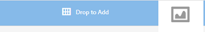

# Verzamelingen beheren {#managing-collections}

>[!CAUTION]
>
>AEM 6.4 heeft het einde van de uitgebreide ondersteuning bereikt en deze documentatie wordt niet meer bijgewerkt. Raadpleeg voor meer informatie onze [technische ondersteuningsperioden](https://helpx.adobe.com/support/programs/eol-matrix.html). Ondersteunde versies zoeken [hier](https://experienceleague.adobe.com/docs/).

Een verzameling is een set elementen binnen Adobe Experience Manager Assets. Gebruik verzamelingen om elementen tussen gebruikers te delen. De set kan een statische verzameling of een dynamische verzameling zijn die is gebaseerd op zoekresultaten.

In tegenstelling tot mappen kan een verzameling elementen van verschillende locaties bevatten. U kunt verzamelingen delen met verschillende gebruikers waaraan verschillende niveaus van bevoegdheden zijn toegewezen, zoals weergeven, bewerken, enzovoort.

U kunt meerdere verzamelingen delen met een gebruiker. Elke verzameling bevat verwijzingen naar elementen. De referentiële integriteit van activa wordt gehandhaafd over inzamelingen.

De inzamelingen zijn van de volgende types, die op de manier worden gebaseerd zij activa sorteren:

* Een verzameling die een statische referentielijst met elementen, mappen en andere verzamelingen bevat.
* Een slimme verzameling die dynamisch elementen bevat op basis van zoekcriteria.

## Toegang tot de verzamelingsconsole {#navigating-the-collections-console}

Als u het dialoogvenster **[!UICONTROL Collections]** tikt of klikt u op het logo van de Experience Manager. Ga vanaf de navigatiepagina naar **[!UICONTROL Assets]** > **[!UICONTROL Collections]**.

## Een verzameling maken {#creating-a-collection}

U kunt een verzameling maken met [statische verwijzingen](#creating-a-collection-with-static-references) of op basis van een [op zoekcriteria gebaseerd filter](#creating-a-smart-collection). U kunt ook een verzameling maken van een lichtbak.

### Een verzameling met statische verwijzingen maken {#creating-a-collection-with-static-references}

U kunt een verzameling maken met statische verwijzingen, bijvoorbeeld een verzameling met verwijzingen naar elementen, mappen, verzamelingen, centrifuges en afbeeldingssets.

1. Ga naar de **[!UICONTROL Collections]** console.
1. Tik/klik op de werkbalk **[!UICONTROL Create]**.
1. In de **[!UICONTROL Create Collection]** Voer een titel en een optionele beschrijving in voor de verzameling.
1. Voeg leden toe aan de verzameling en wijs de juiste machtigingen toe. U kunt ook **[!UICONTROL Public Collection]** selecteren om alle gebruikers toegang te geven tot de verzameling.

   >[!NOTE]
   >
   >Om de leden toe te laten om inzamelingen met andere gebruikers te delen, verstrek `dam-users` groep lees toestemmingen bij de weg `home/users`. Toestemming geven aan de gebruikers op `/content/dam/collections` de locatie waar gebruikers de verzamelingen in pop-uplijsten kunnen weergeven. U kunt de gebruiker ook een onderdeel maken van `dam-users` groep.

1. (Optioneel) Voeg een miniatuurafbeelding toe voor de verzameling.
1. Tik of klik op **[!UICONTROL Create]** en tik of klik vervolgens op **[!UICONTROL OK]** om het dialoogvenster te sluiten. Een verzameling met de opgegeven titel en eigenschappen wordt geopend in de console voor verzamelingen.

   >[!NOTE]
   >
   >Met Experience Manager Assets kunt u controletaken voor een verzameling maken, vergelijkbaar met de manier waarop u overzichtstaken voor een map met middelen maakt.

   Navigeer naar de gebruikersinterface Elementen om elementen aan de verzameling toe te voegen. Zie voor meer informatie [Elementen toevoegen aan een verzameling](/help/assets/managing-collections-touch-ui.md#adding-assets-to-a-collection).

### Verzamelingen maken met dropzone {#create-collections-using-dropzone}

U kunt elementen van de interface Elementen naar een verzameling slepen. U kunt ook een kopie van een verzameling maken en de elementen daar slepen.

1. Selecteer in de interface Elementen de elementen die u aan een verzameling wilt toevoegen.
1. Sleep de elementen naar de **[!UICONTROL Drop in Collection]** zone.

   

   Laat de muisknop los wanneer de dropzone actief wordt en verandert het label in **[!UICONTROL Drop to Add]**.

   

   U kunt ook op de knop **[!UICONTROL To Collection]** op de werkbalk.

   

1. Tik of klik op de pagina **[!UICONTROL Add To Collection]** op het pictogram **[!UICONTROL Create Collection]** op de werkbalk.

   Als u de assets aan een bestaande verzameling wilt toevoegen, selecteert u deze op de pagina en tikt of klikt u op **[!UICONTROL Add]**. Standaard wordt de laatst bijgewerkte verzameling geselecteerd.

1. Geef in het dialoogvenster **[!UICONTROL Create New Collection]** een naam op voor de verzameling. Selecteer **[!UICONTROL Public Collection]** als u de verzameling toegankelijk wilt maken voor alle gebruikers.
1. Tikken/klikken **[!UICONTROL Continue]** om de verzameling te maken.

### Een slimme verzameling maken {#creating-a-smart-collection}

Een slimme verzameling gebruikt zoekcriteria om elementen dynamisch te vullen. U kunt een slimme verzameling alleen maken met behulp van bestanden en niet met behulp van mappen of bestanden en mappen.

Voer de volgende stappen uit om een slimme verzameling te maken:

1. Navigeer naar de gebruikersinterface Middelen en tik op het zoekpictogram of klik erop.

1. Typ het trefwoord in het vak Zoeken en druk op Enter. Open het deelvenster Filters en pas een zoekfilter toe.

1. Van de **[!UICONTROL Files & Folders]** list, selecteer **[!UICONTROL Files]**.

   

1. Tik of klik op **[!UICONTROL Save Smart Collection]**.
1. Geef een naam op voor de verzameling. Selecteren **[!UICONTROL Public]** om de groep van Gebruikers DAM met de rol van de Kijker aan de slimme inzameling toe te voegen.

   

   >[!NOTE]
   >
   >Als u **[!UICONTROL Public]**, wordt de slimme verzameling beschikbaar voor iedereen met de eigenaarrol nadat u deze hebt gemaakt. Als u de optie **[!UICONTROL Public]** , is de DAM-gebruikersgroep niet meer gekoppeld aan de slimme verzameling.

1. Tik of klik op **[!UICONTROL Save]** om de slimme verzameling te maken en sluit vervolgens het berichtvenster om het proces te voltooien.

   De nieuwe slimme verzameling wordt ook toegevoegd aan de **[!UICONTROL Saved Searches]** lijst.

   

   Het label van de knop **[!UICONTROL Create Smart Selection]** verandert in **[!UICONTROL Edit Smart Selection]**. Als u de instellingen van de slimme verzameling wilt bewerken, selecteert u **[!UICONTROL Files]** in de lijst **[!UICONTROL Files & Folders]**. Tik of klik vervolgens op de knop **[!UICONTROL Edit Smart Selection]**.

   

## Elementen toevoegen aan een verzameling {#adding-assets-to-a-collection}

U kunt elementen toevoegen aan een verzameling die een lijst met bestanden of mappen waarnaar wordt verwezen, bevat. Slimme verzamelingen gebruiken een zoekquery om elementen te vullen. Daarom zijn statische verwijzingen naar elementen en mappen niet op hen van toepassing.

1. Selecteer het element in de gebruikersinterface Elementen en tik op het element **[!UICONTROL To Collection]** op de werkbalk.

   

   U kunt het element ook naar de **[!UICONTROL Drop in Collection]** op de interface. Voeg de elementen toe wanneer het label van het gebied verandert in **[!UICONTROL Drop to Add]**.

1. In de **[!UICONTROL Add To Collection]** pagina, selecteert u de verzameling waaraan u het element wilt toevoegen.

1. Tikken/klikken **[!UICONTROL Add]** en sluit vervolgens het bevestigingsbericht. Het element wordt toegevoegd aan de collectie.

## Een slimme verzameling bewerken {#editing-a-smart-collection}

Slimme verzamelingen worden gemaakt door een zoekopdracht op te slaan, zodat u de inhoud kunt wijzigen door de zoekparameters van de [opgeslagen zoekopdracht](#editing-saved-searches).

1. Tik in de gebruikersinterface Middelen op het zoekpictogram op de werkbalk of klik erop.

   

1. Met de curseur in het vakje van het Onderzoek, duw op de sleutel van de Terugkeer.

1. Tik/klik op het pictogram GlobalNav om het deelvenster Filters weer te geven.

1. Selecteer in de lijst met **[!UICONTROL Saved Searches]** de slimme verzameling die u wilt wijzigen. In het deelvenster Zoeken worden de filters weergegeven die zijn geconfigureerd voor de opgeslagen zoekopdracht.

   

1. Van de **[!UICONTROL Files & Folders]** list, selecteer **[!UICONTROL Files]**.

1. Wijzig desgewenst een of meer filters. Tik of klik op **[!UICONTROL Edit Smart Collection]**.

   U kunt ook de naam van de slimme verzameling bewerken.

   

1. Tik of klik op **[!UICONTROL Save]**. De **[!UICONTROL Edit Smart Collection]** wordt weergegeven.

1. Tikken/klikken **[!UICONTROL Overwrite]** om de originele slimme verzameling te vervangen door de bewerkte verzameling. U kunt ook **[!UICONTROL Save As]** om de bewerkte verzameling afzonderlijk op te slaan.

1. Tik/klik in het bevestigingsdialoogvenster op **[!UICONTROL Save]** om het proces te voltooien.

## Metagegevens van verzamelingen weergeven en bewerken {#viewing-and-editing-collection-metadata}

De meta-gegevens van de inzameling omvat gegevens over de inzameling, met inbegrip van om het even welke markeringen die worden toegevoegd.

1. Selecteer een verzameling in de verzamelingsconsole en tik op de knop **[!UICONTROL Properties]** op de werkbalk.
1. In de **[!UICONTROL Collection Metadata]** pagina, bekijk de inzamelingsmeta-gegevens van **[!UICONTROL Basic]** en **[!UICONTROL Advanced]** tabs.
1. Wijzig desgewenst de metagegevens en tik/klik op **[!UICONTROL Save & Close]** op de werkbalk om de wijzigingen op te slaan.

### Metagegevens van meerdere verzamelingen bulksgewijs bewerken {#editing-collection-metadata-in-bulk}

U kunt de metagegevens van meerdere verzamelingen tegelijk bewerken. Deze functionaliteit helpt u snel gemeenschappelijke meta-gegevens in veelvoudige inzamelingen te herhalen.

1. Selecteer twee of meer verzamelingen waarvoor u metagegevens wilt bewerken in de console Verzamelingen.
1. Tik/klik op de werkbalk **[!UICONTROL Properties]**.
1. Bewerk desgewenst de metadata op de pagina **[!UICONTROL Collection Metadata]** onder de tabbladen **[!UICONTROL Basic]** en **[!UICONTROL Advanced]**.
1. Als u de eigenschappen van metagegevens voor een specifieke verzameling wilt weergeven, schakelt u de overige verzamelingen in de lijst met verzamelingen uit. De gebieden van de meta-gegevensredacteur zijn bevolkt met de meta-gegevens voor de bepaalde inzameling.

   >[!NOTE]
   >
   >* Op de pagina met eigenschappen van verzamelingen kunt u verzamelingen verwijderen uit de lijst met verzamelingen door ze te deselecteren. Alle verzamelingen zijn standaard geselecteerd in de lijst met verzamelingen. De metagegevens voor verzamelingen die u verwijdert, worden niet bijgewerkt.
   >* Selecteer boven aan de lijst het selectievakje bij **[!UICONTROL Title]** om te schakelen tussen het selecteren van de verzamelingen en het wissen van de lijst.

1. Tikken/klikken **[!UICONTROL Save & Close]** op de werkbalk en sluit vervolgens het bevestigingsvenster om het proces te voltooien.
1. Selecteer **[!UICONTROL Append mode]** om de nieuwe metadata toe te voegen aan de bestaande metadata. Als u deze optie niet selecteert, worden de bestaande metadata in de velden vervangen door de nieuwe metadata. Tik of klik op **[!UICONTROL Submit]**.

   >[!NOTE]
   >
   >De metagegevens die u voor de geselecteerde verzamelingen toevoegt, overschrijven de vorige metagegevens voor deze verzamelingen. Gebruik de [!UICONTROL Append mode] om nieuwe waarden toe te voegen aan de bestaande metagegevens in de velden die meerdere waarden kunnen bevatten. Velden met één waarde worden altijd overschreven. Alle tags die u toevoegt in het dialoogvenster [!UICONTROL Tags] worden toegevoegd aan de bestaande lijst met tags in de metagegevens.

De metagegevens aanpassen [!UICONTROL Properties] de pagina, met inbegrip van het toevoegen van, het wijzigen van, het schrappen van meta-gegevenseigenschappen, de redacteur van het Schema gebruiken.

>[!TIP]
>
>De bulkbewerkingsmethode werkt voor elementen die beschikbaar zijn in een verzameling. Voor de elementen die beschikbaar zijn in verschillende mappen of die voldoen aan een algemeen criterium, is het mogelijk om de metagegevens bulksgewijs bij te werken nadat u deze elementen hebt doorzocht.

## Verzamelingen zoeken {#searching-collections}

U kunt inzamelingen van de console van Inzamelingen zoeken. Wanneer u met trefwoorden zoekt in het vak Zoeken, [!DNL Experience Manager] Elementen zoeken naar verzamelingsnamen, metagegevens en de tags die aan de verzamelingen zijn toegevoegd.

Als u zoekt naar verzamelingen op het hoogste niveau, worden alleen afzonderlijke verzamelingen geretourneerd in zoekresultaten. Elementen of mappen in de verzamelingen zijn uitgesloten. In alle andere gevallen (bijvoorbeeld in een afzonderlijke verzameling of in een mappenhiërarchie) worden alle relevante elementen, mappen en verzamelingen geretourneerd.

## Zoeken in verzamelingen {#searching-within-collections}

Tik of klik op een verzameling in de verzamelingsconsole om deze te openen.

Binnen een verzameling is de zoekopdracht beperkt tot elementen (en de bijbehorende tags en metagegevens) in de verzameling die u bekijkt. Wanneer u in een map zoekt, worden alle overeenkomende elementen en onderliggende mappen in de huidige map geretourneerd. Wanneer u in een verzameling zoekt, worden alleen overeenkomende elementen, mappen en andere verzamelingen geretourneerd die directe leden van de verzameling zijn.

## Verzamelingsinstellingen bewerken {#editing-collection-settings}

U kunt verzamelingsinstellingen bewerken, zoals titel en beschrijving, of leden toevoegen aan een verzameling.

1. Selecteer een verzameling en tik op de knop **[!UICONTROL Settings]** in de werkbalk. U kunt ook de opdracht **[!UICONTROL Settings]** snelle actie van de inzamelingsduimnagel.
1. Wijzig de verzamelingsinstellingen op de pagina **[!UICONTROL Collection Settings]**. Wijzig bijvoorbeeld de titel van de verzameling, beschrijvingen, leden en machtigingen zoals beschreven in [Verzamelingen toevoegen](#creating-a-collection).

1. Tik/klik om de wijzigingen op te slaan **[!UICONTROL Save]**.

## Een verzameling verwijderen {#deleting-a-collection}

1. Selecteer een of meer verzamelingen in de console Verzamelingen en tik op het pictogram Verwijderen op de werkbalk.

1. Tik/klik in het dialoogvenster op **[!UICONTROL Delete]** om de verwijderactie te bevestigen.

   >[!NOTE]
   >
   >U kunt slimme verzamelingen ook verwijderen door [opgeslagen zoekopdrachten verwijderen](#deleting-saved-searches).

## Een verzameling downloaden {#downloading-a-collection}

Wanneer u een verzameling downloadt, wordt de volledige hiërarchie van elementen in de verzameling gedownload, inclusief mappen en onderliggende verzamelingen.

1. Selecteer een of meer verzamelingen die u wilt downloaden in de console Verzamelingen.
1. Tik op of klik op het downloadpictogram op de werkbalk.
1. In de **[!UICONTROL Download]** dialoogvenster, tikken/klikken **[!UICONTROL Download]**. Als u de uitvoeringen van de elementen in de verzameling wilt downloaden, selecteert u **[!UICONTROL Renditions]**. Selecteer **[!UICONTROL Email]** optie om een e-mailbericht naar de eigenaar van de verzameling te verzenden.

   Wanneer u een verzameling selecteert die u wilt downloaden, wordt de volledige maphiërarchie onder de verzameling gedownload. Selecteer **[!UICONTROL Create separate folder for each asset]**.

## Geneste verzamelingen maken {#creating-nested-collections}

U kunt een verzameling toevoegen aan een andere verzameling en zo een geneste verzameling maken.

1. Selecteer in de verzamelingsconsole de gewenste verzameling of groep verzamelingen en tik of klik op de knop **[!UICONTROL To Collection]** in de werkbalk.

   

1. Van de **[!UICONTROL Add To Collection]** pagina, selecteert u de verzameling waarin u de verzameling wilt toevoegen.

   >[!NOTE]
   >
   >De laatst bijgewerkte verzameling is standaard geselecteerd in het dialoogvenster **[!UICONTROL Add To Collection]** pagina.

1. Tik of klik op **[!UICONTROL Add]**. Een bericht bevestigt dat de inzameling aan de doelinzameling in wordt toegevoegd **[!UICONTROL Select Destination]** pagina. Sluit het bericht om het proces te voltooien.

>[!NOTE]
>
>Slimme verzamelingen kunnen niet worden genest. Met andere woorden, slimme verzamelingen kunnen geen andere verzameling bevatten.

## Opgeslagen zoekopdrachten {#saved-searches}

In de gebruikersinterface Assets kunt u op basis van bepaalde regels, zoekcriteria of aangepaste zoekfacetten zoeken of filteren. Als u deze opslaat als **[!UICONTROL Saved Searches]**, kunt u ze later openen vanuit de lijst **[!UICONTROL Saved Searches]** in het deelvenster Filteren. Als u een opgeslagen zoekopdracht maakt, wordt ook een slimme verzameling gemaakt.

### Opgeslagen zoekopdrachten maken {#creating-saved-searches}

Opgeslagen zoekopdrachten worden gemaakt wanneer u een slimme verzameling maakt. Slimme verzamelingen worden automatisch toegevoegd aan de lijst met **[!UICONTROL Saved Searches]**. De opgeslagen zoekopdracht voor de verzameling wordt opgeslagen in het dialoogvenster `dam:query` eigenschap in crxx op de relatieve locatie `/content/dam/collections/`. Er gelden geen limieten voor de zoekopdrachten die u kunt opslaan en voor de opgeslagen zoekopdrachten die in de lijst worden weergegeven.

>[!NOTE]
>
>U kunt slimme verzamelingen op dezelfde manier delen als statische verzamelingen.

### Opgeslagen zoekopdrachten bewerken {#editing-saved-searches}

Opgeslagen zoekopdrachten bewerken is hetzelfde als slimme verzamelingen bewerken. Zie voor meer informatie [Een slimme verzameling bewerken](/help/assets/managing-collections-touch-ui.md#editing-a-smart-collection).

### Opgeslagen zoekopdrachten verwijderen {#deleting-saved-searches}

1. Tik in de gebruikersinterface Middelen op het zoekpictogram op de werkbalk of klik erop.

   

1. Met de curseur op het gebied van Onderzoek, duw op de Enter sleutel.

1. Klik of tik op het GlobalNav-pictogram om het deelvenster Filters weer te geven.

1. Van de **[!UICONTROL Saved Searches]** tikken of klikken op het verwijderpictogram naast de slimme verzameling die u wilt verwijderen.

   

1. Tik/klik in het dialoogvenster op **[!UICONTROL Delete]** om de opgeslagen zoekopdracht te verwijderen.

## Een workflow op een verzameling uitvoeren {#running-a-workflow-on-a-collection}

U kunt een workflow voor de elementen in een verzameling uitvoeren. Als de verzameling geneste verzamelingen bevat, wordt de workflow ook uitgevoerd op de elementen in de geneste verzamelingen. Als de verzameling en de geneste verzameling echter dubbele elementen bevatten, wordt de workflow slechts eenmaal uitgevoerd voor dergelijke elementen.

1. Selecteer in de console Verzamelingen een verzameling waarop u een workflow wilt uitvoeren.
1. Tik/klik op het pictogram GlobalNav en kies **[!UICONTROL Timeline]** in de lijst.
1. Klik of tik vanuit de tijdlijn op het pictogram Caret onderaan en tik/klik op **[!UICONTROL Start Workflow]**.

   

1. In de **[!UICONTROL Start Workflow]** selecteert u een workflowmodel in de lijst. Selecteer bijvoorbeeld de **[!UICONTROL DAM Update Asset]** model.
1. Voer een titel in voor de workflow en tik/klik op **[!UICONTROL Start]**.
1. Tik/klik in het dialoogvenster op **[!UICONTROL Proceed]**. De workflow wordt uitgevoerd op alle elementen in de verzameling.

>[!MORELIKETHIS]
>
>* [Experience Manager Assets-e-mailberichten configureren](/help/sites-administering/notification.md#assetsconfig)
>* [Een revisietaak maken voor verzamelingen](bulk-approval.md)

