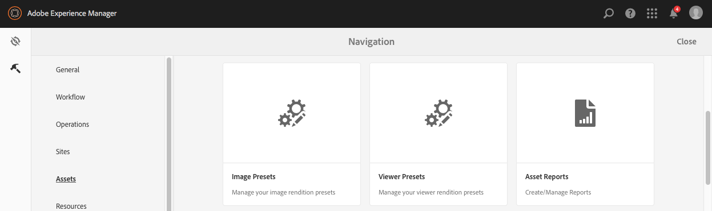

# Dynamic Media-voorinstellingen voor afbeeldingen beheren {#managing-image-presets}

Met voorinstellingen voor afbeeldingen kan AEM Assets dynamisch afbeeldingen van verschillende grootten, in verschillende indelingen of met andere afbeeldingseigenschappen leveren die dynamisch worden gegenereerd. Elke voorinstelling voor afbeeldingen vertegenwoordigt een vooraf gedefinieerde verzameling opdrachten voor het vergroten of verkleinen en opmaken van afbeeldingen. Wanneer u een voorinstelling voor afbeeldingen maakt, kiest u een grootte voor het leveren van de afbeelding. U kiest ook opmaakopdrachten, zodat de weergave van de afbeelding wordt geoptimaliseerd wanneer de afbeelding wordt geleverd voor weergave.

Beheerders kunnen voorinstellingen maken voor het exporteren van elementen. Gebruikers kunnen bij het exporteren van afbeeldingen een voorinstelling kiezen. Hiermee worden de afbeeldingen ook opnieuw opgemaakt volgens de specificaties die de beheerder heeft opgegeven.

U kunt ook voorinstellingen voor afbeeldingen maken die reageren. Als u een voorinstelling voor een responsieve afbeelding toepast op uw elementen, worden deze afhankelijk van het apparaat of de schermgrootte waarop ze worden weergegeven. U kunt afbeeldingsvoorinstellingen zo configureren dat deze naast RGB of Grijs ook CMYK gebruiken in de kleurruimte.

In deze sectie wordt beschreven hoe u voorinstellingen voor afbeeldingen maakt, wijzigt en over het algemeen beheert. U kunt een voorinstelling voor afbeeldingen op elk gewenst moment op een afbeelding toepassen. Zie [Voorinstellingen voor afbeeldingen toepassen](image-presets.md).

>[!NOTE]
>
>Slimme beeldverwerking werkt met bestaande voorinstellingen voor afbeeldingen en maakt gebruik van intelligentie tijdens de laatste milliseconde van levering om de bestandsgrootte van de afbeelding verder te beperken op basis van de snelheid van de browser of netwerkverbinding. Zie [Slimme beeldverwerking](imaging-faq.md) voor meer informatie.

## Voorinstellingen voor Dynamic Media-afbeeldingen {#understanding-image-presets}

Als softwaremacro, is een Vooraf ingesteld Beeld een vooraf bepaalde inzameling van het rangschikken en het formatteren bevelen die onder een naam worden bewaard. Als u wilt weten hoe Voorinstellingen afbeelding werken, kunt u instellen dat elke productafbeelding op uw website moet worden weergegeven in verschillende formaten, formaten en compressiesnelheden voor levering op het bureaublad en op mobiele apparatuur.

U kunt twee voorinstellingen voor afbeeldingen maken: één met 500 x 500 pixels voor desktopversie en 150 x 150 pixels voor de mobiele versie. U maakt twee voorinstellingen voor afbeeldingen: een voorinstelling met de naam *Vergroten* om afbeeldingen met 500 x 500 pixels weer te geven en een voorinstelling met de naam *Miniatuur* om afbeeldingen met 150 x 150 pixels weer te geven. Als u afbeeldingen wilt leveren met de grootte Vergroten en Miniatuur, AEM de definitie van de voorinstelling Afbeelding vergroten en Miniatuurafbeelding opzoeken. Vervolgens AEM dynamisch een afbeelding met de grootte en opmaakspecificaties van elke voorinstelling voor afbeeldingen.

Afbeeldingen die bij dynamische levering kleiner worden gemaakt, kunnen scherper en gedetailleerder worden. Daarom bevat elke voorinstelling voor afbeeldingen opmaakbesturingselementen waarmee u een afbeelding kunt optimaliseren wanneer deze met een bepaalde grootte wordt geleverd. Met deze besturingselementen zorgt u ervoor dat uw afbeeldingen scherp en duidelijk zijn wanneer ze aan uw website of toepassing worden geleverd.

Beheerders kunnen voorinstellingen voor afbeeldingen maken. Als u een voorinstelling voor een afbeelding wilt maken, begint u helemaal opnieuw of u kunt een bestaande voorinstelling beginnen en opslaan onder een andere naam.

## Dynamic Media-voorinstellingen voor afbeeldingen beheren {#managing-image-presets-1}

U beheert uw voorinstellingen voor afbeeldingen in AEM door te tikken op het AEM logo voor toegang tot de algemene navigatieconsole en vervolgens te tikken op het pictogram Extra en naar **[!UICONTROL Assets > Image Presets]** te navigeren.



>[!NOTE]
>
>Alle afbeeldingsvoorinstellingen die u maakt, zijn ook beschikbaar als dynamische uitvoeringen wanneer u elementen voorvertoont of levert.
>
>In de modus *Dynamic Media - Scene7* moet u *not* afbeeldingsvoorinstellingen publiceren omdat voorinstellingen voor afbeeldingen automatisch worden gepubliceerd.
>
>In *Dynamic Media - Hybride modus* moet u de voorinstellingen voor afbeeldingen handmatig publiceren.
>
>Zie [Voorinstellingen voor afbeeldingen publiceren.](#publishing-image-presets)

>[!NOTE]
>
>Het systeem toont een verscheidenheid van vertoningen wanneer u **[!UICONTROL Renditions]** in de **[!UICONTROL Detail]** Mening van activa selecteert. U kunt het aantal voorinstellingen voor afbeeldingen dat wordt weergegeven, verhogen of verlagen. Zie [Het aantal voorinstellingen voor afbeeldingen dat wordt weergegeven, vergroten](#increasing-or-decreasing-the-number-of-image-presets-that-display).

### Adobe Illustrator- (AI), PostScript- (EPS) en PDF-bestandsindelingen {#adobe-illustrator-ai-postscript-eps-and-pdf-file-formats}

Als u de opname van AI-, EPS- en PDF-bestanden wilt ondersteunen, zodat u dynamische uitvoeringen van deze bestandsindelingen kunt genereren, is het verstandig de volgende informatie te bekijken voordat u voorinstellingen voor afbeeldingen maakt.

Adobe Illustrator-bestandsindeling is een variant van PDF. De belangrijkste verschillen in AEM Assets zijn:

* Adobe Illustrator-documenten bestaan uit één pagina met meerdere lagen. Elke laag wordt geëxtraheerd als een PNG-subelement onder het Illustrator-hoofdelement.
* PDF-documenten bestaan uit een of meer pagina&#39;s. Elke pagina wordt uitgepakt als een PDF-subelement van één pagina onder het PDF-hoofddocument met meerdere pagina&#39;s.

De subelementen worden gemaakt door de `Create Sub Asset process`-component binnen de algemene `DAM Update Asset`-workflow. Tik op **[!UICONTROL Tools > Workflow > Models > DAM Update Asset > Edit]** om deze procescomponent in de workflow te zien.

Zie ook [Pagina&#39;s van een bestand met meerdere pagina&#39;s weergeven](/help/assets/managing-linked-subassets.md#view-pages-of-a-multi-page-file).

U kunt de subelementen of de pagina&#39;s weergeven wanneer u het element opent, tikken op het menu Inhoud en **[!UICONTROL Subassets]** of **[!UICONTROL Pages]** selecteren. De subactiva zijn reële activa. Dat wil zeggen dat PDF-pagina&#39;s worden geëxtraheerd door de workflowcomponent `Create Sub Asset`. Ze worden vervolgens opgeslagen als `page1.pdf`, `page2.pdf` enzovoort onder het hoofdelement. Nadat ze zijn opgeslagen, verwerkt de **[!UICONTROL DAM Update Asset]** workflow ze.

Als u Dynamic Media wilt gebruiken om dynamische uitvoeringen voor AI-, EPS- of PDF-bestanden voor te vertonen en te genereren, voert u de volgende verwerkingsstappen uit:

1. In de **[!UICONTROL DAM Update Asset]** werkstroom, **[!UICONTROL Rasterize PDF/AI Image Preview Rendition]** procescomponent rasterizes de eerste pagina van oorspronkelijk element-gebruikend de gevormde resolutie-in een `cqdam.preview.png` vertoning.

1. De `cqdam.preview.png` vertoning wordt dan geoptimaliseerd in een PTIFF door de **[!UICONTROL Dynamic Media Process Image Assets]** procescomponent binnen het werkschema.

>[!NOTE]
>
>In de **[!UICONTROL DAM Update Asset]**-workflow worden miniaturen voor EPS-bestanden gegenereerd met de stap **[!UICONTROL EPS thumbnails]**.

### Eigenschappen van metagegevens van PDF/AI/EPS-element {#pdf-ai-eps-asset-metadata-properties}

| **Eigenschap Metadata** | **Beschrijving** |
|---|---|
| dam:Physicalwidthinches | Documentbreedte in inches. |
| dam:Physicalheightininches | Documenthoogte in inches. |

U hebt toegang tot **[!UICONTROL Rasterize PDF/AI Image Preview Rendition]** opties voor procescomponenten via de **[!UICONTROL DAM Update Asset]** workflow.

Tik linksboven op Adobe Experience Manager en navigeer naar **[!UICONTROL Tools > Workflow > Models]**. Selecteer **[!UICONTROL Workflow Models]** op de pagina **[!UICONTROL DAM Update Asset]** en tik **[!UICONTROL Edit]** op de werkbalk. Tik op de pagina **[!UICONTROL DAM Update Asset workflow]** op de procescomponent **[!UICONTROL Rasterize PDF/AI Image Preview Rendition]** om het dialoogvenster **[!UICONTROL Step Properties]** te openen.

### Opties voor de vertoning van PDF/AI-afbeeldingen omzetten in pixels {#rasterize-pdf-ai-image-preview-rendition-options}


**Argumenten voor het rasteren van PDF- of AI-workflow**

<table> 
 <tbody> 
  <tr> 
   <td><strong>Procesargument</strong></td> 
   <td><strong>Standaardinstelling</strong></td> 
   <td><strong>Beschrijving</strong></td> 
  </tr> 
  <tr> 
   <td>MIME-typen</td> 
   <td><p>application/pdf</p> <p>application/postscript</p> <p>application/illustrator<br /> </p> </td> 
   <td>Lijst met documentmime-typen die worden beschouwd als PDF- of Illustrator-documenten.<br /> </td> 
  </tr> 
  <tr> 
   <td>Max. breedte</td> 
   <td>2048</td> 
   <td>Maximale breedte van de gegenereerde voorvertoningsvertoning, in pixels.<br /> </td> 
  </tr> 
  <tr> 
   <td>Max. hoogte</td> 
   <td>2048</td> 
   <td>Maximumhoogte van de gegenereerde voorvertoning, in pixels.<br /> </td> 
  </tr> 
  <tr> 
   <td>Resolutie</td> 
   <td>72</td> 
   <td>Resolutie voor het rasteren van de eerste pagina, in ppi (pixels per inch).</td> 
  </tr> 
 </tbody> 
</table>

Met de standaardprocesargumenten wordt de eerste pagina van een PDF/AI-document gerasterd met 72 ppi en de gegenereerde voorvertoningsafbeelding met een grootte van 2048 x 2048 pixels. Voor een gebruikelijke implementatie kunt u de resolutie verhogen tot minimaal 150 ppi of meer. Een document met een tekengrootte van 300 ppi in de VS vereist bijvoorbeeld een maximale breedte en hoogte van respectievelijk 2550 x 3300 pixels.

**[!UICONTROL Max Width]** en  **[!UICONTROL Max Height]** beperkt u de resolutie waarop moet worden gerasterd. Als de maximale waarden bijvoorbeeld ongewijzigd blijven en de resolutie is ingesteld op 300 ppi, wordt een US Letter-document gerasterd naar 186 ppi. Het document is dus 1581 x 2046 pixels.

Voor de procescomponent **[!UICONTROL Rasterize PDF/AI Image Preview Rendition]** is een maximum gedefinieerd om te voorkomen dat er te grote afbeeldingen in het geheugen worden gemaakt. Dergelijke grote afbeeldingen kunnen het geheugen overlopen dat aan de JVM (Java Virtual Machine) wordt geleverd. Er moet op worden gelet dat de JVM over voldoende geheugen beschikt om het geconfigureerde aantal parallelle workflows te beheren, waarbij elk van beide de mogelijkheid heeft om een image op de maximaal geconfigureerde grootte te maken.

### Bestandsindeling InDesign (INDD) {#indesign-indd-file-format}

Als u de opname van INDD-bestanden wilt ondersteunen, zodat u dynamische uitvoering van deze bestandsindeling kunt genereren, is het verstandig de volgende informatie te bekijken voordat u voorinstellingen voor afbeeldingen maakt.

Voor InDesign-bestanden worden subelementen alleen geëxtraheerd als de Adobe InDesign-server is geïntegreerd met AEM. Elementen waarnaar wordt verwezen, zijn gekoppeld op basis van hun metagegevens. InDesign Server is niet vereist voor koppelingen. De middelen waarnaar wordt verwezen, moeten echter aanwezig zijn in AEM voordat de InDesign-bestanden worden verwerkt, zodat de koppelingen tussen de InDesign-bestanden en de bestanden waarnaar wordt verwezen, worden gemaakt.

Zie [AEM Assets integreren met InDesign Server](indesign.md).

De het procescomponent van het Proces van de Extractie van Media in **[!UICONTROL DAM Update Asset]** werkschema stelt verscheidene vooraf gevormde **[!UICONTROL Extend Scripts]** in werking om InDesign dossiers te verwerken.


De **[!UICONTROL Extend Script]** wegen in de argumenten van **[!UICONTROL Media Extraction]** procescomponent in **[!UICONTROL DAM Update Asset]** werkschema.

De volgende scripts worden door Dynamic Media-integratie gebruikt:

<table> 
 <tbody> 
  <tr> 
   <td><strong>Scriptnaam uitbreiden</strong></td> 
   <td><strong>Standaard</strong></td> 
   <td><strong>Beschrijving</strong></td> 
  </tr> 
  <tr> 
   <td>ThumbnailExport.jsx</td> 
   <td>Ja</td> 
   <td>Genereert een 300 ppi <code>thumbnail.jpg</code> uitvoering die is geoptimaliseerd en door <code>Dynamic Media Process Image Assets</code> procescomponent is omgezet in een PTIFF-uitvoering.<br /> </td> 
  </tr> 
  <tr> 
   <td>JPEGPagesExport.jsx</td> 
   <td>Ja</td> 
   <td>Hiermee genereert u een JPEG-subelement van 300 ppi voor elke pagina. Het JPEG-subelement is een echt middel dat is opgeslagen onder het element InDesign. Het wordt ook geoptimaliseerd en omgezet in PTIFF door de <code>DAM Update Asset</code> werkschema.<br /> </td> 
  </tr> 
  <tr> 
   <td>PDFPagesExport.jsx</td> 
   <td>Nee</td> 
   <td>Hiermee genereert u een PDF-subelement voor elke pagina. Het PDF-subelement wordt verwerkt zoals eerder beschreven. Omdat de PDF slechts één pagina bevat, worden geen subelementen gegenereerd.<br /> </td> 
  </tr> 
 </tbody> 
</table>

## Miniatuurgrootte {#configuring-image-thumbnail-size} configureren

U kunt de grootte van miniaturen configureren door deze instellingen te configureren in de **[!UICONTROL DAM Update Asset]**-workflow. De workflow bevat twee stappen waarmee u de miniatuurgrootte van afbeeldingselementen kunt configureren. Hoewel het ene (**[!UICONTROL Dynamic Media Process Image Assets]**) wordt gebruikt voor dynamische afbeeldingselementen en het andere (**[!UICONTROL Process Thumbnails]**) voor het genereren van statische miniaturen of wanneer alle andere processen geen miniaturen genereren, moeten *both* dezelfde instellingen hebben.

Met de stap **[!UICONTROL Dynamic Media Process Image Assets]** worden miniaturen gegenereerd door de afbeeldingsserver en deze configuratie is onafhankelijk van de configuratie die op de stap **[!UICONTROL Process Thumbnails]** is toegepast. Het genereren van miniaturen via de stap **[!UICONTROL Process Thumbnails]** is de langzaamste en meest geheugenintensieve manier om miniaturen te maken.

Miniatuurgrootte wordt gedefinieerd in de volgende indeling: **width:height:center**, bijvoorbeeld *80:80:false*. De breedte en hoogte bepalen de grootte in pixels van de miniatuur; de middelste waarde is onwaar of true en als de waarde true is, wordt aangegeven dat de miniatuurafbeelding exact dezelfde grootte heeft als in de configuratie. Als het formaat van de afbeelding kleiner is, wordt de afbeelding gecentreerd in de miniatuur.

>[!NOTE]
>
>* De miniatuurgrootte voor EPS-bestanden wordt geconfigureerd in de stap **[!UICONTROL EPS thumbnails]** op het tabblad **[!UICONTROL Arguments]** onder **[!UICONTROL Thumbnails]**.
   >
   >
* Miniatuurgrootte voor video&#39;s wordt geconfigureerd in de stap **[!UICONTROL FFmpeg thumbnails]** op het tabblad **[!UICONTROL Process]** onder **[!UICONTROL Arguments]**.

>


**Miniatuurgrootte** configureren:

1. Tik op **[!UICONTROL Tools > Workflow > Models > DAM Update Asset > Edit]**.
1. Tik op de stap **[!UICONTROL Dynamic Media Process Image Assets]** en tik vervolgens op het tabblad **[!UICONTROL Thumbnails]**. Wijzig desgewenst de miniatuurgrootte en tik op **[!UICONTROL OK]**.

   

1. Tik op de stap **[!UICONTROL Process Thumbnails]** en tik vervolgens op het tabblad **[!UICONTROL Thumbnails]**. Wijzig desgewenst de miniatuurgrootte en tik op **[!UICONTROL OK]**.

   >[!NOTE]
   >
   >De waarden in het argument voor miniaturen in de stap **[!UICONTROL Process Thumbnails]** moeten overeenkomen met het argument voor miniaturen in de stap **[!UICONTROL Dynamic Media Process Image Assets]**.

1. Tik **[!UICONTROL Save]** om de wijzigingen in de workflow op te slaan.

### Het aantal Dynamic Media-voorinstellingen voor afbeeldingen dat {#increasing-or-decreasing-the-number-of-image-presets-that-display} wordt weergegeven verhogen of verlagen

Afbeeldingsvoorinstellingen die u maakt, zijn beschikbaar als dynamische uitvoeringen wanneer u een voorvertoning van elementen weergeeft. AEM toont een verscheidenheid van dynamische vertoningen wanneer het bekijken van activa van **[!UICONTROL Detail View > Renditions]**. U kunt de limiet van weergegeven uitvoeringen verhogen of verlagen.

**Het aantal weergegeven** Dynamic Media-voorinstellingen voor afbeeldingen verhogen of verlagen:

1. Navigeer naar **[!UICONTROL CRXDE Lite]** ([http://localhost:4502/crx/de](http://localhost:4502/crx/de)).
1. Navigeer naar het knooppunt met vooraf ingestelde lijsten voor afbeeldingen op `/libs/dam/gui/coral/content/commons/sidepanels/imagepresetsdetail/imgagepresetslist`

   

1. Wijzig in de eigenschap **[!UICONTROL limit]** de **[!UICONTROL value]**, die standaard op 15 is ingesteld, in het gewenste getal.
1. Navigeer naar de vooraf ingestelde gegevensbron voor de afbeelding op `/libs/dam/gui/coral/content/commons/sidepanels/imagepresetsdetail/imgagepresetslist/datasource`

   

1. Wijzig in de eigenschap limit het getal in het gewenste getal, bijvoorbeeld `{empty requestPathInfo.selectors[1] ? "20" : requestPathInfo.selectors[1]}`
1. Tik op **[!UICONTROL Save All]**.

### Dynamic Media-voorinstellingen voor afbeeldingen maken {#creating-image-presets}

Als u een Dynamic Media-voorinstelling voor afbeeldingen maakt, kunt u deze instellingen op alle afbeeldingen toepassen wanneer u een voorvertoning weergeeft of publiceert.

>[!NOTE]
>
>Als u Internet Explorer 9 gebruikt, wordt het maken van een voorinstelling niet meteen na het opslaan weergegeven in de lijst met voorinstellingen. U kunt dit probleem omzeilen door de cache voor IE9 uit te schakelen.

Als u de opname van AI-, PDF- en EPS-bestanden wilt ondersteunen, zodat u een dynamische uitvoering van deze bestandsindelingen kunt genereren, is het verstandig de volgende informatie te bekijken voordat u voorinstellingen voor afbeeldingen maakt.\
Zie [Adobe Illustrator (AI), Postscript (EPS) en PDF-bestandsindelingen](#adobe-illustrator-ai-postscript-eps-and-pdf-file-formats).

Als u de opname van INDD-bestanden wilt ondersteunen, zodat u dynamische uitvoering van deze bestandsindeling kunt genereren, is het verstandig de volgende informatie te bekijken voordat u voorinstellingen voor afbeeldingen maakt.  Zie [InDesign-bestandsindeling (INDD)](#indesign-indd-file-format).

>[!NOTE]
>
>Als u Dynamic Media-voorinstellingen voor afbeeldingen wilt maken, hebt u beheerdersrechten nodig als AEM beheerder of beheerder van Admin Consoles.

**Een Dynamic Media-voorinstelling** voor afbeeldingen maken:

1. Tik in AEM op het AEM om toegang te krijgen tot de globale navigatieconsole.
1. Tik op het pictogram **[!UICONTROL Tools]** en navigeer naar **[!UICONTROL Assets > Image Presets]**.
1. Tik op **[!UICONTROL Create]**.

   

   >[!NOTE]
   >
   >Als u deze voorinstelling responsief wilt maken, wist u de waarden in de velden **[!UICONTROL width]** en **[!UICONTROL height]** en laat u deze leeg.

1. Op **[!UICONTROL Edit Image Preset]** pagina, ga waarden in **[!UICONTROL Basic]** en **[!UICONTROL Advanced]** lusjes zoals aangewezen, met inbegrip van een naam in. De opties worden beschreven in [Opties voor afbeeldingsvoorinstellingen](#image-preset-options). Voorinstellingen worden weergegeven in het linkerdeelvenster en kunnen direct samen met andere assets worden gebruikt.

   

1. Klik op **[!UICONTROL Save]**.

### Een responsieve voorinstelling voor een afbeelding maken {#creating-a-responsive-image-preset}

Als u een responsieve voorinstelling voor afbeeldingen wilt maken, voert u de stappen uit in [Voorinstellingen voor afbeeldingen maken](#creating-image-presets). Wis de waarden bij het invoeren van de hoogte en breedte in het venster **[!UICONTROL Edit Image Preset]** en laat ze leeg.

Als u deze leeg laat, wordt AEM aangegeven dat op deze voorinstelling kan worden gereageerd. U kunt de andere waarden desgewenst aanpassen.


>[!NOTE]
>
>Als u de knoppen **[!UICONTROL URL]** en **[!UICONTROL RESS]** wilt zien wanneer u een voorinstelling voor een afbeelding toepast op een element, moet het element worden gepubliceerd.
>
>In de modus Dynamic Media - Scene7 worden afbeeldingsvoorinstellingen en afbeeldingselementen automatisch gepubliceerd.
>
>In Dynamic Media - hybride modus moet u handmatig voorinstellingen voor afbeeldingen en afbeeldingselementen publiceren.

### Opties {#image-preset-options} voor voorinstellingen afbeelding

Wanneer u voorinstellingen voor afbeeldingen maakt of bewerkt, worden de opties in deze sectie beschreven. Daarnaast raadt Adobe de volgende drie *best practices* opties aan om te beginnen:

* **[!UICONTROL Format]** (**[!UICONTROL Basic]** tabblad) - Selecteer  **[!UICONTROL JPEG]** of een andere indeling die aan uw vereisten voldoet. Alle webbrowsers ondersteunen de JPEG-afbeeldingsindeling. Deze biedt een goede balans tussen kleine bestandsgrootten en afbeeldingskwaliteit. JPEG-afbeeldingen gebruiken echter een compressieschema met dataverlies dat ongewenste afbeeldingsartefacten kan veroorzaken als de compressie-instelling te laag is. Daarom raadt Adobe aan de compressiekwaliteit in te stellen op 75. Deze instelling biedt een goede balans tussen afbeeldingskwaliteit en kleine bestandsgrootte.
* **[!UICONTROL Enable Simple Sharpening]** – Niet selecteren **[!UICONTROL Enable Simple Sharpening]** (dit verscherpingsfilter biedt minder controle dan de instellingen voor onscherpe maskering).
* **[!UICONTROL Sharpening: Resampling Mode]** – Selecteer **[!UICONTROL Bi-Cubic]**.

#### Standaardtabopties {#basic-tab-options}

<table> 
 <tbody> 
  <tr> 
   <td><strong>Veld</strong></td> 
   <td><strong>Beschrijving</strong></td> 
  </tr> 
  <tr> 
   <td><strong>Naam</strong></td> 
   <td>Voer een beschrijvende naam in zonder spaties. Neem de specificatie voor afbeeldingsgrootte op in de naam, zodat gebruikers deze voorinstelling voor afbeeldingen gemakkelijker kunnen herkennen.</td> 
  </tr> 
  <tr> 
   <td><strong>Breedte en Hoogte</strong></td> 
   <td>Voer in pixels de grootte in waarmee de afbeelding wordt geleverd. De breedte en hoogte moeten groter zijn dan 0 pixels. Als een van deze waarden 0 is, wordt geen voorinstelling gemaakt. Als beide waarden leeg zijn, wordt een responsieve voorinstelling voor de afbeelding gemaakt.</td> 
  </tr> 
  <tr> 
   <td><strong>Format</strong></td> 
   <td><p>Kies een indeling in het menu.</p> <p>Als u <strong>JPEG</strong> kiest, hebt u de volgende aanvullende opties:</p> 
    <ul> 
     <li><strong>Kwaliteit</strong>  - Hiermee bepaalt u het compressieniveau JPEG. Deze instelling is van invloed op zowel de bestandsgrootte als de afbeeldingskwaliteit. De JPEG-kwaliteitsschaal is 1-100. De schaal is zichtbaar wanneer u de schuifregelaar versleept.</li> 
     <li><strong>Downsampling</strong>  van JPG-chrominantie inschakelen - Omdat het oog minder gevoelig is voor hoogfrequente kleurinformatie dan hoogfrequente luminantie, verdelen JPEG-afbeeldingen afbeeldingsgegevens in luminantie en kleurcomponenten. Wanneer een JPEG-afbeelding wordt gecomprimeerd, blijft de luminantiecomponent op volledige resolutie staan, terwijl de kleurcomponenten worden gedownsampled door het gemiddelde te nemen van groepen pixels. Door downsampling wordt het gegevensvolume met de helft of met een derde verminderd, zonder dat dit van invloed is op de waargenomen kwaliteit. Downsampling is niet van toepassing op grijswaardenafbeeldingen. Met deze techniek vermindert u de hoeveelheid compressie die handig is voor afbeeldingen met veel contrast (bijvoorbeeld afbeeldingen met overlappende tekst).</li> 
    </ul> 
    <div>
      Kiezen 
     <strong>GIF</strong> of 
     <strong>GIF met alfa</strong> biedt deze extra 
     <strong>Opties voor GIF-kleurkwantiteit</strong>: 
    </div> 
    <ul> 
     <li><strong>Type  </strong>- Selecteer  <strong>Adaptief</strong>  (standaard),  <strong>Web</strong> of  <strong>Macintosh</strong>. Als u <strong>GIF met Alpha</strong> selecteert, is de optie van Macintosh niet beschikbaar.</li> 
     <li><strong>Dithering</strong>  - Selecteer  <strong></strong> Diffuus of  <strong>Uit</strong>.</li> 
     <li><strong>Aantal kleuren  </strong>- Voer een getal in tussen 2 en 256.</li> 
     <li><strong>Kleurenlijst</strong>  - Voer een lijst met door komma's gescheiden waarden in. Voer voor wit, grijs en zwart bijvoorbeeld 000000,888888,ffffffff in.</li> 
    </ul> 
    <div>
      Kiezen 
     <strong>PDF</strong>, 
     <strong>TIFF</strong>, of 
     <strong>TIFF met alfa</strong> biedt deze extra optie: 
    </div> 
    <ul> 
     <li><strong>Compressie</strong>  - Selecteer een compressiealgoritme. Algoritmeopties voor PDF zijn <strong>Geen</strong>, <strong>Zip</strong> en <strong>Jpeg</strong>; voor TIFF zijn <strong>Geen</strong>, <strong>LZW</strong>, <strong>Jpeg</strong> en <strong>Zip</strong>; en voor TIFF met alfa zijn <strong>Geen</strong>, <strong>LZW</strong> en <strong>Zip</strong>.</li> 
    </ul> <p>Als u <strong>PNG</strong>, <strong>PNG met alfa,</strong> of <strong>EPS</strong> kiest, hebt u geen extra opties.</p> </td> 
  </tr> 
  <tr> 
   <td><strong>Verscherpen</strong></td> 
   <td>Selecteer de optie <strong>Eenvoudig verscherpen inschakelen</strong> om een standaard verscherpingsfilter toe te passen op de afbeelding nadat alle schaling heeft plaatsgevonden. Verscherpen kan helpen de vervaging te compenseren die kan optreden wanneer u een afbeelding met een andere grootte weergeeft. </td> 
  </tr> 
 </tbody> 
</table>

#### Geavanceerde tabopties {#advanced-tab-options}

<table> 
 <tbody> 
  <tr> 
   <td><strong>Veld</strong></td> 
   <td><strong>Beschrijving</strong></td> 
  </tr> 
  <tr> 
   <td><strong>Kleurruimte</strong></td> 
   <td>Selecteer <strong>RGB, CMYK,</strong> of <strong>Grijswaarden</strong> voor de kleurruimte.</td> 
  </tr> 
  <tr> 
   <td><strong>Kleurprofiel</strong></td> 
   <td>Selecteer het kleurruimteprofiel van de uitvoer waarnaar het element moet worden geconverteerd als het anders is dan het werkprofiel.</td> 
  </tr> 
  <tr> 
   <td><strong>Render-intentie</strong></td> 
   <td>U kunt de standaard rendering intent overschrijven. Render-intenties bepalen wat er gebeurt met kleuren die niet in het doelkleurprofiel kunnen worden gereproduceerd (buiten kleuromvang). De render-intentie wordt genegeerd als deze niet compatibel is met het ICC-profiel. 
    <ul> 
     <li>Selecteer <strong>Perceptueel</strong> om de totale kleuromvang van de ene kleurruimte naar een andere kleurruimte te comprimeren wanneer een of meer kleuren in de oorspronkelijke afbeelding buiten de kleuromvang van de doelkleurruimte vallen.</li> 
     <li>Selecteer <strong>Relatief colorimetrisch</strong> wanneer een kleur in de huidige kleurruimte zich buiten de kleuromvang in de doelkleurruimte bevindt en u wilt deze kleur toewijzen aan de dichtstbijzijnde mogelijke kleur binnen de kleuromvang van de doelkleurruimte zonder dat dit van invloed is op andere kleuren. </li> 
     <li>Selecteer <strong>Verzadiging</strong> om de oorspronkelijke kleurverzadiging van de afbeelding te reproduceren wanneer deze wordt omgezet in de doelkleurruimte. </li> 
     <li>Selecteer <strong>Absoluut colorimetrisch</strong> om kleuren exact af te stemmen zonder aanpassing voor witpunt of zwartpunt die de helderheid van de afbeelding zou wijzigen.</li> 
    </ul> </td> 
  </tr> 
  <tr> 
   <td><strong>Compensatie zwartpunt</strong></td> 
   <td>Selecteer deze optie als het uitvoerprofiel deze functie ondersteunt. Zwartpuntcompensatie wordt genegeerd als deze niet compatibel is met het opgegeven ICC-profiel.</td> 
  </tr> 
  <tr> 
   <td><strong>Dithering</strong></td> 
   <td>Selecteer deze optie als u kleurstreepvorming mogelijk wilt voorkomen of verminderen. </td> 
  </tr> 
  <tr> 
   <td><strong>Verscherpingstype</strong></td> 
   <td><p>Selecteer <strong>Geen</strong>, <strong>Verscherpen</strong> of <strong>Onscherp masker</strong>. </p> 
    <ul> 
     <li>Selecteer <strong>Geen</strong> om verscherpen uit te schakelen.</li> 
     <li>Selecteer <strong>Verscherpen </strong>om een standaard verscherpingsfilter toe te passen op de afbeelding nadat alle schaling heeft plaatsgevonden. Verscherpen kan helpen de vervaging te compenseren die kan optreden wanneer u een afbeelding met een andere grootte weergeeft. </li> 
     <li>Selecteer <strong> Onscherp masker</strong> om een verscherpingsfiltereffect op het definitieve gedownsampte beeld te verfijnen. U kunt de intensiteit van het effect, de straal van het effect (gemeten in pixels) en een drempel voor het contrast instellen die wordt genegeerd. Voor dit effect worden dezelfde opties gebruikt als voor het filter Onscherp masker van Photoshop.</li> 
    </ul> <p>In <strong>Onscherp masker</strong> hebt u de volgende opties:</p> 
    <ul> 
     <li><strong>Hoeveelheid</strong>  - Hiermee bepaalt u de hoeveelheid contrast die wordt toegepast op de randpixels. De standaardwaarde voor het reële getal is 1,0. Voor afbeeldingen met hoge resolutie kunt u de resolutie verhogen tot 5,0. Beschouw Hoeveelheid als een maat voor de filterintensiteit.</li> 
     <li><strong>Straal</strong>  - Hiermee bepaalt u het aantal pixels rond de randpixels dat invloed heeft op de verscherping. Voer voor afbeeldingen met een hoge resolutie een getal in tussen 1 en 2. Bij een lage waarde worden alleen de randpixels verscherpt. met een hoge waarde wordt een grotere reeks pixels verscherpt . De juiste waarde is afhankelijk van de grootte van de afbeelding.</li> 
     <li><strong>Drempel</strong>  - Hiermee bepaalt u het contrastbereik dat moet worden genegeerd wanneer het filter Onscherp masker wordt toegepast. Met andere woorden, met deze optie bepaalt u hoe verschillend de verscherpte pixels moeten zijn van het omringende gebied voordat ze als randpixels worden beschouwd en worden verscherpt. Experimenteer met gehele getallen tussen 2 en 20 om ruis te voorkomen. </li> 
     <li><strong>Toepassen op</strong>  - Hiermee bepaalt u of de verscherping wordt toegepast op elke kleur of helderheid.</li> 
    </ul> 
    <div>
      Verscherpen wordt beschreven in 
     <a href="https://docs.adobe.com/content/help/en/experience-manager-64/assets/dynamic/assets/sharpening_images.pdf">Afbeeldingen verscherpen</a>. 
    </div> </td> 
  </tr> 
  <tr> 
   <td><strong>Modus voor nieuwe pixels</strong></td> 
   <td>Selecteer een optie <strong>Nieuwe pixels berekenen in modus</strong>. Met deze opties verscherpt u de afbeelding wanneer deze wordt gedownsampled: 
    <ul> 
     <li><strong>Bi-Lineair</strong> : de snelste methode voor het berekenen van nieuwe pixels. Sommige aliasingartefacten zijn waarneembaar.</li> 
     <li><strong>Bi-Cubic</strong> : verhoogt het CPU-gebruik, maar geeft scherpere afbeeldingen met minder merkbare aliasing artefacten.</li> 
     <li><strong>Sharp2</strong>  - kan enigszins scherpere resultaten dan bi-Cubic, maar bij een nog hogere cpu kosten veroorzaken.</li> 
     <li><strong>Bi-Sharp</strong>  - Hiermee selecteert u Photoshop standaardresampler voor het verkleinen van de afbeeldingsgrootte. Dit wordt  <strong>bicubische </strong> scherper in Adobe Photoshop genoemd.</li> 
     <li><strong>Elke </strong> kleur en  <strong>helderheid</strong> : elke methode kan zijn gebaseerd op kleur of helderheid. Standaard is <strong>Elke kleur</strong> geselecteerd.</li> 
    </ul> </td> 
  </tr> 
  <tr> 
   <td><strong>Afdrukresolutie</strong></td> 
   <td>Selecteer een resolutie voor het afdrukken van deze afbeelding. 72 pixels is de standaardinstelling.</td> 
  </tr> 
  <tr> 
   <td><strong>Afbeelding wijzigen</strong></td> 
   <td><p>Naast de algemene afbeeldingsinstellingen die beschikbaar zijn in de gebruikersinterface, ondersteunt Dynamic Media talrijke geavanceerde afbeeldingswijzigingen die u kunt opgeven in het veld <strong>Afbeeldingsmodifiers</strong>. Deze parameters worden bepaald in <a href="https://docs.adobe.com/content/help/en/dynamic-media-developer-resources/image-serving-api/image-serving-api/http-protocol-reference/command-reference/c-command-reference.html">de bevelverwijzing van het Protocol van de Server van het Beeld </a>.</p> <p>Belangrijk: De volgende functionaliteit in de API wordt niet ondersteund:</p> 
    <ul> 
     <li>Standaardopdrachten voor sjablonen en tekstrendering: <code>text= textAngle= textAttr= textFlowPath= textFlowXPath= textPath=</code> en <code>textPs=</code></li> 
     <li>Localisatie-opdrachten: <code>locale=</code> en <code>req=xlate</code></li> 
     <li><code>req=set</code> is niet beschikbaar voor algemeen gebruik.</li> 
     <li><code>req=mbrset</code></li> 
     <li><code>req=saveToFile</code></li> 
     <li><code>req=targets</code></li> 
     <li><code>template=</code></li> 
     <li>Niet-kernservices van Dynamic Media: SVG, Afbeelding renderen en Web-to-Print</li> 
    </ul> </td> 
  </tr> 
 </tbody> 
</table>

## Opties voor voorinstellingen afbeelding definiëren met afbeeldingsopties {#defining-image-preset-options-with-image-modifiers}

Naast de opties die beschikbaar zijn op de tabbladen **[!UICONTROL Basic]** en **[!UICONTROL Advanced]**, kunt u afbeeldingsaanpassingen definiëren om u meer opties te geven wanneer u voorinstellingen voor afbeeldingen definieert. Voor het renderen van afbeeldingen wordt gebruikgemaakt van de Dynamic Media-API voor het renderen van afbeeldingen. De API wordt in detail bepaald in [de Verwijzing van het Protocol van HTTP](https://docs.adobe.com/content/help/en/dynamic-media-developer-resources/image-serving-api/image-serving-api/http-protocol-reference/c-http-protocol-reference.html).

Hieronder volgen enkele basisvoorbeelden van wat u kunt doen met wijzigingstoetsen voor afbeeldingen.

>[!NOTE]
>
>Sommige afbeeldingsmodifiers [kunnen niet worden gebruikt in AEM](#advanced-tab-options).

* [op_invert](https://docs.adobe.com/content/help/en/dynamic-media-developer-resources/image-serving-api/image-serving-api/http-protocol-reference/command-reference/r-op-invert.html)  - Hiermee keert u elke kleurcomponent om voor een negatief afbeeldingseffect.

   ```xml
   &op_invert=1
   ```

   

* [op_vervagen](https://docs.adobe.com/content/help/en/dynamic-media-developer-resources/image-serving-api/image-serving-api/http-protocol-reference/command-reference/r-op-blur.html)  - Hiermee past u een vervagend filter toe op de afbeelding.

   ```xml
   &op_blur=25
   ```

   

* Gecombineerde opdrachten - op_vervagen en op-omkeren

   ```xml
   &op_invert=1&op_blur=25
   ```

   

* [op_brightness](https://docs.adobe.com/content/help/en/dynamic-media-developer-resources/image-serving-api/image-serving-api/http-protocol-reference/command-reference/r-op-brightness.html)  - Hiermee wordt de helderheid verminderd of vermeerderd.

   ```xml
   &op_brightness=75
   ```

   

* [opac](https://docs.adobe.com/content/help/en/dynamic-media-developer-resources/image-serving-api/image-serving-api/http-protocol-reference/command-reference/r-opac.html)  - Hiermee past u de dekking van de afbeelding aan. Hiermee kunt u de dekking van de voorgrond verlagen.

   ```xml
   opac=50
   ```

   

## Voorinstellingen {#modifying-image-presets} voor afbeeldingen bewerken

**Voorinstellingen** voor afbeeldingen bewerken:

1. Tik in AEM op het AEM om toegang te krijgen tot de globale navigatieconsole.
1. Tik op het pictogram **[!UICONTROL Tools]** en navigeer naar **[!UICONTROL Assets > Image Presets]**.

   

1. Selecteer een voorinstelling en tik op **[!UICONTROL Edit]**.
1. Breng op de pagina **[!UICONTROL Edit Image Presets]** de gewenste wijzigingen aan en tik op **[!UICONTROL Save]**.

## Dynamic Media-voorinstellingen voor afbeeldingen publiceren {#publishing-image-presets}

Als u de modus Dynamic Media - Hybride gebruikt, moet u de voorinstellingen voor afbeeldingen handmatig publiceren.

Als u de Dynamic Media - Scene7-modus uitvoert, worden voorinstellingen voor afbeeldingen automatisch voor u gepubliceerd. U hoeft deze stappen niet uit te voeren.

**Voorinstellingen voor afbeeldingen publiceren in Dynamic Media - hybride modus**:

1. Tik in AEM op het AEM om toegang te krijgen tot de globale navigatieconsole.
1. Tik op het pictogram **[!UICONTROL Tools]** en navigeer naar **[!UICONTROL Assets > Image Presets]**.
1. Selecteer de voorinstelling voor de afbeelding of meerdere voorinstellingen voor de afbeelding in de lijst met voorinstellingen voor de afbeelding en tik op **[!UICONTROL Publish]**.
1. Nadat de voorinstelling voor de afbeelding is gepubliceerd, verandert de status van niet-gepubliceerd in gepubliceerd.

   

## Voorinstellingen voor Dynamic Media-afbeeldingen verwijderen {#deleting-image-presets}

**Dynamic Media-voorinstellingen** voor afbeeldingen verwijderen:

1. Tik in AEM op het AEM om toegang te krijgen tot de globale navigatieconsole.
1. Tik op het pictogram **[!UICONTROL Tools]** en navigeer naar **[!UICONTROL Assets > Image Presets]**.
1. Selecteer een voorinstelling en tik op **[!UICONTROL Delete]**. Dynamic Media bevestigt dat je het wilt verwijderen. Tik op **[!UICONTROL Delete]**.

