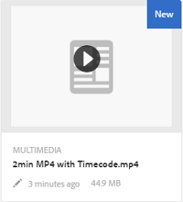

# Videoassets beheren {#managing-video-assets}

Leer hoe u de video-elementen beheert en bewerkt in Adobe Experience Manager (AEM) Assets. Raadpleeg ook de documentatie bij Dynamic Media Video als u een licentie hebt voor het gebruik van Dynamic Media.

## Video-elementen uploaden en voorvertonen {#uploading-and-previewing-video-assets}

AEM Assets genereert voorvertoningen voor video-elementen met de extensie MP4. Als de indeling van het element niet MP4 is, installeert u het MPEG-pakket om een voorvertoning te genereren. MPEG maakt video-uitvoeringen van het type OGG en MP4. U kunt deze uitvoeringen voorvertonen in de gebruikersinterface van AEM Assets.

1. Navigeer in de map Digital Assets of in de submappen naar de locatie waar u digitale elementen wilt toevoegen.
1. Als u het element wilt uploaden, klikt of tikt u **[!UICONTROL Create]** op de werkbalk en kiest u **[!UICONTROL Files]**. U kunt het ook rechtstreeks in het gebied met elementen neerzetten. Zie Elementen  uploaden voor meer informatie over het uploaden.
1. Tik op de **[!UICONTROL Play]** knop op het video-element om een voorvertoning van een video weer te geven in de kaartweergave.

   

   U kunt video alleen in de **[!UICONTROL Card]** weergave pauzeren of afspelen. De knop Afspelen/Pauzeren is niet beschikbaar in de **[!UICONTROL List]** weergave.

1. Tik op het **[!UICONTROL Edit]** pictogram op de kaart om een voorvertoning van de video in de **[!UICONTROL Details]** weergave weer te geven.

   De video wordt afgespeeld in de native videospeler van de browser. U kunt de video afspelen, pauzeren, het volume bepalen en op het volledige scherm in- of uitzoomen.

   

## Configuratie voor het uploaden van middelen die groter zijn dan 2 GB {#configuration-to-upload-video-assets-that-are-larger-than-gb}

Standaard kunt u met de AEM Assets geen elementen uploaden die groter zijn dan 2 GB vanwege een maximale bestandsgrootte. U kunt deze limiet echter overschrijven door naar CRXDE Lite te gaan en een knooppunt onder de `/apps` map te maken. Het knooppunt moet dezelfde knooppuntnaam, directorystructuur en vergelijkbare knooppunteigenschappen van volgorde hebben.

Naast de AEM Assets-configuratie wijzigt u de volgende configuraties om grote elementen te uploaden:

* Verhoog de vervaltijd van het token. Zie [!UICONTROL Adobe Granite CSRF Servlet] in webconsole op `https://[aem_server]:[port]/system/console/configMgr`. Zie [CSRF-bescherming](/help/sites-developing/csrf-protection.md)voor meer informatie.
* Verhoog de `receiveTimeout` configuratie van Dispatcher. Voor meer informatie, zie de configuratie [van de Verzender van de](https://docs.adobe.com/content/help/en/experience-manager-dispatcher/using/configuring/dispatcher-configuration.html#renders-options)Experience Manager.

>[!NOTE]
>
>De AEM Klassieke gebruikersinterface heeft geen beperking voor de bestandsgrootte van twee gigabyte. Bovendien wordt de end-to-end workflow voor grote video niet volledig ondersteund.

Voer de volgende stappen in de `/apps` map uit om een hogere maximale bestandsgrootte te configureren.

1. Tik in AEM op **[!UICONTROL Tools > General > CRXDE Lite]**.
1. Navigeer op de **[!UICONTROL CRXDE Lite]** pagina in het mappenvenster aan de linkerkant naar `/libs/dam/gui/content/assets/jcr:content/actions/secondary/create/items/fileupload`. Tik op `>>` het pictogram om het directoryvenster weer te geven.
1. From the toolbar, tap **[!UICONTROL Overlay Node]**. U kunt ook **[!UICONTROL Overlay Node]** selecteren in het contextmenu.
1. Tik in het dialoogvenster **[!UICONTROL Overlay Node]** op **[!UICONTROL OK]**.

   

1. Vernieuw de browser. Het bedekkingsknooppunt `/jcr_root/apps/dam/gui/content/assets/jcr:content/actions/secondary/create/items/fileupload` is geselecteerd.
1. Voer op het **[!UICONTROL Properties]** tabblad de juiste waarde in bytes in om de maximale grootte tot de gewenste grootte te verhogen. Voer bijvoorbeeld de volgende waarde in om de maximale grootte van 30 GB te verhogen:

   `{sizeLimit : "32212254720"}`

1. From the toolbar, tap **[!UICONTROL Save All]**.
1. Tik in AEM op **[!UICONTROL Tools > Operations > Web Console]**.
1. Zoek en tik op de **[!UICONTROL Adobe Experience Manager Web Console Bundles]** pagina onder de **[!UICONTROL Name]** kolom van de tabel **[!UICONTROL Adobe Granite Workflow External Process Job Handler]**.
1. Stel in de **[!UICONTROL Adobe Granite Workflow External Process Job Handler]** pagina de seconden voor zowel **[!UICONTROL Default Timeout]** als **[!UICONTROL Max Timeout]** velden in op `18000` (vijf uur).
1. Tik op **[!UICONTROL Save]**.
1. Tik in AEM op **[!UICONTROL Tools > Workflow > Models]**.
1. Selecteer op de **[!UICONTROL Workflow Models]** pagina de optie **[!UICONTROL Dynamic Media Encode Video]** en tik op **[!UICONTROL Edit]**.
1. Tik op de **[!UICONTROL Workflow]** pagina op de **[!UICONTROL Dynamic Media Video Service Process]** component.
1. In the **[!UICONTROL Step Properties]** dialog box, under the **[!UICONTROL Common]** tab, expand **[!UICONTROL Advanced Settings]**.
1. Geef in het veld **[!UICONTROL Timeout]** een waarde op van `18000` en tik vervolgens op **[!UICONTROL OK]** om terug te keren naar de workflowpagina **[!UICONTROL Dynamic Media Encode Video]**.
1. Tik boven aan de pagina onder de **[!UICONTROL Dynamic Media Encode Video]** paginatitel op **[!UICONTROL Save]**.

## Video-elementen publiceren {#publishing-video-assets}

Nadat uw video-elementen zijn gepubliceerd, kunt u ze als URL of insluiting op een webpagina opnemen in een webpagina. Zie Elementen publiceren.

## Video-elementen notities aanbrengen {#annotating-video-assets}

1. Tik in de middelenconsole op het **[!UICONTROL Edit]** pictogram op de elementenkaart om de pagina met elementdetails weer te geven.
1. Tik op het **[!UICONTROL Preview]** pictogram om de video af te spelen.
1. Tik op de **[!UICONTROL Annotate]** knop om de video een notitie te geven. Er wordt een aantekening toegevoegd op het specifieke tijdpunt (frame) in de video.

   Tijdens het notiteren kunt u tekenen op het canvas en een opmerking toevoegen aan de tekening. Opmerkingen worden automatisch opgeslagen in Adobe Experience Manager Assets.

   

   Tik op **[!UICONTROL Close]** om de wizard Annotatie af te sluiten.

1. To jump to a specific point in the video, specify the time in seconds in the text field and click **[!UICONTROL Jump]**. For example, to skip the first 10 seconds of video, enter `20` in the text field.

   

1. Klik op een annotatie om deze in de tijdlijn weer te geven. Tik **[!UICONTROL Delete]** om de annotatie uit de tijdlijn te verwijderen.

   
