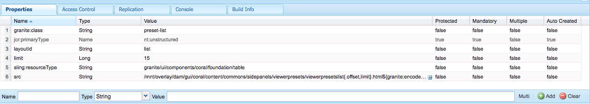

# Managing Dynamic Media viewer presets {#managing-viewer-presets}

Een voorinstelling voor een dynamische mediasviewer is een verzameling instellingen die bepalen hoe gebruikers multimedia-elementen op hun computerschermen en mobiele apparaten weergeven. Beheerders kunnen voorinstellingen voor viewers maken. Er zijn instellingen beschikbaar voor een array met viewerconfiguratieopties. U kunt bijvoorbeeld de weergavegrootte of het zoomgedrag van de viewer wijzigen.

Raadpleeg de *Adobe Scene7 HTML5 Viewer SDK* voor instructies over het maken en aanpassen van uw eigen voorinstellingen voor HTML5-viewers. De SDK is beschikbaar op de IS-publicatieserver die is ingesloten in de SDK zelf. Elke bibliotheekversie heeft zijn eigen documentatie van SDK inbegrepen.

Path: `<scene7_domain>/s7sdk/<library_version>/docs/jsdocs/index.html`.\
3.5 SDK: [https://s7d1.scene7.com/s7sdk/3.5/docs/jsdoc/index.html](https://s7d1.scene7.com/s7sdk/3.5/docs/jsdoc/index.html)

Zie ook de [Adobe Viewers Reference Guide](https://docs.adobe.com/content/help/en/dynamic-media-developer-resources/library/home.html).

In deze sectie wordt beschreven hoe u voorinstellingen voor viewers kunt maken, bewerken en beheren. U kunt een viewervoorinstelling op elk gewenst moment op een element toepassen. Zie Voorinstellingen [voor viewers](viewer-presets.md)toepassen.

>[!NOTE]
>
>Houd er rekening mee dat het bewerken van *vooraf gedefinieerde, voorinstellingen* voor viewers buiten de box geen ondersteund scenario is. Als u probeert een voorinstelling voor een viewer buiten het vak te bewerken, wordt u gevraagd de voorinstelling van de viewer op te slaan onder een andere naam.

## Toetsenbordtoegankelijkheid voor viewers {#keyboard-accessibility-for-viewers}

Alle viewers die niet in de verpakking zijn opgenomen, ondersteunen toegankelijkheid van het toetsenbord.

Zie ook Toegankelijkheid [en navigatie](https://docs.adobe.com/content/help/en/dynamic-media-developer-resources/library/c-keyboard-accessibility.html)van toetsenbord.

## Managing Dynamic Media viewer presets {#managing-presets}

You can add, edit, delete, publish, unpublish, and preview viewer presets in AEM by tapping **[!UICONTROL Tools > Assets > Viewer Presets]**.

>[!NOTE]
>
>Standaard geeft het systeem 15 voorinstellingen voor viewers weer wanneer u Viewers selecteert in de gedetailleerde weergave van elementen. U kunt deze limiet verhogen. Zie [Het aantal weergegeven viewervoorinstellingen verhogen](#increasing-the-number-of-viewer-presets-that-display).

## Viewer-ondersteuning voor responsieve webpagina&#39;s {#viewer-support-for-responsive-designed-web-pages}

Verschillende webpagina&#39;s hebben verschillende behoeften. Soms wilt u bijvoorbeeld een webpagina die een koppeling bevat waarmee de HTML5 Viewer wordt geopend in een apart browservenster. In andere gevallen kan het nodig zijn de HTML5 Viewer rechtstreeks in te sluiten op de hostpagina. In het laatste geval kan de webpagina een statische indeling hebben. Of kan het *reageren* en anders weergeven op verschillende apparaten of voor verschillende venstergrootten in de browser. Om aan deze behoeften tegemoet te komen, ondersteunen alle vooraf gedefinieerde, kant-en-klare HTML5 Viewers die bij Dynamic Media worden geleverd zowel statische webpagina&#39;s als responsieve webpagina&#39;s.

Zie de bibliotheek met [responsieve afbeeldingen](https://docs.adobe.com/content/help/en/dynamic-media-developer-resources/image-serving-api/image-serving-api/responsive-static-image-library/c-about-responsive-static-image-library.html) in de Help bij *de API voor* beeldbewerking voor meer informatie over het insluiten van responsieve viewers op uw webpagina&#39;s.

>[!NOTE]
>
>Houd er rekening mee dat u alle viewers uit de verpakking moet publiceren voordat u ze voor het eerst gebruikt.\
>Zie Voorinstellingen [van viewer publiceren.](#publishing-viewer-presets)

## Systeemcompatibiliteit met voorinstellingen van viewer  {#viewer-preset-system-compatibility}

Alle voorinstellingen van de out-of-the-box Viewer die bij Dynamische media worden geleverd, zijn volledig compatibel met de volgende systemen:

* Desktops
* Apple iPhone
* Apple iPad
* Android Smartphone
* Android-tablet
* Voor video wordt extra ondersteuning voor het afspelen van MP4 geboden voor [Blackberry](https://developer.blackberry.com/devzone/develop/supported_media/bb_media_support_at_a_glance.html#kba1328730952678) en [Windows Phone 8](https://msdn.microsoft.com/library/windows/apps/ff462087%28v=vs.105%29.aspx).

### Rijke mediatypen voor viewervoorinstellingen {#rich-media-types-for-viewer-presets}

Beheerders kunnen de volgende rich media-typen toevoegen en aanpassen bij het maken van nieuwe viewervoorinstellingen.

| Rijke mediatypen | Beschrijving |
|:---|:---|
| **Carousel-set** | Hotspots of afbeeldingen met hyperlinks of beide worden toegevoegd aan een reeks van twee of meer afbeeldingen. Een klant kan de afbeeldingen naar links of rechts pannen en vervolgens op een hotspot op een afbeelding klikken voor meer informatie of voor directe aankoop van de categorie, de startpagina of de bestemmingspagina&#39;s van een website. |
| **Zoomen met flyout** | Hiermee geeft u een tweede afbeelding van het ingezoomde gebied weer naast de oorspronkelijke afbeelding. Er zijn geen besturingselementen om te gebruiken. Gebruikers verplaatsen de selectie over het gebied dat ze willen weergeven. |
|  | Houd er bij het bepalen van het totale bandbreedtegebruik voor deze viewer rekening mee dat zowel de hoofdafbeelding als de vervolgafbeelding in de viewer worden weergegeven. De grootte van de vervolgafbeelding wordt bepaald door de grootte van de hoofdafbeelding (breedte en hoogte van werkgebied) en de zoomfactor. Als u wilt voorkomen dat de flyout-bestandsgrootte te groot wordt, brengt u de volgende twee waarden met elkaar in evenwicht: Als u een grote hoofdafbeeldingsgrootte hebt, verlaagt u de waarde voor Zoomfactor. (De breedte en hoogte van de Flyout bepalen de grootte van het wegvliegvenster, maar niet de grootte van het vliegend beeld dat aan de kijker wordt gediend.) |
|  | Als de hoofdafbeelding bijvoorbeeld 350 x 350 pixels groot is, met een zoomfactor van 3, is de resulterende uitvliegafbeelding 1050 x 1050 pixels. Als de hoofdafbeeldingsgrootte 300 x 300 pixels is, met een zoomfactor van 4, is de vervolgafbeelding 1200 x 1200 pixels. Afhankelijk van de kwaliteitsinstelling voor JPEG (de aanbevolen instellingen liggen tussen 80 en 90), kunt u de bestandsgrootte aanzienlijk verkleinen. De aanbevolen zoomfactoren zijn 2,5 tot 4, afhankelijk van de grootte van de hoofdafbeelding. |
| **Inline zoomen** | Hiermee geeft u een afbeelding weer van het ingezoomde gebied in de oorspronkelijke viewer. Er zijn geen besturingselementen om te gebruiken. Gebruikers verplaatsen de selectie dus over het gebied dat ze willen weergeven. |
| **Afbeeldingsset** | In de Vastgestelde kijker van het Beeld, kunnen de gebruikers verschillende meningen of kleurenvariaties van een punt zien door een duimnagelbeeld te klikken. Deze viewer beschikt ook over zoomgereedschappen waarmee u afbeeldingen nauwkeurig kunt bekijken. |
| **Interactieve afbeelding** | Hotspots worden toegevoegd aan gedeelten van een afbeelding waarop een klant kan klikken voor meer informatie of voor directe aankoop van de categorie, de startpagina of de bestemmingspagina&#39;s van een website. |
| **Interactieve video** | Miniaturen worden toegevoegd aan tijdlijnsegmenten in een video waarop een klant vervolgens kan klikken voor meer informatie of voor het rechtstreeks kopen vanaf de categorie, de startpagina of de bestemmingspagina van een website. |
| **Gemengde media** | Hiermee geeft u verschillende typen media weer in één viewer. U kunt centrifuges, afbeeldingssets, afbeeldingen en video&#39;s opnemen. |
| **Panoramische afbeelding** | Met de Panoramische afbeelding en de Panoramische VR-viewers worden bolvormige panoramische afbeeldingen weergegeven zodat gebruikers deze kunnen bekijken in een 360°-kijkervaring van een ruimte, eigenschap, locatie of landschap. |
|  | Een geüploade afbeelding kan alleen als een bolvormig panorama worden beschouwd als de afbeelding een van de volgende opties of beide heeft: <ul><li>Een hoogte-breedteverhouding van 2:1.</li><li>Gelabeld met de trefwoorden equirechthoekig, bolvormig en panorama, of bolvormig en panoramisch. Zie [Tags](../sites-authoring/tags.md)gebruiken.</li></ul> |
|  | Zowel de hoogte-breedteverhouding als de trefwoordcriteria zijn van toepassing op panoramische elementen voor de pagina met elementdetails en de WCM-component &quot;Panoramische media&quot;. |
|  | Belangrijk: Deze viewer is alleen beschikbaar in de modus Dynamische media - Scene7. |
| **Set draaien** | Biedt meerdere weergaven van een afbeelding, zodat gebruikers het object kunnen draaien om de verschillende zijden en hoeken te bekijken. |
| **Video** | Speelt video af met progressieve of adaptieve bitsnelheidstreaming. Bij adaptieve bitsnelheidstreaming worden automatisch apparaat- en bandbreedtedetectie uitgevoerd voor de juiste videokwaliteit in de juiste indeling. |
| **Verticaal zoomen** | Met de verticale zoomviewer kunt u een productafbeeldingsweergave maximaliseren, zodat uw gebruikers de beste weergave van een product krijgen. De verticale locatie van stalen doet het volgende: <ul><li>Hiermee zorgt u dat de stalen zich boven de vouw bevinden. Bij horizontale stalen waren, afhankelijk van de grootte van het ’, stalen pas zichtbaar wanneer de gebruiker de pagina omlaag schuift. Door de stalen verticaal in de viewer te plaatsen, weet u zeker dat ze zichtbaar zijn, ongeacht de schermgrootte van de gebruiker.</li><li>Maximaliseert de hoofdafbeeldingsgrootte. Met horizontale stalen is het nodig ruimte op de pagina te reserveren om ervoor te zorgen dat deze zichtbaar zijn. Hierdoor nam de grootte van de hoofdafbeelding af. Met een verticale staallay-out hoeft u deze ruimte echter niet toe te wijzen. Op die manier kunt u de grootte van de hoofdafbeelding maximaliseren.</li></ul> |
| **In-/uitzoomen** | Hiermee kunnen gebruikers inzoomen op het gebied door erop te klikken. Gebruikers kunnen op besturingselementen klikken om in te zoomen, uit te zoomen en de standaardgrootte van de afbeelding te herstellen. |

## Lijst met voorinstellingen voor viewers die buiten de box vallen {#list-of-out-of-the-box-viewer-presets}

In de volgende tabel worden alle voorinstellingen voor vooraf gedefinieerde, out-of-box viewers weergegeven die bij Dynamische media worden geleverd.

Zie ook [Live demos](https://landing.adobe.com/en/na/dynamic-media/ctir-2755/live-demos.html).

Voor informatie over ondersteunde webbrowsers en besturingssysteemversies voor Viewers kunt u de Opmerkingen bij de release Viewers bekijken.

Zie Opmerkingen *bij de release van* Viewers in de inhoudsopgave van de [Viewers Reference Guide](https://docs.adobe.com/content/help/en/dynamic-media-developer-resources/library/home.html).

>[!NOTE]
>
>Alle voorinstellingen voor viewers die niet in de box staan, zijn al geactiveerd (ingeschakeld), maar moeten wel worden gepubliceerd.\
>Zie Voorinstellingen [voor](#publishing-viewer-presets)viewers publiceren.
>
>Alle nieuwe viewervoorinstellingen die u maakt en toevoegt, moeten zowel worden geactiveerd *als* gepubliceerd.\
>Zie Voorinstellingen [van viewer](#activating-or-deactivating-viewer-presets) activeren of deactiveren en Voorinstellingen [van viewer](#publishing-viewer-presets)publiceren.

| Titel van voorinstelling van viewer | Type | CSS-bestandsnaam |
|:---|:---|:---|
| Carrousel_Gestippeld_donker | Carousel_Set | html5_carouselviewer_dotted_black.css |
| Carrousel_Gestippeld_licht | Carousel_Set | html5_carouselviewer_dotted_light.css |
| Carousel_Numeric_dark | Carousel_Set | html5_carouselviewer_numeric_donker.css |
| Carousel_Numeric_light | Carousel_Set | html5_carouselviewer_numeric_light.css |
| Flyout | Flyout_Zoom | html5_flyoutviewer.css |
| Afbeeldingsset_donker | Afbeeldingsset | html5_zoomviewer_dark.css |
| ImageSet_light | Afbeeldingsset | html5_zoomviewer_light.css |
| InlineMixedMedia_donker | Gemengd_Media | html5_inlinemixedmediaviewer_dark.css |
| InlineMixedMedia_light | Gemengd_Media | html5_inlinemixedmediaviewer_light.css |
| InlineZoom | Flyout_Zoom | html5_inlinezoomviewer.css |
| GemengdMedia_donker | Gemengd_Media | html5_mixedmediaviewer_dark.css |
| GemengdMedia_licht | Gemengd_Media | html5_mixedmediaviewer_light.css |
| PanoramaImage | Panorama_Afbeelding | html5_panoramicimage.css |
| PanoramaImageVR | Panorama_Afbeelding | html5_panoramicimage.css |
| Shopable_Banner | Interactive_Image | html5_interactiveimage.css |
| Shopable_Video_black | Interactive_Video | html5_interactivevideoviewer_donker.css |
| Shopable_Video_light | Interactive_Video | html5_interactivevideower_light.css |
| SpinSet_donker | Spin_set | html5_spinviewer_dark.css |
| SpinSet_light | Spin_set | html5_spinviewer_light.css |
| Video (inclusief ondersteuning voor ondertiteling) | Video | html5_videoViewer.css |
| Video_social (inclusief ondersteuning voor ondertiteling en sociale media) | Video | html5_videoviewersocial.css |
| Zoomen_donker | In-/uitzoomen | html5_basiczoomviewer_dark.css |
| Zoomen_licht | In-/uitzoomen | html5_basiczoomviewer_light.css |
| ZoomenVerticaal_donker | Verticaal_Zoomen | html5_zoomverticalviewer_donker.css |
| ZoomVertical_light | Verticaal_Zoomen | html5_zoomverticalviewer_light.css |

### Matrix voor ondersteunde mobiele viewers {#supported-mobile-viewers-gestures-matrix}

In de volgende tabel worden de bewegingen van de mobiele viewer weergegeven die worden ondersteund op iOS-, Android 2.x- en Android 3.x-apparaten.

| Gesture | Zoomen met flyout | In-/uitzoomen | Draaien |
|---|---|---|---|
| **Slepen** | Pannen | Pannen | Pannen |
| **Tik op** | Flyout-venster tonen | De gebruikersinterface weergeven of verbergen | De gebruikersinterface weergeven of verbergen |
| **Dubbeltikken** | Niet van toepassing | Inzoomen of voorinstellingen | Inzoomen of voorinstellingen |
| **Kneep open** | Niet van toepassing | Inzoomen (alleen iOS en Android, 3x) | Inzoomen (alleen iOS en Android, 3x) |
| **Kneep dicht** | Niet van toepassing | Uitzoomen (alleen iOS en Android, 3x) | Uitzoomen (alleen iOS en Android, 3x) |
| **Veeggebaar** | Schuift de staalbalk | Afbeeldingen schuiven | Spinnen |
| **Vlikken** | Schuift de staalbalk | Afbeeldingen schuiven | Spinnen |

## Het aantal voorinstellingen van de Dynamic Media-viewer dat wordt weergegeven verhogen {#increasing-the-number-of-viewer-presets-that-display}

AEM toont een groot aantal viewervoorinstellingen wanneer u elementen weergeeft van **[!UICONTROL Detail View > Viewers]**. U kunt het aantal weergegeven viewers verhogen of verlagen.

**U kunt als volgt het aantal voorinstellingen van de Dynamic Media-viewer dat wordt weergegeven** verhogen:

1. Navigeer naar **[!UICONTROL CRXDE Lite]** ([http://localhost:4502/crx/de](http://localhost:4502/crx/de)).
1. Ga naar het keuzerondje met voorinstellingen voor viewer op `/libs/dam/gui/coral/content/commons/sidepanels/viewerpresets/viewerpresetslist`

   

1. Wijzig in de eigenschap **[!UICONTROL limit]** de **[!UICONTROL Value]**, die standaard op 15 is ingesteld, in het gewenste getal.
1. Navigeer naar de vooraf ingestelde gegevensbron voor de viewer op `/libs/dam/gui/coral/content/commons/sidepanels/viewerpresets/viewerpresetslist/datasource`

   

1. Wijzig in de **[!UICONTROL limit]** eigenschap het getal in het gewenste getal, bijvoorbeeld `{empty requestPathInfo.selectors[1] ? "20" : requestPathInfo.selectors[1]}`
1. Tik op **[!UICONTROL Save All]**.

## Een nieuwe voorinstelling voor een dynamische mediasviewer maken {#creating-a-new-viewer-preset}

Door viewervoorinstellingen te maken, kunt u verschillende instellingen toepassen op weergave en interactie met elementen. U hoeft echter geen nieuwe voorinstellingen voor viewers te maken. Desgewenst kunt u de standaardvoorinstellingen voor viewers gebruiken die al bij AEM Assets worden geleverd.

Als u een nieuwe viewervoorinstelling maakt nadat u deze hebt opgeslagen, wordt de status van de viewer automatisch geactiveerd (ingesteld op **Aan**) op de **[!UICONTROL Viewer Presets]** pagina. Deze status betekent dat de component en de **[!UICONTROL Dynamic Media]** **[!UICONTROL Interactive Media]** component zichtbaar zijn en dat een afbeelding of video wordt voorvertoond.

Sommige voorinstellingen voor viewers hebben exclusieve instellingen die het gebruik en het algemene gedrag van de viewer kunnen beïnvloeden. Afhankelijk van de viewervoorinstelling die u maakt, is het verstandig rekening te houden met deze speciale overwegingen.

Zie [Speciale overwegingen voor het maken van een voorinstelling](#special-considerations-for-creating-an-interactive-viewer-preset)voor een interactieve viewer.

Zie [Speciale overwegingen voor het maken van een voorinstelling](#special-considerations-for-creating-a-carousel-banner-viewer-preset)voor de Carousel Banner Viewer.

**Een nieuwe voorinstelling** voor een dynamische mediasviewer maken:

1. In the upper-left corner of AEM, tap the AEM logo, then in the left rail, tap **[!UICONTROL Tools > Assets > Viewer Presets]**.

   

1. Tik op de **[!UICONTROL Viewer Presets]** pagina op de werkbalk **[!UICONTROL Create]**.
1. In the **[!UICONTROL New Viewer Preset]** dialog box, in the **[!UICONTROL Preset Name]** field, enter the name of the new preset. Choose a name carefully--they are not editable after you tap **[!UICONTROL Create]**.

   Wanneer u de voorinstelling later in deze stappen opslaat, wordt de naam weergegeven op de pagina Voorinstellingen viewer onder de **[!UICONTROL Preset Title]** kolomkop.

1. Selecteer in het **[!UICONTROL Rich Media Type]** keuzemenu het type voorinstelling voor de viewer dat u wilt maken en tik vervolgens in de rechterbovenhoek van de pagina op **[!UICONTROL Create]**.

   Zie [Rijke mediatypen voor voorinstellingen](#rich-media-types-for-viewer-presets)van viewer.

1. On the **Edit Viewer Preset** page, tap the **[!UICONTROL Appearance]** tab.
1. Voer een van de volgende handelingen uit:

   * In the **[!UICONTROL Selected Type]** pull-down menu, select a component whose visual design you want to customize. U kunt ook op elk visueel element in de viewer tikken om het te selecteren voor configuratie.

      Met de visuele editor kunt u zien welk effect een bepaalde eigenschap heeft op een stijl. Stel een eigenschap in of pas deze aan om direct te zien welk effect het heeft op de viewer met behulp van het voorbeeld links van de editor.

      De CSS-opmaakeigenschappen voor elk type voorinstelling voor viewers worden beschreven in het Help-onderwerp &quot;Customizing *&lt;viewer_name>* Viewer&quot; in de naslaggids [voor](https://docs.adobe.com/content/help/en/dynamic-media-developer-resources/library/home.html)viewers.

      Als u bijvoorbeeld een viewervoorinstelling van het type maakt, raadpleegt u `Mixed_Media`Gemengde Media Viewer  aanpassen voor een lijst en beschrijving van elke eigenschap.

   * Als u stijlinstellingen hebt gedefinieerd in een afzonderlijk CSS-bestand, kunt u het CSS-bestand uploaden naar AEM Assets. Tap **[!UICONTROL Import CSS]** below the **[!UICONTROL Selected Type]** pull-down menu (you may need to scroll the visual editor up to see it) to find the uploaded CSS file and associate it with the viewer preset.

      Wanneer u een CSS-bestand importeert, controleert de visuele editor of de CSS de juiste viewermarkeringen gebruikt. Als u bijvoorbeeld een zoomviewer maakt, moeten alle CSS-regels die u importeert, worden gedefinieerd met de naam van de viewerklasse die is gedefinieerd op een bovenliggend viewerelement. `.s7mixedmediaviewer`

      U kunt willekeurige, handgemaakte CSS importeren zolang deze de CSS-markeringen voor een bepaalde viewer correct definieert. (CSS-markeertekens worden beschreven in het Help-onderwerp &quot;Aanpassen *&lt;viewernaam>* Viewer&quot; in de naslaggids [voor](https://docs.adobe.com/content/help/en/dynamic-media-developer-resources/library/home.html)viewers. Als u bijvoorbeeld wilt lezen over CSS-markeringen voor de Zoomviewer, raadpleegt u [Zoomviewer](https://docs.adobe.com/content/help/en/dynamic-media-developer-resources/library/viewers-aem-assets-dmc/zoom/customizing-zoom/c-html5-20-zoom-viewer-customizingviewer.html)aanpassen.) Het is echter mogelijk dat de visuele editor bepaalde CSS-waarden niet begrijpt. In dergelijke gevallen probeert de visuele editor de fouten te negeren zodat de CSS nog steeds werkt.
   >[!NOTE]
   >
   >If you prefer to edit the CSS directly in its raw form, tap **[!UICONTROL Show/Hide CSS]** below the **[!UICONTROL Selected Type]** pull-down menu (you may need to scroll the visual editor up to see it).
   >
   >Net als de visuele editor kunt u direct in de CSS een wijziging aanbrengen in een eigenschap en zo zien welk effect dit heeft op het viewervoorbeeld. En, wordt dat zelfde bezit automatisch bijgewerkt tezelfdertijd in de visuele redacteur. Als zodanig kunt u de onbewerkte CSS-editor of de visuele editor gebruiken, of beide door elkaar gebruiken.

   >[!NOTE]
   >
   >Voor knopillustraties kiest u de 2x-afbeelding en uploadt u illustraties met hoge resolutie. Wanneer u werkt met interactieve afbeeldingen en schokkende banners, kunt u ook verschillende hotspotknoppen uit de doos selecteren.

1. (Optional) Near the top of the **[!UICONTROL Edit Viewer Preset]** page, tap **[!UICONTROL Desktop]**, **[!UICONTROL Tablet]**, or **[!UICONTROL Phone]** to uniquely define visual styles for different device and screen types.
1. Tik op het tabblad **[!UICONTROL Edit Viewer Preset]** Gedrag **op de** pagina. U kunt ook op een visueel element in de viewer tikken of erop klikken om het voor de configuratie te selecteren.
1. Selecteer in het vervolgkeuzemenu **[!UICONTROL Selected Type]** een component waarvan u het gedrag wilt wijzigen.

   Veel componenten in de visuele editor hebben een gedetailleerde beschrijving. Deze beschrijvingen worden weergegeven in blauwe vakken wanneer u een component uitbreidt om de bijbehorende parameters weer te geven.

   Some Viewer types have components that let you specify Image Serving commands in an **IS Command** text field. Zie de [Referentie van de API voor het leveren van afbeeldingen](https://docs.adobe.com/content/help/en/dynamic-media-developer-resources/image-serving-api/image-serving-api/c-is-home.html) voor een lijst met opdrachten die u kunt gebruiken.

   >[!NOTE]
   >
   >**Als u een aanraakapparaat gebruikt, zoals een telefoon of tablet...**
   >
   >Nadat u een waarde in het tekstveld hebt getypt, tikt u ergens anders in de gebruikersinterface om de wijziging te verzenden en sluit u het virtuele toetsenbord. Als u tikt **[!UICONTROL Enter]**, vindt er geen actie plaats.

1. Near the upper-right corner of the page, tap **[!UICONTROL Save]**.
1. Publiceer uw nieuwe viewervoorinstelling. U moet de voorinstelling publiceren voordat u deze op uw website kunt gebruiken.

   Zie Voorinstellingen [voor](#publishing-viewer-presets)viewers publiceren.

## Speciale overwegingen voor het maken van een voorinstelling voor een interactieve viewer {#special-considerations-for-creating-an-interactive-viewer-preset}

**Informatie over weergavemodi voor afbeeldingsminiaturen in het deelvenster**

When you create or edit an Interactive Video viewer preset, you have the choice of which **[!UICONTROL Display Mode]** setting to use when you select `InteractiveSwatches` from the **[!UICONTROL Selected Component]** pull-down menu under the **[!UICONTROL Behavior]** tab. De gekozen weergavemodus bepaalt hoe en wanneer miniaturen worden weergegeven terwijl de video wordt afgespeeld. You can choose either a `segment`display mode (default) or a `continuous`display mode.

| Weergavemodus | Beschrijving |
|---|---|
| [!UICONTROL Segment] | [!UICONTROL Segment] is de standaardweergavemodus voor de voorinstellingen Shopable_Video_light en Shopable_Video_donker voor de uit-van-box Interactieve video-viewer en alle interactieve voorinstellingen van de video-viewer die u zelf maakt. |
|  | Als er in deze modus minder miniaturen zijn toegewezen aan een videosegment dan het aantal zichtbare vlekken in het weergavevenster, worden miniaturen van de volgende of vorige subsegmenten niet naar de lege vlekken in het deelvenster getrokken. Met andere woorden, het behoudt de weergave van stalen die aan het specifieke videosegment zijn toegewezen. |
| [!UICONTROL Continuous] | Als in de [!UICONTROL Continuous] weergavemodus het aantal miniaturen in een segment kleiner is dan het aantal dat in het deelvenster zichtbaar is, neemt de viewer automatisch de weergave van miniaturen van het volgende segment of van het vorige segment op wanneer de laatste miniatuur wordt weergegeven. |

**Het gedrag Automatisch schuiven in de interactieve video-viewer**

Het gedrag voor automatisch schuiven van miniaturen in de Interactieve videoviewer werkt onafhankelijk van de gekozen weergavemodus.

When you create or edit an interactive video viewer preset, you access **[!UICONTROL Auto Scroll]** from the **[!UICONTROL Behavior]** tab. Tik in het tabblad Gedrag vanuit het vervolgkeuzemenu **[!UICONTROL Selected Components]** op **[!UICONTROL InteractiveSwatches]**. The **[!UICONTROL Auto Scroll]** check box is listed below the IS Command text field.

Als u **[!UICONTROL Auto Scroll]** uitschakelt (het selectievakje wist) in de viewervoorinstelling, wordt tijdens het afspelen van video door de gebruiker in het deelvenster alleen de eerste miniatuurafbeelding voor de volledige lengte van de video weergegeven. Een gebruiker kan echter desgewenst handmatig door de miniaturen bladeren met de pictogrammen pijl-omhoog en pijl-omlaag.

Wanneer u **[!UICONTROL Auto Scroll]** inschakelt (selecteert) in de viewervoorinstelling, schuiven miniatuurafbeeldingen die aan een videosegment zijn toegewezen tijdens het afspelen van de video naar het begin van een segment. Er zijn echter gevallen waarin bepaalde miniaturen in een segment tweemaal zo lang worden weergegeven als andere miniaturen ervoor of erna. Dit gedrag treedt op omdat het aantal miniaturen in een segment groter is dan het aantal dat zichtbaar is in het deelvenster en dat aantal niet gelijkmatig kan worden verdeeld.

Stel dat u een videosegment van 30 seconden hebt om dit te illustreren. En er zijn in totaal negen miniaturen die gedurende de 30 seconden moeten worden weergegeven. De grootte van de browser is zodanig dat er vier zichtbare miniatuurposities in het weergavevenster aanwezig zijn. Het 30 tweede videotijdsegment wordt verdeeld in drie subsegmenten. In de volgende tabel wordt de verdeling weergegeven van de miniaturen voor een bepaald tijdsubsegment:

| **Subsegment video** | **Tijd van subsegment in seconden** | **Miniaturen die zichtbaar zijn in het deelvenster** |
|---|---|---|
| 1 | 0-10 | 1, 2, 3, 4 |
| 2 | 10-20 | 4, 5, 6, 7 |
| 3 | 20-30 | 6, 7, 8, 9 |

Subsegment video 3 reikt niet verder dan de miniaturen die eraan zijn toegewezen. De miniaturen 4, 6 en 7 zijn twee keer zo lang in het deelvenster zichtbaar als de andere miniaturen.

De logica die de viewer gebruikt voor het aantal miniaturen dat in het deelvenster wordt weergegeven op basis van het aantal beschikbare posities is als volgt:

* Aantal subsegmenten = afgerond tot het volgende subsegment (aantal miniaturen/aantal zichtbare sleuven in het deelvenster met miniaturen, op basis van de grootte van het browservenster).

   Aan de hand van het voorbeeld in de bovenstaande tabel 9 miniaturen / 4 sleuven = 2,25; De viewerlogica rondt deze tot drie subsegmenten.

* Aantal miniaturen = afgerond tot op de volgende miniatuur (aantal miniaturen / aantal videosubsegmenten).

   In het bovenstaande voorbeeld worden 9 miniaturen / 3 videosubsegmenten = 3 miniaturen gebruikt.

* Duur van het subsegment = totale videoduur / aantal videosubsegmenten.

   Met behulp van het voorbeeld in de bovenstaande tabel, 30 seconden/3 video-subsegmenten = 10 seconden weergave van elk videosubsegment.

### Speciale overwegingen voor het maken van een voorinstelling voor de Carousel Banner-viewer {#special-considerations-for-creating-a-carousel-banner-viewer-preset}

Als u voorinstellingen voor de Carousel Banner-viewer maakt, kunt u de stijl van hotspots als volgt wijzigen:

|  | **Beschrijving** | **Acties** |
|---|---|---|
| **Hotspot-pictogram** | Het pictogram voor hotspot wijzigen | Als u de afbeelding van het hotspot-pictogram wilt wijzigen, tikt u op het **[!UICONTROL Appearance]** tabblad in **[!UICONTROL Selected Component]** en op **[!UICONTROL ImageMapEffect]**. Selecteer onder **[!UICONTROL Icon]** de optie **[!UICONTROL Background]** en ga in het veld **[!UICONTROL Image]** naar de gewenste achtergrondafbeelding. |

## Dynamische voorinstellingen van de Media-viewer activeren of deactiveren {#activating-or-deactivating-viewer-presets}

De Viewer-voorinstellingen die beschikbaar zijn in de gebruikersinterface, zijn afhankelijk van de vraag welke voorinstellingen actief zijn in de modus Auteur. Een voorinstelling voor viewers is standaard *ingeschakeld* nadat u deze hebt gemaakt. Als u de voorinstelling uitschakelt, wordt deze niet weergegeven in de modus Auteur. Als de voorinstelling is gepubliceerd. het wordt altijd gepubliceerd , ongeacht of het wordt in - of uitgeschakeld . U kunt voorinstellingen voor viewers desactiveren als de lijst te log wordt of als u niet wilt dat een voorinstelling voor viewers kan worden gebruikt.

**Dynamische voorinstellingen** van de Media-viewer activeren of deactiveren:

1. In the upper-left corner of AEM, tap the AEM logo, then in the left rail, tap **[!UICONTROL Tools > Assets > Viewer Presets]**.
1. Tik op de **[!UICONTROL Viewer Preset]** pagina onder de **[!UICONTROL State]** kolomkop op de schakelknop om een viewervoorinstelling te activeren of te deactiveren.

   De viewervoorinstellingen die worden geactiveerd, worden aan de rechterkant weergegeven, in een blauw vak. bij gedeactiveerde viewervoorinstellingen wordt de schakeloptie links weergegeven, in een lichtgrijs vak.

## Publishing Dynamic Media viewer presets {#publishing-viewer-presets}

Als u de status van een viewervoorinstelling activeert (of inschakelt **), is deze zichtbaar in de component Dynamische media, de component Interactieve media en wanneer u een element weergeeft.

Als u echter een element met een viewervoorinstelling wilt leveren, moet de viewervoorinstelling ook worden gepubliceerd. All viewer presets must be activated *and* published to obtain URL or embed code for an asset. U moet alle standaard viewervoorinstellingen die bij dynamische media worden geleverd, activeren en publiceren. Aangepaste viewervoorinstellingen die u maakt en toevoegt, worden automatisch geactiveerd, maar moeten ook worden gepubliceerd.

Zie Voorinstellingen [van viewers](#activating-or-deactivating-viewer-presets)activeren of deactiveren.

Zie ook [Elementen](previewing-assets.md)voorvertonen.

**Dynamische voorinstellingen** van de Media-viewer publiceren:

1. In the upper-left corner of AEM, tap the AEM logo, then in the left rail, tap **[!UICONTROL Tools > Assets > Viewer Presets]**.
1. Selecteer een of meer voorinstellingen voor viewers die u wilt publiceren.
1. Tik op het **[!UICONTROL Publish]** pictogram op de werkbalk.

## Sorting Dynamic Media viewer presets {#sorting-viewer-presets}

**Dynamische voorinstellingen** van de Media-viewer sorteren:

1. In the upper-left corner of AEM, tap the AEM logo, then in the left rail, tap **Tools** (hammer icon) **[!UICONTROL > Assets > Viewer Presets]**.
1. Klik op **[!UICONTROL Preset Title]**, **[!UICONTROL Type]**, **[!UICONTROL Published]** of **[!UICONTROL State]** om op die kolomkop te sorteren. Klik bijvoorbeeld op **[!UICONTROL Type]** om de typen viewervoorinstellingen in alfabetische of omgekeerd alfabetische volgorde te sorteren.

## Editing Dynamic Media viewer presets {#editing-viewer-presets}

Houd er rekening mee dat het bewerken van *vooraf gedefinieerde, voorinstellingen* voor viewers buiten de box geen ondersteund scenario is. Als u een voorinstelling voor een viewer buiten de box bewerkt, wordt u gevraagd deze op te slaan onder een andere naam.

**Dynamische voorinstellingen** van de Media-viewer bewerken:

1. In the upper-left corner of AEM, tap the AEM logo, then in the left rail, tap **[!UICONTROL Tools > Assets > Viewer Presets]**.
1. Selecteer een voorinstelling door het vakje links van de titel van de voorinstelling voor de viewer in te schakelen.
1. Tik op de werkbalk **[!UICONTROL Edit]**.
1. Breng op de **[!UICONTROL Edit Viewer Preset]** pagina de wijzigingen aan die u in de voorinstelling van de viewer wilt aanbrengen.
1. Voer een van de volgende handelingen uit:

   * Tik **[!UICONTROL Save]** om uw wijzigingen op te slaan en terug te keren naar de **[!UICONTROL Viewer Preset]** pagina.
   * Tik **[!UICONTROL Cancel]** om eventuele wijzigingen die u hebt aangebracht te voorkomen en terug te keren naar de **[!UICONTROL Viewer Preset]** pagina.

## Aangepaste voorinstellingen voor dynamische media-viewer verwijderen {#deleting-custom-viewer-presets}

U kunt Viewer-voorinstellingen verwijderen die u hebt gemaakt en toegevoegd aan dynamische media.

**Aangepaste voorinstellingen** voor dynamische media-viewer verwijderen:

1. In the upper-left corner of AEM, tap the AEM logo, then in the left rail, tap **[!UICONTROL Tools > Assets > Viewer Presets]**.
1. Controleer een **[!UICONTROL Viewer Presets]** pagina op de pagina **[!UICONTROL Preset Title]** en tik op het **[!UICONTROL Trash]** pictogram.
1. Tik op **[!UICONTROL Delete]**.

## Een voorinstelling voor een dynamische mediasviewer toepassen op een element {#applying-a-viewer-preset-to-an-asset}

Als u zowel de asset als de geselecteerde viewer al hebt gepubliceerd, worden de knoppen **[!UICONTROL URL]** en **[!UICONTROL Embed]** weergegeven nadat u een viewervoorinstelling hebt geselecteerd.

**Een voorinstelling voor een dynamische mediasviewer toepassen op een element**:

1. Open het element en tik in de linkerbovenhoek van de pagina op het vervolgkeuzemenu en selecteer **[!UICONTROL Viewers]**.

   >[!NOTE]
   >
   >Als u zowel de asset als de geselecteerde viewer al hebt gepubliceerd, worden de knoppen **[!UICONTROL URL]** en **[!UICONTROL Embed]** weergegeven nadat u een viewervoorinstelling hebt geselecteerd.

1. Selecteer een viewervoorinstelling in het linkerdeelvenster om deze toe te passen op het element.

   U kunt de URL [kopiëren en delen](linking-urls-to-yourwebapplication.md) met andere gebruikers.

## Elementen leveren met voorinstellingen van de Dynamic Media-viewer {#delivering-assets-with-viewer-presets}

Zie URL&#39;s [koppelen aan uw webtoepassing](linking-urls-to-yourwebapplication.md)voor informatie over de URL&#39;s voor voorinstellingen van de viewer. Zie ook De video-viewer [insluiten op een webpagina](embed-code.md).

Als u AEM gebruikt als uw WCM, kunt u elementen toevoegen met behulp van de voorinstellingen van de viewer rechtstreeks op de pagina. See [Adding Dynamic Media Assets to Pages](adding-dynamic-media-assets-to-pages.md).
