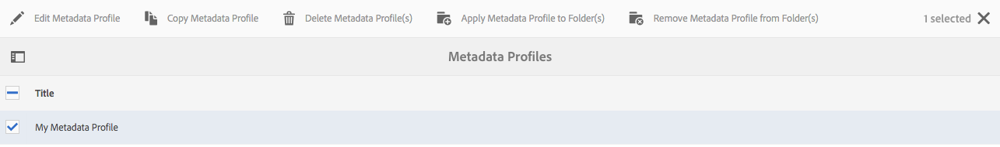

# Metadataprofielen {#metadata-profiles}

Met een metagegevensprofiel kunt u standaardmetagegevens toepassen op elementen in een map. Maak een metagegevensprofiel en pas dit toe op een map. Elk element dat u vervolgens uploadt naar de map, neemt de standaardmetagegevens over die u hebt geconfigureerd in het metagegevensprofiel.

## Een metagegevensprofiel {#adding-a-metadata-profile} toevoegen

1. Tik op het AEM of klik op het logo en navigeer naar **[!UICONTROL Tools > Assets > Metadata Profiles]** en tik op **[!UICONTROL Create]**.
1. Voer een titel in voor Metagegevensprofiel, bijvoorbeeld Voorbeeldmetagegevens, en klik op **[!UICONTROL Submit]**. De **[!UICONTROL Edit Form]** voor het profiel van Meta-gegevens wordt getoond.

   

1. Klik op een component en configureer de eigenschappen ervan op het tabblad **[!UICONTROL Settings]**. Klik bijvoorbeeld op de component **[!UICONTROL Description]** en bewerk de eigenschappen ervan.

   

   Bewerk de volgende eigenschappen voor de component **[!UICONTROL Description]**:

   * **[!UICONTROL Field Label]**: De weergavenaam van de eigenschap metadata. Dit is alleen voor de gebruikersverwijzing.
   * **[!UICONTROL Map to Property]**: De waarde van deze eigenschap geeft het relatieve pad/de naam naar het knooppunt met middelen waar het wordt opgeslagen in de opslagplaats. De waarde moet altijd beginnen met `./` omdat dit aangeeft dat het pad zich onder het knooppunt van het element bevindt.

   

   De waarde die u opgeeft voor **[!UICONTROL Map to property]**, wordt opgeslagen als een eigenschap onder het metagegevensknooppunt van het element. Als u bijvoorbeeld `/jcr:content/metadata/dc:desc` als de naam van  **[!UICONTROL Map to property]**, slaat AEM Assets de waarde  `dc:desc` op in het metagegevensknooppunt van het element.

   * **[!UICONTROL Default Value]**: Gebruik deze eigenschap om een standaardwaarde voor de metagegevenscomponent toe te voegen. Als u bijvoorbeeld &quot;Mijn beschrijving&quot; opgeeft, wordt deze waarde toegewezen aan de eigenschap `dc:desc` bij het metagegevensknooppunt van het element.

   

   >[!NOTE]
   >
   >Een standaardwaarde toevoegen aan een nieuwe eigenschap metadata (die nog niet bestaat op het tabblad . `/jcr:content/metadata` node) geeft de eigenschap en de waarde ervan standaard niet op de  **[!UICONTROL Properties]** pagina van het element weer. Als u de nieuwe eigenschap wilt weergeven op de pagina [!UICONTROL Properties] van het element, wijzigt u het corresponderende schema.

1. (Optioneel) Voeg meer componenten toe aan de **[!UICONTROL Edit Form]** op het tabblad **[!UICONTROL Build Form]** en configureer de eigenschappen ervan op het tabblad **[!UICONTROL Settings]**. De volgende eigenschappen zijn beschikbaar op het tabblad **[!UICONTROL Build Form]**:

| Component | Eigenschappen |
|---|---|
| [!UICONTROL Section Header] | Veld Label, beschrijving   |
| [!UICONTROL Single Line Text] | Veld Label,   Toewijzen aan eigenschap,   Standaardwaarde |
| [!UICONTROL Multi Value Text] | Veld Label,   Toewijzen aan eigenschap,   Standaardwaarde |
| [!UICONTROL Number] | Veld Label,   Toewijzen aan eigenschap,   Standaardwaarde |
| [!UICONTROL Date] | Veld Label,   Toewijzen aan eigenschap,   Standaardwaarde |
| [!UICONTROL Standard Tags] | Veld Label,   Toewijzen aan eigenschap,   Standaardwaarde,   Beschrijving |

1. Klik op **[!UICONTROL Done]**. Het metagegevensprofiel wordt toegevoegd aan de lijst met profielen op de pagina **[!UICONTROL Metadata Profiles]**.

   

## Een metagegevensprofiel {#copying-a-metadata-profile} kopiëren

1. Selecteer op de pagina **[!UICONTROL Metadata Profiles]** een profiel om er een kopie van te maken.

   

1. Klik op **[!UICONTROL Copy]** op de werkbalk.
1. Voer in het dialoogvenster **[!UICONTROL Copy Metadata Profile]** een titel in voor de nieuwe kopie van het profiel.
1. Klik op **[!UICONTROL Copy]**. Een kopie van het profiel wordt weergegeven in de lijst met profielen op de pagina **[!UICONTROL Metadata Profiles]**.

   

## Een metagegevensprofiel {#deleting-a-metadata-profile} verwijderen

1. Selecteer op de pagina **[!UICONTROL Metadata Profiles]** een profiel dat u wilt verwijderen.

   

1. Klik op **[!UICONTROL Delete Metadata Profiles]** op de werkbalk.
1. Klik in het dialoogvenster op **[!UICONTROL Delete]** om de verwijderbewerking te bevestigen. Het metagegevensprofiel wordt uit de lijst verwijderd.

## Een metagegevensprofiel toepassen op mappen {#applying-a-metadata-profile-to-folders}

Wanneer u een metagegevensprofiel toewijst aan een map, nemen eventuele submappen het profiel automatisch over van de bovenliggende map. Dit betekent dat u slechts één metagegevensprofiel kunt toewijzen aan een map. Denk daarom zorgvuldig na over de mapstructuur van de locatie waar u middelen uploadt, opslaat, gebruikt en archiveert.

Als u een ander metagegevensprofiel aan een map hebt toegewezen, overschrijft het nieuwe profiel het vorige profiel. De vorige bestaande mapelementen blijven ongewijzigd. Het nieuwe profiel wordt toegepast op de elementen die later aan de map worden toegevoegd.

Mappen waaraan een profiel is toegewezen, worden in de gebruikersinterface aangeduid met de naam van het profiel dat in de kaartnaam wordt weergegeven.

U kunt metagegevensprofielen toepassen op specifieke mappen of op alle elementen.

### Metagegevensprofielen toepassen op specifieke mappen {#applying-metadata-profiles-to-specific-folders}

U kunt een metadataprofiel toepassen op een map vanuit het menu **[!UICONTROL Tools]**, of vanuit **[!UICONTROL Properties]** als u zich in een map bevindt. In deze sectie wordt beschreven hoe u op beide manieren metadataprofielen kunt toepassen op mappen.

Mappen waaraan al een profiel is toegewezen, worden aangegeven door de naam van het profiel direct onder de mapnaam weer te geven.

#### Metagegevensprofielen toepassen op mappen vanuit de gebruikersinterface Profielen {#applying-metadata-profiles-to-folders-from-profiles-user-interface}

1. Tik op het AEM-logo en ga naar **[!UICONTROL Tools > Assets > Metadata Profiles]**.
1. Selecteer het metagegevensprofiel dat u wilt toepassen op een of meerdere mappen.

   

1. Tik op **[!UICONTROL Apply Metadata Profile to Folder(s)]** en selecteer de map of meerdere mappen die u wilt gebruiken om de nieuw geüploade assets te ontvangen en tik op **[!UICONTROL Done]**. Mappen waaraan al een profiel is toegewezen, worden aangegeven door de naam van het profiel direct onder de mapnaam weer te geven.

#### Metagegevensprofielen toepassen op mappen vanuit Eigenschappen {#applying-metadata-profiles-to-folders-from-properties}

1. Tik in de linkertrack op **[!UICONTROL Assets]** en navigeer naar de map waarop u een metagegevensprofiel wilt toepassen.
1. Tik in de map op het vinkje om het te selecteren en tik vervolgens op **[!UICONTROL Properties]**.

1. Selecteer het tabblad **[!UICONTROL Metadata Profiles]**, selecteer het profiel in het vervolgkeuzemenu en klik op **[!UICONTROL Save]**.

   

   Mappen waaraan al een profiel is toegewezen, worden aangegeven door de naam van het profiel direct onder de mapnaam weer te geven.

### Een metagegevensprofiel globaal toepassen {#applying-a-metadata-profile-globally}

Naast het toepassen van een profiel op een map, kunt u er ook een globaal toepassen, zodat het geselecteerde profiel wordt toegepast op inhoud die is geüpload naar AEM elementen in een map. Ga als volgt te werk als u een metagegevensprofiel globaal wilt toepassen:

1. Voer een van de volgende handelingen uit:

   * Navigeer naar `https://[aem_server]:[port]/mnt/overlay/dam/gui/content/assets/foldersharewizard.html/content/dam` en pas het juiste profiel toe en tik of klik op **[!UICONTROL Save]**.

      

   * Navigeer naar CRXDE Lite naar het volgende knooppunt: `/content/dam/jcr:content`. Voeg de eigenschap `metadataProfile:/etc/dam/metadata/dynamicmedia/<name_of_metadata_profile>` toe en tik **[!UICONTROL Save All]**.

      

## Een metagegevensprofiel verwijderen uit mappen {#removing-a-metadata-profile-from-folders}

Wanneer u een metagegevensprofiel uit een map verwijdert, nemen eventuele submappen automatisch de verwijdering van het profiel uit de bovenliggende map over. Elke verwerking van bestanden die in de mappen is opgetreden, blijft echter intact.

U kunt een metagegevensprofiel uit een map verwijderen vanuit het menu **[!UICONTROL Tools]** of **[!UICONTROL Properties]** als u in de map bent. In deze sectie wordt beschreven hoe u metadataprofielen op beide manieren uit mappen kunt verwijderen.

### Metagegevensprofielen uit mappen verwijderen via de gebruikersinterface Profielen {#removing-metadata-profiles-from-folders-via-profiles-user-interface}

Voer de volgende stappen uit om een metagegevensprofiel uit mappen te verwijderen via de gebruikersinterface van Profielen:

1. Tik op het AEM-logo en ga naar **[!UICONTROL Tools > Assets > Metadata Profiles]**.
1. Selecteer het metagegevensprofiel dat u uit een of meerdere mappen wilt verwijderen.
1. Tik op **[!UICONTROL Remove Metadata Profile from Folder(s)]** en selecteer de map of meerdere mappen waaruit u een profiel wilt verwijderen. Tik vervolgens op **[!UICONTROL Done]**.

   U kunt bevestigen dat het metagegevensprofiel niet meer wordt toegepast op een map omdat de naam niet langer onder de mapnaam wordt weergegeven.

### Metagegevensprofielen uit mappen verwijderen met eigenschappen {#removing-metadata-profiles-from-folders-via-properties}

1. Tik op het AEM en navigeer **[!UICONTROL Assets]** naar de map waaruit u een metagegevensprofiel wilt verwijderen.
1. Tik in de map op het vinkje om het te selecteren en tik vervolgens op **[!UICONTROL Properties]**.
1. Selecteer de tab **[!UICONTROL Metadata Profiles]** en selecteer **[!UICONTROL None]** in het vervolgkeuzemenu. Tik op **[!UICONTROL Save]**.

Mappen waaraan al een profiel is toegewezen, worden aangegeven door de naam van het profiel direct onder de mapnaam weer te geven.
