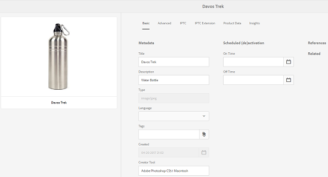
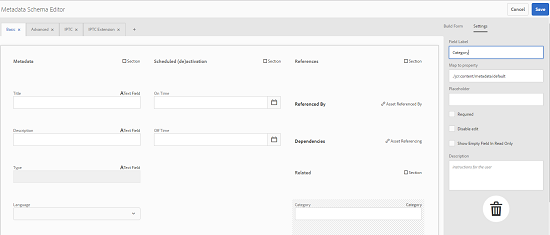
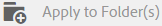
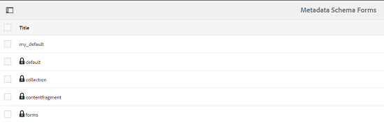
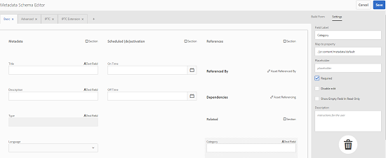

# Metadataschema&#39;s {#metadata-schemas}

In [!DNL Experience Manager Assets], bepaalt een meta-gegevensschema de lay-out van de eigenschappen pagina en de meta-gegevenseigenschappen die voor activa worden getoond die het bepaalde schema gebruiken. Tot de metagegevenseigenschappen behoren titel, beschrijving, MIME-typen, tags, enzovoort. U kunt de redacteur van Forms van het Schema van Meta-gegevens gebruiken om bestaande schema&#39;s te wijzigen of douanemetagegevensschema&#39;s toe te voegen.

Ga als volgt te werk om de pagina met eigenschappen voor een element weer te geven en te bewerken:

1. Klik of tik **[!UICONTROL View Properties]** van snelle acties op de elemententegel in de mening van de Kaart.

   

   U kunt ook een element selecteren en op het pictogram **[!UICONTROL Properties]** op de werkbalk klikken of tikken.

   

1. U kunt de verschillende bewerkbare eigenschappen van metagegevens bewerken onder de beschikbare tabbladen. U kunt het element [!UICONTROL Type] echter niet wijzigen op het tabblad [!UICONTROL Basic] van de eigenschappenpagina.

   

   Als u het MIME-type voor een element wilt wijzigen, gebruikt u een aangepast schema voor metagegevens of wijzigt u een bestaand formulier. Zie [Metagegevensschema Forms](metadata-schemas.md#editing-metadata-schema-forms) bewerken voor meer informatie. Als u het metagegevensschema voor een bepaald MIME-type wijzigt, worden de pagina-indeling van de eigenschappen voor elementen met het huidige MIME-type en alle elementsubtypen gewijzigd. Als u bijvoorbeeld een schema `jpeg` wijzigt onder `default/image`, wordt alleen de metagegevensindeling (eigenschappen van elementen) gewijzigd voor elementen met het MIME-type `IMAGE/JPEG`. Als u echter het standaardschema bewerkt, worden de wijzigingen doorgevoerd in de indeling van de metagegevens voor alle typen elementen.

## Metagegevensschema Forms {#default-metadata-schema-forms}

Als u een lijst met formulieren/sjablonen wilt weergeven, navigeert u in de [!DNL Experience Manager]-interface naar **[!UICONTROL Tools]** > **[!UICONTROL Assets]** > **[!UICONTROL Metadata Schemas]**.

[!DNL Experience Manager] Hier vindt u de volgende sjablonen voor het schema van metagegevens:

| Sjablonen |  | Beschrijving |
|---|---|---|
| [!UICONTROL default] |  | Het basisschema voor metagegevens voor elementen. |
|  | De volgende onderliggende formulieren nemen de eigenschappen over van het formulier [!UICONTROL default]: |  |
|  | <ul><li> [!UICONTROL dm_video]</li></ul> | Schema voor Dynamic Media-video&#39;s. |
|  | <ul><li> [!UICONTROL image]</li></ul> | Schema-formulier voor elementen met het MIME-type &quot;image&quot;, bijvoorbeeld afbeelding/jpeg, afbeelding/png, enzovoort.   Het  [!UICONTROL image] formulier heeft de volgende onderliggende formuliersjablonen: <ul><li> [!UICONTROL jpeg]: Schema voor activa met subtype  [!UICONTROL jpeg].</li> <li>[!UICONTROL tiff]: Schema voor de activa met subtype  [!UICONTROL tiff].</li></ul> |
|  | <ul><li> [!UICONTROL application]</li></ul> | Schema-formulier voor elementen met het MIME-type &quot;application&quot;, bijvoorbeeld application/ pdf, application/ zip enzovoort.  [!UICONTROL pdf]: Schemaformulier voor activa met subtype pdf. |
|  | <ul><li>[!UICONTROL video]</li></ul> | Schema-formulier voor elementen met het MIME-type &quot;video&quot;, zoals video/avi, video/mp4, enzovoort. |
| [!UICONTROL collection] |  | Schemaformulier voor verzamelingen. |
| [!UICONTROL contentfragment] |  | Schemaformulier voor inhoudsfragmenten. |
| [!UICONTROL forms] |  | Dit schemaformulier heeft betrekking op [Adobe Experience Manager Forms](/help/forms/home.md). |

>[!NOTE]
>
>Als u de onderliggende formulieren van een schema wilt weergeven, klikt of tikt u op de naam van het schema.

## Een metagegevensschema toevoegen {#adding-a-metadata-schema-form}

1. Als u een aangepaste sjabloon aan de lijst wilt toevoegen, klikt u op **[!UICONTROL Create]** op de werkbalk.

   >[!NOTE]
   >
   >Onbewerkte sjablonen geven vóór de sjablonen een vergrendelingspictogram weer. Als u een van de sjablonen aanpast, verdwijnt het vergrendelingspictogram voordat de sjabloon verdwijnt.

1. Voer in het dialoogvenster de titel van het schema in en klik op **[!UICONTROL Create]** om het maken van het formulier te voltooien.

   

## Formulieren met metagegevensschema {#editing-metadata-schema-forms} bewerken

U kunt een nieuw of bestaand schema voor metagegevens bewerken. Het metagegevensschema bevat het volgende:

* Tabs
* Formulieritems in tabbladen.

U kunt deze formulieritems toewijzen/configureren aan een veld binnen een metagegevensknooppunt in de CRX-opslagruimte.

U kunt nieuwe tabbladen of formulieritems toevoegen aan het metagegevensschemaformulier. De tabbladen en formulieritems die van het bovenliggende element zijn afgeleid, bevinden zich in de vergrendelde status. U kunt deze niet wijzigen op het niveau van het kind.

1. Schakel op de pagina **[!UICONTROL Schema Forms]** het selectievakje in vóór een formulier en klik op **[!UICONTROL Edit]** op de werkbalk.

   

1. Pas op de pagina **[!UICONTROL Metadata Schema Editor]** de eigenschappenpagina van de asset aan door een of meer componenten uit de lijst met componenttypen op het tabblad **[!UICONTROL Build Form]** naar het tabblad **[!UICONTROL Basic]** te slepen.

   

1. Als u een component wilt configureren, selecteert u deze en wijzigt u de eigenschappen ervan op het tabblad **[!UICONTROL Settings]**.

### Componenten op het tabblad Formulier samenstellen {#components-within-the-build-form-tab}

Het tabblad **[!UICONTROL Build Form]** bevat formulieritems die u in het schemaformulier gebruikt. Het tabblad **[!UICONTROL Settings]** bevat de kenmerken van elk item dat u selecteert op het tabblad **[!UICONTROL Build Form]**. De volgende tabel bevat een lijst met formulieritems die beschikbaar zijn op het tabblad **[!UICONTROL Build Form]**:

| Componentnaam | Beschrijving |
|---|---|
| [!UICONTROL Section Header] | Voeg een sectiekopje toe voor een lijst met gangbare componenten. |
| [!UICONTROL Single Line Text] | Voeg een eigenschap voor één regel tekst toe. De eigenschap wordt opgeslagen als een tekenreeks. |
| [!UICONTROL Multi Value Text] | Voeg een teksteigenschap voor meerdere waarden toe. Deze wordt opgeslagen als een tekenreeks-array. |
| [!UICONTROL Number] | Voeg een getalcomponent toe. |
| [!UICONTROL Date] | Voeg een datumcomponent toe. |
| [!UICONTROL Dropdown] | Voeg een vervolgkeuzelijst toe. |
| [!UICONTROL Standard Tags] | Voeg een tag toe. |
| [!UICONTROL Smart Tags] | U kunt zoekmogelijkheden uitbreiden door automatisch metagegevenstags toe te voegen. |
| [!UICONTROL Hidden Field] | Voeg een verborgen veld toe. Deze wordt als een POST-parameter verzonden wanneer het element wordt opgeslagen. |
| [!UICONTROL Asset Referenced By] | Voeg deze component toe om een lijst weer te geven met elementen waarnaar door het element wordt verwezen. |
| [!UICONTROL Asset Referencing] | Toevoegen om een lijst weer te geven met elementen die naar het element verwijzen. |
| [!UICONTROL Products References] | Toevoegen om de lijst weer te geven met producten die aan het element zijn gekoppeld. |
| [!UICONTROL Asset Rating] | Toevoegen aan weergaveopties voor het beoordelen van het element. |
| [!UICONTROL Contextual Metadata] | Toevoegen om de weergave van andere tabbladen met metagegevens in de eigenschappenpagina met elementen te besturen. |

### De metagegevenscomponent {#editing-the-metadata-component} bewerken

Als u de eigenschappen van een metagegevenscomponent in het formulier wilt bewerken, klikt u op de component en bewerkt u alle of een subset van de volgende eigenschappen op het tabblad **[!UICONTROL Settings]**.

**Veldlabel**: De naam van de eigenschap metadata die wordt weergegeven op de eigenschappenpagina voor het element.

**Toewijzen aan eigenschap**: This property specifies the relative path/name to the asset node where it is saved in the CRX repository. Het begint met `./` omdat het erop wijst dat de weg onder de knoop van het element is.

Hier volgen de geldige waarden voor deze eigenschap:

* `./jcr:content/metadata/dc:title`: Hiermee wordt de waarde in het metadataknooppunt van de asset opgeslagen als de eigenschap `dc:title`.

* `./jcr:created`: Geeft de JCR-eigenschap weer op het knooppunt van het element. Als u deze eigenschappen configureert op weergave-eigenschappen, raden wij aan deze te markeren als Bewerken uitschakelen, omdat deze beveiligd zijn. Anders resulteert de fout [!UICONTROL Asset(s) failed to modify] wanneer u de eigenschappen van het element opslaat.

Om ervoor te zorgen dat de component correct in de vorm van het meta-gegevensschema wordt getoond, zou de bezitspad geen ruimten moeten omvatten.

**Tijdelijke aanduiding**: Gebruik deze eigenschap om relevante plaatsaanduidingstekst met betrekking tot de eigenschap metadata op te geven.

**Vereist**: Gebruik deze eigenschap om een eigenschap metadata als verplicht op de eigenschappenpagina te markeren.

**Bewerken** uitschakelen: Gebruik deze eigenschap om een eigenschap metadata onbewerkbaar te maken op de eigenschappenpagina.

**Leeg veld alleen**-lezen tonen: Mark this property to display a metadata property on the properties page even if it has no value. Wanneer een eigenschap metadata geen waarde heeft, wordt deze standaard niet vermeld op de eigenschappenpagina.

**Genummerde** lijst tonen: Gebruik deze eigenschap om een geordende keuzelijst weer te geven

**Keuzen**: Gebruik deze eigenschap om keuzen in een lijst op te geven

**Omschrijving** : Gebruik deze eigenschap om een korte beschrijving toe te voegen voor de metagegevenscomponent.

**Klasse**: Objectklasse waaraan de eigenschap is gekoppeld.

**Pictogram** verwijderenKlik op dit pictogram om een component uit het schema te verwijderen.

>[!NOTE]
>
>De component Verborgen veld bevat deze kenmerken niet. In plaats daarvan bevat de klasse eigenschappen, zoals Naam, Waarde, Veldlabel en Beschrijving. De waarden voor de component Verborgen veld worden als een POST-parameter verzonden wanneer het element wordt opgeslagen. Deze wordt niet opgeslagen als metagegevens voor het element.

Als u de optie **[!UICONTROL Required]** selecteert, kunt u zoeken naar assets waarvoor verplichte metadata ontbreken. Vouw in het deelvenster **[!UICONTROL Filters]** het predicaat **[!UICONTROL Metadata Validation]** uit en selecteer de optie **[!UICONTROL Invalid]**. In de zoekresultaten worden assets weergegeven waarvoor verplichte metadata ontbreken die u via het schemaformulier hebt geconfigureerd.

Als u de component Contextuele metagegevens toevoegt aan een tabblad van een schemaformulier, wordt de component weergegeven als een lijst op de eigenschappenpagina van elementen waarop het specifieke schema wordt toegepast. De lijst bevat alle andere tabbladen, behalve het tabblad waarop u de component Contextuele metagegevens hebt toegepast. Momenteel biedt deze functie basisfunctionaliteit voor het beheren van de weergave van metagegevens op basis van de context.

Als u een tabblad in de eigenschappenpagina wilt opnemen, naast het tabblad waarop de component Contextuele metagegevens is toegepast, selecteert u het tabblad in de lijst. Het tabblad wordt toegevoegd aan de pagina met eigenschappen.

### Eigenschappen opgeven in JSON-bestand {#specifying-properties-in-json-file}

In plaats van eigenschappen voor de opties op het tabblad **[!UICONTROL Settings]** op te geven, kunt u de opties in een JSON-bestand definiëren door overeenkomstige sleutel-waardeparen op te geven. Geef het pad van het JSON-bestand op in het veld **[!UICONTROL JSON Path]**.

### Een tabblad toevoegen aan of verwijderen uit het schemaformulier {#adding-deleting-a-tab-in-the-schema-form}

Met de schema-editor kunt u een tabblad toevoegen of verwijderen. Het standaardschemaformulier bevat standaard de tabbladen **[!UICONTROL Basic]**, **[!UICONTROL Advanced]**, **[!UICONTROL IPTC]** en **[!UICONTROL IPTC Extension]**.

Klik `+` om een nieuw lusje op een schemavorm toe te voegen. Standaard heeft het nieuwe tabblad de naam `Unnamed-1`. U kunt de naam wijzigen op het tabblad **[!UICONTROL Settings]**. Klik `X` om een tabel te verwijderen.

## Formulieren met metagegevensschema {#deleting-metadata-schema-forms} verwijderen

Met AEM kunt u alleen aangepaste schema-formulieren verwijderen. U kunt hiermee de standaardschema-formulieren/sjablonen niet verwijderen. U kunt echter alle aangepaste wijzigingen in deze formulieren verwijderen.

Als u een formulier wilt verwijderen, selecteert u een formulier en klikt u op het pictogram **[!UICONTROL Delete]**.

>[!NOTE]
>
>Nadat u aangepaste wijzigingen in een standaardformulier hebt verwijderd, wordt het vergrendelingspictogram opnieuw weergegeven in de interface Metagegevensschema om aan te geven dat de standaardstatus van het formulier is hersteld.

>[!NOTE]
>
>In AEM Assets kunt u het schema voor metagegevens in het vak niet verwijderen.

## Schemaformulieren voor MIME-typen {#schema-forms-for-mime-types}

AEM Assets bevat standaardformulieren voor verschillende MIME-typen uit het vak. U kunt echter aangepaste formulieren toevoegen voor elementen van verschillende MIME-typen.

### Nieuwe formulieren toevoegen voor MIME-typen {#adding-new-forms-for-mime-types}

Maak een nieuw formulier onder het juiste formuliertype. Als u bijvoorbeeld een nieuwe sjabloon wilt toevoegen voor het subtype `image/png`, maakt u het formulier onder de formulieren `image`. De titel voor het schemaformulier is de naam van het subtype. In dit geval is de titel `png`.

### Een bestaande schemasjabloon gebruiken voor verschillende MIME-typen {#using-an-existing-schema-template-for-various-mime-types}

U kunt een bestaande sjabloon voor een ander MIME-type gebruiken. Gebruik bijvoorbeeld het formulier `image/jpeg` voor elementen van het MIME-type `image/png`.

In dit geval maakt u een nieuw knooppunt op `/etc/dam/metadataeditor/mimetypemappings` in de CRX-opslagplaats. Geef een naam voor het knooppunt op en definieer de volgende eigenschappen:

| Naam | Beschrijving | Type | Waarde |
|---|---|---|---|
| `exposedmimetype` | Naam van het bestaande formulier dat moet worden toegewezen | `String` | `image/jpeg` |
| `mimetypes` | Lijst met MIME-typen die het formulier gebruiken dat is gedefinieerd in het kenmerk `exposedmimetype` | `String` | `image/png` |

AEM Assets wijst de volgende MIME-typen en schema-formulieren toe:

| Schema-formulier | MIME-typen |
|---|---|
| image/jpeg | image/pjpeg |
| image/tiff | image/x-tiff |
| application/pdf | application/postscript |
| application/x-ImageSet | Multipart/aanverwante; type=application/x-ImageSet |
| application/x-SpinSet | Multipart/aanverwante; type=application/x-SpinSet |
| application/x-MixedMediaSet | Multipart/aanverwante; type=application/x-MixedMediaSet |
| video/quicktime | video/x-quicktime |
| video/mpeg4 | video/mp4 |
| video/avi | video/avi, video/msvideo, video/x-msvideo |
| video/wmv | video/x-ms-wmv |
| video/flv | video/x-flv |

## Toegang verlenen tot metagegevensschema&#39;s {#granting-access-to-metadata-schemas}

De functie voor het metagegevensschema is alleen beschikbaar voor beheerders. Beheerders kunnen echter toegang verlenen aan gebruikers zonder beheerdersrechten door **[!UICONTROL Create]**, **[!UICONTROL Modify]** en **[!UICONTROL Delete]** machtigingen voor de map `/conf` in te voeren.

## Mapspecifieke metagegevens toepassen {#applying-folder-specific-metadata}

Met AEM Assets kunt u een variant van een metagegevensschema definiëren en dit toepassen op een specifieke map.

U kunt bijvoorbeeld een variant van het standaardmetagegevensschema definiëren en deze toepassen op een map. Wanneer u het gewijzigde schema toepast, wordt het oorspronkelijke standaardmetagegevensschema genegeerd dat op elementen in de map is toegepast.

Alleen elementen die zijn geüpload naar de map waarop dit schema is toegepast, voldoen aan de gewijzigde metagegevens die zijn gedefinieerd in het metagegevensschema voor de variant.

Elementen in andere mappen waarop het oorspronkelijke schema is toegepast, voldoen nog steeds aan de metagegevens die in het oorspronkelijke schema zijn gedefinieerd.

Metagegevensovererving door elementen is gebaseerd op het schema dat wordt toegepast op de map op het eerste niveau in de hiërarchie. Met andere woorden, als een map geen submappen bevat, nemen de elementen in de map de metagegevens over van het schema dat op de map is toegepast.

Als de map een submap heeft, nemen de elementen in de submap de metagegevens over van het schema dat op submapniveau wordt toegepast als een ander schema op submapniveau wordt toegepast. Als echter geen schema of hetzelfde schema wordt toegepast op submapniveau, overerven de submapelementen de metagegevens van het schema dat is toegepast op het niveau van de bovenliggende map.

1. Klik op het AEM-logo en ga naar **[!UICONTROL Tools > Assets > Metadata Schemas]**. De pagina **[!UICONTROL Metadata Schema Forms]** wordt weergegeven.
1. Schakel het selectievakje in vóór een formulier, bijvoorbeeld het standaardmetagegevensformulier, en klik op het pictogram **[!UICONTROL Copy]** of tik op en sla het op als een aangepast formulier. Geef een aangepaste naam voor het formulier op, bijvoorbeeld `my_default`. U kunt ook een aangepast formulier maken.

   

1. Selecteer op de pagina **[!UICONTROL Metadata Schema Forms]** het formulier `my_default` en klik vervolgens op **[!UICONTROL Edit]**.

1. Voeg op de pagina **[!UICONTROL Metadata Schema Editor]** een tekstveld toe aan het schema. Voeg bijvoorbeeld een veld met het label **[!UICONTROL Category]** toe.

   

1. Klik op **[!UICONTROL Save]**. Het gewijzigde formulier wordt weergegeven op de pagina **[!UICONTROL Metadata Schema Forms]**.
1. Klik/tik **[!UICONTROL Apply to Folder(s)]** van de toolbar om de douanemetagegevens op een omslag toe te passen.

   

1. Selecteer de map waarop u het gewijzigde schema wilt toepassen en klik op **[!UICONTROL Apply]**.

   

1. Als op de map het andere metagegevensschema is toegepast, verschijnt er een waarschuwing dat u op het punt staat het bestaande metagegevensschema te overschrijven. Klik op **[!UICONTROL Overwrite]**.
1. Klik **[!UICONTROL OK]** om het succesbericht te sluiten.
1. Navigeer naar de map waarop u het gewijzigde metagegevensschema hebt toegepast.

## Verplichte metagegevens definiëren {#defining-mandatory-metadata}

U kunt verplichte velden definiëren op mapniveau. Deze worden afgedwongen voor elementen die naar de map worden geüpload. Als u elementen uploadt met ontbrekende metagegevens voor de verplichte velden die u eerder hebt gedefinieerd, wordt een visuele indicatie voor ontbrekende metagegevens weergegeven in de weergave Kaart.

>[!NOTE]
>
>Een metagegevensveld kan op basis van de waarde van een ander veld als verplicht worden gedefinieerd. In de weergave Kaarten geeft AEM het waarschuwingsbericht over ontbrekende metagegevens voor dergelijke verplichte metagegevensvelden niet weer.

1. Klik op het AEM-logo en ga naar **[!UICONTROL Tools > Assets > Metadata Schemas]**. De pagina **[!UICONTROL Metadata Schema Forms]** wordt weergegeven.
1. Sla het standaardmetagegevensformulier op als een aangepast formulier. Sla het bestand bijvoorbeeld op als `my_default`.

   

1. Bewerk het aangepaste formulier. Voeg een verplicht veld toe. Voeg bijvoorbeeld het veld **Categorie** toe en maak het veld verplicht.

   

1. Klik op **[!UICONTROL Save]**. Het gewijzigde formulier wordt weergegeven op de pagina **[!UICONTROL Metadata Schema Forms]**. Als u de aangepaste metagegevens op een map wilt toepassen, selecteert u het formulier en klikt of tikt u op **[!UICONTROL Apply to Folder(s)]** op de werkbalk.

1. Navigeer naar de map en upload elementen met ontbrekende metagegevens voor het verplichte veld dat u aan het aangepaste formulier hebt toegevoegd. In de weergave Kaart voor de elementen wordt een bericht weergegeven voor de ontbrekende metagegevens voor het verplichte veld.

   

1. (Optioneel) Toegang `http://[server]:[port]/system/console/components/`. Configureer en schakel `com.day.cq.dam.core.impl.MissingMetadataNotificationJob` component in die standaard is uitgeschakeld. Stel een frequentie in waarmee AEM controleert of metagegevens over de elementen geldig zijn.
Deze configuratie voegt een eigenschap `hasValidMetadata` toe aan jcr:inhoud van elementen. Met deze eigenschap kunnen AEM resultaten in een zoekopdracht filteren.

>[!NOTE]
>
>Als een element wordt toegevoegd na de geplande controle, wordt het element niet gemarkeerd met `hasValidMetadata` tot de volgende geplande controle. De elementen worden niet weergegeven in tussenliggende zoekresultaten.

>[!CAUTION]
>
>De controles van de meta-gegevensbevestiging zijn middelintensief en kunnen de prestaties van uw systeem beïnvloeden. Plan de controles dienovereenkomstig. Als de AEM implementatie prestatieproblemen heeft, kunt u deze taak uitschakelen.
