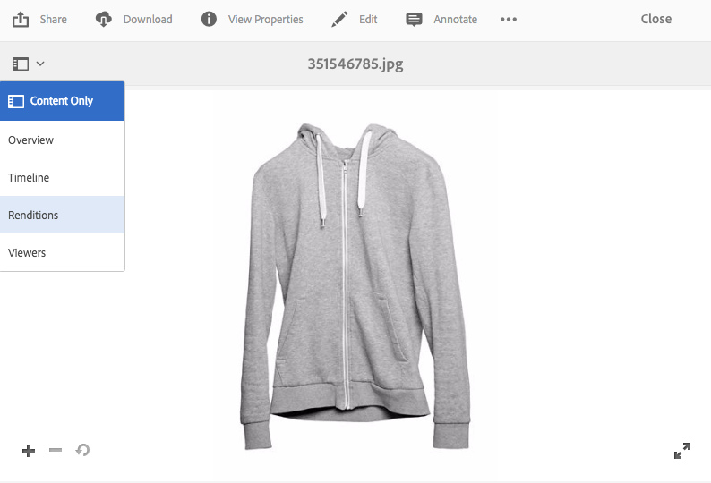

# Geoptimaliseerde afbeeldingen leveren voor een responsieve site {#delivering-optimized-images-for-a-responsive-site}

>[!CAUTION]
>
>AEM 6.4 heeft het einde van de uitgebreide ondersteuning bereikt en deze documentatie wordt niet meer bijgewerkt. Raadpleeg voor meer informatie onze [technische ondersteuningsperioden](https://helpx.adobe.com/support/programs/eol-matrix.html). Ondersteunde versies zoeken [hier](https://experienceleague.adobe.com/docs/).

Gebruik de functie Responsieve code wanneer u de code wilt delen voor responsieve serving met uw webontwikkelaar. U kopieert de responsieve (**[!UICONTROL RESS]**) naar het klembord zodat u deze kunt delen met de webontwikkelaar.

Deze functie is handig als uw website zich op een WCM van derden bevindt. Als uw website echter op AEM staat, rendert een externe afbeeldingsserver de afbeelding en levert deze aan de webpagina.

Zie ook [De video-viewer insluiten op een webpagina.](embed-code.md)

Zie ook [Het verbinden van URLs aan uw Toepassing van het Web.](linking-urls-to-yourwebapplication.md)

**Geoptimaliseerde afbeeldingen leveren voor een responsieve site**:

1. Navigeer naar de afbeelding waarvoor u responsieve code wilt opgeven en tik in het keuzemenu op **[!UICONTROL Renditions]**.

   

1. Selecteer een responsieve voorinstelling voor de afbeelding. De knoppen **[!UICONTROL URL]** en **[!UICONTROL RESS]** worden weergegeven.

   

   >[!NOTE]
   >
   >De geselecteerde asset *en* de geselecteerde afbeeldings- of viewervoorinstelling moeten worden gepubliceerd om de knoppen **[!UICONTROL URL]** of **[!UICONTROL RESS]** beschikbaar te maken.
   >
   >Dynamic Media - Voor de hybride modus moet u voorinstellingen voor afbeeldingen publiceren. In de modus Dynamic Media - Scene7 worden automatisch voorinstellingen voor afbeeldingen gepubliceerd.

1. Tik op **[!UICONTROL RESS]**.

   

1. In de **[!UICONTROL Embed Responsive Image]** selecteert en kopieert u de tekst van de responsieve code en plakt u deze in uw website om het responsieve element te openen.
1. Bewerk de standaardbreekpunten in de insluitcode zodat deze overeenkomen met die van de responsieve website rechtstreeks in de code. Test bovendien de verschillende afbeeldingsresoluties die op verschillende pagina-onderbrekingspunten worden weergegeven.

## HTTP/2 gebruiken om uw Dynamic Media-middelen te leveren {#using-http-to-delivery-your-dynamic-media-assets}

HTTP/2 is het nieuwe, bijgewerkte webprotocol dat de manier verbetert waarop browsers en servers communiceren. Het zorgt voor een snellere overdracht van informatie en vermindert de hoeveelheid verwerkingskracht die nodig is. De levering van Dynamic Media-elementen wordt ondersteund met HTTP/2, dat betere responstijd en laadtijd biedt.

Zie [HTTP2 Levering van inhoud](http2.md) voor volledige informatie over hoe u aan de slag gaat met HTTP/2 met uw Dynamic Media-account.
