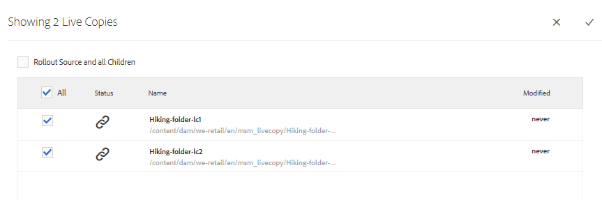

# Elementen opnieuw gebruiken met MSM voor elementen {#reuse-assets-using-msm-for-assets}

Met de MSM-functie (Multi Site Manager) in Adobe Experience Manager (AEM) kunnen gebruikers inhoud die eenmaal is ontworpen en op meerdere weblocaties opnieuw wordt gebruikt, hergebruiken. Hetzelfde geldt voor digitale elementen als MSM voor middelenfunctionaliteit. Met MSM voor elementen kunt u:

* Maak een keer elementen en maak vervolgens kopieën van deze elementen die u opnieuw kunt gebruiken in andere gebieden van de site.
* Houd meerdere kopieën gesynchroniseerd en werk de originele primaire kopie één keer bij om de wijzigingen in de onderliggende kopieën door te voeren.
* Breng lokale wijzigingen aan door de koppeling tussen bovenliggende en onderliggende elementen tijdelijk of permanent op te schorten.

## Vereisten {#msm-prerequisites}

Om MSM voor Activa te gebruiken, installeer minstens Service Pack 5. Zie de opmerkingen bij de release voor meer informatie.
[opmerkingen bij](/help/release-notes/assets.md) de release.

## Begrijp de voordelen en de concepten {#understand-benefits-concepts}

### Hoe het werkt en de voordelen {#how-it-works-the-benefits}

Zie [mogelijke MSM-scenario&#39;s](/help/sites-administering/msm.md#possible-scenarios) om inzicht te krijgen in de gebruiksscenario&#39;s voor het opnieuw gebruiken van dezelfde inhoud (tekst en elementen) op meerdere weblocaties. AEM onderhoudt een koppeling tussen het oorspronkelijke middel en de bijbehorende kopieën, ook wel &quot;live kopieën&quot; genoemd. Door de behouden koppeling kunnen gecentraliseerde wijzigingen worden doorgevoerd in veel live kopieën. Hierdoor kunnen updates sneller worden uitgevoerd, maar hoeven er geen dubbele kopieën te worden beheerd. De verspreiding van veranderingen is fout-vrij en gecentraliseerd. Dankzij deze functionaliteit is er ruimte voor updates die beperkt zijn tot geselecteerde live kopieën. Gebruikers kunnen de koppeling loskoppelen, dat wil zeggen, de overerving verbreken, en lokale bewerkingen aanbrengen die niet worden overschreven wanneer de primaire kopie de volgende keer wordt bijgewerkt en de wijzigingen worden doorgevoerd. U kunt de koppeling tot stand brengen voor een paar geselecteerde metagegevensvelden of voor een geheel element. Het biedt flexibiliteit om elementen die oorspronkelijk van een primaire kopie zijn overgeërfd, lokaal bij te werken.

MSM onderhoudt een live relatie tussen het bronelement en zijn live kopieën, zodat:

* Wijzigingen in de bronelementen worden ook toegepast (geïmplementeerd) op live kopieën, dat wil zeggen dat de live kopieën worden gesynchroniseerd met de bron.

* U kunt de live kopieën bijwerken door de live relatie op te schorten of de overerving voor een paar beperkte velden te verwijderen. De wijzigingen aan de bron worden niet meer toegepast op de live kopie.

### Verklarende woordenlijst van MSM voor de termen van Activa {#glossary-msm-for-assets}

* **Bron:** De oorspronkelijke elementen of mappen. Primaire kopie waarvan levende kopieën worden afgeleid.

* **Live kopie:** de kopie van de bronelementen/mappen die met de bron ervan gesynchroniseerd zijn. Actieve kopieën kunnen een bron zijn van verdere live kopieën. Zie [LC&#39;s maken](#create-live-copy-asset).

* **Overerving:** Een koppeling/verwijzing tussen een actief exemplaar/map en de bron ervan die het systeem gebruikt om te onthouden waar de updates moeten worden verzonden. Overerving bestaat op granulair niveau voor metagegevensvelden. Overerving kan worden verwijderd voor selectieve metagegevensvelden, terwijl de live relatie tussen bron en live kopie behouden blijft.

* **Uitvoeren**: Een handeling die de wijzigingen aan de bron stroomafwaarts doorvoert naar de live kopieën. Het is mogelijk om één of meerdere levende exemplaren in één keer bij te werken gebruikend rollout actie. Zie [rollout](#rollout-action).

* **Rollout config:** Regels die bepalen welke eigenschappen, hoe en wanneer worden gesynchroniseerd. Deze configuraties worden toegepast wanneer het creëren van levende exemplaren; kan later worden bewerkt; en een kind kan rollout configuratie van zijn ouderactiva erven. Voor MSM voor Activa, gebruik slechts de Standaard rollout config. De andere rollout configuraties zijn niet beschikbaar voor MSM voor Activa.

* **Synchroniseren:** Een andere actie, naast rollout, die pariteit tussen bron en zijn levende exemplaar door de updates van bron naar levende exemplaren te verzenden brengt. Een synchronisatie wordt in werking gesteld voor een bepaalde levende kopie en de actie trekt de veranderingen van de bron. Met deze handeling is het mogelijk slechts een van de live kopieën bij te werken. Zie [Handeling synchroniseren](#about-synchronize-action).

* **Onderbreken:** Verwijder tijdelijk de live relatie tussen een live kopie en het bronelement/de bronmap van de kopie. U kunt de relatie hervatten. Zie [Handeling onderbreken](#suspend-and-resume-relationship).

* **Hervatten:** Hervat de live relatie zodat opnieuw een live kopie de updates van de bron ontvangt. Zie [resume action](#suspend-and-resume-relationship).

* **Herstellen:** Herstel actie maakt het levende exemplaar opnieuw een replica van de bron door om het even welke lokale veranderingen te beschrijven. Ook worden annuleringen door overerving verwijderd en wordt de overerving voor alle metagegevensvelden opnieuw ingesteld. Als u in de toekomst lokale wijzigingen wilt aanbrengen, moet u de overname van specifieke velden opnieuw annuleren. Zie [lokale wijzigingen in LC](#make-local-modifications-to-live-copy).

* **Koppelen:** verwijder onherroepelijk de live relatie van een live kopie van middelen/map. Nadat u de bewerking hebt losgekoppeld, kunnen de live kopieën nooit updates van de bron ontvangen en is het niet langer een live kopie meer. Zie [relatie verwijderen](#remove-live-relationship).

## Actieve kopie van een element {#create-live-copy-asset} maken

Voer een van de volgende twee handelingen uit om een live kopie van een of meer bronelementen of -mappen te maken:

* **Methode 1**: Selecteer de bronelementen en klik  **[!UICONTROL Create > Live Copy]** van toolbar bij de bovenkant.
* **Methode 2**: Klik in AEM gebruikersinterface  **[!UICONTROL Create > Live Copy]** in de rechterbovenhoek van de interface.

U kunt live kopieën van een middel of map één voor één maken. U kunt live kopieën maken die zijn afgeleid van een middel of een map die zelf een live kopie is.

Inhoudsfragmenten (CF&#39;s) worden niet ondersteund voor de gebruikszaak. Wanneer het proberen om hun levende exemplaren tot stand te brengen, worden CFs gekopieerd over zoals is zonder enige verhouding. De gekopieerde CF&#39;s zijn een momentopname in de tijd en worden niet bijgewerkt wanneer oorspronkelijke CF&#39;s worden bijgewerkt.

Ga als volgt te werk om live kopieën te maken met de eerste methode:

1. Selecteer bronelementen of -mappen. Klik **[!UICONTROL Create > Live Copy]** op de werkbalk.
   
1. Selecteer bronelement of -map. Klik op **[!UICONTROL Next]**.
1. Geef een titel en naam op. Elementen hebben geen onderliggende elementen. Wanneer u een live kopie van mappen maakt, kunt u ervoor kiezen onderliggende items op te nemen of uit te sluiten.
1. Selecteer een rollout-configuratie. Klik op **[!UICONTROL Create]**.

Ga als volgt te werk om live kopieën te maken met de tweede methode:

1. Klik in AEM interface in de rechterbovenhoek op **[!UICONTROL Create > Live Copy]**.
   
1. Selecteer bronelement of -map. Klik op **[!UICONTROL Next]**.
1. Doelmap selecteren. Klik op **[!UICONTROL Next]**.
1. Geef een titel en naam op. Elementen hebben geen onderliggende elementen. Wanneer u een live kopie van mappen maakt, kunt u ervoor kiezen onderliggende items op te nemen of uit te sluiten.
1. Selecteer een rollout-configuratie. Klik op **[!UICONTROL Create]**.

>[!NOTE]
>
>Wanneer een bron of een levende kopie wordt verplaatst, blijven de relaties behouden. Wanneer een live kopie wordt verwijderd, worden de relaties verwijderd.

## Verschillende eigenschappen en statussen van bron- en actieve kopie weergeven {#view-properties-statuses-source-and-lc}

U kunt de informatie en MSM-verwante status van levende exemplaar zoals verhouding, synchronisatie, rollouts, en meer van de diverse gebieden van het AEM gebruikersinterface bekijken. De volgende twee methoden werken voor elementen en mappen:

* Selecteer actief kopiëren en zoek de informatie op de **[!UICONTROL Properties]**-pagina.
* Selecteer bronomslag en vind de gedetailleerde informatie van elke levende exemplaar van **[!UICONTROL Live Copy Console]**.

>[!TIP]
>
>Als u de status van enkele afzonderlijke live kopieën wilt controleren, gebruikt u de eerste methode die de pagina **[!UICONTROL Properties]** bevat. Om statussen van vele levende exemplaren te controleren, gebruik de tweede methode, namelijk, zie **[!UICONTROL Relationship Status]** pagina.

### Informatie en status van een live kopie {#information-status-of-one-lc}

Voer de volgende stappen uit om de informatie en status van een live kopie van een element of een map te controleren.

1. Selecteer een actief exemplaar of een map voor live kopiëren. Klik op **[!UICONTROL Properties]** op de werkbalk. U kunt ook de sneltoets `p` gebruiken.
1. Klik op **[!UICONTROL Live Copy]**. U kunt het pad van de bron, de status van de schorsing, de synchronisatiestatus, de laatste uitroldatum en de gebruiker die de laatste uitrol heeft uitgevoerd, controleren.
   
1. U kunt in- of uitschakelen als onderliggende elementen de configuratie van de live kopie lenen.
1. U kunt de optie voor het levende exemplaar kiezen om of de rollout configuratie van de ouder over te nemen of de configuratie te veranderen.

### Informatie en status van alle live kopieën van een map {#information-status-of-all-lcs-of-folder}

AEM verstrekt een console om de beelden van alle levende exemplaren van een bronomslag te controleren. Deze console geeft de status van alle onderliggende elementen weer.

1. Selecteer een bronmap. Klik op **[!UICONTROL Properties]** op de werkbalk. U kunt ook de sneltoets `p` gebruiken.
1. Klik op **[!UICONTROL Live Copy Source]**. Klik op **[!UICONTROL Live Copy Overview]** om de console te openen. Dit dashboard biedt een status op hoofdniveau van alle onderliggende assets.
   
1. Selecteer een asset en klik op **[!UICONTROL Relationship Status]** op de werkbalk om de gedetailleerde informatie over elke asset in de map met livekopieën weer te geven.
   

>[!TIP]
>
>U kunt snel de status van live kopieën van andere mappen zien zonder dat u te veel hoeft te bladeren. Verander enkel de omslag in de pop-up lijst in het hogere middelste deel van de **[!UICONTROL Live Copy Overview]** interface.

### Snelle acties van References rail voor bron {#quick-actions-from-references-rail-for-source}

Voor een bronmiddel of een omslag, kunt u de volgende informatie zien en de volgende acties direct van de spoorstaaf van Verwijzingen voeren:

* Zie de paden van live kopieën.
* Open of maak een specifieke live kopie in AEM gebruikersinterface.
* Synchroniseer de updates van een specifieke live kopie.
* De verhouding van de onderbreking of veranderingsuitrolconfiguratie voor een specifieke levende kopie.
* Open de overzichtsconsole van de live kopie.

Selecteer het bronelement of de bronmap, open het linkerspoor en klik op **[!UICONTROL References]**. U kunt ook een asset of map selecteren en de sneltoets `Alt + 4` gebruiken. 

Voor een specifieke levende kopie klikt u op **[!UICONTROL Edit Live Copy]** om de relatie op te schorten of de rollout-configuratie te wijzigen.

### Snelle acties van de spoorstaaf van References voor levende exemplaar {#quick-actions-from-references-rail-for-live-copy}

Voor een actief exemplaar of een omslag van het levende exemplaar, kunt u de volgende informatie zien en de volgende acties direct van de spoorstaaf van Verwijzingen voeren:

* Zie het pad van de bron.
* Open of maak een specifieke live kopie in AEM gebruikersinterface.
* De updates uitvoeren.

Selecteer een asset of map met livekopieën, open het linkerspoor en klik op **[!UICONTROL References]**. U kunt ook een asset of map selecteren en de sneltoets `Alt + 4` gebruiken. 

## Wijzigingen doorgeven van bron naar live kopieën {#propagate-modifications-from-source-to-live-copies}

Nadat een bron is gewijzigd, kunnen de wijzigingen aan de live kopieën worden doorgegeven met behulp van een synchronisatiehandeling of een rollout-handeling. Om het verschil tussen beide acties te begrijpen, zie [glossary](#glossary-msm-for-assets).

### Uitvoeren, actie {#rollout-action}

U kunt een rollout-actie starten vanuit het bronelement en alle of enkele geselecteerde live kopieën bijwerken.

1. Selecteer een actief exemplaar of een map voor live kopiëren. Klik op **[!UICONTROL Properties]** op de werkbalk. U kunt ook de sneltoets `p` gebruiken.
1. Klik op **[!UICONTROL Live Copy Source]**. Klik op **[!UICONTROL Rollout]** op de werkbalk.
1. Selecteer de live kopieën die u wilt bijwerken. Klik op **[!UICONTROL Rollout]**.
1. Selecteer **[!UICONTROL Rollout Source and all Children]** om de updates uit te voeren die aan de onderliggende elementen worden aangebracht.
   

>[!NOTE]
>
>Wijzigingen die in een bronelement worden aangebracht, worden alleen doorgevoerd in direct verwante live kopieën. Als een levende kopie van een andere levende kopie wordt afgeleid, worden de wijzigingen niet doorgevoerd in de afgeleide live kopie.

U kunt ook een rollout-actie starten vanuit de [!UICONTROL References]-rail nadat u een specifieke live kopie hebt geselecteerd. Zie [Snelle acties van References rail voor live kopie](#quick-actions-from-references-rail-for-live-copy) voor meer informatie. Bij deze methode van rollout worden alleen de geselecteerde live kopie en eventueel de onderliggende elementen bijgewerkt.

### Informatie over het synchroniseren van handelingen {#about-synchronize-action}

Met een synchronisatiehandeling worden de wijzigingen alleen van een bron naar de geselecteerde live kopie doorgevoerd. Met de handeling Sync worden de lokale wijzigingen die na het annuleren van overerving zijn aangebracht, gerespecteerd en gehandhaafd. De lokale wijzigingen worden niet overschreven en de geannuleerde overerving wordt niet opnieuw tot stand gebracht. U kunt op drie manieren een synchronisatiehandeling starten.

| Waar in AEM interface | Wanneer en waarom gebruiken | Hoe wordt het gebruikt |
|---|---|---|
| [!UICONTROL References] spoor | Snel synchroniseren wanneer de bron al is geselecteerd. | Zie [Snelle acties van References rail voor bron](#quick-actions-from-references-rail-for-source) |
| Werkbalk op de pagina [!UICONTROL Properties] | Een synchronisatie starten wanneer u de live kopieereigenschappen al hebt geopend. | Zie [Een live kopie synchroniseren](#synchronize-live-copy) |
| [!UICONTROL Live Copy Overview] console | Synchroniseer snel meerdere elementen (niet noodzakelijkerwijs alle) wanneer de bronmap is geselecteerd of wanneer de [!UICONTROL Live Copy Overview]-console al is geopend. De synchronisatiehandeling wordt uitgevoerd voor één element tegelijk, maar is een snellere manier om te synchroniseren voor meerdere middelen in één keer. | Zie [Handelingen op vele elementen in een live kopieermap](#take-actions-on-many-assets-in-lcfolder) |

### Een actieve kopie {#synchronize-live-copy} synchroniseren

Als u een synchronisatieactie wilt starten, opent u de pagina **[!UICONTROL Properties]** van een livekopie, klikt u op **[!UICONTROL Live Copy]** en klikt u op de gewenste actie op de werkbalk.

Zie [Informatie en status van alle live kopieën van een map](#information-status-of-all-lcs-of-folder) voor informatie over de statussen en informatie over een synchronisatiehandeling.

>[!NOTE]
>
>Als de relatie wordt onderbroken, is de synchronisatiehandeling niet beschikbaar op de werkbalk. Terwijl de synchronisatieactie in [!UICONTROL References] spoor beschikbaar is, worden de wijzigingen niet verspreid zelfs na naar verluidt succesvolle implementatie.

## Relatie {#suspend-and-resume-relationship} onderbreken en hervatten

U kunt de relatie tijdelijk onderbreken om te voorkomen dat een live kopie wijzigingen ontvangt die zijn aangebracht in het bronelement of de bronmap. De relatie kan ook worden hervat voor live kopiëren om de wijzigingen van de bron te ontvangen.

Als u een livekopie wilt onderbreken of hervatten, opent u de pagina **[!UICONTROL Properties]** van de livekopie, klikt u op **[!UICONTROL Live Copy]** en klikt u op de gewenste actie op de werkbalk.

U kunt relaties van verschillende assets in een map met livekopieën onderbreken of hervatten vanuit de console **[!UICONTROL Live Copy Overview]**. Zie [Acties uitvoeren op verschillende assets in mappen met livekopieën](#take-actions-on-many-assets-in-lcfolder).

## Lokale wijzigingen aanbrengen in een live kopie {#make-local-modifications-to-live-copy}

Een live kopie is een kopie van de oorspronkelijke bron wanneer deze wordt gemaakt. De metagegevenswaarden van een live kopie worden overgenomen van de bron. De metagegevensvelden behouden afzonderlijk overerving met de respectieve velden van het bronelement.

U hebt echter de flexibiliteit om lokale wijzigingen aan te brengen in een livekopie om een beperkt aantal eigenschappen te wijzigen. Als u lokale wijzigingen wilt aanbrengen, annuleert u de overname van de gewenste eigenschap. Wanneer de overname van een of meer metadatavelden wordt geannuleerd, blijven de liverelatie van de asset en de overname van de andere metadatavelden behouden. Bij een synchronisatie of uitrol worden de lokale wijzigingen niet overschreven. Open daartoe de pagina **[!UICONTROL Properties]** van een asset met livekopieën en klik op het pictogram **[!UICONTROL cancel inheritance]** naast een metadataveld.

U kunt alle lokale wijzigingen ongedaan maken en de status van het element herstellen. Handeling herstellen wordt onherroepelijk en onmiddellijk genegeerd bij alle lokale wijzigingen en herstelt overerving op alle metagegevensvelden. Als u wilt terugkeren vanaf de pagina **[!UICONTROL Properties]** van een actief kopiëren, klikt u op **[!UICONTROL Reset]** van de werkbalk.

## Live relatie verwijderen {#remove-live-relationship}

U kunt de relatie tussen een bron en een live kopie volledig verwijderen met de actie Loskoppelen. De live kopie wordt een zelfstandig middel of een zelfstandige map nadat deze is losgekoppeld. Het wordt getoond als nieuw middel in AEM interface, onmiddellijk na het losmaken. Voer de volgende stappen uit om een live kopie van de bron los te koppelen.

1. Selecteer een actief of map voor live kopiëren. Klik op **[!UICONTROL Properties]** op de werkbalk. U kunt ook de sneltoets p gebruiken.
1. Klik op **[!UICONTROL Live Copy]**. Klik op **[!UICONTROL Detach]** op de werkbalk. Klik **[!UICONTROL Detach]** van de getoonde dialoog.
   

>[!CAUTION]
>
>De relatie wordt verwijderd zodra u [!UICONTROL Detach] klikt in het dialoogvenster. U kunt dit niet ongedaan maken door op [!UICONTROL Cancel] op de pagina Eigenschappen te klikken.

U kunt ook snel meerdere elementen in een live-kopieermap loskoppelen van de **[!UICONTROL Live Copy Overview]**-console. Zie [Acties uitvoeren op verschillende assets in mappen met livekopieën](#take-actions-on-many-assets-in-lcfolder).

## Handelingen uitvoeren op vele elementen in een live-kopiemap {#take-actions-on-many-assets-in-lcfolder}

Als u meerdere elementen in een live-kopieermap hebt, kan het lastig zijn om acties voor elk element te starten. U kunt de basishandelingen voor veel elementen snel initiëren met Live Copy Console. De bovenstaande methoden werken nog steeds voor afzonderlijke elementen.

1. Selecteer een bronmap. Klik op **[!UICONTROL Properties]** op de werkbalk. U kunt ook de sneltoets p gebruiken.
1. Klik op Bron van live kopie. Klik op **[!UICONTROL Live Copy Overview]** om de console te openen.
1. Selecteer in dit dashboard een asset van een livekopie van een map met livekopieën. Klik op de gewenste acties op de werkbalk. De beschikbare acties zijn **[!UICONTROL Edit]**, **[!UICONTROL Synchronize]**, **[!UICONTROL Reset]**, **[!UICONTROL Suspend]** en **[!UICONTROL Detach]**. U kunt deze handelingen snel uitvoeren op elk element in een willekeurig aantal mappen met live kopieën dat een live relatie heeft met de geselecteerde bronmap.
   

## MSM uitbreiden voor elementen {#extend-msm-for-assets}

AEM kunt u de functionaliteit uitbreiden met de API&#39;s van MSM Java. Voor Middelen, werkt het uitbreiden enkel het zelfde als het met MSM voor Plaats werkt. Voor details, zie [Uitbreiding van MSM](../sites-developing/extending-msm.md) en de volgende secties voor informatie over specifieke taken:

* [Overzicht van API&#39;s](../sites-developing/extending-msm.md#overview-of-the-java-api)
* [Een nieuwe synchronisatiehandeling maken](../sites-developing/extending-msm.md#creating-a-new-synchronization-action)
* [Een nieuwe rollout-configuratie maken](../sites-developing/extending-msm.md#creating-a-new-rollout-configuration)
* [Een eenvoudige klasse LiveActionFactory maken en gebruiken](../sites-developing/extending-msm.md#creating-and-using-a-simple-liveactionfactory-class)

>[!NOTE]
>
>* Vervagen in MSM voor site wordt de Live Copy-bron in MSM voor middelen genoemd.
>* Het verwijderen van de hoofdstukstap in de wizard Site maken wordt niet ondersteund in MSM for Assets.
>* Het configureren van MSM-vergrendelingen op pagina-eigenschappen (interface met aanraakbediening) wordt niet ondersteund in MSM for Assets.

## Effect van taken voor middelenbeheer op live kopieën {#impact-of-asset-management-tasks-on-live-copies}

Live kopieën en bronnen zijn elementen of mappen die tot op zekere hoogte als digitale elementen kunnen worden beheerd. Sommige taken voor middelenbeheer in AEM hebben een specifieke invloed op de live kopieën.

* Wanneer u een live kopie kopieert, wordt een live kopie van het element gemaakt met dezelfde bron als de eerste live kopie.
* Wanneer u een bron of een live kopie verplaatst, blijft de live relatie behouden.
* Handeling bewerken werkt niet voor live-kopieerelementen.
* Uitchecken is niet beschikbaar voor live kopieerelementen.
* Voor de bronmap is de optie voor het maken van revisietaken beschikbaar.
* Wanneer u de elementenlijst weergeeft in de lijstweergave en de kolomweergave, wordt er een live kopie van het element of de map &#39;live kopie&#39; weergegeven. Zo kunt u gemakkelijk actieve kopieën in een map herkennen.

## MSM vergelijken voor Elementen en Plaatsen {#compare-msm-for-assets-and-sites}

In meer scenario&#39;s, past MSM voor Activa het gedrag van MSM voor de functionaliteit van Plaatsen aan. Enkele belangrijke verschillen die moeten worden vermeld zijn:

* In Sites kunt u een blauwdruk en de bijbehorende live kopie vergelijken, maar het is in Elementen niet mogelijk om een bron te vergelijken met de live kopie.
* Sites hebben doorgaans onderliggende items, maar elementen niet. De optie om kinderen op te nemen of uit te sluiten is niet aanwezig wanneer het creëren van levende exemplaren van individuele activa.
* Het verwijderen van de hoofdstukstap in de wizard Site maken wordt niet ondersteund in MSM for Assets.
* Het configureren van MSM-vergrendelingen op pagina-eigenschappen (interface met aanraakbediening) wordt niet ondersteund in MSM for Assets.
* Voor MSM voor Activa, gebruik slechts de Standaard rollout config. De andere rollout configuraties zijn niet beschikbaar voor MSM voor Activa.

## Beperkingen van MSM voor activa {#limitations-of-msm-for-assets}

Hieronder volgt de beperking met MSM voor activa.

* Inhoudsfragmenten (CF&#39;s) worden niet ondersteund voor de gebruikszaak. Wanneer het proberen om hun levende exemplaren tot stand te brengen, worden CFs gekopieerd over zoals is zonder enige verhouding. De gekopieerde CF&#39;s zijn een momentopname in de tijd en worden niet bijgewerkt wanneer oorspronkelijke CF&#39;s worden bijgewerkt.
