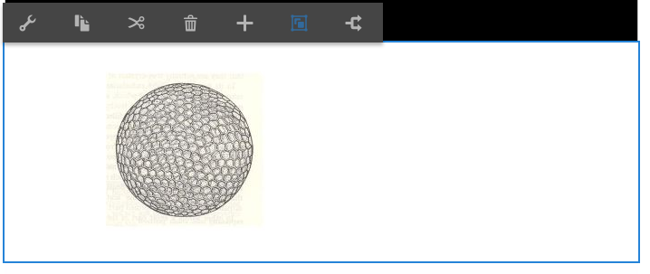

# Dynamic Media Classic-componenten aan pagina&#39;s toevoegen {#adding-scene-features-to-your-page}

>[!CAUTION]
>
>AEM 6.4 heeft het einde van de uitgebreide ondersteuning bereikt en deze documentatie wordt niet meer bijgewerkt. Raadpleeg voor meer informatie onze [technische ondersteuningsperioden](https://helpx.adobe.com/support/programs/eol-matrix.html). Ondersteunde versies zoeken [hier](https://experienceleague.adobe.com/docs/).

Adobe Dynamic Media Classic is een gehoste oplossing voor het beheren, verbeteren, publiceren en leveren van rijke media-elementen aan Web, mobiel, e-mail en displays en drukwerk via internet.

U kunt AEM middelen bekijken die in Dynamic Media Classic zijn gepubliceerd in verschillende viewers:

* Zoomen
* Flyout
* Video
* Afbeeldingssjabloon
* Afbeelding

U kunt digitale middelen rechtstreeks van AEM naar Dynamic Media Classic publiceren en u kunt digitale middelen van Dynamic Media Classic naar AEM publiceren.

In dit document wordt beschreven hoe u digitale elementen kunt publiceren van AEM naar Dynamic Media Classic en vice versa. Viewers worden ook in detail beschreven. Voor informatie over het configureren van AEM voor Dynamic Media Classic raadpleegt u [Dynamic Media Classic integreren met AEM](/help/sites-administering/scene7.md).

Zie ook [Afbeeldingen met hyperlinks toevoegen](image-maps.md).

Ga voor meer informatie over het gebruik van videocomponenten met AEM naar [Video](video.md).

>[!NOTE]
>
>Als Dynamic Media Classic-elementen niet correct worden weergegeven, controleert u of Dynamic Media [uitgeschakeld](config-dynamic.md#disabling-dynamic-media) en vernieuw vervolgens de pagina.

## Handmatig publiceren naar Dynamic Media Classic vanuit middelen {#manually-publishing-to-scene-from-assets}

U kunt digitale elementen als volgt naar Dynamic Media Classic publiceren:

* [In de klassieke gebruikersinterface van de middelenconsole](/help/sites-classic-ui-authoring/manage-assets-classic-s7.md#publishing-from-the-assets-console)
* [In de klassieke gebruikersinterface van een element](/help/sites-classic-ui-authoring/manage-assets-classic-s7.md#publishing-from-an-asset)
* [In de klassieke gebruikersinterface van buiten de CQ-doelmap](/help/sites-classic-ui-authoring/manage-assets-classic-s7.md#publishing-assets-from-outside-the-cq-target-folder)

>[!NOTE]
>
>AEM publiceert asynchroon naar Dynamic Media Classic. Nadat u op **[!UICONTROL Publish]** Het kan enkele seconden duren voordat uw middel naar Dynamic Media Classic is gepubliceerd.

## Dynamic Media Classic-componenten {#scene-components}

De volgende Dynamic Media Classic-componenten zijn beschikbaar in AEM:

* Zoomen
* Flyout (zoomen)
* Afbeeldingssjabloon
* Afbeelding
* Video

>[!NOTE]
>
>Deze componenten zijn standaard niet beschikbaar en moeten worden geselecteerd in **[!UICONTROL Design]** vóór gebruik.

Nadat ze beschikbaar zijn gesteld in **[!UICONTROL Design]** kunt u de componenten aan de pagina toevoegen, net als elke andere AEM. Elementen die nog niet naar Dynamic Media Classic zijn gepubliceerd, worden naar Dynamic Media Classic gepubliceerd als deze zich in een gesynchroniseerde map of op een pagina of met een Dynamic Media Classic-cloudconfiguratie bevinden.

>[!NOTE]
>
>Als u aangepaste viewers maakt en ontwikkelt en de Inhoudszoeker gebruikt, moet u de opdracht **[!UICONTROL allowfullscreen]** parameter.

### Kennisgeving over de gebruiksduur van Flash-viewers {#flash-viewers-end-of-life-notice}

Adobe Dynamic Media Classic heeft vanaf 31 januari 2017 de ondersteuning voor het Flash-viewerplatform beëindigd.

### Een Dynamic Media Classic-component (Scene7) toevoegen aan een pagina {#adding-a-scene-component-to-a-page}

Het toevoegen van een Dynamic Media Classic-component (Scene7) aan een pagina is hetzelfde als het toevoegen van een component aan een pagina. Dynamic Media Classic-componenten worden in de volgende secties uitgebreid beschreven.

**Een Dynamic Media Classic-component (Scene7) toevoegen aan een pagina**:

1. Open in AEM de pagina waaraan u de Dynamic Media Classic-component (Scene7) wilt toevoegen.

1. Als er geen Dynamic Media Classic-componenten beschikbaar zijn, klikt u op **[!UICONTROL Design]** tikt u op een component met een blauwe rand en tikt u op de **[!UICONTROL Parent]** en vervolgens de **[!UICONTROL Configuration]** pictogram. In **[!UICONTROL Parsys (Design)]** selecteert u alle Dynamic Media Classic-componenten die u beschikbaar wilt maken en klikt u op **[!UICONTROL OK]**.

   

1. Klikken **[!UICONTROL Edit]** om terug te keren naar **[!UICONTROL Edit]** in.

1. Sleep een component van de groep van Dynamic Media Classic in het hulpstuk op de pagina in de gewenste plaats.

1. Klik op de knop **[!UICONTROL Configuration]** pictogram om de component te openen.

1. Bewerk de component naar wens en klik op **[!UICONTROL OK]** om de wijzigingen op te slaan.
1. Sleep de afbeelding of video van de inhoudbrowser naar het Dynamic Media Classic-onderdeel dat u aan de pagina hebt toegevoegd.

   >[!NOTE]
   >
   >Alleen in de gebruikersinterface moet u de afbeelding of video naar het Dynamic Media Classic-onderdeel slepen dat u op de pagina hebt geplaatst. Het selecteren en bewerken van de Dynamic Media Classic-component en het kiezen van het element worden niet ondersteund.

### Interactieve weergaven toevoegen aan een responsieve site {#adding-interactive-viewing-experiences-to-a-responsive-website}

Het responsieve ontwerp voor uw middelen betekent dat uw middelen worden aangepast afhankelijk van waar ze worden weergegeven. Bij een responsief ontwerp kunnen dezelfde elementen effectief op meerdere apparaten worden weergegeven.

Zie ook [Responsief ontwerp voor webpagina&#39;s](/help/sites-developing/responsive.md).

**Een interactieve kijkervaring toevoegen aan een responsieve site**:

1. Meld u aan bij AEM en zorg ervoor dat u beschikt over [geconfigureerde Adobe Dynamic Media Classic-Cloud Services](/help/sites-administering/scene7.md#configuring-scene-integration) en dat Dynamic Media Classic-componenten beschikbaar zijn.

   >[!NOTE]
   >
   >Als Dynamic Media Classic-componenten niet beschikbaar zijn, moet u [om ze in te schakelen in de ontwerpmodus](/help/sites-authoring/default-components-designmode.md).

1. In een website met de **[!UICONTROL Dynamic Media Classic]** componenten ingeschakeld, sleept u en **[!UICONTROL Image]** naar de pagina.
1. Selecteer de component en tik op het configuratiepictogram.
1. In de **[!UICONTROL Dynamic Media Classic Settings]** de onderbrekingspunten aanpassen.

   

1. Controleer of de viewers het formaat responsief wijzigen en of alle interacties zijn geoptimaliseerd voor computers, tablets en mobiele apparaten.

### Instellingen die voor alle Dynamic Media Classic-componenten gelden {#settings-common-to-all-scene-components}

Hoewel de configuratieopties variëren, zijn het volgende gemeenschappelijk voor allen [!UICONTROL Dynamic Media Classic] componenten:

* **[!UICONTROL File Reference]**
Blader naar een bestand waarnaar u wilt verwijzen. De bestandsverwijzing toont de element-URL en niet noodzakelijkerwijs de volledige Dynamic Media Classic-URL inclusief de URL-opdrachten en -parameters. U kunt in dit veld geen Dynamic Media Classic URL-opdrachten en -parameters toevoegen. Ze moeten worden toegevoegd via de bijbehorende functionaliteit in de component.
* **[!UICONTROL Width]**
Hiermee kunt u de breedte instellen.
* **[!UICONTROL Height]**
Hiermee kunt u de hoogte instellen.

U stelt deze configuratieopties in door bijvoorbeeld een Dynamic Media Classic-component te openen (te dubbelklikken) wanneer u een **[!UICONTROL Zoom]** component:

### Zoomen {#zoom}

De HTML5-component Zoom geeft een grotere afbeelding weer wanneer u op de knop **[!UICONTROL +]** knop.

Het element heeft onderaan zoomgereedschappen. Tikken **[!UICONTROL +]** vergroten. Tikken **[!UICONTROL -]** om te verminderen. Tikken op de knop **[!UICONTROL x]** Als u de zoompijl opnieuw instelt, wordt de oorspronkelijke grootte van de afbeelding hersteld. Tik op de diagonale pijlen om deze volledig scherm te maken. Tikken **[!UICONTROL Edit]** om de component te configureren. Met deze component, kunt u vormen [instellingen die voor alle [!UICONTROL Dynamic Media Classic] componenten](#settings-common-to-all-scene-components).

### Flyout {#flyout}

In de HTML5 **[!UICONTROL Flyout]** component, wordt het element weergegeven als gesplitst scherm; het element in de opgegeven grootte laten staan; rechts wordt het zoomgedeelte weergegeven. Tikken **[!UICONTROL Edit]** om de component te configureren. Met deze component, kunt u vormen [gemeenschappelijke instellingen voor alle Dynamic Media Classic-componenten](#settings-common-to-all-scene-components).

>[!NOTE]
>
>Als uw **[!UICONTROL Flyout]** gebruikt een aangepaste grootte, dan wordt die aangepaste grootte gebruikt en responsieve opstelling van de component is uitgeschakeld.
>
>Als uw **[!UICONTROL Flyout]** gebruikt de standaardgrootte die is ingesteld in het dialoogvenster **[!UICONTROL Design View]** Vervolgens wordt de standaardgrootte gebruikt en wordt de component uitgerekt om de grootte van de paginalay-out aan te passen met de responsieve instelling van de component ingeschakeld. Houd er echter rekening mee dat er een beperking geldt voor de responsieve instelling van de component. Wanneer u de **[!UICONTROL Flyout]** gebruiken met responsieve instellingen, mag u deze niet gebruiken met volledig uitrekbaar paginaformaat. Anders wordt **[!UICONTROL Flyout]** kan de rechterrand van de pagina overschrijden.

### Afbeelding {#image}

De Dynamic Media Classic **[!UICONTROL Image]** kunt u Dynamic Media Classic-functionaliteit aan uw afbeeldingen toevoegen, zoals Dynamic Media Classic-wijzigingstoetsen, voorinstellingen voor afbeeldingen of viewers en verscherpen. De Dynamic Media Classic **[!UICONTROL Image]** is vergelijkbaar met andere afbeeldingscomponenten in AEM met speciale Dynamic Media Classic-functionaliteit. In dit voorbeeld heeft de afbeelding de optie Dynamic Media Classic URL, **&amp;op_invert=1** toegepast.

* **[!UICONTROL Title, Alt Text]**
In de **[!UICONTROL Advanced]** , voegt u een titel toe aan de afbeelding en alternatieve tekst voor gebruikers die afbeeldingen hebben uitgeschakeld.

* **[!UICONTROL URL, Open in]**
U kunt een middel van plaatsen om een verbinding te openen. Stel de **[!UICONTROL URL]** en in **[!UICONTROL Open in]** Geef aan of u het venster in hetzelfde venster of in een nieuw venster wilt openen.

* **[!UICONTROL Viewer preset]**
Selecteer een bestaande viewervoorinstelling in het keuzemenu. Als de viewervoorinstelling die u zoekt niet zichtbaar is, moet u deze mogelijk zichtbaar maken. Zie [Viewer-voorinstellingen beheren](/help/assets/managing-viewer-presets.md). U kunt geen viewervoorinstelling selecteren als u een voorinstelling voor afbeeldingen gebruikt en andersom.

* **[!UICONTROL Dynamic Media Classic Configuration]**
Selecteer de Dynamic Media Classic-configuratie die u wilt gebruiken om actieve voorinstellingen voor afbeeldingen op te halen uit SPS.

* **[!UICONTROL Image preset]**
Selecteer een bestaande voorinstelling voor afbeeldingen in het keuzemenu. Als de voorinstelling die u zoekt niet zichtbaar is, moet u deze mogelijk zichtbaar maken. Zie [Voorinstellingen afbeelding beheren](/help/assets/managing-image-presets.md). U kunt geen viewervoorinstelling selecteren als u een voorinstelling voor afbeeldingen gebruikt en andersom.

* **[!UICONTROL Output Format]**
Selecteer de uitvoerindeling van de afbeelding, bijvoorbeeld jpeg. Afhankelijk van de uitvoerindeling die u selecteert, hebt u mogelijk aanvullende configuratieopties. Zie [Aanbevolen werkwijzen voor voorinstellingen afbeelding](/help/assets/managing-image-presets.md#image-preset-options).

* **[!UICONTROL Sharpening]**
Selecteer hoe u de afbeelding wilt verscherpen. Verscherpen wordt gedetailleerd uitgelegd [Aanbevolen werkwijzen voor voorinstellingen afbeelding](/help/assets/managing-image-presets.md#image-preset-options) en [Aanbevolen werkwijzen verscherpen](/help/assets/assets/sharpening_images.pdf).

* **[!UICONTROL URL Modifiers]**
U kunt afbeeldingseffecten wijzigen door extra opdrachten voor Dynamic Media Classic-afbeeldingen in te voeren. Deze worden beschreven in [Voorinstellingen afbeelding](/help/assets/managing-image-presets.md) en de [Opdrachtverwijzing](https://experienceleague.adobe.com/docs/dynamic-media-developer-resources/image-serving-api/image-serving-api/http-protocol-reference/command-reference/c-command-reference.html).

* **[!UICONTROL Breakpoints]**
Als uw website reageert, wilt u de onderbrekingspunten aanpassen. Onderbrekingspunten moeten worden gescheiden door komma&#39;s ( , ).

### Afbeeldingssjabloon {#image-template}

[Dynamic Media Classic-afbeeldingssjablonen](https://experienceleague.adobe.com/docs/dynamic-media-classic/using/template-basics/creating-template.html#creating-the-initial-template) zijn gelaagde Photoshop-inhoud die naar Dynamic Media Classic is geïmporteerd, waar inhoud en eigenschappen zijn geparametriseerd voor variabiliteit. De **[!UICONTROL Image template]** kunt u afbeeldingen importeren en de tekst dynamisch in AEM wijzigen. Bovendien kunt u vormen **[!UICONTROL Image template]** gebruiken om waarden uit de clientcontext te gebruiken, zodat elke gebruiker de afbeelding op een gepersonaliseerde manier ervaart.

Tikken **[!UICONTROL Edit]** om de component te configureren. U kunt configureren [gemeenschappelijke instellingen voor alle Dynamic Media Classic-componenten](#settings-common-to-all-scene-components) en andere instellingen die in deze sectie worden beschreven.

* **[!UICONTROL File Reference, Width, Height]**
Zie de instellingen die gelden voor alle Dynamic Media Classic-componenten.

   >[!NOTE]
   >
   >Dynamic Media Classic URL-opdrachten en -parameters kunnen niet rechtstreeks aan de URL van de bestandsverwijzing worden toegevoegd. Deze kunnen alleen worden gedefinieerd in de interface van de component in het dialoogvenster **[!UICONTROL Parameter]** deelvenster.

* **[!UICONTROL Title, Alt Text]**
Voeg op het tabblad Dynamic Media Classic-afbeeldingssjabloon een titel toe aan de afbeelding en alternatieve tekst voor gebruikers die afbeeldingen hebben uitgeschakeld.

* **[!UICONTROL URL, Open in]**
U kunt een middel van plaatsen om een verbinding te openen. Stel de URL in en kies Openen in om aan te geven of deze in hetzelfde venster of in een nieuw venster moet worden geopend.

* **[!UICONTROL Parameter Panel]**
Wanneer u een afbeelding importeert, worden de parameters vooraf gevuld met informatie uit de afbeelding. Als er geen inhoud is die dynamisch kan worden gewijzigd, is dit venster leeg.

#### Tekst dynamisch wijzigen {#changing-text-dynamically}

Als u de tekst dynamisch wilt wijzigen, voert u nieuwe tekst in de velden in en klikt u op **[!UICONTROL OK]**. In dit voorbeeld wordt **[!UICONTROL Price]** is nu $50 en de verzendkosten zijn 99 cent.

De tekst in de afbeelding verandert. U kunt de oorspronkelijke waarde van de tekst herstellen door te tikken op **[!UICONTROL Reset]** naast het veld.

#### Tekst wijzigen om de waarde van de context van een client weer te geven {#changing-text-to-reflect-the-value-of-a-client-context-value}

Tik op **[!UICONTROL Select]** om het client-contextmenu te openen, selecteert u de clientcontext en tikt u op **[!UICONTROL OK]**. In dit voorbeeld verandert de naam op basis van de koppeling van de naam met de opgemaakte naam in het profiel.

De tekst geeft de naam weer van de gebruiker die momenteel is aangemeld. U kunt de oorspronkelijke waarde van de tekst herstellen door op **[!UICONTROL Reset]** naast het veld.

#### Een koppeling maken van de Dynamic Media Classic-afbeeldingssjabloon {#making-the-scene-image-template-a-link}

1. Op de pagina met de Dynamic Media Classic **[!UICONTROL Image Template]** component, tikken **[!UICONTROL Edit]**.
1. In de **[!UICONTROL URL]** Voer de URL in waarnaar gebruikers gaan wanneer op de afbeelding wordt getikt. In de **[!UICONTROL Open in]** , selecteert u of het doel moet worden geopend (een nieuw venster of hetzelfde venster).

   

1. Tik op **[!UICONTROL OK]**.

### Video-component {#video-component}

De Dynamic Media Classic **[!UICONTROL Video]** -component (beschikbaar in het Dynamic Media Classic-gedeelte van het hulpprogramma) gebruikt apparaat- en bandbreedtedetectie voor de juiste video voor elk scherm. Dit onderdeel is een HTML5-videospeler. het is één viewer die via meerdere kanalen kan worden gebruikt.

Deze kan worden gebruikt voor adaptieve videosets, één MP4-video of één F4V-video.

Zie [Video](s7-video.md) voor meer informatie over hoe video&#39;s werken met de integratie van Dynamic Media Classic. Zie ook [de Dynamic Media Classic Video-component versus de Foundation Video-component](s7-video.md).

### Bekende beperkingen voor de video-component {#known-limitations-for-the-video-component}

Adobe DAM en WCM laten zien of een master video is geüpload. Deze proxy-elementen worden niet weergegeven:

* Dynamic Media Classic-gecodeerde uitvoeringen
* Dynamic Media Classic adaptieve videosets

Wanneer u een adaptieve videoset gebruikt met de Dynamic Media Classic-videocomponent, moet u de grootte van de component aanpassen aan de afmetingen van de video.

## Dynamic Media Classic-inhoudbrowser {#scene-content-browser}

Met de Dynamic Media Classic-inhoudbrowser kunt u inhoud van Dynamic Media Classic rechtstreeks in AEM bekijken. Als u toegang wilt tot de inhoudbrowser, gaat u naar **[!UICONTROL Content Finder]**, selecteert u **[!UICONTROL Dynamic Media Classic]** in de aanraakgeoptimaliseerde gebruikersinterface of de **[!UICONTROL S7]** in de klassieke gebruikersinterface. De functionaliteit is identiek tussen beide gebruikersinterfaces.

Als u meerdere configuraties hebt, AEM standaard de [standaardconfiguratie](/help/sites-administering/scene7.md#configuring-a-default-configuration). U kunt verschillende configuraties rechtstreeks selecteren in de Dynamic Media Classic-inhoudbrowser in de vervolgkeuzelijst.

>[!NOTE]
>
>* Middelen in de ad-hocmap worden niet weergegeven in de Dynamic Media Classic-inhoudbrowser.
>* Wanneer [Beveiligde voorvertoning is ingeschakeld](/help/sites-administering/scene7.md#configuring-the-state-published-unpublished-of-assets-pushed-to-scene), zowel gepubliceerde als niet-gepubliceerde middelen op Dynamic Media Classic worden wel weergegeven in de Dynamic Media Classic-inhoudbrowser.
>* Als u niet ziet **[!UICONTROL Dynamic Media Classic]** of de **[!UICONTROL S7]** als optie in de inhoudbrowser, moet u [Dynamic Media Classic configureren om te werken met AEM](/help/sites-administering/scene7.md).
>* Voor video ondersteunt de Dynamic Media Classic-inhoudbrowser:
   >   * Adaptieve videosets: container met alle video-uitvoeringen die nodig zijn voor naadloze weergave op meerdere schermen
   >   * Eén MP4-video
   >   * Single F4V-video

### Door inhoud bladeren in de gebruikersinterface die geoptimaliseerd is voor aanrakingen {#browsing-content-in-the-touch-optimized-ui}

U kunt de inhoudbrowser openen via de geoptimaliseerde interface of via de klassieke gebruikersinterface. Op dit moment heeft het geoptimaliseerde aanraakgebied de volgende beperking:

* FXG- en Flash-elementen van Dynamic Media Classic worden niet ondersteund.

Bladeren door Dynamic Media Classic-elementen door **[!UICONTROL Dynamic Media Classic]** in het derde vervolgkeuzemenu. Dynamic Media Classic wordt niet in de lijst weergegeven als u de integratie tussen Dynamic Media Classic en AEM niet hebt geconfigureerd.

>[!NOTE]
>
>* In de Dynamic Media Classic-inhoudbrowser worden ongeveer 100 elementen geladen en op naam gesorteerd.
>* Als u een beveiligde voorvertoningsserver hebt ingesteld, gebruikt de browser die voorvertoningsserver om miniaturen en elementen te renderen.
>

Bovendien kunt u informatie over de resolutie, de grootte, de dagen sinds de wijziging en de bestandsnaam doorbladeren door de muisaanwijzer op het element in de browser te plaatsen.

* Voor adaptieve videosets en sjablonen wordt geen informatie over de grootte gegenereerd voor miniaturen.
* Voor adaptieve videosets wordt geen resolutie gegenereerd voor miniaturen.

### Dynamic Media Classic-elementen zoeken met de inhoudbrowser {#searching-for-scene-assets-with-the-content-browser}

Het zoeken naar Dynamic Media Classic-elementen lijkt op het zoeken naar AEM elementen, maar wanneer u een zoekopdracht uitvoert, ziet u in feite een externe weergave van de elementen in het Dynamic Media Classic-systeem in plaats van deze rechtstreeks in AEM te importeren.

U kunt zowel de klassieke interface als de interface met geoptimaliseerde aanrakingen gebruiken om elementen weer te geven en te zoeken. Afhankelijk van de interface, is hoe u zoekt lichtjes verschillend.

Wanneer u in een van beide UI zoekt, kunt u filteren op de volgende criteria (die hier in de voor aanraking geoptimaliseerde UI worden getoond):

* **[!UICONTROL Enter keywords]**
U kunt elementen zoeken op naam. Wanneer u de trefwoorden zoekt die u invoert, begint de bestandsnaam met. Als u bijvoorbeeld het woord &quot;zwemmen&quot; typt, wordt gezocht naar namen van elementbestanden die met die letters in die volgorde beginnen. Tik op Enter nadat u de term hebt getypt om het element te zoeken.

* **[!UICONTROL Folder/path]**
De naam van de map die wordt weergegeven, is gebaseerd op de configuratie die u hebt geselecteerd. U kunt tot lagere niveaus boren door het omslagpictogram te tikken en een subomslag te selecteren, dan het controleteken te tikken om het te selecteren.

Als u een sleutelwoord ingaat en een omslag selecteert, AEM onderzoeken die omslag en om het even welke subfolders. Als u echter bij het zoeken geen trefwoorden invoert, worden bij het selecteren van de map alleen de elementen in die map weergegeven en worden er geen submappen opgenomen.

AEM zoekt standaard naar de geselecteerde map en naar alle submappen.

* **[!UICONTROL Type of Asset]**
Selecteren **[!UICONTROL Dynamic Media Classic]** om door Dynamic Media Classic-inhoud te bladeren. Deze optie is alleen beschikbaar als Dynamic Media Classic is geconfigureerd.

* **[!UICONTROL Configuration]**
Als u meer dan één Dynamic Media Classic-configuratie hebt gedefinieerd in [!UICONTROL Cloud Services], kunt u deze hier selecteren. Hierdoor wordt de map gewijzigd op basis van de gekozen configuratie.

* **[!UICONTROL Asset type]**
In de Dynamic Media Classic-browser kunt u de resultaten filteren en de volgende items opnemen: afbeeldingen, sjablonen, video&#39;s en adaptieve videosets. Als u geen elementtype selecteert, zoekt AEM standaard naar alle elementtypen.

>[!NOTE]
>
>* In de klassieke interface kunt u ook zoeken naar **Flash** en **FXG**. Filteren hiervoor in de interface met geoptimaliseerde aanrakingen wordt momenteel niet ondersteund.
>
>* Bij het zoeken naar video zoekt u op één vertoning. Resultaten retourneren de oorspronkelijke vertoning (alleen ast; .mp4) en de gecodeerde uitvoering.
>* Wanneer u in een adaptieve videoset zoekt, zoekt u in de map en in alle submappen, maar alleen als u een trefwoord aan de zoekopdracht hebt toegevoegd. Als u geen trefwoord hebt toegevoegd, zoekt AEM niet in de submappen.
>

* **[!UICONTROL Publish Status]**
U kunt filteren op elementen die zijn gebaseerd op de publicatiestatus: **[!UICONTROL Unpublished]** of **[!UICONTROL Published]**. Als u geen **[!UICONTROL Publish Status]** AEM standaard alle publicatiestatussen doorzoeken.

