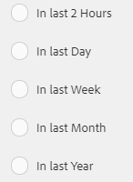
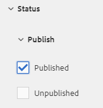

# Middelen zoeken in [!DNL Experience Manager] {#search-assets-in-aem}

>[!CAUTION]
>
>AEM 6.4 heeft het einde van de uitgebreide ondersteuning bereikt en deze documentatie wordt niet meer bijgewerkt. Raadpleeg voor meer informatie onze [technische ondersteuningsperioden](https://helpx.adobe.com/support/programs/eol-matrix.html). Ondersteunde versies zoeken [hier](https://experienceleague.adobe.com/docs/).

Leer hoe u de vereiste middelen kunt vinden in [!DNL Experience Manager] met het deelvenster Filters en hoe u de elementen gebruikt die in de zoekopdracht worden weergegeven.

Gebruik het deelvenster Filters om te zoeken naar elementen, mappen, tags en metagegevens. U kunt delen van een tekenreeks zoeken met de jokertekenasterisk.

Het deelvenster Filters biedt verschillende opties voor het zoeken naar elementen en mappen op meerdere manieren in plaats van in een algemene taxonomische volgorde.

U kunt zoeken op basis van de volgende opties (voorspelling):

* Bestandstype
* Bestandsgrootte
* Veldnaam
* Laatst gewijzigd
* Status
* Afdrukstand
* Stijl
* Inzichten

<!-- TBD keystroke 65 article and port applicable changes here. This content goes. -->

U kunt het deelvenster Filters aanpassen en voorvertoningen van zoekopdrachten toevoegen/verwijderen met behulp van [zoekfacetten](search-facets.md). Voer de volgende stappen uit om het deelvenster Filters weer te geven:

1. Tik/klik in de gebruikersinterface Middelen  op de werkbalk om het vak Zoeken weer te geven.
1. Voer uw zoekterm in en druk op Enter. U kunt ook op Enter drukken zonder een zoekterm in te voeren. Voer geen spaties voor de regelafstand in anders werkt de zoekopdracht niet.

1. Tik/klik op het pictogram GlobalNav. Het deelvenster Filters wordt weergegeven.

   

   Afhankelijk van het type items dat u doorzoekt, wordt het aantal overeenkomsten boven aan de zoekresultaten aangegeven.

   

## Zoeken naar bestandstypen {#search-for-file-types}

Met het deelvenster Filters kunt u meer granulariteit toevoegen aan uw zoekervaring en de zoekfunctionaliteit veelzijdiger maken. U kunt gemakkelijk naar het gewenste detailniveau gaan.

Als u bijvoorbeeld een afbeelding zoekt, gebruikt u de opdracht **[!UICONTROL File Type]** U kunt kiezen of u een bitmapafbeelding of een vectorafbeelding wilt.

U kunt het bereik van de zoekopdracht verder beperken door het MIME-type voor de afbeelding op te geven.

Op dezelfde manier kunt u bij het zoeken naar documenten de indeling opgeven, bijvoorbeeld PDF of MS Word.

## Zoeken op basis van bestandsgrootte {#search-based-on-file-size}

Gebruik de **Bestandsgrootte** Zoek naar elementen op basis van hun grootte. U kunt de onder- en bovengrenzen voor het formaatbereik opgeven om de zoekopdracht te beperken. U kunt ook de maateenheid opgeven, bijvoorbeeld Kilobytes, Megabytes, enzovoort.

## Zoeken op basis van wanneer elementen voor het laatst zijn gewijzigd {#search-based-on-when-assets-are-last-modified}

Als u bezig-lopende activa beheert of een overzichtswerkschema controleert, kunt u zoeken wanneer een activa het laatst werd gewijzigd gebaseerd op nauwkeurige tijdstempels. Geef bijvoorbeeld datums op vóór of na welke elementen zijn gewijzigd.

U kunt ook de volgende opties gebruiken om een hoger niveau van granulariteit in uw onderzoek te bereiken:

## Zoeken op basis van status {#search-based-on-status}

Gebruik de **Status** voorspellen om naar activa te zoeken die op diverse types van status, zoals Publish, Goedkeuring, Controle, en Verlopen worden gebaseerd.

Wanneer u bijvoorbeeld het publiceren van middelen controleert, kunt u de juiste optie gebruiken om te zoeken naar welke elementen worden gepubliceerd.

Gebruik bij het controleren van de revisiestatus van de middelen de juiste optie om te bepalen welke middelen zijn goedgekeurd of welke activa nog moeten worden goedgekeurd.

## Zoeken op basis van gegevens over inzichten {#search-based-on-insights-data}

Gebruik de **Inzichten** U kunt zoeken naar middelen op basis van de gebruiksstatistieken die zijn verkregen met verschillende Creative-apps. Gebruiksgegevens worden gegroepeerd in de volgende categorieën:

* Gebruiksscore
* Impressies
* Klikken
* Mediakanalen waar de elementen verschijnen

