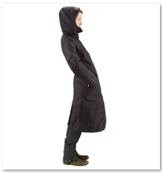

# Richtlijnen voor training voor Smart Content Service {#smart-content-service-training-guidelines}

De Smart Content Service vereist dat de trainingsafbeeldingen aan bepaalde richtlijnen voldoen om uw merkafbeeldingen effectief te kunnen labelen.

## Richtsnoeren voor opleiding {#guidelines-for-training}

Voor de beste resultaten moeten de afbeeldingen in de trainingsset voldoen aan de volgende richtlijnen:

**Hoeveelheid en grootte:****Minimaal 30 afbeeldingen per tag**. Minimaal 500 pixels aan de langere zijde.

**Coherentie**: Afbeeldingen voor een tag moeten visueel op elkaar lijken.

Het is bijvoorbeeld geen goed idee om al deze afbeeldingen als *mijn-partij* te labelen (voor training), omdat ze er anders uitzien.

**Dekking**: De beelden in de training moeten voldoende uiteenlopend zijn. Het is de bedoeling om een paar maar redelijk verschillende voorbeelden te geven, zodat AEM leert zich te richten op de juiste dingen. Als u dezelfde tag toepast op visueel verschillende afbeeldingen, moet u ten minste vijf voorbeelden van elke soort opnemen.

Neem voor het vervolgkeuzemodel ** van het label bijvoorbeeld meer trainingsafbeeldingen op, vergelijkbaar met de gemarkeerde afbeelding hieronder, zodat de service vergelijkbare afbeeldingen nauwkeuriger kan identificeren tijdens het labelen.

**Vervorming/obstructie**: De dienst rijdt beter op beelden die minder afleiding hebben (vooraanstaande achtergronden, niet-verwante begeleiding, zoals voorwerpen/personen met het hoofdonderwerp).

Voor de tag *casual-shoe* is de tweede afbeelding bijvoorbeeld geen goede trainingskandidaat.

**Volledigheid:** Als een afbeelding in aanmerking komt voor meer dan één tag, voegt u alle relevante tags toe voordat u de afbeelding opneemt voor training. Als het bijvoorbeeld gaat om tags zoals *regenjas* en *modelweergave*, voegt u beide tags toe aan de desbetreffende asset voordat u dit opneemt voor training.

## Beperkingen {#limitations}

Verbeterde slimme tags zijn gebaseerd op leermodellen van merkafbeeldingen en hun tags. Deze modellen zijn niet altijd perfect bij het identificeren van tags. De huidige versie van de Smart Content Service heeft de volgende beperkingen:

* Kan subtiele verschillen in afbeeldingen niet herkennen. Bijvoorbeeld dunne en standaard gemonteerde hemden.
* Kan geen tags identificeren op basis van kleine patronen/delen van een afbeelding. Bijvoorbeeld logo&#39;s op T-shirts.
* Tags worden ondersteund in de landinstellingen waarin AEM wordt ondersteund. Zie Opmerkingen bij de release [Smart Content Services voor een lijst met talen](/help/release-notes/smart-content-service-release-notes.md).

Als u wilt zoeken naar elementen met slimme tags (normaal of uitgebreid), gebruikt u de vanuit de gebruikersinterface uitgevoerde zoekopdracht (zoeken in volledige tekst). Er is geen afzonderlijke zoekvoorspelling voor slimme tags.

>[!NOTE]
>
>Of de Smart Content Service uw tags kan trainen en deze op andere afbeeldingen kan toepassen, hangt af van de kwaliteit van de afbeeldingen die u voor de training gebruikt.
>
>Voor de beste resultaten raadt Adobe u aan visueel vergelijkbare afbeeldingen te gebruiken om de service voor elke tag op te leiden.

