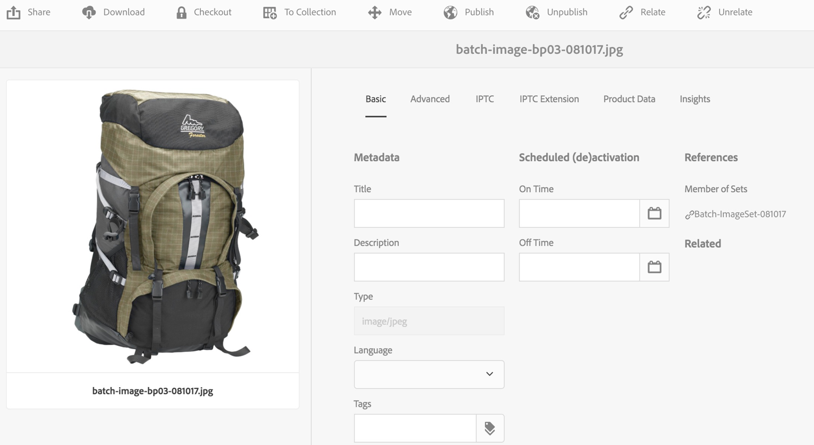

# Spin Sets {#spin-sets}

Een centrifugeerset simuleert de echte handeling waarbij een object wordt omgedraaid om het te onderzoeken. Met centrifuges kunt u items vanuit elke hoek bekijken en de belangrijkste visuele details vanuit elke hoek verkrijgen.

Een centrifugeerset simuleert een kijkervaring van 360 graden. Dynamic Media biedt centrifugesets met één as waarin gebruikers een item kunnen roteren. Bovendien kunnen gebruikers met een paar eenvoudige muisklikken in- en uitzoomen op een vrije vorm en een willekeurige weergave pannen. Op deze manier kunnen gebruikers een item vanuit een bepaald gezichtspunt nader onderzoeken.

De Reeksen van de draaien worden aangewezen door een banner met het woord **[!UICONTROL SPINSET]**. Als de Spin-set is gepubliceerd, staat bovendien de publicatiedatum, aangegeven door het pictogram **[!UICONTROL World]**, op de banner samen met de laatste wijzigingsdatum, die wordt aangegeven door het pictogram **[!UICONTROL Pencil]**.

>[!NOTE]
>
>Zie [Elementen beheren met de aanraakinterface](managing-assets-touch-ui.md) voor informatie over de gebruikersinterface van Elementen.

## Snel starten: Draaisets {#quick-start-spin-sets}

Volg deze workflow om snel weer aan de slag te gaan met centrifuges:

1. [Upload uw afbeeldingen voor meerdere weergaven.](#uploading-assets-for-spin-sets)

   U hebt minstens 8-12 opnamen van een item nodig voor een eendimensionale centrifugeset en 16-24 voor een tweedimensionale centrifugeset. De opnamen moeten regelmatig worden gemaakt om de indruk te wekken dat het item draait en wordt gespiegeld. Als een eendimensionale centrifugeset bijvoorbeeld 12 opnamen bevat, roteert u het item 30 graden (360/12) voor elke opname.

1. [Spin-sets maken.](#creating-spin-sets)

   Als u een centrifugeset wilt maken, selecteert u **[!UICONTROL Create > Spin Set]** en geeft u de set een naam, kiest u de elementen en sorteert u de afbeeldingen in de volgorde waarin deze worden weergegeven.

   Zie [Werken met kiezers](working-with-selectors.md).

   >[!NOTE]
   >
   >U kunt ook automatisch centrifugesets maken via [voorinstellingen voor batchsets](/help/assets/config-dms7.md#creating-batch-set-presets-to-auto-generate-image-sets-and-spin-sets).
   >
   >*Batchsets worden gemaakt door het IPS (Image Production System) als onderdeel van het opnemen van elementen en zijn alleen beschikbaar in de Dynamic Media-Scene7-modus*.

1. Stel [Voorinstellingen van de viewer voor de centrifugeerset ](managing-viewer-presets.md) naar wens in.

   Beheerders kunnen voorinstellingen voor de voorinstelling Spin Set Viewer maken of wijzigen. Als u de centrifugeset wilt weergeven met een viewervoorinstelling, selecteert u de centrifugeset en selecteert u **[!UICONTROL Viewers]** in het keuzemenu voor de linkertrack.

   Zie **[!UICONTROL Tools > Assets > Viewer Presets]** om voorinstellingen voor viewers te maken of te bewerken.

   Zie [Voorinstellingen voor viewers toevoegen en bewerken.](managing-viewer-presets.md)

1. [Spin-sets](#viewing-spin-sets) weergeven.

   U kunt sets die zijn gemaakt met voorinstellingen voor batchsets op drie verschillende manieren weergeven en openen. (Sets die zijn gemaakt met voorinstellingen voor batchsets, worden *niet* weergegeven in de gebruikersinterface.)

1. [Voorvertoning van centrifuges.](previewing-assets.md)

   Selecteer de centrifugeset en u kunt er een voorvertoning van weergeven. Roteer de centrifugeset. U kunt verschillende kijkers van **[!UICONTROL Viewers]** menu kiezen, beschikbaar van het linkerspoordrop-down menu.

1. [Spin-sets publiceren.](publishing-dynamicmedia-assets.md)

   Als u een centrifugeset publiceert, wordt de volgorde geactiveerd waarin afbeeldingen in een centrifugeset worden weergegeven. Zorg ervoor dat u ze zo bestelt dat de centrifuge een vloeiende weergave van 360 graden biedt.**[!UICONTROL URL]** en  **[!UICONTROL Embed]** tekenreeks. Daarnaast moet u [de viewervoorinstelling](managing-viewer-presets.md) publiceren.

1. [Koppel URL&#39;s aan uw webtoepassing ](linking-urls-to-yourwebapplication.md) of  [sluit de video- of afbeeldingsviewer](embed-code.md) in.

   AEM Assets maakt URL-aanroepen voor centrifuges en activeert deze nadat u de centrifuges hebt gepubliceerd. U kunt deze URL&#39;s kopiëren wanneer u elementen voorvertoont. U kunt ze ook insluiten op uw website.

   Selecteer eerst de spinset en selecteer vervolgens **[!UICONTROL Viewers]** in het vervolgkeuzemenu voor het linkerspoor.

   Zie [Een spinset koppelen aan een webpagina](linking-urls-to-yourwebapplication.md) en [De video- of afbeeldingsviewer insluiten](embed-code.md).

Als dat nodig is, kunt u [centrifuges bewerken](#editing-spin-sets). Bovendien kunt u [Vastgestelde eigenschappen van de Spin](managing-assets-touch-ui.md#editing-properties) bekijken en uitgeven.

## Elementen uploaden voor centrifuges {#uploading-assets-for-spin-sets}

U hebt minstens 8-12 opnamen van een item nodig voor een eendimensionale centrifugeset en 16-24 voor een tweedimensionale centrifugeset. De opnamen moeten regelmatig worden gemaakt om de indruk te wekken dat het item draait en wordt gespiegeld. Als een eendimensionale centrifugeset bijvoorbeeld 12 opnamen bevat, roteert u het item 30 graden (360/12) voor elke opname.

U kunt afbeeldingen voor de centrifuges uploaden zoals u [elk ander element in AEM Assets](managing-assets-touch-ui.md) uploadt.

### Richtlijnen voor het maken van centrifuge-afbeeldingen {#guidelines-for-shooting-spin-set-images}

Hieronder vindt u een aantal aanbevolen procedures voor het uitvoeren van gecentreerde afbeeldingen. Over het algemeen geldt dat hoe meer afbeeldingen u in een centrifugeset hebt, hoe beter het effect van het draaien van de afbeelding is. Als u echter veel afbeeldingen in de set opneemt, neemt de laadtijd van de afbeeldingen toe. AEM raadt deze richtlijnen aan voor het maken van foto&#39;s voor gebruik in centrifuges:

* Gebruik minimaal 8-12 afbeeldingen in een eendimensionale centrifuge en 16-24 afbeeldingen in een tweedimensionale centrifugeset. U hebt minimaal 8 afbeeldingen nodig om 360 graden te kunnen draaien. Eendimensionale centrifuges komen vaker voor omdat het maken van tweedimensionale centrifuges arbeidsintensief is.
* Gebruik een indeling zonder verlies. TIFF en PNG worden aanbevolen.
* Masker alle afbeeldingen zodat het item op een zuiver witte of andere achtergrond met veel contrast wordt weergegeven. Voeg desgewenst schaduwen toe.
* Zorg ervoor dat de productdetails goed verlicht en in nadruk zijn.
* Neem spin beelden voor modekleding met een mannequin of een model. Vaak wordt de mannequin volledig gemaskeerd (met behulp van een glazen mannequin) of wordt in de afbeelding een gestileerde mannequin/dressform weergegeven. U kunt een op-model spin-reeks tot stand brengen door het aantal hoeken te bepalen. Markeer elke hoek met band op de vloer om het model te begeleiden en in de richting van elke opname te kijken.

## Spin-sets maken {#creating-spin-sets}

De volgorde waarin afbeeldingen worden weergegeven in een draaiset. Zorg ervoor dat u ze zo bestelt dat de centrifuge een vloeiende weergave van 360 graden biedt.

>[!NOTE]
>
>U kunt ook automatisch spinsets maken via [voorinstellingen voor batchsets](/help/assets/config-dms7.md#creating-batch-set-presets-to-auto-generate-image-sets-and-spin-sets).
>
>Batchsets worden gemaakt door het IPS (Image Production System) als onderdeel van het opnemen van elementen en zijn alleen beschikbaar in de Dynamic Media-Scene7-modus.
>
>Zie &quot;Voorinstellingen voor batchsets maken om automatisch afbeeldingssets en centrifuges te genereren&quot; in [Dynamic Media configureren - Scene7-modus](/help/assets/config-dms7.md#creating-batch-set-presets-to-auto-generate-image-sets-and-spin-sets).

**Om centrifuges te maken:**

1. Navigeer in Elementen naar de plaats waar u een centrifugeset wilt maken, tik **[!UICONTROL Create]** en selecteer **[!UICONTROL Spin Set]**. U kunt de set ook maken vanuit een map die uw assets bevat.

   

1. Voer op de pagina **[!UICONTROL Spin Set Editor]** in het veld **[!UICONTROL Title]** een naam in voor de centrifugeset. De naam wordt weergegeven in de banner over de centrifugeset. Voer eventueel een beschrijving in.

   

   Wanneer u de centrifugeset maakt, kunt u de miniatuur van de centrifugeset wijzigen of AEM de miniatuur automatisch selecteren op basis van de elementen in de centrifugeset. Tik op **[!UICONTROL Change thumbnail]** om een miniatuur te selecteren. Selecteer een willekeurige afbeelding (u kunt ook naar andere mappen navigeren om afbeeldingen te zoeken). Selecteer **[!UICONTROL Switch to Automatic thumbnail]** als u een miniatuur hebt geselecteerd en vervolgens wilt bepalen dat AEM een miniatuur moet genereren op basis van de centrifugeset.

1. Voer een van de volgende handelingen uit:

   * Tik in de linkerbovenhoek van de pagina **[!UICONTROL Spin Set Editor]** op **[!UICONTROL Add Asset]**.
   * Tik in het midden van de pagina **[!UICONTROL Spin Set Editor]** op **[!UICONTROL Tap to open Asset Selector]**.

   Tik om de elementen te selecteren die u in de centrifugeset wilt opnemen. Geselecteerde assets hebben een vinkje. Tik op **[!UICONTROL Select]** in de rechterbovenhoek van de pagina als u klaar bent.

   Met de assetkiezer kunt u naar assets zoeken door een trefwoord te typen en op **[!UICONTROL Return]** te tikken. U kunt ook filters toepassen om de zoekresultaten te verfijnen. U kunt filteren op pad, verzameling, bestandstype en tag. Selecteer het filter en tik op het pictogram **[!UICONTROL Filter]** op de werkbalk. Tik op **[!UICONTROL View]**, **[!UICONTROL Card View]** of **[!UICONTROL List View]** om de weergave in de rechterbovenhoek van de pagina te wijzigen.**[!UICONTROL Column View]**

   Zie [Werken met kiezers](working-with-selectors.md).

   

1. Wanneer u elementen aan de set toevoegt, worden deze automatisch in alfanumerieke volgorde toegevoegd. Nadat u elementen hebt toegevoegd, kunt u deze handmatig opnieuw ordenen of sorteren. Sleep indien nodig het pictogram **[!UICONTROL Reorder]** van een element naar rechts naast de bestandsnaam van het element om de volgorde van de afbeeldingen in de lijst met sets te wijzigen.

   

1. (Optioneel) Voer een van de volgende handelingen uit:

   * Als u een afbeelding wilt verwijderen, selecteert u de afbeelding en tikt u op **[!UICONTROL Delete Asset]**.
   * Tik op **[!UICONTROL Preset]** en selecteer vervolgens een voorinstelling die u op alle elementen tegelijk wilt toepassen om een voorinstelling toe te passen in de rechterbovenhoek van de pagina.

1. Tik op **[!UICONTROL Save]**. De nieuwe centrifugeset wordt weergegeven in de map waarin u deze hebt gemaakt.

## Spin-sets {#viewing-spin-sets} weergeven

U kunt centrifuges maken in de gebruikersinterface of automatisch met [voorinstellingen voor batchsets](/help/assets/config-dms7.md#creating-batch-set-presets-to-auto-generate-image-sets-and-spin-sets). Sets die zijn gemaakt met voorinstellingen voor batchsets, worden echter *niet* weergegeven in de gebruikersinterface. U hebt op drie verschillende manieren toegang tot sets die zijn gemaakt met voorinstellingen voor batchsets. (Deze methoden zijn ook beschikbaar als u de centrifuges in de gebruikersinterface hebt gemaakt.)

U kunt sets ook weergeven in de gebruikersinterface zoals wordt beschreven in [Spin Sets bewerken](#editing-spin-sets).

**Om de reeksen van Draaien te bekijken:**

1. Bij het openen van de eigenschappen van een afzonderlijk element. Eigenschappen geven aan welke sets het geselecteerde element lid zijn van (onder **[!UICONTROL Member of Sets]**). Tik op de naam van de set om de volledige set weer te geven.

   

1. Van een lidafbeelding van om het even welke set. Selecteer het menu **[!UICONTROL Sets]** om de sets weer te geven waarvan het element lid is.

   

1. Bij het zoeken kunt u **[!UICONTROL Filters]** selecteren, vervolgens **[!UICONTROL Dynamic Media]** uitvouwen en **[!UICONTROL Sets]** selecteren.

   De zoekopdracht retourneert overeenkomende sets die handmatig in de gebruikersinterface zijn gemaakt of die automatisch zijn gemaakt met voorinstellingen voor batchsets. Voor geautomatiseerde reeksen, wordt de onderzoeksvraag geleid gebruikend **[!UICONTROL Starts with]** onderzoekscriteria die van AEM onderzoek verschillend zijn dat op het gebruiken van **[!UICONTROL Contains]** onderzoekscriteria gebaseerd is. Het instellen van het filter op **[!UICONTROL Sets]** is de enige manier om geautomatiseerde sets te doorzoeken.

   

## Spinsets bewerken {#editing-spin-sets}

U kunt diverse bewerkingstaken uitvoeren op bijvoorbeeld de volgende centrifuges:

* Voeg afbeeldingen toe aan de centrifugeset.
* Wijzig de volgorde van de afbeeldingen in de centrifugeset.
* Elementen in de centrifugeset verwijderen.
* Voorinstellingen voor viewers toepassen.
* Verwijder de centrifugeset.

**Een centrifugeset bewerken:**

1. Voer een van de volgende handelingen uit:

   * Houd de muisaanwijzer boven een in een centrifugeerset geplaatst element en tik op **[!UICONTROL Edit]** (potloodpictogram).
   * Tik met de muis over een gecentreerd element op **[!UICONTROL Select]** (vinkpictogram) en tik **[!UICONTROL Edit]** op de werkbalk.
   * Tik op een gecentreerd element en tik op **[!UICONTROL Edit]** (potloodpictogram) op de werkbalk.

1. Voer een van de volgende handelingen uit om de centrifugeset te bewerken:

   * Als u de volgorde van afbeeldingen wilt wijzigen, sleept u een afbeelding naar een nieuwe locatie (selecteer het pictogram voor herschikken om items te verplaatsen).
   * Tik op de kolomkop om items in oplopende of aflopende volgorde te sorteren.
   * Tik op **[!UICONTROL Add Asset]** om een element toe te voegen of een bestaand element bij te werken. Navigeer naar een element, selecteer het en tik op **[!UICONTROL Select]** in de rechterbovenhoek.
Als u de afbeelding verwijdert die AEM gebruikt voor de miniatuur door deze te vervangen door een andere afbeelding, wordt het oorspronkelijke element nog steeds weergegeven.
   * Als u een element wilt verwijderen, selecteert u het en tikt u op **[!UICONTROL Delete Asset]**.
   * Tik op het pictogram **[!UICONTROL Preset]** en selecteer een voorinstelling om een voorinstelling toe te passen.
   * Als u een volledige centrifugeset wilt verwijderen, navigeert u naar de centrifugeset, selecteert u deze en selecteert u **[!UICONTROL Delete]**

      >[!NOTE]
      >* U kunt de afbeeldingen in een Spin-set bewerken door naar de set te navigeren, op **[!UICONTROL Set Members]** in de linkertrack te tikken en vervolgens op **[!UICONTROL Edit]** (potloodpictogram) op een afzonderlijk element te tikken om het bewerkingsvenster te openen.

1. Klik **[!UICONTROL Save]** wanneer klaar het uitgeven.

## Voorvertoning van centrifuges {#previewing-spin-sets}

Zie [Elementen voorvertonen](previewing-assets.md).

## Spin-sets {#publishing-spin-sets} publiceren

Zie [Elementen publiceren](publishing-dynamicmedia-assets.md).
