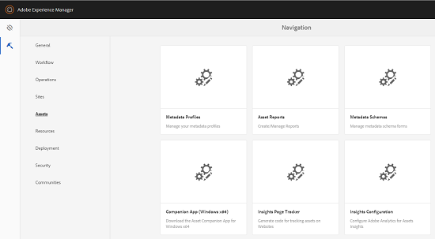

# Elementinzichten configureren {#configuring-asset-insights}

Adobe Experience Manager Assets haalt gebruiksgegevens op rond [!DNL Experience Manager] elementen die door websites van derden van Adobe Analytics worden gebruikt. Om Assets Insights toe te laten om deze gegevens terug te winnen en inzichten te produceren, vorm eerst de eigenschap om met Adobe Analytics te integreren.

>[!NOTE]
>
>Inzichten worden alleen ondersteund en opgegeven voor afbeeldingen.

1. Klik in AEM op **[!UICONTROL Tools > Assets]**.

   

1. Klik op de **[!UICONTROL Insights Configuration]**-kaart.
1. Selecteer een datacenter in de wizard en geef uw gegevens op, inclusief de naam van uw organisatie, gebruikersnaam en wachtwoord.

   

1. Klik of tik op **[!UICONTROL Authenticate]**.
1. Nadat [!DNL Experience Manager] uw geloofsbrieven voor authentiek verklaart, van **[!UICONTROL Report Suite]** lijst, kies een het rapportreeks van Adobe Analytics van waar u de Inzichten van Activa wilt om gegevens te halen. Klik op **[!UICONTROL Add]**.
1. Nadat [!DNL Experience Manager] uw rapportsuite heeft ingesteld, klikt of tikt u op **[!UICONTROL Done]**.

## Paginanummering {#page-tracker}

Nadat u uw account Analytics hebt geconfigureerd, wordt de code van Paginanummering voor u gegenereerd. Als u met behulp van Elementen inzicht wilt krijgen in het bijhouden van [!DNL Experience Manager]-elementen die worden gebruikt op websites van derden, neemt u de paginacontrackercode op in de websitecode. Gebruik het hulpprogramma Paginanummering in [!DNL Experience Manager] Elementen om de code van de paginacontracker te genereren. Zie [Paginanummering gebruiken en code insluiten in webpagina&#39;s van derden](touch-ui-using-page-tracker.md) voor meer informatie over het opnemen van de code in Paginanummering in webpagina&#39;s.

1. Klik in AEM op **[!UICONTROL Tools > Assets]**.

   

1. Klik op de **[!UICONTROL Navigation]**-pagina op de **[!UICONTROL Insights Page Tracker]**-kaart.
1. Klik op het pictogram **[!UICONTROL Download]** om de code van de paginacontracker te downloaden.
