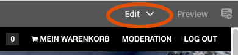
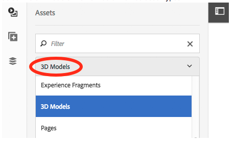

# Werken met de component 3D-sites {#working-with-the-d-sites-component}

AEM 3D bevat een AEM Sites-component waarmee u interactieve weergave van 3D-modellen op webpagina&#39;s kunt implementeren.

Nadat u de 3D-component hebt toegevoegd, kunt u [het 3D-element in die component weergeven.](viewing-3d-assets.md)

## De 3D-component toevoegen aan de paginasjabloon {#adding-the-d-component-to-the-page-template}

U moet de 3D-component op de pagina inschakelen voordat u deze op een pagina kunt plaatsen. Zie [Sjablonen bewerken](/help/sites-authoring/templates.md#editing-a-template-layout-template-author) voor gedetailleerde informatie over het inschakelen van componenten in sjablonen.

**De 3D-component toevoegen aan de paginasjabloon**:

1. Ga naar **[!UICONTROL Tools > General > Templates]**.

1. Navigeer naar de paginasjabloon waarin u de 3D-component wilt inschakelen en selecteer de sjabloon.

1. Tik **[!UICONTROL Edit]** om de sjabloon te openen.
1. Selecteer in de rechterbovenhoek van de pagina **[!UICONTROL Structure]**-modus in het keuzemenu als deze nog niet actief is.

   

1. Tik in het gebied **[!UICONTROL Layout Container]** om het te selecteren.

1. Tik op de knop **[!UICONTROL Policy]** om **[!UICONTROL Policy Editor]** te openen.
1. Selecteer in de sectie **[!UICONTROL Properties]** het vinkje **[!UICONTROL 3D]** en tik **[!UICONTROL Done]** om de wijzigingen op te slaan en **[!UICONTROL Policy Editor]** te sluiten.

   U kunt de component 3D-sites nu op alle pagina&#39;s plaatsen die deze sjabloon gebruiken.

## De 3D-viewercomponent toevoegen aan een webpagina {#adding-the-d-viewer-component-to-a-web-page}

>[!CAUTION]
>
>Deze versie van AEM 3D ondersteunt slechts één instantie van de 3D-component op elke webpagina. Meerdere 3D-componenten op dezelfde pagina werken niet correct.

**De 3D-viewercomponent toevoegen aan een webpagina**:

1. Open AEM Sites en selecteer de webpagina waaraan u de 3D-component wilt toevoegen.

1. Tik op het pictogram **[!UICONTROL Edit]** (potlood) om de pagina in de paginaeditor te openen. Zorg ervoor dat de modus **[!UICONTROL Edit]** rechtsboven op de pagina is geselecteerd.

   

1. Tik op de spoorkiezer om het zijpaneel te openen.

1. Tik op het plusteken om de lijst **[!UICONTROL Components]** te openen.

1. Sleep de component **[!UICONTROL 3D Viewer]** van de lijst **[!UICONTROL Components]** naar de locatie op de pagina waar u de 3D-viewer wilt weergeven.

## De 3D-component {#configuring-the-d-component} configureren

1. Selecteer in de AEM Sites-pagina-editor de **[!UICONTROL 3D Viewer]**-component die u eerder aan de pagina hebt toegevoegd.

1. Tik op het pictogram **[!UICONTROL Configuration]** (moersleutel) om het dialoogvenster voor componentconfiguratie te openen.

   U kunt de volgende componenteigenschappen instellen:

   <table> 
    <tbody> 
    <tr> 
    <td>Eigenschap</td> 
    <td>Beschrijving</td> 
    <td>Toepasselijkheid</td> 
    </tr> 
    <tr> 
    <td>Hoogte (px)</td> 
    <td>Geef de gewenste hoogte van de 3D-component op in pixels. Als deze optie leeg blijft, is de standaardwaarde 600 pixels.</td> 
    <td> </td> 
    </tr> 
    <tr> 
    <td>Werkgebiednaam</td> 
    <td>
Selecteer een 3D-werkgebied in de lijst met beschikbare stadia. Het werkgebied biedt achtergrond en belichting.
 
Zie <a href="/help/assets/about-the-use-of-stages-in-aem-3d.md" target="_blank">Informatie over het gebruik van fasen in AEM 3D-sites</a>.
 </td> 
    <td>Genegeerd voor Adobe Dimension-middelen.</td> 
    </tr> 
    <tr> 
    <td>Automatische centrifugeersnelheid (rpm)</td> 
    <td>
De 3D-viewer draait de camera continu na het laden en opnieuw instellen. Automatisch draaien wordt beëindigd wanneer de gebruiker een handmatige omdraaiactie start.
 
U kunt de centrifugesnelheid in RPM opgeven met de volgende waarden:
 
        <ul> 
        <li>Een positieve waarde instellen op rechts draaien</li> 
        <li>Een negatieve waarde instellen op links draaien</li> 
        <li>Stel een waarde 0 in om automatisch draaien uit te schakelen.</li> 
        </ul> 
De standaardwaarde is 3 RPM, gelijk aan 20 seconden per volledige omwenteling.    <strong>Opmerking: </strong> de centrifugesnelheid neemt een framesnelheid van 60/sec aan. Deze snelheid wordt meestal bereikt met kleine tot middelgrote modellen op krachtigere grafische hardware. Grotere modellen of langzamere apparaten draaien automatisch met lagere snelheden.
 </td> 
    <td>Genegeerd voor Adobe Dimension-middelen.</td> 
    </tr> 
    <tr> 
    <td>Kleur van navigatieknop</td> 
    <td>Gebruik de kleurkiezer om de primaire kleur voor de besturingsknoppen van de viewer te kiezen.</td> 
    <td>Genegeerd voor Adobe Dimension-assen.</td> 
    </tr> 
    <tr> 
    <td>Navigatieaanwijskleur</td> 
    <td>Gebruik de kleurkiezer om de aanwijskleur/geselecteerde kleur voor de besturingsknoppen van de viewer te kiezen.</td> 
    <td>Genegeerd voor Adobe Dimension-middelen.</td> 
    </tr> 
    <tr> 
    <td>Stalen tonen</td> 
    <td>Voor toekomstig gebruik.</td> 
    <td>Genegeerd voor Adobe Dimension-middelen.</td> 
    </tr> 
    <tr> 
    <td>GLTF-cameravoorinstellingen tonen</td> 
    <td>De voorinstellingen van de camera die aanwezig kunnen zijn in Adobe Dimension-elementen weergeven of verbergen.</td> 
    <td>Alleen voor Adobe Dimension-middelen.</td> 
    </tr> 
    <tr> 
    <td>GLTF-achtergrondkleur</td> 
    <td>Standaardachtergrondkleur als het 3D-model geen achtergrond bevat.</td> 
    <td>Alleen voor Adobe Dimension-middelen.</td> 
    </tr> 
    </tbody> 
   </table>

1. Tik op het vinkje om de wijzigingen op te slaan.

   Naast de instellingen die beschikbaar zijn in het dialoogvenster voor componentconfiguratie, is een aantal algemene configuratie-instellingen beschikbaar die kunnen worden gewijzigd door middel van de CRXDE Lite.
Zie [Geavanceerde configuratie-instellingen](advanced-config-3d.md) voor gedetailleerde informatie over deze algemene instellingen.

## Een 3D-model toewijzen aan de component {#assigning-a-d-model-to-the-component}

1. Klik in de AEM Sites-pagina-editor op het pictogram **[!UICONTROL Assets]** om de lijst Elementen in het zijpaneel te openen.

1. Selecteer het filter **[!UICONTROL 3D Models]** om ongewenste elementtypen te verbergen.

   

1. Zoek naar of blader aan 3D activa die u op de pagina wilt bekijken die wordt uitgegeven.

1. Sleep het 3D-element van de lijst **[!UICONTROL Assets]** naar de component **[!UICONTROL 3D Viewer]** die eerder op de pagina is geplaatst.

   Adobe Dimension-elementen worden gerenderd met behulp van nieuwe viewertechnologie die is gebaseerd op de open glTF-standaard, terwijl alle andere 3D-elementen afhankelijk zijn van de klassieke AEM 3D webGL-viewer. De component selecteert automatisch de juiste viewer op basis van het type van het 3D-model.

## Een voorbeeld weergeven van een webpagina met een 3D-component {#previewing-a-web-page-that-has-a-d-component}

In de modus **[!UICONTROL Edit]** wordt het 3D-model weergegeven in de 3D-component, maar interactie met het model is niet mogelijk.

U kunt een voorvertoning van de webpagina weergeven in de pagina-editor, met volledige toegang tot de functionaliteit van de 3D-component.

Zie ook [3D-elementen weergeven in de 3D-component Sites](viewing-3d-assets.md#viewing-d-assets-in-the-sites-d-component).

**Een voorvertoning weergeven van een webpagina met een 3D-component**:

1. Voer een van de volgende handelingen uit:

   * Rechtsboven op de pagina klikt u op **[!UICONTROL Preview]** om de voorvertoningsmodus te activeren.
   * Verwijder `/edit.html` uit de pagina-URL in de browser.

## De pagina en elementen {#publishing-the-page-and-assets} publiceren

Zie [Elementen publiceren](managing-assets-touch-ui.md) voor informatie over het publiceren van elementen. Zie [Pagina&#39;s publiceren](/help/sites-authoring/publishing-pages.md) voor informatie over hoe u pagina&#39;s publiceert.

>[!NOTE]
>
>Als u het menu-item **[!UICONTROL Publish Page]** in het menu **[!UICONTROL Page Information]** gebruikt, worden de pagina en alle afhankelijkheden van de primaire pagina gepubliceerd. Secundaire afhankelijkheden waarnaar mogelijk wordt verwezen door het 3D-model en/of het 3D-werkgebied, zoals structuurafbeeldingen en IBL-afbeeldingen, worden niet gepubliceerd wanneer u de pagina op deze manier publiceert.
>
>Adobe raadt u aan alle 3D-elementen en hun afhankelijkheden rechtstreeks vanuit AEM Assets te publiceren voordat u de webpagina publiceert die naar deze elementen verwijst.

