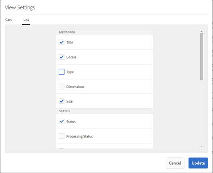
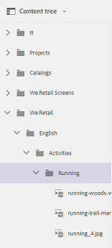

# Verbeterde gebruikerservaring in middelen {#user-experience-enhancements-in-assets}

>[!CAUTION]
>
>AEM 6.4 heeft het einde van de uitgebreide ondersteuning bereikt en deze documentatie wordt niet meer bijgewerkt. Raadpleeg voor meer informatie onze [technische ondersteuningsperioden](https://helpx.adobe.com/support/programs/eol-matrix.html). Ondersteunde versies zoeken [hier](https://experienceleague.adobe.com/docs/).

[!DNL Experience Manager] 6.4 De middelen omvatten verscheidene gebruiksverbeteringen die een naadloze gebruikerservaring verstrekken en productiviteit verbeteren. De toename in de snelheid waarmee u uw go-to-market inhoud kunt creëren/beheren verbetert de inhoudssnelheid van de zaken.

De interface is responsiever, waardoor u efficiënt een grote portfolio met elementen kunt beheren. U kunt snel een lange lijst met items doorzoeken, weergeven, sorteren en vloeiend schuiven.

U kunt de verschillende weergaven aanpassen: Kaart-, Lijst- en Kolomweergaven. U kunt bijvoorbeeld de grootte configureren van miniaturen die u wilt weergeven in de kaartweergave. Voor de lijstweergave kunt u het detailniveau configureren dat u wilt weergeven voor elementen in de lijst. [!DNL Experience Manager] 6.4 Middelen zijn voorzien van een nieuwe structuurweergave waarmee u eenvoudig door de gegevensopslagruimte van middelen kunt navigeren en uw middelen kunt zoeken.

## Lazy loading {#lazy-loading}

Wanneer u naar elementen bladert of deze zoekt in [!DNL Experience Manager] 6.4 Elementen, maximaal 200 elementen tegelijk worden weergegeven. U kunt sneller door de resultaten scrollen, die vooral wanneer het doorbladeren door een lange lijst van resultaten nuttig is. Omdat een aanzienlijk aantal elementen tegelijk wordt geladen, verloopt het bladeren soepel.

Als u op een element tikt of erop klikt om de detailpagina weer te geven, kunt u gewoon terugkeren naar de resultatenpagina door op de knop Terug op de werkbalk te tikken of erop te klikken.

## Verbeteringen voor kaartweergave {#card-view-improvements}

Afhankelijk van het apparaat dat u gebruikt en de hoeveelheid details die u nodig hebt, kunt u de grootte van de elementminiaturen in de kaartweergave wijzigen. Op deze manier kunt u de weergave aanpassen en het aantal weergegeven miniaturen bepalen.

Voer de volgende stappen uit om het formaat van miniaturen in de kaartweergave te wijzigen:

1. Tik/klik op het pictogram Lay-out op de werkbalk en kies vervolgens het pictogram **[!UICONTROL View Settings]** optie.

   

1. Van de **[!UICONTROL View Settings]** selecteert u de gewenste miniatuurgrootte en tikt u op **[!UICONTROL Update]**.

   

1. Bekijk de miniaturen die in de gekozen grootte worden weergegeven.

   

In de tegel in de kaartweergave wordt nu aanvullende informatie weergegeven, zoals de publicatiestatus.

## Verbeteringen in de lijstweergave {#list-view-improvements}

In de lijstweergave worden in de eerste kolom nu standaard de bestandsnamen van elementen weergegeven. Er wordt ook aanvullende informatie weergegeven, zoals de publicatie- en verwerkingsstatus en de landinstelling.

U kunt kiezen om de hoeveelheid details te vormen u wilt tonen. Tik op het pictogram Lay-out of klik op het pictogram Lay-out **[!UICONTROL View Settings]** en geeft u de kolommen op die u wilt weergeven in het dialoogvenster **[!UICONTROL View Settings]** .

## Verbeteringen in de kolomweergave {#column-view-improvements}

Naast de Kaart- en lijstweergaven kunt u nu vanuit de kolomweergave naar de detailpagina van een element navigeren. Selecteer een element in de kolomweergave en tik/klik op **[!UICONTROL More Details]** onder de activamomentopname.

## Boomstructuurweergave {#tree-view}

[!DNL Experience Manager] 6.4 Middelen zijn voorzien van een structuurweergave waarmee u gemakkelijk door de hiërarchie van elementen kunt bladeren en naar het gewenste middel of de gewenste map kunt navigeren.

Tik op het pictogram GlobalNav in het dialoogvenster `Assets UI`en kiest u **[!UICONTROL Content tree]** in het menu.

Navigeer vanuit de inhoudshiërarchie naar het gewenste element.

## Navigeren door elementdetails {#navigating-asset-details}

De pagina met elementdetails bevat nu de knoppen Vorige en Volgende op de werkbalk, zodat u alle afbeeldingen in een opeenvolgende map kunt bekijken.

Afhankelijk van het apparaat kunt u ook met de pijltoetsen op het toetsenbord heen en weer gaan tussen afbeeldingen.

Afhankelijk van de gekozen indeling kunt u de detailpagina voor een element op de volgende manieren openen:

| **Weergave** | **De pagina met elementdetails openen** |
|---|---|
| [!UICONTROL Card View] | Tik op het element of klik op het element. |
| [!UICONTROL List View] | Tik/klik op het rijitem voor het element in de lijst. |
| [!UICONTROL Column View] | Tik/klik op de knop **[!UICONTROL More Details]** van de elementmomentopname. |

Gebruik de knoppen Vorige/Volgende om heen en weer te gaan tussen de elementen.

