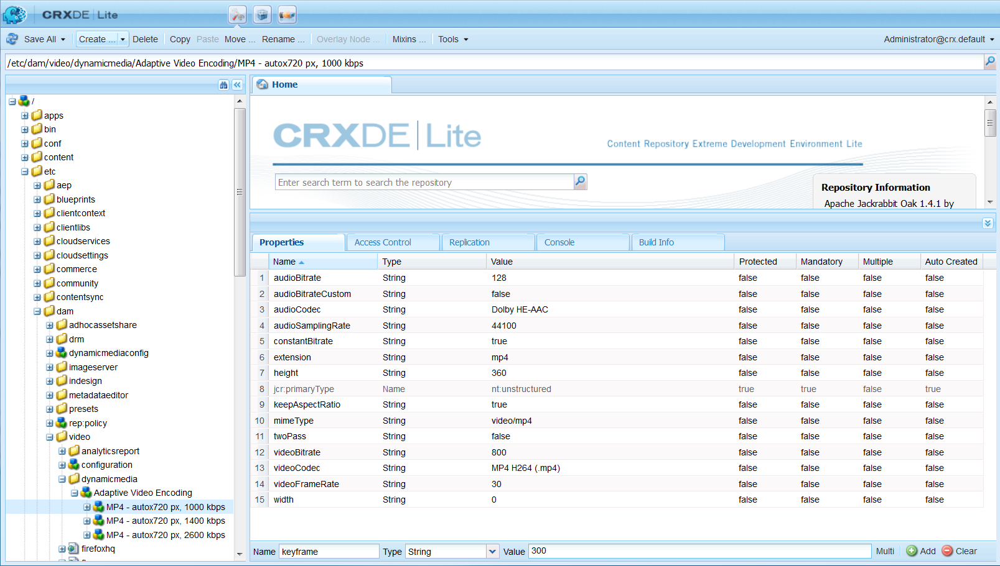

# Dynamic Media video profiles {#video-profiles}

Dynamische media wordt al geleverd met een vooraf gedefinieerd adaptief videocoderingsprofiel. De instellingen in dit out-of-the-box profiel zijn geoptimaliseerd om uw klanten de beste kijkervaring mogelijk te maken. Wanneer u master video&#39;s codeert met het profiel Adaptieve videocodering, past de videospeler tijdens het afspelen automatisch de kwaliteit van de videostream aan op basis van de snelheid van de internetverbinding van uw klanten. Dit wordt adaptieve streaming genoemd.

Hier volgen nog andere factoren die de kwaliteit van uw video&#39;s bepalen:

* **Resolutie van de geüploade master video**

   Als de MP4-video met een lagere resolutie, zoals 240p of 360p, is opgenomen, kan deze niet in HD worden gestreamd.

* **Grootte videospeler**

   Standaard is de instelling in het **[!UICONTROL Width]** profiel Adaptieve videocodering ingesteld op **[!UICONTROL Auto]**. Ook tijdens het afspelen wordt de beste kwaliteit gebruikt op basis van de grootte van de speler.

Zie ook [Aanbevolen werkwijzen voor videocodering](video.md#best-practices-for-encoding-videos).

>[!NOTE]
>
>Als u de metadata van een video en de bijbehorende miniaturen van videoafbeeldingen wilt genereren, moet de video zelf het coderingsproces doorlopen in Dynamische media. In AEM codeert de workflow **[!UICONTROL Dynamic Media Encode Video]** video als u dynamische media hebt ingeschakeld en videocloudservices hebt ingesteld. In deze workflow worden de historie en informatie over fouten van het workflowproces vastgelegd.
>
>Zie [De voortgang van videocodering en YouTube-publicatie controleren](video.md#monitoring-video-encoding-and-youtube-publishing-progress). If you have enabled Dynamic Media and set up video cloud services, the **[!UICONTROL Dynamic Media Encode Video]** workflow automatically takes effect when you upload a video. (Als u geen dynamische media gebruikt, wordt de workflow **[!UICONTROL DAM Update Asset]** van kracht.)
>
>Metagegevens zijn handig wanneer u naar elementen zoekt. De miniaturen zijn statische videobeelden die tijdens het coderen worden gegenereerd. Ze worden door het AEM vereist en in de gebruikersinterface gebruikt om u te helpen video&#39;s visueel te identificeren in de **[!UICONTROL Cards View]**, **[!UICONTROL Search Results]** weergave en de **[!UICONTROL Asset List]** weergave. De gegenereerde miniaturen worden weergegeven wanneer u op het **[!UICONTROL Renditions]** pictogram (het palet van een schilder) van een gecodeerde video tikt.

Wanneer u klaar bent met het maken van het videoprofiel, past u het toe op een map of meerdere mappen. Zie Een videoprofiel [toepassen op mappen.](#applying-a-video-profile-to-folders)

Zie [Elementverwerking](config-dms7.md#configuring-asset-processing)configureren voor het definiëren van geavanceerde verwerkingsparameters voor andere elementtypen.

## Voorinstellingen voor adaptieve videocodering {#adaptive-video-encoding-presets}

In de volgende tabel vindt u de beste praktijken voor het coderen van profielen voor adaptieve videostreaming naar mobiele apparaten en tabletapparaten en bureaubladcomputers. U kunt deze voorinstellingen gebruiken voor elke video met de hoogte-breedteverhouding.

<table> 
 <tbody> 
  <tr> 
   <td><strong>Video-indelingscodec</strong></td> 
   <td><strong>Videogrootte - Breedte (px)</strong></td> 
   <td><strong>Videogrootte - Hoogte (px)</strong></td> 
   <td><strong>Hoogte-breedteverhouding behouden?</strong></td> 
   <td><strong>Videobitsnelheid (Kbps)</strong></td> 
   <td><strong>Videoframesnelheid (FPS)</strong></td> 
   <td><strong>Audiocodec</strong></td> 
   <td><strong>Audiobitsnelheid (Kbps)</strong></td> 
  </tr> 
  <tr> 
   <td>
MP4 H.264 (mp4)
 </td> 
   <td>auto</td> 
   <td>360</td> 
   <td>Ja</td> 
   <td>730</td> 
   <td>30</td> 
   <td>Dolby HE-AAC</td> 
   <td>128</td> 
  </tr> 
  <tr> 
   <td>
MP4 H.264 (mp4)
 </td> 
   <td>auto</td> 
   <td>540</td> 
   <td>Ja</td> 
   <td>2000  </td> 
   <td>30</td> 
   <td>Dolby HE-AAC</td> 
   <td>128</td> 
  </tr> 
  <tr> 
   <td>
MP4 H.264 (mp4)
 </td> 
   <td>auto</td> 
   <td>720  </td> 
   <td>Ja</td> 
   <td>3000  </td> 
   <td>30</td> 
   <td>Dolby HE-AAC</td> 
   <td>128</td> 
  </tr> 
 </tbody> 
</table>

## Een profiel voor dynamische mediacodering voor adaptieve streaming maken {#creating-a-video-encoding-profile-for-adaptive-streaming}

Dynamische media wordt al geleverd met een vooraf gedefinieerd adaptief videocoderingsprofiel - een groep video-uploadinstellingen voor MP4 H.264-systeem dat is geoptimaliseerd voor de beste kijkervaring. U kunt dit profiel gebruiken wanneer u uw video&#39;s uploadt.

Als dit vooraf gedefinieerde profiel echter niet aan uw behoeften voldoet, kunt u zelf een adaptief videocoderingsprofiel maken. Als u de instelling **[!UICONTROL Encode for adaptive streaming]**-*een aanbevolen werkwijze* gebruikt, worden alle coderingsvoorinstellingen die u aan het profiel toevoegt, gevalideerd om ervoor te zorgen dat alle video&#39;s dezelfde hoogte-breedteverhouding hebben. Bovendien worden de gecodeerde video&#39;s beschouwd als een set met multibitsnelheden voor streaming.

Wanneer u het videocoderingsprofiel maakt, ziet u dat de meeste coderingsopties vooraf zijn gevuld met de aanbevolen standaardinstellingen. Als u echter een andere waarde dan de aanbevolen standaardwaarde selecteert, moet u er rekening mee houden dat dit kan leiden tot een slechte videokwaliteit tijdens het afspelen en andere prestatieproblemen.

Voor alle MP4 H.264-videocoderingsvoorinstellingen in het profiel worden dus de volgende waarden gevalideerd om ervoor te zorgen dat deze voor afzonderlijke coderingsvoorinstellingen in het profiel hetzelfde zijn, zodat adaptief streamen mogelijk wordt:

* Video-indelingscodec - MP4 H.264 (.mp4)
* Audiocodec
* Audiobitsnelheid
* Hoogte-breedteverhouding behouden
* Codering met twee controles
* Constante bitsnelheid
* H264-profiel
* Samplingfrequentie audio

Als de waarden niet gelijk zijn, kunt u doorgaan met het maken van het profiel. Let er echter op dat adaptieve streaming niet mogelijk is. In plaats daarvan krijgen gebruikers last van streaming met één bitsnelheid. Het wordt aanbevolen de coderingsinstellingen te bewerken om dezelfde waarden te gebruiken voor afzonderlijke coderingsvoorinstellingen in het profiel. (Let op: de editor voor videoprofielen en voorinstellingen moet de gelijkheid van de aangepaste instellingen voor videocodering afdwingen als deze **[!UICONTROL Encode for adaptive streaming]** is ingeschakeld.)

Zie ook Een videocoderingsprofiel [maken voor progressieve streaming](#creating-a-video-encoding-profile-for-progressive-streaming).

Zie ook [Aanbevolen werkwijzen voor videocodering](video.md#best-practices-for-encoding-videos).

Zie [Elementverwerking](config-dms7.md#configuring-asset-processing)configureren voor het definiëren van geavanceerde verwerkingsparameters voor andere elementtypen.

Wanneer u klaar bent met het maken van het videoprofiel, past u het toe op een of meerdere mappen.

**Een profiel voor videocodering van dynamische media maken voor adaptieve streaming**:

1. Tap or click the AEM logo and navigate to **[!UICONTROL Tools > Assets > Video Profiles]**.
1. Tik **[!UICONTROL Create]** om een nieuw videoprofiel toe te voegen.

1. Voer een naam en beschrijving in voor het profiel.
1. Controleer of dit **[!UICONTROL Encode for adaptive streaming]** is ingeschakeld (standaard).
1. Tik op **[!UICONTROL Add Video Encoding Preset]**.
1. Stel op het **[!UICONTROL Basic]** tabblad de video- en audio-opties in.

   Tik op het informatiepictogram naast elke optie voor extra beschrijvingen of aanbevolen instellingen op basis van de geselecteerde video-indelingscodec.

1. Controleer of onder de kop Videogrootte **[!UICONTROL Keep aspect ratio]** is geselecteerd.
1. Stel de resolutie van de videoframegrootte in pixels in. Gebruik de **[!UICONTROL Auto]** waarde om automatisch te schalen zodat deze overeenkomt met de hoogte-breedteverhouding van de bron (breedte-hoogteverhouding). Bijvoorbeeld Auto x 480 of 640 x Auto.

   Voer een van de volgende handelingen uit:

   * Voer in het **[!UICONTROL Width]** veld **[!UICONTROL auto]**. In the **[!UICONTROL Height]** field, enter a value in pixels.
   * Tik op het **[!UICONTROL Information]** pictogram (i) rechts van de pagina om de grootte van de video te visualiseren **[!UICONTROL Height]** om de **[!UICONTROL Size Calculator]** pagina te openen. Gebruik deze optie **[!UICONTROL Size Calculator]** om de gewenste videoafmetingen in te stellen (weergegeven door het blauwe vak). Tik **[!UICONTROL X]** in de rechterbovenhoek als u klaar bent.

1. (Optioneel) Tik op het **[!UICONTROL Advanced]** tabblad en controleer of het **[!UICONTROL Use Default Values]** selectievakje is ingeschakeld (aanbevolen). U kunt ook geavanceerde video- en audio-instellingen wijzigen.
1. In the upper-right corner of the page, tap **[!UICONTROL Save]** to save the preset.
1. Voer een van de volgende handelingen uit:

   * Herhaal stap 5-10 om extra coderingsvoorinstellingen te maken. (Voor adaptieve videostreaming zijn meerdere videovoorinstellingen vereist.)
   * In the upper-right corner of the page, tap **[!UICONTROL Save]** again to save the profile.

## De voortgang van een coderingstaak controleren {#monitoring-the-progress-of-an-encoding-job}

Er wordt een verwerkingsindicator (of voortgangsbalk) weergegeven waarmee u de voortgang van een videocoderingstaak visueel kunt controleren.

U kunt het `error.log` bestand ook weergeven om de voortgang van een coderingstaak te controleren, te zien of de codering is voltooid of om taakfouten te zien. De `error.log` map staat in de `logs` map waarin het exemplaar van AEM is geïnstalleerd.

## Een profiel voor dynamische mediacodering voor progressieve streaming maken {#creating-a-video-encoding-profile-for-progressive-streaming}

Als u de optie **[!UICONTROL Encode for adaptive streaming]** niet wilt gebruiken, moet u er rekening mee houden dat alle coderingsvoorinstellingen die u aan het profiel toevoegt, worden behandeld als afzonderlijke videoweergaven voor streaming met één bitsnelheid of progressieve videobezorging. Er is ook geen validatie om ervoor te zorgen dat alle video-uitvoeringen dezelfde hoogte-breedteverhouding hebben.

Afhankelijk van de modus waarin u werkt, zijn de ondersteunde codecs voor video-indeling als volgt:

* Dynamische media-Scene7-modus: H.264 (.mp4)
* Dynamische media-hybride modus: H.264 (.mp4), WebM

Zie ook Een videocoderingsprofiel [maken voor adaptieve streaming](#creating-a-video-encoding-profile-for-adaptive-streaming).

Zie ook [Aanbevolen werkwijzen voor videocodering](video.md#best-practices-for-encoding-videos).

Zie [Elementverwerking](config-dms7.md#configuring-asset-processing)configureren voor het definiëren van geavanceerde verwerkingsparameters voor andere elementtypen.

Wanneer u klaar bent met het maken van het videoprofiel, past u het toe op een of meerdere mappen.

**Een profiel voor dynamische mediacodering voor progressieve streaming maken:**

1. Tik op het AEM-logo en ga naar **[!UICONTROL Tools > Assets > Video Profiles]**.
1. Tik **[!UICONTROL Create]** om een nieuw videoprofiel toe te voegen.
1. Voer een naam en beschrijving in voor het profiel.
1. Schakel het **[!UICONTROL Encode for adaptive streaming]** selectievakje uit.
1. Tik op **[!UICONTROL Add Video Encoding Preset]**.
1. Stel op het **[!UICONTROL Basic]** tabblad de video- en audio-opties in.

   Tap the **[!UICONTROL Information]** icon next to each option for additional descriptions or recommended settings based on the selected video format codec.

1. (Optioneel) Schakel onder de kop **Videogrootte** de optie uit **[!UICONTROL Keep aspect ratio]**.
1. Voer in het **[!UICONTROL Width]** veld **[!UICONTROL auto]**; Tik rechts van het **[!UICONTROL Height]** veld op het **[!UICONTROL Information]** pictogram. Use the **[!UICONTROL Size Calculator]** page to further set the video dimension (blue box) how you want. Tik **[!UICONTROL X]** wanneer u klaar bent.
1. (Optioneel) Voer een van de volgende handelingen uit:

   * Tik op de **[!UICONTROL Advanced]** tab en controleer of het **[!UICONTROL Use Default Values]** selectievakje is ingeschakeld (aanbevolen).
   * Schakel het **[!UICONTROL Use Default Values]** selectievakje uit en geef de gewenste video-instellingen en audio-instellingen op.

      Tap the **[!UICONTROL Information]** icon next to each option for additional descriptions or recommended settings based on the selected video format codec.

1. In the upper-right corner of the page, tap **[!UICONTROL Save]** to save the preset.
1. Voer een van de volgende handelingen uit:

   * Herhaal stap 5-10 om extra coderingsvoorinstellingen te maken.
   * Tik in de rechterbovenhoek van de pagina op **[!UICONTROL Save]** om het profiel op te slaan.

## Parameters voor videocodering met aangepaste toevoeging gebruiken {#using-custom-added-video-encoding-parameters}

U kunt een bestaand videocoderingsprofiel bewerken om te profiteren van de geavanceerde parameters voor videocodering die niet in de gebruikersinterface worden gevonden wanneer u een videoprofiel maakt of bewerkt in AEM. Aangepast voegt u een of meer geavanceerde parameters, zoals **[!UICONTROL minBitrate]** en **[!UICONTROL maxBitrate]**, toe aan uw bestaande profiel.

**U kunt als volgt parameters** voor videocodering met aangepaste toevoeging gebruiken:

1. Tik op het AEM-logo en ga naar **[!UICONTROL Tools > General > CRXDE Lite]**.
1. Navigeer op de **[!UICONTROL CRXDE Lite]** pagina in het **[!UICONTROL Explorer]** deelvenster aan de linkerkant naar het volgende:

   `/conf/global/settings/dam/dm/presets/video/*name_of_video_encoding_profile_to_edit*`

1. In the panel on the lower-right side of the page, from the **[!UICONTROL Properties]** tab, specify the **[!UICONTROL Name]**, **[!UICONTROL Type]**, and **[!UICONTROL Value]** of the parameter you want to use.

   U kunt de volgende geavanceerde parameters gebruiken:

   <table> 
    <tbody> 
    <tr> 
    <td><strong>Naam</strong></td> 
    <td><strong>Beschrijving</strong>  </td> 
    <td><strong>Type</strong>  </td> 
    <td><strong>Waarde</strong></td> 
    </tr> 
    <tr> 
    <td><code>h264Level</code></td> 
    <td>H.264-niveau voor codering. Normaal gesproken wordt dit automatisch bepaald op basis van de coderingsinstellingen die u gebruikt.</td> 
    <td><code>String</code></td> 
    <td>
10 * h264 niveau
 
3,0 = 30, 1,3 = 13)
 
Geen standaardwaarde.
 </td> 
    </tr> 
    <tr> 
    <td><code>keyframe</code></td> 
    <td>Het doelaantal frames tussen hoofdframes. Bereken deze waarde om een hoofdframe te genereren na elke 2-10 seconden. Bijvoorbeeld, bij 30 kaders per seconde, zou het keyframe interval 60-300 moeten zijn.    De lagere keyframe intervallen verbeteren stroom het zoeken en stroom omschakelingsgedrag voor adaptieve videocoderingen en kunnen de kwaliteit voor video's ook verbeteren die veel motie hebben. Omdat hoofdframes de grootte van een bestand echter vergroten, resulteert een lager hoofdframe-interval meestal in een lagere algemene videokwaliteit bij een bepaalde bitsnelheid.</td> 
    <td><code>String</code></td> 
    <td>
Positief getal.
 
De standaardwaarde is 300.
 
De aanbevolen waarde voor HLS (Live HTTP-streaming) is 60-90.
 </td> 
    </tr> 
    <tr> 
    <td><code>minBitrate</code></td> 
    <td>
Minimale bitsnelheid voor coderingen met variabele bitsnelheid, in Kbps (kilobits per seconde).
 
Deze parameter is alleen van toepassing wanneer<strong> Constante bitsnelheid</strong> gebruiken op het tabblad Geavanceerd is uitgeschakeld wanneer u een videocoderingsprofiel maakt of bewerkt.
 
Zie ook <a href="/help/assets/video.md#bitrate">Bitsnelheid</a>.
 </td> 
    <td><code>String</code></td> 
    <td>
Positief getal, in Kbps.
 
Geen standaardwaarde.
 </td> 
    </tr> 
    <tr> 
    <td><code>maxBitrate</code></td> 
    <td>
Maximale bitsnelheid voor codering van variabele bitsnelheid, in Kbps.
 
Deze parameter is alleen van toepassing wanneer<strong> Constante bitsnelheid</strong> gebruiken op het tabblad Geavanceerd is uitgeschakeld wanneer u een videocoderingsprofiel maakt of bewerkt.
 
Zie ook <a href="/help/assets/video.md#bitrate">Bitsnelheid</a>.
 </td> 
    <td><code>String</code></td> 
    <td>
Positief getal, in Kbps.
 
Geen standaardwaarde. De aanbevolen waarde bedraagt echter maximaal twee keer de coderingsbitsnelheid.
 </td> 
    </tr> 
    <tr> 
    <td><code>audioBitrateCustom</code></td> 
    <td>Stel de waarde in om een constante bitsnelheid voor de audiostream <code>true</code> te forceren, indien ondersteund door de audiocodec.</td> 
    <td><code>String</code></td> 
    <td>
<code>true</code>/<code>false</code>
 
Standaard is dit <code>false</code>.
 
De aanbevolen waarde voor HLS (Live HTTP-streaming) is <code>false</code>.
 
 
 </td> 
    </tr> 
    </tbody> 
   </table>

   

1. Near the lower-right corner of the page, tap **[!UICONTROL Add]**.
1. Voer een van de volgende handelingen uit:

   * Herhaal stap 3 en 4 om een andere parameter toe te voegen aan uw videocoderingsprofiel.
   * Near the upper-left corner of the page, tap **[!UICONTROL Save All]**.

1. Tik in de linkerbovenhoek van de **[!UICONTROL CRXDE Lite]** pagina op het **[!UICONTROL Back Home]** pictogram om terug te keren naar AEM.

### Een profiel voor videocodering van dynamische media bewerken {#editing-a-video-encoding-profile}

U kunt elk videocoderingsprofiel bewerken dat u hebt gemaakt om videovoorinstellingen in dat profiel toe te voegen, te bewerken of te verwijderen.

Standaard kunt u het vooraf gedefinieerde, kant-en-klare **[!UICONTROL Adaptive Video Encoding]** profiel dat bij Dynamische media is geleverd, niet bewerken. In plaats daarvan kunt u het profiel gemakkelijk kopiëren en opslaan met een nieuwe naam. Vervolgens kunt u de gewenste voorinstellingen bewerken in het gekopieerde profiel.

Zie ook [Aanbevolen werkwijzen voor videocodering](video.md#best-practices-for-encoding-videos).

Zie [Elementverwerking](config-dms7.md#configuring-asset-processing)configureren voor het definiëren van geavanceerde verwerkingsparameters voor andere elementtypen.

**Een profiel** voor videocodering van dynamische media bewerken:

1. Tik op het AEM-logo en ga naar **[!UICONTROL Tools > Assets > Video Profiles]**.
1. Controleer op de **[!UICONTROL Video Profiles]** pagina één videoprofielnaam.
1. Tik op de werkbalk **[!UICONTROL Edit]**.
1. Bewerk de naam en beschrijving op de **[!UICONTROL Video Encoding Profile]** pagina naar wens.
1. U kunt het beste het selectievakje **[!UICONTROL Encode for adaptive streaming]** inschakelen.

   Tik op het informatiepictogram voor een beschrijving van adaptieve streaming. (Schakel dit selectievakje niet in als u een progressief videoprofiel bewerkt.)

1. Onder de **[!UICONTROL Video Encoding Presets]** kop kunt u voorinstellingen voor videocodering waaruit het profiel bestaat, toevoegen, bewerken of verwijderen.

   Tap the **[!UICONTROL Information]** icon next to each option on the **[!UICONTROL Basic]** and **[!UICONTROL Advanced]** tabs for additional descriptions or recommended settings based on the selected video format codec.

1. In the upper-right corner of the page, tap **[!UICONTROL Save]**.

### Een profiel voor videocodering van dynamische media kopiëren {#copying-a-video-encoding-profile}

1. Tik op het AEM-logo en ga naar **[!UICONTROL Tools > Assets > Video Profiles]**.
1. Controleer op de **[!UICONTROL Video Profiles]** pagina één videoprofielnaam.
1. Tik op de werkbalk **[!UICONTROL Copy]**.
1. Voer op de **[!UICONTROL Video Encoding Profile]** pagina een nieuwe naam voor het profiel in.
1. U kunt het beste het selectievakje **[!UICONTROL Encode for adaptive streaming]** inschakelen. Tik op het informatiepictogram voor een beschrijving van adaptieve streaming. (Schakel het selectievakje niet in als u een progressief videoprofiel kopieert.)

   Als in de modus Dynamische media - hybride een WebM-videovoorinstelling deel uitmaakt van het videoprofiel, **[!UICONTROL Encode for adaptive streaming]** is dit niet mogelijk omdat alle voorinstellingen MP4 moeten zijn.
1. Onder de **[!UICONTROL Video Encoding Presets]** kop kunt u voorinstellingen voor videocodering waaruit het profiel bestaat, toevoegen, bewerken of verwijderen.

   Tik op het **[!UICONTROL Information]** pictogram naast elke optie op de **[!UICONTROL Basic]** **[!UICONTROL Advanced]** tabbladen voor aanbevolen instellingen en beschrijvingen.

1. In the upper-right corner of the page, tap **[!UICONTROL Save]**.

### Een profiel voor videocodering van dynamische media verwijderen {#deleting-a-video-encoding-profile}

1. Tik op het AEM-logo en ga naar **[!UICONTROL Tools > Assets > Video Profiles]**.
1. Controleer een of meer namen van videoprofielen op de **[!UICONTROL Video Profiles]** pagina.
1. Tik op de werkbalk **[!UICONTROL Delete]**.
1. Tik op **[!UICONTROL OK]**.

## Een dynamisch mediavideoprofiel toepassen op mappen {#applying-a-video-profile-to-folders}

Wanneer u een videoprofiel aan een omslag toewijst, erven om het even welke subfolders automatisch het profiel van zijn ouderomslag. Dit betekent dat u slechts één videoprofiel aan een map kunt toewijzen. Denk daarom zorgvuldig na over de mapstructuur van de locatie waar u middelen uploadt, opslaat, gebruikt en archiveert.

Als u een ander videoprofiel aan een omslag toewees, treedt het nieuwe profiel het vorige profiel met voeten. De vorige bestaande mapelementen blijven ongewijzigd. Het nieuwe profiel wordt toegepast op de elementen die later aan de map worden toegevoegd.

Mappen waaraan een profiel is toegewezen, worden in de gebruikersinterface aangeduid met de naam van het profiel dat in de kaartnaam wordt weergegeven.

U kunt videoprofielen toepassen op specifieke mappen of op alle elementen.

### Videoprofielen toepassen op specifieke mappen {#applying-video-profiles-to-specific-folders}

U kunt een videoprofiel toepassen op een map vanuit het menu **[!UICONTROL Tools]**, of vanuit **[!UICONTROL Properties]** als u zich in een map bevindt. In deze sectie wordt beschreven hoe u videoprofielen op beide manieren op mappen kunt toepassen.

Mappen waaraan al een profiel is toegewezen, worden aangegeven door de naam van het profiel direct onder de mapnaam weer te geven.

#### Dynamische mediavideoprofielen toepassen op mappen vanuit de gebruikersinterface van Profielen {#applying-video-profiles-to-folders-from-profiles-user-interface}

1. Tik op het AEM-logo en ga naar **[!UICONTROL Tools > Assets > Video Profiles]**.
1. Selecteer het videoprofiel dat u wilt toepassen op een of meerdere mappen.
1. Tik op **[!UICONTROL Apply Profile to Folder(s)]** en selecteer de map of meerdere mappen die u wilt gebruiken om de nieuw geüploade assets te ontvangen en tik op **[!UICONTROL Apply]**. Mappen waaraan al een profiel is toegewezen, worden aangegeven door de naam van het profiel direct onder de mapnaam weer te geven.

#### Dynamische mediavideoprofielen toepassen op mappen vanuit Eigenschappen {#applying-video-profiles-to-folders-from-properties}

1. Tik op het AEM en navigeer naar **[!UICONTROL Assets]** en naar de map waarop u een videoprofiel wilt toepassen.
1. Tik in de map op het vinkje om het te selecteren en tik vervolgens op **[!UICONTROL Properties]**.
1. Select the **[!UICONTROL Video Profiles]** tab and select the profile from the drop-down menu and tap **[!UICONTROL Save & Close]**. Mappen waaraan al een profiel is toegewezen, worden aangegeven door de naam van het profiel direct onder de mapnaam weer te geven.

   

### Een dynamisch mediavideoprofiel wereldwijd toepassen {#applying-a-video-profile-globally}

Naast het toepassen van een profiel op een map, kunt u er ook een globaal toepassen, zodat het geselecteerde profiel wordt toegepast op inhoud die is geüpload naar AEM elementen in een map.

**Een dynamisch mediavideoprofiel algemeen** toepassen:

1. Navigeer naar CRXDE Lite naar het volgende knooppunt: `/content/dam/jcr:content`.
1. Voeg de eigenschap **[!UICONTROL videoProfile]** toe: `/etc/dam/video/dynamicmedia/<name_of_video_encoding_profile>`
1. Tik op **[!UICONTROL Save All]**.

## Een dynamisch mediavideoprofiel uit mappen verwijderen {#removing-a-video-profile-from-folders}

Wanneer u een videoprofiel uit een map verwijdert, nemen eventuele submappen automatisch de verwijdering van het profiel uit de bovenliggende map over. Alle verwerking van bestanden die in de mappen zijn opgetreden, blijft echter intact.

U kunt een videoprofiel uit een map verwijderen vanuit het menu **[!UICONTROL Tools]**, of vanuit **[!UICONTROL Folder Settings]** als u zich in een map bevindt. In deze sectie wordt beschreven hoe u videoprofielen op beide manieren uit mappen kunt verwijderen.

### Dynamische mediavideoprofielen uit mappen verwijderen via de gebruikersinterface Profielen {#removing-video-profiles-from-folders-via-profiles-user-interface}

1. Tik op het AEM-logo en ga naar **[!UICONTROL Tools > Assets > Video Profiles]**.
1. Selecteer het videoprofiel dat u uit een of meerdere mappen wilt verwijderen.
1. Tik op **[!UICONTROL Remove Profile from Folder(s)]** en selecteer de map of meerdere mappen die u wilt gebruiken om het profiel te verwijderen en tik op **[!UICONTROL Remove]**.

   U kunt bevestigen dat het videoprofiel niet meer wordt toegepast op een map omdat de naam niet meer onder de mapnaam wordt weergegeven.

### Dynamische mediavideoprofielen uit mappen verwijderen met eigenschappen {#removing-video-profiles-from-folders-via-properties}

1. Tik op het AEM en navigeer naar **[!UICONTROL Assets]** en naar de map waarvan u een videoprofiel wilt verwijderen.
1. Tik in de map op het vinkje om het te selecteren en tik vervolgens op **[!UICONTROL Properties]**.
1. Select the **[!UICONTROL Video Profiles]** tab and select **[!UICONTROL None]** from the drop-down menu and tap **[!UICONTROL Save & Close]**. Mappen waaraan al een profiel is toegewezen, worden aangegeven door de naam van het profiel direct onder de mapnaam weer te geven.

