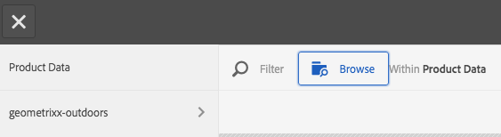

# Werken met kiezers {#working-with-selectors}

>[!CAUTION]
>
>AEM 6.4 heeft het einde van de uitgebreide ondersteuning bereikt en deze documentatie wordt niet meer bijgewerkt. Raadpleeg voor meer informatie onze [technische ondersteuningsperioden](https://helpx.adobe.com/support/programs/eol-matrix.html). Ondersteunde versies zoeken [hier](https://experienceleague.adobe.com/docs/).

Wanneer u werkt met een interactieve afbeelding, interactieve video of carrouselbanner, selecteert u elementen en selecteert u sites en producten voor hotspots en afbeeldingen met hyperlinks waarnaar u wilt koppelen. Wanneer u werkt met Afbeeldingssets, Draaisets en Multimediasets, selecteert u ook elementen met de Asset Selector.

In dit onderwerp wordt beschreven hoe u de kiezers Product, Site en Asset kunt gebruiken, inclusief de mogelijkheid om te bladeren, te filteren en te sorteren binnen de kiezers.

U opent de kiezers door carrouselsets te maken, hotspots en afbeeldingen met hyperlinks toe te voegen en interactieve video&#39;s en afbeeldingen te maken.

In deze Carousel Banner gebruikt u bijvoorbeeld de productkiezer als u een hotspot of afbeelding met hyperlinks koppelt aan een Quickview-pagina. gebruik de sitekiezer als u een hotspot of afbeelding met hyperlink koppelt; Gebruik de kiezer voor middelen wanneer u een nieuwe dia maakt.

Wanneer u selecteert (in plaats van handmatig in te voeren) waar hotspots of afbeeldingen met hyperlinks naartoe gaan, gebruikt u de kiezer. De Sitekiezer werkt alleen als u een AEM Sites-klant bent. Voor de productkiezer is ook AEM Commerce vereist.

## Producten selecteren {#selecting-products}

Gebruik de productkiezer om een product te kiezen wanneer u een hotspot of afbeelding met hyperlinks wilt gebruiken om een snelle weergave van een specifiek product in uw productcatalogus te maken.

1. Ga naar de carrouselset, de interactieve afbeelding of de interactieve video en tik op het tabblad **[!UICONTROL Actions]** (alleen beschikbaar als u een hotspot of afbeelding met hyperlinks hebt gedefinieerd).

   De productkiezer bevindt zich in de **[!UICONTROL Action Type]** gebied.

   

1. Tik op de knop **[!UICONTROL Product Selector]** (vergrootglas) en navigeer naar een product in de catalogus.

   

   U kunt ook filteren op trefwoord of tag door te tikken op **[!UICONTROL Filter]** en het invoeren van trefwoorden, of het selecteren van tags, of beide.

   

   U kunt de locatie waar AEM naar productgegevens zoekt wijzigen door te tikken **[!UICONTROL Browse]** en naar een andere map te navigeren.

   

   Tikken **[!UICONTROL Sort]** door te wijzigen of AEM sorteert op Nieuwst naar Oudst of oudst naar Nieuwst.

   

   Tik op **[!UICONTROL View as]** om te wijzigen hoe producten worden weergegeven: **[!UICONTROL List View]** of **[!UICONTROL Card View]**.

   

1. Nadat het product is geselecteerd, worden in het veld de miniatuur en de naam van het product weergegeven.

   

1. Wanneer in **[!UICONTROL Preview]** tikt u op de hotspot of de afbeelding met hyperlinks en ziet u hoe de Snelle weergave eruitziet.

   

## Sites selecteren {#selecting-sites}

Gebruik de sitekiezer om een webpagina te kiezen als u een hotspot of afbeeldingskaart wilt koppelen aan een webpagina die binnen AEM sites wordt beheerd.

1. Ga naar de carrouselset, de interactieve afbeelding of de interactieve video en tik op het tabblad **[!UICONTROL Actions]** (alleen beschikbaar als u een hotspot of afbeelding met hyperlinks hebt gedefinieerd).

   De sitekiezer bevindt zich in het gebied **[!UICONTROL Action Type]**.

   

1. Tik op het pictogram **[!UICONTROL Site Selector]** (map met vergrootglas) en ga naar een pagina in uw AEM-sites waarnaar u de hotspot of afbeelding met hyperlinks wilt koppelen.

   

1. Nadat de site is geselecteerd, wordt het pad in het veld weergegeven.

   

1. Wanneer in **[!UICONTROL Preview]** Als u tikt op de hotspot of de afbeelding met hyperlinks, navigeert u naar de AEM sitepagina die u hebt opgegeven.

## Elementen selecteren {#selecting-assets}

Gebruik deze kiezer om afbeeldingen te kiezen voor gebruik in een carrouselbanner, een interactieve video, afbeeldingssets, gemengde mediasets en centrifugesets. In interactieve video is de elementenkiezer beschikbaar wanneer u tikt **[!UICONTROL Select Assets]** in de **[!UICONTROL Content]** tab. In Carousel-sets is de elementenkiezer beschikbaar wanneer u een nieuwe dia maakt. In de Reeksen van het Beeld, Gemengde Plaatsen van Media, en de Reeksen van de Draaien, is de activa selecteur beschikbaar wanneer u een nieuwe Reeks van het Beeld, GemengdeReeks, of Reeks van de Draai creeert.

Zie ook [Asset Picker](asset-selector.md) voor meer informatie .

1. Navigeer naar de Carousel-set en maak een nieuwe dia. Of navigeer naar de interactieve video en ga naar de **[!UICONTROL Content]** en selecteert u elementen. U kunt ook een gemengde mediaset, Afbeeldingsset of Spin-set maken.
1. Tik op het pictogram **[!UICONTROL Asset Selector]** (map met vergrootglas) en ga naar een asset.

   

   U kunt ook filteren op trefwoord of tag door te tikken op **[!UICONTROL Filter]** en het invoeren van trefwoorden, of het toevoegen van criteria, of beide.

   

   U kunt de locatie waar AEM naar elementen bladert wijzigen door naar een andere map in het dialoogvenster **[!UICONTROL Path]** veld.

   Tikken **[!UICONTROL Collection]** om alleen te zoeken naar elementen in verzamelingen.

   

   Tik op **[!UICONTROL View as]** om te wijzigen hoe producten worden weergegeven: **[!UICONTROL List View]**, **[!UICONTROL Column View]** of **[!UICONTROL Card View]**.

   

1. Tik op het vinkje om het element te selecteren. Het element wordt weergegeven.

   
