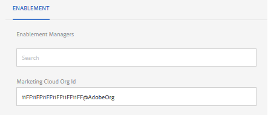

# Analytische configuratie voor functies van Gemeenschappen {#analytics-configuration-for-communities-features}

## Overzicht {#overview}

Adobe Analytics en Adobe Experience Manager (AEM) zijn beide oplossingen van Adobe Marketing Cloud.

Adobe Analytics kan voor AEM Communities zodanig worden geconfigureerd dat, als lid communiceert met ondersteunde functies van de Gemeenschappen, gebeurtenissen worden verzonden naar Adobe Analytics waaruit rapporten worden gegenereerd.

Bijvoorbeeld, wanneer een lid van een enablement communautaire plaats een videobron bekijkt die aan hen wordt toegewezen, zal de middelspeler gebeurtenissen naar Analytics, met inbegrip van videohartslaggegevens verzenden. Van de communautaire plaats, kunnen de beheerders diverse rapporten zien betreffende het spelen van de video.

Daarnaast is een analyse nodig voor:

* In de publicatieomgeving:

   * Rapportage over [trends in de gemeenschap](trends.md)
   * Toestaan dat sitebezoekers sorteren op &quot;meest bekeken&quot;, &quot;meest actief&quot; en &quot;meest geliefd&quot;
   * Tellingen van UGC-lijsten weergeven

* In de ontwerpomgeving:

   * Weergave van gegevens over deelname in de [ledenbeheerconsole](members.md) (weergaven, posten, volgen, zoals)
   * Trend summary, video hartslag en video device for enablement resource [reports](reports.md)

Tot de ondersteunde Gemeenschappen behoren:

* [Middelen inschakelen](resources.md)
* [Forum](forum.md)
* [QnA](working-with-qna.md)
* [Blog](blog-feature.md)
* [Bestandsbibliotheek](file-library.md)
* [Kalender](calendar.md)

In deze sectie van de documentatie wordt beschreven hoe u een serie Analytics-rapporten kunt koppelen aan de functies van Communities. De basisstappen zijn:

1. [Repliceer de cryptosleutel](#replicate-the-crypto-key) om ervoor te zorgen dat codering/decodering op de juiste wijze in alle AEM voorkomen
1. Een Adobe Analytics- [rapportsuite voorbereiden](#adobe-analytics-report-suite-for-video-reporting)
1. Een [cloudservice](#aem-analytics-cloud-service-configuration) en [framework voor AEM Analytics maken](#aem-analytics-framework-configuration)
1. [Analyse](#enable-analytics-for-a-community-site) voor een communitysite inschakelen
1. [Verifieer](#verify-analytics-to-aem-variable-mapping) Analyses aan AEM veranderlijke afbeelding
1. Identificeer [primaire uitgever](#primary-publisher)
1. [De communitysite publiceren](#publish-community-site-and-analytics-cloud-service)
1. De [import van rapportgegevens](#obtaining-reports-from-analytics) van Adobe Analytics naar de communitysite configureren

## Vereisten {#prerequisites}

Om Analytics voor de eigenschappen van Gemeenschappen te vormen, is het noodzakelijk om met uw rekeningsvertegenwoordiger samen te werken om een Adobe Analytics rekening en [rapportreeks](#adobe-analytics-report-suite-for-video-reporting)op te zetten. Zodra dit is vastgesteld, moet de volgende informatie beschikbaar zijn:

* Bedrijfsnaam

   Het bedrijf dat is gekoppeld aan de Adobe Analytics-account
* Gebruikersnaam

   De aanmeldingsgebruikersnaam voor de gebruiker die gemachtigd is om de account Analytics te beheren

   (Mogen toegangsrechten voor webservices bevatten)

* Wachtwoord

   Het aanmeldingswachtwoord voor de geautoriseerde gebruiker

* Analysecentrum

   De URL van het datacenter Analytics voor de account

* Rapportsuite

   De naam van de te gebruiken analytische rapportsuite

## Adobe Analytics Report Suite for Video Reporting {#adobe-analytics-report-suite-for-video-reporting}

Met de rapportsuite [](https://docs.adobe.com/content/help/en/analytics/admin/manage-report-suites/new-report-suite/new-report-suite.html)van Adobe Marketing Cloud kunnen de Analytics-rapporten worden geconfigureerd, zodat een communitysite mogelijk rapporten kan leveren voor de functies van de Community.

Door binnen aan [Adobe Marketing Cloud](https://docs.adobe.com/content/help/en/analytics/analyze/analysis-workspace/home.html) met de Naam van het [Bedrijf en Gebruikersnaam](analytics.md#prerequisites)te ondertekenen, is het mogelijk om een nieuwe of bestaande rapportreeks te vormen om te hebben:

* [11 Conversievariabelen](https://docs.adobe.com/content/help/en/analytics/admin/admin-tools/conversion-variables/conversion-var-admin.html) (evars)

   * **`evar1`** via **`evar11`** ingeschakeld
   * Kan bestaande gebeurtenissen opnieuw gebruiken (naam wijzigen) of nieuwe gebeurtenissen maken die kunnen worden gebruikt voor communautaire functies

* [7 Succesgebeurtenissen](https://docs.adobe.com/content/help/en/analytics/admin/admin-tools/success-events/success-event.html) (gebeurtenissen)

   * **`event1`** via **`event7`** ingeschakeld
   * Type **`Counter`**

      * not **`Counter (no subrelations)`**
   * Kan bestaande gebeurtenissen opnieuw gebruiken (naam wijzigen) of nieuwe gebeurtenissen maken die kunnen worden gebruikt voor communautaire functies


* [Videobeheer](https://docs.adobe.com/content/help/en/media-analytics/using/media-overview.html)

   * Video Reporting-console

      * Inschakelen `Video Core`
      * Selecteer Opslaan
   * Video Core-meetconsole

      * Selecteer `Use Solution Variables`
      * Selecteer Opslaan


Als u een **nieuwe rapportsuite** gebruikt, dient u er rekening mee te houden dat een nieuwe rapportsuite slechts 4 gebeurtenissen en 6 gebeurtenisvariabelen kan bevatten, terwijl 11 gebeurtenissen en 7 gebeurtenisvars vereist zijn voor de Gemeenschappen.

Als het gebruiken van een **bestaande rapportreeks**, kan het noodzakelijk zijn om de veranderlijke afbeelding [te](#modifying-analytics-variable-mapping) wijzigen alvorens het kader van Analytics voor een communautaire plaats te activeren. Neem contact op met uw accountvertegenwoordiger voor eventuele problemen met betrekking tot de variabelen die voor Gemeenschappen zijn bestemd.

>[!CAUTION]
>
>**Als u een bestaande rapportsuite gebruikt die al variabelen gebruikt binnen**
>
>* **`evar1`** doorheen **`evar11`**
>* **`event1`** doorheen **`event7`**

>
>
**Voordat de communitysite wordt gepubliceerd,** is het belangrijk dat u de bestaande toewijzing herstelt door de AEM variabelen te verplaatsen die automatisch zijn toegewezen aan analytische variabelen wanneer Analytics is ingeschakeld voor een communitysite.
>
>Zie de sectie over het [aanpassen van de variabele Analytics voor meer informatie over het herstellen van de bestaande toewijzing en het verplaatsen van AEM naar andere variabelen van Analytics](#modifying-analytics-variable-mapping).
>
>Als u dit niet doet, kan dit leiden tot onherstelbaar gegevensverlies.

### Video-hartslaganalyse {#video-heartbeat-analytics}

Als er een licentie is voor Video Heartbeat Analytics, `Marketing Cloud Org Id` wordt er een toegewezen.

Om Video toe te laten hartslagrapportering na het [vormen van de het rapportreeks van Analytics voor videorapportering](#adobe-analytics-report-suite-for-video-reporting):

* Een [Analytics-cloudservice maken](#aem-analytics-cloud-service-configuration)
* Analyse [voor een communitysite inschakelen](#enable-analytics-for-a-community-site)
* Koppel de `Marketing Cloud Org Id` site aan de site van de community

U `Marketing Cloud Org Id` kunt de site invoeren op het moment dat de site wordt gemaakt [of later door de eigenschappen van de site van de](sites-console.md#enablement) community te [wijzigen](sites-console.md#modifying-site-properties) . [](#aem-analytics-cloud-service-configuration)



Wanneer Video Heartbone Analytics wordt toegelaten, concretiseert de code Javascript (van JS) voor de videospeler de video hartslagbibliotheekcode (ook in JS) die al logica voor het verzenden van videostatusupdates naar de Analytics video volgende servers om de 10 seconden (niet configureerbaar) behandelt en uiteindelijk verzendt een cumulatief rapport van de videozitting naar de belangrijkste servers van Analytics.

Als deze optie niet is ingeschakeld, wordt de videohartslagcode nooit geïnstantieerd en wordt alleen de videovoortgang en het volgen van de hervattingspositie voortgezet in SRP voor rapportage.

## Configuratie van Analytics Cloud-service AEM {#aem-analytics-cloud-service-configuration}

Om een nieuwe Integratie van Analytics tot stand te brengen, die Adobe Analytics met de AEM communautaire plaats integreert, gebruikend standaard UI op de auteursinstantie:

* Vanuit globale navigatie: **[!UICONTROL Tools > Deployment > Cloud Services]**
* Omlaag schuiven naar **[!UICONTROL Adobe Analytics]**
* Selecteer **[!UICONTROL Configure Now]** of **[!UICONTROL Show Configurations]**


### Configuratiedialoogvenster maken {#create-configuration-dialog}

* Selecteer `[+]` pictogram naast **[!UICONTROL Available Configurations]** om een nieuwe configuratie tot stand te brengen

In het dialoogvenster Configuratie maken identificeren de waarden die moeten worden ingevoerd de configuratie.


* **[!UICONTROL Title]**

   (Vereist) Een weergavetitel voor de configuratie.

   Voer bijvoorbeeld Community Analytics *inschakelen in*

* **[!UICONTROL Name]**

   (Optioneel) Indien niet opgegeven, wordt de naam standaard ingesteld op een geldige knooppuntnaam die is afgeleid van de titel.

   For example, enter *communities*


* **[!UICONTROL Template]**

   Selecteer `Adobe Analytics Configuration`

* Selecteer **[!UICONTROL Create]**
   * Hiermee start u de configuratiepagina en opent u het `Analytics Settings` dialoogvenster

### Dialoogvenster Analyse-instellingen {#analytics-settings-dialog}

Het eerste ontwerp van een nieuwe analytische configuratie resulteert in de weergave van de configuratie en een nieuw dialoogvenster voor het invoeren van de Analytische instellingen. Deze dialoog vereist de [vereiste rekeninginformatie](#prerequisites) die van de rekeningsvertegenwoordiger wordt verkregen.


* **[!UICONTROL Company]**

   Het bedrijf dat is gekoppeld aan de Adobe Analytics-account

* **[!UICONTROL Username]**

   De aanmeldingsgebruikersnaam voor de gebruiker die gemachtigd is om de account Analytics te beheren

* **[!UICONTROL Password]**

   Het aanmeldingswachtwoord voor de geautoriseerde gebruiker

* **[!UICONTROL Data Center]**

   Selecteer het datacenter Analytics dat als host fungeert voor de rapportsuite

* **[!UICONTROL Do not add tracking tag to page]**

   Als standaard behouden (uitgeschakeld)

* **[!UICONTROL Use AppMeasurement]**

   Als standaard behouden (uitgeschakeld)

* **[!UICONTROL Do not import page impressions nightly (author)]**

   Als standaard behouden (uitgeschakeld)

* **[!UICONTROL Do not import page impressions nightly (publish)]**

   Als standaard behouden (ingeschakeld)

De instellingen opslaan:


* Selecteer **[!UICONTROL Connect to Analytics]**

   * Indien niet gelukt,

      * Verifieer de ingangen geen belangrijke ruimten bevatten
      * Probeer een ander datacenter
      * Neem contact op met uw accountvertegenwoordiger

* Selecteer **[!UICONTROL OK]**


### Framework maken {#create-framework}

Nadat de basisverbinding met Adobe Analytics met succes is geconfigureerd, moet u een framework voor de communitysite maken of bewerken. Het doel van het kader is om de eigenschapvariabelen van de Gemeenschappen (AEM) aan (rapportreeks) variabelen Analytics in kaart te brengen.

* Selecteer `[+]` pictogram naast **[!UICONTROL Available Frameworks]** het maken van een nieuw framework


* **[!UICONTROL Title]**

   (Vereist) Een titel voor het weergeven van het framework

   Voer bijvoorbeeld het communautaire *kader voor activering in*

* **[!UICONTROL Name]**

   (Optioneel) Indien niet opgegeven, wordt de naam standaard ingesteld op een geldige knooppuntnaam die is afgeleid van de titel.

   For example, enter *communities*

* **[!UICONTROL Template]**

   Selecteer `Adobe Analytics Framework`

* Selecteer **[!UICONTROL Create]**

Het creëren van het Kader van Analytics opent het kader voor configuratie.

## Configuratie van AEM Analytics Framework {#aem-analytics-framework-configuration}

Het doel van het kader is AEM variabelen toe te wijzen aan analytische variabelen (gebeurtenissen en gebeurtenissen). De variabelen van Analytics beschikbaar voor afbeelding worden [bepaald in de rapportreeks](#adobe-analytics-report-suite-for-video-reporting).


### Rapportsuite selecteren {#select-report-suite}

Selecteer de rapportsuite die is ingesteld voor videoverslag.

Zie de vorige sectie als er nog geen rapportsuite is gemaakt of niet juist is ingesteld:\
[Adobe Analytics Report Suite for Video Reporting](#adobe-analytics-report-suite-for-video-reporting)

De Sidetrap is niet nodig en kan worden geminimaliseerd zodat het de toegang tot de montages van de Suites van het Rapport niet belemmert.

#### Dialoogvenster Suitten rapporteren vóór en na het selecteren van Item toevoegen {#report-suites-dialog-before-and-after-selecting-add-item}


1. Twee **[!UICONTROL Add Item +]** keuzelijsten selecteren
1. Kies een `Report suite` van de rapportsuites verbonden aan de rekening van het Bedrijf voor selectie beschikbaar zouden moeten zijn
1. Selecteren **[!UICONTROL Yes]** in het dialoogvenster dat wordt geopend: ```Load default server settings? Do you want to load the default server settings and overwrite current values in the Server section?```
1. Kies een `Run Mode`\
   Choose **[!UICONTROL publish]**


De analytische cloudservice en het framework zijn nu voltooid. De toewijzingen worden gedefinieerd zodra een communitysite is gemaakt en deze Analytics-service is ingeschakeld.

## Analyses inschakelen voor een Community-site {#enable-analytics-for-a-community-site}

### Inschakelen voor nieuwe Community-site {#enable-for-new-community-site}

U voegt als volgt de cloudservice Analytics toe terwijl u een nieuwe communitysite [maakt](sites-console.md):


* In stap 3
* Onder het tabblad [](sites-console.md#analytics)ANALYSE:

   * Het **[!UICONTROL Enable Analytics]** selectievakje inschakelen
   * Het framework kiezen in het keuzemenu

* U kunt desgewenst terugkeren naar de configuratie van het analyseframework om de variabele toewijzingen aan te passen.

### Inschakelen voor bestaande communautaire site {#enable-for-existing-community-site}

U kunt als volgt de cloudservice Analytics toevoegen aan een [bestaande communitysite](sites-console.md#modifying-site-properties):


* Navigate to the **[!UICONTROL Communities > Sites]** console
* Het pictogram Site bewerken van de site van de community selecteren
* De instellingen selecteren
* In de sectie Analytics:

   * Het **[!UICONTROL Enable Analytics]** selectievakje inschakelen
   * Het framework kiezen in het keuzemenu


* U kunt desgewenst terugkeren naar de configuratie van het analyseframework om de variabele toewijzingen aan te passen.

### Inschakelen voor aangepaste sites {#enable-for-customized-sites}

Voor het correct werken van Analytics het volgen en de invoer voor een communautaire plaats, moet een paginaelement met de `scf-js-site-title` klasse en de attributen href aanwezig zijn. Er mag slechts één dergelijk element op de pagina voorkomen, zoals in een ongewijzigd `sitepage.hbs` script voor een communitysite. De waarde van `siteUrl` wordt geëxtraheerd en naar Adobe Analytics verzonden als het *sitepad*.

```xml
# present in default sitepage.hbs
# only one scf-js-site-title class should be included
# this example sets it to be hidden as it serves no visual purpose
<div
    class="navbar-brand scf-js-site-title"
    href="{{siteUrl}}.html"
    style="visibility: hidden;"
>
</div>
```

Voor een **aangepaste communautaire plaats** die het `sitepage.hbs` manuscript bedekt, zorg ervoor het element aanwezig is. De `siteUrl`variabele wordt ingesteld wanneer deze op de server wordt gerenderd voordat de client wordt ingeschakeld.

Voor een **generische AEM plaats** die de componenten van de Gemeenschappen omvat, maar niet met de tovenaar [van de](sites-console.md)plaatsverwezenlijking wordt gecreeerd, is het noodzakelijk om het element toe te voegen. De waarde van de href moet het pad naar de site zijn. Als het sitepad bijvoorbeeld `/content/my/company/en`het volgende is:

```xml
<div
    class="navbar-brand scf-js-site-title"
    href="/content/my/company/en.html"
    style="visibility: hidden;"
>
</div>
```

## Analyses voor functies van Gemeenschappen {#analytics-for-communities-features}

Analytics wordt automatisch gebruikt voor verschillende functies van de Gemeenschappen.

De configuratie [](../../help/sites-deploying/configuring-osgi.md)OSGi van het auteursmilieu, `AEM Communities Analytics Component Configuration`, verstrekt een lijst van de componenten die voor Analytics van instrumenten zijn voorzien. De automatische toewijzing van variabelen wordt bepaald door de vermelde componenten.

Als nieuwe douanecomponenten worden gecreeerd die voor Analytics van instrumenten worden voorzien, zouden zij aan deze lijst van gevormde componenten moeten worden toegevoegd.

### Componentconfiguratie {#component-configuration}


Opmerking: de `journal` componenten worden gebruikt om de blogfunctie te implementeren.

### Analyses toegewezen aan AEM variabelen {#mapped-analytics-to-aem-variables}

Zodra de communautaire plaats met toegelaten Analytics en geselecteerd wolkenconfig kader wordt bewaard, zullen de AEM variabelen automatisch aan de gebeurtenissen en gebeurtenissen worden in kaart gebracht die van Analytics met evar1 en event1 beginnen, respectievelijk, en het verhogen met 1.

Als het gebruiken van een bestaande rapportreeks die om het even welke variabelen binnen evar1 tot evar11 en event1 door event7 in kaart bracht, zal het noodzakelijk zijn om de AEM variabelen [](#modifying-analytics-variable-mapping) opnieuw in kaart te brengen en de originele afbeelding te herstellen.

Hier volgt een voorbeeld van standaardtoewijzingen na het volgen van de [aan de slag-zelfstudie](getting-started-enablement.md):


#### Kaart met eVars die met elke gebeurtenis worden verzonden {#map-of-evars-sent-with-each-event}

|  | Resourcetype Enablement | Titel site | Type functie | Groepsnaam | Pad groeperen | Type UGC | UGC-titel | Gebruiker (lid) | UGC-pad | Sitepad |
|------------------------|------------------------|-----------|--------------|------------|-----------|---------|----------|--------------|---------|----------|
|  | **eVar1** | **eVar2** | **eVar3** | **eVar4** | **eVar5** | **eVar6** | **eVar7** | **eVar8** | **eVar9** | **eVar10** |
| event1Resource Play | (a) | - | - | - | - | - | - | - | i) | - |
| event2SCFView | (a) | b) | c) | (d) | e) | (f) | (g) | (h) | i) | j) |
| event3SCFCreate (Post) | - | b) | c) | (d) | e) | (f) | (g) | (h) | i) | j) |
| event4SCFFollow | - | b) | c) | (d) | e) | (f) | (g) | (h) | i) | j) |
| event5SCFVoteUp | - | b) | c) | (d) | e) | (f) | (g) | (h) | i) | j) |
| event6SCFVoteDown | - | b) | c) | (d) | e) | (f) | (g) | (h) | i) | j) |
| event7SCFRate | - | b) | c) | (d) | e) | (f) | (g) | (h) | i) | j) |

**Voorbeelden voor waarden van eVar:**

* [MIME-type](https://www.iana.org/assignments/media-types): video/mp4
* [Titel](sites-console.md#step13asitetemplate)van communautaire site: Geometrixx
* [Communautaire functienaam](functions.md): Forum
* [Naam](creating-groups.md#creating-a-new-group)communautaire groep: Hiking
* Pad naar inhoud groep van gemeenschappen: /content/sites/community/nl/groups/hiking
* [Resourcetype](essentials.md)UGC-component: sociaal/forum/componenten/hbs/onderwerp
* Titel van UGC-component: Wikingonderwerpen
* Aanmelden (toegestane id): aaron.mcdonald@mailinator.com
* SRP-pad naar UGC: /content/usergenerated/asi/.../forum/jmtz-topic3 of *pad van te volgen* component: /content/sites/community/nl/jcr:content/content/primary/forum
* Pad naar community-site-inhoud: /content/sites/community/nl

### Variabele-toewijzing Analytics wijzigen {#modifying-analytics-variable-mapping}

De toewijzing van gebeurtenissen en gebeurtenissen van Analytics aan AEM variabelen is zichtbaar van de kaderconfiguratie nadat Analytics voor een communautaire plaats wordt toegelaten.

Nadat Analytics is toegelaten en alvorens de communautaire plaats wordt gepubliceerd, kan de afbeelding in het kader worden veranderd door de gewenste Analytics evar of de gebeurtenis van de linkerspoorstaaf te slepen en het neer te zetten in de relevante rij in de mappingstabel.

Als u dubbele toewijzingen wilt voorkomen, moet u de vervangen Analytics verwijderen uit de rij door de muis erboven te plaatsen en de X te selecteren die rechts van het variabele-element Analytics wordt weergegeven.

Als de gebeurtenissen van de Gemeenschappen en de gebeurtenissen afbeeldingen beschrijven die in de rapportreeks reeds bestonden, dan om gegevensverlies te vermijden, wijs de AEM variabelen voor de eigenschappen van de Gemeenschappen aan andere gebeurtenissen en/of gebeurtenissen van Analytics toe en herstel de originele afbeeldingen.

>[!CAUTION]
>
>Het is belangrijk om opnieuw toe te wijzen alvorens de communautaire plaats met toegelaten Analytics wordt [gepubliceerd](#publishing-the-community-site) , anders is er risico van gegevensverlies.

#### Voorbeeld, stap 1: Analytics evar14 naar toewijzingstabel slepen {#example-step-dragging-analytics-evar-into-mapping-table}


#### Voorbeeld stap 2: Vervangen evar11 verwijderen door &#39;x&#39; te selecteren {#example-step-selecting-x-to-remove-replaced-evar}


#### Voorbeeld stap 3: AEM var eventData.siteId opnieuw toegewezen aan Analytics evar14 {#example-step-aem-var-eventdata-siteid-remapped-to-analytics-evar}


## De website van de Gemeenschap publiceren {#publishing-the-community-site}

### Analyses controleren op AEM variabele toewijzing {#verify-analytics-to-aem-variable-mapping}

Het is verstandig om de variabeletoewijzing te controleren voordat de communitysite wordt gepubliceerd, die ook de cloudservice en het framework Analytics publiceert.

Zie secties:

* [Analyses toegewezen aan AEM variabelen](#mapped-analytics-to-aem-variables)
* [Variabele-toewijzing Analytics wijzigen](#modifying-analytics-variable-mapping)

>[!CAUTION]
>
>**Als u een bestaande rapportsuite gebruikt die al variabelen gebruikt binnen**
>
>* **`evar1`** doorheen **`evar11`**
>* **`event1`** doorheen **`event7`**

>
>
**Voordat de site van de community wordt gepubliceerd,** is het belangrijk dat de bestaande toewijzing wordt hersteld en dat de variabelen van de Gemeenschappen AEM die automatisch zijn toegewezen (wanneer Analytics voor de site van de community was ingeschakeld) worden verplaatst naar andere variabelen van Analytics. Deze nieuwe toewijzing moet voor alle onderdelen van de Gemeenschappen consistent zijn.
>
>Als u dit niet doet, kan dit leiden tot onherstelbaar gegevensverlies.

### Primaire uitgever {#primary-publisher}

Wanneer de gekozen plaatsing een [publiceerlandbouwbedrijf](topologies.md#tarmk-publish-farm)is, dan moet één AEM worden geïdentificeerd als primaire uitgever voor het opiniepeilen Adobe Analytics voor rapportgegevens om aan [SRP](working-with-srp.md)te schrijven.

Door gebrek, identificeert de configuratie `AEM Communities Publisher Configuration` OSGi zijn publicatiegeval als primaire uitgever, zodat alle publiceer instanties in een publicatielandbouwbedrijf zich als primair zou identificeren.

Daarom is het noodzakelijk om de configuratie op alle secundaire publicatieinstanties uit te geven om het **Primaire selectievakje van de Uitgever** uit te schakelen.

Voor specifieke instructies, zie de primaire uitgeverssectie van het [Opstellen van Gemeenschappen](deploy-communities.md#primary-publisher).

>[!CAUTION]
>
>Het is belangrijk dat de primaire uitgever wordt gevormd om het opiniepeilen van veelvoudige publicatieinstanties te verhinderen.

### De cryptosleutel dupliceren {#replicate-the-crypto-key}

De Adobe Analytics-referenties worden versleuteld. Om de replicatie of verzending van gecodeerde analysegegevens tussen auteur en uitgever te vergemakkelijken, moeten alle AEM instanties dezelfde primaire coderingssleutel delen.

Volg hiervoor de instructies bij [Replicate the Crypto Key](deploy-communities.md#replicate-the-crypto-key).

### Community Site en Analytics Cloud Service publiceren {#publish-community-site-and-analytics-cloud-service}

Zodra de Analytics-cloudservice is ingeschakeld voor een communitysite en, indien nodig, de [toewijzing van Analytics aan AEM variabelen is aangepast](#mapped-analytics-to-aem-variables), moet de configuratie worden gerepliceerd naar de publicatieomgeving door de communitysite [](sites-console.md#publishing-the-site)(opnieuw)te publiceren.

## Rapporten van Analytics verkrijgen {#obtaining-reports-from-analytics}

### Rapportbeheer {#report-management}

De auteur en de primaire configuratie [OSGi van de uitgever,](../../help/sites-deploying/configuring-osgi.md)`AEM Communities Analytics Report Management`, wordt gebruikt om Analytics te vragen.

Bij de auteur zijn de vragen bestemd voor real-time rapporten.

Voor de primaire uitgever, worden de vragen gebruikt om informatie ter voorbereiding van de de gegevensinvoer van de Importeur van het Rapport Analytische te verstrekken.

Het vraaginterval blijft aan 10 seconden in gebreke.

### Rapportimportmodule {#report-importer}

Zodra een Analytics toegelaten communautaire plaats is gepubliceerd, kan de configuratie [](../../help/sites-deploying/configuring-osgi.md)OSGi van de primaire uitgever, `AEM Communities Analytics Report Importer`, worden gevormd om het standaardopiniepeilingsinterval voor die configuraties te plaatsen die niet individueel in CRXDE worden gevormd.

Het opiniepeilingsinterval bepaalt de frequentie van verzoeken aan Adobe Analytics om gegevens die in [SRP](working-with-srp.md)moeten worden getrokken en worden bewaard.

Wanneer de gegevens als &quot;grote gegevens&quot; kunnen worden gecategoriseerd, kan een frequentere opiniepeiling een grote belasting op de plaats van de gemeenschap veroorzaken.

Het standaardpollinginterval voor **importeren** is ingesteld op 12 uur.


### Componentrapport aanpassen {#component-report-customization}

Momenteel, om de metriek aan spoor aan te passen, worden de knopen gecreeerd in de bewaarplaats die tijdsperioden bepalen waarvoor om een rapport over dat metrisch te produceren.

Het forumonderwerp is momenteel het enige voorbeeld van deze aanpassing:

* Op de primaire uitgever
* Aanmelden met beheerdersrechten
* Navigeren naar [CRXDE Lite](../../help/sites-developing/developing-with-crxde-lite.md)

   * Bijvoorbeeld: [http://localhost:4503/crx/de](http://localhost:4503/crx/de)

* Onder het `jcr:content` knooppunt van de taalhoofdmap

   * Bijvoorbeeld, `/content/sites/engage/en/jcr:content`

* Navigeer naar de component die is geconfigureerd voor Analytics-rapportage

   * Bijvoorbeeld, `analytics/reportConfigs/social_forum_components_hbs_topic`

* Let op de gemaakte tijdsperioden

   * `last30Days`
   * `last90Days`
   * `thisYear`

* Merk het `total`knooppunt op

   * Het wijzigen van het `interval` bezit zal het interval van de Importeur van het Rapport met voeten treden
   * De waarde is in seconden en wordt ingesteld op 4 uur (14400 seconden)


## Gebruikersgegevens beheren in Analytics {#manage-user-data-in-analytics}

Adobe Analytics biedt API&#39;s waarmee u gebruikersgegevens kunt openen, exporteren en verwijderen. Voor meer informatie, zie [Verzoeken](https://docs.adobe.com/content/help/en/analytics/admin/data-governance/gdpr-submit-access-delete.html)van de Toegang voorleggen en van de Schrapping.

## Bronnen {#resources}

* Adobe Marketing Cloud: [Help en naslaggids voor analysemogelijkheden](https://docs.adobe.com/content/help/en/analytics/landing/home.html)
* AEM: [Integrating with Adobe Analytics](../../help/sites-administering/adobeanalytics.md)
* AEM: [Analyse met externe providers](../../help/sites-administering/external-providers.md)

