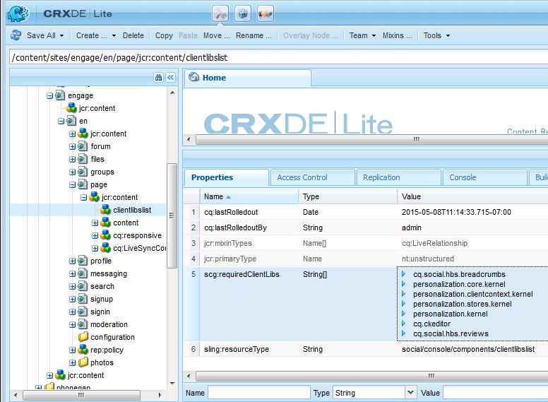

# Clientlibs voor Community-componenten {#clientlibs-for-communities-components}

## Inleiding {#introduction}

In deze sectie van de documentatie wordt beschreven hoe u clientbibliotheken (clientlibs) aan een pagina voor Community-componenten kunt toevoegen.

Voor basisinformatie gaat u naar:

* [Clientzijbibliotheken gebruiken die ](../../help/sites-developing/clientlibs.md) gebruiksdetails en foutopsporingsgereedschappen bieden
* [Clientlibs voor ](client-customize.md#clientlibs) SCFwhich verstrekt nuttige informatie wanneer het aanpassen van componenten SCF
* [Blog: AEM Clientbibliotheken, zoals wordt uitgelegd in het voorbeeld](https://blogs.adobe.com/experiencedelivers/experience-management/clientlibs-explained-example/)

## Waarom Clientlibs vereist {#why-clientlibs-are-required}

Clientlibs zijn vereist voor het correct functioneren (JavaScript) en opmaken (CSS) van een component.

Wanneer er een [communautaire functie](functions.md) voor een eigenschap bestaat, zullen alle noodzakelijke componenten en configuraties, met inbegrip van de vereiste clientlibs, in de communautaire plaats aanwezig zijn. Alleen als de auteurs extra componenten ter beschikking moeten hebben, moeten er extra clientlibs worden toegevoegd.

Wanneer de vereiste clientlibs ontbreken, [kan het toevoegen van een communautaire component aan een pagina ](author-communities.md) in fouten javascript evenals een onverwachte verschijning resulteren.

### Voorbeeld: Geplaatste revisies zonder Clientlibs {#example-placed-reviews-without-clientlibs}

### Voorbeeld: Geplaatste revisies met clips {#example-placed-reviews-with-clientlibs}

## Vereiste clients identificeren {#identifying-required-clientlibs}

De essentiële eigenschapinformatie voor ontwikkelaars identificeert de vereiste clientlibs.

Bovendien, van een AEM instantie, die aan [Communautaire Gids van Componenten ](components-guide.md) doorbladert verleent toegang tot een lijst van cliëntlib categorieën die voor een component worden vereist.

Bijvoorbeeld helemaal boven aan de pagina [Revisies](http://localhost:4502/content/community-components/en/reviews.html) worden de vereiste clientlibs weergegeven

* cq.ckeditor
* cq.social.hbs.reviews

## Vereiste clips {#adding-required-clientlibs} toevoegen

Wanneer u een Gemeenschapscomponent aan een pagina wilt toevoegen, moet u de vereiste clientlibs voor de component toevoegen als deze nog niet aanwezig is.

Gebruik [CRXDE|Lite](#using-crxde-lite) om een bestaande cliëntlibslist voor een communautaire plaatspagina te wijzigen.

Een clientlib voor een communitysite toevoegen met [CRXDE Lite](../../help/sites-developing/developing-with-crxde-lite.md):

* Bladeren naar [https://&lt;server>:&lt;port>/crx/de](http://localhost:4502/crx/de)
* Zoek het knooppunt `clientlibslist` voor de pagina waarop u de component wilt toevoegen

   * `/content/sites/sample/en/page/jcr:content/clientlibslist`

* Met `clientlibslist`-knooppunt geselecteerd

   * Zoek de eigenschap String[] `scg:requiredClientLibs`
   * `Value` selecteren om toegang te krijgen tot het dialoogvenster String-array

      * Indien nodig omlaag schuiven
      * Selecteer `+` om een nieuwe clientbibliotheek in te voeren

         * Herhalen om meer clientbibliotheken toe te voegen
      * Selecteer **[!UICONTROL OK]**
   * Selecteer **[!UICONTROL Save All]**

>[!NOTE]
>
>Als de site geen gemeenschapssite is, moet het bestaan of de locatie van de clientbibliotheken die voor de site worden gebruikt, worden gedetecteerd.

Gebruikend [Aan de slag met AEM Communities](getting-started.md) voorbeeld, waar `site-name` *engageren* is, is dit hoe cliëntliblist zou verschijnen als het toevoegen van de revisiecomponent:

