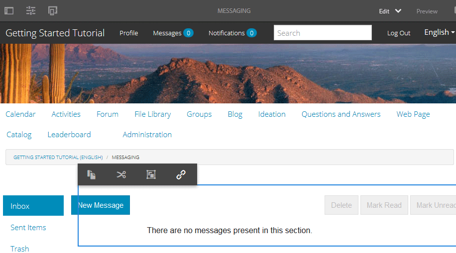

# Berichtenonderdeel {#messaging-feature}

Naast de openbaar zichtbare interacties die in forums en commentaren voorkomen, laat de overseineneigenschap van AEM Communities communityleden toe om met elkaar meer privé in wisselwerking te staan.

Deze functie kan worden opgenomen wanneer een [communitysite](overview.md#communitiessites) wordt gemaakt.

De overseineneigenschappen verstrekken de capaciteit om:

* Een bericht sturen naar een of meer leden van de community
* Een bericht sturen naar een groep van leden van de gemeenschap
* Een bericht met bijlagen verzenden
* Een bericht doorsturen
* Een bericht beantwoorden
* Een bericht verwijderen
* Een verwijderd bericht herstellen

Om de overseineneigenschap toe te laten en te wijzigen, bezoek

* [Het vormen ](messaging.md) Overseinen voor beheerders
* [Berichtenhoofdzaak ](essentials-messaging.md) voor ontwikkelaars

>[!NOTE]
>
>Het wordt niet ondersteund om `Compose Message, Message, or Message List`-componenten (gevonden in `Communities`componentgroep) toe te voegen aan een pagina in de bewerkingsmodus van de auteur.

## Het vormen van de Componenten van het Overseinen {#configuring-messaging-components}

Wanneer het overseinen voor een communautaire plaats wordt toegelaten, is het volledig opstelling zonder verdere configuratie noodzakelijk. Deze informatie wordt verstrekt als er een behoefte is om de standaardconfiguratie te veranderen.

### Berichtlijst configureren (berichtvak) {#configuring-message-list-messagebox}

Als u de configuratie wilt wijzigen van de lijst met berichten voor **Inbox**, **Items verzenden** en **Prullenmand** pagina&#39;s van de berichtfunctie, opent u de site in [bewerkingsmodus auteur](sites-console.md#authoring-site-content).

In `Preview` wijze, selecteer **[!UICONTROL Messages]** verbinding om de belangrijkste overseinenpagina te openen. Selecteer vervolgens **[!UICONTROL Inbox, Sent Items, or Trash]** om de component voor die berichtenlijst te configureren.

Selecteer in de modus `Edit` de component op de pagina.

Als u toegang wilt tot het configuratiedialoogvenster, moet u de overerving annuleren door het pictogram `link`te selecteren.

Zodra de configuratie volledig is, is het noodzakelijk om overerving te herstellen door het `broken link` pictogram te selecteren.

Nadat de overerving is geannuleerd, kan het pictogram `configure` worden geselecteerd om het configuratiedialoogvenster te openen.

#### Standaardtabblad {#basic-tab}

* **[!UICONTROL Service selector]**
(*Vereist*) plaats dit aan de waarde van het bezit  `serviceSelector.name` van de Dienst [ van de Verrichtingen van het Overseinen van ](messaging.md#messaging-operations-service)AEM Communities.

* **[!UICONTROL Compose Page]**
(*Vereist*) De pagina die moet worden geopend wanneer een lid op de  `Reply` knop klikt. De doelpagina moet het formulier **[!UICONTROL Compose Message]** bevatten.

* **[!UICONTROL Reply/View as Resource]**
Als deze optie is ingeschakeld, verwijzen de URL van de reactie en de URL van de weergave naar een bron, anders worden gegevens doorgegeven als queryparameters in de URL.

* **[!UICONTROL Profile Display Form]**
Het profielformulier dat moet worden gebruikt om het afzenderprofiel weer te geven.

* **[!UICONTROL Trash Folder]**
Als deze optie is ingeschakeld, worden in deze component Berichtlijst alleen berichten weergegeven die zijn gemarkeerd als verwijderd (prullenbak).

* **[!UICONTROL Folder Paths]**
(*Vereist*) Verwijzend de waarden die voor  `inbox.path.name` en  `sentitems.path.name` in de Dienst [ van de Verrichtingen van het Overseinen van ](messaging.md#messaging-operations-service)AEM Communities worden geplaatst. Wanneer het vormen voor `Inbox`, voeg één ingang toe gebruikend de waarde van `inbox.path.name`. Wanneer het vormen voor `Outbox`, voeg één ingang toe gebruikend de waarde van `sentitems.path.name`. Wanneer het vormen voor `Trash`, voeg twee ingangen met beide waarden toe.

#### Tabblad {#display-tab} weergeven

* **[!UICONTROL Mark Read Button]**
Als deze optie is ingeschakeld, wordt een 
`Read`knop waarmee een bericht kan worden gemarkeerd als gelezen.

* **[!UICONTROL Mark Unread Button]**
Als deze optie is ingeschakeld, wordt een 
`Mark Unread` knop waarmee een bericht kan worden gemarkeerd als gelezen.

* **[!UICONTROL Delete Button]**
Als deze optie is ingeschakeld, wordt een 
`Delete`knop waarmee een bericht kan worden gemarkeerd als gelezen. Hiermee wordt de verwijderfunctionaliteit gedupliceerd als **`Message Options`** ook is ingeschakeld.

* **[!UICONTROL Message Options]**
Indien ingeschakeld, wordt weergegeven 
**`Reply`**,  **`Reply All`** en  **`Forward`**   **`Delete`** knoppen waarmee een bericht opnieuw kan worden verzonden of verwijderd. Hiermee wordt de verwijderfunctionaliteit gedupliceerd als **`Delete Button`** ook is ingeschakeld.

* **[!UICONTROL Messages Per Page]**
Het opgegeven aantal is het maximumaantal berichten dat per pagina in een pagineringsschema wordt weergegeven. Als geen aantal wordt gespecificeerd (verlaten leeg), dan worden alle berichten getoond en er is geen paginering.

* **[!UICONTROL Timestamp patterns]**
Geef tijdstempelpatronen op voor een of meer talen. Standaard is dit voor en, de, fr, it, es, ja, zh_CN, ko_KR.

* **[!UICONTROL Display User]**
Kies 
**`Sender`** of  **`Recipients`** om te bepalen of de afzender of de Ontvanger moet worden weergegeven.

### Samenstellen bericht {#configuring-compose-message} configureren

Als u de configuratie van de pagina voor samenstellen van berichten wilt wijzigen, opent u de site in de bewerkingsmodus [auteur](sites-console.md#authoring-site-content).

Selecteer in de modus `Preview`de koppeling **[!UICONTROL Messages]** om de hoofdberichtenpagina te openen. Selecteer vervolgens de knop Nieuw bericht om de pagina `Compose Message` te openen.

Selecteer in de modus `Edit` de hoofdcomponent op de pagina die de hoofdtekst van het bericht bevat.

Als u toegang wilt tot het configuratiedialoogvenster, moet u de overerving annuleren door het pictogram `link`te selecteren.

Zodra de configuratie volledig is, is het noodzakelijk om overerving te herstellen door het `broken link` pictogram te selecteren.

Nadat de overerving is geannuleerd, kan het pictogram `configure` worden geselecteerd om het configuratiedialoogvenster te openen.

#### Standaardtabblad {#basic-tab-1}

* **[!UICONTROL Redirect URL]**
Voer de URL in van de pagina die wordt weergegeven nadat het bericht is verzonden. Bijvoorbeeld, 
`../messaging.html`.

* **[!UICONTROL Cancel URL]**
Voer de URL van de weergegeven pagina in als de afzender het bericht annuleert. Bijvoorbeeld, 
`../messaging.html`.

* **[!UICONTROL Maximum length of Message Subject]**
Het maximum aantal tekens dat is toegestaan in het veld Onderwerp. Bijvoorbeeld 500. Standaard is geen limiet.

* **[!UICONTROL Maximum length of Message Body]**
Het maximum aantal tekens dat is toegestaan in het veld Inhoud. Bijvoorbeeld 10000. Standaard is geen limiet.

* **[!UICONTROL Service selector]**
(*Vereist*) plaats dit aan de waarde van het bezit  **`serviceSelector.name`** van de Dienst [ van de Verrichtingen van het Overseinen van ](messaging.md#messaging-operations-service)AEM Communities.

#### Tabblad {#display-tab-1} weergeven

* **[!UICONTROL Show Subject Field]**
Indien ingeschakeld, geeft u de optie 
`Subject` en schakelt u het toevoegen van een onderwerp aan het bericht in. Standaard is niet ingeschakeld.

* **[!UICONTROL Subject Label]**
Voer de tekst in die naast de 
`Subject` field. De standaardwaarde is `Subject`.

* **[!UICONTROL Show Attach File Field]**
Indien ingeschakeld, geeft u de optie 
`Attachment` en schakel het toevoegen van bestandsbijlagen aan het bericht in. Standaard is niet ingeschakeld.

* **[!UICONTROL Attach File Label]**
Voer de tekst in die naast de 
`Attachment` veld. De standaardwaarde is **`Attach File`**.

* **[!UICONTROL Show Content Field]**
Indien ingeschakeld, geeft u de optie 
`Content` en schakelt u het toevoegen van een berichttekst in. Standaard is niet ingeschakeld.

* **[!UICONTROL Content Label]**
Voer de tekst in die naast de 
`Content` veld. De standaardwaarde is **`Body`**.

* **[!UICONTROL With Rich Text Editor]**
Als deze optie is ingeschakeld, wordt het gebruik van een tekstvak met aangepaste inhoud met een eigen RTF-editor aangegeven. Standaard is niet ingeschakeld.

* **[!UICONTROL Timestamp patterns]**
Geef tijdstempelpatronen op voor een of meer talen. Standaard is dit voor en, de, fr, it, es, ja, zh_CN, ko_KR.

