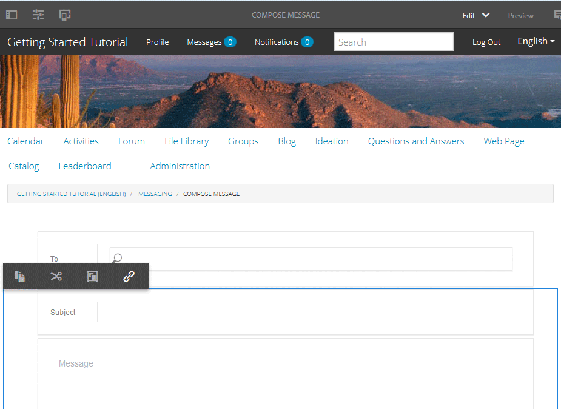

# Berichtenonderdeel {#messaging-feature}

Naast de openbaar zichtbare interacties die in forums en commentaren voorkomen, laat de overseineneigenschap van AEM Gemeenschappen communautaire leden toe om met elkaar meer privé in wisselwerking te staan.

Deze functie kan worden opgenomen wanneer een [communitysite](overview.md#communitiessites) wordt gemaakt.

De overseineneigenschappen verstrekken de capaciteit om:

* Een bericht sturen naar een of meer leden van de community
* Een bericht sturen naar een groep van leden van de gemeenschap
* Een bericht met bijlagen verzenden
* Een bericht doorsturen
* Een bericht beantwoorden
* Een bericht verwijderen
* Een verwijderd bericht herstellen

Om de overseineneigenschap toe te laten en te wijzigen, bezoek

* [Berichten](messaging.md) voor beheerders configureren
* [Essentiële elementen](essentials-messaging.md) voor berichten voor ontwikkelaars

>[!NOTE]
>
>Het wordt niet ondersteund om `Compose Message, Message, or Message List` componenten (gevonden in `Communities`componentgroep) toe te voegen aan een pagina in de modus Schrijven.

## Berichtencomponenten configureren {#configuring-messaging-components}

Wanneer het overseinen voor een communautaire plaats wordt toegelaten, is het volledig opstelling zonder verdere configuratie noodzakelijk. Deze informatie wordt verstrekt als er een behoefte is om de standaardconfiguratie te veranderen.

### Berichtlijst configureren (berichtvakBox) {#configuring-message-list-messagebox}

Om de configuratie van de lijst van berichten voor **Inbox**, **Verzonden Punten**, en de pagina&#39;s van het **Afval** van de overseineneigenschap te wijzigen, open de plaats in [auteur uitgeeft wijze](sites-console.md#authoring-site-content).

In `Preview` wijze, selecteer de verbinding van **[!UICONTROL Berichten]** om de belangrijkste overseinenpagina te openen. Dan selecteer of **[!UICONTROL Inbox, Verzonden Punten, of Afval]** om de component voor die berichtlijst te vormen.

Selecteer in de `Edit` modus de component op de pagina.

Als u het configuratievenster wilt openen, moet u de overerving annuleren door het `link`pictogram te selecteren.

Nadat de configuratie is voltooid, moet de overerving worden hersteld door het `broken link` pictogram te selecteren.

Nadat de overerving is geannuleerd, kan het `configure` pictogram worden geselecteerd om het configuratiedialoogvenster te openen.

#### Het tabblad Basis {#basic-tab}

* **[!UICONTROL De selecteur]** van de dienst (*Vereist*) plaatste dit aan de waarde van het bezit `serviceSelector.name` van de Dienst [van de Verrichtingen van het Overseinen van de Gemeenschappen van](messaging.md#messaging-operations-service)AEM Gemeenschappen.

* **[!UICONTROL Pagina]** samenstellen (*vereist*) De pagina die moet worden geopend wanneer een lid op de `Reply` knop klikt. De doelpagina moet het formulier voor **[!UICONTROL samenstellingsbericht]** bevatten.

* **[!UICONTROL Reageren/Weergeven als bron]** Als deze optie is ingeschakeld, verwijzen de URL voor antwoorden en de URL voor weergave naar een bron, anders worden gegevens doorgegeven als queryparameters in de URL.

* **[!UICONTROL Profielweergaveformulier]** Het profielformulier dat moet worden gebruikt om het afzenderprofiel weer te geven.

* **[!UICONTROL Prullenmap]** Indien ingeschakeld worden in deze component Berichtlijst alleen berichten weergegeven die zijn gemarkeerd als verwijderd (prullenbak).

* **[!UICONTROL Mappaden]**(*vereist*) Verwijzen naar de waarden die zijn ingesteld voor `inbox.path.name` en `sentitems.path.name` in de [AEM Communities Messaging Operations Service](messaging.md#messaging-operations-service). Wanneer het vormen voor een `Inbox`, voeg één ingang toe gebruikend de waarde van `inbox.path.name`. Wanneer het vormen voor een `Outbox`, voeg één ingang toe gebruikend de waarde van `sentitems.path.name`. Voeg bij de configuratie voor `Trash`twee items met beide waarden toe.

#### Tabblad Weergave {#display-tab}

* **[!UICONTROL Knop]** Lezen markeren Als deze optie is ingeschakeld, wordt een `Read`knop weergegeven waarmee een bericht kan worden gemarkeerd als gelezen.

* **[!UICONTROL Knop]** Ongelezen markeren Als deze optie is ingeschakeld, wordt een `Mark Unread` knop weergegeven waarmee een bericht kan worden gemarkeerd als gelezen.

* **[!UICONTROL Knop]** verwijderen Als deze optie is ingeschakeld, wordt een `Delete`knop weergegeven waarmee een bericht kan worden gemarkeerd als gelezen. Hiermee wordt de verwijderfunctionaliteit gedupliceerd als deze ook **`Message Options`** is ingeschakeld.

* **[!UICONTROL Berichtopties]** Als deze optie is ingeschakeld, worden **`Reply`** de knoppen **`Reply All`** en **`Forward`** **`Delete`** de knoppen weergegeven waarmee een bericht kan worden opnieuw verzonden of verwijderd. Hiermee wordt de verwijderfunctionaliteit gedupliceerd als deze ook **`Delete Button`** is ingeschakeld.

* **[!UICONTROL Berichten per pagina]** Het opgegeven aantal is het maximumaantal berichten dat per pagina in een pagineringsschema wordt weergegeven. Als geen aantal wordt gespecificeerd (verlaten leeg), dan worden alle berichten getoond en er is geen paginering.

* **[!UICONTROL Tijdstempelpatronen]** bieden tijdstempelpatronen voor een of meer talen. Standaard is dit voor en, de, fr, it, es, ja, zh_CN, ko_KR.

* **[!UICONTROL De Gebruiker]** van de vertoning verkiest of **`Sender`** of **`Recipients`** om te bepalen of om de Afzender of Ontvangers te tonen.

### Bericht voor samenstellen configureren {#configuring-compose-message}

Als u de configuratie van de pagina voor samenstellen van berichten wilt wijzigen, opent u de site in de bewerkingsmodus [van de](sites-console.md#authoring-site-content)auteur.

In `Preview`wijze, selecteer de verbinding van **[!UICONTROL Berichten]** om de belangrijkste overseinenpagina te openen. Selecteer vervolgens de knop Nieuw bericht om de `Compose Message` pagina te openen.

Selecteer in de `Edit` modus de hoofdcomponent op de pagina die de berichttekst bevat.

Als u het configuratievenster wilt openen, moet u de overerving annuleren door het `link`pictogram te selecteren.

Nadat de configuratie is voltooid, moet de overerving worden hersteld door het `broken link` pictogram te selecteren.

Nadat de overerving is geannuleerd, kan het `configure` pictogram worden geselecteerd om het configuratiedialoogvenster te openen.

#### Het tabblad Basis {#basic-tab-1}

* **[!UICONTROL Omleiden URL]** Voer de URL in van de pagina die wordt weergegeven nadat het bericht is verzonden. Bijvoorbeeld, `../messaging.html`.

* **[!UICONTROL Annuleer URL]** Ga URL van de getoonde pagina in als de afzender het bericht annuleert. Bijvoorbeeld, `../messaging.html`.

* **[!UICONTROL Maximale lengte van onderwerp]** van het Bericht Het maximum aantal karakters toegestaan op het Onderwerp gebied. Bijvoorbeeld 500. Standaard is geen limiet.

* **[!UICONTROL Maximale lengte van berichttekst]** Het maximum aantal tekens dat is toegestaan in het veld Inhoud. Bijvoorbeeld 10000. Standaard is geen limiet.

* **[!UICONTROL De selecteur]** van de dienst (*Vereist*) plaatste dit aan de waarde van het bezit **`serviceSelector.name`** van de Dienst [van de Verrichtingen van het Overseinen van de Gemeenschappen van](messaging.md#messaging-operations-service)AEM Gemeenschappen.

#### Tabblad Weergave {#display-tab-1}

* **[!UICONTROL Onderwerpveld]** tonen Indien ingeschakeld, geeft u het `Subject` veld weer en schakelt u het toevoegen van een onderwerp aan het bericht in. Standaard is niet ingeschakeld.

* **[!UICONTROL Onderwerplabel]** Voer de tekst in die naast het `Subject` veld moet worden weergegeven. Standaard is dit `Subject`.

* **[!UICONTROL Toon het Gebied van het Dossier]** van de Band indien gecontroleerd, toon het `Attachment` gebied en laat toe toevoegend dossiergehechtheid aan het bericht toe. Standaard is niet ingeschakeld.

* **[!UICONTROL Bestandslabel]** bijvoegen Geef de tekst op die naast het `Attachment` veld moet worden weergegeven. Standaard is dit **`Attach File`**.

* **[!UICONTROL Inhoudsveld]** tonen Indien ingeschakeld, geeft u het `Content` veld weer en schakelt u het toevoegen van een berichttekst in. Standaard is niet ingeschakeld.

* **[!UICONTROL Inhoudslabel]** Voer de tekst in die naast het `Content` veld moet worden weergegeven. Standaard is dit **`Body`**.

* **[!UICONTROL Met de Rich Text Editor]** Indien ingeschakeld, wordt het gebruik van een tekstvak voor aangepaste inhoud met een eigen RTF-editor aangegeven. Standaard is niet ingeschakeld.

* **[!UICONTROL Tijdstempelpatronen]** bieden tijdstempelpatronen voor een of meer talen. Standaard is dit voor en, de, fr, it, es, ja, zh_CN, ko_KR.

